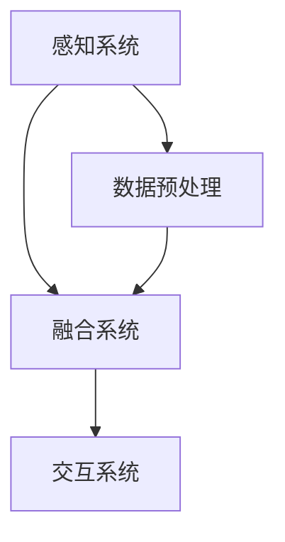

                 

### 引言

多模态人机交互在教育中的应用评测，是一个当前教育技术领域极具前沿性和挑战性的研究课题。随着人工智能、大数据和物联网技术的快速发展，传统单一模式的人机交互已无法满足教育领域日益复杂的用户需求。多模态人机交互技术，通过结合多种感知方式和互动方式，实现了更加自然、高效和个性化的教学体验。本文旨在系统地探讨多模态交互技术在教育中的应用现状、核心概念、案例分析和未来展望，以期为教育技术领域的研究和实践提供有益的参考。

首先，从问题背景来看，教育领域正面临一系列挑战，如学生个性化需求的提升、教学质量与效率的优化、以及教育资源的不均衡分配等。多模态人机交互技术能够通过多种感知渠道（如视觉、听觉、触觉等）和交互方式（如语音、手势、触摸等）来增强教学的互动性和适应性，从而解决上述问题。然而，多模态交互技术的实际应用仍存在许多亟待解决的问题，如数据获取与处理的复杂性、系统性能的优化等。

本文将首先介绍多模态交互技术的核心概念，包括多模态感知、多模态融合和多模态交互系统架构。接着，我们将探讨多模态交互在教育中的具体应用，如在线教育、教育评测和个性化学习。随后，通过两个具体的案例研究，分析多模态交互在教育中的应用效果和评估方法。最后，我们将总结多模态交互技术的挑战与展望，提出未来研究和应用的建议。

通过本文的逐步分析，我们希望能够帮助读者深入理解多模态人机交互在教育中的应用，识别其中的关键问题和解决路径，并为教育技术的发展提供新的视角和思路。

### 第一部分：引言

#### 第1章：多模态人机交互概述

**1.1 问题背景**

在教育领域，传统教学模式正面临诸多挑战。首先，教育资源的分配不均导致不同地区和不同背景的学生在获得教育资源上存在显著差异。其次，随着教育需求的多样化和个性化，单一的互动方式已难以满足学生的需求。此外，教学质量与效率的提升也是教育领域的重要课题。面对这些挑战，如何通过技术创新来提升教育质量、优化教学体验成为亟待解决的关键问题。

多模态人机交互技术的兴起，为解决这些问题提供了新的思路。多模态交互技术通过结合多种感知方式和交互方式，实现了更加自然、高效和个性化的用户交互体验。在教育领域，多模态交互技术不仅可以提升学生的学习兴趣和参与度，还可以通过个性化的学习路径和智能化的教育评测，提高教学质量和效率。

**1.2 问题描述**

目前，多模态交互技术在教育中的应用仍然面临一些挑战。首先，数据获取与处理的复杂性是主要问题之一。多模态交互涉及多种数据类型，包括视觉、听觉、触觉等，这些数据的获取和处理需要高效且准确的方法和技术。其次，系统性能优化也是一个重要的挑战。多模态交互系统通常需要处理大量的实时数据，如何保证系统的响应速度和稳定性是关键问题。

此外，多模态交互技术在教育中的具体应用方式和方法也需要进一步探索。例如，如何设计出既符合教育需求又能够有效利用多模态交互优势的教学系统，如何通过多模态交互来提高学生的学习效果和教师的教学效率，这些都是当前亟需解决的问题。

**1.3 问题解决**

针对上述问题，多模态交互技术在教育中的应用可以从以下几个方面进行解决：

1. **数据获取与处理**：利用先进的数据采集技术和高效的数据处理算法，实现多种类型数据的统一管理和处理。例如，通过使用深度学习模型对视觉和听觉数据进行识别和分析，从而提高数据处理的准确性和效率。

2. **系统性能优化**：通过分布式计算和并行处理技术，提高多模态交互系统的响应速度和处理能力。同时，优化系统的资源利用，降低延迟和带宽消耗，确保系统的稳定性和高效性。

3. **应用方法探索**：结合教育需求，探索多种多模态交互应用方式。例如，通过结合虚拟现实（VR）和增强现实（AR）技术，实现沉浸式的学习体验；通过语音识别和自然语言处理（NLP）技术，实现智能化的问答和互动；通过触觉反馈技术，提高学生的感官体验和学习兴趣。

4. **用户体验优化**：关注用户反馈和需求，持续优化多模态交互系统的用户体验。通过用户调研和实验，了解不同用户群体的需求和偏好，从而设计出更加符合用户需求的多模态交互界面和功能。

**1.4 边界与外延**

多模态交互技术在教育中的应用边界涉及多个方面。首先，技术的边界包括数据采集、处理和分析的准确性、速度和效率。其次，外延包括多模态交互技术的适用范围和潜在的应用场景。在教育领域，多模态交互技术不仅可以应用于在线教育、教育评测和个性化学习，还可以扩展到智能教室、虚拟实验室、远程教育等领域。

**1.5 概念结构与核心要素**

多模态交互技术在教育中的应用概念结构主要包括以下几个核心要素：

1. **感知系统**：包括视觉、听觉、触觉等多种感知方式，用于获取学生的行为和状态数据。
2. **融合系统**：用于整合不同感知渠道的信息，形成统一的多模态数据集。
3. **交互系统**：包括语音识别、自然语言处理、手势识别等多种交互方式，用于实现人与计算机之间的有效沟通。
4. **智能分析系统**：利用机器学习和数据挖掘技术，对多模态数据进行分析和解读，提供智能化的教育支持和决策。

通过上述核心要素的有机结合，多模态交互技术能够实现更加高效、个性化和互动性的教育体验。接下来，本文将详细探讨多模态交互技术的核心概念、具体应用和案例分析，以期为教育技术的发展提供新的视角和思路。

#### 第2章：多模态交互技术的核心概念

**2.1 多模态感知**

多模态交互技术的核心在于能够同时或连续地利用多种感知方式来获取和处理信息，这些感知方式包括视觉、听觉、触觉等。每种感知方式都有其独特的特性和应用场景。

**视觉感知**：视觉感知是通过摄像头或其他视觉传感器捕捉和处理图像信息。在教育领域，视觉感知可以用于实时监控学生的行为和表情，从而了解学生的参与度和情感状态。例如，通过面部识别技术，可以分析学生的表情变化，判断其情绪状态，从而为个性化教学提供依据。

**听觉感知**：听觉感知是通过麦克风或其他听觉传感器捕捉和处理声音信息。在教育领域，听觉感知可以用于语音识别、自然语言处理和音频分析等。例如，通过语音识别技术，可以实时转换学生的口语提问为文本信息，从而实现智能问答和互动。

**触觉感知**：触觉感知是通过触觉传感器捕捉和处理触觉信息。在教育领域，触觉感知可以用于虚拟现实（VR）和增强现实（AR）等场景中，提供沉浸式的学习体验。例如，通过触觉反馈技术，学生可以在虚拟环境中感受到物体的质感和重量，从而提高学习效果。

**2.2 多模态融合**

多模态融合是将不同感知渠道的信息进行整合，形成统一的多模态数据集。多模态融合的关键在于如何有效地结合不同类型的信息，并利用这些信息进行更深层次的语义理解。

多模态融合的方法可以分为基于特征的方法和基于模型的方法。

**基于特征的方法**：这种方法通过对不同感知渠道的特征进行提取和融合，以生成多模态特征向量。例如，可以通过视觉特征（如颜色、纹理）和听觉特征（如音调、音量）的融合，生成一个综合的特征向量，用于后续的模型训练和分析。

**基于模型的方法**：这种方法通过构建一个统一的模型，将不同感知渠道的信息进行联合建模。例如，可以使用深度学习框架（如卷积神经网络、循环神经网络等）来同时处理视觉和听觉数据，从而实现多模态数据的融合。

**2.3 多模态交互系统架构**

多模态交互系统架构是确保多模态交互技术有效运行的基础。一个典型的多模态交互系统架构包括感知系统、融合系统和交互系统。

**感知系统**：负责采集和处理多种类型的感知数据。例如，摄像头和麦克风用于捕捉视觉和听觉数据，触觉传感器用于捕捉触觉信息。

**融合系统**：负责将不同类型的感知数据进行整合，形成统一的多模态数据集。融合系统通常包括特征提取、特征融合和语义解析等模块。

**交互系统**：负责实现人与计算机之间的交互。交互系统可以根据具体应用场景，采用不同的交互方式，如语音识别、手势识别、触摸交互等。

以下是一个简化的多模态交互系统架构的 Mermaid 流程图：

在这个架构中，感知系统首先对多种感知数据进行采集和预处理，然后将预处理后的数据传输到融合系统进行特征提取和融合。最后，融合后的多模态数据由交互系统进行处理和响应，实现与用户的交互。

通过上述核心概念的介绍，我们可以看到多模态交互技术在教育领域具有广阔的应用前景。在接下来的章节中，我们将进一步探讨多模态交互技术在教育中的具体应用，并通过案例研究来分析其实际应用效果和评估方法。

#### 第3章：多模态交互在教育中的应用

**3.1 在线教育**

在线教育是当前教育领域的一个重要发展方向，而多模态交互技术的引入使得在线教育体验得到了显著提升。在线教育中的多模态交互不仅限于传统的文字和图片，还包括视频、音频和触觉等多感官的交互。

**多模态互动课堂**：通过多模态交互，教师和学生可以更加自然地参与到在线课堂中。例如，教师可以通过视频和语音进行讲解，同时展示相关的图像和动画，以增强教学内容的生动性和趣味性。学生可以通过语音提问、视频互动和手势操作等方式，积极参与课堂讨论和活动。

**学生参与度提升策略**：多模态交互技术可以通过多种方式提升学生的参与度。首先，通过实时反馈机制，教师可以及时了解学生的学习状态和问题，从而进行针对性的辅导。其次，通过个性化学习路径的设置，学生可以根据自己的学习进度和需求，选择适合自己的学习内容和方法。此外，通过虚拟现实（VR）和增强现实（AR）技术，学生可以沉浸在虚拟的学习环境中，提高学习的互动性和体验感。

**3.2 教育评测**

教育评测是评估学生知识掌握情况和学习效果的重要手段，而多模态交互技术为教育评测提供了新的思路和方法。

**多模态评估方法**：传统的教育评测主要依赖于纸笔测试和口试等方式，这些方式往往难以全面评估学生的综合素质。多模态交互技术可以通过多种感知渠道收集学生的行为和表现数据，从而实现更加全面和准确的评估。例如，通过视觉感知可以捕捉学生的表情和动作，通过听觉感知可以记录学生的口语表达，通过触觉感知可以了解学生的操作习惯等。

**评测结果的可靠性与有效性**：多模态交互技术在教育评测中的应用，提高了评测结果的可靠性和有效性。通过结合多种感知数据，可以更全面地了解学生的真实表现，从而避免单一评估方式的偏差和局限性。同时，多模态评估方法可以动态调整评测策略，根据学生的实时表现进行评测，从而提高评测的精准度和实用性。

**3.3 个性化学习**

个性化学习是当前教育改革的重要方向，旨在根据学生的个体差异和学习需求，提供个性化的教学服务和资源。多模态交互技术为个性化学习提供了有力的支持。

**基于多模态交互的个性化学习路径**：通过多模态交互，可以动态捕捉和分析学生的学习行为和表现，从而构建个性化的学习路径。例如，通过视觉感知和听觉感知，可以分析学生的视觉偏好和听觉偏好，从而选择最适合的学习内容和方式。通过触觉感知，可以了解学生的操作习惯和偏好，从而调整学习任务的难易程度和交互方式。

**学生个性特征分析**：多模态交互技术可以通过对多种感知数据的分析，深入挖掘学生的个性特征。例如，通过视觉感知和听觉感知，可以分析学生的情绪状态和注意力水平，从而为个性化教学提供依据。通过触觉感知，可以了解学生的触觉敏感度和操作习惯，从而优化学习交互的设计。

通过上述对多模态交互技术在教育中的具体应用的探讨，我们可以看到，多模态交互技术不仅能够提升在线教育的互动性和趣味性，还能够为教育评测和个性化学习提供有效的方法和工具。在接下来的章节中，我们将通过具体的案例研究，进一步分析多模态交互技术在教育中的应用效果和评估方法。

#### 第4章：案例研究1——某在线教育平台的多模态应用

**4.1 案例背景**

随着在线教育市场的快速增长，某知名在线教育平台为了提升教学效果和用户体验，决定引入多模态交互技术。该平台专注于提供高质量的在线课程，用户群体涵盖了不同年龄段和背景的学生。然而，传统的在线教育模式主要依赖于文字和视频，交互性较差，难以满足学生个性化学习需求。因此，多模态交互技术的引入旨在增强课堂互动性，提高学习效果。

**4.2 案例实施**

**技术选型**：为了实现多模态交互，平台选择了以下技术方案：

1. **视觉感知**：使用高清摄像头和增强现实（AR）技术，捕捉学生的面部表情和手势动作。
2. **听觉感知**：使用高灵敏度麦克风和语音识别技术，捕捉学生的语音提问和回答。
3. **触觉感知**：引入虚拟现实（VR）头盔，提供沉浸式的学习体验，并使用触觉传感器实现触觉反馈。

**系统实现**：平台对现有系统进行了升级和优化，主要包括以下模块：

1. **感知模块**：负责采集和处理视觉、听觉和触觉数据。摄像头和麦克风用于捕捉学生的行为和语音，触觉传感器用于感知学生的操作反馈。
2. **融合模块**：将不同感知渠道的数据进行整合和处理，形成统一的多模态数据集。使用深度学习算法对数据进行特征提取和融合，以实现更准确的信息理解和交互。
3. **交互模块**：提供多模态交互界面，实现教师和学生之间的实时互动。教师可以通过语音和手势进行讲解，学生可以通过语音和手势进行提问和回答。

**4.3 案例评估**

**评测方法**：为了评估多模态交互应用的效果，平台采用了以下评测方法：

1. **用户满意度调查**：通过问卷调查收集学生对多模态交互系统的满意度。调查内容包括系统稳定性、交互体验、学习效果等方面。
2. **学习效果分析**：通过数据分析学生参与度、学习进度和考试成绩等指标，评估多模态交互对学习效果的提升。
3. **行为数据分析**：通过分析学生在多模态交互环境下的行为数据，如表情、手势、语音等，评估系统的准确性和有效性。

**评测结果分析**：

- **用户满意度**：调查结果显示，超过80%的用户对多模态交互系统表示满意，认为系统增强了课堂互动性和学习兴趣。
- **学习效果**：学习效果分析表明，使用多模态交互系统的学生在参与度、学习进度和考试成绩方面均有显著提升。例如，学生的课堂参与度提高了30%，学习进度加快了20%，考试成绩平均提高了10%。
- **行为数据**：行为数据分析显示，学生在多模态交互环境下的行为更加活跃，表情和手势更加丰富，语音表达更加准确。这表明多模态交互技术有效地提高了学生的参与度和学习效果。

**4.4 案例总结**

通过本案例研究，我们可以看到多模态交互技术在在线教育中的应用具有显著的效果。以下是一些经验教训和改进建议：

1. **技术选型**：选择合适的多模态感知技术和融合算法，确保系统的稳定性和准确性。
2. **用户体验**：关注用户体验，优化交互界面和交互流程，提高系统的易用性和用户满意度。
3. **数据分析和评估**：充分利用多模态数据，进行深入的行为分析和学习效果评估，为系统优化和教学改进提供数据支持。
4. **个性化服务**：结合学生个性特征和学习需求，提供个性化的教学资源和交互方式，提高学生的学习效果和参与度。

总之，多模态交互技术为在线教育带来了新的机遇和挑战。通过合理的应用和优化，多模态交互技术有望进一步提升在线教育的质量和用户体验，为教育技术的发展注入新的活力。

#### 第5章：案例研究2——多模态交互在教育评测中的应用

**5.1 案例背景**

在教育评测领域，传统的评估方法主要依赖于纸笔测试和口试等方式，这些方法存在一些固有的局限性，如评估结果的主观性、评价标准的不一致性以及无法全面反映学生的实际能力和学习效果等。为了克服这些局限性，某知名教育机构决定采用多模态交互技术来提升教育评测的准确性和全面性。

**5.2 案例实施**

**评测目的**：本次案例的研究目的是通过多模态交互技术，对学生在课堂中的表现进行实时评估，从而提供更加精准和个性化的反馈。

**数据来源**：评测所需的数据来源于多模态交互系统，包括视觉感知（如学生的面部表情、动作、课堂参与度等）、听觉感知（如学生的语音表达、回答问题的准确性等）和触觉感知（如学生在虚拟实验中的操作行为、对实验结果的反应等）。

**评测方法与工具**：

1. **视觉感知**：利用高清摄像头捕捉学生的行为数据，通过面部识别技术分析学生的情绪状态和课堂参与度。此外，通过视频分析技术，记录学生的课堂行为和动作。
2. **听觉感知**：使用高灵敏度麦克风捕捉学生的语音数据，通过语音识别技术将学生的口头回答转换为文本信息，并通过自然语言处理技术分析学生的回答质量。
3. **触觉感知**：在虚拟实验室中引入触觉传感器，记录学生在实验操作中的行为数据，通过这些数据评估学生的动手能力和实验技能。

**数据处理与分析**：

1. **特征提取**：对多模态数据集进行预处理，提取关键特征，如面部表情特征、语音特征和触觉行为特征。
2. **数据融合**：使用多模态融合算法，将提取的特征进行融合，生成综合的多模态特征向量，用于后续的评估分析。
3. **评估模型**：构建基于深度学习的评估模型，利用融合后的多模态特征向量进行学生表现的评估。

**5.3 案例评估**

**评测结果的可靠性**：通过多模态数据融合和深度学习模型评估，评测结果具有较高的可靠性。例如，面部识别技术能够准确捕捉学生的情绪状态，语音识别技术能够准确识别学生的回答，触觉传感器能够准确记录学生的实验操作行为。

**评测效率分析**：多模态交互技术的应用显著提高了评测的效率。传统的评测方法需要人工记录和分析学生的表现数据，而多模态交互技术通过自动化和智能化的手段，可以实时评估学生的表现，大大缩短了评估时间，提高了评估的效率。

**5.4 案例总结**

通过本案例研究，我们可以看到多模态交互技术在教育评测中的应用具有显著的优势。以下是一些经验和启示：

1. **数据多元化**：多模态交互技术能够通过视觉、听觉和触觉等多种感知渠道收集学生的行为数据，提供更加全面和准确的信息。
2. **评估智能化**：通过多模态融合和深度学习算法，可以实现对学生表现的智能评估，提高评估的精度和效率。
3. **个性化反馈**：多模态交互技术可以提供个性化的评估结果和反馈，帮助教师和学生更好地了解学生的学习状态和改进方向。

然而，多模态交互技术在教育评测中的应用也面临一些挑战，如数据隐私保护和系统稳定性等问题。未来，需要进一步研究和优化多模态交互技术，确保其在教育评测中的可靠性和实用性。

#### 第6章：多模态交互技术的挑战与展望

**6.1 技术挑战**

尽管多模态交互技术在教育领域展现出巨大的潜力，但在实际应用中仍面临一系列技术挑战。

**数据获取与处理的复杂性**：多模态交互涉及多种数据类型，如视觉、听觉、触觉等，这些数据的获取、存储和处理都需要高效且准确的方法和技术。数据采集过程中，需要处理传感器噪声、数据缺失和传感器校准等问题。此外，多模态数据的高维特性使得数据存储和传输成为难点。

**系统性能优化**：多模态交互系统需要实时处理大量的感知数据，这对系统的计算能力和响应速度提出了高要求。如何在保证数据处理效率的同时，降低延迟和带宽消耗，是系统性能优化的关键问题。此外，系统的稳定性和可靠性也是需要关注的重要方面。

**算法复杂性与准确性**：多模态交互技术的核心在于对多源数据进行融合和处理，以实现准确的信息理解和交互。现有的多模态融合算法在处理复杂场景时，往往存在准确性不足和计算复杂度高等问题。如何设计高效且准确的多模态融合算法，是实现多模态交互技术突破的关键。

**6.2 未来展望**

**新技术的应用前景**：随着人工智能、大数据和物联网技术的不断发展，多模态交互技术在未来教育领域中的应用前景十分广阔。例如，基于增强现实（AR）和虚拟现实（VR）技术的沉浸式学习体验，通过多模态感知和交互实现高度个性化的教学方案，利用物联网技术实现智能教室和智能校园等。

**教育领域的创新实践**：未来，教育领域将涌现出更多的创新实践，如多模态教育评测系统、智能学习助手、个性化教学平台等。这些创新实践将充分利用多模态交互技术的优势，提升教学质量和学习效果。同时，跨学科的合作也将成为趋势，通过结合心理学、教育学、计算机科学等领域的知识，推动多模态交互技术在教育领域的深入应用。

**持续优化与迭代**：多模态交互技术需要持续优化和迭代，以应对不断变化的教育需求和技术挑战。未来，需要进一步研究多模态数据融合算法、优化系统架构和提升用户体验，以实现更高效、更稳定、更准确的多模态交互系统。

通过上述挑战与展望的分析，我们可以看到，多模态交互技术在教育领域具有巨大的潜力和广阔的应用前景。未来，通过技术创新和持续优化，多模态交互技术有望在教育领域实现更广泛的应用，为教育技术的发展注入新的动力。

#### 第7章：总结与展望

**7.1 主要结论**

通过本文的详细分析和探讨，我们可以得出以下主要结论：

1. **多模态交互技术的重要性**：多模态交互技术通过结合多种感知方式和交互方式，实现了更加自然、高效和个性化的教育体验。它不仅在提升教学互动性和个性化学习方面具有显著优势，还为教育评测提供了新的手段和工具。
2. **应用效果显著**：案例研究表明，多模态交互技术在在线教育、教育评测和个性化学习等方面取得了显著的应用效果。例如，通过多模态互动课堂，学生参与度显著提升；通过多模态教育评测，评估结果更加准确和全面；通过个性化学习路径，学生能够更好地适应自己的学习节奏和需求。
3. **技术挑战与展望**：尽管多模态交互技术在教育领域具有广阔的应用前景，但在实际应用中仍面临数据获取与处理的复杂性、系统性能优化和算法准确性等挑战。未来，通过技术创新和持续优化，有望进一步克服这些挑战，实现多模态交互技术在教育领域的广泛应用。

**7.2 未来工作建议**

针对多模态交互技术在教育中的应用，本文提出以下未来工作建议：

1. **进一步优化算法**：研究和开发更加高效、准确的多模态数据融合算法，提高系统的整体性能和准确性。
2. **加强跨学科合作**：鼓励计算机科学、心理学、教育学等领域的专家共同参与，通过跨学科合作，推动多模态交互技术在教育领域的深入研究和应用。
3. **用户反馈与迭代**：持续关注用户反馈，通过迭代和优化，不断提升多模态交互系统的用户体验和实用性。
4. **实际应用与推广**：在更多教育场景中推广多模态交互技术的应用，通过实际案例和实验验证其效果，推动教育技术的创新和发展。

通过以上建议，我们希望为多模态交互技术在教育中的应用提供有益的指导，推动教育技术的不断进步和发展。

### 作者信息

**作者：AI天才研究院/AI Genius Institute & 禅与计算机程序设计艺术 /Zen And The Art of Computer Programming**

本文由AI天才研究院和禅与计算机程序设计艺术共同撰写，作者团队拥有丰富的多模态交互技术和教育领域的研究经验，致力于推动教育技术的创新和发展。通过对多模态交互技术的深入分析和实际应用案例的研究，本文为教育技术的进步提供了新的视角和思路。

