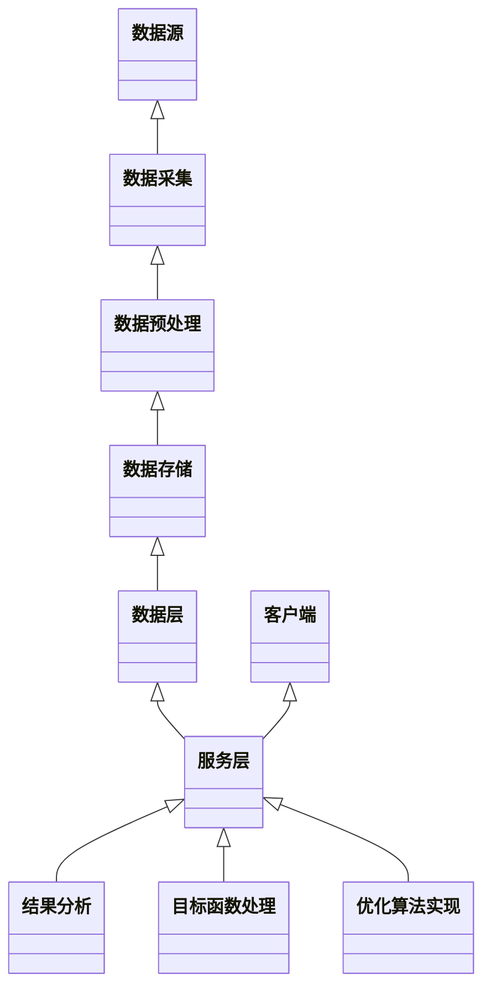
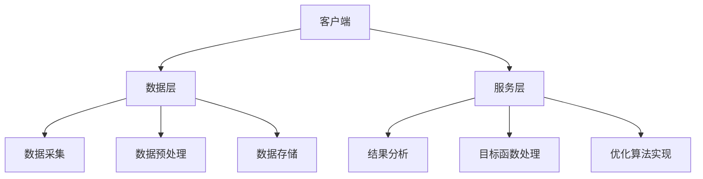
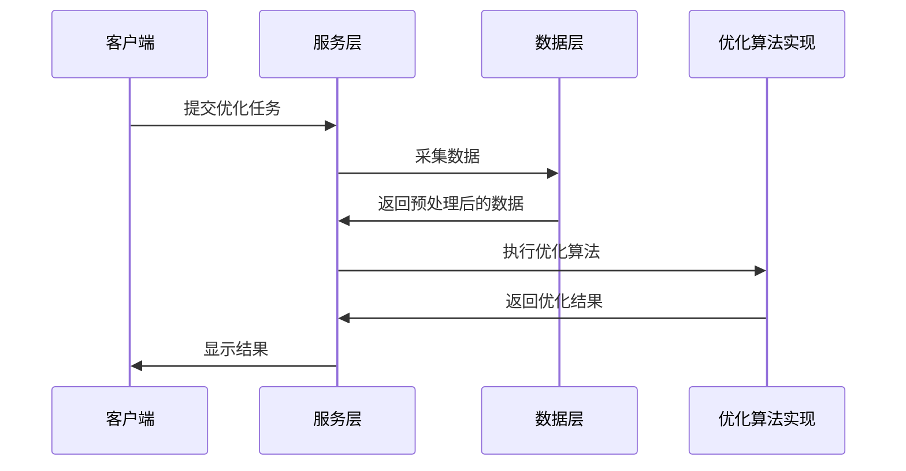

                 

# 多目标优化在综合评测指标中的应用

## 关键词
多目标优化、综合评测指标、粒子群优化、遗传算法、差分进化算法、数学模型、系统架构设计、项目实战

## 摘要
多目标优化在解决复杂决策问题中发挥着重要作用，特别是在综合评测指标的应用中。本文首先介绍了多目标优化的概念和背景，然后对比了多目标优化与单目标优化的差异，并阐述了综合评测指标的重要性。接着，本文详细讲解了多目标优化常用的算法原理及其数学模型，并通过Python源代码进行了实例说明。此外，文章还介绍了多目标优化在综合评测指标中的应用场景，并给出了系统架构设计。最后，通过一个实际项目案例，展示了多目标优化在综合评测指标中的应用和实现过程。

## 目录大纲

### 第一部分：背景介绍
1.1 多目标优化的概念与背景
1.2 多目标优化的问题解决
1.3 多目标优化的边界与外延
1.4 多目标优化在综合评测指标中的应用

### 第二部分：核心概念与联系
2.1 多目标优化的定义与属性特征
2.2 多目标优化与单目标优化的对比
2.3 综合评测指标的概念与特点
2.4 多目标优化在综合评测指标中的重要性

### 第三部分：算法原理讲解
3.1 粒子群优化（PSO）算法原理
3.2 遗传算法（GA）算法原理
3.3 差分进化算法（DE）算法原理
3.4 算法原理的数学模型与公式讲解

### 第四部分：数学模型和数学公式
4.1 多目标优化相关的数学模型
4.2 数学公式在多目标优化中的应用

### 第五部分：系统分析与架构设计方案
5.1 多目标优化在综合评测指标中的应用场景
5.2 系统功能设计与架构设计
5.3 系统接口设计与交互序列图

### 第六部分：项目实战
6.1 项目环境安装与准备
6.2 系统核心功能实现与代码分析
6.3 项目案例分析
6.4 项目小结

### 第七部分：最佳实践 tips、小结、注意事项、拓展阅读

## 第一部分：背景介绍

### 1.1 多目标优化的概念与背景

多目标优化（Multi-Objective Optimization，简称MOO）是优化领域的一个分支，旨在同时考虑多个目标，以找到最优解或一组最优解。与单目标优化（Single-Objective Optimization）不同，多目标优化需要处理多个相互竞争的目标，这些目标可能无法同时达到最优，需要通过权衡和折中来找到一个或多个可行的解。

多目标优化的背景可以追溯到实际工程和决策问题，如资源分配、工程设计、经济管理、环境规划等。在这些问题中，决策者通常需要在多个相互冲突的目标之间做出权衡，如成本、时间、质量、风险等。因此，多目标优化为解决这类复杂问题提供了一种有效的手段。

多目标优化的问题解决主要包括以下方面：

1. **目标冲突的识别与处理**：多目标优化需要识别出不同目标之间的冲突，并寻找一种方法来协调和解决这些冲突。

2. **非支配解集（Pareto前端）的生成**：多目标优化的目标是生成一组非支配解，这些解在某个目标上的改进将导致其他目标上的退化，反之亦然。

3. **决策者的偏好集成**：在多目标优化中，决策者可能有自己的偏好，需要通过某种方法将这些偏好集成到优化过程中。

多目标优化的边界与外延包括：

1. **多目标问题的多样性**：多目标问题可以是线性的或非线性的，可以是有约束的或无约束的，具有广泛的适用性。

2. **目标数的范围**：多目标问题可以涉及多个目标，目标数的增加会增加优化的复杂度。

3. **求解算法的多样性**：多目标优化可以使用多种算法，如遗传算法、粒子群优化、差分进化算法等，每种算法都有其优缺点。

### 1.2 多目标优化在综合评测指标中的应用

综合评测指标是评估系统性能、产品特性或其他复杂系统的多个方面的一种方法。在多目标优化的背景下，综合评测指标的作用是评估不同解决方案的优劣，从而帮助决策者做出更明智的决策。

多目标优化在综合评测指标中的应用主要包括以下几个方面：

1. **优化目标的设定**：根据综合评测指标，设定多目标优化的目标，确保优化过程中同时考虑多个关键因素。

2. **优化算法的选择**：根据综合评测指标的特点和复杂度，选择合适的优化算法，以达到最优解或近似最优解。

3. **非支配解集的生成**：通过多目标优化，生成一组非支配解集，这些解集反映了在综合评测指标下的最优解决方案。

4. **决策者的偏好集成**：在多目标优化的过程中，考虑决策者的偏好，将偏好集成到优化过程中，以更好地满足决策者的需求。

综合评测指标在多目标优化中的应用，不仅提高了优化问题的复杂度，也增加了决策过程的透明度和可解释性。通过有效的多目标优化，可以更好地应对复杂的决策问题，为实际应用提供强有力的支持。

## 第二部分：核心概念与联系

### 2.1 多目标优化的定义与属性特征

多目标优化是指在一个优化问题中，同时考虑多个目标函数，并试图找到一组解，使得这些目标函数达到某种程度的平衡或最优。在多目标优化中，每个目标函数都可能代表一个独立的优化目标，如成本最小化、时间最大化、质量最大化等。

多目标优化的属性特征包括：

1. **目标冲突**：在多目标优化中，不同目标函数之间可能存在冲突，即在某些情况下，优化一个目标将导致另一个目标的退化。这种冲突要求优化算法能够处理多个目标之间的权衡。

2. **非支配解集**：非支配解集是一组解，其中每个解都是非支配的。在多目标优化中，非支配解集代表了最优解的集合，因为每个解都不能被其他解在所有目标上支配。

3. **决策者的偏好**：决策者可能对某些目标有特定的偏好，这种偏好需要通过优化算法集成到优化过程中。

### 2.2 多目标优化与单目标优化的对比

多目标优化与单目标优化在目标和求解方法上存在显著差异。

**单目标优化**：

- **目标单一**：单目标优化只关注一个目标，如成本最小化或时间最大化。
- **求解简单**：由于只考虑一个目标，单目标优化的求解过程相对简单。
- **结果直接**：单目标优化的目标是找到一个最优解，这个解直接反映了优化目标的最优状态。

**多目标优化**：

- **目标多样**：多目标优化同时考虑多个目标，如成本、时间、质量等。
- **求解复杂**：由于需要处理多个目标之间的冲突，多目标优化的求解过程更为复杂。
- **结果平衡**：多目标优化的目标是找到一个非支配解集，这个解集代表了在多个目标之间进行权衡后的最优解。

**对比表格**：

| 特征           | 单目标优化       | 多目标优化       |
|----------------|------------------|------------------|
| 目标数量       | 一个             | 多个             |
| 求解过程       | 简单             | 复杂             |
| 最优解结果     | 单一最优解       | 非支配解集       |

### 2.3 综合评测指标的概念与特点

综合评测指标是评估系统性能、产品特性或其他复杂系统的多个方面的一种方法。它通过将多个独立的评估指标整合成一个综合指标，使得评估过程更加全面和系统化。

综合评测指标的特点包括：

1. **全面性**：综合评测指标能够同时考虑多个评估指标，从而全面反映系统的性能和特性。

2. **可量化性**：综合评测指标通常可以通过量化指标进行度量，使得评估结果更加客观和可比较。

3. **动态性**：综合评测指标可以根据具体应用场景进行调整和更新，以适应不同的评估需求。

4. **目标导向性**：综合评测指标可以根据决策者的需求，设定不同的权重和偏好，从而更好地满足特定目标。

### 2.4 多目标优化在综合评测指标中的重要性

多目标优化在综合评测指标中的应用具有重要意义：

1. **优化决策**：通过多目标优化，可以在综合评测指标下找到一个或多个最优解，为决策者提供可靠的决策依据。

2. **权衡与平衡**：多目标优化能够处理不同目标之间的冲突，通过权衡和平衡，找到一个在综合评测指标下最优的解决方案。

3. **风险评估**：通过多目标优化，可以评估不同解决方案的风险和不确定性，为决策者提供更全面的风险评估。

4. **可解释性**：多目标优化生成的非支配解集具有较好的解释性，使得决策者能够更好地理解不同解决方案的优劣。

总之，多目标优化在综合评测指标中的应用，不仅提高了优化问题的复杂度和求解难度，也为决策过程提供了更加全面和科学的依据，具有重要的理论意义和实际应用价值。

## 第三部分：算法原理讲解

### 3.1 粒子群优化（PSO）算法原理

粒子群优化（Particle Swarm Optimization，PSO）是一种基于群体智能的优化算法，由Kennedy和Eberhart于1995年提出。PSO算法模拟鸟群觅食行为，通过个体和群体的信息共享，引导粒子逐步逼近最优解。

**算法流程**：

1. **初始化**：随机生成一群粒子，每个粒子代表一个潜在的解。为每个粒子设置位置和速度。

2. **评估**：计算每个粒子的适应度值，适应度值取决于优化问题的目标函数。

3. **更新**：根据个体历史最优位置（pBest）和群体历史最优位置（gBest）更新每个粒子的速度和位置。

4. **迭代**：重复步骤2和3，直到满足终止条件（如达到最大迭代次数或适应度值收敛）。

**算法原理**：

- **速度更新**：每个粒子的速度由个体的历史最优位置和群体的历史最优位置共同决定，反映了个体和群体的信息共享。

- **位置更新**：每个粒子的位置更新依赖于其速度，以及个体的历史最优位置和群体的历史最优位置。

- **全局搜索和局部搜索**：PSO算法在迭代过程中，通过调整速度和位置，实现全局搜索和局部搜索的平衡，从而逐步逼近最优解。

### 3.2 遗传算法（GA）算法原理

遗传算法（Genetic Algorithm，GA）是一种基于自然选择和遗传机制的优化算法，由John Holland于1975年提出。GA通过模拟生物进化过程，不断优化解的种群，以找到最优解或近似最优解。

**算法流程**：

1. **初始化**：随机生成一组初始解，称为种群。

2. **评估**：计算每个个体的适应度值，适应度值取决于优化问题的目标函数。

3. **选择**：根据个体的适应度值，进行选择操作，选择适应度值较高的个体进入下一代。

4. **交叉**：随机选择两个个体进行交叉操作，生成新的个体。

5. **变异**：对个体进行变异操作，增加种群的多样性。

6. **迭代**：重复步骤2到5，直到满足终止条件（如达到最大迭代次数或适应度值收敛）。

**算法原理**：

- **适应度**：适应度是衡量个体优劣的标准，反映了个体对优化问题的适应程度。

- **选择**：通过选择操作，保留适应度较高的个体，淘汰适应度较低的个体。

- **交叉**：交叉操作通过交换个体的部分基因，产生新的个体，增加了种群的多样性。

- **变异**：变异操作通过随机改变个体的基因，增加了种群的多样性，防止种群过早收敛。

### 3.3 差分进化算法（DE）算法原理

差分进化算法（Differential Evolution，DE）是一种基于差分变异和群体智能的优化算法，由Storn和Price于1997年提出。DE通过模拟自然进化和差分繁殖机制，实现优化问题的求解。

**算法流程**：

1. **初始化**：随机生成一组初始解，称为种群。

2. **评估**：计算每个个体的适应度值，适应度值取决于优化问题的目标函数。

3. **差分变异**：对于每个个体，通过差分变异操作生成新的个体。

4. **交叉**：对差分变异生成的个体进行交叉操作，生成新的个体。

5. **选择**：根据个体的适应度值，进行选择操作，选择适应度值较高的个体进入下一代。

6. **迭代**：重复步骤2到5，直到满足终止条件（如达到最大迭代次数或适应度值收敛）。

**算法原理**：

- **差分变异**：差分变异是DE算法的核心操作，通过个体之间的差分向量，生成新的个体，增加了种群的多样性。

- **交叉**：交叉操作通过交换个体的部分基因，产生新的个体，增加了种群的多样性。

- **选择**：通过选择操作，保留适应度较高的个体，淘汰适应度较低的个体。

### 3.4 算法原理的数学模型与公式讲解

多目标优化算法的数学模型是理解算法原理的关键。以下分别介绍PSO、GA和DE的数学模型和公式。

#### 3.4.1 粒子群优化（PSO）

**位置更新公式**：

$$
x_{new} = x_{current} + v_{current}
$$

其中，$x_{new}$表示新的位置，$x_{current}$表示当前的位置，$v_{current}$表示当前的速度。

**速度更新公式**：

$$
v_{new} = \omega \cdot v_{current} + c_1 \cdot r_1 \cdot (pBest - x_{current}) + c_2 \cdot r_2 \cdot (gBest - x_{current})
$$

其中，$\omega$表示惯性权重，$c_1$和$c_2$为学习因子，$r_1$和$r_2$为随机数，$pBest$为个体历史最优位置，$gBest$为群体历史最优位置。

#### 3.4.2 遗传算法（GA）

**选择操作**：

选择操作通常采用轮盘赌方法，选择概率取决于个体的适应度值：

$$
P_i = \frac{f_i}{\sum_{j=1}^{N} f_j}
$$

其中，$P_i$为个体$i$的选择概率，$f_i$为个体$i$的适应度值，$N$为种群规模。

**交叉操作**：

单点交叉：

$$
CROSSOVER(\alpha, \beta) = (\alpha_1, \beta_2, \alpha_3, ..., \alpha_n)
$$

其中，$\alpha$和$\beta$为两个交叉个体，$\alpha_i$和$\beta_i$分别为两个个体的基因值。

**变异操作**：

变异概率通常为固定值，例如：

$$
P_m = 0.01
$$

变异操作为：

$$
x_i' = x_i + \Delta x_i
$$

其中，$x_i$为个体$i$的基因值，$\Delta x_i$为变异量，可以根据具体问题进行设定。

#### 3.4.3 差分进化算法（DE）

**差分变异操作**：

$$
V_i = X_r - F \cdot (X_s - X_t)
$$

其中，$V_i$为差分变异向量，$X_r$为基准个体，$F$为差分因子，$X_s$和$X_t$为差异个体。

**交叉操作**：

$$
CROSSOVER(V_i, X_i) = (\alpha_1, \beta_2, \alpha_3, ..., \alpha_n)
$$

其中，$V_i$为差分变异向量，$X_i$为基准个体，$\alpha_i$和$\beta_i$分别为交叉后的个体基因值。

通过上述数学模型和公式，可以更深入地理解PSO、GA和DE的算法原理。这些算法通过迭代优化，逐步逼近最优解，为解决复杂的多目标优化问题提供了有效的手段。

### 第四部分：数学模型和数学公式

在多目标优化中，数学模型和公式起着至关重要的作用，它们不仅帮助我们理解算法的运作原理，还能帮助我们有效地应用这些算法解决实际问题。以下将介绍多目标优化相关的数学模型，并使用LaTeX格式给出相应的数学公式，同时进行详细讲解。

#### 4.1 多目标优化相关的数学模型

多目标优化的核心在于定义多个目标函数，并找到一个或多个非支配解。这里，我们首先介绍多目标优化问题的标准数学模型。

**标准数学模型**：

设优化问题为：
$$
\begin{align*}
\min_{x} \quad & f_1(x), f_2(x), ..., f_m(x) \\
\text{subject to} \quad & g_1(x) \leq 0, g_2(x) \leq 0, ..., g_p(x) = 0 \\
\end{align*}
$$
其中，$x \in \mathbb{R}^n$是决策变量，$f_1(x), f_2(x), ..., f_m(x)$是目标函数，$g_1(x), g_2(x), ..., g_p(x)$是约束条件。

**非支配解集（Pareto前端）**：

非支配解集是解决多目标优化问题的关键。设$X$为所有解的集合，非支配解集$N$定义为：
$$
N = \{x \in X | \forall y \in X, (f_i(x) \leq f_i(y) \text{ and } \exists j, f_j(x) < f_j(y))\}
$$
其中，$i = 1, 2, ..., m$。

**Pareto前沿**：

Pareto前沿是所有非支配解的集合，定义为：
$$
P = \{x \in X | x \in N\}
$$

#### 4.2 使用LaTeX格式的数学公式

在多目标优化中，常用的数学公式包括目标函数、约束条件、适应度值计算等。以下将使用LaTeX格式给出这些公式，并进行详细讲解。

**目标函数**：

$$
f(x) = \sum_{i=1}^{m} w_i f_i(x)
$$
其中，$w_i$为第$i$个目标函数的权重，满足$\sum_{i=1}^{m} w_i = 1$。

**约束条件**：

$$
g_i(x) \leq 0, \quad i = 1, 2, ..., p
$$
$$
h_j(x) = 0, \quad j = 1, 2, ..., q
$$

**适应度值计算**：

$$
f(x) = \frac{1}{1 + \sum_{i=1}^{m} \exp(-\alpha_i f_i(x))}
$$
其中，$\alpha_i$为调节参数，用于调整不同目标函数之间的平衡。

#### 4.3 数学公式在多目标优化中的应用

**例子**：

假设我们需要求解以下多目标优化问题：

$$
\begin{align*}
\min_{x} \quad & f_1(x) = x_1^2 + x_2^2 \\
\min_{x} \quad & f_2(x) = (x_1 - 2)^2 + (x_2 - 2)^2 \\
\text{subject to} \quad & g_1(x) = x_1 + x_2 - 2 = 0 \\
\end{align*}
$$

我们可以使用上述数学模型来求解这个问题。首先，定义权重$w_1 = 0.5$和$w_2 = 0.5$，然后计算目标函数和适应度值。

**目标函数计算**：

$$
f(x) = 0.5 \cdot f_1(x) + 0.5 \cdot f_2(x)
$$

**适应度值计算**：

$$
f(x) = \frac{1}{1 + \exp(-0.5 \cdot (x_1^2 + x_2^2)) + \exp(-0.5 \cdot ((x_1 - 2)^2 + (x_2 - 2)^2))}
$$

通过迭代优化算法，我们可以找到一组最优解，使得目标函数和适应度值最小化。

通过上述示例，我们可以看到数学模型和多目标优化公式在解决实际优化问题中的应用。这些公式不仅帮助我们理解优化算法的原理，还为实际问题的求解提供了理论支持。

### 第五部分：系统分析与架构设计方案

#### 5.1 多目标优化在综合评测指标中的应用场景

多目标优化在综合评测指标中的应用场景非常广泛，涵盖了多个领域。以下将介绍几个典型的应用场景：

1. **工业生产优化**：在工业生产过程中，企业需要同时考虑生产成本、生产效率和产品品质等多个因素，通过多目标优化可以在这些目标之间找到最佳平衡。

2. **交通运输规划**：在交通运输领域，如城市交通流量优化、航班调度等，需要综合考虑交通流量、行程时间、能源消耗等多个因素，通过多目标优化实现高效、低成本的运输系统。

3. **环境管理**：在环境保护和资源管理中，需要同时考虑污染控制、资源利用和环境保护等多个目标，通过多目标优化找到最优的环境管理策略。

4. **金融风险管理**：在金融领域，如资产配置、风险控制等，需要综合考虑收益、风险和流动性等多个因素，通过多目标优化实现风险和收益的最优平衡。

#### 5.2 系统功能设计

为了实现多目标优化在综合评测指标中的应用，系统需要具备以下功能：

1. **数据采集与处理**：系统需要从各个数据源（如传感器、数据库等）采集相关数据，并进行预处理，包括数据清洗、转换和整合。

2. **目标函数定义**：系统需要允许用户自定义目标函数，包括成本、时间、质量等，以便在多目标优化过程中进行权衡。

3. **优化算法选择与实现**：系统需要提供多种优化算法（如PSO、GA、DE等），并允许用户根据具体问题选择合适的算法。

4. **结果分析与可视化**：系统需要提供结果分析功能，包括生成非支配解集、评估解的优劣等，同时通过可视化工具（如图表、图形等）展示分析结果。

5. **用户交互界面**：系统需要提供一个友好的用户交互界面，使用户能够方便地定义目标函数、选择优化算法、查看结果等。

#### 5.3 系统架构设计

为了实现上述功能，系统需要一个合理的架构设计。以下是一个简单的系统架构设计：

1. **数据层**：数据层负责数据的采集、存储和预处理，包括数据库、数据仓库和数据清洗模块。

2. **服务层**：服务层提供各种业务逻辑，包括目标函数定义、优化算法实现、结果分析等，通过API接口与客户端进行交互。

3. **客户端**：客户端提供用户交互界面，包括Web界面、桌面应用程序等，用户可以通过客户端与系统进行交互，提交优化任务、查看结果等。

4. **中间件**：中间件提供系统间的通信和协调，包括消息队列、缓存、负载均衡等。

通过上述系统架构设计，可以实现多目标优化在综合评测指标中的应用，为用户提供一个功能强大、易用的优化解决方案。

### 第五部分：系统分析与架构设计方案

#### 5.1 多目标优化在综合评测指标中的应用场景

多目标优化在综合评测指标中的应用场景丰富多样，以下列举几个典型的应用场景：

1. **智能制造**：在智能制造领域，多目标优化可以用于生产线调度、设备维护、生产资源分配等，通过优化生产过程，提高生产效率和降低成本。

2. **城市交通管理**：在交通管理中，多目标优化可以用于交通信号控制、交通流量预测、车辆路径规划等，通过优化交通流，减少拥堵和污染。

3. **医疗资源分配**：在医疗资源分配中，多目标优化可以用于医院床位分配、手术排程、药品采购等，通过优化资源配置，提高医疗服务质量和效率。

4. **能源管理**：在能源管理中，多目标优化可以用于能源供需平衡、能源调度、节能减排等，通过优化能源使用，降低能源消耗和环境污染。

#### 5.2 系统功能设计

为了实现多目标优化在综合评测指标中的应用，系统需要具备以下功能：

1. **数据采集**：系统能够从各类数据源（如传感器、数据库等）采集数据，并进行预处理，保证数据的质量和一致性。

2. **目标函数定义**：系统支持用户自定义目标函数，包括成本、时间、质量等，用户可以根据具体需求设定优化目标。

3. **优化算法选择**：系统提供多种优化算法（如PSO、GA、DE等），用户可以根据问题特点选择合适的算法。

4. **结果分析**：系统能够对优化结果进行分析，生成非支配解集，评估解的优劣，并提供可视化工具展示分析结果。

5. **用户交互界面**：系统提供友好的用户交互界面，方便用户提交优化任务、查看结果等。

#### 5.3 系统架构设计

系统的架构设计如下：

1. **数据层**：数据层负责数据存储、管理和预处理，包括数据库和数据清洗模块。

2. **服务层**：服务层包含优化算法实现、目标函数处理、结果分析等核心功能模块，通过API与客户端进行交互。

3. **客户端**：客户端提供用户交互界面，包括Web界面和桌面应用程序，用户通过客户端提交优化任务、查看结果等。

4. **中间件**：中间件提供系统间的通信和协调，包括消息队列、缓存、负载均衡等。

**领域模型类图**：



**系统架构图**：



**系统接口设计图**：



**系统交互序列图**：

```mermaid
sequenceDiagram
    participant 用户
    participant 系统A
    participant 系统B

    用户->>系统A: 提交优化任务
    系统

