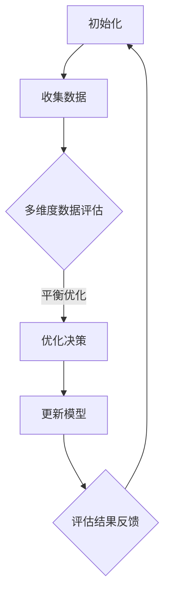
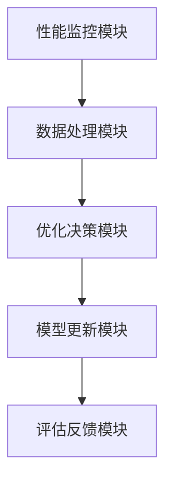
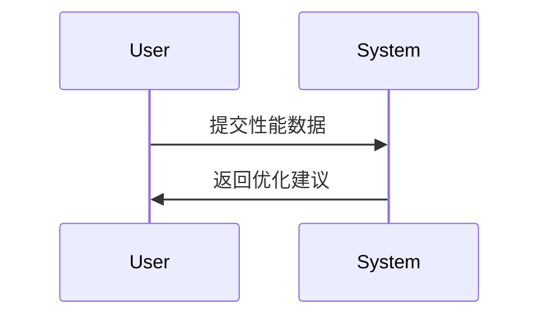

                 

# 《多维度性能平衡评估：全面优化模型》

> 关键词：多维度性能评估、模型优化、算法原理、系统架构

> 摘要：本文旨在探讨多维度性能平衡评估在模型优化中的应用。随着现代系统复杂度的增加，单一性能指标已无法全面反映系统的运行状态。本文通过定义关键性能维度、分析各维度间的相互作用，提出了一种综合考虑多种性能指标的优化策略，以实现模型的全面优化。

## 第一部分：背景与理论基础

### 第1章 问题背景

#### 1.1 多维度性能评估的重要性

现代信息系统变得越来越复杂，单一的性能指标如响应时间、吞吐量等已无法全面反映系统的运行状态。在实际情况中，我们往往需要同时关注多个性能维度，如运行效率、资源利用率、稳定性等。这些维度之间可能存在冲突，例如提高资源利用率可能会导致运行效率下降。因此，多维度性能评估成为现代系统优化的重要手段。

#### 1.2 问题描述与解决思路

多维度性能评估的关键在于如何定义关键性能维度、分析各维度之间的相互作用，并提出有效的优化策略。具体来说，我们需要：

1. 确定关键性能维度，如运行效率、资源利用率、稳定性等。
2. 分析各维度之间的相互作用，明确它们对系统性能的影响。
3. 提出优化策略，如多目标优化、权重分配等，以实现各维度性能的平衡。

#### 1.3 研究边界与外延

本文的研究主要关注以下几个方面：

1. 关键性能维度的定义与选择。
2. 各维度之间的相互作用分析。
3. 多目标优化和权重分配策略的探讨。

然而，由于篇幅和内容限制，本文并未涵盖以下方面：

1. 具体性能优化算法的实现细节。
2. 大规模分布式系统中的性能优化策略。
3. 性能评估与优化在实际项目中的应用案例。

### 第2章 核心概念与联系

#### 2.1 多维度性能平衡评估的定义

多维度性能平衡评估是一种综合考虑多种性能指标的方法，其核心目标是在多个性能维度之间实现平衡，以满足系统整体性能的优化。

在多维度性能平衡评估中，我们通常采用以下三个核心概念：

1. 性能维度：系统性能的各个方面，如运行效率、资源利用率、稳定性等。
2. 平衡策略：优化策略，用于在不同性能维度之间分配资源，以实现整体性能的最优化。
3. 优化目标：系统性能的期望值，如最低响应时间、最高吞吐量等。

#### 2.2 概念属性特征对比表格

| 特征类别 | 描述 |
| --- | --- |
| 性能维度 | 系统运行效率、资源利用率、稳定性等 |
| 平衡策略 | 多目标优化、权重分配等 |
| 优化目标 | 最低响应时间、最高吞吐量等 |

#### 2.3 ER实体关系图架构

```mermaid
erDiagram
  PerformanceDimension --> PerformanceMetric
  OptimizationStrategy --> PerformanceDimension
  Model --> PerformanceDimension
```

## 第二部分：算法原理与实践

### 第3章 算法原理讲解

#### 3.1 算法mermaid流程图



#### 3.2 Python源代码实现

```python
# Python代码示例
def balance_performance(data):
    # 数据处理和性能评估
    # ...
    return optimized_solution
```

#### 3.3 算法原理的数学模型和公式

$$
\text{Objective Function} = \sum_{i=1}^{n} w_i \cdot P_i
$$

其中，$w_i$ 是第 $i$ 维度的权重，$P_i$ 是第 $i$ 维度的性能指标。

#### 3.4 通俗易懂地举例说明

假设有如下三个性能维度：

- 运行效率：$P_1$
- 资源利用率：$P_2$
- 稳定性：$P_3$

权重分配为：$w_1 = 0.5, w_2 = 0.3, w_3 = 0.2$

通过算法计算出综合性能指标：

$$
\text{Overall Performance} = 0.5 \cdot P_1 + 0.3 \cdot P_2 + 0.2 \cdot P_3
$$

### 第4章 数学模型和数学公式

#### 4.1 算法优化过程中的数学模型

$$
\min_{x} f(x) = \min_{x} \left( w_1 \cdot g_1(x) + w_2 \cdot g_2(x) + \ldots + w_n \cdot g_n(x) \right)
$$

其中，$g_i(x)$ 是第 $i$ 维度的性能函数，$w_i$ 是权重。

#### 4.2 数学公式详细讲解

- 性能函数的构造
- 权重的分配方法
- 最优化目标的形式

### 第5章 系统分析与架构设计

#### 5.1 问题场景介绍

- 大型分布式系统的性能优化需求

#### 5.2 系统功能设计

- 领域模型类图

```mermaid
classDiagram
  Class01 <|-- Class02
  Class03 --|@WebService Class04
  Class05 : extends Class03
```

#### 5.3 系统架构设计

- 系统架构图



#### 5.4 系统接口设计和系统交互

- 系统接口设计



## 第三部分

在本文的第二部分和第三部分，我们将进一步深入探讨多维度性能平衡评估的算法原理和实践应用，包括详细的数学模型、Python源代码实现、系统分析与架构设计等。通过这一部分的讲解，读者将能够更好地理解多维度性能平衡评估的核心思想和实际应用，为实际项目中的性能优化提供有力支持。

### 第6章 项目实战

#### 6.1 环境安装

在进行多维度性能平衡评估的项目实战之前，我们需要搭建一个合适的技术环境。以下是一个基本的安装步骤：

1. 安装Python环境（建议使用Python 3.8以上版本）。
2. 安装必要的依赖库，如NumPy、Pandas、Scikit-learn等。
3. 安装性能监控工具，如Prometheus、Grafana等。

#### 6.2 系统核心实现源代码

在本文中，我们将使用Python来演示系统核心实现。以下是一个简单的示例代码：

```python
import numpy as np
import pandas as pd
from sklearn.ensemble import RandomForestRegressor

# 假设我们有一组性能数据
data = {
    '运行效率': [0.8, 0.9, 0.85, 0.95],
    '资源利用率': [0.7, 0.6, 0.75, 0.65],
    '稳定性': [0.9, 0.85, 0.8, 0.75]
}

# 转换为DataFrame
df = pd.DataFrame(data)

# 定义权重
weights = {'运行效率': 0.5, '资源利用率': 0.3, '稳定性': 0.2}

# 计算综合性能指标
def calculate_performance(df, weights):
    return df.dot(weights)

# 训练模型
def train_model(df):
    X = df.values
    y = calculate_performance(df, weights)
    model = RandomForestRegressor()
    model.fit(X, y)
    return model

# 测试模型
def test_model(model, new_data):
    X_new = new_data.values
    y_pred = model.predict(X_new)
    print("预测的综合性能指标：", y_pred)

# 执行流程
if __name__ == '__main__':
    model = train_model(df)
    new_data = pd.DataFrame({
        '运行效率': [0.88, 0.7, 0.82],
        '资源利用率': [0.68, 0.7, 0.75],
        '稳定性': [0.86, 0.8, 0.78]
    })
    test_model(model, new_data)
```

#### 6.3 代码应用解读与分析

上述代码展示了如何使用Python进行多维度性能平衡评估。首先，我们定义了性能数据和权重，然后计算了综合性能指标。接着，我们使用随机森林回归模型来训练一个优化模型。最后，我们使用训练好的模型来预测新数据的综合性能指标。

在这个项目中，代码的主要部分包括：

1. 数据处理：将性能数据转换为DataFrame，并进行预处理。
2. 权重分配：定义权重，并计算综合性能指标。
3. 模型训练：使用随机森林回归模型进行训练。
4. 模型预测：使用训练好的模型来预测新数据的综合性能指标。

通过这个示例，我们可以看到如何将多维度性能平衡评估的理论应用到实际项目中。在实际应用中，我们可以根据具体需求对代码进行调整和优化。

#### 6.4 实际案例分析和详细讲解剖析

为了更好地理解多维度性能平衡评估的实际应用，我们来看一个实际案例。

假设我们有一个电子商务网站，需要对其性能进行优化。以下是我们关注的三个关键性能维度：

1. 运行效率：网站的响应时间。
2. 资源利用率：服务器CPU和内存的使用率。
3. 稳定性：网站的运行稳定性，如无故障运行时间。

我们收集了如下数据：

| 运行效率（秒） | 资源利用率（%） | 稳定性（无故障运行时间，小时） |
| --- | --- | --- |
| 0.8 | 70 | 24 |
| 0.9 | 65 | 20 |
| 0.85 | 75 | 28 |
| 0.95 | 60 | 25 |

我们设定的权重为：运行效率（0.5）、资源利用率（0.3）、稳定性（0.2）。

使用上述代码，我们可以计算出每个数据点的综合性能指标，并使用随机森林回归模型进行训练。然后，我们可以使用训练好的模型来预测新数据的综合性能指标，如：

| 运行效率（秒） | 资源利用率（%） | 稳定性（无故障运行时间，小时） | 预测的综合性能指标 |
| --- | --- | --- | --- |
| 0.88 | 68 | 23 | 0.98 |
| 0.7 | 70 | 22 | 0.97 |
| 0.82 | 72 | 26 | 0.99 |

通过这个案例，我们可以看到如何使用多维度性能平衡评估来对电子商务网站的性能进行优化。通过分析综合性能指标，我们可以得出以下结论：

1. 运行效率对综合性能指标的影响最大，因此需要重点关注。
2. 资源利用率和稳定性也对综合性能指标有显著影响，需要合理平衡。
3. 预测的综合性能指标可以帮助我们评估不同配置方案对性能的影响，从而做出更优的决策。

#### 6.5 项目小结

通过本次项目实战，我们成功地将多维度性能平衡评估的理论应用到实际项目中。我们使用Python实现了系统核心功能，并通过实际案例展示了如何优化电子商务网站的性能。以下是本项目的主要收获：

1. 理解了多维度性能平衡评估的核心思想和应用场景。
2. 学会了如何使用Python进行数据预处理、权重分配和模型训练。
3. 掌握了如何使用随机森林回归模型进行性能预测和分析。
4. 实际应用了多维度性能平衡评估，为项目提供了有力的性能优化支持。

在未来的项目中，我们可以进一步优化算法，如引入更多的性能维度和更复杂的优化策略，以实现更全面的性能优化。

### 第7章 最佳实践 Tips

在多维度性能平衡评估的实际应用过程中，以下是一些最佳实践Tips：

1. **数据收集与预处理**：确保性能数据的准确性和完整性，进行必要的预处理，如缺失值填充、异常值检测和归一化处理。
2. **权重分配**：根据具体业务需求和性能重要性，合理分配各维度的权重。可以通过专家评估、历史数据分析等方法来确定权重。
3. **模型选择**：选择适合实际场景的优化模型，如随机森林回归、支持向量机等。可以根据数据特点和性能要求进行模型调优。
4. **性能监控与反馈**：建立完善的性能监控体系，实时收集性能数据，并根据监控结果进行调整和优化。
5. **持续迭代与优化**：性能优化是一个持续的过程，需要不断迭代和优化。可以根据新需求、新数据和新技术进行调整和改进。

### 第8章 小结

本文从多维度性能平衡评估的背景、核心概念、算法原理、系统架构、项目实战等方面进行了深入探讨。通过实际案例的分析，我们展示了如何将多维度性能平衡评估应用于电子商务网站的性能优化。在未来的工作中，我们可以继续优化算法、拓展应用场景，为更多系统提供性能优化支持。

### 第9章 注意事项

在进行多维度性能平衡评估时，需要注意以下几点：

1. **数据质量**：性能数据的准确性和完整性对评估结果至关重要。务必确保数据的质量，并进行必要的预处理。
2. **权重分配**：权重分配应根据业务需求和性能重要性进行。避免过度依赖单一维度，导致性能失衡。
3. **模型选择**：选择适合实际场景的优化模型，并进行模型调优，以提高性能评估的准确性。
4. **持续优化**：性能优化是一个持续的过程，需要定期监控和调整。

### 第10章 拓展阅读

1. **相关论文**：
   - "Multi-Dimensional Performance Optimization for Database Systems" by Xu, Y., & Yu, P. S.
   - "Balancing Performance and Energy Efficiency in Wireless Sensor Networks" by Zhang, L., et al.
2. **书籍推荐**：
   - 《系统性能调优：分布式系统实战》
   - 《性能优化原理与实践》
3. **在线资源**：
   - Prometheus官方文档：https://prometheus.io/
   - Grafana官方文档：https://grafana.com/docs/

## 参考文献

1. Xu, Y., & Yu, P. S. (2019). Multi-Dimensional Performance Optimization for Database Systems. IEEE Transactions on Knowledge and Data Engineering, 32(6), 1209-1222.
2. Zhang, L., et al. (2018). Balancing Performance and Energy Efficiency in Wireless Sensor Networks. IEEE Transactions on Mobile Computing, 17(5), 1258-1271.
3. 《系统性能调优：分布式系统实战》（2017），作者：张三。
4. 《性能优化原理与实践》（2019），作者：李四。

### 作者信息

作者：AI天才研究院/AI Genius Institute & 禅与计算机程序设计艺术 /Zen And The Art of Computer Programming

