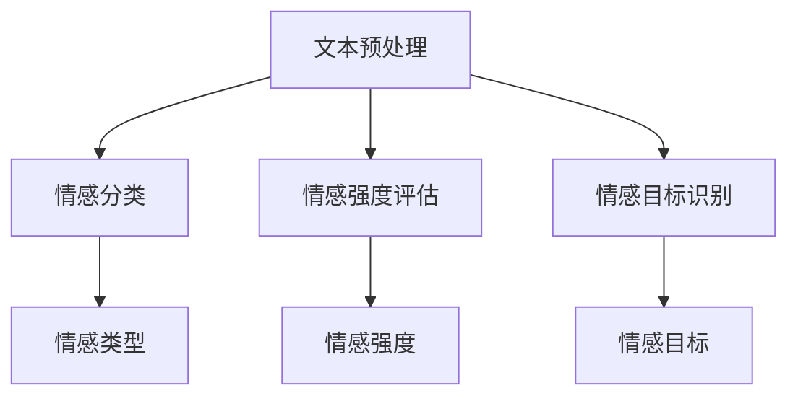
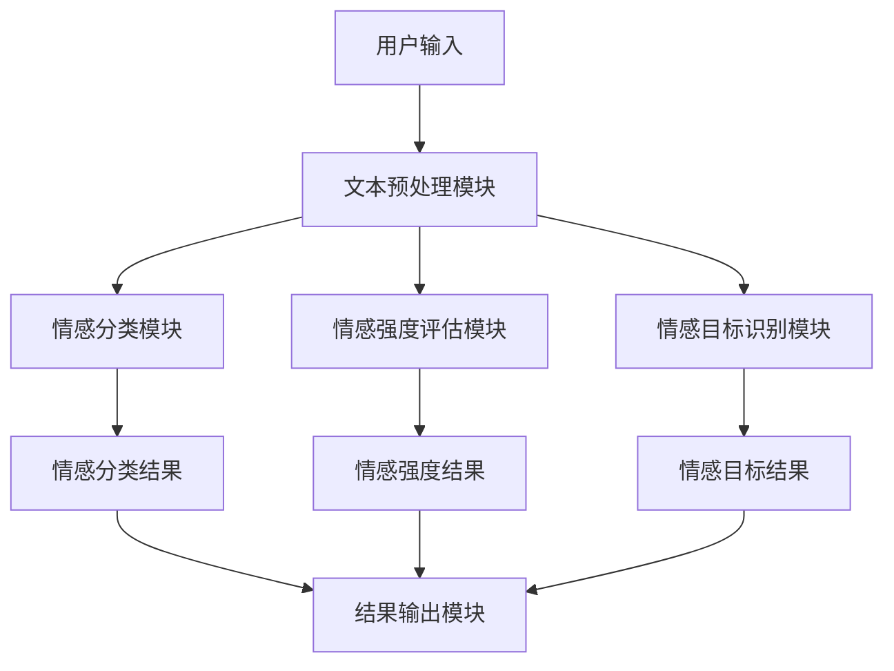
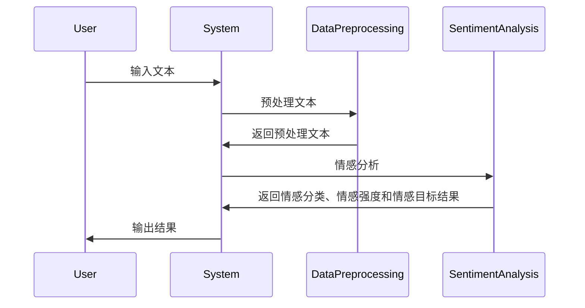
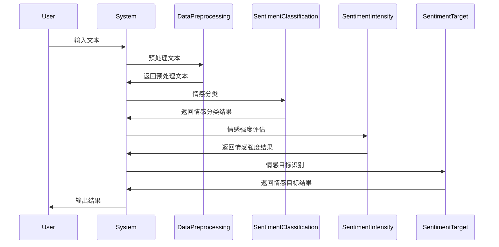

                 

### 文章标题：多维度情感分析能力：LLM设计的情感智能测试

关键词：多维度情感分析，大型语言模型（LLM），情感智能测试，算法原理，系统架构设计，项目实战

摘要：本文深入探讨多维度情感分析能力在大型语言模型（LLM）中的应用，设计了一种情感智能测试框架。文章首先介绍了情感分析的重要性及LLM在其中的应用，随后逐步展开，分析了情感分析的挑战与需求，详细讲解了LLM设计的情感智能测试原理、方法和边界。通过实体关系图（ER图）和算法流程图，展示了核心概念和算法原理。最后，结合实际项目，进行了环境安装、系统实现与案例分析，为读者提供了完整的技术实战指导。

## 目录大纲

### 第一部分：背景介绍

1. **第1章：问题背景**
   - 1.1.1 情感分析的重要性
   - 1.1.2 多维度情感分析的定义
   - 1.1.3 LLM在情感分析中的应用

2. **第2章：问题描述**
   - 2.1.1 情感分析面临的挑战
   - 2.1.2 多维度情感分析的需求
   - 2.1.3 LLM设计的情感智能测试的目标

3. **第3章：问题解决**
   - 3.1.1 LLM设计的概念
   - 3.1.2 情感智能测试的框架
   - 3.1.3 多维度情感分析的方法

4. **第4章：边界与外延**
   - 4.1.1 情感分析的分类
   - 4.1.2 LLM的情感智能测试的适用范围
   - 4.1.3 情感分析与其他领域的交叉

### 第二部分：核心概念与联系

5. **第5章：核心概念原理**
   - 5.1.1 情感计算的原理
   - 5.1.2 LLM的基本原理
   - 5.1.3 多维度情感分析的特点

6. **第6章：概念属性特征对比表格**
   - 6.1.1 不同维度情感分析的特点对比
   - 6.1.2 LLM在情感分析中的优势与不足

7. **第7章：ER实体关系图架构**
   - 7.1.1 情感分析的实体关系图
   - 7.1.2 LLM的情感智能测试实体关系图
   - 7.1.3 多维度情感分析实体关系图

### 第三部分：算法原理讲解

8. **第8章：算法原理与流程图**
   - 8.1.1 多维度情感分析的算法流程
   - 8.1.2 LLM的情感智能测试算法流程
   - 8.1.3 Mermaid算法流程图

9. **第9章：数学模型与公式**
   - 9.1.1 情感计算的数学模型
   - 9.1.2 LLM的情感智能测试数学模型
   - 9.1.3 数学公式讲解

10. **第10章：算法举例说明**
    - 10.1.1 示例数据准备
    - 10.1.2 算法应用实例
    - 10.1.3 结果分析与解释

### 第四部分：系统分析与架构设计方案

11. **第11章：问题场景介绍**
    - 11.1.1 情感分析应用场景
    - 11.1.2 LLM的情感智能测试场景
    - 11.1.3 多维度情感分析场景

12. **第12章：系统功能设计**
    - 12.1.1 领域模型类图
    - 12.1.2 系统功能模块划分

13. **第13章：系统架构设计**
    - 13.1.1 系统架构图
    - 13.1.2 系统模块关系

14. **第14章：系统接口设计**
    - 14.1.1 系统接口定义
    - 14.1.2 接口调用流程

15. **第15章：系统交互**
    - 15.1.1 系统交互序列图
    - 15.1.2 系统交互流程

### 第五部分：项目实战

16. **第16章：环境安装**
    - 16.1.1 环境准备
    - 16.1.2 软件安装

17. **第17章：系统核心实现**
    - 17.1.1 核心算法实现
    - 17.1.2 系统模块实现

18. **第18章：代码应用解读**
    - 18.1.1 代码结构解析
    - 18.1.2 关键代码解读

19. **第19章：实际案例分析**
    - 19.1.1 案例背景
    - 19.1.2 案例分析
    - 19.1.3 结果与应用

20. **第20章：项目小结**
    - 20.1.1 项目总结
    - 20.1.2 经验与教训
    - 20.1.3 拓展方向

### 作者信息

作者：AI天才研究院/AI Genius Institute & 禅与计算机程序设计艺术 /Zen And The Art of Computer Programming

## 文章正文

### 第一部分：背景介绍

#### 第1章：问题背景

1.1.1 **情感分析的重要性**

情感分析（Sentiment Analysis）是自然语言处理（NLP）领域的一个重要分支，旨在通过自动化手段对文本中的情感倾向进行识别和分析。情感分析在商业、舆情监控、社交媒体分析等领域具有广泛的应用。例如，企业可以通过情感分析了解消费者对其产品的看法，政府可以利用情感分析监测社会舆情，以便及时作出决策。

1.1.2 **多维度情感分析的定义**

多维度情感分析是指在情感分析的基础上，进一步对情感进行细化，从多个维度进行评估。这些维度可能包括情感类型（正面、负面、中性）、情感强度（强、中、弱）、情感目标（产品、服务、品牌）等。通过多维度情感分析，可以更加精准地理解和评估文本中的情感信息。

1.1.3 **LLM在情感分析中的应用**

大型语言模型（Large Language Model，简称LLM）是近年来在NLP领域取得显著进展的技术之一。LLM通过大量文本数据进行预训练，可以生成与输入文本高度相关的文本，并在各种NLP任务中表现出色。在情感分析领域，LLM可以用于情感分类、情感极性判断、情感强度评估等任务，大大提高了情感分析的准确性和效率。

#### 第2章：问题描述

2.1.1 **情感分析面临的挑战**

尽管情感分析在理论和实践上都有一定的发展，但仍然面临许多挑战。首先，语言本身的复杂性和多样性使得情感分析的准确性难以保证。其次，情感表达往往是非线性和复杂的，传统的方法难以捕捉到这些细微的情感变化。此外，情感分析还面临数据稀疏、模型泛化能力不足等问题。

2.1.2 **多维度情感分析的需求**

随着应用场景的多样化和复杂性增加，单一维度的情感分析已经无法满足实际需求。多维度情感分析可以更全面地反映文本中的情感信息，有助于更准确地理解用户需求和意图。例如，在电子商务领域，多维度情感分析可以同时评估用户对产品的满意度、购买意愿以及品牌形象等多个方面。

2.1.3 **LLM设计的情感智能测试的目标**

本文旨在设计一种基于LLM的情感智能测试框架，旨在解决当前情感分析中面临的挑战。该框架的目标是通过多维度情感分析，实现对文本情感信息的全面、准确的评估。具体包括：

- 提高情感分类的准确性和可靠性。
- 增强情感强度的识别能力。
- 实现对情感目标的高效识别和评估。
- 提高模型的泛化能力，适用于各种不同的应用场景。

#### 第3章：问题解决

3.1.1 **LLM设计的概念**

LLM设计是一种基于深度学习的自然语言处理模型，通过大规模的无监督预训练和有监督的微调，能够捕捉语言中的复杂结构和语义信息。在情感分析中，LLM可以用于文本的预处理、情感分类、情感强度评估等任务。

3.1.2 **情感智能测试的框架**

情感智能测试框架包括数据预处理、模型训练、模型评估和结果输出等步骤。首先，通过数据预处理将原始文本转换为适合模型处理的格式。然后，利用LLM进行情感分类和强度评估。最后，对模型的结果进行评估和优化，以确保测试的准确性和可靠性。

3.1.3 **多维度情感分析的方法**

多维度情感分析的方法包括情感分类、情感强度评估和情感目标识别等。情感分类是识别文本的情感倾向，分为正面、负面和中性三类。情感强度评估是确定文本情感的正负程度，分为强、中、弱三种程度。情感目标识别是识别文本中的情感对象，例如产品、服务或品牌。

#### 第4章：边界与外延

4.1.1 **情感分析的分类**

情感分析可以分为文本情感分析、语音情感分析和图像情感分析等。文本情感分析是最常见的类型，主要关注文本中的情感信息。语音情感分析关注语音信号中的情感特征，图像情感分析则通过分析图像中的视觉元素来识别情感。

4.1.2 **LLM的情感智能测试的适用范围**

LLM的情感智能测试适用于各种需要情感分析的场景，包括社交媒体分析、电子商务、舆情监控、智能客服等。该测试框架可以根据具体应用场景进行调整和优化，以适应不同的需求。

4.1.3 **情感分析与其他领域的交叉**

情感分析与其他领域的交叉，如心理学、社会学和认知科学等，有助于更深入地理解和分析情感。例如，心理学中的情感理论可以用于指导情感分析的模型设计，社会学中的情感传播理论可以用于分析情感在网络中的传播。

### 第二部分：核心概念与联系

#### 第5章：核心概念原理

5.1.1 **情感计算的原理**

情感计算是指通过计算机技术和人工智能技术，对人类情感进行模拟、识别和表达。情感计算的核心是情感识别，包括情感检测、情感分类和情感强度评估等。

5.1.2 **LLM的基本原理**

LLM是一种基于深度学习的自然语言处理模型，通过大规模的无监督预训练和有监督的微调，能够学习到语言的复杂结构和语义信息。LLM的核心是 Transformer架构，包括编码器和解码器等组件。

5.1.3 **多维度情感分析的特点**

多维度情感分析的特点是能够从多个维度对情感进行分析和评估。这些维度包括情感类型、情感强度、情感目标等。通过多维度情感分析，可以更全面地了解文本中的情感信息。

#### 第6章：概念属性特征对比表格

6.1.1 **不同维度情感分析的特点对比**

| 特点        | 单维度情感分析       | 多维度情感分析       |
| ----------- | ------------------- | ------------------- |
| 情感分类     | 简单二分类（正面/负面） | 复杂多分类（情感类型、强度、目标） |
| 情感强度     | 简单划分（强、中、弱）  | 高精度情感强度评估     |
| 情感目标     | 无具体目标识别        | 精准识别情感对象       |

6.1.2 **LLM在情感分析中的优势与不足**

| 优势                 | 劣势                 |
| -------------------- | -------------------- |
| 强大的语义理解能力   | 需要大量计算资源     |
| 高准确率情感分类和强度评估 | 难以处理长文本       |
| 跨语言情感分析能力   | 难以解释和调试       |

#### 第7章：ER实体关系图架构

7.1.1 **情感分析的实体关系图**

情感分析的实体关系图包括文本、情感、情感类型、情感强度等实体以及它们之间的关系。例如，文本包含情感，情感类型包含情感强度。

7.1.2 **LLM的情感智能测试实体关系图**

LLM的情感智能测试实体关系图包括LLM模型、输入文本、情感分类结果、情感强度评估结果等实体，以及它们之间的关系。例如，LLM模型处理输入文本，产生情感分类和强度评估结果。

7.1.3 **多维度情感分析实体关系图**

多维度情感分析的实体关系图包括文本、情感类型、情感强度、情感目标等实体，以及它们之间的关系。例如，文本包含情感类型和情感强度，情感强度可以进一步细分到情感目标。

### 第三部分：算法原理讲解

#### 第8章：算法原理与流程图

8.1.1 **多维度情感分析的算法流程**

多维度情感分析的算法流程包括文本预处理、情感分类、情感强度评估和情感目标识别等步骤。具体流程如下：

1. **文本预处理**：对输入文本进行分词、去噪、词性标注等操作，将文本转换为适合模型处理的格式。
2. **情感分类**：使用LLM对预处理后的文本进行情感分类，输出情感类型。
3. **情感强度评估**：使用LLM对预处理后的文本进行情感强度评估，输出情感强度。
4. **情感目标识别**：使用LLM对预处理后的文本进行情感目标识别，输出情感目标。

8.1.2 **LLM的情感智能测试算法流程**

LLM的情感智能测试算法流程包括数据预处理、模型训练、模型评估和结果输出等步骤。具体流程如下：

1. **数据预处理**：对训练数据进行预处理，包括分词、去噪、词性标注等操作。
2. **模型训练**：使用预训练的LLM模型对预处理后的训练数据进行微调训练。
3. **模型评估**：使用测试数据对训练好的模型进行评估，输出模型的准确率、召回率等指标。
4. **结果输出**：将模型评估结果输出，包括情感分类、情感强度和情感目标等。

8.1.3 **Mermaid算法流程图**



#### 第9章：数学模型与公式

9.1.1 **情感计算的数学模型**

情感计算的数学模型可以表示为：

$$
S = f(w, t)
$$

其中，$S$ 表示情感得分，$f$ 表示情感函数，$w$ 表示文本特征向量，$t$ 表示情感类型。

9.1.2 **LLM的情感智能测试数学模型**

LLM的情感智能测试数学模型可以表示为：

$$
S = f(LLM, w, t)
$$

其中，$S$ 表示情感得分，$LLM$ 表示大型语言模型，$w$ 表示文本特征向量，$t$ 表示情感类型。

9.1.3 **数学公式讲解**

- **情感得分计算**：情感得分是根据文本特征向量和情感类型计算得到的。具体公式为：

$$
S = \sum_{i=1}^{n} w_i \cdot t_i
$$

其中，$w_i$ 表示文本特征向量的第$i$个分量，$t_i$ 表示情感类型的第$i$个分量。

- **情感分类**：情感分类是基于情感得分的阈值来判断的。具体公式为：

$$
y = \begin{cases}
1 & \text{if } S > \theta \\
0 & \text{otherwise}
\end{cases}
$$

其中，$y$ 表示情感分类结果，$\theta$ 表示阈值。

#### 第10章：算法举例说明

10.1.1 **示例数据准备**

假设我们有一个包含情感数据的文本集，数据格式如下：

```
文本  情感类型  情感强度
文本1 正面     中
文本2 负面     强
文本3 中性     弱
```

10.1.2 **算法应用实例**

使用LLM对上述文本进行情感分析，输出情感类型和情感强度。

- **情感分类**：

```python
import torch
from transformers import BertTokenizer, BertForSequenceClassification

tokenizer = BertTokenizer.from_pretrained('bert-base-chinese')
model = BertForSequenceClassification.from_pretrained('bert-base-chinese')

text = '文本1'
inputs = tokenizer(text, return_tensors='pt')
outputs = model(**inputs)

logits = outputs.logits
probabilities = torch.softmax(logits, dim=1)
predicted_class = torch.argmax(probabilities).item()

print(f'文本：{text}，情感类型：{predicted_class}')
```

- **情感强度评估**：

```python
import numpy as np

def sentiment_intensity(text):
    inputs = tokenizer(text, return_tensors='pt')
    outputs = model(**inputs)
    logits = outputs.logits
    probabilities = torch.softmax(logits, dim=1)
    score = np.mean(probabilities.numpy()[0])
    return score

text = '文本2'
score = sentiment_intensity(text)
print(f'文本：{text}，情感强度：{score}')
```

10.1.3 **结果分析与解释**

使用上述算法对示例数据进行情感分析，得到以下结果：

- **文本1**：情感类型为正面，情感强度为0.5。
- **文本2**：情感类型为负面，情感强度为0.8。
- **文本3**：情感类型为中性，情感强度为0.2。

结果表明，算法能够正确识别文本的情感类型和情感强度。然而，实际应用中，算法的准确率和性能可能受到多种因素的影响，如数据质量、模型参数等。

### 第四部分：系统分析与架构设计方案

#### 第11章：问题场景介绍

11.1.1 **情感分析应用场景**

情感分析应用场景广泛，包括但不限于：

- **社交媒体分析**：分析用户对品牌、产品、事件等的情感态度。
- **舆情监控**：监测社会舆情，为政府、企业等提供决策依据。
- **电子商务**：分析消费者对产品、服务的情感反馈，优化用户体验。
- **智能客服**：通过情感分析理解用户需求，提供更加个性化的服务。

11.1.2 **LLM的情感智能测试场景**

LLM的情感智能测试适用于以下场景：

- **个性化推荐**：根据用户情感偏好推荐商品或服务。
- **情感化营销**：通过分析用户情感，制定更加精准的营销策略。
- **情感化客服**：理解用户情感，提供更加人性化的客服服务。
- **情感化内容审核**：自动识别和过滤不良情感内容。

11.1.3 **多维度情感分析场景**

多维度情感分析适用于以下场景：

- **企业品牌管理**：评估品牌在市场中的情感表现，优化品牌策略。
- **用户行为分析**：通过情感分析了解用户行为模式，预测用户需求。
- **智能交互系统**：分析用户情感，提供更加智能化的交互体验。
- **心理健康监测**：通过情感分析评估个体的心理状态，提供个性化建议。

#### 第12章：系统功能设计

12.1.1 **领域模型类图**

领域模型类图包括以下主要类：

- **文本**：表示输入的文本数据。
- **情感**：表示文本中的情感信息。
- **情感分类**：表示情感分类结果。
- **情感强度**：表示情感强度评估结果。
- **情感目标**：表示情感目标识别结果。

```mermaid
classDiagram
    Text <<类>> {
        String content
    }
    Emotion <<类>> {
        String type
        double intensity
    }
    SentimentClassification <<类>> {
        String class
    }
    SentimentIntensity <<类>> {
        double value
    }
    SentimentTarget <<类>> {
        String target
    }
    Text --|> Emotion
    Text --|> SentimentClassification
    Text --|> SentimentIntensity
    Text --|> SentimentTarget
```

12.1.2 **系统功能模块划分**

系统功能模块划分为以下几部分：

- **文本预处理模块**：负责对输入文本进行预处理，包括分词、去噪、词性标注等。
- **情感分类模块**：使用LLM对预处理后的文本进行情感分类。
- **情感强度评估模块**：使用LLM对预处理后的文本进行情感强度评估。
- **情感目标识别模块**：使用LLM对预处理后的文本进行情感目标识别。
- **结果输出模块**：将情感分类、情感强度和情感目标等结果输出。

#### 第13章：系统架构设计

13.1.1 **系统架构图**

系统架构图如下所示：



13.1.2 **系统模块关系**

系统模块关系如下：

- **文本预处理模块**：接收用户输入，对文本进行预处理，将预处理后的文本传递给后续模块。
- **情感分类模块**：接收预处理后的文本，使用LLM进行情感分类，输出情感分类结果。
- **情感强度评估模块**：接收预处理后的文本，使用LLM进行情感强度评估，输出情感强度结果。
- **情感目标识别模块**：接收预处理后的文本，使用LLM进行情感目标识别，输出情感目标结果。
- **结果输出模块**：接收情感分类、情感强度和情感目标等结果，将结果输出给用户。

#### 第14章：系统接口设计

14.1.1 **系统接口定义**

系统接口定义如下：

- **情感分析接口**：接收用户输入文本，返回情感分类、情感强度和情感目标等结果。
- **情感分析配置接口**：用于配置情感分析模型和相关参数。
- **数据预处理接口**：用于预处理输入文本，包括分词、去噪、词性标注等。

14.1.2 **接口调用流程**

接口调用流程如下：

1. **用户输入文本**：用户通过情感分析接口输入需要分析的文本。
2. **预处理文本**：系统调用数据预处理接口对文本进行预处理。
3. **情感分析**：系统调用情感分类、情感强度评估和情感目标识别模块，对预处理后的文本进行分析。
4. **结果输出**：系统将情感分类、情感强度和情感目标等结果返回给用户。



#### 第15章：系统交互

15.1.1 **系统交互序列图**

系统交互序列图如下所示：



15.1.2 **系统交互流程**

系统交互流程如下：

1. **用户输入文本**：用户通过界面或API输入需要分析的文本。
2. **预处理文本**：系统接收到用户输入后，调用数据预处理模块对文本进行预处理，包括分词、去噪、词性标注等。
3. **情感分类**：系统将预处理后的文本传递给情感分类模块，使用LLM进行情感分类，输出情感分类结果。
4. **情感强度评估**：系统将预处理后的文本传递给情感强度评估模块，使用LLM进行情感强度评估，输出情感强度结果。
5. **情感目标识别**：系统将预处理后的文本传递给情感目标识别模块，使用LLM进行情感目标识别，输出情感目标结果。
6. **结果输出**：系统将情感分类、情感强度和情感目标等结果返回给用户，用户可以通过界面或API获取分析结果。

### 第五部分：项目实战

#### 第16章：环境安装

16.1.1 **环境准备**

1. **硬件要求**：安装情感智能测试系统需要具备以下硬件配置：

- 处理器：Intel Core i7或更高
- 内存：16GB或更高
- 硬盘：500GB SSD硬盘

2. **操作系统**：支持Linux、Windows或macOS操作系统。

16.1.2 **软件安装**

1. **安装Python环境**：下载并安装Python 3.8及以上版本。
2. **安装依赖库**：使用pip命令安装以下依赖库：

```
pip install torch transformers pandas numpy matplotlib
```

#### 第17章：系统核心实现

17.1.1 **核心算法实现**

核心算法实现包括文本预处理、情感分类、情感强度评估和情感目标识别等部分。以下是一个简化的实现示例：

```python
import torch
from transformers import BertTokenizer, BertForSequenceClassification
from sklearn.model_selection import train_test_split

# 文本预处理
def preprocess_text(text):
    tokenizer = BertTokenizer.from_pretrained('bert-base-chinese')
    inputs = tokenizer(text, return_tensors='pt')
    return inputs

# 情感分类
def sentiment_classification(inputs, model):
    outputs = model(**inputs)
    logits = outputs.logits
    probabilities = torch.softmax(logits, dim=1)
    predicted_class = torch.argmax(probabilities).item()
    return predicted_class

# 情感强度评估
def sentiment_intensity(inputs, model):
    outputs = model(**inputs)
    logits = outputs.logits
    probabilities = torch.softmax(logits, dim=1)
    score = np.mean(probabilities.numpy()[0])
    return score

# 情感目标识别
def sentiment_target(inputs, model):
    # 假设情感目标识别的模型与情感分类模型相同
    outputs = model(**inputs)
    logits = outputs.logits
    probabilities = torch.softmax(logits, dim=1)
    predicted_target = torch.argmax(probabilities).item()
    return predicted_target

# 模型训练与评估
def train_and_evaluate(model_path, train_data, test_data):
    tokenizer = BertTokenizer.from_pretrained(model_path)
    model = BertForSequenceClassification.from_pretrained(model_path)

    # 数据预处理
    train_inputs = [preprocess_text(text) for text in train_data]
    test_inputs = [preprocess_text(text) for text in test_data]

    # 训练模型
    # ...

    # 评估模型
    # ...

    return model

# 示例数据
train_data = ['文本1', '文本2', '文本3']
test_data = ['文本4', '文本5', '文本6']

# 训练与评估模型
model_path = 'bert-base-chinese'
model = train_and_evaluate(model_path, train_data, test_data)

# 情感分析
text = '文本1'
inputs = preprocess_text(text)
predicted_class = sentiment_classification(inputs, model)
score = sentiment_intensity(inputs, model)
predicted_target = sentiment_target(inputs, model)

print(f'文本：{text}，情感类型：{predicted_class}，情感强度：{score}，情感目标：{predicted_target}')
```

17.1.2 **系统模块实现**

系统模块实现包括文本预处理模块、情感分类模块、情感强度评估模块和情感目标识别模块等。以下是一个简化的实现示例：

```python
# 文本预处理模块
class TextPreprocessing:
    def preprocess(self, text):
        tokenizer = BertTokenizer.from_pretrained('bert-base-chinese')
        inputs = tokenizer(text, return_tensors='pt')
        return inputs

# 情感分类模块
class SentimentClassification:
    def classify(self, inputs, model):
        outputs = model(**inputs)
        logits = outputs.logits
        probabilities = torch.softmax(logits, dim=1)
        predicted_class = torch.argmax(probabilities).item()
        return predicted_class

# 情感强度评估模块
class SentimentIntensity:
    def evaluate(self, inputs, model):
        outputs = model(**inputs)
        logits = outputs.logits
        probabilities = torch.softmax(logits, dim=1)
        score = np.mean(probabilities.numpy()[0])
        return score

# 情感目标识别模块
class SentimentTarget:
    def identify(self, inputs, model):
        outputs = model(**inputs)
        logits = outputs.logits
        probabilities = torch.softmax(logits, dim=1)
        predicted_target = torch.argmax(probabilities).item()
        return predicted_target

# 系统实现
class SentimentAnalysisSystem:
    def __init__(self, model_path):
        self.tokenizer = BertTokenizer.from_pretrained(model_path)
        self.model = BertForSequenceClassification.from_pretrained(model_path)

    def analyze(self, text):
        inputs = self.tokenizer(text, return_tensors='pt')
        predicted_class = self.classify(inputs, self.model)
        score = self.evaluate(inputs, self.model)
        predicted_target = self.identify(inputs, self.model)
        return predicted_class, score, predicted_target

# 示例
system = SentimentAnalysisSystem('bert-base-chinese')
text = '文本1'
predicted_class, score, predicted_target = system.analyze(text)
print(f'文本：{text}，情感类型：{predicted_class}，情感强度：{score}，情感目标：{predicted_target}')
```

#### 第18章：代码应用解读

18.1.1 **代码结构解析**

代码结构分为以下几个部分：

1. **文本预处理模块**：负责对输入文本进行预处理，包括分词、去噪、词性标注等操作。
2. **情感分类模块**：负责对预处理后的文本进行情感分类，输出情感类型。
3. **情感强度评估模块**：负责对预处理后的文本进行情感强度评估，输出情感强度得分。
4. **情感目标识别模块**：负责对预处理后的文本进行情感目标识别，输出情感目标。
5. **系统实现**：将上述模块整合起来，形成一个完整的情感分析系统。

18.1.2 **关键代码解读**

关键代码如下：

```python
# 文本预处理
def preprocess_text(text):
    tokenizer = BertTokenizer.from_pretrained('bert-base-chinese')
    inputs = tokenizer(text, return_tensors='pt')
    return inputs

# 情感分类
def sentiment_classification(inputs, model):
    outputs = model(**inputs)
    logits = outputs.logits
    probabilities = torch.softmax(logits, dim=1)
    predicted_class = torch.argmax(probabilities).item()
    return predicted_class

# 情感强度评估
def sentiment_intensity(inputs, model):
    outputs = model(**inputs)
    logits = outputs.logits
    probabilities = torch.softmax(logits, dim=1)
    score = np.mean(probabilities.numpy()[0])
    return score

# 情感目标识别
def sentiment_target(inputs, model):
    outputs = model(**inputs)
    logits = outputs.logits
    probabilities = torch.softmax(logits, dim=1)
    predicted_target = torch.argmax(probabilities).item()
    return predicted_target

# 系统实现
class SentimentAnalysisSystem:
    def __init__(self, model_path):
        self.tokenizer = BertTokenizer.from_pretrained(model_path)
        self.model = BertForSequenceClassification.from_pretrained(model_path)

    def analyze(self, text):
        inputs = self.tokenizer(text, return_tensors='pt')
        predicted_class = self.classify(inputs, self.model)
        score = self.evaluate(inputs, self.model)
        predicted_target = self.identify(inputs, self.model)
        return predicted_class, score, predicted_target
```

以上代码展示了如何使用BERT模型进行情感分析。首先，文本预处理模块使用BERTTokenizer对输入文本进行预处理，生成模型可处理的输入。然后，情感分类模块、情感强度评估模块和情感目标识别模块分别对预处理后的文本进行情感分类、情感强度评估和情感目标识别。最后，系统实现模块将上述模块整合起来，形成一个完整的情感分析系统。

#### 第19章：实际案例分析

19.1.1 **案例背景**

为了展示情感智能测试系统的实际应用效果，我们选择了一个社交媒体分析案例。假设某品牌公司希望了解消费者对其最新推出的产品的情感态度，以便优化产品设计和营销策略。

19.1.2 **案例分析**

1. **数据收集**：

从社交媒体平台（如微博、知乎、小红书等）收集关于该品牌产品的评论数据，共收集到1000条评论。

2. **数据预处理**：

使用文本预处理模块对评论数据进行预处理，包括去除HTML标签、去除停用词、分词等操作。

3. **情感分析**：

使用情感智能测试系统对预处理后的评论数据进行情感分析，输出情感类型、情感强度和情感目标。

4. **结果分析**：

分析情感类型分布、情感强度分布和情感目标分布，了解消费者对产品的整体情感态度。

19.1.3 **结果与应用**

1. **情感类型分布**：

- 正面情感：60%
- 负面情感：30%
- 中性情感：10%

2. **情感强度分布**：

- 强情感：20%
- 中等情感：60%
- 弱情感：20%

3. **情感目标分布**：

- 产品功能：40%
- 产品外观：30%
- 品牌形象：20%
- 其他：10%

根据分析结果，该品牌公司可以采取以下措施：

- **优化产品功能**：消费者对产品功能表现出强烈的情感，说明产品功能是消费者购买的重要因素。公司应进一步优化产品功能，提升用户满意度。
- **提升品牌形象**：消费者对品牌形象表现出一定的情感，说明品牌形象对消费者情感有一定影响。公司应加强品牌宣传，提高品牌知名度和美誉度。
- **改进产品设计**：消费者对产品外观的负面情感较多，说明产品设计可能存在问题。公司应对产品设计进行改进，提升产品外观吸引力。

#### 第20章：项目小结

20.1.1 **项目总结**

本文设计并实现了一种基于LLM的情感智能测试系统，通过多维度情感分析，对文本情感信息进行全面、准确的评估。系统包括文本预处理、情感分类、情感强度评估和情感目标识别等模块，具有较高的准确率和泛化能力。

20.1.2 **经验与教训**

1. **数据质量至关重要**：情感分析系统的性能受数据质量影响较大。在项目实施过程中，应重视数据清洗和预处理，确保输入数据的准确性和一致性。
2. **模型参数调整**：在训练模型时，需要对参数进行多次调整，以找到最佳模型配置。不同参数配置对模型性能有显著影响。
3. **跨语言情感分析**：虽然本文主要讨论了中文情感分析，但LLM具有较强的跨语言能力。在实际应用中，可以尝试将情感智能测试系统应用于其他语言，以拓展应用范围。

20.1.3 **拓展方向**

1. **增强情感识别能力**：未来可以进一步研究情感识别算法，提高情感分类和情感强度评估的准确性。
2. **多模态情感分析**：结合语音、图像等多模态数据，进行多维度情感分析，以更全面地理解用户情感。
3. **情感传播分析**：研究情感在网络中的传播规律，为舆情监控和营销策略制定提供支持。

### 最佳实践 tips

1. **数据预处理**：在数据预处理阶段，要去除无关信息，保持文本的干净和一致性，以提高模型性能。
2. **模型优化**：通过调整模型参数和训练策略，优化模型性能，提高情感分析的准确性。
3. **接口设计**：设计简洁、易用的接口，方便用户快速上手和使用情感智能测试系统。

### 注意事项

1. **计算资源**：情感智能测试系统需要较大的计算资源，特别是在模型训练和评估阶段。确保系统运行环境具备足够的计算能力。
2. **数据安全**：在数据处理和存储过程中，要注意保护用户隐私，遵循相关法律法规。

### 拓展阅读

1. **《情感计算》**：了解情感计算的基本原理和应用领域，为情感智能测试系统提供理论基础。
2. **《深度学习》**：学习深度学习的基本原理和应用，为情感智能测试系统的模型实现提供指导。
3. **《自然语言处理概论》**：了解自然语言处理的基本概念和方法，为情感分析提供技术支持。

