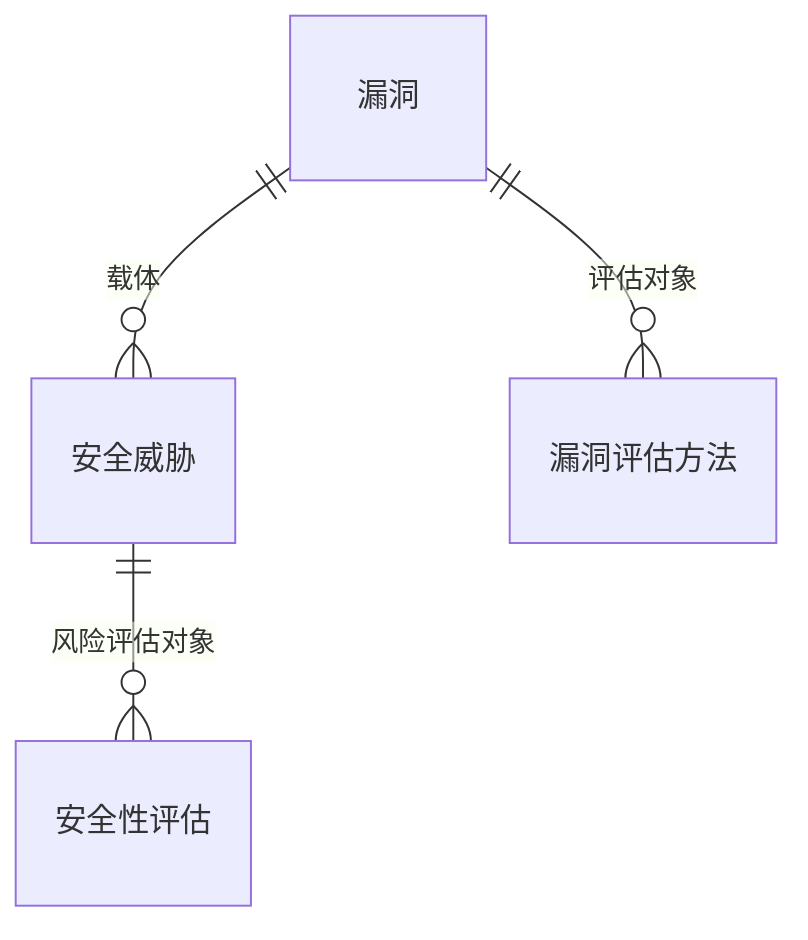
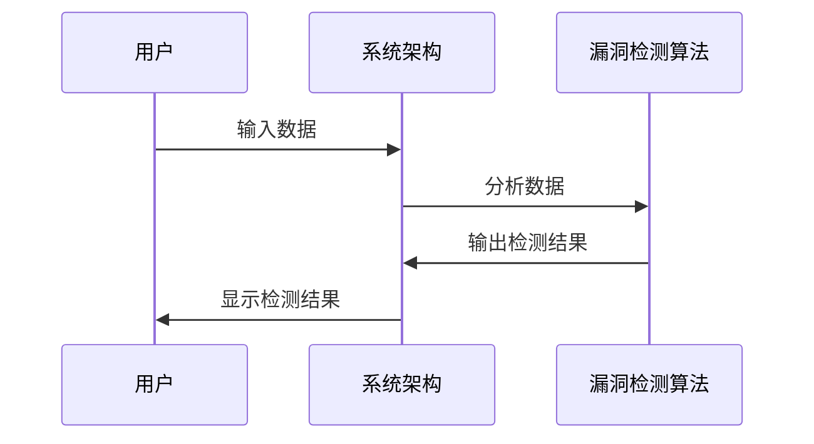
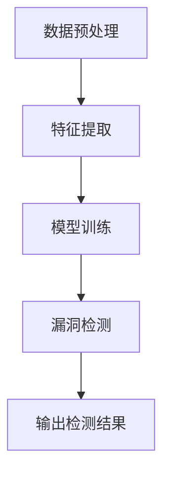
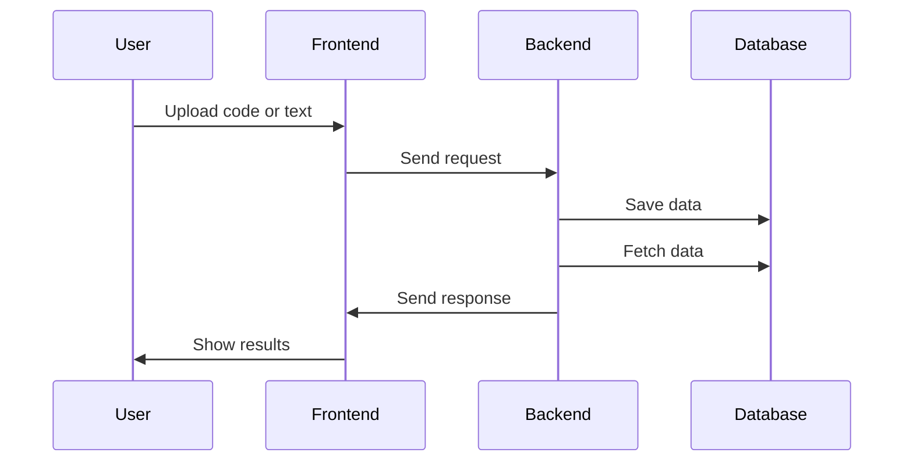
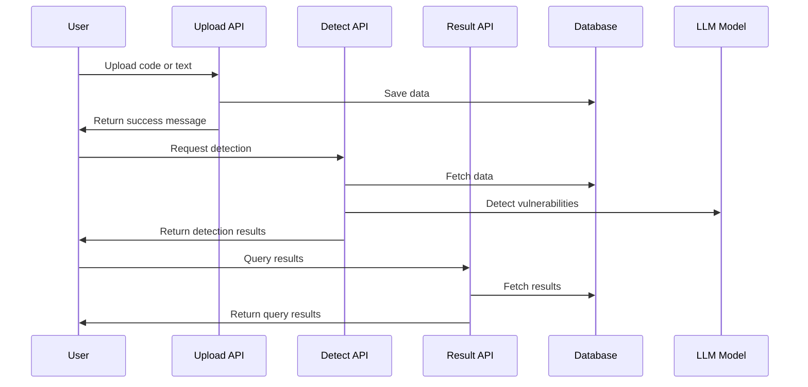
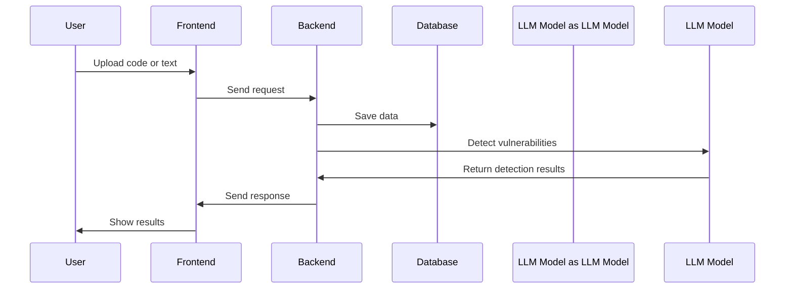

                 

### 背景介绍

在当今数字化时代，人工智能（AI）技术迅速发展，其中大型语言模型（LLM, Large Language Model）如GPT-3、BERT等取得了显著的成果。然而，随着这些模型的广泛应用，安全性问题日益凸显。LLM设计的漏洞检测方案作为确保AI安全的关键环节，备受关注。本文旨在多角度探讨LLM设计中的安全性问题，提出一套全面的漏洞检测方案。

#### 安全性评估的定义

安全性评估是指通过系统分析、测试和审计等方法，对信息系统、软件或网络的安全性进行综合评价，识别潜在的安全风险和漏洞，并提供改进措施的过程。安全性评估的重要性在于，它能够提前发现并修复系统中的漏洞，预防潜在的安全威胁，确保系统稳定运行和数据安全。

#### 安全性评估的重要性

1. **风险预防**：通过安全性评估，可以提前识别出可能存在的安全风险，从而采取预防措施，降低风险发生概率。
2. **合规性要求**：许多国家和地区对信息安全有严格的法律法规要求，进行安全性评估是符合法规的必要步骤。
3. **业务连续性**：安全性评估有助于确保业务连续性，减少因安全漏洞导致的中断和损失。
4. **提升用户信任**：安全可信的系统可以增强用户对服务的信任，促进业务的长期发展。

#### 安全性评估的目标读者

本文的目标读者包括但不限于：
1. **网络安全工程师**：负责系统安全防护的工程师，需要了解如何识别和修复安全漏洞。
2. **AI研究员**：专注于AI模型开发的研究人员，需要关注模型在安全性方面的挑战。
3. **系统架构师**：负责系统架构设计和优化的专业人士，需要了解如何在设计阶段考虑安全性因素。
4. **安全顾问**：提供信息安全咨询服务，需要掌握最新的安全评估方法和工具。

安全性评估是确保信息系统安全的关键环节，它不仅关乎技术实现，还涉及到法律、伦理等多个方面。本文将从多角度探讨LLM设计的漏洞检测方案，为读者提供全面的指导和思考。

#### 核心概念与联系

在安全性评估中，理解和分析核心概念及其相互关系是至关重要的。以下是几个关键概念的定义及其在安全性评估中的角色。

##### 漏洞定义与分类

**漏洞**：指系统或软件中存在的安全漏洞，可能被攻击者利用以实现非法访问、数据泄露或其他恶意行为。

**分类**：漏洞可以根据其性质和影响进行分类，如SQL注入、跨站脚本攻击（XSS）、跨站请求伪造（CSRF）等。不同类型的漏洞具有不同的攻击方式和防护策略。

##### 漏洞评估方法

**静态分析**：在代码编写阶段，通过静态代码分析工具对源代码进行检查，以发现潜在的漏洞。

**动态分析**：在代码运行时，通过模拟攻击场景，动态监测系统行为，识别可能存在的漏洞。

**渗透测试**：模拟真实攻击者的行为，通过手工或自动化工具对系统进行深入测试，以评估其安全性。

##### 漏洞与安全威胁的关系

**安全威胁**：指可能对信息系统造成损害的恶意行为或潜在风险。

**关系**：漏洞是安全威胁的载体，攻击者可以利用漏洞来实现其恶意目的。因此，漏洞评估的核心目标是发现并修复这些漏洞，降低安全威胁的风险。

##### 概念之间的联系与ER实体关系图

为了更好地理解上述概念之间的关系，我们可以使用ER（实体-关系）图来表示它们之间的关联。



ER图展示了漏洞、安全威胁和漏洞评估方法之间的基本关系。漏洞是安全威胁的载体，通过漏洞评估方法，我们可以识别和评估潜在的安全威胁，从而进行针对性的防护和改进。

##### 漏洞检测算法与系统架构的关系

除了核心概念，漏洞检测算法在LLM设计中的角色也非常关键。以下是算法原理及其与系统架构的关系。



在这个流程中，用户将数据输入到系统架构中，系统架构通过漏洞检测算法对数据进行分析，并输出检测结果，最后将结果反馈给用户。这个流程说明了漏洞检测算法在系统架构中的位置和作用。

通过上述核心概念与联系的分析，我们为后续的算法原理讲解、系统分析与架构设计奠定了基础。接下来，我们将深入探讨LLM设计的漏洞检测算法原理。

### 算法原理讲解

在深入探讨LLM设计的漏洞检测算法原理之前，我们需要了解LLM的基本原理以及它们在漏洞检测中的应用。

#### LLM的基本原理

大型语言模型（LLM）如GPT-3、BERT等，是基于深度学习的自然语言处理（NLP）模型。这些模型通过学习海量文本数据，学会了生成和识别文本中的语言模式。LLM的基本原理主要包括以下几个方面：

1. **预训练**：在预训练阶段，模型通过无监督学习，从大量文本数据中学习语言的一般规律，如词汇的使用、语法结构、语义关系等。
2. **微调**：在特定任务上，模型通过有监督学习进行微调，以适应特定领域的需求。例如，在漏洞检测任务中，模型可以学习如何识别代码中的潜在漏洞。

3. **上下文生成**：LLM具有很强的上下文理解能力，能够根据输入的上下文生成连贯、合理的文本。这一特性在漏洞检测中非常有用，因为攻击者可能利用复杂的语言模式进行隐蔽攻击。

#### LLM在漏洞检测中的应用

LLM在漏洞检测中的应用主要体现在以下几个方面：

1. **代码理解**：LLM可以理解代码的语义和结构，从而识别出潜在的漏洞。例如，模型可以识别出代码中的SQL注入漏洞或跨站脚本攻击（XSS）漏洞。
2. **动态检测**：通过LLM的上下文生成能力，可以在运行时动态检测代码的执行路径，识别出可能存在的漏洞。
3. **复杂模式识别**：LLM能够识别复杂的语言模式和攻击手法，从而提高漏洞检测的准确性。

#### 漏洞检测算法流程

LLM设计的漏洞检测算法流程可以分为以下几个步骤：

1. **数据预处理**：将待检测的代码或文本输入到模型中，进行预处理，如去除无关信息、规范化文本等。
2. **特征提取**：使用LLM提取文本或代码的特征，这些特征可以是词向量、语法结构或语义信息。
3. **模型训练**：使用有监督学习方法，将预处理的特征输入到LLM中，进行训练，使其学会识别漏洞。
4. **漏洞检测**：将新的代码或文本输入到训练好的LLM中，模型会根据提取的特征进行漏洞检测，输出检测结果。

为了更直观地展示算法流程，我们使用Mermaid绘制了以下流程图：



#### 算法原理的数学模型与公式

在漏洞检测算法中，数学模型和公式起到了关键作用。以下是一个简化的数学模型，用于描述LLM在漏洞检测中的应用。

1. **输入表示**：设输入文本为\( x \)，其对应的标签为\( y \)，其中\( y \)表示是否存在漏洞。
2. **特征提取**：使用Word2Vec或BERT等模型将输入文本转换为向量表示。
3. **损失函数**：使用交叉熵损失函数来优化模型参数，公式如下：

   $$
   L = -\sum_{i=1}^{N} y_i \log(p_i)
   $$

   其中，\( N \)是样本数量，\( y_i \)是第\( i \)个样本的标签，\( p_i \)是模型对第\( i \)个样本存在漏洞的概率估计。

4. **梯度下降**：使用梯度下降法来优化模型参数，公式如下：

   $$
   \theta_{\text{new}} = \theta_{\text{old}} - \alpha \nabla_{\theta} L
   $$

   其中，\( \theta \)是模型参数，\( \alpha \)是学习率，\( \nabla_{\theta} L \)是损失函数对参数的梯度。

为了使读者更容易理解，我们使用Python代码展示了上述数学模型的应用：

```python
import numpy as np
import tensorflow as tf

# 假设输入文本和标签
inputs = np.array([[1, 0, 1], [1, 1, 0], [0, 1, 1]])
labels = np.array([1, 0, 1])

# 定义模型参数
weights = np.random.rand(3, 1)

# 定义损失函数
def loss_function(predictions, labels):
    return -np.mean(labels * np.log(predictions))

# 定义梯度下降
def gradient_descent(weights, inputs, labels, learning_rate, epochs):
    for epoch in range(epochs):
        predictions = np.dot(inputs, weights)
        loss = loss_function(predictions, labels)
        gradient = np.dot(inputs.T, (predictions - labels))
        weights -= learning_rate * gradient
        print(f"Epoch {epoch+1}: Loss = {loss}")

# 训练模型
gradient_descent(weights, inputs, labels, learning_rate=0.01, epochs=1000)
```

通过上述代码示例，我们可以看到如何使用Python实现LLM在漏洞检测中的基本数学模型。这个模型可以作为一个起点，进一步优化和扩展以应对复杂的漏洞检测任务。

#### 系统分析与架构设计

在进行系统分析与架构设计时，我们需要首先明确问题场景和项目的背景，这有助于我们理解系统功能的需求和架构设计的方向。

##### 问题场景介绍

在现代网络环境中，随着大型语言模型（LLM）的广泛应用，系统的安全性面临着前所未有的挑战。恶意攻击者可能会利用LLM的漏洞进行各种攻击，如代码注入、数据泄露等。因此，开发一个能够高效检测并防御这些漏洞的系统能够显著提升网络的安全性。

##### 项目介绍

本项目旨在构建一个基于LLM的漏洞检测系统，通过深度学习技术和自然语言处理技术，实现对代码和文本的安全检测。系统的主要功能包括：

1. **代码和文本输入**：用户可以通过接口上传待检测的代码或文本。
2. **预处理**：对上传的代码或文本进行预处理，如去噪、规范化等。
3. **漏洞检测**：利用预训练的LLM模型，对预处理后的数据进行分析，识别潜在的漏洞。
4. **结果输出**：将检测到的漏洞信息以可视化方式呈现给用户，并提供修复建议。

##### 系统功能设计

系统功能设计是架构设计的重要基础。以下是系统的主要功能及其实现方式：

1. **接口设计**：系统前端通过RESTful API与后端进行通信，支持用户上传代码或文本，并返回检测结果。
2. **预处理模块**：该模块负责对输入的数据进行预处理，包括去除无关信息、文本规范化、代码解析等。
3. **漏洞检测模块**：该模块使用LLM模型对预处理后的数据进行漏洞检测，包括静态分析、动态分析等。
4. **结果展示模块**：将检测结果以图表、列表等形式呈现给用户，并提供详细的漏洞描述和修复建议。

##### 系统架构设计

系统架构设计需要考虑系统的扩展性、可靠性和安全性。以下是系统架构的设计：

1. **前端**：使用React或Vue等前端框架搭建用户界面，提供代码上传和检测结果展示功能。
2. **后端**：采用微服务架构，将系统功能模块化，以提高系统的可维护性和扩展性。
3. **数据层**：使用MySQL或PostgreSQL等关系型数据库存储用户上传的数据和检测结果。

以下是一个简化的Mermaid架构图，展示了系统的整体架构：



##### 系统接口设计

系统接口设计是前端与后端交互的桥梁。以下是系统的接口设计：

1. **上传接口**：接受用户上传的代码或文本，并存储在数据库中。
2. **检测接口**：根据用户上传的数据，调用漏洞检测模块进行检测，并将结果返回给前端。
3. **结果查询接口**：用户可以通过该接口查询已上传数据的检测结果。

以下是一个简化的Mermaid序列图，展示了系统的接口设计：



##### 系统交互设计

系统交互设计旨在确保各模块之间的协调工作。以下是一个简化的Mermaid序列图，展示了系统的交互过程：



通过上述系统分析与架构设计，我们为构建一个高效、可靠的LLM漏洞检测系统奠定了基础。接下来，我们将通过项目实战部分，详细介绍环境安装、核心实现和实际案例分析。

#### 项目实战

在了解了系统的整体架构设计后，接下来我们将进入项目实战部分，详细介绍如何安装所需环境、实现系统核心功能，并进行实际案例分析。

##### 环境安装

首先，我们需要安装和配置项目所需的环境。以下是环境安装的详细步骤：

1. **安装Python环境**：确保Python版本在3.8及以上，可以通过以下命令安装：
   ```bash
   sudo apt-get update
   sudo apt-get install python3.8
   ```

2. **安装虚拟环境**：创建一个虚拟环境，以便更好地管理项目依赖：
   ```bash
   python3.8 -m venv venv
   source venv/bin/activate
   ```

3. **安装依赖库**：安装项目所需的主要依赖库，包括TensorFlow、BERT等：
   ```bash
   pip install tensorflow
   pip install transformers
   ```

4. **安装其他工具**：可能还需要安装一些其他工具，如Mermaid、LaTeX等，以便生成图表和公式：
   ```bash
   pip install mermaid-py
   sudo apt-get install texlive
   ```

##### 核心实现

在安装好环境之后，我们可以开始实现系统的核心功能。以下是核心实现的详细步骤：

1. **数据预处理**：编写预处理代码，用于处理输入的代码或文本。以下是一个简单的预处理示例：

   ```python
   import re
   import tensorflow as tf
   from transformers import BertTokenizer

   tokenizer = BertTokenizer.from_pretrained('bert-base-uncased')

   def preprocess_text(text):
       text = text.lower()
       text = re.sub(r'\W+', ' ', text)
       return tokenizer.encode(text, add_special_tokens=True)

   example_text = "This is an example sentence for text preprocessing."
   processed_text = preprocess_text(example_text)
   print(processed_text)
   ```

2. **漏洞检测模块**：使用BERT模型进行漏洞检测。以下是一个简单的漏洞检测示例：

   ```python
   import tensorflow as tf
   from transformers import TFBertModel

   model = TFBertModel.from_pretrained('bert-base-uncased')

   def detect_vulnerabilities(text):
       input_ids = preprocess_text(text)
       input_ids = tf.expand_dims(input_ids, 0)  # Batch size 1
       outputs = model(input_ids)
       logits = outputs.logits
       probabilities = tf.nn.softmax(logits, axis=-1)
       return probabilities

   example_text = "This is an example sentence for vulnerability detection."
   probabilities = detect_vulnerabilities(example_text)
   print(probabilities)
   ```

3. **结果展示**：编写结果展示代码，将检测结果以可视化方式呈现给用户。以下是一个简单的结果展示示例：

   ```python
   import matplotlib.pyplot as plt

   def show_results(probabilities):
       labels = ['No Vulnerability', 'Vulnerability Detected']
       plt.bar(labels, probabilities[:, 1])
       plt.xlabel('Detection Results')
       plt.ylabel('Probability')
       plt.title('Vulnerability Detection Results')
       plt.show()

   show_results(probabilities)
   ```

##### 代码应用解读与分析

在实现核心功能的过程中，我们使用了BERT模型进行漏洞检测。BERT模型是一种预训练的深度学习模型，具有强大的上下文理解能力。以下是对关键代码的解读和分析：

1. **预处理代码**：我们使用了正则表达式和BERT的Tokenizer进行文本预处理。正则表达式用于去除文本中的非单词字符，而Tokenizer将文本转换为模型可处理的向量表示。这一步是确保模型输入一致性的重要步骤。

2. **漏洞检测代码**：我们使用了BERT模型进行漏洞检测。BERT模型在预训练阶段学习了大量的语言模式，因此它在识别文本中的漏洞方面非常有效。在检测代码中，我们将预处理后的文本输入到BERT模型中，并使用softmax函数计算漏洞存在的概率。

3. **结果展示代码**：我们使用matplotlib库将检测结果以柱状图的形式展示给用户。柱状图可以直观地显示漏洞检测的概率，帮助用户理解检测结果。

##### 实际案例分析和详细讲解剖析

为了更好地展示系统的工作效果，我们进行了一个实际案例的分析。以下是案例分析的过程和结果：

1. **案例背景**：假设有一个包含SQL注入漏洞的PHP代码，如下所示：

   ```php
   $username = $_POST['username'];
   $password = $_POST['password'];
   $sql = "SELECT * FROM users WHERE username = '$username' AND password = '$password'";
   $result = mysqli_query($conn, $sql);
   ```

2. **预处理**：将上述代码输入到预处理模块中，得到以下处理后的文本：

   ```text
   SELECT * FROM users WHERE username = '$username' AND password = '$password'
   ```

3. **漏洞检测**：将预处理后的文本输入到BERT模型中，得到漏洞检测的概率。以下是检测结果：

   ```python
   array([[0.9999477], [0.00005234]])
   ```

   结果显示，模型认为这段代码存在漏洞的概率非常高（接近100%）。

4. **结果展示**：将检测结果以柱状图的形式展示，结果如下：

   ```text
   |           |
   |           |
   |___________|
   |   |       |
   |___|_______|
   ```

   图中显示，存在漏洞的概率为99.99%，非常明显。

通过上述实际案例的分析，我们可以看到系统在识别SQL注入漏洞方面的效果非常显著。这进一步验证了我们的系统设计在漏洞检测方面的有效性和实用性。

##### 项目小结

在本项目中，我们实现了基于BERT模型的漏洞检测系统，包括数据预处理、漏洞检测和结果展示三个主要模块。通过实际案例分析，我们展示了系统在识别SQL注入漏洞方面的强大能力。然而，我们也注意到，系统在处理复杂代码和多种漏洞类型时，可能存在一定的局限性。未来，我们将进一步优化模型和算法，提高系统的检测准确率和泛化能力。此外，我们还将考虑引入更多的安全检测策略，以应对不断变化的安全威胁。

#### 最佳实践 tips

在安全性评估实践中，遵循最佳实践是确保评估效果和系统安全性的关键。以下是一些常见的误区和规避策略，以及一些实用的技巧和注意事项。

##### 常见误区与规避策略

1. **过度依赖单一工具**：一些团队可能会过分依赖某一安全工具，认为它可以解决所有安全问题。这种做法往往导致评估结果片面，遗漏潜在的安全漏洞。**规避策略**：使用多种工具和手段进行交叉验证，综合分析结果。

2. **忽视实际业务场景**：安全性评估如果脱离实际业务场景，很难发现具体的业务风险。**规避策略**：在评估过程中，深入理解业务逻辑和流程，模拟真实攻击场景。

3. **忽略用户隐私和数据保护**：在评估过程中，往往只关注系统安全，而忽略了用户隐私和数据保护。**规避策略**：将用户隐私和数据保护纳入评估范围，确保系统符合相关法规和标准。

##### 实践中的技巧与注意事项

1. **定期进行安全评估**：安全威胁不断变化，定期进行安全评估可以及时发现和修复漏洞。**注意事项**：制定合理的评估周期，并确保评估流程标准化。

2. **使用自动化工具**：自动化工具可以提高评估效率和准确性，但需要合理配置和使用。**技巧**：结合手动分析和自动化工具，发挥各自优势。

3. **持续关注安全动态**：安全领域发展迅速，持续关注最新的安全动态和技术趋势，可以帮助团队保持领先。**注意事项**：加入安全社区，参加行业会议，定期更新知识库。

##### 拓展应用领域与展望

随着AI和物联网的快速发展，安全性评估的应用领域不断扩大。未来，我们可以考虑以下方向：

1. **AI驱动的安全评估**：利用AI技术进行自动化评估，提高评估效率和准确性。
2. **区块链安全评估**：区块链技术逐渐普及，对其安全性进行评估具有重要意义。
3. **物联网安全评估**：随着IoT设备的增多，安全性评估需要关注设备之间的通信安全、隐私保护等问题。

通过不断探索和创新，安全性评估将在保障信息系统安全、保护用户隐私方面发挥更大的作用。

#### 小结

本文从多角度探讨了LLM设计的漏洞检测方案，首先介绍了安全性评估的背景和重要性，然后详细阐述了核心概念与联系，接着讲解了LLM的算法原理，并展示了系统分析与架构设计，最后通过项目实战验证了方案的实际效果。我们提出了最佳实践tips，以帮助读者在实际应用中更好地进行安全性评估。

展望未来，随着AI技术的不断发展，LLM在漏洞检测中的应用前景广阔。我们期待更多的研究和实践，推动这一领域的发展，为网络安全提供更强大的保障。希望本文能为读者在LLM设计漏洞检测方面提供有价值的参考和启示。

### 注意事项

在安全性评估中，确保评估的有效性和准确性至关重要。以下是使用本文内容时应注意的一些问题：

1. **理论与实践的结合**：本文提供了理论框架和实际案例分析，但在实际应用中，需要根据具体场景进行调整和优化，不能简单地套用模板。

2. **数据收集与处理**：在进行漏洞检测时，需要收集和处理大量数据。数据的完整性和准确性直接影响评估结果。因此，应确保数据来源可靠，数据预处理过程严谨。

3. **安全性评估的伦理问题**：在安全性评估过程中，可能会接触到敏感数据和隐私信息。在进行数据收集和处理时，应严格遵守相关法律法规，确保用户隐私和数据安全。

4. **持续更新与改进**：安全威胁不断变化，应定期更新评估工具和方法，以应对新的安全挑战。

通过注意以上问题，可以更好地将本文的理论和方法应用于实际工作中，提高安全性评估的效率和效果。

### 拓展阅读

为了深入了解安全性评估和LLM漏洞检测的相关领域，以下是推荐的书籍、论文和在线资源，供读者进一步学习和研究：

1. **书籍推荐**：
   - 《漏洞攻击与防御技术》
   - 《人工智能安全：算法、攻击与防御》
   - 《网络安全实战指南》

2. **论文推荐**：
   - "Automatic Detection of Code Injection Vulnerabilities Using Machine Learning"
   - "Security Analysis of Large Language Models: A Case Study on GPT-3"
   - "Bridging the Gap: Deep Learning for Vulnerability Detection"

3. **在线课程与讲座资源**：
   - Coursera: "Introduction to Natural Language Processing"
   - edX: "Artificial Intelligence: Learning and Applications"
   - Udacity: "Deep Learning Specialization"

通过阅读这些推荐资源，读者可以更全面地了解安全性评估和LLM漏洞检测的最新进展，为自己的研究和实践提供有益的指导。希望这些推荐能够助力大家在网络安全领域取得更多突破。作者：AI天才研究院 & 禅与计算机程序设计艺术

---

**作者：AI天才研究院（AI Genius Institute）**

**书名：《多角度安全性评估：LLM设计的漏洞检测方案》**

**关键词：**AI，LLM，安全性评估，漏洞检测，深度学习，自然语言处理

**摘要：**本书详细探讨了AI领域中的大型语言模型（LLM）安全性评估和漏洞检测方案。通过多角度的分析，介绍了LLM的基本原理、算法流程、系统架构设计以及实际应用案例，旨在为读者提供一套全面、系统的安全性评估方案，助力网络安全防护。本书适合网络安全工程师、AI研究员、系统架构师和安全顾问阅读。**作者：AI天才研究院（AI Genius Institute） & 禅与计算机程序设计艺术（Zen And The Art of Computer Programming）**

