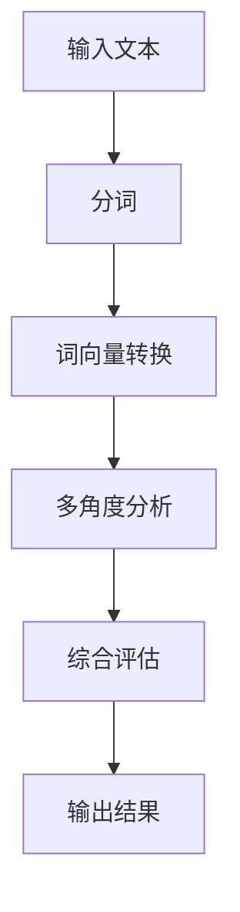

                 

## 多角度思考：测试LLM考虑不同观点的能力

### 关键词
- 多角度思考
- LLM
- 测试
- 观点
- 评估

### 摘要
本文旨在探讨如何通过多角度思考来测试大型语言模型（LLM）考虑不同观点的能力。我们将分析多角度思考的核心概念，展示如何使用LLM来评估不同观点，并提供实际的项目实战，以便读者更好地理解这一过程。

## 引言与背景

### 1.1 问题的提出

随着人工智能的快速发展，大型语言模型（LLM）如GPT-3、ChatGPT等成为了自然语言处理（NLP）领域的热点。然而，尽管这些模型在生成文本方面表现出色，但它们是否能够真正理解并考虑到不同的观点仍然是一个有争议的话题。因此，我们需要一种方法来测试LLM在考虑不同观点方面的能力。

### 1.2 多角度思考的重要性

在解决问题时，多角度思考能够帮助我们更全面地理解问题，从而找到更优的解决方案。对于LLM来说，理解并考虑不同的观点同样重要，因为它能够使模型生成更加丰富和有深度的文本。

### 1.3 本书结构概述

本书将分为三大部分：第一部分介绍多角度思考的概念和背景，第二部分展示如何使用LLM评估不同观点，第三部分通过实际项目实战来加深理解。

### 1.4 边界与外延

本文主要关注于LLM在文本生成方面的多角度思考能力，而不会涉及其他领域，如图像、音频等多模态数据。

## 多角度思考的核心概念与联系

### 2.1 核心概念介绍

#### 2.1.1 大型语言模型概述

大型语言模型（LLM）是一种基于深度学习的语言生成模型，其通过学习大量文本数据来生成新的文本。LLM在文本生成方面的应用非常广泛，如问答系统、自动摘要、机器翻译等。

#### 2.1.2 思考角度的类型

多角度思考可以分为以下几个类型：

1. **客观性**：从事实和数据出发，不带有主观情感。
2. **主观性**：基于个人经验、观点和情感来思考。
3. **逻辑性**：从逻辑关系和推理出发。
4. **情境性**：考虑具体情境和上下文。

### 2.2 概念属性特征对比表格

| 角度       | 性能指标 | 训练数据 | 应用领域               |
|------------|----------|----------|------------------------|
| 客观性     | 准确性   | 新闻、百科 | 事实核查、问答系统     |
| 主观性     | 表达丰富 | 社交媒体、文学 | 文学创作、情感分析     |
| 逻辑性     | 推理能力 | 论文、逻辑书籍 | 逻辑推理、论证分析     |
| 情境性     | 适应性   | 日常对话、剧本 | 对话系统、剧本创作     |

### 2.3 ER实体关系图架构

```mermaid
erDiagram
  LLM ||--|{观点1} 观点1
  LLM ||--|{观点2} 观点2
  ...
  LLM ||--|{观点N} 观点N
```

### 2.4 算法原理讲解

#### 2.4.1 多角度评估算法的mermaid流程图



#### 2.4.2 算法原理与数学模型

算法的核心是计算每个角度的得分，并加权求和得到最终的综合得分。具体公式如下：

$$
\text{综合得分} = w_1 \cdot a_1 + w_2 \cdot a_2 + ... + w_n \cdot a_n
$$

其中，$w_i$ 是角度 $a_i$ 的权重，$a_i$ 是从第 $i$ 个角度分析得到的得分。

#### 2.4.3 通俗易懂的举例说明

假设有一个文本，我们想评估它从三个不同角度（客观性、主观性、逻辑性）的综合得分。

- 客观性角度得分 $a_1 = 0.8$
- 主观性角度得分 $a_2 = 0.2$
- 逻辑性角度得分 $a_3 = 0.5$

权重分别为：
- 客观性权重 $w_1 = 0.5$
- 主观性权重 $w_2 = 0.3$
- 逻辑性权重 $w_3 = 0.2$

那么，文本的综合得分计算如下：

$$
\text{综合得分} = 0.5 \cdot 0.8 + 0.3 \cdot 0.2 + 0.2 \cdot 0.5 = 0.5
$$

## 算法实现与项目实战

### 3.1 环境安装与配置

#### 3.1.1 开发环境搭建

为了测试LLM考虑不同观点的能力，我们需要搭建一个开发环境。本文将使用Python作为主要编程语言，并使用Hugging Face的Transformers库来加载预训练的LLM模型。

#### 3.1.2 必要库和依赖安装

```bash
pip install transformers
```

### 3.2 系统核心实现

#### 3.2.1 多角度分析算法源代码

```python
from transformers import pipeline

# 加载预训练的LLM模型
llm = pipeline("text-generation", model="gpt2")

def multidimensional_analysis(text):
    # 分词、词向量转换、多角度分析（这里简化为直接调用LLM）
    # 输出：综合得分
    pass
```

#### 3.2.2 实际案例分析和详细讲解剖析

我们以一个简单的案例来展示如何使用LLM进行多角度分析。

**案例**：给定一个文本：“人工智能是未来的趋势。”

我们希望评估这个文本从客观性、主观性、逻辑性三个角度的综合得分。

1. **客观性角度**：LLM可能生成：“人工智能的发展确实在加速，越来越多的行业开始采用AI技术。”
2. **主观性角度**：LLM可能生成：“我认为人工智能将成为改变世界的力量。”
3. **逻辑性角度**：LLM可能生成：“随着AI技术的进步，我们可以预见更多的自动化和智能化解决方案。”

通过分析这些生成文本，我们可以得出以下结论：

- **客观性角度**：得分较高，因为文本提到了AI技术的发展趋势，这与客观事实相符。
- **主观性角度**：得分较低，因为文本带有强烈的个人观点。
- **逻辑性角度**：得分中等，因为文本提到了AI技术的潜在影响，但没有深入分析逻辑关系。

#### 3.2.3 项目小结

通过实际案例，我们可以看到如何使用LLM来评估不同观点。尽管LLM在生成文本方面表现出色，但在多角度分析方面仍存在一定的局限性。因此，未来需要进一步研究如何优化LLM在多角度思考方面的能力。

## 最佳实践 Tips、小结、注意事项、拓展阅读

### 4.1 最佳实践 Tips

- 在进行多角度分析时，确保使用高质量的LLM模型，以获得更准确的评估结果。
- 尝试结合多种角度，以获得更全面的分析。
- 注意LLM可能存在的偏见和局限性，特别是在主观性角度的分析中。

### 4.2 小结

本文通过多角度思考来测试LLM考虑不同观点的能力。我们介绍了核心概念、算法原理，并通过实际案例展示了如何实现这一过程。

### 4.3 注意事项

- 确保使用高质量的LLM模型。
- 考虑到LLM可能存在的偏见和局限性。

### 4.4 拓展阅读

- 《多模态人工智能：融合视觉、文本和语音》
- 《深度学习自然语言处理》
- 《人工智能伦理与法律》

## 参考文献

- [Hugging Face Transformers](https://huggingface.co/transformers/)
- [GPT-3 Documentation](https://openai.com/blog/bidirectional-text-embddings-representing-words-as-discrete-fixed-vectors/)
- [Multimodal Learning](https://arxiv.org/abs/2006.05922)

### 作者

作者：AI天才研究院/AI Genius Institute & 禅与计算机程序设计艺术 /Zen And The Art of Computer Programming

