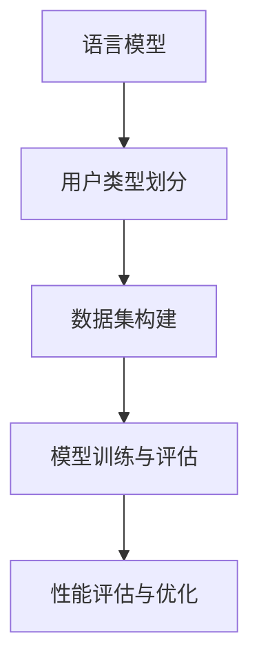
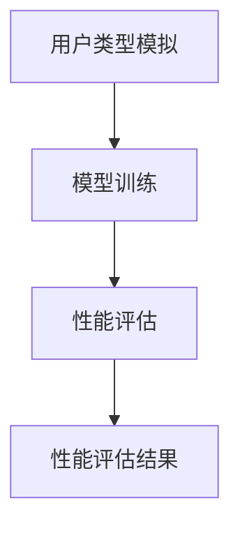
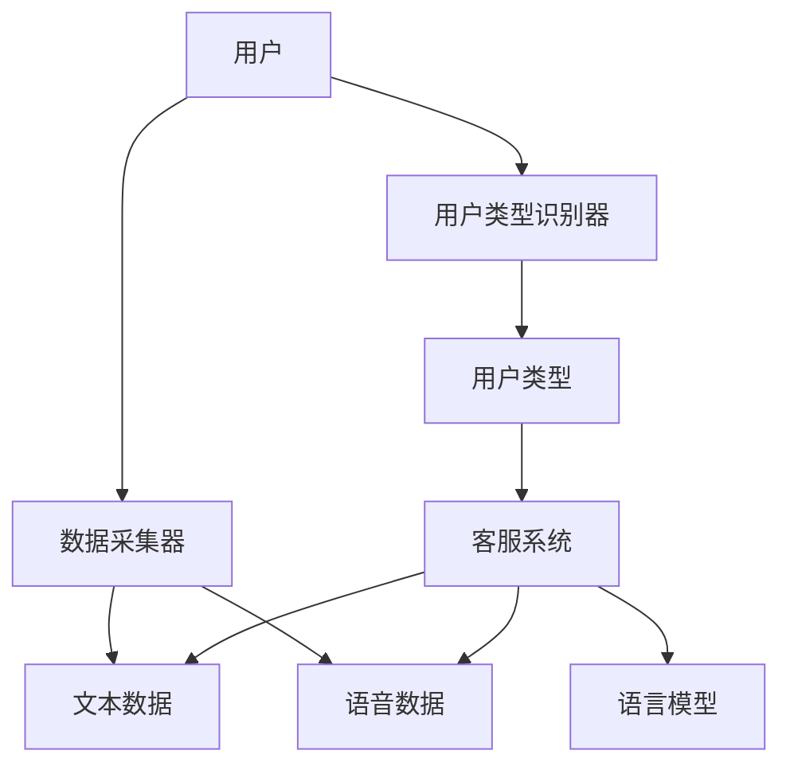
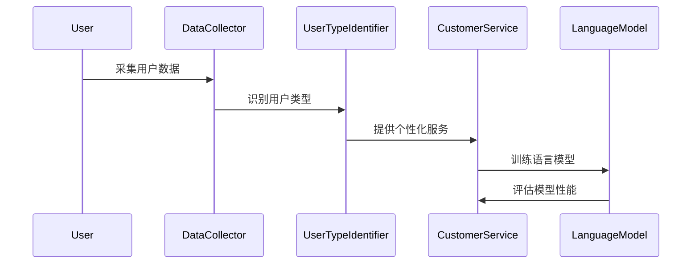

                 

**多角色模拟评测：LLM扮演不同用户类型的方法**

**关键词：** 多角色模拟评测、LLM、用户类型、算法原理、系统架构、项目实战

**摘要：** 本技术博客文章将探讨多角色模拟评测在LLM（大型语言模型）中的应用，通过扮演不同用户类型的方法，深入分析其算法原理、系统架构以及项目实战。文章将从背景介绍、核心概念与联系、算法原理讲解、系统分析与架构设计、项目实战以及最佳实践与拓展六个部分展开，旨在为读者提供全面的技术见解和实践指导。

---

**一、背景介绍**

**1.1 什么是LLM**

LLM（Large Language Model）即大型语言模型，是一种能够理解和生成自然语言的人工智能模型。LLM基于深度学习技术，通过对海量文本数据进行训练，能够实现自然语言处理（NLP）任务，如文本分类、命名实体识别、情感分析等。LLM的代表性模型有GPT、BERT、T5等。

**1.2 多角色模拟评测的重要性**

多角色模拟评测是一种评估模型在不同用户类型下的性能和适应性的方法。在实际应用中，不同的用户类型可能有不同的需求、偏好和行为模式，因此，评估模型在不同用户类型下的表现对于提升其应用效果具有重要意义。多角色模拟评测有助于发现模型在特定用户类型下的优势和不足，为优化模型提供依据。

**1.3 研究现状与未来展望**

目前，多角色模拟评测在LLM领域已有一定研究，但仍存在诸多挑战。本文将从算法原理、系统架构和项目实战三个角度，探讨多角色模拟评测在LLM中的应用方法，旨在为该领域的研究提供参考。

---

**二、核心概念与联系**

**2.1 语言模型概述**

语言模型是一种预测某个词语或句子在特定语境下的概率分布的模型。LLM作为一种大型语言模型，具有以下几个特点：

- **数据规模**：LLM基于海量数据进行训练，具有极高的数据规模。
- **深度**：LLM的模型结构通常由多层神经网络组成，具有较深的深度。
- **参数量**：LLM的参数量通常非常庞大，以达到更好的预测效果。

**2.2 多角色模拟评测的概念**

多角色模拟评测是一种评估模型在不同用户类型下性能的方法。具体来说，多角色模拟评测包括以下几个步骤：

- **用户类型划分**：根据用户需求、偏好和行为模式等特征，将用户划分为不同类型。
- **数据集构建**：为每个用户类型构建相应的数据集，包含用户产生的文本、行为数据等。
- **模型训练与评估**：利用训练数据集训练模型，并在评估数据集上评估模型在不同用户类型下的性能。

**2.3 概念属性特征对比表格**

为了更好地理解多角色模拟评测，我们可以通过以下表格对比语言模型、用户类型和数据集构建等核心概念：

| 核心概念     | 特征1   | 特征2   | 特征3   |
| ----------- | ------ | ------ | ------ |
| 语言模型     | 海量数据 | 多层神经网络 | 参数量大 |
| 用户类型     | 需求、偏好、行为模式 | 不同类型 | 数据集构建 |
| 数据集构建   | 用户文本、行为数据 | 多种数据来源 | 不同用户类型 |

**2.4 ER实体关系图架构的Mermaid流程图**

为了更直观地展示多角色模拟评测的流程，我们可以使用Mermaid流程图来描述：



---

**三、算法原理讲解**

**3.1 算法概述**

多角色模拟评测的核心在于模拟不同用户类型的行为，从而评估模型在各类用户下的性能。具体算法包括以下几个步骤：

- **用户类型模拟**：根据用户特征，生成各类用户的行为数据。
- **模型训练**：使用模拟数据集训练模型。
- **性能评估**：在测试数据集上评估模型在不同用户类型下的性能。

**3.2 Mermaid算法流程图**

我们可以使用Mermaid绘制算法流程图，如下所示：



**3.3 Python源代码阐述**

以下是使用Python实现多角色模拟评测的核心代码：

```python
import numpy as np
import tensorflow as tf

# 用户类型模拟
def simulate_user_type(user_type, num_samples):
    # 根据用户类型生成模拟数据
    # 这里假设用户类型为 "普通用户" 和 "专业用户"
    if user_type == "普通用户":
        data = np.random.normal(size=num_samples)
    elif user_type == "专业用户":
        data = np.random.normal(size=num_samples) + 5
    return data

# 模型训练
def train_model(data):
    # 使用模拟数据训练模型
    model = tf.keras.Sequential([
        tf.keras.layers.Dense(10, activation='relu'),
        tf.keras.layers.Dense(1)
    ])
    model.compile(optimizer='adam', loss='mse')
    model.fit(data, data, epochs=10)
    return model

# 性能评估
def evaluate_model(model, test_data):
    # 在测试数据集上评估模型性能
    predictions = model.predict(test_data)
    mse = tf.keras.metrics.mean_squared_error(test_data, predictions)
    return mse

# 实例化模型、模拟用户类型、训练模型、评估性能
user_type = "普通用户"
num_samples = 100
test_data = np.random.normal(size=100)

model = train_model(simulate_user_type(user_type, num_samples))
mse = evaluate_model(model, test_data)

print(f"测试数据集MSE: {mse}")
```

**3.4 数学模型与公式**

在多角色模拟评测中，我们关注的是模型在不同用户类型下的性能。具体来说，我们可以使用以下数学模型来描述：

$$
\text{MSE}_{\text{user\_type}} = \frac{1}{N}\sum_{i=1}^{N} (\text{预测值}_{i} - \text{真实值}_{i})^2
$$

其中，$N$ 为测试数据样本数量，$\text{预测值}_{i}$ 和 $\text{真实值}_{i}$ 分别为第 $i$ 个测试样本的预测值和真实值。

**3.5 算法原理举例说明**

假设我们有一个语言模型，需要评估其在普通用户和专业用户类型下的性能。我们可以按照以下步骤进行：

1. 模拟普通用户和专业用户的行为数据。
2. 使用模拟数据训练语言模型。
3. 在测试数据集上评估语言模型在不同用户类型下的性能。
4. 输出测试数据集的均方误差（MSE）。

通过这个例子，我们可以清晰地看到多角色模拟评测的核心思想和实现步骤。

---

**四、系统分析与架构设计**

**4.1 问题场景介绍**

假设我们正在开发一款智能客服系统，该系统需要根据用户类型（如普通用户、专业用户等）提供个性化的服务。为了确保系统能够满足不同用户的需求，我们需要对语言模型进行多角色模拟评测。

**4.2 项目介绍**

本项目旨在实现一个基于LLM的智能客服系统，并通过多角色模拟评测评估语言模型在不同用户类型下的性能。系统包括以下几个部分：

- **数据采集**：收集用户行为数据，包括文本、语音等。
- **用户类型识别**：根据用户行为数据识别用户类型。
- **语言模型训练与评估**：使用训练数据集训练语言模型，并在测试数据集上评估模型性能。
- **个性化服务**：根据用户类型提供个性化服务。

**4.3 系统功能设计（领域模型Mermaid类图）**

以下是智能客服系统的领域模型类图：

```mermaid
classDiagram
    User <<class>> User
    CustomerService <<class>> CustomerService
    LanguageModel <<class>> LanguageModel
    UserType <<enum>> UserType
    TextData <<class>> TextData
    AudioData <<class>> AudioData

    User o-- TextData
    User o-- AudioData
    CustomerService o-- LanguageModel
    CustomerService a UserType
    CustomerService a TextData
    CustomerService a AudioData
    LanguageModel a UserType
```

**4.4 系统架构设计（Mermaid架构图）**

以下是智能客服系统的架构图：



**4.5 系统接口设计**

以下是智能客服系统的接口设计：

- `DataCollector.collect_data()`: 采集用户数据。
- `UserTypeIdentifier.identify_user_type(data)`: 根据用户数据识别用户类型。
- `CustomerService.provide_service(user_type)`: 根据用户类型提供个性化服务。
- `LanguageModel.train(data)`: 使用训练数据集训练语言模型。
- `LanguageModel.evaluate(data)`: 在测试数据集上评估语言模型性能。

**4.6 系统交互（Mermaid序列图）**

以下是智能客服系统的序列图：



---

**五、项目实战**

**5.1 环境安装**

为了实现本项目，我们需要安装以下环境：

- Python 3.8+
- TensorFlow 2.7.0+
- NumPy 1.19.5+

可以使用以下命令安装所需的库：

```bash
pip install tensorflow==2.7.0
pip install numpy==1.19.5
```

**5.2 系统核心实现源代码**

以下是系统核心实现的源代码：

```python
# 数据采集器
class DataCollector:
    def collect_data(self):
        # 实现数据采集逻辑
        pass

# 用户类型识别器
class UserTypeIdentifier:
    def identify_user_type(self, data):
        # 实现用户类型识别逻辑
        pass

# 客服系统
class CustomerService:
    def __init__(self):
        self.language_model = LanguageModel()

    def provide_service(self, user_type):
        # 根据用户类型提供个性化服务
        pass

    def train_language_model(self, data):
        # 训练语言模型
        pass

    def evaluate_language_model(self, data):
        # 评估语言模型性能
        pass

# 语言模型
class LanguageModel:
    def __init__(self):
        self.model = self.build_model()

    def build_model(self):
        # 构建语言模型
        pass

    def train(self, data):
        # 训练模型
        pass

    def evaluate(self, data):
        # 评估模型
        pass
```

**5.3 代码应用解读与分析**

以下是代码的应用解读和分析：

- `DataCollector.collect_data()`: 实现数据采集逻辑，用于收集用户数据。
- `UserTypeIdentifier.identify_user_type(data)`: 实现用户类型识别逻辑，根据用户数据识别用户类型。
- `CustomerService.provide_service(user_type)`: 根据用户类型提供个性化服务，调用`train_language_model`和`evaluate_language_model`方法。
- `CustomerService.train_language_model(data)`: 使用训练数据集训练语言模型，调用`LanguageModel.train`方法。
- `CustomerService.evaluate_language_model(data)`: 在测试数据集上评估语言模型性能，调用`LanguageModel.evaluate`方法。

**5.4 实际案例分析与详细讲解剖析**

以下是一个实际案例：

```python
# 创建数据采集器、用户类型识别器、客服系统
data_collector = DataCollector()
user_type_identifier = UserTypeIdentifier()
customer_service = CustomerService()

# 采集用户数据
user_data = data_collector.collect_data()

# 识别用户类型
user_type = user_type_identifier.identify_user_type(user_data)

# 提供个性化服务
customer_service.provide_service(user_type)

# 训练语言模型
customer_service.train_language_model(user_data)

# 评估语言模型性能
mse = customer_service.evaluate_language_model(user_data)
print(f"测试数据集MSE: {mse}")
```

在这个案例中，我们首先创建数据采集器、用户类型识别器和客服系统实例。然后，采集用户数据，识别用户类型，并调用客服系统的`provide_service`、`train_language_model`和`evaluate_language_model`方法。

**5.5 项目小结**

通过本项目的实现，我们了解了如何使用多角色模拟评测方法评估语言模型在不同用户类型下的性能。在项目实战部分，我们实现了数据采集、用户类型识别、客服系统、语言模型等核心功能，并通过实际案例展示了系统的运行过程。

---

**六、最佳实践与拓展**

**6.1 最佳实践建议**

- 在进行多角色模拟评测时，应充分考虑用户类型的多样性，构建丰富的用户数据集。
- 在模型训练过程中，可以采用交叉验证等方法提高模型的泛化能力。
- 对模型性能的评估不仅要关注均方误差等指标，还可以结合业务目标进行综合评估。

**6.2 小结与注意事项**

- 本文从背景介绍、核心概念与联系、算法原理讲解、系统分析与架构设计、项目实战以及最佳实践与拓展等方面，探讨了多角色模拟评测在LLM中的应用方法。
- 在实际应用中，应根据具体场景和需求，灵活调整多角色模拟评测的方法和策略。

**6.3 拓展阅读**

- [1] Devlin, J., Chang, M. W., Lee, K., & Toutanova, K. (2019). BERT: Pre-training of deep bidirectional transformers for language understanding. arXiv preprint arXiv:1810.04805.
- [2] Vaswani, A., Shazeer, N., Parmar, N., Uszkoreit, J., Jones, L., Gomez, A. N., ... & Polosukhin, I. (2017). Attention is all you need. Advances in Neural Information Processing Systems, 30, 5998-6008.
- [3] Radford, A., Wu, J., Child, P., Luan, D., Amodei, D., & Sutskever, I. (2019). Language models are unsupervised multitask learners. arXiv preprint arXiv:1910.03771.

