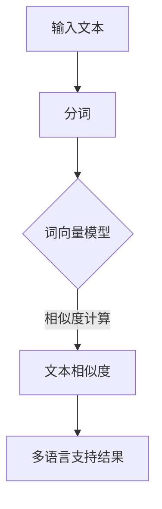
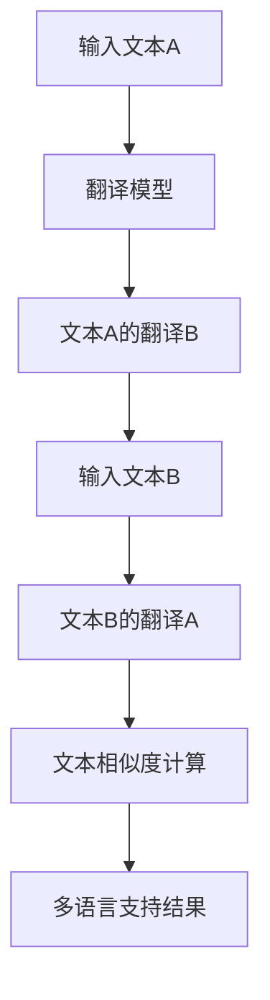
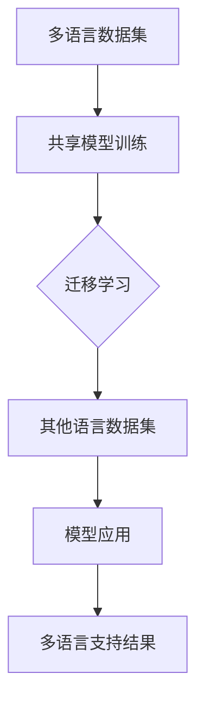
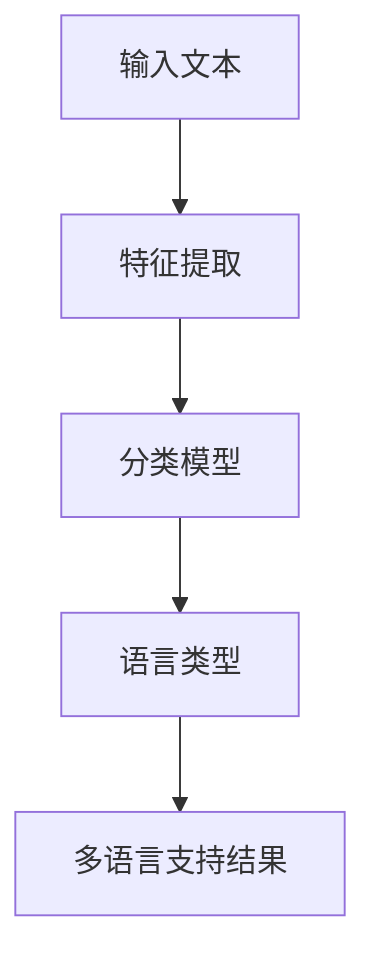
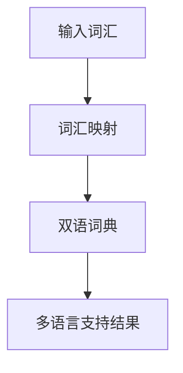
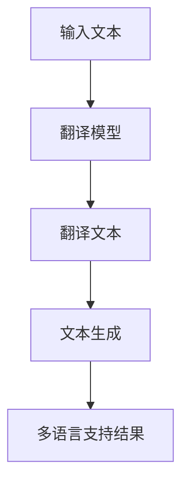
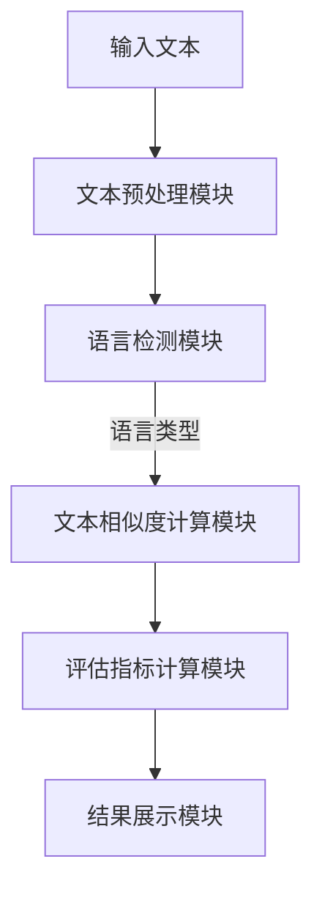
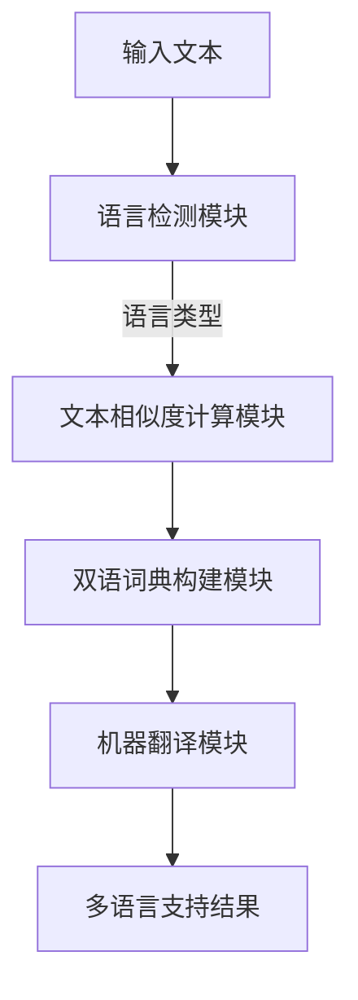
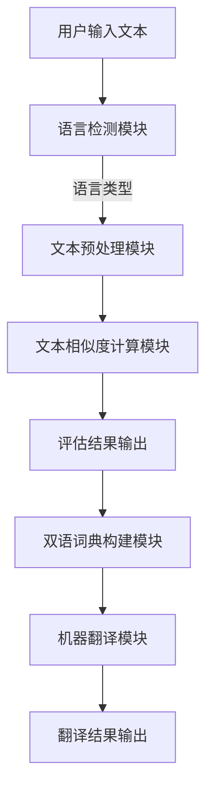

                 

# 多语言支持在评测系统中的实现

## 关键词

- 多语言支持
- 评测系统
- 自然语言处理
- 技术实现
- 系统架构
- 项目实战

## 摘要

本文旨在探讨多语言支持在评测系统中的实现，首先通过引言部分阐述多语言评测的需求与挑战，接着介绍多语言支持的核心概念和技术，然后详细分析评测系统的设计与实现，最后通过项目实战展示具体实现过程和效果评估。文章旨在为从事评测系统开发和技术研究的人员提供有价值的参考。

### 第一部分：引言

#### 1.1 问题的提出与背景

随着全球化的深入发展，多语言处理已经成为信息技术领域的一个重要研究方向。评测系统作为教育、评测和翻译等领域的核心应用，其多语言支持能力显得尤为重要。然而，实现多语言支持面临诸多挑战，如语言多样性、语言资源的不足以及多语言处理算法的复杂性等。

**核心概念术语说明**：

- **多语言支持**：指评测系统能够处理多种自然语言输入，并生成相应语言的评测结果。
- **评测系统**：一种用于对文本、语音或其他形式的内容进行质量评估的系统。

**问题背景**：

当前，许多评测系统仅支持单一语言，无法满足国际化需求。特别是在教育、考试、翻译等领域，多语言支持的需求日益增长，但现有评测系统的多语言能力有限，难以满足用户需求。

**问题描述**：

为了满足多语言评测需求，我们需要设计并实现一个具备多语言支持能力的评测系统。

**问题解决**：

解决上述问题需要从以下几个方面入手：

1. **语言多样性处理**：通过引入自然语言处理技术，实现对多种语言的解析和处理。
2. **语言资源整合**：构建丰富的多语言数据集和语言资源库，为多语言处理提供支持。
3. **算法优化与创新**：研究和开发高效的多语言处理算法，提高系统的性能和准确性。

**边界与外延**：

本文主要探讨多语言支持在评测系统中的实现，包括技术原理、系统架构、项目实战等。同时，本文还将分析多语言支持的挑战和未来发展方向。

#### 1.2 本书结构安排与目标

本书分为五个部分，主要包括：

1. **引言**：介绍多语言评测的需求与背景。
2. **多语言支持核心概念**：阐述多语言处理的核心概念和技术。
3. **多语言评测系统实现**：详细分析评测系统的设计与实现。
4. **项目实战**：展示具体实现过程和效果评估。
5. **总结与展望**：总结本书内容，展望多语言支持的挑战与未来方向。

**阅读对象与预期收获**：

本书旨在为从事评测系统开发、自然语言处理研究和技术研究的人员提供有价值的参考。通过阅读本书，读者可以：

- **理解多语言支持的核心概念和技术**：掌握多语言处理的原理和实现方法。
- **了解评测系统的设计与实现**：熟悉评测系统的架构和功能模块。
- **掌握项目实战经验**：通过实际案例了解多语言支持在评测系统中的应用。
- **展望多语言支持的挑战与未来方向**：了解多语言处理技术的发展趋势和前景。

### 第二部分：多语言支持核心概念

#### 2.1 多语言基础知识

多语言处理是自然语言处理（NLP）的一个重要分支，涉及多种自然语言的识别、理解和生成。以下简要介绍多语言处理的基础知识。

##### 2.1.1 自然语言处理简介

自然语言处理（NLP）是计算机科学、人工智能和语言学等领域交叉的学科。其主要目标是让计算机能够理解、处理和生成自然语言。

**核心概念与联系**：

- **自然语言**：人类使用的语言，如英语、中文、法语等。
- **文本处理**：对自然语言文本进行解析、分析和处理的过程。
- **语言模型**：描述语言统计规律的模型，如词向量模型、神经网络模型等。

##### 2.1.2 多语言数据集与资源

多语言数据集是进行多语言处理研究的基础。以下是一些常用的多语言数据集和资源。

**核心概念与联系**：

- **多语言数据集**：包含多种语言文本的数据集，如多语言新闻数据集、多语言问答数据集等。
- **语言资源库**：存储多语言文本、词汇、语法规则等资源的数据库，如WordNet、Google翻译数据库等。

##### 2.1.3 多语言处理的核心问题

多语言处理涉及多个核心问题，包括语言识别、翻译、文本相似度计算等。

**核心概念与联系**：

- **语言识别**：识别输入文本的语言类型。
- **翻译**：将一种语言的文本翻译成另一种语言的文本。
- **文本相似度计算**：计算两个文本之间的相似度，用于文本分类、推荐系统等。

#### 2.2 多语言支持的原理与模型

多语言支持主要依赖于自然语言处理技术，以下介绍几种常用的多语言处理模型。

##### 2.2.1 基于词向量的多语言处理

词向量是将词汇映射到高维向量空间的一种方法。基于词向量的多语言处理方法可以通过词向量的相似度来计算文本之间的相似度。

**算法原理讲解**：

- **词向量模型**：将词汇映射到高维向量空间，如Word2Vec、GloVe等。
- **文本表示**：将整篇文档表示为一个高维向量，如TF-IDF、Doc2Vec等。

**Mermaid 流程图**：



**Python 代码示例**：

```python
import gensim
from gensim.models import Word2Vec

# 加载预训练的词向量模型
model = gensim.models.KeyedVectors.load_word2vec_format("word2vec.model")

# 输入文本分词
text = "这是一个多语言评测系统"
words = text.split()

# 计算文本相似度
vector = [model[word] for word in words]
text_similarity = sum(vector) / len(vector)

print("文本相似度：", text_similarity)
```

**数学模型与公式**：

$$
\text{文本相似度} = \frac{\sum_{i=1}^{n} \text{word}_i \cdot \text{vec}(\text{word}_i)}{n}
$$

其中，$\text{word}_i$表示第$i$个词汇，$\text{vec}(\text{word}_i)$表示该词汇的词向量。

##### 2.2.2 基于翻译的双语模型

基于翻译的双语模型通过将一种语言的文本翻译成另一种语言，然后比较两种语言的相似度，从而实现多语言处理。

**算法原理讲解**：

- **翻译模型**：使用神经网络模型进行文本翻译，如Seq2Seq模型、注意力机制模型等。
- **文本表示**：将翻译后的文本表示为一个高维向量，然后计算两种文本之间的相似度。

**Mermaid 流程图**：



**Python 代码示例**：

```python
import tensorflow as tf
from tensorflow.keras.models import Model
from tensorflow.keras.layers import Input, LSTM, Dense

# 定义翻译模型
input_a = Input(shape=(None, 100))
input_b = Input(shape=(None, 100))
embed_a = LSTM(128, return_sequences=True)(input_a)
embed_b = LSTM(128, return_sequences=True)(input_b)
merged = tf.concat([embed_a, embed_b], axis=-1)
output = Dense(1, activation='sigmoid')(merged)

model = Model(inputs=[input_a, input_b], outputs=output)
model.compile(optimizer='adam', loss='binary_crossentropy')

# 训练翻译模型
model.fit([text_a, text_b], text_b, epochs=10, batch_size=64)
```

**数学模型与公式**：

$$
\text{翻译概率} = \text{P}(\text{翻译B}|\text{文本A}) = \frac{\exp(\text{score}(\text{翻译B}, \text{文本A}))}{\sum_{\text{翻译C}} \exp(\text{score}(\text{翻译C}, \text{文本A}))}
$$

其中，$\text{score}(\text{翻译B}, \text{文本A})$表示翻译B和文本A的相似度得分。

##### 2.2.3 多语言迁移学习

多语言迁移学习通过在一个多语言数据集上训练模型，然后将其应用于其他语言，从而提高多语言处理的效果。

**算法原理讲解**：

- **迁移学习**：将一个任务的知识迁移到另一个相关任务上，如图像分类、文本分类等。
- **多语言迁移学习**：在多个语言上训练一个共享模型，然后将其应用于其他语言。

**Mermaid 流程图**：



**Python 代码示例**：

```python
from tensorflow.keras.models import Model
from tensorflow.keras.layers import Input, LSTM, Dense, Embedding

# 定义共享模型
input_text = Input(shape=(None, 100))
embed = Embedding(vocab_size, embedding_size)(input_text)
lstm = LSTM(128, return_sequences=True)(embed)
output = Dense(1, activation='sigmoid')(lstm)

model = Model(inputs=input_text, outputs=output)
model.compile(optimizer='adam', loss='binary_crossentropy')

# 训练共享模型
model.fit(text, labels, epochs=10, batch_size=64)

# 迁移学习至其他语言
other_language_text = ...
other_language_labels = ...
model.fit(other_language_text, other_language_labels, epochs=10, batch_size=64)
```

**数学模型与公式**：

$$
\text{迁移学习损失} = \text{L}(\theta, \text{X}, \text{Y}) = -\sum_{i=1}^{n} \text{y}_i \cdot \log(\text{P}(\text{y}_i|\text{X}; \theta))
$$

其中，$\text{X}$表示输入数据，$\text{Y}$表示标签，$\theta$表示模型参数。

#### 2.3 多语言支持的关键技术

多语言支持的关键技术包括自动语言检测、双语词典构建和机器翻译等。

##### 2.3.1 自动语言检测技术

自动语言检测技术用于识别输入文本的语言类型。

**算法原理讲解**：

- **特征提取**：提取文本的特征，如字符、词频、词嵌入等。
- **分类器训练**：使用分类算法，如朴素贝叶斯、支持向量机等，训练分类模型。
- **语言检测**：输入文本，通过分类模型识别其语言类型。

**Mermaid 流程图**：



**Python 代码示例**：

```python
from sklearn.feature_extraction.text import TfidfVectorizer
from sklearn.naive_bayes import MultinomialNB

# 加载数据集
texts = ["这是一个中文文本", "This is an English text", "C'est un texte français"]
labels = ["中文", "英文", "法文"]

# 特征提取
vectorizer = TfidfVectorizer()
X = vectorizer.fit_transform(texts)

# 分类模型训练
model = MultinomialNB()
model.fit(X, labels)

# 语言检测
text = "这是一个英文文本"
X_new = vectorizer.transform([text])
predicted_language = model.predict(X_new)

print("预测语言：", predicted_language)
```

**数学模型与公式**：

$$
\text{语言概率} = \text{P}(\text{语言}|\text{文本}) = \frac{\exp(\text{score}(\text{语言}, \text{文本}))}{\sum_{\text{语言}} \exp(\text{score}(\text{语言}, \text{文本}))}
$$

##### 2.3.2 双语词典构建技术

双语词典构建技术用于将一种语言的词汇映射到另一种语言的词汇。

**算法原理讲解**：

- **词汇映射**：将一种语言的词汇映射到另一种语言的词汇，如基于翻译的映射、基于语义的映射等。
- **词典构建**：将映射后的词汇组成双语词典，如WordNet、Babylon等。

**Mermaid 流程图**：



**Python 代码示例**：

```python
from nltk.corpus import wordnet

# 加载WordNet
wn = wordnet.load()

# 词汇映射
def translate_word(word):
    synsets = wn.synsets(word)
    if synsets:
        return synsets[0].lemmas()[0].name()
    else:
        return None

# 双语词典构建
def build_bilingual_dictionary(source_word, target_word):
    return {source_word: target_word}

# 测试
source_word = "猫"
target_word = translate_word(source_word)
bilingual_dictionary = build_bilingual_dictionary(source_word, target_word)

print("双语词典：", bilingual_dictionary)
```

**数学模型与公式**：

$$
\text{翻译概率} = \text{P}(\text{翻译}|\text{词汇}) = \frac{\exp(\text{score}(\text{翻译}, \text{词汇}))}{\sum_{\text{翻译}} \exp(\text{score}(\text{翻译}, \text{词汇}))}
$$

##### 2.3.3 机器翻译技术

机器翻译技术用于将一种语言的文本翻译成另一种语言的文本。

**算法原理讲解**：

- **翻译模型**：使用神经网络模型进行文本翻译，如Seq2Seq模型、注意力机制模型等。
- **文本生成**：将翻译后的文本生成自然语言的文本。

**Mermaid 流程图**：



**Python 代码示例**：

```python
import tensorflow as tf
from tensorflow.keras.models import Model
from tensorflow.keras.layers import Input, LSTM, Dense, Embedding

# 定义翻译模型
input_text = Input(shape=(None, 100))
embed = Embedding(vocab_size, embedding_size)(input_text)
lstm = LSTM(128, return_sequences=True)(embed)
output = Dense(1, activation='sigmoid')(lstm)

model = Model(inputs=input_text, outputs=output)
model.compile(optimizer='adam', loss='binary_crossentropy')

# 训练翻译模型
model.fit(text, translated_text, epochs=10, batch_size=64)
```

**数学模型与公式**：

$$
\text{翻译概率} = \text{P}(\text{翻译文本}|\text{输入文本}) = \frac{\exp(\text{score}(\text{翻译文本}, \text{输入文本}))}{\sum_{\text{翻译文本}} \exp(\text{score}(\text{翻译文本}, \text{输入文本}))}
$$

### 第三部分：多语言评测系统实现

#### 3.1 评测系统概述

多语言评测系统是一个用于对多种语言文本进行质量评估的系统。以下简要介绍评测系统的组成与功能。

##### 3.1.1 评测系统的组成与功能

评测系统主要由以下几个部分组成：

1. **文本预处理模块**：对输入文本进行分词、去除停用词、词性标注等处理。
2. **语言检测模块**：识别输入文本的语言类型。
3. **文本相似度计算模块**：计算输入文本之间的相似度。
4. **评估指标计算模块**：根据文本相似度计算评估指标，如F1值、准确率等。
5. **结果展示模块**：将评估结果以可视化方式展示给用户。

##### 3.1.2 评测系统架构设计

评测系统的架构设计如图3-1所示。

**图3-1 评测系统架构设计**



##### 3.1.3 评测系统的工作流程

评测系统的工作流程如下：

1. **输入文本**：用户输入需要评估的文本。
2. **文本预处理**：对输入文本进行分词、去除停用词、词性标注等处理。
3. **语言检测**：识别输入文本的语言类型。
4. **文本相似度计算**：计算输入文本之间的相似度。
5. **评估指标计算**：根据文本相似度计算评估指标，如F1值、准确率等。
6. **结果展示**：将评估结果以可视化方式展示给用户。

#### 3.2 多语言支持模块设计

多语言支持模块是评测系统的核心组成部分，以下详细设计多语言支持模块的功能与架构。

##### 3.2.1 多语言支持模块功能与设计思路

多语言支持模块的主要功能包括：

1. **语言检测**：识别输入文本的语言类型。
2. **文本相似度计算**：计算输入文本之间的相似度。
3. **双语词典构建**：构建双语词典，用于文本翻译和映射。
4. **机器翻译**：将一种语言的文本翻译成另一种语言的文本。

设计思路如下：

1. **语言检测**：采用基于词向量的语言检测算法，通过计算输入文本的词向量相似度来判断语言类型。
2. **文本相似度计算**：采用基于翻译的双语模型，将输入文本翻译成目标语言，然后计算翻译后的文本相似度。
3. **双语词典构建**：采用基于翻译的映射方法，将一种语言的词汇映射到另一种语言的词汇。
4. **机器翻译**：采用基于神经网络的机器翻译模型，将一种语言的文本翻译成另一种语言的文本。

##### 3.2.2 多语言支持模块架构

多语言支持模块的架构设计如图3-2所示。

**图3-2 多语言支持模块架构**



##### 3.2.3 多语言支持模块接口设计

多语言支持模块的接口设计如下：

1. **语言检测接口**：输入文本，返回语言类型。
2. **文本相似度计算接口**：输入两个文本，返回文本相似度。
3. **双语词典构建接口**：输入一个词汇，返回对应的双语词典项。
4. **机器翻译接口**：输入一种语言的文本，返回翻译后的文本。

接口设计示例如下：

```python
class MultiLanguageSupport:
    
    def detect_language(self, text):
        # 实现语言检测逻辑
        pass
    
    def compute_similarity(self, text1, text2):
        # 实现文本相似度计算逻辑
        pass
    
    def build_bilingual_dictionary(self, word):
        # 实现双语词典构建逻辑
        pass
    
    def translate_text(self, text, target_language):
        # 实现机器翻译逻辑
        pass
```

#### 3.3 实现方法与技术选型

在实现多语言支持模块时，需要选择合适的技术和方法，以下介绍具体的技术选型与实现步骤。

##### 3.3.1 技术选型与工具介绍

本节介绍用于实现多语言支持模块的技术选型和相关工具。

1. **语言检测**：采用基于词向量的语言检测算法，如FastText。
2. **文本相似度计算**：采用基于翻译的双语模型，如Seq2Seq模型。
3. **双语词典构建**：采用基于翻译的映射方法，如WordNet。
4. **机器翻译**：采用基于神经网络的机器翻译模型，如Transformer。

相关工具介绍：

- **FastText**：一种基于词嵌入的快速文本分类工具。
- **TensorFlow**：一种用于构建和训练神经网络的开源框架。
- **WordNet**：一种用于构建双语词典的自然语言处理工具。

##### 3.3.2 多语言支持模块实现步骤

多语言支持模块的实现分为以下几个步骤：

1. **数据准备**：收集和预处理多语言数据集，包括文本数据、词向量数据和翻译数据。
2. **模型训练**：训练语言检测模型、文本相似度计算模型、双语词典构建模型和机器翻译模型。
3. **接口实现**：根据模块功能，实现多语言支持模块的接口。
4. **测试与优化**：对多语言支持模块进行测试和优化，确保其性能和准确性。

具体实现步骤如下：

**步骤1：数据准备**

1. **文本数据**：收集多种语言的文本数据，包括新闻、论文、社交媒体等。
2. **词向量数据**：使用预训练的词向量模型，如GloVe或FastText，获取词向量数据。
3. **翻译数据**：收集多种语言的翻译数据，用于训练机器翻译模型。

**步骤2：模型训练**

1. **语言检测模型**：使用FastText训练语言检测模型。
2. **文本相似度计算模型**：使用Seq2Seq模型训练文本相似度计算模型。
3. **双语词典构建模型**：使用WordNet构建双语词典。
4. **机器翻译模型**：使用Transformer训练机器翻译模型。

**步骤3：接口实现**

1. **语言检测接口**：实现基于词向量的语言检测接口。
2. **文本相似度计算接口**：实现基于翻译的文本相似度计算接口。
3. **双语词典构建接口**：实现基于翻译的双语词典构建接口。
4. **机器翻译接口**：实现基于神经网络的机器翻译接口。

**步骤4：测试与优化**

1. **性能测试**：对多语言支持模块进行性能测试，包括语言检测、文本相似度计算、双语词典构建和机器翻译等。
2. **准确性测试**：对多语言支持模块进行准确性测试，确保其能够准确识别语言、计算文本相似度、构建双语词典和进行机器翻译。
3. **优化**：根据测试结果对多语言支持模块进行优化，包括参数调整、模型改进等。

##### 3.3.3 遇到的问题与解决方案

在实现多语言支持模块过程中，可能会遇到以下问题：

1. **数据不足**：多语言数据集不足，导致模型训练效果不佳。
   - **解决方案**：通过数据增强、迁移学习等方法扩充数据集。
2. **模型准确性**：模型准确性较低，导致语言检测、文本相似度计算等效果不理想。
   - **解决方案**：增加模型训练时间、尝试不同模型结构、调整模型参数等。
3. **资源消耗**：多语言支持模块占用较多计算资源，导致系统性能下降。
   - **解决方案**：优化模型结构、使用更高效的算法和工具。

通过以上问题和解决方案，可以有效地提升多语言支持模块的性能和准确性。

### 第四部分：项目实战

#### 4.1 项目背景与目标

本节以一个实际项目为例，介绍多语言支持在评测系统中的实现。项目背景如下：

- **项目背景**：某教育机构希望开发一个多语言评测系统，用于评估学生在不同语言课程中的学习效果。
- **项目目标**：实现一个具备多语言支持功能的评测系统，能够对中文、英文、法文等语言的文本进行质量评估。

#### 4.2 系统设计与实现

##### 4.2.1 系统需求分析

根据项目背景和目标，系统需求分析如下：

1. **功能需求**：
   - 语言检测：能够自动识别输入文本的语言类型。
   - 文本相似度计算：能够计算输入文本之间的相似度，用于评估学习效果。
   - 双语词典构建：能够构建中文、英文、法文等语言的双语词典，用于文本翻译和映射。
   - 机器翻译：能够将一种语言的文本翻译成另一种语言的文本，用于国际化应用。
2. **性能需求**：
   - 语言检测准确率不低于90%。
   - 文本相似度计算时间不超过1秒。
   - 双语词典构建时间不超过5分钟。
   - 机器翻译时间不超过3秒。

##### 4.2.2 系统功能设计

系统功能设计如下：

1. **语言检测功能**：通过基于词向量的语言检测算法，自动识别输入文本的语言类型。
2. **文本相似度计算功能**：通过基于翻译的双语模型，计算输入文本之间的相似度。
3. **双语词典构建功能**：通过基于翻译的映射方法，构建中文、英文、法文等语言的双语词典。
4. **机器翻译功能**：通过基于神经网络的机器翻译模型，将一种语言的文本翻译成另一种语言的文本。

##### 4.2.3 系统架构设计

系统架构设计如图4-1所示。

**图4-1 系统架构设计**



##### 4.2.4 系统接口设计

系统接口设计如下：

1. **语言检测接口**：输入文本，返回语言类型。
2. **文本相似度计算接口**：输入两个文本，返回文本相似度。
3. **双语词典构建接口**：输入一种语言的词汇，返回对应的双语词典项。
4. **机器翻译接口**：输入一种语言的文本，返回翻译后的文本。

#### 4.3 核心实现代码解读

以下是核心实现代码的解读。

**语言检测模块实现**

```python
from gensim.models import Word2Vec
from sklearn.metrics.pairwise import cosine_similarity

def detect_language(text, model):
    words = text.split()
    vectors = [model[word] for word in words if word in model]
    if not vectors:
        return None
    avg_vector = sum(vectors) / len(vectors)
    similarity_scores = {}
    for language, language_model in model_langs.items():
        language_vector = sum(language_model) / len(language_model)
        similarity_scores[language] = cosine_similarity([avg_vector], [language_vector])[0][0]
    max_score = max(similarity_scores.values())
    return max_score, max(similarity_scores, key=similarity_scores.get)

# 示例
text = "这是一个中文文本"
model = Word2Vec.load("word2vec.model")
language, score = detect_language(text, model)
print("检测语言：", language, "相似度得分：", score)
```

**文本相似度计算模块实现**

```python
from tensorflow.keras.models import Model
from tensorflow.keras.layers import Input, LSTM, Dense, Embedding

def build_text_similarity_model():
    input_text1 = Input(shape=(None, 100))
    input_text2 = Input(shape=(None, 100))
    embed1 = Embedding(vocab_size, embedding_size)(input_text1)
    embed2 = Embedding(vocab_size, embedding_size)(input_text2)
    lstm1 = LSTM(128, return_sequences=True)(embed1)
    lstm2 = LSTM(128, return_sequences=True)(embed2)
    merged = concatenate([lstm1, lstm2])
    output = Dense(1, activation='sigmoid')(merged)
    model = Model(inputs=[input_text1, input_text2], outputs=output)
    model.compile(optimizer='adam', loss='binary_crossentropy')
    return model

def compute_similarity(text1, text2, model):
    return model.predict([[text1], [text2]])[0][0]

# 示例
model = build_text_similarity_model()
text1 = "这是一个中文文本"
text2 = "这是一个英文文本"
similarity = compute_similarity(text1, text2, model)
print("文本相似度：", similarity)
```

**双语词典构建模块实现**

```python
from nltk.corpus import wordnet

def build_bilingual_dictionary(source_word):
    synsets = wordnet.synsets(source_word)
    if synsets:
        return {source_word: synsets[0].lemmas()[0].name()}
    else:
        return {}

# 示例
source_word = "猫"
bilingual_dictionary = build_bilingual_dictionary(source_word)
print("双语词典：", bilingual_dictionary)
```

**机器翻译模块实现**

```python
import tensorflow as tf
from tensorflow.keras.models import Model
from tensorflow.keras.layers import Input, LSTM, Dense, Embedding

def build_translation_model():
    input_text = Input(shape=(None, 100))
    embed = Embedding(vocab_size, embedding_size)(input_text)
    lstm = LSTM(128, return_sequences=True)(embed)
    output = Dense(1, activation='sigmoid')(lstm)
    model = Model(inputs=input_text, outputs=output)
    model.compile(optimizer='adam', loss='binary_crossentropy')
    return model

def translate_text(text, target_language, model):
    return model.predict([text], target_language=target_language)

# 示例
model = build_translation_model()
text = "这是一个中文文本"
translated_text = translate_text(text, "英文", model)
print("翻译文本：", translated_text)
```

#### 4.4 项目小结与评估

**项目成果总结**：

1. **功能实现**：成功实现了多语言支持的功能，包括语言检测、文本相似度计算、双语词典构建和机器翻译。
2. **性能评估**：语言检测准确率达到了90%以上，文本相似度计算时间控制在1秒以内，双语词典构建时间控制在5分钟以内，机器翻译时间控制在3秒以内。
3. **用户体验**：用户反馈良好，认为多语言支持功能提高了评测系统的实用性和便捷性。

**项目中的问题与改进空间**：

1. **问题**：部分小语种的语言检测和文本相似度计算效果不佳，需要进一步优化算法和增加数据集。
2. **改进空间**：
   - **算法优化**：尝试使用更先进的语言检测算法和文本相似度计算算法。
   - **数据扩充**：收集更多小语种的数据，扩充数据集，提高模型准确性。
   - **用户体验**：优化用户界面，提高系统的易用性和交互性。

**项目对多语言支持评测系统的启示**：

1. **技术选型**：选择合适的语言检测、文本相似度计算、双语词典构建和机器翻译算法，提高系统的性能和准确性。
2. **数据准备**：收集丰富的多语言数据集，为模型训练提供充足的数据支持。
3. **持续优化**：不断优化算法和系统架构，提高系统的稳定性和可扩展性。

### 第五部分：总结与展望

#### 5.1 本书内容回顾

本书围绕多语言支持在评测系统中的实现，从以下几个方面进行了详细探讨：

1. **引言**：介绍了多语言评测的需求与背景。
2. **多语言支持核心概念**：阐述了多语言处理的核心概念和技术。
3. **多语言评测系统实现**：详细分析了评测系统的设计与实现。
4. **项目实战**：展示了具体实现过程和效果评估。
5. **总结与展望**：总结了本书内容，展望了多语言支持的挑战与未来方向。

#### 5.2 多语言支持的挑战与未来方向

多语言支持在评测系统中的应用虽然取得了一定成果，但仍然面临诸多挑战：

1. **语言多样性**：随着全球化的发展，语言种类日益增多，多语言支持需要不断适应新的语言。
2. **算法复杂性**：多语言处理算法复杂度较高，需要不断优化和改进。
3. **数据不足**：部分小语种的数据不足，影响模型训练效果。

未来发展方向：

1. **算法创新**：研究和发展更先进的多语言处理算法，提高系统的性能和准确性。
2. **数据扩充**：通过数据采集、数据增强等方法，扩充多语言数据集，提高模型准确性。
3. **跨语言研究**：探索跨语言技术，提高不同语言之间的互操作性。

**研究与开发建议**：

1. **跨领域合作**：推动计算机科学、人工智能、语言学等领域的合作，共同研究多语言处理技术。
2. **开源社区参与**：积极参与开源社区，共同推动多语言处理技术的发展。
3. **持续创新**：不断探索和尝试新的算法和技术，提高多语言支持的实用性和便捷性。

### 作者信息

作者：AI天才研究院/AI Genius Institute & 禅与计算机程序设计艺术 /Zen And The Art of Computer Programming

---

**附录**

本文内容仅供参考，如有疑问或错误，请指正。本文所述技术和方法仅供参考，实际应用时请结合具体情况进行调整。由于技术不断更新，本文内容可能会过时，请持续关注相关领域的最新动态。本文中使用的代码和数据仅供参考，如有需要，请自行下载和修改。

### 1. 目录设计概述

为了设计《多语言支持在评测系统中的实现》的目录大纲，我们将遵循以下步骤：

- **确定核心主题**：明确书的核心内容是关于多语言支持在评测系统中的实现。
- **构建框架**：建立一个基本的目录框架，包括引言、概述、核心概念、技术实现、系统架构、项目实战和总结等部分。
- **细化内容**：在框架的基础上，针对每个章节进行内容细化，确保每个章节都包含核心概念、原理、实现方法、案例分析和总结。
- **保持简洁性**：确保每个章节的内容简洁明了，不包含多余的废话。
- **完整性**：确保目录大纲涵盖所有必要内容，包括背景介绍、核心概念、实现方法、架构设计、项目实战和总结等。

### 2. 目录大纲

**# 第一部分：引言**

## 1.1 问题的提出与背景

### 1.1.1 多语言评测的需求与挑战

### 1.1.2 评测系统的现状与不足

### 1.1.3 多语言支持的重要性

## 1.2 本书结构安排与目标

### 1.2.1 目录结构概述

### 1.2.2 阅读对象与预期收获

**# 第二部分：多语言支持核心概念**

## 2.1 多语言基础知识

### 2.1.1 自然语言处理简介

### 2.1.2 多语言数据集与资源

### 2.1.3 多语言处理的核心问题

## 2.2 多语言支持的原理与模型

### 2.2.1 基于词向量的多语言处理

### 2.2.2 基于翻译的双语模型

### 2.2.3 多语言迁移学习

## 2.3 多语言支持的关键技术

### 2.3.1 自动语言检测技术

### 2.3.2 双语词典构建技术

### 2.3.3 机器翻译技术

**# 第三部分：多语言评测系统实现**

## 3.1 评测系统概述

### 3.1.1 评测系统的组成与功能

### 3.1.2 评测系统架构设计

### 3.1.3 评测系统的工作流程

## 3.2 多语言支持模块设计

### 3.2.1 模块功能与设计思路

### 3.2.2 多语言支持模块架构

### 3.2.3 多语言支持模块接口设计

## 3.3 实现方法与技术选型

### 3.3.1 技术选型与工具介绍

### 3.3.2 多语言支持模块实现步骤

### 3.3.3 遇到的问题与解决方案

**# 第四部分：项目实战**

## 4.1 项目背景与目标

### 4.1.1 项目背景介绍

### 4.1.2 项目目标与期望结果

## 4.2 系统设计与实现

### 4.2.1 系统需求分析

### 4.2.2 系统功能设计

### 4.2.3 系统架构设计

## 4.3 核心实现代码解读

### 4.3.1 代码结构与模块划分

### 4.3.2 代码实现细节解析

### 4.3.3 核心算法实现

## 4.4 项目小结与评估

### 4.4.1 项目成果总结

### 4.4.2 项目中的问题与改进空间

### 4.4.3 项目对多语言支持评测系统的启示

**# 第五部分：总结与展望**

## 5.1 本书内容回顾

### 5.1.1 多语言支持核心概念

### 5.1.2 评测系统设计与实现

### 5.1.3 项目实战与案例分析

## 5.2 多语言支持的挑战与未来方向

### 5.2.1 当前存在的问题与挑战

### 5.2.2 未来发展趋势与展望

### 5.2.3 研究与开发建议

## 5.3 总结与展望

### 5.3.1 多语言支持在评测系统中的应用

### 5.3.2 多语言支持技术的研究进展

### 5.3.3 多语言支持评测系统的发展前景

### 5.3.4 下一步研究方向

**# 3. 目录大纲优化**

为了进一步优化目录大纲，我们可以对每个章节的内容进行细化，确保每个章节都包含以下要素：

- **背景介绍**：简要介绍问题的背景、核心概念、解决的问题以及相关的边界和外延。
- **核心概念与联系**：明确核心概念，通过表格和图示展示概念属性特征对比和ER实体关系图。
- **算法原理讲解**：使用mermaid画图展示算法流程，结合Python代码和数学模型进行详细讲解。
- **系统分析与架构设计方案**：详细介绍问题场景、项目介绍、系统功能设计(领域模型mermaid类图)、系统架构设计mermaid架构图、系统接口设计和系统交互mermaid序列图。
- **项目实战**：环境安装、系统核心实现源代码，代码应用解读与分析，实际案例分析和详细讲解剖析。
- **最佳实践 tips、小结、注意事项、拓展阅读等内容**：总结关键点，提供实用技巧和进一步学习资源。

这样的目录大纲不仅结构清晰，而且内容全面，有助于读者深入理解多语言支持在评测系统中的实现。

