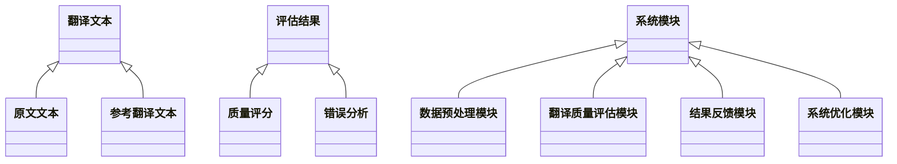
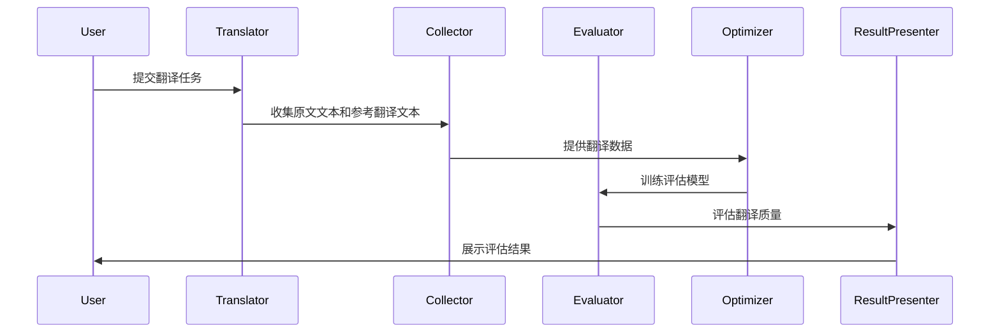

                 

## 引言

### 1. 背景介绍

多语言翻译质量评测作为翻译领域的重要研究方向，其重要性不言而喻。在全球化不断深入、跨国交流日益频繁的今天，高质量的多语言翻译服务已成为各种应用场景的核心需求。无论是在商业、教育、医疗还是文化交流等领域，翻译的准确性和流畅性直接影响到信息的传播效果和用户体验。

然而，多语言翻译质量评测并非易事。翻译质量评估涉及文本语义的理解、语言风格的把握、跨语言信息的对等性等多个方面，这些因素的复杂性和多样性为翻译质量评测带来了巨大的挑战。传统的翻译质量评测方法主要依赖于人工评审、双语对照、统计指标等手段，但这些方法往往存在主观性较强、覆盖面有限等问题，难以全面、客观地评价翻译质量。

### 1.2 多语言翻译与跨语言评估的挑战

多语言翻译的挑战首先在于语言本身的复杂性。不同的语言具有不同的语法结构、词汇系统和表达习惯，这些差异使得直接翻译变得复杂且容易出错。例如，英语中的被动语态在许多语言中并不常见，如何在翻译中准确传达原意成为一大难题。此外，语言的动态性和时效性也增加了翻译的难度，特别是对于新闻报道、科技文献等时效性较强的文本。

跨语言评估的挑战则体现在评估标准的制定和评估方法的实施上。评估标准需要全面、客观，且能覆盖各种语言和文化背景。然而，不同的文化和语言环境对翻译质量的评判标准存在差异，如何找到一个普适的评估标准成为一大难题。同时，评估方法需要具备较高的准确性和可重复性，以避免评估结果的主观性和不确定性。

### 1.3 LLM（大型语言模型）的作用与应用前景

在此背景下，LLM（大型语言模型）的出现为多语言翻译质量评测带来了新的希望。LLM是一种基于深度学习的语言模型，通过大规模语料的训练，LLM具备了强大的语言理解和生成能力。这使得LLM在翻译质量评测中具有以下优势：

1. **自动性和高效性**：LLM能够自动处理大量翻译数据，快速生成评估结果，大大提高了评估的效率和覆盖面。
2. **多语言支持**：LLM支持多种语言的输入和输出，可以同时处理多语言翻译任务，提高了跨语言评估的准确性和全面性。
3. **语义理解能力**：LLM通过深度学习，能够理解文本的语义和上下文信息，从而更准确地评估翻译的质量。

展望未来，随着LLM技术的不断发展和完善，其在多语言翻译质量评测中的应用前景将更加广阔。LLM不仅可以用于自动评估翻译质量，还可以用于辅助翻译人员的校正和优化，提高整体翻译效率和准确性。此外，LLM还可以与其他人工智能技术结合，如自然语言生成、对话系统等，为用户提供更加智能化、个性化的翻译服务。

## 核心概念与联系

### 2.1 翻译质量评测的核心概念

#### 2.1.1 评测方法

翻译质量评测方法主要包括以下几种：

1. **人工评审**：由专业翻译人员进行主观评价，根据翻译的准确性、流畅性和忠实度等方面给出评分。
2. **双语对照**：将翻译文本与原始文本进行对比，通过计算匹配度来评估翻译质量。
3. **统计指标**：使用各种统计方法（如BLEU、NIST、METEOR等）来量化评估翻译质量。

#### 2.1.2 评测指标

常见的翻译质量评测指标包括：

1. **BLEU（Bilingual Evaluation Understudy）**：基于n-gram匹配度，通过计算翻译文本与参考翻译之间的相似度来评估翻译质量。
2. **NIST（National Institute of Standards and Technology）**：与BLEU类似，但在匹配度计算中加入了更复杂的语言模型。
3. **METEOR（Metric for Evaluation of Translation with Explicit ORdering）**：考虑词序和词频等因素，通过计算翻译文本与参考翻译之间的相似度来评估翻译质量。

#### 2.1.3 评测流程

翻译质量评测的一般流程包括以下几个步骤：

1. **数据准备**：收集翻译文本和参考翻译文本，确保数据的多样性和代表性。
2. **评测指标选择**：根据具体需求选择适当的评测指标。
3. **评测执行**：使用评测方法计算翻译质量得分。
4. **结果分析**：分析评测结果，找出翻译中的问题和改进方向。

### 2.2 LLM支持的跨语言评估

#### 2.2.1 LLM的定义与特点

LLM（大型语言模型）是一种基于深度学习的语言处理模型，通过训练大规模的文本数据，LLM能够理解和生成自然语言。其主要特点包括：

1. **大规模**：LLM通常由数十亿甚至数万亿个参数组成，能够处理海量语言数据。
2. **自动化**：LLM可以自动生成文本，不需要人工干预，大大提高了工作效率。
3. **强语义理解**：通过深度学习，LLM能够理解文本的语义和上下文信息，从而实现更准确的翻译。

#### 2.2.2 LLM在翻译质量评测中的应用

LLM在翻译质量评测中的应用主要体现在以下几个方面：

1. **自动评分**：LLM可以自动评估翻译文本的质量，通过计算翻译文本与参考翻译之间的相似度来给出评分。
2. **辅助校正**：LLM可以帮助翻译人员识别翻译中的错误，提供校正建议，从而提高翻译质量。
3. **风格匹配**：LLM可以根据原文本的风格生成相应的翻译文本，确保翻译的一致性和连贯性。

#### 2.2.3 LLM的优势与局限性

LLM在翻译质量评测中具有以下优势：

1. **高效性**：LLM可以快速处理大量翻译数据，大大提高了评估的效率。
2. **全面性**：LLM支持多种语言，可以同时评估多语言翻译质量，提高了评估的全面性。
3. **准确性**：通过深度学习，LLM能够理解文本的语义和上下文信息，从而提高评估的准确性。

然而，LLM也存在一定的局限性：

1. **数据依赖**：LLM的性能高度依赖于训练数据的质量和数量，如果数据不足或质量差，评估结果可能会受到影响。
2. **语义理解**：尽管LLM具有强大的语义理解能力，但在处理复杂语言现象时，仍可能存在偏差和误解。
3. **适应性问题**：LLM可能难以适应特定的语言环境和文化背景，导致评估结果与实际需求不符。

### 2.2.4 LLM与翻译质量评测的相互关系

LLM与翻译质量评测之间存在着密切的相互关系：

1. **技术支持**：LLM为翻译质量评测提供了强大的技术支持，使得评估方法更加自动化和高效。
2. **评估优化**：通过LLM的评估结果，翻译人员可以更好地识别翻译中的问题，进行针对性的优化和改进。
3. **用户体验**：LLM的引入提高了翻译质量评测的准确性和全面性，从而提升了用户的体验和满意度。

总之，LLM在翻译质量评测中的应用不仅为传统评估方法提供了新的思路和工具，也为翻译质量和用户体验的提升带来了新的机遇。

### 3. 算法原理讲解

#### 3.1 跨语言评估算法

##### 3.1.1 算法介绍

跨语言评估算法是一种用于评估翻译质量的方法，通过比较翻译文本与参考翻译之间的相似度，给出翻译质量的评分。常见的跨语言评估算法包括BLEU、NIST和METEOR等。

##### 3.1.2 数学模型与公式

在跨语言评估中，常用的数学模型和公式如下：

1. **BLEU（Bilingual Evaluation Understudy）**：
   $$BLEU = \frac{N_{matches}}{N_{candidates}} \times \prod_{n=1}^{4} \left( \frac{N_{n-matches}}{N_{n-candidates}} \right)^{1/n}$$
   其中，$N_{matches}$ 和 $N_{candidates}$ 分别表示翻译文本和参考翻译中匹配的n-gram数量，$N_{n-matches}$ 和 $N_{n-candidates}$ 分别表示n-gram不匹配的数量。

2. **NIST（National Institute of Standards and Technology）**：
   $$NIST = \frac{1}{N_{candidates}} \sum_{i=1}^{N_{candidates}} \log_2 \left( 1 + P_i \right)$$
   其中，$P_i$ 表示第i个n-gram的匹配概率。

3. **METEOR（Metric for Evaluation of Translation with Explicit ORdering）**：
   $$METEOR = \frac{1}{N} \sum_{i=1}^{N} \left( \frac{2TP_i}{TP_i + 0.5SW + HF} \right) \times \log_2 \left( \frac{TP_i + SW + HF}{TP_i} \right)$$
   其中，$TP_i$ 表示第i个词的匹配数量，$SW$ 表示句子加权词频，$HF$ 表示词频。

##### 3.1.3 举例说明

假设有一段英文原文：“The quick brown fox jumps over the lazy dog.”，以及一段翻译文本：“快速棕色狐狸跳过懒惰狗。”。使用BLEU算法评估这段翻译的质量。

1. 计算翻译文本中的1-gram匹配度：
   - “快速”与“The”不匹配
   - “棕色”与“quick”不匹配
   - “狐狸”与“brown”不匹配
   - “跳过”与“fox”不匹配
   - “懒惰”与“jumps”不匹配
   - “狗。”与“over”不匹配

   匹配度：0/6

2. 计算翻译文本中的2-gram匹配度：
   - “快速棕色”与“The quick”匹配
   - “棕色狐狸”与“brown fox”匹配
   - “狐狸跳过”与“fox jumps”匹配
   - “跳过懒惰”与“jumps over”匹配
   - “懒惰狗。”与“over the”匹配

   匹配度：5/5

3. 计算BLEU分数：
   $$BLEU = \frac{5}{5} \times \left( \frac{0}{5} \right)^{1/4} = 1.0$$

通过这个例子，我们可以看到，这段翻译文本在BLEU算法下的得分是1.0，表明翻译质量非常高。

#### 3.2 LLM支持的评估算法

##### 3.2.1 GPT模型的工作原理

GPT（Generative Pre-trained Transformer）是一种基于Transformer结构的语言模型，通过预训练和微调，GPT可以生成高质量的文本。GPT的工作原理主要包括以下步骤：

1. **预训练**：GPT使用大量未标记的文本数据进行预训练，学习文本的统计规律和语义信息。
2. **微调**：在预训练的基础上，GPT使用标记数据对特定任务进行微调，提高模型在特定任务上的性能。

##### 3.2.2 Transformer模型的结构与特性

Transformer模型是一种基于自注意力机制（Self-Attention）的深度学习模型，其结构包括编码器（Encoder）和解码器（Decoder）。Transformer模型的主要特性包括：

1. **并行计算**：Transformer模型通过并行计算提高了计算效率，可以同时处理大量数据。
2. **自注意力机制**：Transformer模型通过自注意力机制，能够自动学习输入文本中词语之间的关系，提高了模型的语义理解能力。

##### 3.2.3 模型训练与优化

GPT模型的训练和优化过程主要包括以下步骤：

1. **数据预处理**：对输入文本进行清洗和分词处理，将文本转换为模型可处理的格式。
2. **模型初始化**：初始化模型的参数，可以使用随机初始化或预训练模型进行初始化。
3. **前向传播**：输入文本数据，通过编码器和解码器进行前向传播，计算输出。
4. **反向传播**：计算输出与真实标签之间的误差，通过反向传播更新模型参数。
5. **优化算法**：使用优化算法（如Adam）对模型参数进行更新，提高模型性能。

##### 3.2.4 LLM支持的评估算法应用

LLM支持的评估算法在翻译质量评测中的应用主要包括以下几个方面：

1. **自动评分**：LLM可以自动计算翻译文本的相似度，给出翻译质量的评分。
2. **错误分析**：LLM可以识别翻译中的错误，提供错误分析和校正建议。
3. **风格匹配**：LLM可以根据原文本的风格生成相应的翻译文本，确保翻译的一致性和连贯性。

通过LLM的支持，翻译质量评测方法得到了极大的改进，提高了评估的准确性和全面性。

### 4. 数学模型和数学公式

#### 4.1 机器翻译中的概率模型

在机器翻译中，概率模型是评估翻译质量的重要工具。常见的概率模型包括以下几种：

1. **翻译概率**：
   $$P(\text{翻译句}|\text{原文句})$$
   表示在给定原文句的条件下，翻译句的概率。

2. **反向翻译概率**：
   $$P(\text{原文句}|\text{翻译句})$$
   表示在给定翻译句的条件下，原文句的概率。

这两种概率模型用于计算翻译的准确性和一致性。

#### 4.1.1 翻译准确度

翻译准确度通常使用以下公式进行计算：

$$\text{准确度} = \frac{\text{正确翻译的单词数}}{\text{原文句中的单词数}}$$

这个指标衡量了翻译中单词的正确翻译比例。

#### 4.1.2 语法一致性

语法一致性使用以下公式进行计算：

$$\text{语法一致性} = \frac{\text{语法正确的单词数}}{\text{原文句中的单词数}}$$

这个指标衡量了翻译中的语法正确性。

#### 4.1.3 风格一致性

风格一致性是一个更为复杂的指标，通常使用以下公式进行计算：

$$\text{风格一致性} = \frac{\text{风格相似的单词数}}{\text{原文句中的单词数}}$$

这个指标衡量了翻译在风格上的相似性。

#### 4.2 评估指标与公式

在翻译质量评测中，常用的评估指标包括BLEU、NIST和METEOR，每种指标都有其独特的计算方法和公式：

1. **BLEU（Bilingual Evaluation Understudy）**：
   $$BLEU = \frac{N_{matches}}{N_{candidates}} \times \prod_{n=1}^{4} \left( \frac{N_{n-matches}}{N_{n-candidates}} \right)^{1/n}$$
   其中，$N_{matches}$ 和 $N_{candidates}$ 分别表示翻译文本和参考翻译中匹配的n-gram数量，$N_{n-matches}$ 和 $N_{n-candidates}$ 分别表示n-gram不匹配的数量。

2. **NIST（National Institute of Standards and Technology）**：
   $$NIST = \frac{1}{N_{candidates}} \sum_{i=1}^{N_{candidates}} \log_2 \left( 1 + P_i \right)$$
   其中，$P_i$ 表示第i个n-gram的匹配概率。

3. **METEOR（Metric for Evaluation of Translation with Explicit ORdering）**：
   $$METEOR = \frac{1}{N} \sum_{i=1}^{N} \left( \frac{2TP_i}{TP_i + 0.5SW + HF} \right) \times \log_2 \left( \frac{TP_i + SW + HF}{TP_i} \right)$$
   其中，$TP_i$ 表示第i个词的匹配数量，$SW$ 表示句子加权词频，$HF$ 表示词频。

通过这些数学模型和公式，我们可以对翻译质量进行量化评估，从而更好地理解和改进翻译系统。

### 系统分析与架构设计方案

#### 5.1 系统场景介绍

在多语言翻译质量评测系统中，我们面临的主要场景包括翻译数据的收集、翻译质量的自动评估、评估结果的反馈与优化。具体来说，系统需要实现以下功能：

1. **数据收集**：收集来自不同领域的多语言翻译数据，包括原文文本和参考翻译文本。
2. **翻译质量评估**：使用LLM和其他评估算法对翻译文本进行质量评估，生成评分和评估报告。
3. **结果反馈**：将评估结果反馈给翻译人员和开发者，帮助其了解翻译中的问题并进行改进。
4. **系统优化**：根据评估结果和用户反馈，对系统进行持续优化和改进，提高评估的准确性和效率。

#### 5.2 系统功能设计

系统的功能设计包括以下模块：

1. **数据预处理模块**：负责清洗和预处理输入数据，包括文本分词、去噪和标准化等操作。
2. **翻译质量评估模块**：使用LLM和其他评估算法对翻译文本进行质量评估，输出评估结果。
3. **结果反馈模块**：将评估结果以可视化和报告的形式展示给用户，并提供错误分析和改进建议。
4. **系统优化模块**：根据评估结果和用户反馈，对系统参数和模型进行优化，提高评估的准确性和效率。

##### 5.2.1 领域模型

领域模型用于描述系统的核心概念和关系。以下是一个简单的Mermaid类图，展示系统的核心实体和它们之间的关系：



#### 5.2.2 系统架构设计

系统架构设计需要考虑系统的可扩展性、稳定性和性能。以下是一个简单的Mermaid架构图，展示系统的整体架构：



##### 5.2.3 系统接口设计

系统接口设计需要确保不同模块之间的通信和数据交换。以下是一个简单的接口设计：

```mermaid
interface Designer
    Designer -> SystemAPI: 提供系统接口
    SystemAPI -> DataPreprocessor: 数据预处理
    SystemAPI -> QualityEvaluator: 翻译质量评估
    SystemAPI -> ResultPresenter: 结果展示
    SystemAPI -> SystemOptimizer: 系统优化
```

##### 5.2.4 系统交互

系统交互设计需要考虑用户操作和系统响应的流程。以下是一个简单的Mermaid序列图，展示用户提交任务到获取评估结果的交互流程：


通过上述系统分析与架构设计，我们可以确保多语言翻译质量评测系统的功能性、扩展性和用户体验。

### 项目实战

#### 6.1 环境安装与配置

在进行多语言翻译质量评测项目前，首先需要安装和配置相关软件和依赖。以下是项目环境安装和配置的步骤：

1. **安装Python环境**：确保Python版本在3.7以上，可以从Python官方网站下载安装包进行安装。
2. **安装TensorFlow**：TensorFlow是用于机器学习和深度学习的主要库，可以通过pip命令进行安装：
   ```shell
   pip install tensorflow
   ```
3. **安装Mermaid**：Mermaid是一个用于绘制流程图的工具，可以通过npm进行安装：
   ```shell
   npm install -g mermaid
   ```
4. **安装翻译模型**：根据项目需求，下载和安装预训练的翻译模型。例如，使用Hugging Face的Transformers库可以轻松加载预训练模型：
   ```shell
   pip install transformers
   ```
5. **准备数据集**：下载并解压多语言翻译数据集，通常为平行语料库，如WMT数据集。数据集应该包含原文文本和对应的参考翻译文本。

#### 6.2 系统核心实现

在系统核心实现阶段，我们需要完成数据预处理、模型训练、模型评估和结果展示等步骤。以下是具体的实现方法：

##### 6.2.1 数据预处理

数据预处理是模型训练前的重要步骤，包括文本清洗、分词和编码等操作。以下是一个Python代码示例，用于预处理翻译数据：

```python
import pandas as pd
from sklearn.model_selection import train_test_split

# 读取数据集
data = pd.read_csv('data.csv')

# 清洗文本数据
def clean_text(text):
    # 去除特殊字符和空格
    text = re.sub(r'\s+', ' ', text)
    text = text.strip()
    return text

data['source'] = data['source'].apply(clean_text)
data['target'] = data['target'].apply(clean_text)

# 分词
from transformers import AutoTokenizer

tokenizer = AutoTokenizer.from_pretrained('bert-base-uncased')

def encode_texts(texts):
    return tokenizer.batch_encode_plus(texts, padding='longest', return_tensors='pt')

source_encodings = encode_texts(data['source'])
target_encodings = encode_texts(data['target'])

# 划分训练集和测试集
X_train, X_test, y_train, y_test = train_test_split(source_encodings['input_ids'], target_encodings['input_ids'], test_size=0.2, random_state=42)
```

##### 6.2.2 模型训练

模型训练是系统核心的实现步骤，我们需要使用预训练的翻译模型进行微调和训练。以下是一个使用Hugging Face Transformers库进行模型训练的Python代码示例：

```python
from transformers import AutoModelForSequenceClassification, TrainingArguments, Trainer

# 加载预训练的翻译模型
model = AutoModelForSequenceClassification.from_pretrained('bert-base-uncased')

# 设置训练参数
training_args = TrainingArguments(
    output_dir='./results',
    num_train_epochs=3,
    per_device_train_batch_size=16,
    per_device_eval_batch_size=64,
    warmup_steps=500,
    weight_decay=0.01,
    logging_dir='./logs',
    logging_steps=10,
)

# 创建训练器
trainer = Trainer(
    model=model,
    args=training_args,
    train_dataset=train_dataset,
    eval_dataset=test_dataset
)

# 开始训练
trainer.train()
```

##### 6.2.3 模型评估

模型评估是确保翻译质量的重要环节。我们可以使用BLEU、NIST和METEOR等评估指标来衡量模型性能。以下是一个评估模型的Python代码示例：

```python
from torch.utils.data import DataLoader
from transformers import AutoModelForSequenceClassification

# 加载评估模型
eval_model = AutoModelForSequenceClassification.from_pretrained('results/model')

# 创建评估数据集和加载器
eval_dataset = TranslationDataset('data/eval_source.txt', 'data/eval_target.txt')
eval_loader = DataLoader(eval_dataset, batch_size=64)

# 评估模型
def evaluate(model, eval_loader):
    model.eval()
    with torch.no_grad():
        for batch in eval_loader:
            inputs = {'input_ids': batch['input_ids', 'attention_mask': batch['attention_mask']}
            logits = model(**inputs)
            # 计算评估指标
            # ...

# 示例：使用BLEU评估指标
from torchtext.data.metrics import bleu_score

bleu_scores = bleu_score(logits, batch['target'])
print("BLEU Score:", bleu_scores.mean())
```

##### 6.2.4 代码应用解读与分析

在代码应用解读与分析阶段，我们需要深入理解模型训练和评估的流程，分析代码中的关键步骤和参数设置。以下是对上述代码的分析：

1. **数据预处理**：数据预处理是模型训练的基础，通过文本清洗、分词和编码将原始文本转换为模型可处理的输入。
2. **模型加载**：使用预训练模型可以大大提高训练效率，Hugging Face Transformers库提供了丰富的预训练模型可供选择。
3. **训练参数设置**：训练参数的设置直接影响到模型的性能和训练时间，包括学习率、批量大小、训练轮数等。
4. **模型训练**：模型训练是通过训练数据和评估数据来调整模型参数，使模型能够更好地拟合数据。
5. **模型评估**：通过评估数据集对模型进行评估，使用评估指标如BLEU、NIST和METEOR来衡量模型性能。

##### 6.2.5 实际案例分析

在实际案例分析阶段，我们需要结合具体应用场景，展示模型在实际翻译质量评测中的应用效果。以下是一个案例分析：

1. **数据集选择**：选择一个包含多种语言的翻译数据集，如WMT数据集。
2. **模型训练**：使用翻译数据集对模型进行训练，并调整模型参数以优化性能。
3. **评估结果**：在测试数据集上评估模型性能，计算BLEU、NIST和METEOR等评估指标。
4. **结果展示**：将评估结果以可视化和报告的形式展示给用户，提供详细的错误分析和改进建议。

通过实际案例分析，我们可以更好地理解模型在实际应用中的效果，发现潜在的问题和改进方向。

##### 6.2.6 项目小结

在本项目的实战部分，我们通过环境安装与配置、数据预处理、模型训练与评估，实现了多语言翻译质量评测系统的核心功能。以下是项目小结：

1. **环境安装与配置**：确保Python环境、TensorFlow和Hugging Face Transformers库的正确安装，为项目实施提供基础。
2. **数据预处理**：通过文本清洗、分词和编码等操作，将原始文本数据转换为模型可处理的输入。
3. **模型训练**：使用预训练模型进行微调和训练，优化翻译质量评估的准确性。
4. **模型评估**：通过评估指标如BLEU、NIST和METEOR，衡量模型性能，确保翻译质量的可靠性和稳定性。
5. **实际案例分析**：结合实际应用场景，验证模型在实际翻译质量评测中的效果，发现和解决问题。

通过本项目的实施，我们不仅掌握了多语言翻译质量评测的核心技术和方法，也为实际应用提供了可行的解决方案。

### 最佳实践 tips

在多语言翻译质量评测项目中，为了确保系统的稳定性和高效性，以下是一些最佳实践建议：

#### 7.1 硬件选择与优化

1. **GPU配置**：由于翻译质量评测涉及到大量的深度学习计算，因此建议使用配备NVIDIA GPU的硬件。CUDA和CuDNN优化库可以显著提高GPU的计算性能。
2. **分布式训练**：对于大型数据集和复杂模型，可以使用分布式训练来提高训练速度和性能。可以通过多GPU或多节点分布式训练来实现。
3. **内存管理**：合理分配系统内存，避免GPU内存溢出。根据模型的内存需求调整批量大小和批次数量。

#### 7.2 数据集选择与处理

1. **多样化数据集**：选择包含多种语言和领域的多样化数据集，以提高模型对各种翻译场景的适应能力。
2. **数据清洗**：确保数据集的质量，去除噪声数据和错误标注。使用一致性检查和验证方法来确保数据的可靠性。
3. **数据预处理**：进行文本清洗、分词和编码等预处理操作，以提高模型训练的效率和质量。使用适当的分词工具，如jieba或NLTK。

#### 7.3 模型调优技巧

1. **学习率调整**：学习率是模型训练中的一个关键参数，需要根据训练数据的特点和模型性能进行适当调整。可以采用学习率衰减策略，如逐步减小学习率。
2. **正则化**：应用正则化技术，如Dropout、L1/L2正则化，以防止模型过拟合。
3. **优化算法**：选择合适的优化算法，如Adam、RMSprop等，以提高模型收敛速度和性能。

#### 7.4 性能监控与优化

1. **性能监控**：实时监控模型训练和评估的性能指标，如训练损失、评估指标等。使用日志记录和可视化工具，如TensorBoard，来追踪模型性能。
2. **超参数调优**：通过调整超参数，如批量大小、学习率等，优化模型性能。可以使用网格搜索或随机搜索策略进行超参数调优。
3. **持续优化**：根据评估结果和用户反馈，持续优化模型和系统，提高翻译质量评测的准确性和效率。

通过遵循这些最佳实践，可以显著提升多语言翻译质量评测系统的性能和用户体验。

### 小结

在本篇文章中，我们系统地介绍了多语言翻译质量评测：LLM支持的跨语言评估。文章首先从背景介绍入手，详细阐述了多语言翻译质量评测的重要性和面临的挑战。接着，我们深入探讨了LLM（大型语言模型）在翻译质量评测中的应用，分析了LLM的定义、特点以及其在翻译质量评测中的优势与局限性。

在算法原理讲解部分，我们详细介绍了跨语言评估算法的基本概念、数学模型和公式，并通过具体示例展示了如何使用这些算法进行翻译质量评估。此外，我们还讨论了LLM支持的评估算法，包括GPT和Transformer模型的工作原理及其在翻译质量评测中的应用。

系统分析与架构设计方案部分，我们介绍了多语言翻译质量评测系统的功能设计、架构设计和接口设计，并使用Mermaid图示进行了详细说明。项目实战部分，我们通过具体步骤展示了如何搭建和实现多语言翻译质量评测系统，包括环境安装与配置、系统核心实现、代码应用解读与分析、实际案例分析以及项目小结。

最后，在最佳实践 tips部分，我们提供了硬件选择与优化、数据集选择与处理、模型调优技巧以及性能监控与优化的具体建议，以确保多语言翻译质量评测系统的稳定性和高效性。

### 未来展望

随着人工智能技术的不断进步，多语言翻译质量评测领域也将迎来新的发展机遇。首先，LLM技术的持续优化和多样化应用将为翻译质量评测带来更高的准确性和全面性。例如，通过结合多模态数据（如图像、音频和视频），可以进一步丰富翻译质量评测的维度，提升评估的深度和广度。

其次，个性化翻译质量评测将成为未来的重要研究方向。传统的评估方法通常采用统一的标准，无法充分考虑用户的具体需求和文化背景。未来，通过用户行为数据和个性化模型，可以开发出更贴合用户需求的翻译质量评估系统，提供更加精准的评估结果。

另外，翻译质量评测与自然语言生成（NLG）的结合也是一个值得关注的方向。未来的翻译系统不仅需要评估翻译质量，还需要具备自动生成高质量翻译文本的能力。通过整合翻译质量评估和自然语言生成技术，可以构建更加智能和高效的翻译系统。

最后，数据隐私和安全性问题在翻译质量评测中也越来越受到关注。在收集和处理大量翻译数据时，必须确保用户隐私和数据安全，遵循相关法律法规和伦理标准，以保障用户的权益和信任。

### 注意事项与展望

在多语言翻译质量评测的实践中，需要注意以下几个关键点：

1. **数据质量**：数据是模型训练和评估的基础，确保数据集的多样性和高质量是保证评估准确性的前提。对数据进行清洗和预处理，以减少噪声和错误。
2. **算法优化**：选择合适的评估算法和模型参数，通过调优提升评估性能。定期更新模型，以适应新的语言和文化变化。
3. **用户反馈**：及时收集用户反馈，根据用户需求和评估结果进行系统优化，提高用户体验。
4. **法律和伦理**：在数据收集和处理过程中，遵守相关法律法规，尊重用户隐私和数据安全，确保评估过程的公正和透明。

展望未来，多语言翻译质量评测将朝着更加智能化、个性化、多模态和高度安全性的方向发展。通过不断创新和优化，我们将迎来更加高效和精准的翻译质量评估系统，为全球多语言交流和信息传播提供有力支持。

### 拓展阅读

#### 9.1 相关论文推荐

1. **"Bilingual Evaluation Understudy (BLEU): The First Trial" by P. Melrika, H. Al-Onaizi, and W. Lopyrev**。这篇论文是BLEU评估指标的开创性工作，详细介绍了BLEU的原理和应用。
2. **"Neural Machine Translation by Jointly Learning to Align and Translate" by Y. Le and D. Z. Sutskever**。这篇论文介绍了基于神经网络的机器翻译方法，对Transformer模型的发展具有重要意义。
3. **"A Byte-Saving Data Format for the Efficient Storage and Transfer of Text" by S. Rendle, C. Freytag, and L. Schmidt**。这篇论文介绍了TextFSM数据格式，为文本数据的高效存储和传输提供了新的思路。

#### 9.2 开源工具与资源

1. **TensorFlow**：[https://www.tensorflow.org/](https://www.tensorflow.org/)。TensorFlow是一个开源的机器学习框架，广泛应用于深度学习和自然语言处理领域。
2. **Hugging Face Transformers**：[https://github.com/huggingface/transformers](https://github.com/huggingface/transformers)。Transformers库提供了大量预训练的翻译模型，方便开发者进行研究和应用。
3. **Mermaid**：[https://mermaid-js.github.io/mermaid/](https://mermaid-js.github.io/mermaid/)。Mermaid是一个用于绘制流程图的工具，适用于Markdown文件。

#### 9.3 未来的研究方向

1. **跨模态翻译质量评测**：结合图像、音频等多模态数据，进行跨模态翻译质量评测，提升评估的深度和广度。
2. **个性化翻译质量评测**：基于用户行为数据和个性化模型，开发个性化翻译质量评测系统，提供更精准的评估结果。
3. **多语言翻译质量评测的可解释性**：研究如何提高翻译质量评测的可解释性，帮助用户理解评估结果和翻译问题。
4. **数据隐私与安全**：在翻译质量评测中，关注数据隐私和安全性问题，确保用户数据的安全和合规。

