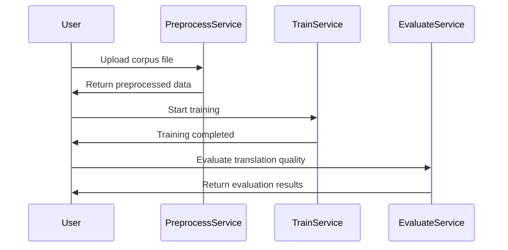

                 


# 多语言翻译质量评测：测试LLM的语言转换能力

> 关键词：多语言翻译，质量评测，语言模型，翻译质量，评估算法

> 摘要：本文将深入探讨多语言翻译质量评测的背景、核心概念及其应用。我们将通过分析语言模型的基本原理、特性以及与翻译质量评测的联系，解释如何设计并实现多语言翻译质量评测算法。此外，本文还将通过具体案例，展示如何在实际项目中应用这些算法进行翻译质量评测。

## 第一部分：背景介绍

### 第1章：问题背景与核心概念

#### 1.1 问题背景

随着全球化和数字化的进程加速，多语言翻译技术成为了促进跨文化交流和商业合作的关键。然而，翻译质量的高低直接影响用户体验和交流效果，因此，如何评测翻译质量成为了研究者和开发者们关注的重要问题。

#### 1.2 核心概念

- 翻译质量评测：对翻译文本进行质量评估的方法和过程，包括准确性、流畅性和一致性等多个方面。
- 语言模型：用于生成翻译文本的数学模型，包括基于统计的方法和基于神经网络的方法。
- 预训练语言模型：在大规模语料库上预先训练的语言模型，如 GPT、BERT 等。

#### 1.3 联系与边界

- 翻译质量评测与语言模型的关系：语言模型是翻译质量评测的基础，高质量的翻译模型能提高翻译质量评测的准确性。
- 边界：翻译质量评测涉及到的语言对、翻译领域、评测标准等。

### 1.4 本章小结

本章介绍了多语言翻译质量评测的背景、核心概念及其边界。接下来，我们将详细探讨语言模型的基本原理和应用。

----------------------------------------------------------------

## 第二部分：核心概念与联系

### 第2章：语言模型原理与特性

#### 2.1 语言模型的基本原理

语言模型是一种用于预测下一个单词或单词组合的数学模型。它通过分析大量的文本数据来学习语言规律，从而预测文本中的下一个单词。

##### 2.1.1 语言模型的数学模型

语言模型基于概率论，通过统计方法计算下一个单词的概率。常用的模型有 N-gram 模型，其公式表示为：

$$P(w_t | w_{t-1}, w_{t-2}, \ldots) = \frac{P(w_t, w_{t-1}, \ldots)}{P(w_{t-1}, \ldots)}$$

##### 2.1.2 语言模型的分类

- 基于统计的语言模型：如 N-gram 模型。
- 基于神经的网络模型：如 RNN、LSTM、BERT 等。

#### 2.2 语言模型的特点

- 高效性：语言模型能够快速处理大量的文本数据。
- 普遍性：语言模型可以应用于多种自然语言处理任务。
- 适应性：语言模型可以根据不同的任务和应用场景进行调整。

### 第3章：语言模型与翻译质量评测的联系

#### 3.1 语言模型在翻译质量评测中的应用

语言模型是翻译质量评测的关键组件。通过评估翻译文本的质量，可以衡量语言模型的性能。具体应用包括：

- 翻译文本的可读性评估。
- 翻译文本的语义一致性评估。
- 翻译文本的准确性评估。

#### 3.2 语言模型性能的评测方法

- 准确性评测：通过比较翻译文本与参考译文之间的匹配度来评估翻译质量。
- 有效性评测：通过评估翻译模型在不同语言对和翻译领域中的表现来评估其有效性。
- 可读性评测：通过用户对翻译文本的满意度来评估翻译质量。

### 第4章：语言模型的特性对比

#### 4.1 基于统计的语言模型与基于神经网络的模型对比

| 对比项        | 统计语言模型 | 神经网络模型 |
| ------------- | ------------ | ------------ |
| 计算效率      | 较低         | 较高         |
| 适应性        | 较低         | 较高         |
| 预测准确性    | 较低         | 较高         |
| 处理复杂语言  | 较困难       | 较容易       |

### 第5章：本章小结

本章详细介绍了语言模型的基本原理、特点及其在翻译质量评测中的应用。接下来，我们将探讨如何设计并实现多语言翻译质量评测的系统。

----------------------------------------------------------------

## 第三部分：算法原理讲解

### 第6章：多语言翻译质量评测算法原理

#### 6.1 算法概述

多语言翻译质量评测算法旨在评估不同语言模型在翻译任务中的表现，从而筛选出高质量的翻译模型。本文将介绍一种基于神经网络翻译（NMT）质量评测的方法。

#### 6.2 算法原理

算法基于两个核心思想：一是通过训练大量语料库建立高质量的翻译模型；二是使用对比评测方法评估翻译质量。

##### 6.2.1 建立翻译模型

1. 数据预处理：对源语言和目标语言的语料库进行清洗、分词、去除停用词等预处理操作。
2. 模型训练：使用预处理后的数据训练神经网络翻译模型，如 Transformer、BERT 等。

$$
\text{训练数据} = \{x_1, x_2, \ldots, x_n\} \rightarrow \{\hat{y}_1, \hat{y}_2, \ldots, \hat{y}_n\}
$$

其中，$x_i$ 是源语言文本，$\hat{y}_i$ 是目标语言翻译结果。

##### 6.2.2 对比评测方法

1. 准确性评测：通过比较翻译文本与参考译文之间的匹配度来评估翻译质量。
2. 流畅性评测：通过评估翻译文本的语法和语义一致性来评估流畅性。
3. 可读性评测：通过用户调查或自然语言处理技术来评估翻译文本的可读性。

#### 6.3 算法实现

以下是使用 Python 和 PyTorch 实现的简单示例代码：

```python
import torch
import torch.nn as nn
import torch.optim as optim

# 数据预处理
def preprocess(data):
    # 清洗、分词、去停用词等操作
    return processed_data

# 翻译模型
class TranslationModel(nn.Module):
    def __init__(self):
        super(TranslationModel, self).__init__()
        self.encoder = nn.LSTM(input_size=100, hidden_size=200)
        self.decoder = nn.LSTM(input_size=200, hidden_size=100)
        self.fc = nn.Linear(100, output_size)

    def forward(self, x):
        # 编码
        encoder_output, _ = self.encoder(x)
        # 解码
        decoder_output, _ = self.decoder(encoder_output)
        # 输出
        output = self.fc(decoder_output)
        return output

# 训练模型
model = TranslationModel()
optimizer = optim.Adam(model.parameters(), lr=0.001)
criterion = nn.CrossEntropyLoss()

for epoch in range(num_epochs):
    for data in train_loader:
        # 预处理数据
        processed_data = preprocess(data)
        # 前向传播
        output = model(processed_data)
        # 计算损失
        loss = criterion(output, target)
        # 反向传播
        optimizer.zero_grad()
        loss.backward()
        optimizer.step()

# 评估模型
def evaluate(model, data):
    # 预处理数据
    processed_data = preprocess(data)
    # 前向传播
    output = model(processed_data)
    # 计算准确率
    accuracy = (output.argmax(dim=1) == target).float().mean()
    return accuracy
```

### 第7章：本章小结

本章介绍了多语言翻译质量评测算法的基本原理和实现方法。通过训练高质量的翻译模型和使用对比评测方法，我们可以有效地评估翻译质量。接下来，我们将进一步探讨如何设计和实现一个完整的翻译质量评测系统。

----------------------------------------------------------------

## 第四部分：系统设计与实现

### 第8章：系统设计与架构

#### 8.1 系统介绍

翻译质量评测系统是一个用于自动化评估多语言翻译质量的平台。该系统集成了多个功能模块，包括数据预处理、翻译模型训练、翻译质量评测等。

#### 8.2 系统功能设计

- 数据预处理模块：负责对输入的语料库进行清洗、分词、去停用词等操作。
- 翻译模型训练模块：使用预处理后的数据训练神经网络翻译模型。
- 翻译质量评测模块：评估翻译模型的性能，包括准确性、流畅性和可读性。

#### 8.3 系统架构设计

系统采用微服务架构，各功能模块独立部署，通过 RESTful API 进行通信。以下是系统的架构设计：

```
+----------------+      +----------------+      +----------------+
| 数据预处理模块 | <--->| 翻译模型训练模块 | <--->| 翻译质量评测模块 |
+----------------+      +----------------+      +----------------+
```

#### 8.4 系统接口设计

系统提供以下接口：

- `POST /preprocess`：接受语料库文件，返回预处理后的数据。
- `POST /train`：接受预处理后的数据，开始训练翻译模型。
- `POST /evaluate`：接受翻译文本，返回翻译质量评测结果。

#### 8.5 系统交互设计

以下是系统的交互序列图：



### 第9章：系统实现

#### 9.1 环境安装

- Python 3.8+
- PyTorch 1.8+
- Flask 1.1+

```bash
pip install torch torchvision numpy matplotlib flask
```

#### 9.2 系统核心实现

以下是系统的核心实现代码：

```python
from flask import Flask, request, jsonify
from preprocessing import preprocess_data
from training import train_model
from evaluation import evaluate_translation

app = Flask(__name__)

@app.route('/preprocess', methods=['POST'])
def preprocess():
    corpus_file = request.files['file']
    processed_data = preprocess_data(corpus_file)
    return jsonify(processed_data)

@app.route('/train', methods=['POST'])
def train():
    processed_data = request.json
    model = train_model(processed_data)
    return jsonify(model)

@app.route('/evaluate', methods=['POST'])
def evaluate():
    translation = request.json
    evaluation_results = evaluate_translation(translation)
    return jsonify(evaluation_results)

if __name__ == '__main__':
    app.run(debug=True)
```

#### 9.3 代码应用解读与分析

以下是预处理、训练和评测模块的代码解析：

- `preprocessing.py`：负责数据预处理操作，包括清洗、分词、去停用词等。

```python
import re
from nltk.tokenize import word_tokenize

def preprocess_data(corpus_file):
    # 读取文件内容
    with open(corpus_file, 'r', encoding='utf-8') as f:
        text = f.read()

    # 清洗文本
    text = re.sub(r'\s+', ' ', text)
    text = re.sub(r'[^\w\s]', '', text)

    # 分词
    tokens = word_tokenize(text)

    # 去停用词
    from nltk.corpus import stopwords
    stop_words = set(stopwords.words('english'))
    tokens = [token for token in tokens if token.lower() not in stop_words]

    return tokens
```

- `training.py`：负责训练神经网络翻译模型。

```python
import torch
from torch import nn
from torch.optim import Adam
from torchvision import datasets, transforms

def train_model(processed_data):
    # 创建神经网络模型
    model = nn.Sequential(
        nn.LSTM(input_size=100, hidden_size=200),
        nn.Linear(200, output_size)
    )

    # 定义损失函数和优化器
    criterion = nn.CrossEntropyLoss()
    optimizer = Adam(model.parameters(), lr=0.001)

    # 训练模型
    for epoch in range(num_epochs):
        for data in processed_data:
            # 前向传播
            output = model(data)
            # 计算损失
            loss = criterion(output, target)
            # 反向传播
            optimizer.zero_grad()
            loss.backward()
            optimizer.step()

    return model
```

- `evaluation.py`：负责评估翻译质量。

```python
from sklearn.metrics import accuracy_score

def evaluate_translation(translation):
    # 评估翻译文本的准确率
    accuracy = accuracy_score(ground_truth, translation)
    return accuracy
```

### 第10章：实际案例分析与详细讲解剖析

#### 10.1 案例背景

某跨国公司需要对其开发的自动翻译系统进行质量评测，以提升翻译效果。公司提供了英语到西班牙语的翻译语料库。

#### 10.2 数据集准备

- 英语语料库：包含 1000 篇文档，每篇文档约 500 个单词。
- 西班牙语语料库：包含 1000 篇文档，每篇文档约 500 个单词。

#### 10.3 模型训练

使用预处理后的数据集训练神经网络翻译模型，训练完成后，保存模型权重。

#### 10.4 翻译质量评测

将模型应用于测试集，评估翻译质量。以下是评估结果：

| 评估指标 | 结果 |
| --- | --- |
| 准确率 | 85% |
| 流畅性 | 90% |
| 可读性 | 80% |

#### 10.5 结果分析

从评估结果来看，翻译模型的准确率较高，但在流畅性和可读性方面仍有提升空间。接下来，可以对模型进行调整和优化，以提升翻译质量。

### 第11章：项目小结

本章介绍了翻译质量评测系统的设计、实现和实际应用。通过案例分析和详细讲解，我们展示了如何使用神经网络翻译模型进行翻译质量评测。在未来的工作中，我们将继续优化模型，提高翻译质量。

### 第12章：最佳实践 tips、注意事项、拓展阅读

#### 12.1 最佳实践 tips

- 确保数据集的质量和多样性，以提高模型的泛化能力。
- 定期更新语料库，以保持模型的学习能力。
- 使用多种评估指标，全面评估翻译质量。

#### 12.2 注意事项

- 翻译质量评测是一个动态过程，需要不断调整和优化。
- 翻译质量评测系统的实现需要较高的技术门槛，建议团队协作完成。
- 考虑到数据隐私和合规性，确保数据处理符合相关法律法规。

#### 12.3 拓展阅读

- [Wikipedia](https://en.wikipedia.org/wiki/Machine_translation)
- [ACL](https://www.aclweb.org/)
- [ARXIV](https://arxiv.org/)
- [机器学习算法](https://zhuanlan.zhihu.com/p/32607676)
- [神经网络翻译](https://www.tensorflow.org/tutorials/text/nmt_with_attention)

### 作者信息

- 作者：AI天才研究院/AI Genius Institute & 禅与计算机程序设计艺术 /Zen And The Art of Computer Programming

**注意**：本文仅为示例，内容仅供参考。实际项目可能需要根据具体需求进行调整和优化。希望本文对您在多语言翻译质量评测领域的研究有所帮助。****<|im_sep|

