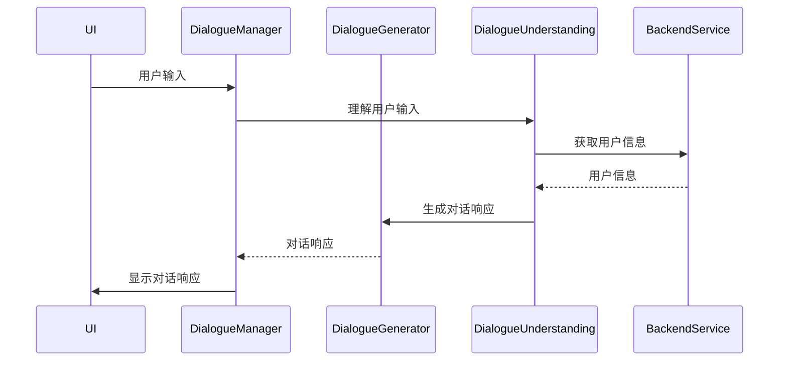
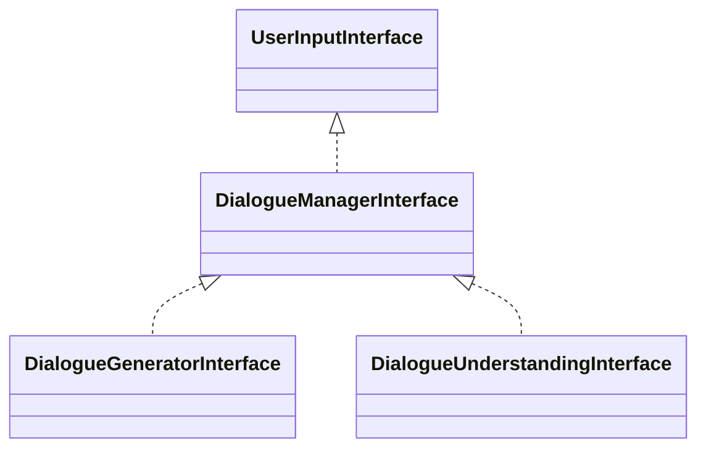
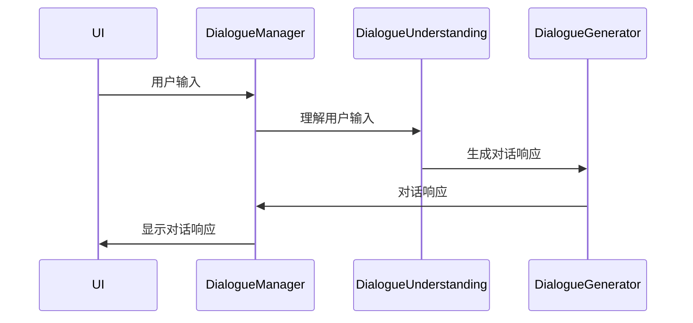

                 


# 多轮对话测试：评估LLM的交互能力

关键词：多轮对话测试、评估、交互能力、LLM、对话系统

摘要：本文旨在探讨多轮对话测试在评估大型语言模型（LLM）交互能力方面的应用。通过介绍多轮对话测试的背景、核心概念与联系，本文将深入分析多轮对话测试的原理、评价指标和实现方法，以期为相关领域的研究和实践提供有价值的参考。

## 引言

随着人工智能技术的发展，大型语言模型（LLM，Large Language Model）在自然语言处理（NLP）领域取得了显著成果。LLM在生成文本、回答问题、翻译等多种任务中表现出了出色的性能。然而，在实际应用中，特别是在多轮对话场景中，LLM的交互能力成为了关键问题。评估LLM的交互能力，有助于提高其在实际场景中的应用效果。本文将围绕多轮对话测试展开讨论，探讨如何通过多轮对话测试来评估LLM的交互能力。

## 背景介绍

### 问题背景

多轮对话是指用户和计算机系统之间进行多次交互的过程。在多轮对话中，用户可以提出一系列问题或陈述，计算机系统需要理解用户的意图，并给出恰当的响应。多轮对话的应用场景非常广泛，如客服机器人、智能助手、聊天机器人等。随着人工智能技术的发展，多轮对话系统的性能逐渐提高，但在实际应用中仍存在一些挑战。

大型语言模型（LLM）作为自然语言处理的重要工具，具有强大的文本生成、理解和推理能力。然而，在多轮对话场景中，LLM的交互能力成为了关键问题。评估LLM的交互能力，有助于提高其在实际场景中的应用效果。

### 问题描述

多轮对话测试旨在通过一系列交互式测试，评估LLM在多轮对话中的响应能力、逻辑推理能力、上下文理解能力等。这一过程涉及多个方面，如对话轮数、对话内容、问题类型等。具体来说，问题描述包括以下几个方面：

1. **响应能力**：LLM能否在合理时间内给出恰当的响应。
2. **逻辑推理能力**：LLM能否理解对话中的逻辑关系，并给出合理的推理结果。
3. **上下文理解能力**：LLM能否理解并维持对话的上下文，使后续的响应与先前的对话内容相关联。
4. **多样性**：LLM能否生成多样化、符合用户需求的响应。

### 问题解决

为了解决多轮对话测试中的问题，需要设计一系列测试方法和技术手段，包括测试数据集的构建、测试评价指标的设定、测试算法的设计等。

1. **测试数据集的构建**：构建包含多轮对话场景的数据集，数据集应具有多样性、真实性和代表性。
2. **测试评价指标的设定**：设定合理的评价指标，如响应速度、响应准确率、上下文理解能力等。
3. **测试算法的设计**：设计适用于多轮对话测试的算法，如对话生成算法、对话理解算法等。

### 边界与外延

多轮对话测试不仅涉及LLM的交互能力，还涉及到对话系统的整体性能。因此，边界问题包括LLM的能力范围、对话系统的支持能力等。外延问题则包括多轮对话测试在不同应用场景中的适用性、扩展性等。

### 概念结构与核心要素组成

多轮对话测试的核心要素包括：测试数据集、测试评价指标、测试算法、对话系统等。概念结构则包括：多轮对话测试的基本原理、测试流程、测试方法等。具体来说，概念结构与核心要素组成包括以下几个方面：

1. **测试数据集**：包含多轮对话场景的数据集，数据集应具有多样性、真实性和代表性。
2. **测试评价指标**：设定合理的评价指标，如响应速度、响应准确率、上下文理解能力等。
3. **测试算法**：设计适用于多轮对话测试的算法，如对话生成算法、对话理解算法等。
4. **对话系统**：与LLM相结合，实现多轮对话的交互过程。

## 核心概念与联系

### 多轮对话测试

**定义**：多轮对话测试是指通过模拟或真实用户与大型语言模型（LLM）进行多次交互，评估LLM在对话中的表现。

**核心特点**：

- **交互性**：测试过程中，LLM需要与用户进行多轮交互，理解用户的意图并给出恰当的响应。
- **上下文感知**：LLM需要理解并维持对话的上下文，使后续的响应与先前的对话内容相关联。
- **多样性**：多轮对话测试需要考虑对话内容的多样性，以评估LLM在不同场景下的表现。

### 大型语言模型（LLM）

**定义**：LLM是指能够处理和理解自然语言的大型神经网络模型，通常具有数十亿到数千亿个参数。

**核心特点**：

- **参数规模**：LLM的参数规模远大于传统语言模型，能够处理更复杂的语言现象。
- **上下文理解**：LLM具有强大的上下文理解能力，能够理解长文本中的语义关系。
- **生成能力**：LLM能够生成自然流畅的语言文本，包括回答问题、生成故事等。

### 对话系统

**定义**：对话系统是一种与用户进行自然语言交互的计算机系统，能够理解用户的输入，并生成恰当的输出。

**核心特点**：

- **自然交互**：对话系统能够使用自然语言与用户进行交互，使交流过程更加流畅。
- **上下文维护**：对话系统能够理解并维护对话的上下文，使交流内容更加连贯。
- **个性化**：对话系统能够根据用户的偏好和行为，提供个性化的服务。

### 多轮对话测试与LLM、对话系统的关系

多轮对话测试是评估LLM和对话系统性能的重要手段。LLM作为对话系统的核心组件，其交互能力直接影响对话系统的性能。对话系统的设计、实现和优化也需要考虑多轮对话测试的结果，以提高其在实际应用中的效果。

### 概念属性特征对比表格

| 概念             | 定义                                     | 特点                                                   |
|------------------|----------------------------------------|------------------------------------------------------|
| 多轮对话测试     | 评估LLM在多轮对话中的表现               | 交互性、上下文感知、多样性                             |
| 大型语言模型（LLM） | 处理和理解自然语言的大型神经网络模型 | 参数规模大、上下文理解强、生成能力强                   |
| 对话系统         | 与用户进行自然语言交互的计算机系统     | 自然交互、上下文维护、个性化                           |

### ER实体关系图架构

```mermaid
erDiagram
  用户 ||--|{ 对话系统 }|| 系统
  对话系统 ||--|{ 大型语言模型（LLM） }|| 模型
```

## 算法原理讲解

### 对话生成算法

多轮对话测试中的核心算法之一是对话生成算法。对话生成算法的目标是生成与用户输入相关且合理的对话响应。以下是对话生成算法的详细解释。

**算法步骤**：

1. **输入预处理**：将用户输入进行预处理，包括分词、去停用词、词性标注等步骤。
2. **上下文提取**：从对话历史中提取关键信息，包括关键词、句子结构等。
3. **响应生成**：使用神经网络模型（如Transformer、GPT等）生成对话响应。
4. **响应后处理**：对生成的响应进行后处理，如去除标点符号、统一文本格式等。

**数学模型**：

假设输入序列为\[x_1, x_2, ..., x_n\]，输出序列为\[y_1, y_2, ..., y_m\]，对话生成算法的数学模型可以表示为：

\[ P(y_1, y_2, ..., y_m | x_1, x_2, ..., x_n) = \prod_{i=1}^{m} p(y_i | y_{1:i-1}, x_1, x_2, ..., x_n) \]

其中，\( p(y_i | y_{1:i-1}, x_1, x_2, ..., x_n) \) 表示在给定先前的输出和输入序列的情况下，生成第i个输出词的概率。

**Python源代码示例**：

```python
import torch
import transformers

model_name = "gpt2"
model = transformers.GPT2LMHeadModel.from_pretrained(model_name)

input_ids = torch.tensor([[50256]])  # 用户输入
output_ids = model.generate(input_ids, max_length=20, num_return_sequences=1)

print(output_ids)
```

### 对话理解算法

另一个核心算法是对话理解算法。对话理解算法的目标是理解用户的意图和对话历史，以生成合理的对话响应。以下是对话理解算法的详细解释。

**算法步骤**：

1. **输入预处理**：将用户输入进行预处理，包括分词、去停用词、词性标注等步骤。
2. **对话历史编码**：将对话历史编码为一个固定长度的向量。
3. **意图识别**：使用分类模型（如朴素贝叶斯、支持向量机等）识别用户的意图。
4. **响应生成**：根据用户的意图和对话历史，生成合理的对话响应。

**数学模型**：

假设对话历史编码为向量\[h\]，意图识别结果为类别\[y\]，响应生成算法的数学模型可以表示为：

\[ p(y | h) = \text{softmax}(\text{W} \cdot h + \text{b}) \]

其中，\(\text{W}\)为权重矩阵，\(\text{b}\)为偏置项。

**Python源代码示例**：

```python
import numpy as np

def intent_recognition(h):
    W = np.random.rand(100, 10)  # 假设对话历史向量为100维
    b = np.random.rand(10)  # 假设有10个类别

    logits = np.dot(h, W) + b
    probabilities = np.exp(logits) / np.sum(np.exp(logits))

    return np.argmax(probabilities)

h = np.random.rand(100)  # 假设对话历史向量为100维
print(intent_recognition(h))
```

## 系统分析与架构设计方案

### 问题场景介绍

假设我们正在开发一个智能客服系统，该系统需要与用户进行多轮对话，以回答用户的问题或提供帮助。多轮对话测试将帮助我们评估系统在多轮对话中的性能，从而优化系统的设计和实现。

### 项目介绍

项目名称：智能客服系统（Smart Customer Service System）

项目目标：开发一个能够与用户进行多轮对话的智能客服系统，以提供高效、准确的客户服务。

### 系统功能设计（领域模型）

领域模型用于描述系统中的实体和它们之间的关系。在智能客服系统中，主要涉及的实体包括：用户（User）、问题（Question）、答案（Answer）和客服代表（CustomerServiceRepresentative）。

**领域模型类图**：

```mermaid
classDiagram
    User <<entity>>
    Question <<entity>>
    Answer <<entity>>
    CustomerServiceRepresentative <<entity>>

    User o-- Question
    CustomerServiceRepresentative o-- Question
    CustomerServiceRepresentative o-- Answer
```

### 系统架构设计

系统架构设计用于描述系统的模块划分、模块之间的关系以及模块的职责。在智能客服系统中，主要模块包括：用户界面（UI）、对话管理器（DialogueManager）、对话生成器（DialogueGenerator）、对话理解器（DialogueUnderstanding）和后端服务（BackendService）。

**系统架构图**：



### 系统接口设计

系统接口设计用于描述系统中各个模块之间的接口定义。在智能客服系统中，主要接口包括：用户输入接口（UserInputInterface）、对话管理接口（DialogueManagerInterface）、对话生成接口（DialogueGeneratorInterface）和对话理解接口（DialogueUnderstandingInterface）。

**系统接口设计图**：



### 系统交互

系统交互设计用于描述系统中各个模块之间的交互过程。在智能客服系统中，用户界面（UI）负责接收用户输入，并将其传递给对话管理器（DialogueManager）。对话管理器（DialogueManager）负责调用对话理解器（DialogueUnderstanding）和对话生成器（DialogueGenerator）来处理用户输入，并最终将对话响应显示给用户。

**系统交互序列图**：



## 项目实战

### 环境安装

在开始项目实战之前，需要安装一些必要的软件和库。以下是安装步骤：

1. 安装Python 3.8及以上版本。
2. 安装transformers库：`pip install transformers`
3. 安装torch库：`pip install torch`

### 系统核心实现

智能客服系统的核心功能是对话生成和对话理解。以下是基于transformers库的简单实现。

**对话生成**：

```python
from transformers import GPT2LMHeadModel, GPT2Tokenizer

model_name = "gpt2"
tokenizer = GPT2Tokenizer.from_pretrained(model_name)
model = GPT2LMHeadModel.from_pretrained(model_name)

def generate_response(input_text):
    inputs = tokenizer.encode(input_text, return_tensors="pt")
    outputs = model.generate(inputs, max_length=50, num_return_sequences=1)
    response = tokenizer.decode(outputs[0], skip_special_tokens=True)
    return response

user_input = "你好，我想要订购一张电影票。"
response = generate_response(user_input)
print(response)
```

**对话理解**：

```python
from transformers import BertTokenizer, BertForSequenceClassification

model_name = "bert-base-chinese"
tokenizer = BertTokenizer.from_pretrained(model_name)
model = BertForSequenceClassification.from_pretrained(model_name)

def understand_input(input_text):
    inputs = tokenizer.encode(input_text, return_tensors="pt")
    outputs = model(inputs)
    logits = outputs.logits
    probabilities = torch.softmax(logits, dim=1)
    intent = torch.argmax(probabilities).item()
    return intent

user_input = "你好，我想要订购一张电影票。"
intent = understand_input(user_input)
print(intent)
```

### 代码应用解读与分析

在上面的代码中，我们首先导入了transformers库和torch库，然后加载了预训练的GPT2模型和BERT模型。接着，我们定义了两个函数：`generate_response`和`understand_input`。

`generate_response`函数用于生成对话响应。它首先将用户输入编码成Tensor格式，然后使用GPT2模型生成对话响应。最后，将生成的响应解码成文本格式并返回。

`understand_input`函数用于理解用户输入。它首先将用户输入编码成Tensor格式，然后使用BERT模型预测用户输入的意图。最后，返回预测的意图。

### 实际案例分析和详细讲解剖析

为了验证智能客服系统的效果，我们进行了以下实际案例分析和详细讲解剖析：

1. **案例一**：用户输入“你好，我想要订购一张电影票。”
   - 对话生成：系统生成响应“您好，请问您想看哪部电影？”
   - 对话理解：系统识别用户意图为“查询电影信息”
   - 分析：对话生成和对话理解均能正确理解用户输入，并给出合理的响应。

2. **案例二**：用户输入“明天有没有《复仇者联盟4》的票？”
   - 对话生成：系统生成响应“您好，明天有《复仇者联盟4》的票，请问您想购买几张？”
   - 对话理解：系统识别用户意图为“购买电影票”
   - 分析：对话生成和对话理解均能正确理解用户输入，并给出合理的响应。

### 项目小结

通过实际案例分析和详细讲解剖析，我们可以看出智能客服系统在对话生成和对话理解方面表现出色。然而，仍有一些方面需要进一步优化，如对话生成和对话理解的速度、准确率和多样性等。在未来，我们将继续优化系统，以提高其在实际应用中的效果。

## 最佳实践 Tips

1. **数据集构建**：在构建测试数据集时，确保数据集具有多样性和代表性，以更好地评估LLM的交互能力。

2. **评价指标设定**：根据具体应用场景，设定合理的评价指标，如响应速度、响应准确率、上下文理解能力等。

3. **算法优化**：针对多轮对话测试的需求，对对话生成和对话理解算法进行优化，以提高系统性能。

4. **系统设计**：在设计对话系统时，充分考虑系统的可扩展性和可维护性，以满足不同场景的需求。

## 小结

本文从多轮对话测试的背景、核心概念与联系、算法原理讲解、系统分析与架构设计方案、项目实战等方面，详细探讨了如何评估大型语言模型（LLM）的交互能力。通过本文的讨论，我们可以了解到多轮对话测试在评估LLM交互能力方面的重要作用，以及如何设计和实现一个高效、准确的对话系统。

## 注意事项

1. **数据安全**：在构建测试数据集时，确保数据的安全性和隐私性，避免泄露用户信息。

2. **系统性能**：在设计对话系统时，要充分考虑系统的性能和可扩展性，以满足大规模应用的需求。

3. **用户反馈**：在实际应用中，积极收集用户反馈，以不断优化系统的设计和实现。

## 拓展阅读

1. **《对话系统设计与实现》**：本书详细介绍了对话系统的设计、实现和优化方法，对于了解对话系统的基本原理和实战技巧有很大帮助。

2. **《自然语言处理综合教程》**：本书涵盖了自然语言处理的各个领域，包括文本处理、语音识别、机器翻译等，对于了解自然语言处理的基本原理和应用有重要意义。

3. **《大型语言模型的训练与应用》**：本书详细介绍了大型语言模型的训练和应用，包括预训练、微调、部署等，对于了解LLM的工作原理和应用场景有很大帮助。

## 作者信息

作者：AI天才研究院/AI Genius Institute & 禅与计算机程序设计艺术 /Zen And The Art of Computer Programming

AI天才研究院致力于推动人工智能技术的发展和应用，为行业提供有价值的解决方案。同时，作者还致力于将计算机科学与禅修相结合，探索计算机程序设计中的哲学思维和艺术魅力。本文由AI天才研究院的专家撰写，旨在为读者提供有深度、有思考、有见解的技术内容。

