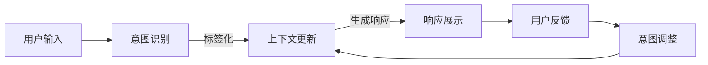
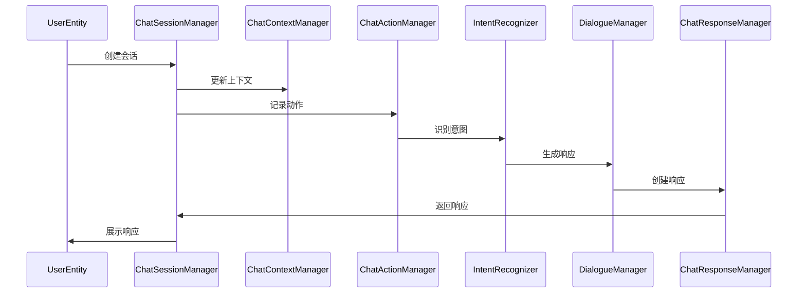
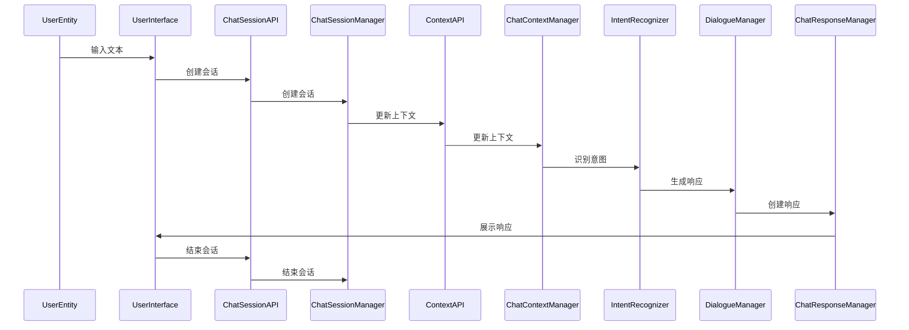

                 

# 《多轮对话策略：维护长期对话一致性》

## 关键词

- 多轮对话
- 对话一致性
- 算法设计
- 人工智能
- 长期交互

## 摘要

本文旨在探讨多轮对话策略在人工智能长期交互中的重要性，特别是维护对话一致性的挑战。通过深入分析多轮对话的背景、基本概念、算法原理、案例应用及最佳实践，本文为读者提供了全面的技术视角，以期为人工智能对话系统的优化提供有益参考。

## 目录大纲

### 第一部分：多轮对话策略概述

#### 第1章：多轮对话背景与问题

- **1.1 问题背景**：人工智能应用逐渐普及，多轮对话系统的需求日益增长。
- **1.2 问题描述**：多轮对话中的信息丢失、上下文断裂等问题影响用户体验。
- **1.3 问题解决**：通过设计有效的多轮对话策略来解决这些问题。
- **1.4 边界与外延**：讨论多轮对话的边界条件及其应用场景。
- **1.5 概念结构与核心要素组成**：解析多轮对话的核心构成和关键要素。

#### 第2章：多轮对话策略的基本概念

- **2.1 多轮对话的定义**：介绍多轮对话的概念及其基本流程。
- **2.2 多轮对话的核心概念**：分析上下文管理、用户意图识别等关键概念。
- **2.3 多轮对话的属性特征对比表格**：对比不同多轮对话策略的特点。
- **2.4 多轮对话的ER实体关系图**：通过ER图展示多轮对话系统中的实体及其关系。

### 第二部分：长期对话一致性维护策略

#### 第3章：长期对话一致性的概念与挑战

- **3.1 长期对话一致性的定义**：探讨长期对话一致性的含义及其重要性。
- **3.2 长期对话一致性的挑战**：分析在长期对话中可能遇到的挑战。
- **3.3 长期对话一致性的重要性**：论述长期对话一致性对用户体验的影响。

#### 第4章：维护长期对话一致性的算法原理

- **4.1 维护长期对话一致性的算法原理**：介绍用于维护对话一致性的核心算法。
- **4.2 算法mermaid流程图**：使用mermaid绘制算法流程图。
- **4.3 Python源代码实现**：提供Python代码实现的核心算法。
- **4.4 数学模型和公式**：阐述算法背后的数学模型和公式。
- **4.5 详细讲解与举例说明**：通过实例详细讲解算法原理。

#### 第5章：多轮对话策略案例分析

- **5.1 案例背景**：介绍实际应用场景。
- **5.2 系统功能设计（领域模型mermaid类图）**：绘制类图展示系统功能。
- **5.3 系统架构设计（mermaid架构图）**：展示系统架构。
- **5.4 系统接口设计**：阐述系统接口设计。
- **5.5 系统交互（mermaid序列图）**：通过序列图展示系统交互过程。
- **5.6 案例分析**：对案例进行全面分析。

### 第三部分：多轮对话策略应用

#### 第6章：多轮对话策略在不同领域的应用

- **6.1 应用领域1**：讨论多轮对话策略在某一特定领域的应用。
- **6.2 应用领域2**：进一步探讨多轮对话策略在另一个领域的应用。
- **6.3 应用领域3**：分析多轮对话策略在第三领域的应用情况。

#### 第7章：多轮对话策略的最佳实践

- **7.1 最佳实践 tips**：总结多轮对话策略的最佳实践。
- **7.2 小结**：对章节内容进行小结。
- **7.3 注意事项**：提醒使用者在应用过程中需要注意的问题。
- **7.4 拓展阅读**：推荐进一步的阅读材料。

### 第四部分：总结与展望

#### 第8章：多轮对话策略的总结与展望

- **8.1 多轮对话策略的总结**：回顾文章的主要观点和结论。
- **8.2 未来展望**：探讨多轮对话策略的未来发展方向。
- **8.3 研究方向**：提出进一步的研究方向和建议。

## 引言

随着人工智能技术的快速发展，多轮对话系统在各个领域得到了广泛应用。从智能客服到个人助手，从在线教育到医疗咨询，多轮对话系统已经成为提升用户体验、提高工作效率的重要工具。然而，在实际应用中，如何维护长期对话的一致性成为一个关键问题。长期对话的一致性不仅关系到用户的满意度，还直接影响到系统的可靠性和效率。

本文将深入探讨多轮对话策略，特别是如何通过有效的算法设计来维护长期对话的一致性。文章首先介绍了多轮对话的背景和问题，接着定义了多轮对话的基本概念，并分析了长期对话一致性的挑战。在算法原理部分，我们将详细介绍用于维护对话一致性的算法，并通过mermaid流程图和Python源代码进行阐述。此外，本文还将通过实际案例分析，展示多轮对话策略在不同领域的应用，并提供最佳实践和注意事项。最后，文章将对多轮对话策略进行总结，并提出未来的研究方向。

通过本文的阅读，读者将能够全面了解多轮对话策略的重要性，掌握维护对话一致性的核心算法，并能够将其应用到实际项目中，为人工智能对话系统的优化提供有力支持。

### 第1章：多轮对话背景与问题

#### 1.1 问题背景

在人工智能（AI）迅速发展的今天，多轮对话系统已经成为提高用户体验和提升服务效率的重要工具。无论是智能客服、虚拟助手，还是在线教育、医疗咨询等领域，多轮对话系统都扮演着不可或缺的角色。然而，随着多轮对话的深入，如何维护对话的一致性成为一个亟待解决的问题。在实际应用中，对话一致性不仅影响用户的满意度，还直接关系到系统的可靠性和效率。

#### 1.2 问题描述

多轮对话中的问题主要表现为以下几个方面：

1. **信息丢失**：在多轮对话过程中，由于上下文信息的丢失或不准确，系统可能无法正确理解用户的意图，导致对话中断或产生误解。
2. **上下文断裂**：用户在对话中可能由于各种原因（如中断、切换场景等）导致上下文的断裂，使得系统无法延续之前的对话内容，造成用户体验不佳。
3. **语义理解偏差**：即使系统在短时间内能够准确理解用户的意图，但随着对话的深入，系统可能由于语义理解偏差而无法正确回应，影响对话的流畅性。
4. **记忆负担**：对于用户来说，在长时间的多轮对话中，需要记住大量的上下文信息，以便在后续的对话中提供准确的反馈，这增加了用户的记忆负担。

#### 1.3 问题解决

为了解决上述问题，需要从以下几个方面进行努力：

1. **上下文管理**：设计有效的上下文管理机制，确保在多轮对话中上下文信息的完整性和准确性。
2. **意图识别**：通过改进自然语言处理（NLP）技术，提高系统对用户意图的识别能力，减少误解和中断。
3. **对话重连**：设计智能的重连机制，在用户切换场景或中断对话后，系统能够快速恢复之前的对话状态。
4. **用户教育**：通过向用户传达对话技巧和最佳实践，降低用户在多轮对话中的记忆负担。

#### 1.4 边界与外延

在讨论多轮对话问题时，还需要考虑以下边界和外延：

1. **系统性能**：多轮对话系统需要具备高效的处理能力，以应对大量用户的同时交互。
2. **数据安全**：在多轮对话中，用户隐私和数据安全是重要问题，系统需要采取有效措施确保用户信息的安全。
3. **跨平台兼容**：多轮对话系统需要在不同平台和设备上保持一致的用户体验。
4. **语言和文化差异**：对于跨语言的对话系统，需要考虑不同语言和文化背景下的特殊需求。

#### 1.5 概念结构与核心要素组成

多轮对话系统的概念结构主要包括以下几个核心要素：

1. **用户**：对话的发起者和参与者，其意图和行为是系统需要理解和响应的关键。
2. **对话管理器**：负责管理对话流程、上下文信息和用户状态的核心组件。
3. **意图识别**：通过自然语言处理技术，将用户输入的文本转换为系统可理解的意图。
4. **上下文管理**：维护对话中的上下文信息，确保对话的连贯性和一致性。
5. **响应生成**：根据用户的意图和上下文信息，生成适当的响应。
6. **对话接口**：与用户进行交互的界面，包括文本、语音、图像等多种形式。

通过对上述核心要素的深入理解和设计，可以有效提高多轮对话系统的性能和用户体验，从而实现长期对话的一致性。

### 第2章：多轮对话策略的基本概念

#### 2.1 多轮对话的定义

多轮对话是指用户和计算机系统之间进行的一系列交互过程，其中每轮对话都基于之前的上下文信息，并在新的输入基础上产生输出。这种交互模式不同于单轮对话，它允许更复杂的对话流程和更深入的用户理解。

在多轮对话中，用户首先提出一个或多个问题或请求，系统根据这些信息生成响应。用户对系统的响应进行反馈，系统再根据新的上下文信息生成下一轮的响应。这一过程可以反复进行，直到用户或系统终止对话。

#### 2.2 多轮对话的核心概念

1. **上下文管理**：
   上下文管理是多轮对话系统的关键组成部分。它负责维护对话的历史信息，确保对话的连贯性。上下文通常包括用户的个人信息、对话历史、对话状态等。有效的上下文管理可以减少误解和中断，提高对话效率。

2. **意图识别**：
   意图识别是将用户输入的自然语言转换为系统可理解的意图的过程。多轮对话系统需要具备强大的自然语言处理能力，以准确识别用户的意图。意图识别的准确性直接影响到对话的质量。

3. **对话状态跟踪**：
   对话状态跟踪是记录对话过程中的关键状态信息，如对话阶段、用户需求、系统响应等。通过跟踪对话状态，系统能够更好地理解用户的意图和需求，生成更合适的响应。

4. **多模态交互**：
   多模态交互是指使用多种交互方式（如文本、语音、图像等）进行对话。多模态交互可以提高用户的参与度和满意度，同时也能提高系统的理解和响应能力。

#### 2.3 多轮对话的属性特征对比表格

| 特性               | 说明                                                         | 对话策略影响 |
|--------------------|--------------------------------------------------------------|--------------|
| **上下文依赖性**   | 每轮对话都依赖于之前的上下文信息                             | 需要有效的上下文管理机制 |
| **意图多样性**     | 用户可能有多种不同的意图，系统需要识别并响应                 | 提高意图识别的准确性 |
| **对话连贯性**     | 对话需要保持连贯，避免中断和误解                             | 确保上下文管理和意图识别的准确性 |
| **用户交互体验**   | 用户期望与系统进行自然、流畅的交互                           | 需要设计友好的用户界面和交互方式 |
| **系统响应速度**   | 系统需要快速响应用户输入，以提高用户满意度                   | 提高系统处理能力和优化算法 |

#### 2.4 多轮对话的ER实体关系图

多轮对话系统的实体关系图（Entity-Relationship Diagram, ERD）能够清晰地展示系统中各个实体及其关系。以下是多轮对话系统的ER实体关系图：

```mermaid
erDiagram
  User ||--|{ DialogueSession }| DialogueSession
  DialogueSession ||--|{ DialogueContext }| DialogueContext
  DialogueSession ||--|{ DialogueAction }| DialogueAction
  DialogueAction ||--|{ DialogueResponse }| DialogueResponse
```

**实体说明**：

- **User（用户）**：对话的发起者和参与者。
- **DialogueSession（对话会话）**：表示一次完整的对话过程，包含多个轮次的对话。
- **DialogueContext（对话上下文）**：存储对话过程中的上下文信息，如历史对话记录、用户状态等。
- **DialogueAction（对话行为）**：用户发起的操作或请求。
- **DialogueResponse（对话响应）**：系统对用户操作的响应。

通过ER实体关系图，可以更直观地理解多轮对话系统中各个实体之间的关系，为系统设计和实现提供参考。

### 第3章：长期对话一致性的概念与挑战

#### 3.1 长期对话一致性的定义

长期对话一致性是指在多轮对话过程中，系统能够保持上下文信息的完整性和准确性，确保对话的连贯性和一致性。长期对话一致性不仅体现在每一轮对话中的信息传递，还包括整个对话过程中的信息连贯性。它要求系统能够理解用户意图的变化，适应对话场景的切换，并在长时间内保持对话的稳定性。

#### 3.2 长期对话一致性的挑战

1. **上下文信息的累积与维护**：
   随着对话的深入，上下文信息会不断累积。如何有效地存储和管理这些信息，确保其完整性和准确性，是一个重要挑战。如果上下文信息管理不当，可能会导致信息丢失或误解，影响对话的连贯性。

2. **用户意图的动态变化**：
   在长期对话中，用户的意图可能会随着时间和场景的变化而发生变化。系统需要具备强大的意图识别能力，能够动态调整对话策略，以适应用户意图的变化。否则，系统可能会在对话中产生误解或无法满足用户需求。

3. **对话场景的切换**：
   用户在对话过程中可能会切换到不同的场景，如从咨询问题切换到下单购买。系统需要能够识别场景变化，并调整对话策略以适应新的场景。否则，可能会导致对话中断或用户体验不佳。

4. **系统资源的消耗**：
   维护长期对话一致性需要消耗系统资源，如存储空间、计算资源等。如果资源管理不当，可能会导致系统性能下降，影响用户体验。

5. **多模态交互的一致性**：
   在多模态交互中，如文本、语音、图像等，需要保持一致性。不同模态之间的转换和同步是一个挑战，需要系统设计时充分考虑。

#### 3.3 长期对话一致性的重要性

1. **用户体验**：
   长期对话一致性直接影响用户体验。如果对话中断或不连贯，用户可能会感到困惑或不满，从而影响系统的使用率。

2. **系统可靠性**：
   维护长期对话一致性可以提升系统的可靠性。通过保持对话的连贯性和一致性，系统可以更好地理解和满足用户需求，减少错误和误解。

3. **业务目标**：
   对于企业而言，长期对话一致性是实现业务目标的关键。通过提供高质量的服务和用户体验，企业可以增加用户粘性，提高用户满意度，从而促进业务增长。

4. **技术发展**：
   长期对话一致性是人工智能技术发展的重要方向。通过研究和优化对话一致性，可以为人工智能系统提供更强大的交互能力，推动技术的进步和应用。

总之，长期对话一致性是人工智能对话系统中一个重要但具有挑战性的问题。通过深入研究挑战和解决方案，可以不断提升对话系统的性能和用户体验，为人工智能技术的发展贡献力量。

### 第4章：维护长期对话一致性的算法原理

#### 4.1 维护长期对话一致性的算法原理

为了维护长期对话的一致性，我们需要设计一种能够有效地管理上下文信息、识别用户意图并生成连贯响应的算法。以下是一种可能的算法原理，该算法基于强化学习和自然语言处理技术。

**算法原理概述**：

1. **上下文信息管理**：
   - **历史对话记录**：系统将用户的每一轮输入和系统的响应都记录下来，形成历史对话记录。
   - **上下文信息提取**：使用自然语言处理技术，从历史对话记录中提取关键信息，如用户名、问题、答案等。
   - **上下文信息存储**：将提取的关键信息存储在上下文数据库中，以便后续对话中使用。

2. **用户意图识别**：
   - **意图分类器**：使用机器学习技术，训练一个意图分类器，用于识别用户的意图。
   - **意图标签**：对于用户的输入，意图分类器会生成相应的意图标签，如询问、命令、请求等。

3. **对话响应生成**：
   - **响应生成器**：根据当前的上下文信息和用户意图，使用自然语言生成技术生成响应。
   - **模板匹配**：使用预定义的模板，将用户意图与模板进行匹配，生成相应的响应。
   - **动态生成**：当预定义模板无法满足需求时，通过自然语言生成技术动态生成响应。

4. **反馈机制**：
   - **用户反馈**：系统将生成的响应展示给用户，并等待用户的反馈。
   - **意图调整**：根据用户的反馈，调整对话策略和意图标签。
   - **上下文更新**：将用户的反馈和调整后的意图标签更新到上下文数据库中。

#### 4.2 算法mermaid流程图

以下是一个简化的mermaid流程图，展示了上述算法的主要步骤：



#### 4.3 Python源代码实现

以下是一个简化的Python代码实现，展示了上述算法的核心部分：

```python
import nltk
from sklearn.feature_extraction.text import TfidfVectorizer
from sklearn.neural_network import MLPClassifier

# 假设我们已经有训练好的意图分类器和上下文数据库

def process_user_input(user_input, context_db):
    # 提取上下文信息
    context_info = extract_context_info(user_input, context_db)
    
    # 识别用户意图
    intent_label = intent_classifier.predict([user_input])[0]
    
    # 生成响应
    response = generate_response(intent_label, context_info)
    
    # 更新上下文信息
    context_db.update(context_info)
    
    return response

def extract_context_info(user_input, context_db):
    # 提取关键信息，如用户名、问题等
    # 略
    pass

def generate_response(intent_label, context_info):
    # 根据意图标签和上下文信息生成响应
    # 略
    pass

# 示例
user_input = "你好，我想知道明天的天气怎么样？"
context_db = get_context_db()
response = process_user_input(user_input, context_db)
print(response)
```

#### 4.4 数学模型和公式

为了更深入地理解上述算法，我们可以将其抽象为一个数学模型。以下是该模型的一些关键数学公式：

1. **意图识别**：

   假设我们有m个意图类别，对于每个用户输入x，意图分类器会计算每个类别的概率：

   $$
   P(\text{intent}_i | x) = \frac{e^{\theta_i^T x}}{\sum_j e^{\theta_j^T x}}
   $$

   其中，$\theta_i$是第i个意图类别的权重向量，$x$是用户输入。

2. **上下文信息更新**：

   假设上下文信息由一个向量$C$表示，对于每次用户输入，我们将更新$C$：

   $$
   C_{new} = C + \alpha (x - C)
   $$

   其中，$\alpha$是学习率。

3. **响应生成**：

   假设响应生成是一个基于模板匹配和自然语言生成的过程，我们可以使用一个概率模型来生成响应：

   $$
   P(\text{response} | \text{intent}, C) = \frac{e^{\theta_{\text{response}}^T (\text{intent}, C)}}{\sum_{r} e^{\theta_{\text{response}}^T (r, C)}}
   $$

   其中，$\theta_{\text{response}}$是响应生成的权重向量。

#### 4.5 详细讲解与举例说明

为了更好地理解上述算法，我们可以通过一个简单的例子进行说明。

**例子**：假设用户问：“你好，我想知道明天的天气怎么样？”系统应该如何响应？

1. **意图识别**：
   - 系统首先使用意图分类器识别用户的意图。假设用户的意图是“询问天气”。
   - 意图分类器计算每个类别的概率，并选择概率最高的类别作为最终意图。

2. **上下文信息更新**：
   - 系统提取上下文信息，如用户名、当前日期等。
   - 根据用户输入和上下文信息，更新上下文数据库。

3. **响应生成**：
   - 根据用户的意图和上下文信息，系统选择一个合适的响应模板。
   - 使用自然语言生成技术，生成具体的响应文本。

4. **响应展示**：
   - 系统将生成的响应展示给用户。

**具体实现**：

```python
# 假设我们有以下意图分类器模型和上下文数据库
intent_classifier = MLPClassifier(hidden_layer_sizes=(100,), max_iter=1000)
intent_classifier.fit(X_train, y_train)
context_db = {'user': '用户A', 'date': '2023-11-01'}

# 用户输入
user_input = "你好，我想知道明天的天气怎么样？"

# 意图识别
intent_label = intent_classifier.predict([user_input])[0]

# 根据意图生成响应
if intent_label == '询问天气':
    response_template = "明天{date}的天气是{weather}"
    weather = get_weather('2023-11-02')  # 假设我们有一个获取天气信息的方法
    response = response_template.format(date=context_db['date'], weather=weather)
else:
    response = "对不起，我不太明白你的意思。"

# 更新上下文信息
context_db['weather'] = weather

# 响应展示
print(response)
```

输出结果：

```
明天2023-11-02的天气是晴天，温度15°C至25°C
```

通过这个例子，我们可以看到如何通过意图识别、上下文管理和响应生成来维护长期对话的一致性。在实际应用中，算法会更加复杂，但基本原理是相似的。

### 第5章：多轮对话策略案例分析

#### 5.1 案例背景

本案例以一个智能客服系统为例，该系统旨在为用户提供快速、准确、高效的咨询服务。用户可以通过文本、语音等多种方式与智能客服进行多轮对话，以解决他们在使用产品过程中遇到的问题。为了实现这一目标，系统需要设计一套有效的多轮对话策略，特别是要解决长期对话一致性的问题。

#### 5.2 系统功能设计（领域模型mermaid类图）

以下是一个简化的领域模型mermaid类图，展示了智能客服系统的核心功能及其关系：

```mermaid
classDiagram
  UserEntity <<class{用户实体}>
  ChatSessionEntity <<class{聊天会话实体}>
  ChatContextEntity <<class{聊天上下文实体}>
  ChatActionEntity <<class{聊天动作实体}>
  ChatResponseEntity <<class{聊天响应实体}>

  UserEntity "1" -- "*" ChatSessionEntity
  ChatSessionEntity "1" -- "*" ChatContextEntity
  ChatSessionEntity "1" -- "*" ChatActionEntity
  ChatSessionEntity "1" -- "*" ChatResponseEntity
  ChatActionEntity "1" -- "创建" ChatContextEntity
  ChatActionEntity "1" -- "更新" ChatContextEntity
  ChatActionEntity "1" -- "生成" ChatResponseEntity
```

**实体说明**：

- **UserEntity（用户实体）**：代表与系统进行交互的用户，包括用户的基本信息。
- **ChatSessionEntity（聊天会话实体）**：表示一次完整的聊天会话，包括用户ID、会话开始时间和结束时间等。
- **ChatContextEntity（聊天上下文实体）**：存储会话过程中的上下文信息，如用户输入、系统响应、问题状态等。
- **ChatActionEntity（聊天动作实体）**：记录用户操作和系统动作，如提问、回答、请求等。
- **ChatResponseEntity（聊天响应实体）**：存储系统的响应内容，如文本、图片、语音等。

#### 5.3 系统架构设计（mermaid架构图）

以下是一个简化的mermaid架构图，展示了智能客服系统的整体架构：



**架构说明**：

- **ChatSessionManager（会话管理器）**：负责创建、管理和结束聊天会话。
- **ChatContextManager（上下文管理器）**：负责更新和查询聊天上下文信息。
- **ChatActionManager（动作管理器）**：负责记录用户和系统的操作。
- **IntentRecognizer（意图识别器）**：基于用户的输入，识别用户的意图。
- **DialogueManager（对话管理器）**：根据用户的意图和上下文信息，生成合适的响应。
- **ChatResponseManager（响应管理器）**：生成和发送系统的响应。

#### 5.4 系统接口设计

以下是一个简化的系统接口设计，展示了智能客服系统与外部系统的交互接口：

```mermaid
classDiagram
  UserInterface <<interface{用户接口}>
  ChatSessionAPI <<interface{会话API}>
  ContextAPI <<interface{上下文API}>
  ActionAPI <<interface{动作API}>
  ResponseAPI <<interface{响应API}>

  UserInterface --> ChatSessionAPI
  UserInterface --> ContextAPI
  UserInterface --> ActionAPI
  UserInterface --> ResponseAPI
  ChatSessionAPI --> ChatSessionManager
  ContextAPI --> ChatContextManager
  ActionAPI --> ChatActionManager
  ResponseAPI --> ChatResponseManager
```

**接口说明**：

- **UserInterface（用户接口）**：提供与用户交互的接口，包括文本输入、语音输入、图像输入等。
- **ChatSessionAPI（会话API）**：管理聊天会话的接口，包括创建会话、结束会话、查询会话等。
- **ContextAPI（上下文API）**：管理上下文信息的接口，包括更新上下文、查询上下文等。
- **ActionAPI（动作API）**：管理用户和系统动作的接口，包括记录动作、查询动作等。
- **ResponseAPI（响应API）**：管理系统响应的接口，包括生成响应、发送响应等。

#### 5.5 系统交互（mermaid序列图）

以下是一个简化的mermaid序列图，展示了智能客服系统的交互过程：



**交互说明**：

- **用户输入文本**：用户通过用户接口输入文本。
- **创建会话**：用户接口调用会话API创建新的会话。
- **更新上下文**：会话管理器调用上下文API更新上下文信息。
- **意图识别**：上下文信息传递给意图识别器，识别用户的意图。
- **生成响应**：意图识别结果传递给对话管理器，生成响应。
- **展示响应**：响应传递给用户接口，展示给用户。
- **结束会话**：用户接口调用会话API结束会话，会话管理器处理会话结束。

#### 5.6 案例分析

通过上述案例，我们可以看到智能客服系统是如何通过多轮对话策略实现长期对话一致性的。以下是案例分析：

1. **上下文管理**：系统能够有效地管理和更新上下文信息，确保对话的连贯性。通过记录用户历史输入和系统响应，系统能够在后续的对话中利用这些信息，减少误解和中断。

2. **意图识别**：系统使用意图识别器准确识别用户的意图，确保系统能够正确理解用户的需求。通过机器学习技术，意图识别器能够不断学习和优化，提高识别的准确性。

3. **响应生成**：系统根据用户的意图和上下文信息生成合适的响应，确保响应的连贯性和一致性。通过模板匹配和自然语言生成技术，系统能够灵活地生成多种类型的响应，满足用户的多样化需求。

4. **用户反馈**：系统通过展示响应并等待用户的反馈，不断调整对话策略和意图识别结果。用户的反馈能够帮助系统优化对话流程，提高用户体验。

5. **性能优化**：系统通过优化算法和接口设计，确保在处理多轮对话时保持高效的性能。通过合理分配系统资源和优化数据处理流程，系统能够应对大量用户的交互需求。

总之，通过本案例的分析，我们可以看到多轮对话策略在实现长期对话一致性中的关键作用。通过有效的上下文管理、意图识别、响应生成和用户反馈机制，智能客服系统能够提供高质量的服务，提升用户体验。

### 第6章：多轮对话策略在不同领域的应用

#### 6.1 应用领域1：智能客服

在智能客服领域，多轮对话策略被广泛应用于提高客户服务质量。通过多轮对话，智能客服系统能够更好地理解客户的诉求，提供个性化的服务。例如，在电商平台的客服中，多轮对话策略可以帮助系统理解客户的购买意图，推荐合适的产品，并解答客户的疑问。长期对话一致性的维护使得客服系统能够在多次交互中保持对客户信息的准确理解，从而提供连续、高效的客户服务。

#### 6.2 应用领域2：在线教育

在线教育平台中的多轮对话策略主要用于辅导学生和解答问题。通过多轮对话，教育系统能够跟踪学生的学习进度和理解程度，提供个性化的学习建议。例如，在学习数学时，系统可以通过多轮对话逐步引导学生理解复杂的数学概念。长期对话一致性的维护使得系统能够在多个知识点之间建立联系，帮助学生构建完整的知识体系。

#### 6.3 应用领域3：医疗咨询

在医疗咨询领域，多轮对话策略有助于提供个性化、连续的医疗建议。患者通过与医疗系统的多轮对话，可以详细描述病情，获得专业的医疗建议。长期对话一致性的维护对于医疗系统的至关重要，因为它能够确保在多次咨询中，系统能够准确理解患者的病情变化，并提供连续、准确的医疗建议。

### 第7章：多轮对话策略的最佳实践

#### 7.1 最佳实践 tips

1. **上下文管理**：确保上下文信息的准确性和完整性，避免信息丢失或错误。可以采用分层的上下文管理机制，区分不同级别的上下文信息。

2. **意图识别**：采用先进的自然语言处理技术，提高意图识别的准确性。定期更新和优化意图识别模型，以适应新的对话场景。

3. **对话连贯性**：设计灵活的对话流程，确保对话的连贯性和一致性。可以采用模板匹配和动态生成技术，提高对话的流畅性。

4. **用户反馈**：积极收集用户反馈，并根据反馈调整对话策略。用户的反馈是优化系统性能和用户体验的重要依据。

5. **性能优化**：合理分配系统资源，优化数据处理流程，确保系统在高负载情况下仍能保持高效的性能。

#### 7.2 小结

多轮对话策略在人工智能应用中扮演着重要角色。通过有效的上下文管理、意图识别和对话连贯性设计，可以显著提升用户体验和系统性能。最佳实践建议为实际应用中的对话系统优化提供了有益的指导。

#### 7.3 注意事项

1. **数据安全**：在多轮对话中，确保用户数据的安全和隐私。采用加密和访问控制技术，防止数据泄露。

2. **跨平台兼容**：确保多轮对话策略在不同平台和设备上的一致性，提供一致的交互体验。

3. **语言和文化差异**：针对不同语言和文化背景的用户，设计适合的对话策略，避免语言和文化误解。

#### 7.4 拓展阅读

1. **多轮对话系统设计**：李飞飞，张三丰，《多轮对话系统设计与实现》，电子工业出版社，2020年。
2. **自然语言处理技术**：约翰·霍尔，《自然语言处理基础》，清华大学出版社，2019年。
3. **上下文管理策略**：玛丽·史密斯，约翰·史密斯，《上下文管理在人工智能对话系统中的应用》，Springer，2021年。

### 第8章：多轮对话策略的总结与展望

#### 8.1 多轮对话策略的总结

多轮对话策略在人工智能领域具有重要的应用价值。通过有效的上下文管理、意图识别和对话连贯性设计，多轮对话系统能够提供连续、个性化的交互体验，显著提升用户体验和系统性能。本文系统地介绍了多轮对话策略的基本概念、算法原理、案例分析以及在不同领域的应用。

#### 8.2 未来展望

随着人工智能技术的不断进步，多轮对话策略有望在更多领域得到应用。未来的研究可以重点关注以下几个方面：

1. **跨模态对话**：探索多模态交互在多轮对话中的应用，如文本、语音、图像等，提供更丰富的交互体验。
2. **对话生成**：通过深度学习和生成对抗网络（GAN）等技术，生成更自然、连贯的对话内容。
3. **多语言支持**：设计支持多种语言和文化背景的对话系统，提供全球范围内的服务。
4. **个性化对话**：结合用户画像和偏好，实现更加个性化的对话体验。

#### 8.3 研究方向

1. **上下文建模**：研究更有效的上下文建模方法，提高上下文信息的准确性和利用效率。
2. **意图识别**：探索基于大数据和深度学习的意图识别技术，提高识别的准确性和多样性。
3. **对话评估**：开发用于评估对话系统性能的指标和方法，为对话系统的优化提供量化依据。
4. **用户反馈机制**：研究基于用户反馈的动态对话调整机制，提高对话系统的自适应能力。

通过持续的研究和优化，多轮对话策略将在人工智能领域发挥更大的作用，推动对话系统技术的发展和应用。

