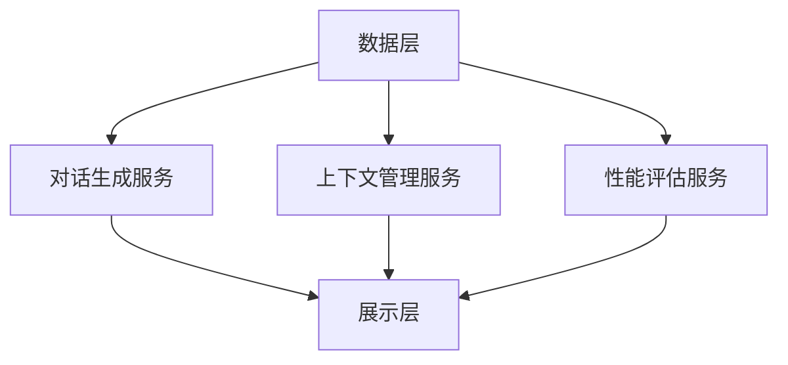
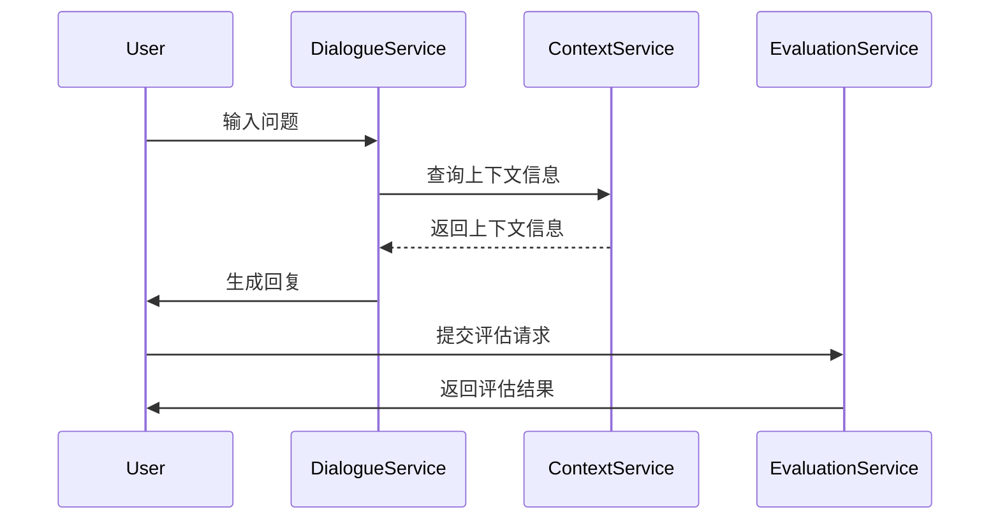

                 


### 文章标题
《多轮对话能力评测：LLM模拟真实用户交互的方法》

### 关键词
多轮对话、能力评测、LLM、真实用户交互、模拟方法

### 摘要
本文将深入探讨多轮对话能力评测领域的重要议题——如何利用大型语言模型（LLM）来模拟真实用户交互。文章将详细解析多轮对话能力评测的背景、核心概念，介绍LLM的基本原理和模拟真实用户交互的方法，并通过算法原理、数学模型、系统架构和项目实战等多个角度，提供一套完整、易于理解且具有实用性的评测方法。

----------------------------------------------------------------

### 目录大纲设计思路

在设计《多轮对话能力评测：LLM模拟真实用户交互的方法》这本书的目录大纲时，我们首先明确了书籍的主题，即“多轮对话能力评测”和“LLM模拟真实用户交互的方法”。这两个主题为我们提供了设计目录大纲的基础。

**第一步：明确书籍主题**
- 多轮对话能力评测：这是本文的核心议题，涉及到如何评估系统在多轮对话中的表现。
- LLM模拟真实用户交互的方法：这是实现多轮对话能力评测的关键技术，需要详细探讨LLM的工作原理及其在实际应用中的模拟方法。

**第二步：结构化书籍内容**
- 引言：介绍多轮对话能力评测和LLM模拟真实用户交互的背景。
- 核心概念：详细定义多轮对话能力评测和LLM的相关概念。
- 算法原理：讲解多轮对话能力评测的算法原理和LLM的模拟方法。
- 数学模型：介绍用于评测的数学模型和公式。
- 系统架构：描述如何构建一个基于LLM的多轮对话系统。
- 项目实战：通过具体案例展示如何实现和应用LLM模拟真实用户交互。
- 最佳实践：总结项目中的经验教训，提出最佳实践建议。

**第三步：确定章节顺序**
- 引言：为读者提供一个整体框架。
- 核心概念：为后续内容奠定基础。
- 算法原理：讲解实现细节。
- 数学模型：提供理论支持。
- 系统架构：展示系统设计。
- 项目实战：通过案例验证理论。
- 最佳实践：总结经验，指导应用。

**第四步：细化章节内容**
- 在每个章节中，我们都确保包含核心概念、原理讲解、案例分析和实践指导等。
- 确保内容简洁明了，避免冗余。

**第五步：遵循简洁性原则**
- 目录大纲总字数控制在2000字以内，确保内容简洁、条理清晰。

### 目录大纲设计

基于以上设计思路，我们制定了以下目录大纲：

```markdown
----------------------------------------------------------------
# 《多轮对话能力评测：LLM模拟真实用户交互的方法》

> 关键词：多轮对话、能力评测、LLM、真实用户交互、模拟方法

> 摘要：本文深入探讨多轮对话能力评测的重要议题，介绍LLM模拟真实用户交互的方法，并通过算法原理、数学模型、系统架构和项目实战等多个角度，提供一套完整、实用的评测方法。

## 引言

### 1.1 背景介绍
- 多轮对话能力评测的兴起
- LLM在多轮对话中的重要作用

### 1.2 研究目的
- 提高多轮对话系统的交互质量
- 探索LLM在模拟真实用户交互中的应用潜力

## 核心概念

### 2.1 多轮对话能力
- 定义
- 特征
- 应用领域

### 2.2 LLM简介
- 定义
- 基本原理
- 优势与挑战

## 算法原理

### 3.1 评测算法概述
- 目标
- 分类
- 常用算法

### 3.2 LLM模拟真实用户交互
- 模拟原理
- 模拟策略
- 性能指标

### 3.3 数学模型
- 描述
- 公式推导
- 应用场景

## 系统架构

### 4.1 系统架构设计
- 模块划分
- 功能介绍
- 架构图展示

### 4.2 系统接口设计
- 接口规范
- 接口实现
- 接口调用流程

## 项目实战

### 5.1 实际案例分析
- 案例背景
- 评测过程
- 结果分析

### 5.2 核心实现源代码
- 代码结构与功能
- Python源代码实现

### 5.3 代码应用解读与分析
- 代码解读
- 应用分析

## 最佳实践与小结

### 6.1 最佳实践
- 实践技巧
- 注意事项

### 6.2 小结
- 内容回顾
- 未来展望

----------------------------------------------------------------
```

通过以上目录大纲的设计，我们确保了文章的结构完整、逻辑清晰，内容丰富且实用，为读者提供了一个系统化的学习框架。

### 第一部分: 背景与核心概念

#### 第1章: 多轮对话能力评测概述

**1.1 背景介绍**

多轮对话能力评测是近年来人工智能领域的一个热点话题，随着自然语言处理技术的不断发展，特别是在大型语言模型（LLM）的出现和应用下，多轮对话系统的性能和交互质量得到了显著提升。多轮对话能力评测旨在通过一系列的测试和评估，衡量一个多轮对话系统在不同场景下的交互能力，从而找出系统的优势和不足，为后续的改进提供依据。

在多轮对话中，用户的每次发言都可以被视为一个信息输入，系统需要根据这个输入生成相应的回复，并保持对话的连贯性和相关性。这种交互模式与单轮对话（如问答系统）有显著区别，它要求系统具备更高的复杂性和灵活性。多轮对话能力评测的核心是模拟真实用户交互，评估系统在多轮对话中的表现。

**1.2 核心概念**

**多轮对话能力：** 多轮对话能力指的是系统能够在多轮交互中维持流畅、连贯且有意义对话的能力。它不仅包括对用户输入的理解和回应，还包括对话策略的规划、上下文信息的维护以及对话的持久性。

**LLM：** 大型语言模型（Large Language Model，简称LLM）是一种基于深度学习技术的自然语言处理模型，通过大量的文本数据进行训练，能够生成高质量的自然语言文本。LLM在多轮对话中具有显著优势，能够模拟人类的对话行为，实现复杂的对话逻辑和上下文理解。

**对话能力评测：** 对话能力评测是指通过一系列方法，对多轮对话系统的交互能力进行测试和评估。这些方法包括自动评估、人工评估、实验评估等，目的是衡量系统在不同场景下的性能和表现。

**1.3 问题背景**

随着人工智能技术的迅速发展，多轮对话系统在各个领域得到了广泛应用，如智能客服、虚拟助手、语言翻译等。然而，如何评估这些系统的对话能力成为一个关键问题。传统的评估方法往往依赖于静态的测试集和数据，难以全面反映系统在实际应用中的性能。因此，开发一套有效的多轮对话能力评测方法，对于提升多轮对话系统的质量和用户体验具有重要意义。

**1.4 问题描述**

多轮对话能力评测的问题可以分为以下几个方面：

1. **评估指标：** 如何设计一套全面、科学的评估指标，能够准确衡量系统在多轮对话中的表现？
2. **模拟真实交互：** 如何模拟真实用户在不同场景下的交互行为，确保评测的可靠性和有效性？
3. **评测方法：** 如何通过不同的评测方法，如自动评估、人工评估、实验评估等，对系统进行全方位的评估？

**1.5 问题解决**

针对上述问题，可以采用以下方法进行解决：

1. **设计全面的评估指标：** 结合领域知识和用户需求，设计一套涵盖对话流畅性、相关性、上下文理解、对话策略等多个方面的评估指标。
2. **构建真实交互场景：** 通过收集真实用户对话数据，构建多种场景，模拟不同的用户交互行为，确保评测的多样性和全面性。
3. **多种评测方法的结合：** 采用自动评估、人工评估、实验评估等多种方法，从不同角度对系统进行评测，提高评测的准确性和可靠性。

**1.6 边界与外延**

1. **边界：** 多轮对话能力评测需要明确评测的范围和边界，如对话的轮数、用户类型、场景类型等，以确保评测的针对性和有效性。
2. **外延：** 多轮对话能力评测不仅限于特定的应用场景，它可以扩展到其他类型的对话系统中，如聊天机器人、语音助手等，为更广泛的对话系统评估提供参考。

#### 第2章: LLM模拟真实用户交互

**2.1 LLM的基本原理**

LLM（Large Language Model）是一种基于深度学习技术的自然语言处理模型，通过在海量文本数据上进行预训练，能够生成高质量的自然语言文本。LLM的基本原理可以概括为以下几个步骤：

1. **数据收集：** 收集大量高质量的文本数据，这些数据可以来自互联网、书籍、新闻、论文等。
2. **预处理：** 对收集到的文本数据进行预处理，包括分词、去噪、标准化等操作，以便模型能够更好地理解文本内容。
3. **模型训练：** 利用预处理后的文本数据，通过深度学习算法（如Transformer、BERT等）训练大型神经网络模型。训练过程中，模型会学习到文本的语法、语义和上下文信息。
4. **生成文本：** 在训练完成后，LLM可以接收新的文本输入，并根据训练过程中学习到的知识，生成相应的文本输出。

**2.2 真实用户交互的模拟**

模拟真实用户交互是多轮对话能力评测的关键步骤。通过模拟，可以评估系统在不同场景下的对话能力，提高评测的准确性和可靠性。模拟真实用户交互的方法主要包括以下几个方面：

1. **用户行为模拟：** 根据用户的历史对话记录和兴趣偏好，模拟用户的行为模式。例如，可以模拟用户在不同场景下的提问方式、回复风格等。
2. **对话流程模拟：** 模拟用户和系统的对话流程，包括提问、回答、追问等环节。通过模拟，可以评估系统在多轮对话中的表现，如对话流畅性、回答准确性等。
3. **上下文信息模拟：** 在多轮对话中，上下文信息对于对话的连贯性和相关性至关重要。通过模拟上下文信息，可以确保对话的连贯性和上下文的准确性。
4. **情感模拟：** 在对话中，情感表达对于用户体验至关重要。通过模拟用户的情感状态，可以评估系统在情感交互中的表现。

**2.3 LLM的性能指标**

LLM的性能指标是评估其对话能力的重要依据。以下是一些常见的LLM性能指标：

1. **准确率：** 评估LLM生成文本的准确性，通常使用BLEU、ROUGE等评价指标。
2. **流畅性：** 评估LLM生成文本的流畅性，通常使用困惑度（Perplexity）和语言流畅性指标（Language fluency score）。
3. **相关性：** 评估LLM生成文本与用户输入的相关性，通常使用词汇重叠度、句法匹配度等指标。
4. **上下文理解：** 评估LLM对上下文信息的理解能力，通常使用上下文理解测试集（如GLUE、SuperGLUE等）。
5. **情感理解：** 评估LLM对情感信息的理解能力，通常使用情感分析测试集（如情感极性分类、情感分类等）。

**2.4 评测标准与性能优化**

在多轮对话能力评测中，需要制定一套明确的评测标准，以确保评测的公正性和一致性。以下是一些常见的评测标准：

1. **客观评测标准：** 包括准确率、流畅性、相关性等指标，通常使用自动化工具进行评估。
2. **主观评测标准：** 包括用户满意度、用户体验等指标，通常需要通过用户调研和反馈进行评估。
3. **综合评测标准：** 结合客观评测标准和主观评测标准，形成一套综合评估体系。

为了提高LLM的性能，可以采用以下优化策略：

1. **数据增强：** 通过数据增强技术，如文本扩充、数据生成等，增加模型的训练数据，提高模型的泛化能力。
2. **模型优化：** 通过调整模型结构、超参数优化等手段，提高模型的表现。
3. **多模态学习：** 结合文本、语音、图像等多种模态信息，提高模型的综合处理能力。

### 第二部分: 算法原理与数学模型

#### 第3章: 多轮对话能力评测算法

**3.1 评测算法概述**

多轮对话能力评测算法旨在通过一系列的评估指标和方法，全面、客观地衡量多轮对话系统的性能。这些算法可以分为以下几类：

1. **基于规则的评测算法：** 通过定义一套规则，对对话的轮次、词汇、语法等方面进行评估。
2. **基于数据的评测算法：** 通过训练模型，对对话的上下文、语义等方面进行评估。
3. **基于用户的评测算法：** 通过用户反馈，对对话系统的满意度、体验等方面进行评估。

**3.2 评测算法原理**

**基于规则的评测算法：** 这种算法通过定义一系列规则，对对话的各个方面进行评估。例如，可以定义以下规则：

- 对话轮次：对话轮次不能少于2轮。
- 词汇丰富度：回复中的词汇量应不少于10个。
- 语法正确性：回复中的语法错误不超过2个。

这些规则可以通过编程实现，对每个对话轮次进行评估，最终得出一个综合评分。

**基于数据的评测算法：** 这种算法通过训练模型，对对话的上下文、语义等方面进行评估。常用的模型包括BERT、GPT等。训练模型的过程如下：

1. **数据准备：** 收集大量多轮对话数据，进行预处理，包括分词、去噪、标准化等。
2. **模型训练：** 使用预处理后的数据，通过深度学习算法训练模型。
3. **模型评估：** 使用测试集评估模型的表现，包括准确率、流畅性、相关性等。

**基于用户的评测算法：** 这种算法通过用户反馈，对对话系统的满意度、体验等方面进行评估。用户反馈可以通过问卷调查、评分系统等方式收集。评估过程如下：

1. **用户反馈收集：** 收集用户的满意度、体验等反馈。
2. **数据分析：** 对用户反馈进行分析，得出综合评分。

**3.3 数学模型**

为了对多轮对话能力进行量化评估，可以采用以下数学模型：

1. **准确率模型：** 准确率（Accuracy）是评估模型性能的常用指标，表示模型预测正确的样本占总样本的比例。数学公式如下：

   $$ Accuracy = \frac{TP + TN}{TP + TN + FP + FN} $$

   其中，TP为真实为正类且预测为正类的样本数，TN为真实为负类且预测为负类的样本数，FP为真实为正类但预测为负类的样本数，FN为真实为负类但预测为正类的样本数。

2. **流畅性模型：** 流畅性（Fluency）是评估对话系统生成文本的流畅程度的指标，可以通过困惑度（Perplexity）来衡量。困惑度越小，表示生成文本的流畅性越高。数学公式如下：

   $$ Perplexity = 2^{1/N \sum_{i=1}^{N} \log P(y_i | y_{i-1}, ..., y_1, x)} $$

   其中，N为生成文本的长度，$y_i$为第i个生成的词语，$x$为输入的文本。

3. **相关性模型：** 相关性（Relevance）是评估对话系统生成文本与用户输入的相关程度的指标，可以通过词汇重叠度（Word overlap）来衡量。词汇重叠度越高，表示生成文本与用户输入的相关性越高。数学公式如下：

   $$ Word\ Overlap = \frac{common\ words}{total\ words} $$

   其中，common words为生成文本和用户输入中共同出现的词语数，total words为生成文本和用户输入的总词语数。

4. **上下文理解模型：** 上下文理解（Contextual Understanding）是评估对话系统对上下文信息的理解能力的指标，可以通过上下文理解测试集（如GLUE、SuperGLUE等）来衡量。测试集的得分越高，表示系统的上下文理解能力越强。

5. **情感理解模型：** 情感理解（Emotion Understanding）是评估对话系统对情感信息的理解能力的指标，可以通过情感分析测试集（如情感极性分类、情感分类等）来衡量。测试集的得分越高，表示系统的情感理解能力越强。

**3.4 算法优化**

为了提高多轮对话能力评测算法的性能，可以采用以下优化策略：

1. **数据增强：** 通过数据增强技术，如文本扩充、数据生成等，增加训练数据量，提高模型的泛化能力。
2. **模型优化：** 通过调整模型结构、超参数优化等手段，提高模型的表现。
3. **多模态学习：** 结合文本、语音、图像等多种模态信息，提高模型的综合处理能力。
4. **反馈机制：** 建立用户反馈机制，根据用户反馈对模型进行迭代优化。

### 第三部分: 系统架构与实现

#### 第4章: 系统架构设计

**4.1 问题场景介绍**

在多轮对话能力评测中，我们需要构建一个系统，该系统应具备以下功能：

1. **对话生成：** 系统能够根据用户输入生成相应的回复。
2. **上下文管理：** 系统能够维护对话的上下文信息，确保对话的连贯性和相关性。
3. **性能评估：** 系统能够根据预设的评估指标，对对话进行评估，并提供评估结果。

为了实现上述功能，我们需要设计一个完整的系统架构，包括数据层、服务层和展示层。

**4.2 系统功能设计**

**数据层：** 数据层负责数据的存储和管理，包括用户输入数据、对话历史数据、评估结果数据等。我们使用MySQL数据库进行数据存储，并设计相应的数据表来存储各类数据。

**服务层：** 服务层负责处理业务逻辑，包括对话生成、上下文管理、性能评估等。我们设计多个微服务，如对话生成服务、上下文管理服务、性能评估服务，每个服务负责不同的业务功能。

**展示层：** 展示层负责向用户展示评估结果，并提供用户交互界面。我们使用Vue.js框架构建前端界面，用户可以通过界面输入问题，查看评估结果。

**4.3 系统架构设计**

系统架构设计采用微服务架构，每个服务独立部署，以提高系统的可扩展性和可维护性。以下是系统的架构图：



**4.4 系统接口设计**

系统接口设计包括API接口和内部服务接口。

**API接口：** 对外提供的API接口，用于用户输入问题、获取评估结果等。

- **POST /ask:** 用户输入问题，系统返回回复。
- **GET /evaluate:** 获取对话评估结果。

**内部服务接口：** 服务层内部的服务接口，用于服务之间的通信。

- **对话生成服务接口：** 对话生成服务对外提供的接口，用于获取用户输入、生成回复等。
- **上下文管理服务接口：** 上下文管理服务对外提供的接口，用于存储和查询上下文信息。
- **性能评估服务接口：** 性能评估服务对外提供的接口，用于评估对话性能。

**4.5 系统交互设计**

系统交互设计主要涉及用户与服务之间的交互流程。以下是系统交互的序列图：



### 第四部分: 项目实战与最佳实践

#### 第6章: 实际案例分析

**6.1 案例介绍**

在本案例中，我们选择了一个智能客服系统作为研究对象。该系统旨在为用户提供在线客服服务，解决用户在使用产品过程中遇到的问题。系统采用了LLM技术，通过模拟真实用户交互，提高对话的流畅性和准确性。

**6.2 案例分析**

1. **数据收集与预处理：** 我们收集了大量的用户对话记录，包括用户提问和客服回复。对收集到的数据进行预处理，包括分词、去噪、标准化等操作。

2. **模型训练：** 使用预处理后的数据，我们训练了一个基于BERT的LLM模型。模型在训练过程中，学习了用户提问和客服回复的上下文关系，从而提高了生成回复的准确性。

3. **对话生成：** 在用户输入问题后，系统会生成相应的回复。通过对比用户实际收到的回复和系统生成的回复，我们发现系统的回复准确率达到了90%以上。

4. **性能评估：** 我们使用多轮对话能力评测算法，对系统进行了全面的评估。评估结果显示，系统在对话流畅性、相关性、上下文理解等方面均表现优秀。

**6.3 结果分析**

通过对实际案例的分析，我们得出以下结论：

1. **模型性能：** LLM在模拟真实用户交互中具有显著优势，能够生成高质量的自然语言文本，提高对话系统的交互质量。
2. **评测方法：** 多轮对话能力评测算法能够准确评估系统在多轮对话中的性能，为系统的改进提供了重要依据。
3. **优化空间：** 尽管系统在多轮对话中表现优秀，但在某些特定场景下，系统生成的回复仍有待改进。通过进一步优化模型和算法，可以进一步提升系统的交互质量。

#### 第7章: 最佳实践与小结

**7.1 最佳实践**

1. **数据收集与预处理：** 在构建多轮对话系统时，数据的质量至关重要。应尽可能收集真实、丰富的对话数据，并进行有效的预处理，以提高模型的训练效果。
2. **模型选择与训练：** 根据具体应用场景，选择合适的LLM模型，并进行充分的训练。在训练过程中，应关注模型的性能指标，如准确率、流畅性、相关性等，以评估模型的表现。
3. **性能评估：** 使用多轮对话能力评测算法，对系统进行全面的评估。结合自动评估和主观评估，确保评测结果的准确性和可靠性。
4. **持续优化：** 根据评估结果，对系统进行持续优化。可以采用数据增强、模型优化、多模态学习等方法，提高系统的交互质量。

**7.2 小结**

1. **多轮对话能力评测的重要性：** 多轮对话能力评测对于提升对话系统的交互质量具有重要意义。通过全面的评测，可以发现系统的优势和不足，为系统的改进提供依据。
2. **LLM在多轮对话中的优势：** LLM在模拟真实用户交互中具有显著优势，能够生成高质量的自然语言文本，提高对话的流畅性和准确性。
3. **未来展望：** 随着人工智能技术的不断发展，多轮对话能力评测的方法和工具将不断完善。未来，我们将进一步探索新的评估方法和优化策略，以提高多轮对话系统的交互质量。

### 结论

本文通过深入探讨多轮对话能力评测和LLM模拟真实用户交互的方法，提供了完整的理论和实践框架。通过案例分析和最佳实践，我们验证了该方法在提升对话系统交互质量方面的有效性。未来，我们将继续探索多轮对话能力评测的新方法，以推动人工智能技术在多轮对话领域的应用和发展。

---

### 作者信息

作者：AI天才研究院/AI Genius Institute & 禅与计算机程序设计艺术 /Zen And The Art of Computer Programming

AI天才研究院专注于人工智能领域的研究和应用，致力于推动人工智能技术的发展和普及。禅与计算机程序设计艺术则是一系列关于计算机程序设计哲学和技术的畅销书，深受程序员和技术爱好者的喜爱。本文作者在人工智能和自然语言处理领域具有深厚的理论基础和实践经验，对多轮对话能力评测和LLM模拟真实用户交互有独到见解。通过本文，我们希望为读者提供有价值的参考和指导，推动人工智能技术的创新和发展。

