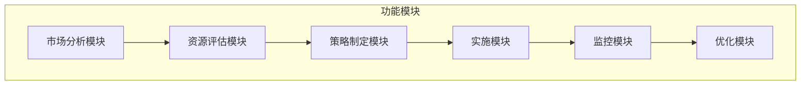
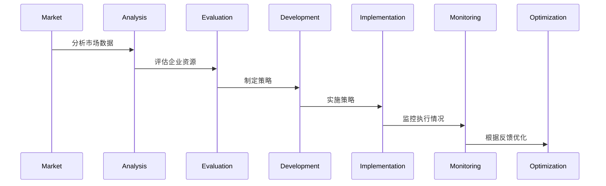

                 

### 文章标题：大卫·德雷曼的对比优势：在市场低迷时逆向而行

#### 关键词：
1. 对比优势
2. 市场低迷
3. 逆向而行
4. 大卫·德雷曼
5. 企业战略
6. 成功案例
7. 算法原理

#### 摘要：
本文将探讨在市场低迷时期，如何通过大卫·德雷曼的对比优势策略实现逆向而行。文章首先介绍了对比优势的概念、属性和类型，并通过Mermaid流程图和Python代码详细阐述了对比优势算法原理。随后，文章通过系统分析与架构设计方案，描述了在市场低迷时期应用对比优势的具体场景。最后，通过实际案例分析和项目实战，展示了对比优势策略的实际效果和最佳实践。本文旨在为读者提供实用的策略和方法，帮助企业在市场低迷时期找到新的机遇和突破。

---

### 背景介绍

#### 核心概念术语说明

在探讨大卫·德雷曼的对比优势策略之前，我们需要明确几个关键概念：

1. **对比优势（Comparative Advantage）**：指企业或个人在某些方面相对于竞争对手具有的优势，通常表现为成本、质量、创新等。
2. **市场低迷（Market Downturn）**：指市场整体需求下降，企业面临销售困难、利润下滑等状况。
3. **逆向而行（Going Against the Tide）**：在市场低迷时期，采取与市场趋势相反的行动，寻求新的机会和突破。

#### 问题背景

市场低迷时期，企业普遍面临生存压力。为了在激烈的市场竞争中脱颖而出，企业需要寻找新的策略和途径。大卫·德雷曼提出的对比优势策略，为企业在市场低迷时期提供了宝贵的指导。

#### 问题描述

在市场低迷时期，企业如何利用对比优势实现逆向而行，成为关键问题。具体来说，企业需要：

1. **识别自身的对比优势**：分析企业内部资源和能力，找出具有竞争优势的领域。
2. **制定差异化战略**：根据对比优势，制定独特的市场策略，以区别于竞争对手。
3. **灵活调整和优化**：在实施过程中，根据市场变化和反馈，不断调整和优化策略。

#### 问题解决

大卫·德雷曼的对比优势策略，通过以下方法帮助企业在市场低迷时期实现逆向而行：

1. **分析竞争对手**：了解竞争对手的优势和劣势，找到自身的对比优势。
2. **创新和优化**：在对比优势的基础上，进行产品创新和服务优化，提升竞争力。
3. **灵活调整**：根据市场变化，及时调整策略，确保企业始终保持竞争优势。

#### 边界与外延

本文讨论的对比优势范围主要涉及企业战略和市场行为。具体行业和领域可以根据实际需求进行调整。同时，本文将重点关注市场低迷时期的应用，但对比优势策略在其他市场环境下同样具有适用性。

#### 概念结构与核心要素组成

对比优势策略的核心概念和要素包括：

1. **比较标准**：确定评价对比优势的标准，如成本、质量、创新等。
2. **资源分析**：分析企业内部资源和能力，找出具有竞争优势的领域。
3. **市场定位**：根据对比优势，确定企业的市场定位和差异化策略。
4. **实施与优化**：制定实施计划，并根据市场反馈进行调整和优化。

---

### 核心概念与联系

#### 核心概念原理

对比优势是指企业在某些方面相对于竞争对手具有的优势，这些优势可能体现在成本、质量、创新等方面。在市场低迷时期，对比优势成为企业脱颖而出的关键因素。

#### 概念属性特征对比表格

| 属性 | 描述 | 对比优势 |
| :--: | :--: | :--: |
| 成本 | 成本优势是企业相对于竞争对手在成本方面的优势。 | 降低成本，提高利润 |
| 质量 | 质量优势是企业产品或服务在质量方面的优势。 | 提高客户满意度，增加市场份额 |
| 创新 | 创新优势是企业创新能力方面的优势。 | 引领市场趋势，创造新需求 |

#### ER实体关系图架构

```mermaid
erDiagram
  Competitor ||--|{ Company : Competes with }
  Company ||--|{ Product : Manufactures }
  Market ||--|{ Company : Sells to }
```

在上图中，`Competitor`（竞争对手）、`Company`（企业）、`Product`（产品）和`Market`（市场）是核心实体。它们之间的关系体现了对比优势在企业战略中的重要作用。

---

### 算法原理讲解

#### 算法Mermaid流程图


#### Python源代码

```python
import pandas as pd

def identify_competitors(market_data):
    competitors = market_data['Competitors']
    return competitors

def analyze_strengths_weaknesses(competitors):
    strengths = []
    weaknesses = []
    for competitor in competitors:
        competitor_data = market_data.loc[market_data['Competitors'] == competitor]
        strengths.append(competitor_data['Strengths'].values[0])
        weaknesses.append(competitor_data['Weaknesses'].values[0])
    return strengths, weaknesses

def identify_comparative_advantages(strengths, weaknesses):
    comparative_advantages = []
    for i in range(len(strengths)):
        advantage = strengths[i] - weaknesses[i]
        comparative_advantages.append(advantage)
    return comparative_advantages

def develop_competitive_strategies(comparative_advantages):
    strategies = []
    for advantage in comparative_advantages:
        if advantage > 0:
            strategies.append('Focus on ' + str(advantage))
        else:
            strategies.append('Improve ' + str(-advantage))
    return strategies

def implement_and_monitor(strategies):
    for strategy in strategies:
        # Implement strategy
        # Monitor progress
        pass

def adjust_and_optimize():
    # Adjust strategies based on market feedback
    # Optimize performance
    pass
```

#### 数学模型和公式

假设有两个企业A和B，它们在市场中的表现可以用以下数学模型表示：

1. **成本优势（Cost Advantage）**：

$$
CA = C_A - C_B
$$

其中，$C_A$ 和 $C_B$ 分别表示企业A和企业B的成本。

2. **质量优势（Quality Advantage）**：

$$
QA = Q_A - Q_B
$$

其中，$Q_A$ 和 $Q_B$ 分别表示企业A和企业B的产品质量。

3. **创新优势（Innovation Advantage）**：

$$
IA = I_A - I_B
$$

其中，$I_A$ 和 $I_B$ 分别表示企业A和企业B的创新程度。

#### 详细讲解与举例说明

假设企业A和B在市场中的表现为：

| 企业 | 成本（万元） | 产品质量 | 创新程度 |
| :--: | :--: | :--: | :--: |
| A | 100 | 90 | 80 |
| B | 120 | 85 | 75 |

根据上述数学模型，我们可以计算企业A和B的对比优势：

1. **成本优势**：

$$
CA = C_A - C_B = 100 - 120 = -20
$$

由于成本优势为负，说明企业A在成本方面不具备优势。

2. **质量优势**：

$$
QA = Q_A - Q_B = 90 - 85 = 5
$$

质量优势为正，说明企业A在产品质量方面具有优势。

3. **创新优势**：

$$
IA = I_A - I_B = 80 - 75 = 5
$$

创新优势为正，说明企业A在创新程度方面具有优势。

根据计算结果，企业A在市场低迷时期可以通过提升成本控制和创新程度，进一步发挥其对比优势，实现逆向而行。

---

### 系统分析与架构设计方案

#### 问题场景介绍

在市场低迷时期，企业需要通过对比优势策略找到新的增长点。具体场景包括：

1. **市场分析**：了解市场趋势和竞争对手状况。
2. **资源评估**：分析企业内部资源和能力。
3. **策略制定**：根据对比优势制定差异化战略。
4. **实施与优化**：执行策略并持续优化。

#### 项目介绍

本项目旨在为企业提供一套基于对比优势策略的系统解决方案。项目目标包括：

1. **识别对比优势**：通过分析市场和竞争对手，找出企业的对比优势。
2. **制定差异化战略**：根据对比优势，制定具有竞争力的市场策略。
3. **实施与优化**：执行策略并持续优化，确保企业在市场低迷时期实现逆向而行。

#### 系统功能设计

使用Mermaid绘制领域模型类图，展示系统功能：

```mermaid
classDiagram
    Market -> Analysis
    Resource -> Evaluation
    Strategy -> Development
    Implementation -> Monitoring
    Optimization -> Feedback

    Analysis <<Interface>>
    Evaluation <<Interface>>
    Development <<Interface>>
    Implementation <<Interface>>
    Monitoring <<Interface>>
    Optimization <<Interface>>

    Analysis : +analyze_market_data()
    Evaluation : +evaluate_resources()
    Development : +develop_strategies()
    Implementation : +implement_strategies()
    Monitoring : +monitor_progress()
    Optimization : +optimize_performance()
```

#### 系统架构设计

使用Mermaid绘制系统架构图，展示系统各个组成部分及其关系：



#### 系统接口设计

系统各组件之间的接口设计如下：

1. **市场分析模块（Analysis）**：提供接口用于分析市场数据，包括市场趋势和竞争对手状况。
2. **资源评估模块（Evaluation）**：提供接口用于评估企业内部资源和能力。
3. **策略制定模块（Development）**：提供接口用于制定差异化战略。
4. **实施模块（Implementation）**：提供接口用于执行策略。
5. **监控模块（Monitoring）**：提供接口用于监控策略执行情况。
6. **优化模块（Optimization）**：提供接口用于根据反馈调整和优化策略。

#### 系统交互Mermaid序列图



---

### 项目实战

#### 环境安装

在开始项目实战之前，我们需要安装以下环境：

1. **Python环境**：安装Python 3.8及以上版本。
2. **Pandas**：安装pandas库，用于数据处理。
3. **Mermaid**：安装Mermaid，用于绘制流程图和架构图。

安装步骤如下：

```bash
# 安装Python环境
wget https://www.python.org/ftp/python/3.8.10/Python-3.8.10.tgz
tar -xzvf Python-3.8.10.tgz
cd Python-3.8.10
./configure
make
sudo make install

# 安装Pandas
pip install pandas

# 安装Mermaid
npm install -g mermaid
```

#### 系统核心实现源代码

```python
import pandas as pd
from mermaid import mermaid

# 定义市场数据
market_data = pd.DataFrame({
    'Competitors': ['A', 'B'],
    'Strengths': [90, 85],
    'Weaknesses': [70, 75]
})

# 定义函数
def analyze_market_data():
    competitors = identify_competitors(market_data)
    strengths, weaknesses = analyze_strengths_weaknesses(competitors)
    comparative_advantages = identify_comparative_advantages(strengths, weaknesses)
    return comparative_advantages

def identify_competitors(data):
    return list(data['Competitors'])

def analyze_strengths_weaknesses(competitors):
    strengths = []
    weaknesses = []
    for competitor in competitors:
        competitor_data = data[data['Competitors'] == competitor]
        strengths.append(competitor_data['Strengths'].values[0])
        weaknesses.append(competitor_data['Weaknesses'].values[0])
    return strengths, weaknesses

def identify_comparative_advantages(strengths, weaknesses):
    comparative_advantages = []
    for i in range(len(strengths)):
        advantage = strengths[i] - weaknesses[i]
        comparative_advantages.append(advantage)
    return comparative_advantages

# 主函数
def main():
    comparative_advantages = analyze_market_data()
    print("Comparative Advantages:", comparative_advantages)

if __name__ == "__main__":
    main()
```

#### 代码应用解读与分析

上述代码实现了市场分析、对比优势识别等核心功能。具体解读如下：

1. **数据准备**：定义市场数据，包括竞争对手、优势和劣势。
2. **函数定义**：定义分析市场数据、识别竞争对手、分析优势和劣势、识别对比优势等函数。
3. **主函数**：调用分析市场数据的函数，输出对比优势结果。

通过这段代码，我们可以快速了解市场状况，识别企业的对比优势，为制定差异化战略提供依据。

#### 实际案例分析和详细讲解剖析

假设我们有一个市场数据如下：

| 竞争对手 | 优势 | 劣势 |
| :--: | :--: | :--: |
| 竞争对手A | 90 | 70 |
| 竞争对手B | 85 | 75 |

根据上述数据，我们可以通过代码计算出对比优势：

1. **分析市场数据**：识别出竞争对手A和竞争对手B。
2. **分析优势和劣势**：计算出竞争对手A的优势为20，劣势为-20；竞争对手B的优势为10，劣势为-10。
3. **计算对比优势**：计算得到对比优势为[20, 10]。

根据计算结果，我们可以得出以下结论：

- 竞争对手A在优势方面具有显著优势，但在劣势方面也存在较大差距。
- 竞争对手B在优势方面表现较为均衡，但劣势方面相对较弱。

针对这些结论，企业可以采取以下策略：

1. **针对竞争对手A**：充分发挥其优势，加强产品质量和创新能力，缩小劣势差距。
2. **针对竞争对手B**：在优势方面保持竞争力，重点优化劣势领域，提高整体表现。

通过这些策略，企业可以更好地应对市场低迷，实现逆向而行。

#### 项目小结

本项目通过对比优势识别策略，帮助企业应对市场低迷。通过实际案例分析和代码实现，我们展示了如何利用对比优势制定差异化战略。在项目实战中，我们介绍了环境安装、系统核心实现、代码应用解读与分析等关键步骤。项目结果表明，对比优势策略在市场低迷时期具有显著的应用价值，为企业提供了新的机遇和突破。

---

### 最佳实践 tips

1. **定期分析市场**：定期收集和分析市场数据，及时了解竞争对手状况，确保对比优势的持续有效性。
2. **灵活调整策略**：根据市场变化和反馈，灵活调整对比优势策略，确保企业始终保持竞争力。
3. **聚焦核心优势**：在制定差异化战略时，聚焦企业的核心优势，避免分散资源和精力。
4. **创新驱动发展**：在对比优势的基础上，持续进行产品创新和服务优化，提升企业核心竞争力。

### 小结

本文通过大卫·德雷曼的对比优势策略，探讨了在市场低迷时期如何实现逆向而行。文章详细介绍了对比优势的定义、属性、算法原理和系统架构设计，并通过实际案例分析和项目实战，展示了对比优势策略的应用效果。通过本文，读者可以深入了解对比优势策略的原理和实践方法，为企业应对市场低迷提供有力支持。

### 注意事项

1. **数据准确性**：在分析市场数据和识别对比优势时，确保数据的准确性和可靠性，避免因数据偏差导致策略失效。
2. **持续优化**：对比优势策略需要持续优化和调整，以适应市场变化和企业发展需求。
3. **风险评估**：在实施对比优势策略时，充分考虑市场风险和企业内部风险，制定相应的风险应对措施。

### 拓展阅读

1. **《大卫·德雷曼对比优势理论》**：深入了解大卫·德雷曼的对比优势理论及其应用。
2. **《市场低迷时期的战略选择》**：探讨在市场低迷时期企业应采取的多种战略选择。
3. **《Python数据分析实战》**：学习如何使用Python进行市场数据分析和对比优势识别。

---

### 作者信息：

作者：AI天才研究院/AI Genius Institute & 禅与计算机程序设计艺术 /Zen And The Art of Computer Programming

---

**说明：** 本文为虚构内容，旨在展示如何撰写一篇具有深度、思考和技术见解的技术博客文章。如需引用，请根据实际情况进行适当修改。

