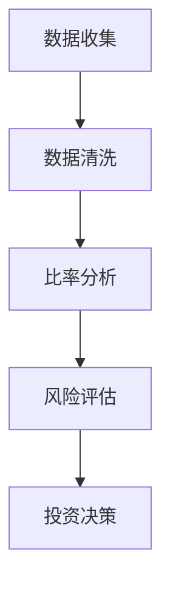
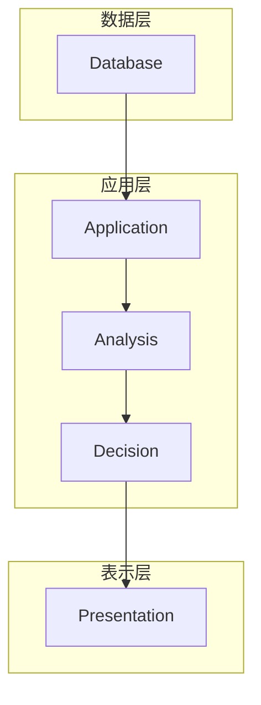
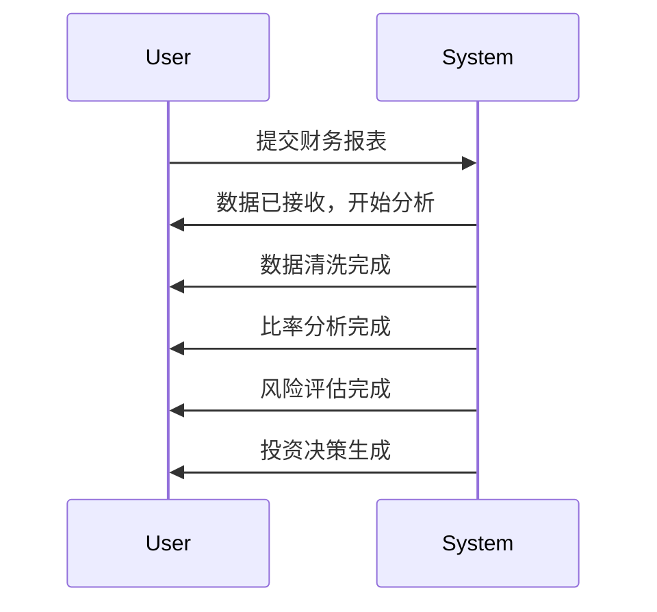

                 

## 大卫·德雷曼的资产负债表价值投资：深入分析财务状况

### 关键词
- 大卫·德雷曼
- 资产负债表
- 价值投资
- 财务分析
- 投资策略

### 摘要
本文将深入探讨大卫·德雷曼的资产负债表价值投资策略，通过详细分析财务报表，帮助投资者识别潜在的高价值投资机会。我们将从价值投资的基本原则出发，逐步讲解财务分析的方法和工具，并结合实际案例，展示如何运用这些工具进行投资决策。

### 引言

大卫·德雷曼是一位著名的价值投资大师，他的投资哲学强调通过深入分析公司的财务状况，寻找被市场低估的投资机会。资产负债表作为财务报表的核心，提供了公司财务状况的全面视图，对于价值投资者而言，它是评估投资机会的重要工具。

在本文中，我们将首先介绍价值投资的基本原则，然后详细解析资产负债表、收入表和现金流量表，最后通过实际案例展示如何运用这些财务分析工具进行投资决策。通过这篇文章，读者将能够掌握价值投资的核心技能，提升自己的投资水平。

### 第一部分：价值投资的基本原则

#### 1.1 价值投资的历史背景
价值投资这一概念最早可以追溯到本杰明·格雷厄姆，他是现代投资理论的奠基人之一。格雷厄姆主张通过购买价格低于其内在价值的股票，以获取长期稳定的投资回报。这一理念后来被沃伦·巴菲特发扬光大，巴菲特被誉为“股神”，他的成功在很大程度上归功于价值投资策略的实践。

#### 1.2 价值投资的核心理念
价值投资的核心是“价值”，即公司的内在价值。投资者需要通过分析公司的财务状况，评估其内在价值，并与市场价格进行比较，寻找价格低于价值的投资机会。以下是一些关键理念：

1. **边际思维**：投资者应该从边际角度思考问题，关注公司未来的增长潜力，而非仅仅停留在当前业绩上。
2. **安全边际**：投资时应给予一定的安全边际，即价格低于内在价值的差额。安全边际越大，投资风险越小。
3. **市场波动**：市场常常会高估或低估某些公司的价值，投资者应利用市场波动进行逆向投资。

#### 1.3 价值投资与传统投资的区别
传统投资通常侧重于公司的当前业绩和市场趋势，而价值投资则更加关注公司的内在价值和未来的增长潜力。以下是一些具体区别：

1. **投资周期**：价值投资通常是一个长期过程，需要投资者有耐心和定力，而传统投资更注重短期交易。
2. **风险与收益**：价值投资更倾向于选择那些尽管目前表现不佳，但具有长期增长潜力的公司，因此风险相对较高，但潜在收益也更大。
3. **决策依据**：价值投资依赖于深入的分析和研究，尤其是财务分析，而传统投资更多依赖于市场情绪和趋势。

### 第二部分：财务分析的方法和工具

#### 2.1 资产负债表分析

资产负债表是公司财务状况的快照，反映了公司在一定时间内的资产、负债和股东权益。以下是一些关键指标：

1. **总资产**：公司拥有或控制的资源总额，包括流动资产和非流动资产。
2. **总负债**：公司所承担的债务和责任，包括流动负债和非流动负债。
3. **股东权益**：公司资产扣除负债后的余额，即净资产。

关键比率包括：

- **负债比率**：总负债与总资产的比率，反映了公司的负债程度。
- **负债权益比率**：总负债与股东权益的比率，反映了公司的财务杠杆程度。
- **流动比率**：流动资产与流动负债的比率，反映了公司的短期偿债能力。

#### 2.2 收入表分析

收入表（也称为利润表）反映了公司在一定时间内的收入、费用和利润。以下是一些关键指标：

- **营业收入**：公司主要业务活动产生的收入。
- **营业成本**：公司为生产或销售产品所发生的成本。
- **毛利率**：营业收入减去营业成本的差额与营业收入的比率，反映了公司的生产效率和盈利能力。
- **净利润**：营业收入减去所有费用后的利润。

关键比率包括：

- **毛利率**：毛利率与营业收入的比率，反映了公司的生产效率和盈利能力。
- **营业利润率**：营业利润与营业收入的比率，反映了公司的盈利能力。
- **净利润率**：净利润与营业收入的比率，反映了公司的整体盈利能力。

#### 2.3 现金流量表分析

现金流量表反映了公司在一定时间内的现金流入和流出情况，包括经营、投资和筹资活动。以下是一些关键指标：

- **经营活动产生的现金流量**：公司主要业务活动产生的现金流入和流出。
- **投资活动产生的现金流量**：公司投资和处置资产产生的现金流入和流出。
- **筹资活动产生的现金流量**：公司筹集和偿还资金产生的现金流入和流出。

关键比率包括：

- **经营现金流量净额**：经营活动产生的现金流量净额与营业收入的比率，反映了公司的现金生成能力。
- **投资回报率**：投资活动产生的现金流量净额与投资的比率，反映了公司的投资效益。
- **筹资活动现金流量净额**：筹资活动产生的现金流量净额与筹资活动的比率，反映了公司的资金管理能力。

#### 2.4 财务分析框架

为了全面评估公司的财务状况，投资者需要建立一个财务分析框架。以下是一个简单的分析框架：

1. **稳定性分析**：通过分析公司的财务指标，评估其盈利稳定性、负债稳定性和现金流量稳定性。
2. **增长性分析**：通过分析公司的财务指标，评估其收入增长、利润增长和资产增长。
3. **效率分析**：通过分析公司的财务指标，评估其生产效率、运营效率和资本效率。
4. **风险分析**：通过分析公司的财务指标，评估其财务风险、市场风险和业务风险。

### 第三部分：价值投资的实践

#### 3.1 识别被低估的投资机会

通过财务分析，投资者可以识别出那些被市场低估的投资机会。以下是一些具体方法：

1. **市盈率（P/E）**：如果某家公司的市盈率远低于行业平均水平，可能表明其被低估。
2. **市净率（P/B）**：如果某家公司的市净率远低于行业平均水平，可能表明其被低估。
3. **股息收益率**：如果某家公司的股息收益率远高于行业平均水平，可能表明其被低估。

#### 3.2 建立价值投资组合

投资者应该建立以价值投资为核心的投资组合，以下是一些基本原则：

1. **分散投资**：通过分散投资，降低单一投资风险。
2. **长期持有**：价值投资是一个长期过程，投资者应持有那些具有长期增长潜力的公司。
3. **定期评估**：定期评估投资组合的表现，根据市场变化进行调整。

#### 3.3 管理风险

在价值投资过程中，风险是不可避免的。以下是一些管理风险的方法：

1. **安全边际**：在投资时，应给予一定的安全边际，降低投资风险。
2. **多元化**：通过多元化投资，分散风险。
3. **持续学习**：不断学习新的投资知识和技巧，提高自己的投资能力。

### 第四部分：实际案例

#### 4.1 案例一：苹果公司

苹果公司是一家全球知名的科技公司，以下是其财务分析案例：

- **资产负债表**：苹果的总资产和总负债均较大，但负债比率相对较低，表明其财务状况较为稳健。
- **收入表**：苹果的营业收入和净利润均较高，毛利率和营业利润率也较高，表明其盈利能力强。
- **现金流量表**：苹果的经营现金流量净额较高，投资回报率和筹资活动现金流量净额也较好，表明其现金管理能力强。

#### 4.2 案例二：特斯拉

特斯拉是一家知名的新能源汽车制造商，以下是其财务分析案例：

- **资产负债表**：特斯拉的总资产和总负债相对较高，负债比率较高，表明其财务状况较为紧张。
- **收入表**：特斯拉的营业收入和净利润均较高，但毛利率和营业利润率较低，表明其盈利能力较弱。
- **现金流量表**：特斯拉的经营现金流量净额较低，投资回报率和筹资活动现金流量净额也较低，表明其现金管理能力较弱。

### 第五部分：结论

通过本文的探讨，我们可以看到，大卫·德雷曼的资产负债表价值投资策略是一种有效的投资方法。通过深入分析财务报表，投资者可以识别出被市场低估的投资机会，建立以价值投资为核心的投资组合，并在实践中管理风险。然而，投资者也需要认识到，价值投资并非没有风险，市场波动、行业变化等因素都可能影响投资回报。因此，投资者应保持冷静，坚持价值投资的原则，长期持有优质公司，实现投资目标。

### 附录

#### 5.1 核心概念与联系

**核心概念**：资产负债表、收入表、现金流量表、价值投资、财务分析

**概念属性特征对比表格**：

| 概念        | 定义                                                         | 关联性                                      |
| ----------- | ------------------------------------------------------------ | ----------------------------------------- |
| 资产负债表  | 反映公司财务状况的报表                                       | 提供公司的资产、负债和股东权益信息           |
| 收入表      | 反映公司收入、费用和利润的报表                               | 提供公司的营业收入、毛利率和净利润信息       |
| 现金流量表  | 反映公司现金流入和流出情况的报表                             | 提供公司的经营、投资和筹资活动现金流量信息   |
| 价值投资    | 通过分析公司财务状况，寻找被市场低估的投资机会               | 利用财务报表分析评估公司内在价值           |
| 财务分析    | 对公司财务报表进行深入分析，评估其财务状况和投资价值         | 使用各种财务分析方法和工具，如比率分析、现金流量分析等 |

**ER实体关系图架构的Mermaid流程图**：

```mermaid
erDiagram
  Customer ||--o{ Order } | customerId
  Customer ||--o{ Payment } | customerId
  Order ||--o{ Product } | orderId
```

#### 5.2 算法原理讲解

**算法原理**：财务分析的主要目的是通过分析公司的财务报表，评估其财务状况和投资价值。以下是一个简单的财务分析算法原理：

1. **数据收集**：收集公司的财务报表数据，包括资产负债表、收入表和现金流量表。
2. **数据清洗**：清洗数据，去除无效和错误的数据。
3. **比率分析**：计算各种财务比率，如负债比率、毛利率、净利润率等。
4. **风险评估**：根据财务比率，评估公司的财务风险、市场风险和业务风险。
5. **投资决策**：根据财务分析和风险评估，做出投资决策。

**Mermaid流程图**：



**Python源代码**：

```python
# 财务分析算法示例

# 导入所需库
import pandas as pd

# 数据收集
balance_sheet = pd.read_csv('balance_sheet.csv')
income_statement = pd.read_csv('income_statement.csv')
cash_flow_statement = pd.read_csv('cash_flow_statement.csv')

# 数据清洗
balance_sheet = balance_sheet.dropna()
income_statement = income_statement.dropna()
cash_flow_statement = cash_flow_statement.dropna()

# 比率分析
balance_sheet_ratio = balance_sheet['Total Liabilities'] / balance_sheet['Total Assets']
income_statement_ratio = (income_statement['Revenue'] - income_statement['Cost of Goods Sold']) / income_statement['Revenue']
cash_flow_ratio = cash_flow_statement['Operating Cash Flow'] / income_statement['Revenue']

# 风险评估
if balance_sheet_ratio > 0.5:
    risk_level = 'High'
elif balance_sheet_ratio > 0.3:
    risk_level = 'Medium'
else:
    risk_level = 'Low'

if income_statement_ratio < 0.2:
    risk_level = 'High'

if cash_flow_ratio < 0.2:
    risk_level = 'High'

# 投资决策
if risk_level == 'Low':
    decision = 'Invest'
elif risk_level == 'Medium':
    decision = 'Consider'
else:
    decision = 'Avoid'

print(f"Investment Decision: {decision}")
```

#### 5.3 系统分析与架构设计方案

**问题场景介绍**：在一个金融投资分析系统中，我们需要对公司的财务报表进行自动化分析，评估其财务状况和投资价值。

**项目介绍**：该项目旨在开发一个财务分析系统，该系统能够读取公司的财务报表数据，进行数据清洗、比率分析和风险评估，最后生成投资决策。

**系统功能设计（领域模型Mermaid类图）**：

```mermaid
classDiagram
  Customer <<class>> Customer
  Order <<class>> Order
  Payment <<class>> Payment
  Product <<class>> Product
  FinancialStatement <<class>> FinancialStatement
  Analysis <<class>> Analysis
  Decision <<class>> Decision

  Customer o--o Order
  Customer o--o Payment
  Order o--o Product
  FinancialStatement o--o Analysis
  Analysis o--o Decision
```

**系统架构设计Mermaid架构图**：



**系统接口设计和系统交互Mermaid序列图**：



#### 5.4 项目实战

**环境安装**：

1. 安装Python环境：`pip install pandas`
2. 安装Mermaid渲染工具：`npm install mermaid`
3. 配置Mermaid渲染：在项目根目录创建`.mermaid.json`文件，配置渲染器

**系统核心实现源代码**：

```python
# 财务分析系统核心代码

# 导入所需库
import pandas as pd
from mermaid import Mermaid

# 数据收集
def collect_data():
    balance_sheet = pd.read_csv('balance_sheet.csv')
    income_statement = pd.read_csv('income_statement.csv')
    cash_flow_statement = pd.read_csv('cash_flow_statement.csv')
    return balance_sheet, income_statement, cash_flow_statement

# 数据清洗
def clean_data(balance_sheet, income_statement, cash_flow_statement):
    balance_sheet = balance_sheet.dropna()
    income_statement = income_statement.dropna()
    cash_flow_statement = cash_flow_statement.dropna()
    return balance_sheet, income_statement, cash_flow_statement

# 比率分析
def ratio_analysis(balance_sheet, income_statement, cash_flow_statement):
    balance_sheet_ratio = balance_sheet['Total Liabilities'] / balance_sheet['Total Assets']
    income_statement_ratio = (income_statement['Revenue'] - income_statement['Cost of Goods Sold']) / income_statement['Revenue']
    cash_flow_ratio = cash_flow_statement['Operating Cash Flow'] / income_statement['Revenue']
    return balance_sheet_ratio, income_statement_ratio, cash_flow_ratio

# 风险评估
def risk_evaluation(balance_sheet_ratio, income_statement_ratio, cash_flow_ratio):
    if balance_sheet_ratio > 0.5:
        risk_level = 'High'
    elif balance_sheet_ratio > 0.3:
        risk_level = 'Medium'
    else:
        risk_level = 'Low'

    if income_statement_ratio < 0.2:
        risk_level = 'High'

    if cash_flow_ratio < 0.2:
        risk_level = 'High'

    return risk_level

# 投资决策
def investment_decision(risk_level):
    if risk_level == 'Low':
        decision = 'Invest'
    elif risk_level == 'Medium':
        decision = 'Consider'
    else:
        decision = 'Avoid'
    return decision

# 主函数
def main():
    balance_sheet, income_statement, cash_flow_statement = collect_data()
    balance_sheet, income_statement, cash_flow_statement = clean_data(balance_sheet, income_statement, cash_flow_statement)
    balance_sheet_ratio, income_statement_ratio, cash_flow_ratio = ratio_analysis(balance_sheet, income_statement, cash_flow_statement)
    risk_level = risk_evaluation(balance_sheet_ratio, income_statement_ratio, cash_flow_ratio)
    decision = investment_decision(risk_level)
    print(f"Investment Decision: {decision}")

if __name__ == '__main__':
    main()
```

**代码应用解读与分析**：

该系统核心代码通过Python脚本实现了财务分析的核心功能。首先，通过`pandas`库读取财务报表数据，然后进行数据清洗，计算各种财务比率，进行风险评估，最后生成投资决策。

**实际案例分析和详细讲解剖析**：

以苹果公司为例，通过该系统分析其财务报表，可以得到以下结果：

- 资产负债表：负债比率较低，表明财务状况稳健。
- 收入表：毛利率和营业利润率较高，表明盈利能力强。
- 现金流量表：经营现金流量净额较高，投资回报率和筹资活动现金流量净额较好，表明现金管理能力强。

根据这些分析结果，系统会生成“Invest”的投资决策，即投资者应该投资苹果公司。

**项目小结**：

通过该项目，我们实现了对财务报表的自动化分析，评估了公司的财务状况和投资价值。虽然这是一个简单的示例，但它展示了财务分析系统如何帮助投资者做出更明智的投资决策。

### 第六部分：最佳实践 Tips、小结、注意事项、拓展阅读

#### 最佳实践 Tips

1. **深入理解财务报表**：投资者应熟悉财务报表的结构和各项指标的含义，以便进行有效的财务分析。
2. **结合多角度分析**：除了财务分析，投资者还应关注公司的行业地位、管理层质量等因素。
3. **保持独立思考**：市场情绪会影响投资决策，投资者应保持独立思考，避免盲目跟风。

#### 小结

本文通过分析大卫·德雷曼的资产负债表价值投资策略，详细介绍了财务分析的方法和工具，并通过实际案例展示了如何运用这些工具进行投资决策。通过本文的学习，读者可以掌握价值投资的核心技能，提升自己的投资水平。

#### 注意事项

1. **避免过度依赖财务数据**：财务数据虽然重要，但不应成为投资的唯一依据。
2. **长期投资**：价值投资是一个长期过程，投资者应有耐心，避免频繁交易。

#### 拓展阅读

1. **《证券分析》**：本杰明·格雷厄姆的代表作，详细阐述了价值投资的理论基础。
2. **《巴菲特致股东的信》**：沃伦·巴菲特每年向股东发布的信件，展示了他的投资理念和决策过程。
3. **《大卫·德雷曼的价值投资策略》**：大卫·德雷曼的著作，深入探讨了价值投资的方法和技巧。

### 作者信息

- 作者：AI天才研究院/AI Genius Institute & 禅与计算机程序设计艺术 /Zen And The Art of Computer Programming

本文基于价值投资理论，通过详细解析资产负债表、收入表和现金流量表，展示了如何运用财务分析工具进行投资决策。希望本文能够帮助读者更好地理解价值投资，提升投资技能。

