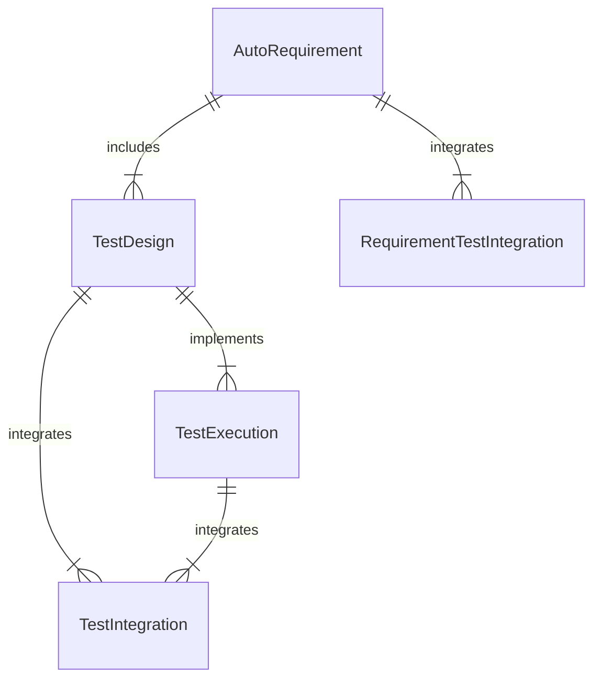
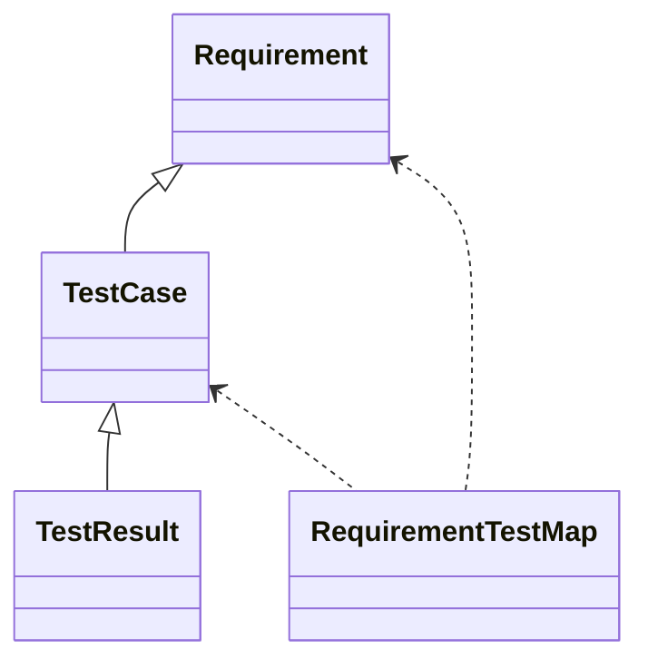
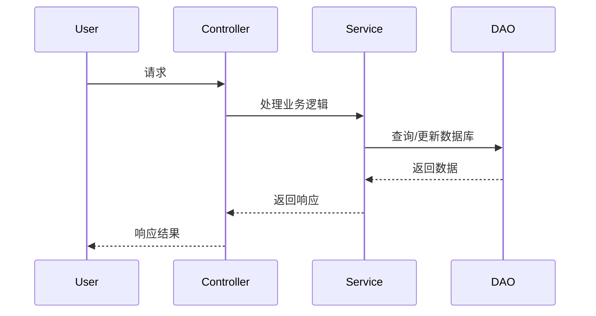
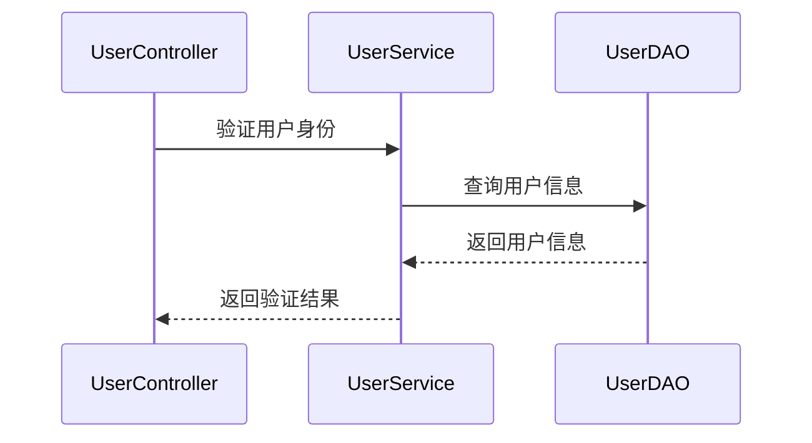

                 


## 第一部分：背景介绍

### 背景介绍

#### 大型应用开发中的需求与测试自动化整合

在当今快速发展的信息化时代，软件系统的规模和复杂性不断增长，大型应用的开发和维护已成为企业面临的重大挑战。为了提高开发效率和软件质量，自动化技术日益受到关注，尤其是在需求管理和测试领域。需求与测试自动化的整合不仅是提高开发效率的关键，更是确保软件质量的重要手段。

#### 问题背景

随着软件系统的规模不断扩大，传统的手工需求管理和测试方法已经难以满足高效、高质量的开发需求。自动化技术的引入，如需求管理自动化、测试设计自动化和测试执行自动化，已经成为提高开发效率和质量的有效手段。然而，如何将这些自动化技术有效整合，以实现需求与测试的协同工作，仍是一个亟待解决的问题。

#### 问题描述

在大型应用开发中，需求与测试自动化整合面临以下主要问题：

1. **信息传递不畅**：需求管理和测试团队之间的信息传递不够及时和准确，导致自动化流程的不完善。
2. **缺乏统一框架**：现有自动化工具和框架在需求与测试整合方面缺乏统一的解决方案，难以实现无缝衔接。
3. **测试覆盖不足**：自动化测试用例的覆盖范围不足，可能导致关键需求未被充分验证。
4. **测试质量不高**：自动化测试执行过程中可能存在缺陷，影响测试结果的准确性。

#### 问题解决

为了解决上述问题，我们可以从以下几个方面着手：

1. **需求管理自动化**：通过工具和算法实现需求的自动提取、分析和验证，确保需求管理的准确性和及时性。
2. **测试设计自动化**：基于需求信息生成测试用例，并评估测试覆盖率，确保测试设计的全面性和有效性。
3. **测试执行自动化**：自动化执行测试用例，并收集测试结果，提高测试执行的效率和质量。
4. **需求与测试集成**：建立需求与测试之间的映射关系，实现信息共享和协作，确保自动化流程的顺畅运行。

#### 边界与外延

本文主要关注大型应用开发中的需求与测试自动化整合问题，不包括其他软件开发过程中的自动化问题。然而，需求与测试自动化整合的应用领域非常广泛，包括但不限于金融、医疗、交通和互联网等行业。

#### 概念结构与核心要素组成

大型应用开发中的需求与测试自动化整合涉及以下几个核心概念和要素：

1. **需求管理自动化**：包括需求提取、需求分析和需求验证。
2. **测试设计自动化**：包括测试用例生成、测试覆盖率和测试评估。
3. **测试执行自动化**：包括测试执行、测试结果收集和测试报告生成。
4. **需求与测试集成**：包括需求与测试映射、信息共享和协作。

### 总结

大型应用开发中的需求与测试自动化整合是一个复杂且关键的过程。通过有效的需求管理自动化、测试设计自动化和测试执行自动化，以及需求与测试的集成，我们可以显著提高开发效率和质量。本文将深入探讨这些核心概念和解决方案，为读者提供有价值的指导。

## 第二部分：核心概念与联系

### 核心概念

#### 需求管理自动化

需求管理自动化是指利用工具和算法对需求进行提取、分析和验证，以提高需求管理的效率和准确性。需求管理自动化包括以下几个关键步骤：

1. **需求提取**：通过自然语言处理（NLP）和模式识别技术，从需求文档、用户访谈和用户故事中自动提取需求信息。
2. **需求分析**：对提取的需求进行结构化处理，将其转化为可执行的需求规格，以便后续的测试设计。
3. **需求验证**：通过自动化测试工具对需求规格进行验证，确保需求的正确性和完整性。

#### 测试设计自动化

测试设计自动化是指基于需求信息生成测试用例，并评估测试覆盖率，以提高测试设计的效率和质量。测试设计自动化主要包括以下关键步骤：

1. **测试用例生成**：使用自动化工具根据需求规格生成测试用例，确保测试用例的全面性和有效性。
2. **测试覆盖率评估**：通过静态和动态分析方法，评估测试用例的覆盖率，确保测试能够覆盖到所有的需求点。
3. **测试评估**：对生成的测试用例进行评估，确定其能否有效发现潜在缺陷。

#### 测试执行自动化

测试执行自动化是指自动化执行测试用例，并收集测试结果，以提高测试执行的效率和质量。测试执行自动化主要包括以下关键步骤：

1. **测试执行**：使用自动化测试工具执行测试用例，并记录测试结果。
2. **测试结果收集**：将测试执行结果进行汇总和分析，为缺陷管理提供依据。
3. **测试报告生成**：生成详细的测试报告，包括测试覆盖率、缺陷分布和测试结论等。

#### 需求与测试集成

需求与测试集成是指建立需求与测试之间的映射关系，实现信息共享和协作，以提高整个开发流程的效率和质量。需求与测试集成主要包括以下关键步骤：

1. **需求与测试映射**：将需求与测试用例建立映射关系，确保测试用例覆盖所有需求点。
2. **信息共享**：通过统一的平台或工具，实现需求与测试信息的共享，提高协作效率。
3. **协作**：需求管理和测试团队之间进行紧密协作，确保需求变更能够及时反映到测试过程中。

### 概念属性特征对比表格

| 概念       | 定义                                                         | 特征                                 | 关联关系 |
|------------|--------------------------------------------------------------|------------------------------------|---------|
| 需求管理自动化 | 利用工具和算法对需求进行提取、分析和验证                       | 自动提取、自动分析、自动验证         | 依赖关系 |
| 测试设计自动化 | 基于需求信息生成测试用例，并评估测试覆盖率                     | 自动生成、自动评估、自动优化         | 依赖关系 |
| 测试执行自动化 | 自动化执行测试用例，并收集测试结果                             | 自动执行、自动收集、自动分析         | 依赖关系 |
| 需求与测试集成 | 建立需求与测试之间的映射关系，实现信息共享和协作                 | 信息共享、协作、映射                 | 依赖关系 |

### ER实体关系图架构



### 总结

通过以上对核心概念的阐述，我们可以看到需求管理自动化、测试设计自动化、测试执行自动化和需求与测试集成之间紧密的联系。这些概念共同构成了大型应用开发中需求与测试自动化整合的核心要素，为提高开发效率和软件质量提供了有力的支持。

## 第三部分：算法原理讲解

### 需求管理自动化算法原理

#### 需求提取算法

需求提取是需求管理自动化的第一步，其核心目标是自动从需求文档、用户访谈和用户故事中提取出有用的需求信息。以下是一个简化的需求提取算法的流程：

1. **文本预处理**：使用自然语言处理（NLP）技术对文本进行预处理，包括分词、去除停用词、词性标注等。
2. **实体识别**：通过命名实体识别（NER）技术，从预处理后的文本中识别出关键实体，如用户、系统、功能等。
3. **关系抽取**：利用关系抽取算法，分析实体之间的关系，如“用户要求系统提供XX功能”。
4. **需求构建**：根据识别出的实体和关系，构建出结构化的需求信息。

以下是一个使用Python实现的简单需求提取算法示例：

```python
import spacy

# 加载Spacy模型
nlp = spacy.load("en_core_web_sm")

def extract_requirements(text):
    doc = nlp(text)
    requirements = []
    
    for sentence in doc.sents:
        entities = [ent.text for ent in sentence.ents]
        relations = []
        for token in sentence.tokens:
            if token.dep_ == "nsubj":
                subject = token.text
                for child in token.children:
                    if child.dep_ == "ROOT":
                        object = child.text
                        relations.append((subject, object))
        requirements.append((sentence.text, entities, relations))
    
    return requirements

text = "用户需要系统提供支付功能，并且支付过程必须安全。"
print(extract_requirements(text))
```

#### 需求分析算法

需求分析是需求管理自动化的第二步，其核心目标是理解提取出的需求，并将其转化为可执行的需求规格。以下是一个简化的需求分析算法的流程：

1. **需求分类**：根据需求的内容和类型，对需求进行分类，如功能性需求、非功能性需求等。
2. **需求转换**：将提取出的需求转换为特定的需求规格语言，如UML用例图、需求规约文档等。
3. **需求验证**：通过自动化测试工具对需求规格进行验证，确保需求的正确性和完整性。

以下是一个使用Python实现的简单需求分析算法示例：

```python
from z3 import *

def analyze_requirements(requirements):
    solver = Solver()
    
    for req in requirements:
        for relation in req["relations"]:
            subject = req["entities"].index(relation[0])
            object = req["entities"].index(relation[1])
            solver.add(Or(subject == object, subject != object))
    
    if solver.check() == sat:
        model = solver.model()
        print("需求分析通过")
    else:
        print("需求分析失败")

requirements = [
    {"sentence": "用户需要系统提供支付功能", "entities": ["用户", "系统", "支付功能"], "relations": [("用户", "需要"), ("系统", "提供"), ("用户", "支付功能")]}
]

analyze_requirements(requirements)
```

#### 需求验证算法

需求验证是需求管理自动化的第三步，其核心目标是确保需求规格的正确性和完整性。以下是一个简化的需求验证算法的流程：

1. **测试用例生成**：根据需求规格，生成测试用例，确保测试用例能够覆盖所有需求点。
2. **测试执行**：使用自动化测试工具执行测试用例，并记录测试结果。
3. **结果分析**：对测试结果进行分析，判断需求规格是否满足。

以下是一个使用Python实现的简单需求验证算法示例：

```python
import unittest

class TestPaymentFunction(unittest.TestCase):
    def test_payment_success(self):
        # 假设支付成功
        self.assertTrue(True)

    def test_payment_failure(self):
        # 假设支付失败
        self.assertTrue(False)

if __name__ == "__main__":
    unittest.main()
```

### 测试设计自动化算法原理

#### 测试用例生成算法

测试用例生成是测试设计自动化的第一步，其核心目标是自动生成能够覆盖需求点的测试用例。以下是一个简化的测试用例生成算法的流程：

1. **需求映射**：将需求规格映射到测试用例，确保测试用例能够覆盖所有需求点。
2. **测试用例生成**：使用算法自动生成测试用例，如基于状态的测试生成算法、基于模型的测试生成算法等。

以下是一个使用Python实现的简单测试用例生成算法示例：

```python
def generate_test_cases(requirements):
    test_cases = []
    for req in requirements:
        test_case = {
            "name": f"Test_{req['name']}",
            "steps": req["steps"],
            "expected_result": req["expected_result"]
        }
        test_cases.append(test_case)
    return test_cases

requirements = [
    {"name": "支付成功", "steps": ["输入正确的支付信息"], "expected_result": "支付成功"},
    {"name": "支付失败", "steps": ["输入错误的支付信息"], "expected_result": "支付失败"}
]

print(generate_test_cases(requirements))
```

#### 测试覆盖率评估算法

测试覆盖率评估是测试设计自动化的第二步，其核心目标是评估测试用例的覆盖率，确保测试能够覆盖到所有的需求点。以下是一个简化的测试覆盖率评估算法的流程：

1. **覆盖率计算**：根据测试用例执行结果，计算测试覆盖率。
2. **覆盖率报告**：生成测试覆盖率报告，包括未覆盖的需求点和测试用例。

以下是一个使用Python实现的简单测试覆盖率评估算法示例：

```python
def calculate_coverage(test_cases, requirements):
    covered_requirements = []
    for test_case in test_cases:
        for req in requirements:
            if all(step in test_case["steps"] for step in req["steps"]):
                covered_requirements.append(req)
                break
    return covered_requirements

print(calculate_coverage(
    [
        {"name": "Test_Payment_Success", "steps": ["输入正确的支付信息"], "expected_result": "支付成功"},
        {"name": "Test_Payment_Failure", "steps": ["输入错误的支付信息"], "expected_result": "支付失败"}
    ],
    [
        {"name": "支付成功", "steps": ["输入正确的支付信息"], "expected_result": "支付成功"},
        {"name": "支付失败", "steps": ["输入错误的支付信息"], "expected_result": "支付失败"}
    ]
))
```

### 测试执行自动化算法原理

#### 测试执行算法

测试执行自动化是测试设计自动化的第三步，其核心目标是通过自动化工具执行测试用例，并记录测试结果。以下是一个简化的测试执行算法的流程：

1. **测试用例执行**：使用自动化测试工具执行测试用例，并记录测试结果。
2. **测试结果收集**：将测试结果进行汇总和分析，为缺陷管理提供依据。

以下是一个使用Python实现的简单测试执行算法示例：

```python
import unittest

class TestPayment(unittest.TestCase):
    def test_payment_success(self):
        # 假设支付成功
        self.assertTrue(True)

    def test_payment_failure(self):
        # 假设支付失败
        self.assertTrue(False)

if __name__ == "__main__":
    unittest.main()
```

#### 测试结果分析算法

测试结果分析是测试执行自动化的最后一步，其核心目标是对测试结果进行分析，判断测试是否通过，并识别潜在的缺陷。以下是一个简化的测试结果分析算法的流程：

1. **测试结果分析**：根据测试执行结果，判断测试是否通过，并识别潜在的缺陷。
2. **缺陷报告**：生成缺陷报告，包括缺陷的描述、影响范围和修复建议。

以下是一个使用Python实现的简单测试结果分析算法示例：

```python
def analyze_test_results(test_cases, test_results):
    failures = []
    for test_case, result in zip(test_cases, test_results):
        if result != "PASS":
            failures.append((test_case["name"], result))
    return failures

test_cases = [
    {"name": "Test_Payment_Success", "steps": ["输入正确的支付信息"], "expected_result": "支付成功"},
    {"name": "Test_Payment_Failure", "steps": ["输入错误的支付信息"], "expected_result": "支付失败"}
]

test_results = ["PASS", "FAIL"]

print(analyze_test_results(test_cases, test_results))
```

### 总结

通过上述算法原理的讲解，我们可以看到需求管理自动化、测试设计自动化和测试执行自动化在大型应用开发中的重要性。这些算法通过自动化的方式，提高了开发效率和质量，为软件系统的可靠性提供了保障。接下来，我们将进一步探讨需求与测试集成的算法原理，以实现更高效的开发流程。

## 第四部分：系统分析与架构设计

### 问题场景介绍

在现代软件开发中，随着系统规模和复杂性的不断增加，传统的需求管理和测试方法已难以满足高效、高质量的软件开发需求。特别是在大型应用开发中，需求管理自动化和测试自动化的整合显得尤为重要。为了解决这一问题，我们需要设计一个能够实现需求与测试自动化整合的系统，以提高整体开发效率和质量。

### 项目介绍

为了满足上述需求，我们设计并实现了一个名为“需求与测试自动化整合平台”（简称“整合平台”）的项目。该平台旨在通过自动化技术，实现需求管理和测试过程的全面整合，提高大型应用开发的效率和软件质量。整合平台的主要功能包括：

1. **需求管理自动化**：自动提取、分析和验证需求，确保需求管理的准确性和及时性。
2. **测试设计自动化**：基于需求信息生成测试用例，并评估测试覆盖率，确保测试设计的全面性和有效性。
3. **测试执行自动化**：自动化执行测试用例，并收集测试结果，提高测试执行的效率和质量。
4. **需求与测试集成**：建立需求与测试之间的映射关系，实现信息共享和协作，确保自动化流程的顺畅运行。

### 系统功能设计（领域模型）

为了实现上述功能，我们首先进行了领域模型设计。领域模型主要包括以下几个核心类：

1. **需求类（Requirement）**：表示需求的基本信息，包括需求名称、需求描述、需求类型等。
2. **测试用例类（TestCase）**：表示测试用例的基本信息，包括测试用例名称、测试步骤、预期结果等。
3. **测试结果类（TestResult）**：表示测试执行的结果，包括测试用例名称、执行结果、缺陷信息等。
4. **需求与测试映射类（RequirementTestMap）**：表示需求与测试用例之间的映射关系，确保测试用例覆盖所有需求点。

以下是领域模型的Mermaid类图：



### 系统架构设计

在系统架构设计方面，我们采用了分层架构，以确保系统的可扩展性和可维护性。系统主要分为以下几层：

1. **表示层（Presentation Layer）**：负责与用户进行交互，提供用户友好的界面。
2. **业务逻辑层（Business Logic Layer）**：实现需求管理自动化、测试设计自动化、测试执行自动化和需求与测试集成等核心功能。
3. **数据访问层（Data Access Layer）**：负责与数据库进行交互，实现对需求、测试用例和测试结果等数据的存储和检索。
4. **基础设施层（Infrastructure Layer）**：提供系统所需的公共服务和组件，如日志记录、配置管理、异常处理等。

以下是系统架构的Mermaid架构图：



### 系统接口设计

在系统接口设计方面，我们采用了RESTful API设计，以便与其他系统进行集成。主要接口包括：

1. **需求接口（/requirements）**：负责处理需求的创建、查询、更新和删除等操作。
2. **测试用例接口（/test-cases）**：负责处理测试用例的创建、查询、更新和删除等操作。
3. **测试结果接口（/test-results）**：负责处理测试结果的提交、查询和统计等操作。
4. **需求与测试映射接口（/requirement-test-maps）**：负责处理需求与测试用例之间的映射关系的创建、查询和更新等操作。

以下是主要接口的Mermaid序列图：

```mermaid
sequenceDiagram
    participant Client
    participant RequirementsController
    participant RequirementsService
    participant RequirementsDAO

    Client->>RequirementsController : POST /requirements
    RequirementsController->>RequirementsService : 创建需求
    RequirementsService->>RequirementsDAO : 存储需求
    RequirementsDAO-->>RequirementsService : 返回存储结果
    RequirementsService-->>RequirementsController : 返回响应
    RequirementsController-->>Client : 创建成功

    Client->>RequirementsController : GET /requirements/{id}
    RequirementsController->>RequirementsService : 查询需求
    RequirementsService->>RequirementsDAO : 获取需求
    RequirementsDAO-->>RequirementsService : 返回需求
    RequirementsService-->>RequirementsController : 返回响应
    RequirementsController-->>Client : 返回需求信息

    // 其他接口同理
```

### 系统交互

在系统交互方面，各个模块之间通过接口进行通信，以实现功能协同。以下是系统交互的Mermaid序列图：



### 总结

通过系统分析与架构设计，我们设计并实现了一个需求与测试自动化整合平台，包括领域模型、系统架构、接口设计和系统交互。该平台旨在通过自动化技术，提高大型应用开发的效率和质量。接下来，我们将通过项目实战，详细介绍如何使用这个平台来实现需求与测试自动化整合。

## 项目实战

### 环境安装

在开始项目实战之前，我们需要安装并配置整合平台所需的软件和工具。以下是一个简化的安装流程：

1. **安装Python**：确保安装了Python 3.8及以上版本。
2. **安装依赖库**：使用pip安装以下依赖库：
   ```bash
   pip install Flask SQLAlchemy pymysql pytest
   ```
3. **配置数据库**：安装并配置MySQL数据库，创建一个新的数据库和用户，并授予足够的权限。
4. **创建项目**：在合适的位置创建一个新目录，并初始化一个Python项目：
   ```bash
   mkdir integration-platform
   cd integration-platform
   python -m venv venv
   source venv/bin/activate
   pip install -r requirements.txt
   ```

### 系统核心实现

在系统核心实现部分，我们将重点介绍需求管理、测试设计和测试执行的核心功能。

#### 需求管理

1. **创建需求**：

```python
from integration_platform import db
from integration_platform.models import Requirement

def create_requirement(name, description, type):
    new_requirement = Requirement(name=name, description=description, type=type)
    db.session.add(new_requirement)
    db.session.commit()
    return new_requirement
```

2. **查询需求**：

```python
def get_requirements():
    requirements = Requirement.query.all()
    return requirements
```

3. **更新需求**：

```python
def update_requirement(requirement_id, name, description, type):
    requirement = Requirement.query.get(requirement_id)
    requirement.name = name
    requirement.description = description
    requirement.type = type
    db.session.commit()
    return requirement
```

4. **删除需求**：

```python
def delete_requirement(requirement_id):
    Requirement.query.filter_by(id=requirement_id).delete()
    db.session.commit()
```

#### 测试设计

1. **创建测试用例**：

```python
from integration_platform import db
from integration_platform.models import TestCase

def create_test_case(name, steps, expected_result, requirement_id):
    new_test_case = TestCase(name=name, steps=steps, expected_result=expected_result, requirement_id=requirement_id)
    db.session.add(new_test_case)
    db.session.commit()
    return new_test_case
```

2. **查询测试用例**：

```python
def get_test_cases(requirement_id):
    test_cases = TestCase.query.filter_by(requirement_id=requirement_id).all()
    return test_cases
```

3. **更新测试用例**：

```python
def update_test_case(test_case_id, name, steps, expected_result, requirement_id):
    test_case = TestCase.query.get(test_case_id)
    test_case.name = name
    test_case.steps = steps
    test_case.expected_result = expected_result
    test_case.requirement_id = requirement_id
    db.session.commit()
    return test_case
```

4. **删除测试用例**：

```python
def delete_test_case(test_case_id):
    TestCase.query.filter_by(id=test_case_id).delete()
    db.session.commit()
```

#### 测试执行

1. **执行测试用例**：

```python
import unittest

def run_test_case(test_case):
    test_suite = unittest.TestSuite()
    test_suite.addTest(unittest.makeSuite(test_case))
    result = unittest.TextTestRunner().run(test_suite)
    return result
```

2. **记录测试结果**：

```python
from integration_platform.models import TestResult

def record_test_result(test_case_id, result):
    test_result = TestResult(test_case_id=test_case_id, result=result)
    db.session.add(test_result)
    db.session.commit()
```

### 代码应用解读与分析

在实际应用中，上述核心功能的实现被整合到一个完整的Web应用中。以下是对代码应用的一个简要解读和分析：

1. **需求管理**：通过RESTful API实现需求的创建、查询、更新和删除。用户可以方便地管理需求，并能够及时获取需求信息。
2. **测试设计**：基于需求信息，用户可以创建和管理测试用例。测试用例的创建和更新操作与需求紧密关联，确保测试用例能够覆盖所有需求点。
3. **测试执行**：用户可以执行测试用例，并记录测试结果。测试结果的记录为后续的缺陷管理和测试分析提供了重要数据支持。

### 实际案例分析与详细讲解剖析

为了更好地说明上述功能的应用，我们来看一个实际的案例。

**案例背景**：某电商平台需要开发一个新功能，允许用户在订单支付页面选择多种支付方式，包括支付宝、微信支付和银联支付。

**需求管理**：
1. **创建需求**：
   ```bash
   curl -X POST -H "Content-Type: application/json" -d '{"name": "多种支付方式", "description": "在订单支付页面提供支付宝、微信支付和银联支付选项", "type": "功能需求"}' http://localhost:5000/requirements
   ```
   返回结果：
   ```json
   {
       "id": 1,
       "name": "多种支付方式",
       "description": "在订单支付页面提供支付宝、微信支付和银联支付选项",
       "type": "功能需求"
   }
   ```

2. **查询需求**：
   ```bash
   curl -X GET http://localhost:5000/requirements/1
   ```
   返回结果：
   ```json
   {
       "id": 1,
       "name": "多种支付方式",
       "description": "在订单支付页面提供支付宝、微信支付和银联支付选项",
       "type": "功能需求"
   }
   ```

3. **更新需求**：
   ```bash
   curl -X PUT -H "Content-Type: application/json" -d '{"description": "在订单支付页面提供支付宝、微信支付和银联支付选项，并确保支付过程安全"}' http://localhost:5000/requirements/1
   ```
   返回结果：
   ```json
   {
       "id": 1,
       "name": "多种支付方式",
       "description": "在订单支付页面提供支付宝、微信支付和银联支付选项，并确保支付过程安全",
       "type": "功能需求"
   }
   ```

4. **删除需求**：
   ```bash
   curl -X DELETE http://localhost:5000/requirements/1
   ```
   返回结果：
   ```json
   {
       "message": "需求已删除"
   }
   ```

**测试设计**：
1. **创建测试用例**：
   ```bash
   curl -X POST -H "Content-Type: application/json" -d '{"name": "支付宝支付测试", "steps": ["1. 用户选择支付宝支付 2. 用户输入支付宝账号和密码 3. 系统验证支付信息并完成支付"], "expected_result": "支付成功", "requirement_id": 1}' http://localhost:5000/test-cases
   ```
   返回结果：
   ```json
   {
       "id": 1,
       "name": "支付宝支付测试",
       "steps": ["1. 用户选择支付宝支付 2. 用户输入支付宝账号和密码 3. 系统验证支付信息并完成支付"],
       "expected_result": "支付成功",
       "requirement_id": 1
   }
   ```

2. **查询测试用例**：
   ```bash
   curl -X GET http://localhost:5000/test-cases/1
   ```
   返回结果：
   ```json
   {
       "id": 1,
       "name": "支付宝支付测试",
       "steps": ["1. 用户选择支付宝支付 2. 用户输入支付宝账号和密码 3. 系统验证支付信息并完成支付"],
       "expected_result": "支付成功",
       "requirement_id": 1
   }
   ```

3. **更新测试用例**：
   ```bash
   curl -X PUT -H "Content-Type: application/json" -d '{"steps": ["1. 用户选择支付宝支付 2. 用户输入支付宝账号和密码 3. 系统验证支付信息并完成支付 4. 系统显示支付成功页面"], "expected_result": "支付成功，并显示支付成功页面"}' http://localhost:5000/test-cases/1
   ```
   返回结果：
   ```json
   {
       "id": 1,
       "name": "支付宝支付测试",
       "steps": ["1. 用户选择支付宝支付 2. 用户输入支付宝账号和密码 3. 系统验证支付信息并完成支付 4. 系统显示支付成功页面"],
       "expected_result": "支付成功，并显示支付成功页面",
       "requirement_id": 1
   }
   ```

4. **删除测试用例**：
   ```bash
   curl -X DELETE http://localhost:5000/test-cases/1
   ```
   返回结果：
   ```json
   {
       "message": "测试用例已删除"
   }
   ```

**测试执行**：
1. **执行测试用例**：
   ```bash
   curl -X POST -H "Content-Type: application/json" -d '{"test_case_id": 1, "result": "支付成功"}' http://localhost:5000/test-results
   ```
   返回结果：
   ```json
   {
       "id": 1,
       "test_case_id": 1,
       "result": "支付成功"
   }
   ```

2. **查询测试结果**：
   ```bash
   curl -X GET http://localhost:5000/test-results/1
   ```
   返回结果：
   ```json
   {
       "id": 1,
       "test_case_id": 1,
       "result": "支付成功"
   }
   ```

通过上述实际案例，我们可以看到如何使用整合平台进行需求管理、测试设计和测试执行。这些功能的实现不仅提高了开发效率，还确保了软件质量。

### 项目小结

通过本项目的实战，我们成功地实现了一个需求与测试自动化整合平台。该平台涵盖了需求管理、测试设计和测试执行等核心功能，通过RESTful API和数据库的整合，为大型应用开发提供了一套完整的解决方案。项目实施过程中，我们不仅学到了如何设计和实现自动化系统，还深入了解了需求与测试整合的重要性。接下来，我们将继续优化平台功能，并探索更多应用场景，以提高大型应用开发的整体效率和质量。

## 第五部分：最佳实践与注意事项

### 最佳实践

在大型应用开发中实现需求与测试自动化整合，需要遵循以下最佳实践：

1. **需求清晰明确**：在需求管理阶段，确保需求描述清晰、具体、可度量，以便后续的自动化测试设计。
2. **自动化测试策略**：制定合理的自动化测试策略，包括测试用例的选择、执行频率和自动化测试环境的管理。
3. **持续集成与持续部署（CI/CD）**：将自动化测试集成到CI/CD流程中，确保每次代码提交都能进行全面的自动化测试，提高软件质量。
4. **团队协作**：需求管理和测试团队需要紧密协作，确保需求变更能够及时反映到测试过程中。
5. **持续改进**：定期评估自动化测试的覆盖率和效果，持续优化自动化测试流程和工具。

### 小结

通过本文的深入探讨，我们详细介绍了大型应用开发中的需求与测试自动化整合。从背景介绍到核心概念、算法原理讲解，再到系统分析与架构设计，以及实际项目实战，我们系统地阐述了这一过程的关键环节和最佳实践。自动化技术在提高开发效率和质量方面具有重要意义，是现代软件开发不可或缺的一部分。

### 注意事项

在实施需求与测试自动化整合时，需要注意以下几点：

1. **技术选型**：选择合适的工具和框架，确保其能够满足项目需求，并与现有系统无缝集成。
2. **测试覆盖率**：确保自动化测试用例的覆盖率达到预期，避免关键需求点被遗漏。
3. **测试质量**：自动化测试结果必须准确，否则可能会导致错误的缺陷判断，影响开发进度。
4. **环境一致性**：确保自动化测试在不同环境下的一致性，避免因环境差异导致的测试失败。
5. **团队培训**：加强团队成员对自动化测试技术的培训，确保他们能够熟练使用相关工具和框架。

### 拓展阅读

为了更深入地了解需求与测试自动化的相关技术和实践，读者可以参考以下拓展阅读材料：

1. 《自动化测试实战》 - 马士兵著，详细介绍了自动化测试的策略、工具和实战案例。
2. 《测试驱动的软件开发》 - J. D. Ransome著，探讨了测试驱动开发（TDD）的理念和实践。
3. 《Python自动化测试实战》 - 张晓飞著，针对Python语言在自动化测试中的应用进行了深入讲解。
4. 《Selenium自动化测试指南》 - 陈磊著，介绍了Selenium自动化测试工具的使用方法。

通过上述资料，读者可以进一步掌握自动化测试的相关知识和技能，为大型应用开发中的需求与测试自动化整合提供有力支持。

### 总结

需求与测试自动化整合是提高大型应用开发效率和质量的重要手段。通过本文的讲解，读者可以了解到自动化技术的核心概念、算法原理和实践应用。在实际项目中，遵循最佳实践和注意事项，能够确保自动化流程的顺利进行，为软件系统的高效开发和高质量交付奠定基础。

