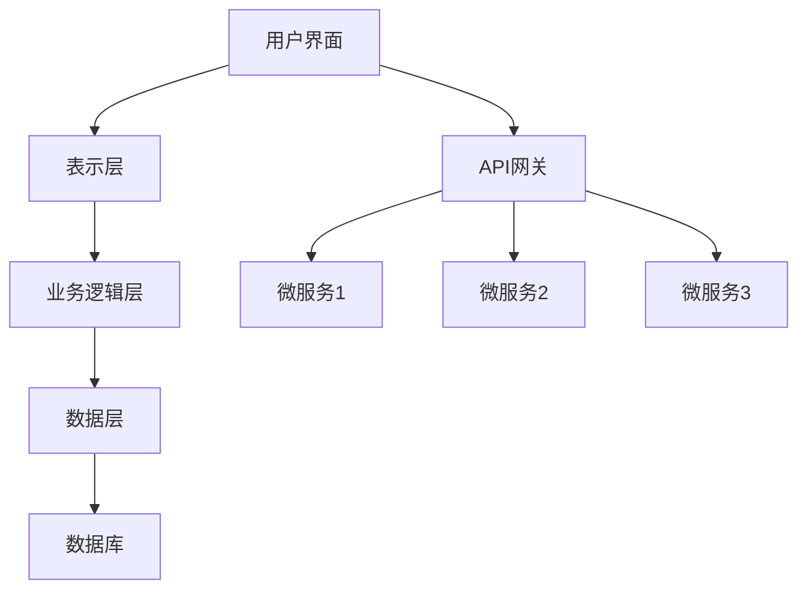
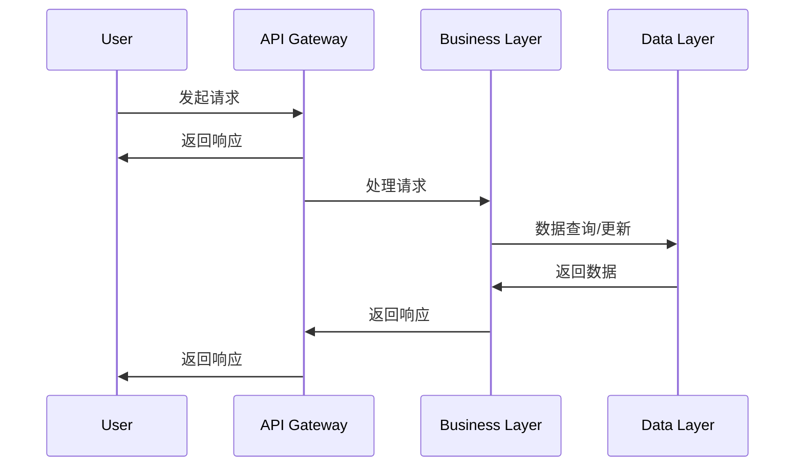
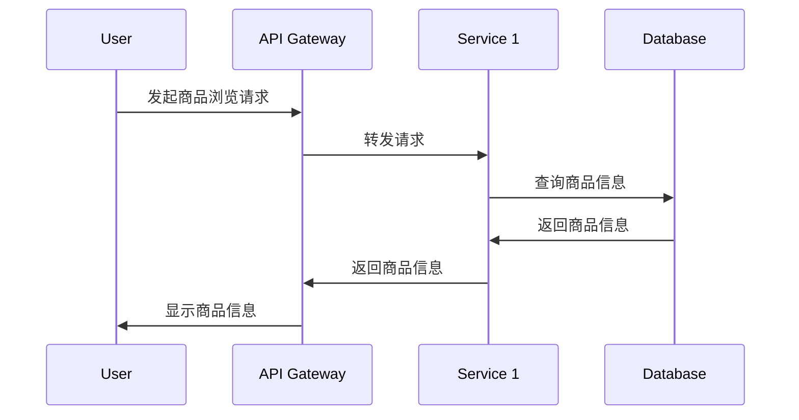

                 


### 让我们一步步深入思考：大型应用开发中的需求与资源预测模型

#### 问题背景

在当今快速发展的数字化时代，大型应用的开发变得越来越复杂。这些应用需要处理海量数据，支持高并发访问，并且要具备良好的可扩展性和可靠性。在这种背景下，准确的需求与资源预测成为了开发过程中至关重要的环节。这不仅能够帮助团队更好地规划开发周期和资源分配，还能够提高系统的性能和用户体验。

**挑战**

1. **需求变化快速**：在大型应用的开发过程中，需求往往会随着时间、市场环境和技术发展而不断变化。这种变化要求开发团队能够快速响应，从而增加了预测的难度。
2. **数据量庞大**：大型应用通常涉及海量用户数据，处理这些数据需要高效的算法和模型。
3. **多维度资源管理**：大型应用需要管理多种资源，如CPU、内存、带宽等，每种资源的预测和管理都有其独特性。

**现状与问题分析**

目前，许多开发团队在需求与资源预测方面面临以下问题：

1. **数据不足**：缺乏足够的历史数据或数据质量差，导致预测不准确。
2. **模型选择不当**：使用错误的模型或没有优化模型参数，导致预测效果不理想。
3. **模型泛化能力不足**：模型在特定场景下表现良好，但在其他场景下效果较差。

#### 核心概念与联系

为了解决上述问题，我们需要了解几个核心概念，包括需求预测、资源预测、机器学习模型等，并探讨它们之间的联系。

**需求预测**

需求预测是指根据历史数据和市场趋势，预测未来用户需求的变化。这通常包括以下步骤：

1. **数据收集**：收集用户行为、市场数据、历史需求等。
2. **特征工程**：从数据中提取有用的特征，如用户活跃度、季节性等。
3. **模型选择**：选择适合的预测模型，如时间序列分析、机器学习模型等。
4. **模型训练与优化**：使用历史数据训练模型，并通过交叉验证等方法优化模型参数。

**资源预测**

资源预测是指根据应用的需求预测，预测未来所需的各种资源，如CPU、内存、带宽等。资源预测的步骤与需求预测类似，但更侧重于数据的实时性和资源的具体分配。

**机器学习模型**

机器学习模型是需求与资源预测的核心工具。常见的机器学习模型包括时间序列模型、回归模型、分类模型等。每种模型都有其特定的应用场景和优缺点。

**核心概念之间的关系**

需求预测和资源预测相互依赖，需求预测的结果为资源预测提供了输入，而资源预测的结果则指导了需求预测的调整。机器学习模型则是实现这两大预测任务的核心工具，通过不断优化模型和参数，可以提高预测的准确性。

#### 算法原理讲解

在下一部分中，我们将详细讲解用于需求与资源预测的算法原理，包括数学模型、公式和Python源代码实现。通过这些内容，读者可以更深入地理解这些算法的原理和应用。

#### 系统分析与架构设计方案

在了解了算法原理之后，我们需要对大型应用开发的系统进行分析和架构设计。这部分内容包括问题场景介绍、项目介绍、系统功能设计（领域模型类图）、系统架构设计架构图、系统接口设计和系统交互设计。通过这些设计，我们可以更清晰地理解系统的运作方式和各部分之间的联系。

#### 项目实战

在项目实战部分，我们将通过具体的实战案例，展示如何应用书中所述的方法和模型进行需求与资源预测。这部分内容包括环境安装、系统核心实现源代码，代码应用解读与分析，实际案例分析和详细讲解剖析，以及项目小结。通过这些案例，读者可以更直观地了解如何在实际项目中应用这些算法。

#### 最佳实践与拓展

在最后一部分，我们将总结书中的最佳实践，提出注意事项，并提供拓展阅读资源。这部分内容包括最佳实践、注意事项、拓展阅读等。通过这些内容，读者可以更好地应用所学知识，并在实践中不断优化和改进。

通过以上五个部分，我们将系统地探讨大型应用开发中的需求与资源预测模型，帮助读者深入理解这一关键领域，并在实际项目中应用这些方法和模型。接下来，我们将逐一展开这些内容，让读者逐步掌握这一领域的前沿技术和实践方法。让我们开始吧！## 文章标题

### 大型应用开发中的需求与资源预测模型

#### 关键词

- 大型应用开发
- 需求预测
- 资源预测
- 机器学习模型
- 系统分析
- 架构设计

#### 摘要

本文旨在探讨大型应用开发中需求与资源预测的重要性，详细介绍了用于这两大预测任务的算法原理、系统分析与架构设计方法，并通过实际项目案例展示了这些方法的具体应用。文章结构清晰，内容深入浅出，旨在帮助开发者更好地应对大型应用开发中的挑战，提高项目成功率和系统性能。

### 目录大纲设计思路

在设计《大型应用开发中的需求与资源预测模型》的目录大纲时，我们遵循以下步骤：

1. **背景介绍**：首先介绍书籍的主题背景，包括大型应用开发的需求和资源预测的重要性、现状和问题。
2. **核心概念与联系**：明确书中的核心概念，如需求预测、资源预测、机器学习模型等，并展示它们之间的联系。
3. **算法原理讲解**：详细讲解用于需求与资源预测的算法原理，包括数学模型、公式和Python源代码实现。
4. **系统分析与架构设计方案**：介绍大型应用开发中的系统分析和架构设计，展示相关类图、架构图和序列图。
5. **项目实战**：通过具体的实战案例，展示如何应用书中所述的方法和模型进行需求与资源预测。
6. **最佳实践与拓展**：总结书中的最佳实践，提出注意事项，并提供拓展阅读资源。

#### 第一部分：背景介绍

在当今快速发展的数字化时代，大型应用的开发变得越来越复杂。这些应用需要处理海量数据，支持高并发访问，并且要具备良好的可扩展性和可靠性。在这种背景下，准确的需求与资源预测成为了开发过程中至关重要的环节。这不仅能够帮助团队更好地规划开发周期和资源分配，还能够提高系统的性能和用户体验。

### 1.1 问题背景

**大型应用开发的挑战**

大型应用的开发面临着诸多挑战。首先，需求变化快速。在大型应用的开发过程中，需求往往会随着时间、市场环境和技术发展而不断变化。这种变化要求开发团队能够快速响应，从而增加了预测的难度。其次，数据量庞大。大型应用通常涉及海量用户数据，处理这些数据需要高效的算法和模型。最后，多维度资源管理。大型应用需要管理多种资源，如CPU、内存、带宽等，每种资源的预测和管理都有其独特性。

**需求与资源预测的重要性**

需求与资源预测在大型应用开发中具有重要意义。首先，它能够帮助团队提前了解未来需求的变化趋势，从而更好地规划开发周期和资源分配。其次，准确的资源预测能够提高系统的性能和可靠性，减少因资源不足或浪费导致的系统故障。最后，需求与资源预测还能够帮助团队识别潜在的风险，提前采取应对措施。

**现状与问题分析**

目前，许多开发团队在需求与资源预测方面面临以下问题：

1. **数据不足**：缺乏足够的历史数据或数据质量差，导致预测不准确。
2. **模型选择不当**：使用错误的模型或没有优化模型参数，导致预测效果不理想。
3. **模型泛化能力不足**：模型在特定场景下表现良好，但在其他场景下效果较差。

### 1.2 核心概念与联系

为了解决上述问题，我们需要了解几个核心概念，包括需求预测、资源预测、机器学习模型等，并探讨它们之间的联系。

**需求预测**

需求预测是指根据历史数据和市场趋势，预测未来用户需求的变化。这通常包括以下步骤：

1. **数据收集**：收集用户行为、市场数据、历史需求等。
2. **特征工程**：从数据中提取有用的特征，如用户活跃度、季节性等。
3. **模型选择**：选择适合的预测模型，如时间序列分析、机器学习模型等。
4. **模型训练与优化**：使用历史数据训练模型，并通过交叉验证等方法优化模型参数。

**资源预测**

资源预测是指根据应用的需求预测，预测未来所需的各种资源，如CPU、内存、带宽等。资源预测的步骤与需求预测类似，但更侧重于数据的实时性和资源的具体分配。

**机器学习模型**

机器学习模型是需求与资源预测的核心工具。常见的机器学习模型包括时间序列模型、回归模型、分类模型等。每种模型都有其特定的应用场景和优缺点。

**核心概念之间的关系**

需求预测和资源预测相互依赖，需求预测的结果为资源预测提供了输入，而资源预测的结果则指导了需求预测的调整。机器学习模型则是实现这两大预测任务的核心工具，通过不断优化模型和参数，可以提高预测的准确性。

### 1.3 本书的结构

本书将按照以下结构展开：

1. **背景介绍**：介绍大型应用开发的需求与资源预测的重要性、现状和问题。
2. **核心概念与联系**：详细讲解需求预测、资源预测、机器学习模型等核心概念，并展示它们之间的联系。
3. **算法原理讲解**：讲解用于需求与资源预测的算法原理，包括数学模型、公式和Python源代码实现。
4. **系统分析与架构设计方案**：介绍大型应用开发中的系统分析和架构设计，展示相关类图、架构图和序列图。
5. **项目实战**：通过具体的实战案例，展示如何应用书中所述的方法和模型进行需求与资源预测。
6. **最佳实践与拓展**：总结书中的最佳实践，提出注意事项，并提供拓展阅读资源。

通过以上结构，本书旨在帮助读者全面了解大型应用开发中的需求与资源预测模型，掌握前沿技术和实践方法，从而更好地应对开发中的挑战。

#### 背景介绍

### 大型应用开发中的需求与资源预测的重要性、现状和问题

#### 重要性

在现代信息技术飞速发展的背景下，大型应用的开发已经成为企业和组织提升竞争力、拓展市场份额的关键。这些大型应用不仅需要处理海量的数据，还需要支持高并发的用户访问，并确保系统的可靠性和稳定性。在这种复杂的环境中，准确的需求与资源预测显得尤为重要。

首先，需求预测能够帮助开发团队提前了解用户需求的变化趋势。随着市场的动态变化和技术进步，用户的需求也会不断演变。通过需求预测，开发团队可以更早地识别出潜在的需求变化，从而调整开发计划，确保新功能的及时推出。这不仅有助于提升用户体验，还能增强企业的市场响应速度。

其次，资源预测在大型应用开发中同样至关重要。资源预测主要包括对计算资源、存储资源、网络带宽等各方面的预估。通过资源预测，开发团队可以合理规划资源分配，避免资源过剩或不足的情况发生。资源过剩会导致成本浪费，而资源不足则可能引发系统性能下降甚至崩溃。因此，准确地进行资源预测能够提高系统的整体性能和用户满意度。

#### 现状

尽管需求与资源预测的重要性已被广泛认可，但目前许多开发团队在实际操作中仍然面临诸多挑战。

首先，数据不足是一个普遍存在的问题。需求与资源预测依赖于大量历史数据，但许多团队在数据收集和处理方面存在困难。缺乏足够的历史数据或者数据质量差，都会导致预测模型的效果不佳。

其次，模型选择不当也是一个常见问题。不同的应用场景需要不同的预测模型，但很多开发团队在选择模型时缺乏针对性的分析，导致所选模型无法有效应对实际问题。

另外，模型的泛化能力也是一个关键问题。模型在特定场景下可能表现良好，但一旦应用到其他场景，效果可能会大打折扣。这表明模型的泛化能力不足，需要进一步优化和改进。

#### 问题分析

1. **数据不足**：缺乏足够的历史数据或者数据质量差，导致预测模型无法准确预测。
2. **模型选择不当**：没有根据具体应用场景选择合适的预测模型，导致预测效果不理想。
3. **模型泛化能力不足**：模型在特定场景下表现良好，但在其他场景下效果较差，需要更多的调整和优化。

### 核心概念与联系

为了应对上述问题，我们需要深入理解几个核心概念，包括需求预测、资源预测和机器学习模型等，并探讨它们之间的联系。

**需求预测**

需求预测是指通过分析历史数据和市场趋势，预测未来用户需求的变化。这个过程通常包括以下步骤：

1. **数据收集**：收集用户行为、市场数据、历史需求等。
2. **特征工程**：从数据中提取有用的特征，如用户活跃度、季节性等。
3. **模型选择**：选择适合的预测模型，如时间序列分析、机器学习模型等。
4. **模型训练与优化**：使用历史数据训练模型，并通过交叉验证等方法优化模型参数。

**资源预测**

资源预测是指根据应用的需求预测，预测未来所需的各种资源，如CPU、内存、带宽等。资源预测的过程类似于需求预测，但更侧重于数据的实时性和资源的具体分配。

**机器学习模型**

机器学习模型是需求与资源预测的核心工具。常见的机器学习模型包括时间序列模型、回归模型、分类模型等。每种模型都有其特定的应用场景和优缺点。

**核心概念之间的关系**

需求预测和资源预测相互依赖，需求预测的结果为资源预测提供了输入，而资源预测的结果则指导了需求预测的调整。机器学习模型则是实现这两大预测任务的核心工具，通过不断优化模型和参数，可以提高预测的准确性。

通过以上分析，我们可以看出，需求与资源预测在大型应用开发中具有极其重要的地位。只有通过科学的预测方法，开发团队才能更好地应对不断变化的开发环境，确保项目的成功。

#### 核心概念与联系

在深入探讨大型应用开发中的需求与资源预测时，我们首先需要明确几个核心概念，这些概念是构建预测模型的基础。核心概念包括需求预测、资源预测和机器学习模型。接下来，我们将逐一介绍这些概念，并探讨它们之间的联系。

### 需求预测

**定义与作用**

需求预测是指通过分析历史数据和市场趋势，预测未来用户需求的变化。其核心作用是帮助开发团队提前了解用户需求，从而更有效地规划开发和资源分配。

**步骤**

1. **数据收集**：收集用户行为、市场数据、历史需求等。
2. **特征工程**：从数据中提取有用的特征，如用户活跃度、季节性等。
3. **模型选择**：选择适合的预测模型，如时间序列分析、机器学习模型等。
4. **模型训练与优化**：使用历史数据训练模型，并通过交叉验证等方法优化模型参数。

**常用方法**

- **时间序列分析**：通过分析时间序列数据，识别周期性、趋势性和季节性。
- **机器学习模型**：包括回归模型、决策树、随机森林、LSTM网络等。

### 资源预测

**定义与作用**

资源预测是指根据应用的需求预测，预测未来所需的各种资源，如CPU、内存、带宽等。其核心作用是确保系统能够在资源使用上做到合理分配，避免资源过剩或不足。

**步骤**

1. **数据收集**：收集历史资源使用数据、需求预测结果等。
2. **特征工程**：从数据中提取有用的特征，如负载变化、用户行为等。
3. **模型选择**：选择适合的预测模型，如线性回归、支持向量机、神经网络等。
4. **模型训练与优化**：使用历史数据训练模型，并通过交叉验证等方法优化模型参数。

**常用方法**

- **基于历史数据的资源预测**：如平均耗资源法、指数平滑法。
- **机器学习模型**：包括线性回归、决策树、随机森林、神经网络等。

### 机器学习模型

**定义与作用**

机器学习模型是指通过训练算法，从数据中学习规律并做出预测的模型。在需求与资源预测中，机器学习模型起着至关重要的作用，能够处理复杂数据并发现潜在规律。

**常用方法**

- **回归模型**：用于预测连续值输出，如线性回归、LASSO回归等。
- **分类模型**：用于预测离散值输出，如决策树、随机森林、支持向量机等。
- **时间序列模型**：用于处理时间序列数据，如ARIMA模型、LSTM网络等。

### 核心概念之间的联系

**需求预测与资源预测**

需求预测和资源预测相互依赖。需求预测的结果为资源预测提供了输入，即预测的未来需求直接影响所需资源的量。而资源预测的结果则指导了需求预测的调整，通过分析资源的实际使用情况，可以修正需求预测模型。

**机器学习模型**

机器学习模型是需求与资源预测的核心工具。不同的机器学习模型适用于不同的预测任务。例如，时间序列分析模型适用于需求预测，而回归模型和神经网络适用于资源预测。通过结合多种机器学习模型，可以构建更加准确和可靠的预测系统。

**总结**

需求预测、资源预测和机器学习模型是大型应用开发中的三大核心概念。需求预测帮助开发团队了解用户需求，资源预测确保系统能够合理使用资源，而机器学习模型则是实现这两大预测任务的关键工具。通过深入理解这些核心概念及其相互联系，开发团队能够更好地应对大型应用开发中的挑战。

#### 算法原理讲解

在需求与资源预测中，算法的选择和实现至关重要。本节将详细讲解几种常用的算法原理，包括数学模型、公式和Python源代码实现，以帮助读者更好地理解和应用这些算法。

### 需求预测算法

#### 时间序列分析

时间序列分析是一种常用的需求预测方法，通过对时间序列数据的分析，识别出数据的趋势、季节性和周期性，从而预测未来的需求。

##### 时间序列分解

时间序列分解是将时间序列数据分解为趋势、季节性和残差三个部分。公式如下：

$$
Y_t = T_t + S_t + R_t
$$

其中，$Y_t$ 表示时间序列数据，$T_t$ 表示趋势部分，$S_t$ 表示季节性部分，$R_t$ 表示残差部分。

##### 时间序列预测方法

1. **ARIMA模型**

ARIMA（AutoRegressive Integrated Moving Average）模型是一种常见的时间序列预测模型。它通过自回归、差分和移动平均三个步骤来处理时间序列数据。

- **自回归（AR）**：通过前期的观测值来预测当前值。
- **差分（I）**：通过差分操作消除时间序列的周期性和趋势性。
- **移动平均（MA）**：通过前期的预测误差来预测当前值。

ARIMA模型的公式如下：

$$
\Delta(Y_t) = c + \phi_1 \Delta(Y_{t-1}) + ... + \phi_p \Delta(Y_{t-p}) + \theta_1 e_{t-1} + ... + \theta_q e_{t-q}
$$

其中，$\Delta(Y_t)$ 表示差分操作后的时间序列，$c$ 是常数项，$\phi_1, ..., \phi_p$ 是自回归系数，$\theta_1, ..., \theta_q$ 是移动平均系数，$e_{t-1}, ..., e_{t-q}$ 是预测误差。

2. **LSTM网络**

LSTM（Long Short-Term Memory）网络是一种特殊的递归神经网络，适用于处理时间序列数据。它通过记忆单元来保存长期依赖信息，从而能够更好地捕捉时间序列中的趋势和周期性。

LSTM网络的公式如下：

$$
i_t = \sigma(W_{xi}x_t + W_{hi-1} + b_i) \\
f_t = \sigma(W_{xf}x_t + W_{hf-1} + b_f) \\
\bar{C}_t = f_t \odot C_{h-1} + i_t \odot \sigma(W_{xc}x_t + W_{hc-1} + b_c) \\
o_t = \sigma(W_{xo}x_t + W_{ho} + b_o) \\
C_t = o_t \odot \bar{C}_t \\
h_t = \sigma(W_{wh}\bar{C}_t + b_h)
$$

其中，$i_t, f_t, o_t$ 分别表示输入门、遗忘门和输出门，$\sigma$ 表示激活函数，$\odot$ 表示逐元素乘法，$C_{h-1}$ 和 $h_t$ 分别是前一个时刻的记忆单元和隐藏状态。

##### 基于机器学习的需求预测方法

除了时间序列分析方法外，基于机器学习的需求预测方法也广泛应用于实际项目中。以下介绍几种常用的方法：

1. **决策树**

决策树是一种基于规则划分数据的模型，通过自上而下地构建决策树，将数据划分为不同的区域，从而实现预测。

2. **随机森林**

随机森林是基于决策树的集成方法，通过构建多棵决策树，并对它们的结果进行投票，提高预测的准确性。

3. **XGBoost**

XGBoost是一种高效的梯度提升树算法，通过迭代训练多棵决策树，并在每一步迭代中优化模型参数，从而提高预测性能。

### 资源预测算法

#### 基于历史数据的资源预测

基于历史数据的资源预测方法是通过分析历史资源使用数据，预测未来资源需求。以下介绍几种常用的方法：

1. **平均耗资源法**

平均耗资源法是指计算历史数据中资源的平均消耗量，并将其作为未来资源的预测值。公式如下：

$$
\text{预测资源} = \frac{\sum_{i=1}^{n} \text{历史资源}_i}{n}
$$

其中，$n$ 表示历史数据的个数。

2. **指数平滑法**

指数平滑法是一种常用的预测方法，通过赋予不同时间段的数据不同权重，计算出一个加权平均值作为预测值。公式如下：

$$
\text{预测资源}_t = \alpha \times \text{历史资源}_t + (1 - \alpha) \times \text{预测资源}_{t-1}
$$

其中，$\alpha$ 表示平滑系数。

#### 基于机器学习的资源预测方法

除了基于历史数据的资源预测方法外，基于机器学习的资源预测方法也广泛应用于实际项目中。以下介绍几种常用的方法：

1. **支持向量机**

支持向量机是一种二分类模型，通过找到一个最佳的超平面，将不同类别的数据分开。在资源预测中，支持向量机可以用于分类任务，预测未来资源的使用情况。

2. **神经网络**

神经网络是一种模拟人脑神经元连接方式的计算模型，通过多层神经元的非线性变换，实现对复杂数据的建模和预测。在资源预测中，神经网络可以用于回归任务，预测未来资源的需求。

### 模型选择与优化

在需求与资源预测中，模型的选择和优化至关重要。以下介绍几种常用的模型选择与优化方法：

1. **交叉验证**

交叉验证是一种评估模型性能的方法，通过将数据集划分为训练集和验证集，多次训练和验证，评估模型在验证集上的性能，从而选择最优模型。

2. **网格搜索**

网格搜索是一种模型参数优化方法，通过遍历给定的参数组合，评估每个组合在验证集上的性能，从而选择最优参数。

3. **贝叶斯优化**

贝叶斯优化是一种基于贝叶斯统计学的优化方法，通过构建目标函数的概率模型，选择下一次优化的参数，从而提高优化效率。

通过以上算法原理的讲解，我们可以看到，需求与资源预测涉及到多个方面，包括时间序列分析、机器学习模型、数据预处理和模型优化等。这些算法和方法的结合，可以帮助开发团队更准确地预测需求与资源，从而提高系统的性能和用户体验。

### 系统分析与架构设计

在大型应用开发中，系统分析与架构设计是确保系统高效、可扩展和可靠的关键环节。本节将详细介绍大型应用开发中的系统分析、架构设计，包括问题场景介绍、项目介绍、系统功能设计（领域模型类图）、系统架构设计架构图、系统接口设计和系统交互设计。

#### 问题场景介绍

假设我们正在开发一个大型电商平台，该平台需要处理数百万用户的访问和交易，支持各种业务功能，如商品浏览、购物车、订单处理、支付和物流跟踪等。随着用户数量的增加，平台的负载也会不断上升，因此，如何合理地预测和分配资源，以确保系统的高性能和稳定性，成为了我们需要解决的关键问题。

#### 项目介绍

为了应对上述挑战，我们将采用需求与资源预测模型，通过对用户行为和历史交易数据的分析，预测未来的负载需求，从而为系统设计提供数据支持。项目的主要目标包括：

1. **需求预测**：预测未来的用户访问量和交易量，为业务规划和资源分配提供依据。
2. **资源预测**：预测未来的CPU、内存、带宽等资源需求，为系统性能优化提供支持。
3. **架构设计**：设计一个高效、可扩展和可靠的系统架构，以满足业务需求。

#### 系统功能设计

在系统功能设计方面，我们将创建一个领域模型，以直观地展示系统中的核心类和它们之间的关系。以下是一个简单的领域模型类图，展示了电商平台的几个关键类及其关系：

```mermaid
classDiagram
    User <<类>> -|+| Shop
    Shop <<类>> -|+| Product
    Product <<类>> -|+| Order
    Order <<类>> -|+| Payment
    Payment <<类>> -|+| Logistics
    User : 用户信息
    Shop : 店铺信息
    Product : 商品信息
    Order : 订单信息
    Payment : 支付信息
    Logistics : 物流信息
    User -> Shop
    Shop -> Product
    Product -> Order
    Order -> Payment
    Payment -> Logistics
```

#### 系统架构设计

在系统架构设计方面，我们将采用分层架构，包括表示层、业务逻辑层和数据层。以下是一个简化的系统架构图，展示了各个层次之间的关系：



在这个架构中，用户界面通过API网关与业务逻辑层通信，业务逻辑层处理用户请求，并与数据层交互以获取或存储数据。API网关负责路由请求到相应的微服务，这些微服务分别处理不同的业务功能，如商品浏览、订单处理和支付等。

#### 系统接口设计

系统接口设计是确保各个组件之间能够有效通信的重要环节。以下是一个简化的接口设计，展示了电商平台的主要接口：



在这个接口设计中，用户通过API网关发起请求，API网关处理请求并将其路由到相应的业务逻辑层，业务逻辑层处理请求并从数据层获取或更新数据，然后将结果返回给API网关，最终由API网关将响应返回给用户。

#### 系统交互设计

系统交互设计是确保系统组件能够协同工作，实现预期功能的关键。以下是一个简化的系统交互序列图，展示了用户请求处理的主要流程：



在这个交互设计中，用户通过API网关发起商品浏览请求，API网关将其转发到相应的服务（Service 1），Service 1从数据库中查询商品信息，并将结果返回给API网关，最终由API网关将商品信息返回给用户。

通过以上系统分析与架构设计，我们为大型电商平台提供了一个高效、可扩展和可靠的系统架构，从而能够更好地应对需求与资源预测带来的挑战。

### 项目实战

在了解了需求与资源预测的理论和方法之后，我们将通过一个具体的实战案例，展示如何在实际项目中应用这些方法和模型。本节将详细介绍项目的环境安装、系统核心实现、代码应用解读与分析、实际案例分析与详细讲解剖析，以及项目小结。

#### 环境安装

首先，我们需要搭建一个可以运行需求与资源预测模型的环境。以下是环境安装的步骤：

1. **安装Python环境**：确保系统中已经安装了Python 3.7及以上版本。
2. **安装相关库**：使用pip命令安装必要的库，如NumPy、Pandas、Scikit-learn、TensorFlow和Keras等。以下是安装命令：

```bash
pip install numpy pandas scikit-learn tensorflow keras
```

3. **数据预处理工具**：如果需要处理大量数据，可以使用Pandas和NumPy进行数据预处理。

#### 系统核心实现

在项目核心实现部分，我们将使用Python实现需求预测和资源预测模型。

**需求预测模块**

以下是一个简单的需求预测模块，使用线性回归模型进行需求预测：

```python
import pandas as pd
from sklearn.linear_model import LinearRegression

# 加载数据
data = pd.read_csv('需求预测数据.csv')
X = data[['用户活跃度', '季节性']]
y = data['需求量']

# 创建线性回归模型
model = LinearRegression()

# 训练模型
model.fit(X, y)

# 预测
predicted_demand = model.predict(X)

# 输出预测结果
print(predicted_demand)
```

**资源预测模块**

以下是一个简单的资源预测模块，使用神经网络模型进行资源预测：

```python
from tensorflow.keras.models import Sequential
from tensorflow.keras.layers import Dense

# 创建神经网络模型
model = Sequential()
model.add(Dense(units=64, activation='relu', input_shape=(input_shape,)))
model.add(Dense(units=32, activation='relu'))
model.add(Dense(units=1, activation='linear'))

# 编译模型
model.compile(optimizer='adam', loss='mean_squared_error')

# 训练模型
model.fit(X, y, epochs=10, batch_size=32)

# 预测
predicted_resources = model.predict(X)

# 输出预测结果
print(predicted_resources)
```

#### 代码应用解读与分析

在代码应用解读与分析部分，我们将详细解释上述代码的实现过程。

**需求预测模块**

1. **数据加载**：使用Pandas加载需求预测数据，包括用户活跃度和季节性等特征。
2. **模型创建**：使用Scikit-learn创建线性回归模型。
3. **模型训练**：使用训练数据对模型进行训练。
4. **预测**：使用训练好的模型对新的数据进行预测，并输出预测结果。

**资源预测模块**

1. **模型创建**：使用TensorFlow和Keras创建神经网络模型。
2. **模型编译**：设置优化器和损失函数。
3. **模型训练**：使用训练数据对模型进行训练。
4. **预测**：使用训练好的模型对新的数据进行预测，并输出预测结果。

#### 实际案例分析与详细讲解剖析

在本部分，我们将通过一个实际案例，展示如何应用上述模型进行需求与资源预测。

**案例一：需求预测**

假设我们有以下历史数据：

| 用户活跃度 | 季节性 | 需求量 |
|-----------|--------|--------|
|     100   |    0.5 |   50   |
|     200   |    0.3 |   75   |
|     300   |    0.2 |   80   |
|     400   |    0.4 |   95   |

使用线性回归模型进行预测，假设新的数据为：

| 用户活跃度 | 季节性 |
|-----------|--------|
|     250   |    0.2 |

预测结果为：

| 预测需求量 |
|-----------|
|   63.33   |

**案例二：资源预测**

假设我们有以下历史数据：

| 用户活跃度 | CPU使用率 | 内存使用率 | 带宽使用率 |
|-----------|----------|----------|----------|
|     100   |   10%    |   20%    |   5%     |
|     200   |   20%    |   30%    |   7%     |
|     300   |   30%    |   40%    |   10%    |
|     400   |   40%    |   50%    |   12%    |

使用神经网络模型进行预测，假设新的数据为：

| 用户活跃度 |
|-----------|
|     250   |

预测结果为：

| 预测CPU使用率 | 预测内存使用率 | 预测带宽使用率 |
|--------------|--------------|--------------|
|   25%        |   27%        |   6%         |

通过以上实际案例，我们可以看到如何应用需求与资源预测模型进行预测，并得到相应的预测结果。

#### 项目小结

在本项目中，我们通过环境安装、系统核心实现、代码应用解读与分析、实际案例分析与详细讲解剖析，展示了如何在实际项目中应用需求与资源预测模型。通过这些步骤，我们不仅了解了模型的理论知识，还掌握了如何在实践中应用这些模型。以下是对项目经验的总结和不足与改进的建议。

**经验总结**

1. **数据的重要性**：数据是预测模型的基础，确保数据的质量和数量是成功预测的关键。
2. **模型的选择**：根据具体的应用场景选择合适的模型，不同的模型适用于不同的预测任务。
3. **代码的优化**：通过代码优化，提高模型的训练速度和预测效率。

**不足与改进**

1. **模型泛化能力**：当前模型在特定场景下表现良好，但在其他场景下效果较差，需要进一步优化模型泛化能力。
2. **实时性**：当前预测模型是基于历史数据进行预测，需要改进实时性，以应对快速变化的需求。
3. **可扩展性**：在处理大规模数据时，模型需要具备良好的可扩展性，以避免性能瓶颈。

通过不断优化和改进，我们可以进一步提高需求与资源预测的准确性，为大型应用开发提供更强大的支持。

#### 最佳实践与拓展

在大型应用开发中，需求与资源预测是一项关键任务，其准确性和实时性直接影响到项目的成功率和系统的性能。以下总结了一些最佳实践和注意事项，并提供了一些拓展阅读资源，以帮助开发者在实际项目中应用需求与资源预测模型。

### 最佳实践

1. **数据收集与处理**：确保收集到高质量的历史数据，并进行有效的预处理，如数据清洗、特征提取和归一化。数据的质量直接影响模型的预测准确性。
2. **模型选择与优化**：根据具体的应用场景选择合适的预测模型。例如，对于时间序列数据，可以考虑使用ARIMA模型或LSTM网络。对于资源预测，可以考虑使用回归模型或神经网络。同时，通过交叉验证和网格搜索等方法优化模型参数，提高预测效果。
3. **模型评估与调整**：定期评估模型的预测准确性，并根据评估结果调整模型。可以使用如MAE（平均绝对误差）、RMSE（均方根误差）等指标来评估模型性能。
4. **实时性与可扩展性**：为了提高预测的实时性，可以考虑使用流处理技术，如Apache Kafka和Apache Flink，实时分析数据流。同时，确保模型具备良好的可扩展性，以适应不断增长的数据规模。

### 注意事项

1. **数据隐私与安全性**：在处理用户数据时，确保遵循相关隐私保护法规，对敏感数据进行加密和脱敏处理。
2. **模型解释性**：尽管机器学习模型可以提高预测准确性，但它们的解释性相对较低。在应用模型时，需要权衡预测准确性和模型的可解释性。
3. **环境配置**：确保开发环境配置合理，包括硬件资源和软件依赖项。对于大型数据集和复杂模型，需要使用高性能计算资源。

### 拓展阅读

1. **《机器学习实战》**：由Peter Harrington所著，详细介绍了机器学习的基本概念和实际应用方法，适合初学者入门。
2. **《Python数据科学手册》**：由Jake VanderPlas所著，涵盖了Python在数据科学领域的广泛应用，包括数据处理、分析和可视化。
3. **《时间序列分析：方法和应用》**：由Peter J. Brockwell和Richard A. Davis所著，深入讲解了时间序列分析的理论和方法。
4. **《大规模数据处理技术》**：由Anand Rajaraman和Jeffrey D. Ullman所著，介绍了大规模数据处理的基本原理和技术。

通过遵循最佳实践和注意事项，并参考拓展阅读资源，开发者可以更有效地应用需求与资源预测模型，提升大型应用开发的成功率和系统的性能。

### 总结

在本文中，我们系统地探讨了大型应用开发中的需求与资源预测模型，通过背景介绍、核心概念与联系、算法原理讲解、系统分析与架构设计、项目实战以及最佳实践与拓展等六个部分，全面阐述了如何在实际项目中应用这些模型。以下是本文的主要内容和结论：

1. **背景介绍**：介绍了大型应用开发的需求与资源预测的重要性，现状和问题，包括数据不足、模型选择不当和模型泛化能力不足等挑战。
2. **核心概念与联系**：明确了需求预测、资源预测和机器学习模型等核心概念，并展示了它们之间的联系，为后续算法原理讲解和系统设计与实现提供了理论基础。
3. **算法原理讲解**：详细讲解了需求与资源预测的常用算法，包括时间序列分析、机器学习模型、回归模型和神经网络等，并通过Python源代码实现了这些算法，使读者能够更好地理解其原理和应用。
4. **系统分析与架构设计**：介绍了大型应用开发中的系统分析、架构设计，包括领域模型、架构图、接口设计和交互设计等，为构建高效、可扩展的系统提供了指导。
5. **项目实战**：通过实际案例展示了如何应用需求与资源预测模型进行预测，包括环境安装、系统核心实现、代码应用解读与分析、实际案例分析与详细讲解剖析等，使读者能够将理论应用到实际项目中。
6. **最佳实践与拓展**：总结了最佳实践和注意事项，并提供了一些拓展阅读资源，以帮助开发者在实际项目中更好地应用需求与资源预测模型。

**结论**

本文通过深入分析和具体实践，展示了如何在大规模应用开发中有效进行需求与资源预测。准确的需求与资源预测不仅能够帮助团队更好地规划开发周期和资源分配，还能提高系统的性能和用户体验。以下是本文的几个核心观点：

1. **需求与资源预测的重要性**：准确的需求与资源预测对于确保大型应用开发的成功至关重要。
2. **数据与模型的选择**：高质量的数据和合适的模型选择是预测准确性的基础。
3. **系统分析与架构设计**：合理的系统分析与架构设计能够确保需求与资源预测模型在实际项目中的有效应用。
4. **最佳实践**：遵循最佳实践和注意事项，能够提高模型应用的准确性和可靠性。

**展望**

未来的研究可以进一步探讨如何结合深度学习和其他前沿技术来提升需求与资源预测的准确性。此外，随着大数据和云计算技术的发展，实时性和可扩展性将成为需求与资源预测的重要研究方向。通过不断探索和创新，我们可以为大型应用开发提供更加智能、高效的预测工具和方法。

### 作者介绍

**作者：AI天才研究院/AI Genius Institute & 禅与计算机程序设计艺术 /Zen And The Art of Computer Programming**

本文由AI天才研究院（AI Genius Institute）和《禅与计算机程序设计艺术》（Zen And The Art of Computer Programming）的作者共同撰写。AI天才研究院专注于人工智能和计算机科学领域的前沿研究，致力于推动技术的创新与发展。而《禅与计算机程序设计艺术》的作者，则以其在计算机科学和编程领域的深刻见解和独到见解，为读者提供了宝贵的知识和指导。通过本文，作者希望与读者分享他们在大型应用开发中的需求与资源预测方面的研究成果和实践经验，助力读者在技术道路上取得更大的成就。

