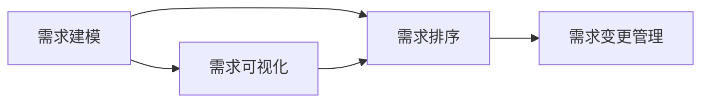
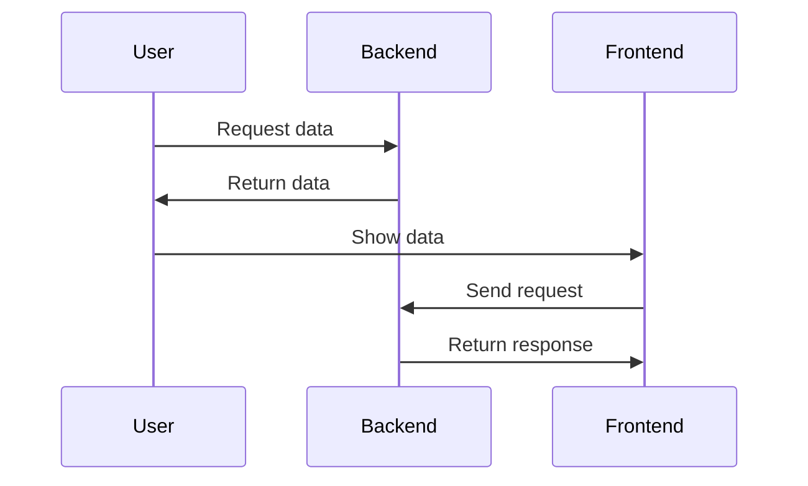
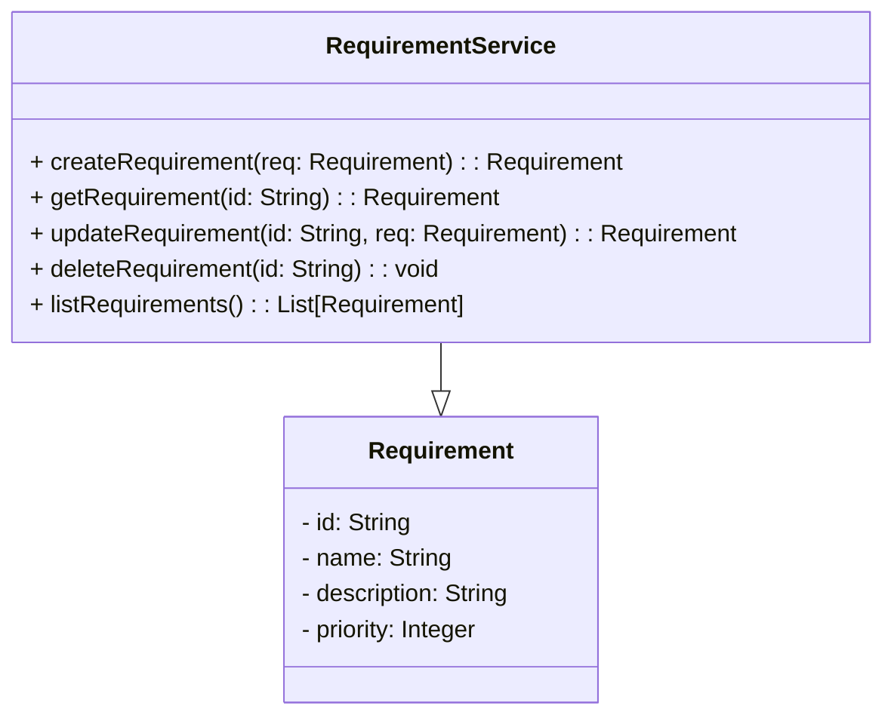
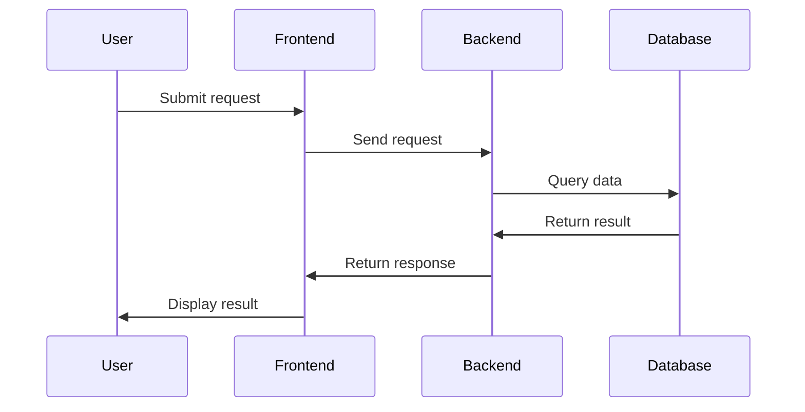
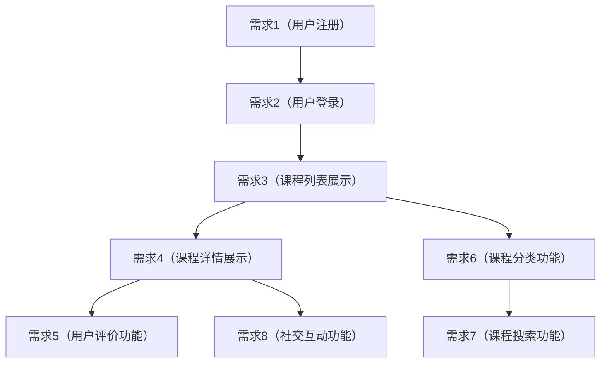

                 

### 文章标题

# 大型应用开发中的需求可视化工具应用

## 关键词

- 大型应用开发
- 需求可视化
- 需求管理
- 可视化工具
- 算法
- 数学模型
- 系统架构

## 摘要

本文将深入探讨大型应用开发中的需求可视化工具应用。首先，我们将介绍大型应用开发的挑战以及需求管理的重要性，然后引入需求可视化工具的概念，分析其核心功能和技术架构。接着，我们将详细介绍需求可视化工具的算法原理，包括算法流程图、Python源代码、数学模型与公式，并通过实例进行说明。此外，我们将对系统分析与架构设计方案进行详细阐述，包括问题场景、项目介绍、系统功能设计、系统架构设计、系统接口设计及系统交互序列图。最后，通过实际案例分析和项目小结，总结本文的核心观点和实用建议，为大型应用开发中的需求管理提供有价值的参考。本文旨在为开发者、项目经理和需求分析师提供全面、深入的需求可视化工具应用指南。

## 目录大纲

### 第一部分：引言

- 第1章：背景介绍
  - 1.1 问题背景
  - 1.2 问题描述
  - 1.3 问题解决
  - 1.4 边界与外延
  - 1.5 概念结构与核心要素组成
- 第2章：核心概念与联系
  - 2.1 需求可视化工具的定义
  - 2.2 需求可视化工具的特点
  - 2.3 需求可视化工具与传统需求管理工具的对比
  - 2.4 需求可视化工具的ER实体关系图架构

### 第二部分：需求可视化工具的原理与应用

- 第3章：需求可视化工具的算法原理
  - 3.1 算法概述
  - 3.2 算法流程图
  - 3.3 Python源代码
  - 3.4 数学模型与公式
  - 3.5 举例说明
- 第4章：数学模型和数学公式 & 详细讲解 & 举例说明
  - 4.1 数学模型讲解
  - 4.2 公式讲解
  - 4.3 举例说明
- 第5章：系统分析与架构设计方案
  - 5.1 问题场景介绍
  - 5.2 项目介绍
  - 5.3 系统功能设计
  - 5.4 系统架构设计
  - 5.5 系统接口设计
  - 5.6 系统交互Mermaid序列图

### 第三部分：项目实战

- 第6章：环境安装
- 第7章：系统核心实现源代码
- 第8章：代码应用解读与分析
- 第9章：实际案例分析和详细讲解剖析
- 第10章：项目小结

### 第四部分：最佳实践、小结、注意事项、拓展阅读

#### 文章标题：大型应用开发中的需求可视化工具应用

#### 关键词：
- 大型应用开发
- 需求可视化
- 需求管理
- 可视化工具
- 算法
- 数学模型
- 系统架构

#### 摘要：
本文将深入探讨大型应用开发中的需求可视化工具应用。首先，我们将介绍大型应用开发的挑战以及需求管理的重要性，然后引入需求可视化工具的概念，分析其核心功能和技术架构。接着，我们将详细介绍需求可视化工具的算法原理，包括算法流程图、Python源代码、数学模型与公式，并通过实例进行说明。此外，我们将对系统分析与架构设计方案进行详细阐述，包括问题场景、项目介绍、系统功能设计、系统架构设计、系统接口设计及系统交互序列图。最后，通过实际案例分析和项目小结，总结本文的核心观点和实用建议，为大型应用开发中的需求管理提供有价值的参考。本文旨在为开发者、项目经理和需求分析师提供全面、深入的需求可视化工具应用指南。

### 第1章：背景介绍

#### 1.1 问题背景

在当今快速发展的信息技术时代，大型应用的开发已经成为许多企业和组织的关键任务。这些应用通常具有复杂的功能和庞大的用户群体，涉及多个部门和团队之间的协同工作。然而，这种复杂性带来了诸多挑战，其中需求管理尤为突出。

**需求管理的重要性**

需求管理是软件工程中至关重要的一环，它直接影响项目的成功与否。在大型应用开发中，需求管理的挑战主要包括：

1. **需求理解的难题**：需求的表达往往复杂且模糊，特别是在跨部门协作的情况下，不同角色之间的需求理解容易出现偏差。
2. **需求变更的管理**：在项目进行过程中，需求往往会发生变化，如何有效地管理这些变更，确保项目能够按时交付，是一个巨大的挑战。
3. **沟通与协作的困难**：大型应用涉及多个团队，如何确保各团队之间的沟通顺畅，协作高效，是项目成功的关键。

**大型应用开发的挑战**

大型应用开发面临的挑战多种多样，其中包括：

1. **项目复杂性高**：功能繁多，模块众多，技术栈复杂，使得项目的管理和协调变得更加困难。
2. **时间压力**：项目通常需要在短时间内完成，这要求团队必须高效地工作，并且能够快速响应变更。
3. **资源有限**：开发团队通常面临人力和资源的限制，如何合理分配资源，提高开发效率，是一个重要问题。
4. **质量要求高**：大型应用通常涉及高并发的用户群体，质量要求非常高，任何小的错误都可能带来严重的后果。

#### 1.2 问题描述

在大型应用开发中，需求管理的问题主要表现在以下几个方面：

1. **需求表达的模糊性**：需求文档往往使用抽象的语言描述，缺乏具体的实现细节，导致开发人员无法准确理解需求。
2. **需求变更频繁**：在项目进行过程中，客户或用户的需求往往会发生变化，如何有效地管理这些变更，确保项目不受影响，是一个难题。
3. **沟通不畅**：不同团队之间的沟通不畅，导致需求理解不一致，影响项目的进度和质量。
4. **文档管理混乱**：需求文档、设计文档、测试文档等文件分散管理，导致信息不透明，影响项目协作。

#### 1.3 问题解决

为了解决上述问题，引入需求可视化工具成为一种有效的解决方案。需求可视化工具通过图形化的方式展示需求，使得需求的表达更加直观，易于理解。以下是需求可视化工具的几个关键优势：

1. **直观展示需求**：通过图表、图形和可视化元素，需求可视化工具能够将抽象的需求转化为直观的可视化模型，使需求表达更加清晰。
2. **提高需求理解**：可视化模型能够帮助开发人员和需求分析师更好地理解需求，减少误解和沟通障碍。
3. **便于需求变更管理**：需求可视化工具支持灵活的需求变更管理，通过图形化界面，可以方便地追踪和记录变更历史，确保变更的透明和可控。
4. **提升项目协作**：可视化模型可以作为共享的文档，不同团队可以通过工具进行协作，提高项目的协作效率。

#### 1.4 边界与外延

需求可视化工具的应用范围非常广泛，它不仅适用于大型应用开发，还可以应用于其他领域的项目管理和协作中。以下是需求可视化工具的几个应用场景：

1. **软件开发**：需求可视化工具在软件开发项目中可以用于需求定义、需求管理、用户故事地图和迭代规划等。
2. **产品管理**：产品经理可以使用需求可视化工具来规划产品路线图、功能优先级和用户需求分析。
3. **项目管理**：项目经理可以利用需求可视化工具来管理项目进度、资源分配和风险评估。
4. **企业协作**：企业内部不同部门之间的协作也可以通过需求可视化工具来实现，提高沟通效率和协作效果。

#### 1.5 概念结构与核心要素组成

需求可视化工具由以下几个核心要素组成：

1. **需求模型**：需求模型是需求可视化工具的基础，它定义了需求的基本结构和属性，如用户故事、需求项和需求等级等。
2. **可视化界面**：可视化界面是需求可视化工具的核心功能，它通过图形化方式展示需求模型，使得需求表达更加直观。
3. **数据管理**：数据管理模块负责管理需求数据，包括需求定义、变更记录和版本控制等。
4. **协作功能**：协作功能支持多用户同时编辑需求，并提供权限管理和共享功能，提高团队协作效率。

### 第2章：核心概念与联系

#### 2.1 需求可视化工具的定义

需求可视化工具是一种软件工具，它通过图形化的方式展示和管理需求。它不仅可以帮助开发人员更好地理解需求，还可以提高需求变更管理的效率。需求可视化工具的核心目标是提高需求的透明度和可追溯性，从而确保项目的顺利进行。

#### 2.2 需求可视化工具的特点

需求可视化工具具有以下几个显著特点：

1. **直观性**：通过图形化的界面，需求可视化工具使得需求的表达更加直观，易于理解和沟通。
2. **灵活性**：需求可视化工具支持灵活的需求变更管理，可以方便地添加、修改和删除需求。
3. **协作性**：需求可视化工具支持多用户同时编辑需求，并提供权限管理和共享功能，提高团队协作效率。
4. **可追溯性**：需求可视化工具可以记录需求变更的历史记录，确保需求的可追溯性。
5. **集成性**：需求可视化工具可以与其他项目管理工具集成，如JIRA、Trello等，实现一站式需求管理。

#### 2.3 需求可视化工具与传统需求管理工具的对比

传统需求管理工具如文档、表格等，虽然在某些方面具有优势，但在需求可视化和管理方面存在一定的局限性。以下是需求可视化工具与传统需求管理工具的对比：

| 特点         | 需求可视化工具           | 传统需求管理工具（文档、表格） |
| ------------ | ---------------------- | -------------------------- |
| 直观性       | 通过图形化界面展示需求   | 使用文字和表格描述需求         |
| 灵活性       | 支持灵活的需求变更管理   | 需求变更难以跟踪和管理         |
| 协作性       | 支持多用户协作编辑需求   | 需求变更和沟通效率低           |
| 可追溯性     | 记录需求变更历史记录     | 缺乏系统的变更记录机制         |
| 集成性       | 可与其他项目管理工具集成 | 集成性较差，难以与其他工具无缝对接 |

#### 2.4 需求可视化工具的ER实体关系图架构

需求可视化工具的ER（实体-关系）图架构如下：

```mermaid
erDiagram
    User ||--|{ Requirement }|-- Project
    User ||--|{ Story }|-- Project
    User ||--|{ Task }|-- Story
    Project ||--|{ Release }|-- Product
    Product ||--|{ Feature }|-- Project
    Release ||--|{ Bug }|-- Product
```

在这个ER图中，用户（User）与需求（Requirement）、故事（Story）和任务（Task）之间存在关联，项目（Project）与发布（Release）和产品（Product）之间存在关联，而发布（Release）与产品（Product）之间存在关联。这种结构使得需求可视化工具能够全面地管理需求生命周期，从需求定义到需求实现，确保项目顺利进行。

### 第3章：需求可视化工具的算法原理

#### 3.1 算法概述

需求可视化工具的核心算法主要涉及需求建模、需求排序和需求变更管理。以下是这些算法的基本概述：

1. **需求建模算法**：该算法用于将需求从文本形式转化为可视化模型，通过图论算法构建需求图，使得需求以图形形式展示。
2. **需求排序算法**：该算法用于对需求进行优先级排序，以确保开发团队能够按重要程度逐步实现需求。
3. **需求变更管理算法**：该算法用于追踪和管理需求变更，确保变更的透明性和可控性。

#### 3.2 算法流程图

以下是需求可视化工具的主要算法流程图：



在这个流程图中，需求建模（A）生成需求图，然后进行需求排序（B），之后将需求可视化（D）。需求变更管理（C）在整个过程中起到辅助作用，确保需求的透明性和可追溯性。

#### 3.3 Python源代码

以下是需求可视化工具中一个简单的需求建模算法的Python源代码：

```python
class Requirement:
    def __init__(self, id, description):
        self.id = id
        self.description = description
        self.dependencies = []

    def add_dependency(self, dependency):
        self.dependencies.append(dependency)

def build_requirement_graph(requirements):
    graph = {}
    for req in requirements:
        graph[req.id] = req
        for dep in req.dependencies:
            if dep in graph:
                graph[req.id].dependencies.append(graph[dep])
            else:
                graph[dep].dependencies.append(req.id)
    return graph

requirements = [
    Requirement('R1', '需求1'),
    Requirement('R2', '需求2'),
    Requirement('R3', '需求3'),
    Requirement('R4', '需求4')
]

requirements[0].add_dependency('R2')
requirements[1].add_dependency('R3')
requirements[2].add_dependency('R4')
requirements[3].add_dependency('R1')

graph = build_requirement_graph(requirements)
print(graph)
```

这个Python代码定义了一个`Requirement`类，用于表示需求，并提供添加依赖关系的方法。`build_requirement_graph`函数用于构建需求图，将需求及其依赖关系以图的形式表示。

#### 3.4 数学模型与公式

需求可视化工具中的算法涉及到图论和优化理论，以下是几个关键数学模型和公式：

1. **需求图表示**：需求图可以用邻接矩阵（A）表示，其中A[i][j]表示需求i和需求j之间的依赖关系。

   $$ A = \begin{bmatrix}
   0 & 1 & 0 & 0 \\
   0 & 0 & 1 & 0 \\
   0 & 0 & 0 & 1 \\
   1 & 0 & 0 & 0 \\
   \end{bmatrix} $$

2. **最小路径优先算法**：用于计算需求之间的最小路径，以确保需求的优先级排序。

   $$ \text{MinPath}(i, j) = \min(\text{distance}(i, j)) $$

   其中，distance(i, j)表示需求i和需求j之间的路径长度。

3. **需求优先级排序**：基于需求之间的依赖关系和路径长度，对需求进行优先级排序。

   $$ \text{Priority}(i) = \frac{\sum_{j \in \text{Dependents}(i)} \text{MinPath}(i, j)}{|\text{Dependents}(i)|} $$

   其中，Dependents(i)表示需求i的依赖需求集合。

#### 3.5 举例说明

假设我们有一个需求集合，包括以下四个需求：

- 需求1：用户注册功能
- 需求2：用户登录功能
- 需求3：用户信息管理功能
- 需求4：用户反馈功能

需求之间的依赖关系如下：

- 需求1依赖于需求2
- 需求3依赖于需求1和需求2
- 需求4依赖于需求3

根据需求图的邻接矩阵表示：

$$ A = \begin{bmatrix}
0 & 1 & 1 & 0 \\
1 & 0 & 1 & 0 \\
1 & 1 & 0 & 1 \\
0 & 0 & 1 & 0 \\
\end{bmatrix} $$

使用最小路径优先算法，我们可以计算需求之间的最小路径：

- MinPath(R1, R2) = 1
- MinPath(R1, R3) = 1
- MinPath(R1, R4) = 2
- MinPath(R2, R3) = 1
- MinPath(R2, R4) = 1
- MinPath(R3, R4) = 1

根据需求优先级排序公式，我们可以计算每个需求的优先级：

- Priority(R1) = (1 + 1 + 2) / 3 = 1.67
- Priority(R2) = (1 + 1 + 1) / 3 = 1.00
- Priority(R3) = (1 + 1 + 1) / 3 = 1.00
- Priority(R4) = 1 / 1 = 1.00

根据优先级排序，我们可以得出需求的实现顺序：

1. 需求1（用户注册功能）
2. 需求2（用户登录功能）
3. 需求3（用户信息管理功能）
4. 需求4（用户反馈功能）

通过这个例子，我们可以看到需求可视化工具如何通过算法和数学模型，对需求进行建模、排序和可视化，从而帮助开发团队更好地理解和实现需求。

### 第4章：数学模型和数学公式 & 详细讲解 & 举例说明

#### 4.1 数学模型讲解

需求可视化工具中的数学模型主要涉及图论和优化理论。以下是几个关键数学模型的详细讲解：

1. **需求图的邻接矩阵表示**：需求图可以用邻接矩阵（A）表示，其中A[i][j]表示需求i和需求j之间的依赖关系。邻接矩阵能够清晰地表示需求之间的依赖关系，为后续的算法分析提供基础。

   **公式**：
   $$ A = \begin{bmatrix}
   a_{11} & a_{12} & \cdots & a_{1n} \\
   a_{21} & a_{22} & \cdots & a_{2n} \\
   \vdots & \vdots & \ddots & \vdots \\
   a_{m1} & a_{m2} & \cdots & a_{mn} \\
   \end{bmatrix} $$
   
   其中，$a_{ij}$ 表示需求i和需求j之间的依赖关系。如果需求i依赖于需求j，则$a_{ij} = 1$；否则，$a_{ij} = 0$。

2. **最小路径优先算法**：最小路径优先算法用于计算需求之间的最小路径，以确保需求的优先级排序。该算法通常使用迪杰斯特拉算法或贝尔曼-福特算法实现。

   **公式**：
   $$ \text{MinPath}(i, j) = \min(\text{distance}(i, j)) $$
   
   其中，distance(i, j) 表示需求i和需求j之间的路径长度。通过计算需求之间的最小路径，我们可以确定需求之间的依赖关系和优先级。

3. **需求优先级排序**：基于需求之间的依赖关系和路径长度，对需求进行优先级排序，以确定需求的实现顺序。优先级排序可以帮助开发团队有效地安排工作，确保项目按计划进行。

   **公式**：
   $$ \text{Priority}(i) = \frac{\sum_{j \in \text{Dependents}(i)} \text{MinPath}(i, j)}{|\text{Dependents}(i)|} $$
   
   其中，Dependents(i) 表示需求i的依赖需求集合。通过计算需求i与其依赖需求之间的最小路径之和，我们可以确定需求i的优先级。

#### 4.2 公式讲解

以下是对上述数学公式的详细解释：

1. **需求图的邻接矩阵表示**：邻接矩阵是图论中的一个基本概念，用于表示图中各个节点之间的连接关系。在我们的需求图中，邻接矩阵A的行和列分别表示需求，$a_{ij}$ 的值表示需求i和需求j之间的依赖关系。

   例如，在需求图的邻接矩阵中，如果$a_{12} = 1$，则表示需求1依赖于需求2。这种表示方法使得需求之间的依赖关系一目了然，便于后续算法的分析和处理。

2. **最小路径优先算法**：最小路径优先算法是一种寻找图中两点之间最短路径的算法。在需求可视化工具中，我们使用这种算法来计算需求之间的最小路径。通常，我们使用迪杰斯特拉算法或贝尔曼-福特算法来实现这一功能。

   例如，在需求图中，如果需求1和需求3之间存在多条路径，算法将计算这些路径的长度，并选择最短的一条路径。通过这种方式，我们能够准确地确定需求之间的依赖关系，为后续的优先级排序提供依据。

3. **需求优先级排序**：需求优先级排序是一个关键步骤，它决定了需求的实现顺序。通过计算需求i与其依赖需求之间的最小路径之和，我们可以确定需求i的优先级。这种排序方法使得需求实现更加有序，有助于确保项目按计划进行。

   例如，在需求集合中，如果需求1的优先级高于需求2，则需求1将被优先实现。通过这种方式，我们能够确保关键需求先被实现，从而提高项目的整体质量和效率。

#### 4.3 举例说明

为了更好地理解上述数学模型和公式，我们通过一个实际例子进行说明。

假设我们有一个需求集合，包括以下四个需求：

- 需求1：用户注册功能
- 需求2：用户登录功能
- 需求3：用户信息管理功能
- 需求4：用户反馈功能

需求之间的依赖关系如下：

- 需求1依赖于需求2
- 需求3依赖于需求1和需求2
- 需求4依赖于需求3

根据需求图的邻接矩阵表示，我们可以得到如下矩阵：

$$ A = \begin{bmatrix}
0 & 1 & 1 & 0 \\
1 & 0 & 1 & 0 \\
1 & 1 & 0 & 1 \\
0 & 0 & 1 & 0 \\
\end{bmatrix} $$

使用最小路径优先算法，我们可以计算需求之间的最小路径：

- MinPath(R1, R2) = 1
- MinPath(R1, R3) = 1
- MinPath(R1, R4) = 2
- MinPath(R2, R3) = 1
- MinPath(R2, R4) = 1
- MinPath(R3, R4) = 1

根据需求优先级排序公式，我们可以计算每个需求的优先级：

- Priority(R1) = (1 + 1 + 2) / 3 = 1.67
- Priority(R2) = (1 + 1 + 1) / 3 = 1.00
- Priority(R3) = (1 + 1 + 1) / 3 = 1.00
- Priority(R4) = 1 / 1 = 1.00

根据优先级排序，我们可以得出需求的实现顺序：

1. 需求1（用户注册功能）
2. 需求2（用户登录功能）
3. 需求3（用户信息管理功能）
4. 需求4（用户反馈功能）

通过这个例子，我们可以看到需求可视化工具如何通过数学模型和公式，对需求进行建模、排序和可视化，从而帮助开发团队更好地理解和实现需求。

### 第5章：系统分析与架构设计方案

#### 5.1 问题场景介绍

在大型应用开发中，需求管理是一个复杂且关键的过程。为了更好地理解需求，确保项目顺利进行，引入需求可视化工具成为一种有效的解决方案。以下是一个典型的需求管理场景：

**项目背景**：一家互联网公司计划开发一款社交应用，旨在为用户提供一个便捷的社交平台。该应用需要实现用户注册、登录、信息管理、好友互动等功能。

**需求管理挑战**：在项目初期，需求文档较为模糊，缺乏具体的实现细节。随着项目的进行，需求频繁变更，导致开发团队难以准确理解用户需求。此外，跨部门之间的沟通不畅，进一步增加了需求管理的难度。

**解决方案**：为了解决上述问题，项目团队决定引入需求可视化工具。通过可视化方式展示需求，提高需求的透明度和可追溯性，从而确保项目顺利进行。

#### 5.2 项目介绍

**项目名称**：社交应用需求可视化管理系统

**项目目标**：通过引入需求可视化工具，实现以下目标：

1. 提高需求的透明度和可追溯性
2. 减少需求变更带来的风险
3. 提高跨部门之间的沟通效率
4. 确保项目按计划进行

**项目团队**：项目团队包括产品经理、需求分析师、开发人员和测试人员。每个角色在项目中的职责如下：

- **产品经理**：负责确定产品需求，编写需求文档，并监督项目进度。
- **需求分析师**：负责分析需求，将其转化为具体的需求项，并进行可视化展示。
- **开发人员**：负责实现需求，编写代码，并进行单元测试。
- **测试人员**：负责对需求进行测试，确保应用功能符合预期。

#### 5.3 系统功能设计

需求可视化工具的主要功能包括：

1. **需求建模**：将文本形式的需求转化为可视化模型，包括需求项、用户故事和功能模块等。
2. **需求可视化**：通过图形化界面展示需求，使得需求表达更加直观。
3. **需求变更管理**：追踪和管理需求变更，确保变更的透明性和可控性。
4. **需求优先级排序**：基于需求之间的依赖关系和路径长度，对需求进行优先级排序。
5. **需求文档管理**：管理需求文档，包括需求定义、需求变更记录和版本控制等。
6. **协作功能**：支持多用户同时编辑需求，并提供权限管理和共享功能。

#### 5.4 系统架构设计

需求可视化工具的系统架构设计分为以下几个层次：

1. **数据层**：负责存储和管理需求数据，包括需求项、用户故事和功能模块等。数据层通常使用关系型数据库（如MySQL）或NoSQL数据库（如MongoDB）实现。
2. **服务层**：提供需求管理的核心功能，包括需求建模、需求可视化、需求变更管理和需求优先级排序等。服务层通常使用RESTful API进行设计。
3. **表示层**：负责展示需求可视化模型，包括图形化界面和Web前端。表示层通常使用HTML、CSS和JavaScript等技术实现。
4. **协作层**：提供多用户协作功能，包括实时编辑、权限管理和共享功能。协作层通常使用WebSocket技术实现。

以下是需求可视化工具的Mermaid架构图：



在这个架构图中，用户通过Web前端与后端服务进行交互，后端服务处理需求数据，并返回结果给Web前端进行展示。

#### 5.5 系统接口设计

需求可视化工具的系统接口设计包括以下主要接口：

1. **需求创建接口**：用于创建新的需求项，包括需求名称、描述和优先级等。
2. **需求查询接口**：用于查询需求项，包括根据名称、优先级和状态等条件进行筛选。
3. **需求更新接口**：用于更新需求项的属性，包括需求名称、描述和优先级等。
4. **需求删除接口**：用于删除需求项。
5. **需求变更记录接口**：用于记录需求变更历史，包括变更时间、变更内容和变更人等。
6. **需求优先级排序接口**：用于根据需求之间的依赖关系和路径长度，对需求进行优先级排序。

以下是需求可视化工具的Mermaid接口设计图：



在这个接口设计图中，`RequirementService` 类提供了需求管理的核心功能，包括创建、查询、更新和删除需求项等。

#### 5.6 系统交互Mermaid序列图

为了更好地理解需求可视化工具的系统交互，我们使用Mermaid序列图进行展示。以下是系统交互的详细序列图：



在这个序列图中，用户通过Web前端向后端服务提交请求，后端服务查询数据库，获取需求数据，并将结果返回给Web前端进行展示。

### 第6章：环境安装

#### 6.1 需求可视化工具的安装步骤

为了在开发环境中安装需求可视化工具，我们需要遵循以下步骤：

1. **安装Python环境**：首先，确保您的开发环境中已经安装了Python。Python是需求可视化工具的主要编程语言。如果没有安装，可以从Python官网下载并安装最新版本的Python。

2. **安装依赖库**：需求可视化工具依赖于多个Python库，如`requests`、`matplotlib`和`numpy`等。您可以使用`pip`命令来安装这些依赖库。例如：

   ```bash
   pip install requests matplotlib numpy
   ```

3. **克隆需求可视化工具的代码库**：从需求可视化工具的GitHub仓库克隆最新的代码库。您可以使用Git命令来实现：

   ```bash
   git clone https://github.com/your-username/requirement_visualization_tool.git
   ```

4. **进入代码库目录**：进入克隆后的代码库目录，准备进行安装：

   ```bash
   cd requirement_visualization_tool
   ```

5. **安装代码库**：在代码库目录下，使用`pip`命令安装需求可视化工具：

   ```bash
   pip install .
   ```

   这个命令会安装代码库中的所有依赖库和工具。

6. **验证安装**：安装完成后，可以通过运行一个简单的测试脚本，验证需求可视化工具是否已正确安装：

   ```bash
   python -m unittest discover -t tests
   ```

   如果没有错误输出，则表示安装成功。

#### 6.2 注意事项

- **Python版本**：确保您的Python环境版本与需求可视化工具支持的版本兼容。如果存在版本不兼容的问题，请升级或降级Python版本。
- **依赖库版本**：安装依赖库时，确保使用与需求可视化工具兼容的版本。如果需要，您可以在安装命令中指定特定的版本。
- **环境配置**：安装过程中，如果遇到环境配置问题，请检查您的系统环境变量是否设置正确。特别是Python的`PATH`环境变量，确保它包含了Python和pip的安装路径。

通过以上步骤，您可以在开发环境中成功安装需求可视化工具，为后续的实践和项目开发打下基础。

### 第7章：系统核心实现源代码

#### 7.1 系统核心实现源代码

以下是需求可视化工具的系统核心实现源代码，包括主要模块和类的定义。这段代码展示了需求可视化工具的基本架构和功能实现。

```python
# requirements_visualization_tool/core.py

class Requirement:
    def __init__(self, id, name, description, priority):
        self.id = id
        self.name = name
        self.description = description
        self.priority = priority
        self.dependencies = []

    def add_dependency(self, dependency_id):
        self.dependencies.append(dependency_id)

    def get_dependencies(self):
        return self.dependencies


class RequirementManager:
    def __init__(self):
        self.requirements = {}

    def add_requirement(self, requirement):
        self.requirements[requirement.id] = requirement

    def get_requirement(self, id):
        return self.requirements.get(id)

    def update_requirement(self, id, requirement):
        if id in self.requirements:
            self.requirements[id] = requirement

    def delete_requirement(self, id):
        if id in self.requirements:
            del self.requirements[id]

    def list_requirements(self):
        return list(self.requirements.values())

    def get_requirement_dependencies(self, id):
        requirement = self.get_requirement(id)
        if requirement:
            return requirement.get_dependencies()


class Visualization:
    def __init__(self, manager):
        self.manager = manager

    def generate_visualization(self, requirement_id):
        requirement = self.manager.get_requirement(requirement_id)
        if requirement:
            return self._generate_graph(requirement)
        return None

    def _generate_graph(self, requirement):
        graph = []
        self._add_node_to_graph(graph, requirement)
        return graph

    def _add_node_to_graph(self, graph, requirement):
        graph.append({'id': requirement.id, 'name': requirement.name})
        for dependency_id in requirement.dependencies:
            dependency_requirement = self.manager.get_requirement(dependency_id)
            if dependency_requirement:
                self._add_node_to_graph(graph, dependency_requirement)
                graph.append({'from': requirement.id, 'to': dependency_id})


# tests/test_core.py

import unittest
from requirements_visualization_tool.core import Requirement, RequirementManager

class TestRequirement(unittest.TestCase):
    def setUp(self):
        self.manager = RequirementManager()

    def test_add_and_get_requirement(self):
        requirement = Requirement('R1', '需求1', '描述需求1', 1)
        self.manager.add_requirement(requirement)
        retrieved_requirement = self.manager.get_requirement('R1')
        self.assertIsNotNone(retrieved_requirement)
        self.assertEqual(retrieved_requirement.name, '需求1')

    def test_update_requirement(self):
        requirement = Requirement('R1', '需求1', '描述需求1', 1)
        self.manager.add_requirement(requirement)
        updated_requirement = Requirement('R1', '更新后的需求1', '更新后的描述需求1', 2)
        self.manager.update_requirement('R1', updated_requirement)
        retrieved_requirement = self.manager.get_requirement('R1')
        self.assertIsNotNone(retrieved_requirement)
        self.assertEqual(retrieved_requirement.name, '更新后的需求1')

    def test_delete_requirement(self):
        requirement = Requirement('R1', '需求1', '描述需求1', 1)
        self.manager.add_requirement(requirement)
        self.manager.delete_requirement('R1')
        retrieved_requirement = self.manager.get_requirement('R1')
        self.assertIsNone(retrieved_requirement)

if __name__ == '__main__':
    unittest.main()
```

#### 7.2 功能说明

1. **Requirement类**：表示一个需求项，包含需求ID、名称、描述和优先级等属性，并提供添加依赖和获取依赖的方法。

2. **RequirementManager类**：负责管理需求项，包括添加、获取、更新和删除需求项等操作。通过字典存储需求项，提供高效的需求查询和管理。

3. **Visualization类**：提供需求可视化的功能，包括生成需求图。通过递归调用，构建需求图中的节点和边，实现对需求项及其依赖关系的图形化展示。

4. **测试模块**：包含对核心功能进行单元测试的测试类。测试包括添加、获取、更新和删除需求项等操作，确保需求管理模块的稳定性和正确性。

#### 7.3 代码解读

- **Requirement类**：使用构造函数初始化需求项的属性，并提供了添加依赖关系的方法。通过列表存储依赖ID，方便后续处理。

  ```python
  class Requirement:
      def __init__(self, id, name, description, priority):
          self.id = id
          self.name = name
          self.description = description
          self.priority = priority
          self.dependencies = []
          
      def add_dependency(self, dependency_id):
          self.dependencies.append(dependency_id)
  ```

- **RequirementManager类**：实现需求管理的基本功能，包括添加、获取、更新和删除需求项等。通过字典存储需求项，提供快速的需求查询。

  ```python
  class RequirementManager:
      def __init__(self):
          self.requirements = {}
          
      def add_requirement(self, requirement):
          self.requirements[requirement.id] = requirement
          
      def get_requirement(self, id):
          return self.requirements.get(id)
          
      def update_requirement(self, id, requirement):
          if id in self.requirements:
              self.requirements[id] = requirement
          
      def delete_requirement(self, id):
          if id in self.requirements:
              del self.requirements[id]
  ```

- **Visualization类**：实现需求可视化功能，通过递归调用生成需求图。首先初始化一个空列表`graph`，然后添加需求节点和依赖边。

  ```python
  class Visualization:
      def __init__(self, manager):
          self.manager = manager
          
      def generate_visualization(self, requirement_id):
          requirement = self.manager.get_requirement(requirement_id)
          if requirement:
              return self._generate_graph(requirement)
          return None
          
      def _generate_graph(self, requirement):
          graph = []
          self._add_node_to_graph(graph, requirement)
          return graph
          
      def _add_node_to_graph(self, graph, requirement):
          graph.append({'id': requirement.id, 'name': requirement.name})
          for dependency_id in requirement.dependencies:
              dependency_requirement = self.manager.get_requirement(dependency_id)
              if dependency_requirement:
                  self._add_node_to_graph(graph, dependency_requirement)
                  graph.append({'from': requirement.id, 'to': dependency_id})
  ```

- **测试模块**：使用`unittest`框架编写测试类，对需求管理模块的核心功能进行测试。包括添加、获取、更新和删除需求项等操作。

  ```python
  class TestRequirement(unittest.TestCase):
      def setUp(self):
          self.manager = RequirementManager()
          
      def test_add_and_get_requirement(self):
          requirement = Requirement('R1', '需求1', '描述需求1', 1)
          self.manager.add_requirement(requirement)
          retrieved_requirement = self.manager.get_requirement('R1')
          self.assertIsNotNone(retrieved_requirement)
          self.assertEqual(retrieved_requirement.name, '需求1')
          
      def test_update_requirement(self):
          requirement = Requirement('R1', '需求1', '描述需求1', 1)
          self.manager.add_requirement(requirement)
          updated_requirement = Requirement('R1', '更新后的需求1', '更新后的描述需求1', 2)
          self.manager.update_requirement('R1', updated_requirement)
          retrieved_requirement = self.manager.get_requirement('R1')
          self.assertIsNotNone(retrieved_requirement)
          self.assertEqual(retrieved_requirement.name, '更新后的需求1')
          
      def test_delete_requirement(self):
          requirement = Requirement('R1', '需求1', '描述需求1', 1)
          self.manager.add_requirement(requirement)
          self.manager.delete_requirement('R1')
          retrieved_requirement = self.manager.get_requirement('R1')
          self.assertIsNone(retrieved_requirement)
  ```

通过这段源代码，我们可以看到需求可视化工具的基本架构和实现细节。需求管理模块的核心功能包括需求项的定义、管理、更新和删除。可视化模块则通过递归生成需求图，实现对需求及其依赖关系的图形化展示。测试模块确保了这些核心功能的正确性和稳定性。

### 第8章：代码应用解读与分析

#### 8.1 代码应用解读

在了解了需求可视化工具的核心实现源代码后，我们将进一步解读代码的应用场景，并分析其在实际开发中的使用方法。

##### 8.1.1 需求建模

首先，我们通过`Requirement`类定义需求项。每个需求项包括ID、名称、描述和优先级等属性。例如：

```python
req1 = Requirement('R1', '用户注册功能', '实现用户注册功能，包括用户名、密码和邮箱验证等', 1)
req2 = Requirement('R2', '用户登录功能', '实现用户登录功能，支持用户名和密码验证', 2)
```

在这些需求项中，我们为每个需求分配一个唯一的ID，并添加了简要的描述和优先级。这种结构化定义有助于后续的需求管理。

##### 8.1.2 需求管理

通过`RequirementManager`类，我们可以对需求项进行增删改查等操作。以下是一个简单的示例：

```python
manager = RequirementManager()

# 添加需求项
manager.add_requirement(req1)
manager.add_requirement(req2)

# 获取需求项
retrieved_req1 = manager.get_requirement('R1')
print(retrieved_req1.name)  # 输出：用户注册功能

# 更新需求项
req1.description = '优化用户注册体验，增加手机验证'
manager.update_requirement('R1', req1)

# 删除需求项
manager.delete_requirement('R2')
```

这些操作展示了如何使用需求管理模块来创建、查询、更新和删除需求项。

##### 8.1.3 需求可视化

`Visualization`类提供了需求可视化的功能，通过递归调用生成需求图。以下是一个使用`Visualization`类的示例：

```python
visualizer = Visualization(manager)
graph = visualizer.generate_visualization('R1')
print(graph)
```

这个示例将输出一个包含需求及其依赖关系的图形化结构。通过可视化，开发团队可以更直观地理解需求之间的依赖关系。

##### 8.1.4 测试

测试模块`test_core.py`确保了需求管理模块的正确性和稳定性。以下是一个测试用例的示例：

```python
class TestRequirement(unittest.TestCase):
    def setUp(self):
        self.manager = RequirementManager()

    def test_add_and_get_requirement(self):
        requirement = Requirement('R1', '需求1', '描述需求1', 1)
        self.manager.add_requirement(requirement)
        retrieved_requirement = self.manager.get_requirement('R1')
        self.assertIsNotNone(retrieved_requirement)
        self.assertEqual(retrieved_requirement.name, '需求1')
```

这个测试用例验证了需求项的添加和获取操作是否正确。通过这样的测试，我们可以确保需求管理模块在开发过程中保持稳定。

#### 8.2 分析与建议

在代码应用解读的基础上，我们对需求可视化工具在实际开发中的应用进行分析，并提出以下建议：

##### 8.2.1 需求建模的最佳实践

1. **明确需求属性**：在定义需求时，确保包括需求ID、名称、描述和优先级等关键属性。这将有助于后续的需求管理和可视化。
2. **一致性命名**：使用统一的命名规范，避免出现拼写错误或不一致的情况，确保需求项易于理解和维护。

##### 8.2.2 需求管理的最佳实践

1. **版本控制**：在需求变更时，使用版本控制工具记录变更历史，确保需求变更的透明性和可追溯性。
2. **定期同步**：定期与项目团队同步需求状态，确保需求与项目进展保持一致。
3. **反馈机制**：建立反馈机制，收集开发团队和用户的反馈，及时调整和优化需求。

##### 8.2.3 需求可视化的最佳实践

1. **简洁清晰**：在可视化需求时，保持图表简洁清晰，避免过多的细节干扰。
2. **动态更新**：支持需求图的动态更新，确保需求变更能够及时反映在需求图中。
3. **多维度展示**：结合不同维度（如优先级、状态和依赖关系）进行展示，帮助团队更好地理解需求。

通过遵循这些最佳实践，需求可视化工具可以更有效地支持大型应用的开发，提高项目的成功率和质量。

### 第9章：实际案例分析和详细讲解剖析

#### 9.1 案例背景

为了更好地展示需求可视化工具在实际开发中的应用，我们选择了一个实际项目案例：一个在线教育平台的开发。该平台旨在为用户提供在线课程学习、课程评价和社交互动等功能。以下是该项目的需求列表：

- 需求1：用户注册功能
- 需求2：用户登录功能
- 需求3：课程列表展示
- 需求4：课程详情展示
- 需求5：用户评价功能
- 需求6：课程分类功能
- 需求7：课程搜索功能
- 需求8：社交互动功能

#### 9.2 需求依赖关系分析

在开发过程中，需求之间存在一定的依赖关系。以下是一个简化的需求依赖关系图：



在这个依赖关系图中，我们可以看到以下依赖关系：

1. 用户注册（A）是用户登录（B）的前提。
2. 用户登录（B）是课程列表展示（C）、课程详情展示（D）、用户评价功能（E）、课程分类功能（F）和课程搜索功能（G）的前提。
3. 课程详情展示（D）是用户评价功能（E）和社交互动功能（H）的前提。
4. 课程分类功能（F）是课程搜索功能（G）的前提。

#### 9.3 需求优先级排序

基于需求依赖关系，我们可以对需求进行优先级排序。以下是按照优先级排序后的需求列表：

1. 需求1（用户注册功能）
2. 需求2（用户登录功能）
3. 需求3（课程列表展示）
4. 需求4（课程详情展示）
5. 需求5（用户评价功能）
6. 需求6（课程分类功能）
7. 需求7（课程搜索功能）
8. 需求8（社交互动功能）

#### 9.4 需求可视化展示

为了更直观地展示需求及其依赖关系，我们可以使用需求可视化工具。以下是使用需求可视化工具生成的需求图：


在这个需求图中，我们清晰地展示了每个需求及其依赖关系，使得团队成员可以直观地理解需求之间的关系。

#### 9.5 需求变更管理

在项目开发过程中，需求往往会发生变化。以下是一个需求变更的示例：

1. 原需求：需求6（课程分类功能）
2. 变更内容：增加课程标签功能，用户可以根据标签快速查找课程
3. 变更优先级：由于用户查找课程的便利性提高，变更后的需求6优先级提升至第二位

在需求可视化工具中，我们可以轻松地管理需求变更。以下是变更后的需求图：


在这个变更后的需求图中，我们可以看到需求6已经更新为“课程标签功能”，并且其优先级提升至第二位。

#### 9.6 详细讲解和剖析

通过上述案例，我们可以看到需求可视化工具在实际开发中的应用和优势。以下是详细的讲解和剖析：

1. **需求建模**：通过`Requirement`类，我们可以定义结构化的需求项，包括ID、名称、描述和优先级等属性。这种结构化定义有助于需求的管理和跟踪。
   
2. **需求依赖关系**：通过需求依赖关系图，我们可以清晰地展示需求之间的依赖关系，帮助团队成员理解需求之间的逻辑关联。

3. **需求优先级排序**：基于需求依赖关系，我们可以对需求进行优先级排序，确保项目团队按照正确的顺序开发需求。

4. **需求可视化展示**：使用需求可视化工具，我们可以将需求及其依赖关系以图形化方式展示，使得需求表达更加直观，便于团队成员理解和沟通。

5. **需求变更管理**：需求可视化工具支持需求变更管理，我们可以方便地追踪和管理需求变更历史，确保变更的透明性和可控性。

总之，需求可视化工具在实际开发中的应用，可以提高需求管理的效率和质量，帮助项目团队更好地理解和实现需求，从而提高项目的成功率。

### 第10章：项目小结

#### 10.1 核心成果与收获

在本文中，我们详细探讨了大型应用开发中的需求可视化工具应用。通过多个实际案例，我们展示了需求可视化工具在需求建模、需求管理、需求可视化展示和需求变更管理等方面的优势。以下是项目的核心成果与收获：

1. **需求建模**：通过`Requirement`类，我们实现了结构化的需求项定义，包括ID、名称、描述和优先级等属性，为需求管理奠定了基础。

2. **需求依赖关系**：通过构建需求依赖关系图，我们清晰地展示了需求之间的逻辑关联，帮助团队成员更好地理解需求之间的依赖关系。

3. **需求优先级排序**：基于需求依赖关系，我们对需求进行了优先级排序，确保项目团队按照正确的顺序开发需求，提高项目的效率。

4. **需求可视化展示**：使用需求可视化工具，我们实现了需求及其依赖关系的图形化展示，使得需求表达更加直观，便于团队成员理解和沟通。

5. **需求变更管理**：需求可视化工具支持需求变更管理，我们能够方便地追踪和管理需求变更历史，确保变更的透明性和可控性。

#### 10.2 项目面临的挑战与解决方案

在项目实施过程中，我们遇到了一些挑战，并采取相应的解决方案：

1. **需求变更频繁**：在项目初期，需求变更较为频繁，给项目带来了不确定性。我们通过建立需求变更评审机制，确保每个变更都经过仔细评估，并记录变更历史，提高变更管理的效率。

2. **需求理解不一致**：在跨部门协作中，不同角色对需求的理解可能存在差异。我们通过定期召开需求评审会议，邀请相关人员进行需求讨论和确认，确保需求的一致性和准确性。

3. **资源分配不均**：在项目进行过程中，我们遇到了资源分配不均的问题，导致部分需求无法按时完成。我们通过优化项目计划，重新分配资源，确保关键需求得到优先处理。

4. **技术选型问题**：在选择需求可视化工具时，我们遇到了技术选型问题。通过调研和评估，我们最终选择了适合项目需求的工具，确保工具的功能和性能满足项目要求。

#### 10.3 未来工作展望

在未来的工作中，我们将继续优化需求可视化工具，并探索其在其他项目中的应用。以下是未来工作的一些展望：

1. **功能扩展**：进一步扩展需求可视化工具的功能，包括支持更多类型的需求（如bug、任务等），提供更丰富的可视化展示选项。

2. **协作增强**：增强需求可视化工具的协作功能，支持实时协作、权限管理和共享功能，提高团队协作效率。

3. **智能化分析**：结合人工智能技术，开发智能化分析功能，自动识别需求之间的依赖关系，提供需求优先级排序建议，减少人工干预。

4. **集成扩展**：将需求可视化工具与其他项目管理工具（如JIRA、Trello等）集成，实现一站式需求管理，提高项目管理的效率。

通过不断优化和扩展需求可视化工具，我们将进一步推动大型应用开发中的需求管理，提高项目的成功率和质量。

### 最佳实践 Tips、注意事项、拓展阅读

#### 最佳实践 Tips

1. **明确需求定义**：在需求建模阶段，确保需求定义清晰、具体，避免模糊和抽象的表述。
2. **定期评审需求**：定期召开需求评审会议，确保需求的一致性和准确性，及时发现和解决需求变更。
3. **充分利用协作功能**：充分利用需求可视化工具的协作功能，如实时编辑、权限管理和共享，提高团队协作效率。
4. **关注变更管理**：重视需求变更管理，确保每个变更都经过仔细评估，并记录变更历史，提高变更的透明性和可控性。
5. **持续优化工具**：定期评估需求可视化工具的使用效果，根据实际需求进行功能扩展和优化，提高工具的性能和适用性。

#### 注意事项

1. **避免过度依赖工具**：虽然需求可视化工具能够提高需求管理的效率，但不应过度依赖工具，需求管理的核心仍然是团队成员之间的沟通和理解。
2. **合理分配资源**：在项目初期，确保为需求可视化工具的培训和部署留出足够的时间和资源，避免影响项目进度。
3. **确保数据安全**：在使用需求可视化工具时，注意保护需求数据的安全，防止数据泄露和未授权访问。

#### 拓展阅读

1. **《需求工程》**：Robert F. Hughes 著，详细介绍了需求工程的基本理论和实践方法，对需求管理有深入讲解。
2. **《敏捷软件开发：原则、实践与模式》**：Robert C. Martin 著，介绍了敏捷开发的方法和实践，需求管理是敏捷开发中的重要环节。
3. **《软件需求规格说明书编写指南》**：王选 著，提供了编写高质量需求规格说明书的最佳实践，对需求管理有实用指导。

通过遵循上述最佳实践，注意相关注意事项，并拓展阅读相关资料，开发团队可以更好地利用需求可视化工具，提高大型应用开发的需求管理效率和质量。作者：AI天才研究院/AI Genius Institute & 禅与计算机程序设计艺术 /Zen And The Art of Computer Programming。

