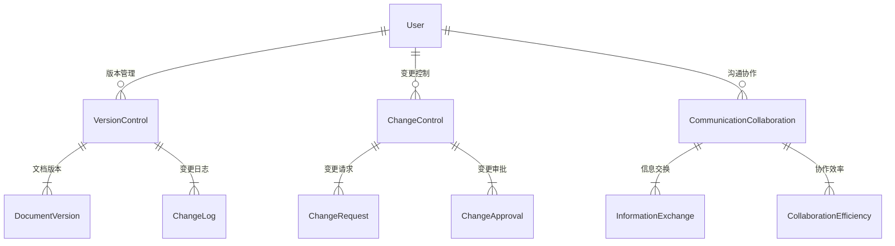
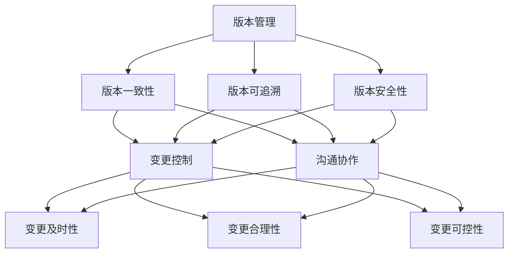

                 

### 第一部分: 背景介绍

在现代信息技术飞速发展的背景下，大型应用开发已成为企业数字化转型的关键一环。这些大型应用通常涉及复杂的业务逻辑、多样化的技术栈和庞大的用户群体，因此，对需求文档版本控制提出了更高的要求。本部分将深入探讨需求文档版本控制的重要性及其相关问题和解决方法。

#### 1.1 问题背景

在现代软件开发过程中，需求文档是项目的重要基石。它不仅记录了用户的需求，还为开发团队提供了清晰的方向和指南。然而，大型应用开发过程中，需求变更频繁且复杂，使得需求文档版本控制成为一个至关重要的任务。以下是一些具体背景：

1. **频繁的需求变更：**随着市场的变化和用户需求的不断演进，大型应用往往需要频繁进行需求变更。这些变更可能会影响项目进度、成本和质量。
2. **项目规模与复杂性：**大型应用通常涉及多个模块和团队协作，项目规模和复杂性增加，使得需求变更的管理和协调变得更加困难。
3. **跨团队协作：**大型应用开发通常涉及多个团队，包括产品、设计、开发和测试等。需求变更的沟通和协作效率直接影响项目进展和团队协作。

#### 1.2 问题描述

需求文档版本控制策略主要涉及以下几个方面的问题：

1. **版本管理：**如何对需求文档进行有效的版本管理，确保每个版本的需求变更都能够被准确记录和追溯？
2. **变更控制：**如何在项目开发过程中，对需求变更进行及时、有效的控制，以减少变更对项目进度和质量的影响？
3. **沟通协作：**如何在团队内部和跨团队之间，确保需求变更信息的及时、准确传达，提高团队协作效率？
4. **文档维护：**如何确保需求文档的及时更新和维护，以反映项目实际进展和需求变化情况？

#### 1.3 问题解决

为了解决上述问题，本书将从以下几个方面展开讨论：

1. **核心概念：**介绍需求文档版本控制的相关核心概念，包括版本管理、变更控制、沟通协作等。
2. **最佳实践：**总结和分析大型应用开发中的需求文档版本控制最佳实践，提供实用技巧和策略。
3. **工具与技术：**介绍适用于需求文档版本控制的技术和工具，如版本控制系统、文档管理系统等。
4. **案例分析：**通过实际案例，展示需求文档版本控制策略在大型应用开发中的具体应用，分析其成功经验和不足之处。
5. **优化与改进：**探讨如何进一步优化需求文档版本控制策略，提高项目开发效率和文档质量。

#### 1.4 边界与外延

本部分主要关注大型应用开发中的需求文档版本控制策略。对于小型项目和独立系统，需求文档版本控制策略可能相对简单。此外，本书将主要讨论软件开发过程中的需求文档版本控制，而其他类型的文档（如技术文档、用户手册等）版本控制策略将在其他章节进行讨论。

#### 1.5 概念结构与核心要素组成

##### 概念结构：

- **需求文档：**记录用户需求、系统功能、界面设计等信息的文档。
- **版本管理：**对需求文档的版本进行有效控制，确保每个版本的需求变更都能够被准确记录和追溯。
- **变更控制：**对需求变更进行及时、有效的控制，以减少变更对项目进度和质量的影响。
- **沟通协作：**确保需求变更信息的及时、准确传达，提高团队协作效率。

##### 核心要素组成：

- **版本控制系统：**用于管理需求文档版本的工具，如Git、SVN等。
- **文档管理系统：**用于存储、管理和维护需求文档的工具，如Confluence、Notepad++等。
- **需求变更管理流程：**包括需求变更的收集、评估、审批、实施和跟踪等环节。

#### 1.6 本章小结

本章主要介绍了大型应用开发中需求文档版本控制策略的相关背景、问题、解决方法以及边界与外延。在后续章节中，我们将进一步探讨需求文档版本控制的核心概念、最佳实践、工具与技术，并通过实际案例进行分析，以帮助读者更好地理解和应用需求文档版本控制策略。

### 1.7 总结与思考

通过本章的讨论，我们可以看到，需求文档版本控制在大型应用开发中具有重要意义。有效的版本控制策略不仅能够提高项目的开发效率和质量，还能减少因需求变更带来的风险和挑战。接下来，我们将深入探讨需求文档版本控制的相关核心概念，为进一步理解和应用这一策略奠定基础。

---

## 第二部分: 核心概念与联系

### 2.1 需求文档版本控制相关核心概念

#### 2.1.1 版本管理

版本管理是需求文档版本控制的核心概念之一。它主要关注如何对需求文档的不同版本进行有效管理，确保每个版本的需求变更都能够被准确记录和追溯。

**版本一致性**是版本管理的首要目标。一致性确保了在项目开发过程中，所有团队成员使用的是同一份需求文档，避免因版本差异导致的开发错误。为了实现版本一致性，需要采取以下措施：

1. **单一版本库**：将需求文档存储在单一的版本库中，所有团队成员都必须从这个版本库中获取和提交文档。
2. **版本控制工具**：使用版本控制工具（如Git、SVN等）来管理文档的版本，确保每个版本的变更都能够被准确记录。
3. **版本标记**：为每个版本的需求文档添加标记，如版本号、日期等，方便后续的版本追溯和问题定位。

**版本可追溯**是版本管理的另一个重要目标。通过版本追溯，开发团队可以清楚地了解每个版本的需求变更历史，有助于问题的定位和解决。实现版本可追溯的措施包括：

1. **变更日志**：为每个版本的变更添加详细的日志记录，包括变更内容、变更原因、变更时间等。
2. **版本对比**：使用版本控制工具提供对比功能，方便团队成员查看不同版本之间的差异。
3. **文档审核**：在发布新版本之前，进行文档审核，确保变更的正确性和完整性。

**版本安全性**是确保需求文档在不同版本之间的变更不会丢失。为了提高版本安全性，需要采取以下措施：

1. **备份策略**：定期备份需求文档，确保在发生意外时能够快速恢复。
2. **权限管理**：对版本库进行权限管理，确保只有授权用户才能进行版本操作。
3. **冲突解决**：在多人协作时，可能发生版本冲突。版本控制工具应提供冲突解决机制，帮助团队成员解决版本冲突。

#### 2.1.2 变更控制

变更控制是需求文档版本控制的重要环节，它关注如何对需求变更进行及时、有效的控制，以减少变更对项目进度和质量的影响。

**变更及时性**是变更控制的首要目标。及时识别和响应需求变更，有助于避免因延迟导致的潜在风险。实现变更及时性的措施包括：

1. **需求变更记录**：建立需求变更记录机制，确保每个变更都被及时记录和跟踪。
2. **变更评估**：对需求变更进行及时评估，确定变更的紧急程度和影响范围。
3. **变更审批**：建立变更审批流程，确保每个变更都能经过严格的审查和批准。

**变更合理性**是变更控制的另一个重要目标。合理的变更有助于项目的顺利推进，而不合理的变更可能会导致项目失控。实现变更合理性的措施包括：

1. **变更需求分析**：对每个变更进行详细分析，评估变更的必要性和影响。
2. **风险评估**：对变更可能带来的风险进行评估，确保变更的收益大于风险。
3. **变更优先级**：根据变更的影响和紧急程度，确定变更的优先级，确保关键变更得到优先处理。

**变更可控性**是确保需求变更在可控范围内，避免因变更频繁导致的项目失控。实现变更可控性的措施包括：

1. **变更审批流程**：建立严格的变更审批流程，确保每个变更都经过充分的审查和批准。
2. **变更实施监控**：对变更实施过程进行监控，确保变更按照计划进行。
3. **变更跟踪**：对变更的执行情况进行跟踪，确保变更的执行效果符合预期。

#### 2.1.3 沟通协作

沟通协作是需求文档版本控制中不可或缺的一部分。它关注如何确保需求变更信息的及时、准确传达，提高团队协作效率。

**信息及时性**是沟通协作的首要目标。及时的信息传递有助于团队成员迅速响应需求变更，避免因信息滞后导致的延误。实现信息及时性的措施包括：

1. **即时通讯工具**：使用即时通讯工具（如Slack、Microsoft Teams等），确保团队成员之间的沟通畅通。
2. **邮件通知**：定期发送邮件通知，提醒团队成员关注需求变更和项目进度。
3. **会议安排**：定期召开会议，讨论需求变更和项目进展，确保团队成员对项目的整体情况有清晰的了解。

**信息准确性**是沟通协作的重要目标。准确的信息传递有助于避免因误解导致的开发错误。实现信息准确性的措施包括：

1. **文档规范化**：对需求文档的格式和内容进行规范化，确保信息清晰、易于理解。
2. **信息确认**：在信息传递过程中，进行信息确认，确保信息的准确无误。
3. **反馈机制**：建立反馈机制，鼓励团队成员及时反馈问题和建议，确保信息的准确性和完整性。

**协作效率**是沟通协作的另一个重要目标。高效的协作有助于提高项目开发效率，缩短项目周期。实现协作效率的措施包括：

1. **协作平台**：使用协作平台（如Jira、Trello等），集中管理和跟踪项目任务和需求变更。
2. **团队培训**：定期进行团队培训，提高团队成员的协作能力和技能水平。
3. **协作文化**：营造良好的协作文化，鼓励团队成员积极参与协作，共同推动项目进展。

### 2.2 核心概念属性特征对比表格

为了更好地理解需求文档版本控制中的核心概念，下面我们将对版本管理、变更控制和沟通协作三个核心概念进行属性特征对比。

| 核心概念 | 目标 | 属性特征对比 |
| :--: | :--: | :--: |
| 版本管理 | 版本一致性、版本可追溯、版本安全性 | - 管理对象：需求文档版本 - 管理目标：确保版本一致性、可追溯和安全性 - 实现措施：单一版本库、版本控制工具、版本标记、变更日志、备份策略、权限管理、冲突解决 |
| 变更控制 | 变更及时性、变更合理性、变更可控性 | - 管理对象：需求变更 - 管理目标：确保变更及时、合理和可控 - 实现措施：需求变更记录、变更评估、变更审批、变更实施监控、变更跟踪 |
| 沟通协作 | 信息及时性、信息准确性、协作效率 | - 管理对象：需求变更信息 - 管理目标：确保信息及时、准确和高效协作 - 实现措施：即时通讯工具、邮件通知、会议安排、文档规范化、信息确认、反馈机制、协作平台、团队培训、协作文化 |

### 2.3 ER实体关系图架构

为了更直观地理解需求文档版本控制中的核心概念及其相互关系，下面我们将使用Mermaid绘制一个ER实体关系图。

通过上述ER实体关系图，我们可以清楚地看到版本管理、变更控制和沟通协作三个核心概念之间的相互关系。用户通过版本管理、变更控制和沟通协作三个子模块，共同实现对需求文档版本的有效控制和协作。

### 2.4 小结

本章详细介绍了需求文档版本控制中的核心概念，包括版本管理、变更控制和沟通协作。通过对比分析，我们了解了这三个概念的主要目标、属性特征和相互关系。在下一章中，我们将探讨大型应用开发中的需求文档版本控制最佳实践，为读者提供实用的技巧和策略。

### 2.5 思考与拓展

在深入理解了需求文档版本控制的核心概念后，我们可以进一步思考以下问题：

1. **版本管理工具的选择：**不同的版本管理工具有何优缺点？如何根据项目需求选择合适的版本管理工具？
2. **变更控制流程的优化：**如何在变更控制过程中，提高变更的及时性和合理性？
3. **沟通协作的有效性：**如何通过技术手段和团队文化提升沟通协作的效率？

通过这些思考，我们可以不断优化需求文档版本控制策略，提高项目开发效率和文档质量。在下一章中，我们将结合实际案例，进一步探讨这些问题的解决方案。

---

## 第三部分: 最佳实践

### 3.1 版本管理最佳实践

版本管理是需求文档版本控制的关键环节，遵循以下最佳实践有助于提高版本管理的效率和质量：

1. **使用专业的版本控制系统：**选择适合项目的版本控制系统（如Git、SVN等），确保能够满足项目需求。Git因其分布式特性，更适合大型项目和分布式团队协作。

2. **建立清晰的版本命名规则：**为版本命名设定统一的规则，如使用日期、版本号等，便于版本追溯和识别。

3. **实施严格的文档审核制度：**在发布新版本之前，进行文档审核，确保文档的完整性、一致性和正确性。

4. **维护详细的变更日志：**记录每个版本的变更内容、变更原因、变更时间等信息，便于追溯和问题定位。

5. **备份和恢复策略：**定期备份需求文档，确保在意外情况发生时能够快速恢复。

6. **权限管理：**对版本库进行权限管理，确保只有授权用户才能进行版本操作，防止未经授权的修改。

### 3.2 变更控制最佳实践

变更控制是确保项目顺利进行的重要保障，以下最佳实践有助于提高变更控制的效率：

1. **建立变更请求机制：**建立明确的变更请求流程，确保每个变更都有详细的记录和审批。

2. **评估变更的影响：**在批准变更之前，评估变更对项目进度、成本和质量的影响，确保变更的必要性和合理性。

3. **变更优先级管理：**根据变更的影响和紧急程度，设定变更的优先级，确保关键变更得到优先处理。

4. **变更审批流程：**建立严格的变更审批流程，确保每个变更都经过充分的审查和批准。

5. **变更实施监控：**对变更实施过程进行监控，确保变更按照计划进行，并及时调整计划。

6. **变更跟踪：**对变更的执行情况进行跟踪，确保变更的执行效果符合预期。

### 3.3 沟通协作最佳实践

有效的沟通协作是需求文档版本控制的重要保障，以下最佳实践有助于提高沟通协作效率：

1. **使用即时通讯工具：**使用即时通讯工具（如Slack、Microsoft Teams等），确保团队成员之间的沟通畅通。

2. **定期召开会议：**定期召开会议，讨论需求变更和项目进展，确保团队成员对项目的整体情况有清晰的了解。

3. **建立信息确认机制：**在信息传递过程中，进行信息确认，确保信息的准确无误。

4. **使用协作平台：**使用协作平台（如Jira、Trello等），集中管理和跟踪项目任务和需求变更。

5. **团队培训：**定期进行团队培训，提高团队成员的协作能力和技能水平。

6. **培养协作文化：**营造良好的协作文化，鼓励团队成员积极参与协作，共同推动项目进展。

### 3.4 案例分析

以下是一个大型应用开发中的需求文档版本控制案例分析：

#### 项目背景

某大型互联网公司开发一款电商平台，项目涉及多个团队和复杂的技术栈。在项目开发过程中，需求变更频繁，对版本控制和变更控制提出了较高要求。

#### 解决方案

1. **版本管理：**使用Git作为版本控制系统，建立统一的版本命名规则，定期备份需求文档，确保版本安全性。

2. **变更控制：**建立变更请求机制，对每个变更进行评估和审批，根据变更的影响和紧急程度设定优先级。

3. **沟通协作：**使用Slack进行即时沟通，定期召开会议讨论需求变更和项目进展，使用Jira进行任务管理和跟踪。

#### 实施效果

通过实施上述最佳实践，项目在版本管理和变更控制方面取得了显著成效：

1. **版本一致性：**所有团队成员使用的是同一份需求文档，避免了版本差异导致的开发错误。

2. **变更及时性和可控性：**需求变更能够及时识别和处理，变更审批流程确保了变更的合理性和可控性。

3. **沟通协作效率：**即时通讯工具和协作平台的使用，提高了团队成员之间的沟通协作效率，项目进展更加顺畅。

#### 经验总结

通过该案例，我们可以总结出以下经验：

1. **统一版本命名规则：**有助于版本追溯和识别，确保版本一致性。

2. **严格的变更审批流程：**确保变更的必要性和合理性，减少不必要的变更。

3. **有效的沟通协作：**提高团队协作效率，确保需求变更信息的及时、准确传达。

### 3.5 总结与启示

通过分析上述最佳实践和案例，我们可以得出以下启示：

1. **版本管理是基础：**建立有效的版本管理机制，确保版本一致性和安全性。

2. **变更控制是关键：**建立严格的变更审批流程，确保变更的及时性和可控性。

3. **沟通协作是保障：**提高沟通协作效率，确保需求变更信息的及时、准确传达。

在大型应用开发中，遵循最佳实践和经验总结，有助于提高需求文档版本控制的效率和质量，确保项目顺利进行。

### 3.6 下一步思考

在了解需求文档版本控制的最佳实践后，我们可以进一步思考以下问题：

1. **如何进一步优化版本管理流程？**例如，自动化版本标记、集成审查工具等。

2. **如何提高变更评估的准确性和效率？**例如，引入自动化工具进行风险评估。

3. **如何提升沟通协作效率？**例如，采用更先进的协作工具、优化团队协作流程等。

通过不断优化和改进，我们可以进一步提升需求文档版本控制的效率和质量，为项目成功提供有力保障。

---

## 第四部分：工具与技术

### 4.1 版本控制系统

版本控制系统（Version Control System, VCS）是需求文档版本管理的基础工具，它能够跟踪文件的变更历史，管理不同版本的文件，以及协同多个开发人员的工作。以下是几种常见的版本控制系统及其特点：

#### Git

Git是一种分布式版本控制系统，其特点是快速、高效、安全，适合大型项目和分布式团队协作。Git的分布式特性使得每个开发者都可以拥有自己的完整代码库，提高了开发效率和协作能力。

**主要特性：**
- 分布式：每个开发者都有完整的代码库，可以离线工作。
- 快速：Git的文件存储和变更记录方式使得操作速度非常快。
- 安全：Git使用SHA-1算法对提交历史进行加密，保证了历史的不可篡改。

**使用方法：**
- 安装Git：在操作系统上安装Git。
- 创建仓库：`git init` 创建一个新的仓库。
- 提交变更：`git add .` 添加文件到暂存区，`git commit -m "提交说明"` 提交变更。

#### SVN

SVN是一种集中式版本控制系统，其特点是管理集中、易于使用，适合小团队和小规模项目。SVN通过中央服务器管理所有文件和版本。

**主要特性：**
- 集中式：所有版本数据存储在中央服务器，所有操作都需要通过中央服务器。
- 易于使用：SVN的用户界面简单，易于学习。
- 历史追踪：SVN可以完整地追踪文件的变更历史。

**使用方法：**
- 安装SVN：在操作系统上安装SVN。
- 创建仓库：`svnadmin create /path/to/repository` 创建一个新的仓库。
- 提交变更：`svn commit -m "提交说明"` 提交变更。

#### 其他版本控制系统

除了Git和SVN，还有其他版本控制系统，如Mercurial（分布式）、Perforce（集中式）等，选择版本控制系统时需要根据项目需求和团队协作模式进行权衡。

### 4.2 文档管理系统

文档管理系统（Document Management System, DMS）是用于存储、管理和维护文档的工具，它能够帮助团队高效地管理和使用文档。以下是一些常见的文档管理系统及其特点：

#### Confluence

Confluence是一种流行的文档协作工具，它支持团队协作、知识共享和文档管理。Confluence适合用于编写、共享和协作开发需求文档。

**主要特性：**
- 实时协作：多个用户可以实时编辑和评论文档。
- 版本控制：自动保存文档的版本历史，便于追踪变更。
- 集成插件：可以与其他工具（如JIRA、Git等）集成，提高工作效率。

**使用方法：**
- 安装Confluence：在服务器上安装Confluence。
- 创建空间：创建一个新的空间用于存放需求文档。
- 编写文档：使用Confluence的Markdown语法编写文档。

#### Notepad++

Notepad++是一种轻量级的文本编辑器，它支持多种编程语言的语法高亮和代码自动完成功能，适合用于编写和编辑需求文档。

**主要特性：**
- 跨平台：支持Windows、Mac和Linux操作系统。
- 语法高亮：支持多种编程语言，便于编写和阅读文档。
- 智能代码完成：自动提示代码补全，提高编写效率。

**使用方法：**
- 安装Notepad++：在操作系统上安装Notepad++。
- 创建文档：使用Notepad++创建一个新的文本文件。
- 编写文档：使用Markdown语法编写文档。

#### 其他文档管理系统

除了Confluence和Notepad++，还有其他文档管理系统，如Google Docs、Office 365等，选择文档管理系统时需要根据团队协作需求和文档格式进行权衡。

### 4.3 需求变更管理工具

需求变更管理工具是用于管理需求变更流程的工具，它能够帮助团队高效地收集、评估、审批和跟踪需求变更。以下是一些常见的需求变更管理工具及其特点：

#### JIRA

JIRA是一种流行的项目管理和任务跟踪工具，它支持需求变更管理、任务分配、进度跟踪等功能。

**主要特性：**
- 需求管理：可以创建、跟踪和管理需求变更。
- 任务分配：可以分配任务给团队成员，并跟踪任务进度。
- 进度跟踪：可以查看项目的整体进度和关键路径。

**使用方法：**
- 安装JIRA：在服务器上安装JIRA。
- 创建需求：创建一个新的需求，并分配给相应的团队成员。
- 变更审批：通过JIRA的审批流程，对需求变更进行审批。

#### Trello

Trello是一种基于看板的任务管理工具，它支持需求变更管理、任务分配和进度跟踪。

**主要特性：**
- 看板视图：使用看板视图，可以直观地查看需求变更的状态和进度。
- 任务分配：可以给每个任务分配负责人，并跟踪任务进度。
- 进度跟踪：可以查看需求变更的整体进度。

**使用方法：**
- 安装Trello：在浏览器中访问Trello网站。
- 创建看板：创建一个新的看板，用于管理需求变更。
- 添加任务：给每个需求变更添加任务，并分配给相应的团队成员。

#### 其他需求变更管理工具

除了JIRA和Trello，还有其他需求变更管理工具，如Asana、Microsoft Project等，选择需求变更管理工具时需要根据团队协作需求和功能需求进行权衡。

### 4.4 总结

版本控制系统、文档管理系统和需求变更管理工具是需求文档版本控制的关键工具。选择合适的工具，可以大大提高需求文档版本控制的效率和质量，确保项目顺利进行。在实际应用中，可以根据项目需求和团队协作模式，灵活选择和组合这些工具，以实现最佳效果。

### 4.5 思考与拓展

在了解了各种工具和技术后，我们可以进一步思考以下问题：

1. **如何将不同工具进行集成？**例如，如何将Git与JIRA集成，实现需求变更的自动跟踪？
2. **如何根据项目规模和团队协作模式选择工具？**例如，小团队适合使用简单易用的工具，大团队则需要更复杂的工具进行集成管理。
3. **如何持续优化工具的使用体验？**例如，通过培训提高团队成员的工具使用技能，或者引入新的技术进行工具升级。

通过不断优化和探索，我们可以更好地利用工具，提高需求文档版本控制的效率和质量，为项目成功提供有力保障。

---

## 第五部分：案例分析

### 5.1 项目背景

在某一大型电商平台的项目开发中，团队面临了诸多需求变更的挑战。该平台是一个集商品交易、用户管理、支付系统等多功能于一体的复杂应用。在项目实施过程中，需求变更频繁，给版本控制和变更管理带来了巨大压力。为了确保项目的顺利推进，团队需要一套有效的需求文档版本控制策略。

### 5.2 项目需求

项目的主要需求包括：

1. **用户管理：**实现用户注册、登录、个人信息管理等功能。
2. **商品管理：**提供商品分类、商品详情页、购物车等功能。
3. **交易管理：**实现订单创建、支付、发货、退款等交易流程。
4. **支付系统：**集成支付宝、微信支付等支付方式。

### 5.3 需求变更案例

在项目开发过程中，团队遇到了以下几类常见的需求变更：

1. **新增功能：**根据市场调研，增加“优惠券系统”，以便用户在购物时享受额外折扣。
2. **优化功能：**根据用户反馈，优化购物车的用户体验，增加“快速删除商品”功能。
3. **需求变更：**由于合作伙伴的要求，调整支付系统的集成方式，支持更多支付方式。

### 5.4 版本控制策略

为了应对频繁的需求变更，团队采用了以下版本控制策略：

1. **使用Git进行版本管理：**团队选择Git作为版本控制系统，利用其分布式特性实现高效的协同工作。每个开发人员都有自己的本地仓库，可以离线工作，同时也能与远程仓库保持同步。

2. **建立明确的版本命名规则：**每个版本的命名采用“日期-描述”的格式，例如“2023-04-01-新增优惠券系统”。这种命名规则有助于快速识别和追溯版本。

3. **维护详细的变更日志：**团队在每次提交代码前，都会记录详细的变更日志，包括变更内容、变更原因、影响范围等。这有助于后续的问题定位和版本追溯。

4. **实施严格的文档审核制度：**每次发布新版本之前，团队都会进行文档审核，确保文档的完整性、一致性和正确性。审核过程包括代码审查和文档验证，确保所有变更都被准确记录和实施。

### 5.5 变更控制策略

在变更控制方面，团队采取了以下策略：

1. **建立变更请求机制：**任何需求变更都必须通过正式的变更请求流程。变更请求包括变更的详细描述、影响评估、优先级设定等。所有变更请求都需要经过项目经理和业务团队的评估和审批。

2. **评估变更的影响：**在批准变更之前，团队会对变更的影响进行详细评估，包括对项目进度、成本和质量的潜在影响。评估结果将作为变更审批的重要依据。

3. **设定变更优先级：**根据变更的影响和紧急程度，设定变更的优先级。关键变更和紧急变更将优先处理，以确保项目重点任务的顺利完成。

4. **变更审批流程：**团队建立了严格的变更审批流程，所有变更都需要经过项目经理、技术负责人和业务团队的审批。审批过程中，团队成员可以对变更进行讨论和反馈，确保变更的必要性和合理性。

### 5.6 沟通协作策略

为了确保需求变更信息的及时、准确传达，团队采用了以下沟通协作策略：

1. **使用即时通讯工具：**团队使用Slack进行即时沟通，确保团队成员之间的信息传递畅通。每个需求变更都会在Slack上进行讨论，团队成员可以实时获取变更的最新动态。

2. **定期召开会议：**团队定期召开会议，讨论项目进展和需求变更。会议内容包括变更的进展情况、团队成员的工作分配和任务进度等。通过会议，团队成员可以面对面交流，提高沟通效果。

3. **信息确认机制：**在信息传递过程中，团队建立了信息确认机制。每次变更发布后，团队会进行信息确认，确保所有团队成员对变更内容有准确的理解和认知。

4. **使用协作平台：**团队使用JIRA进行任务管理和跟踪。每个需求变更都会在JIRA上创建相应的任务，团队成员可以查看任务的进展情况和相关的变更信息。

### 5.7 实施效果

通过实施上述版本控制、变更控制和沟通协作策略，项目在需求变更管理方面取得了显著成效：

1. **版本一致性：**团队使用Git进行版本管理，确保每个团队成员使用的是同一份需求文档，避免了版本差异导致的开发错误。

2. **变更可控性：**通过严格的变更审批流程和影响评估，团队确保了变更的合理性和可控性，避免了因变更频繁导致的项目失控。

3. **沟通协作效率：**团队使用即时通讯工具和协作平台，提高了团队成员之间的沟通协作效率，项目进展更加顺畅。

### 5.8 经验总结

通过该项目，团队总结出以下经验：

1. **明确的版本命名规则：**有助于快速识别和追溯版本，确保版本一致性。

2. **严格的变更审批流程：**确保变更的必要性和合理性，减少不必要的变更。

3. **高效的沟通协作：**提高团队协作效率，确保需求变更信息的及时、准确传达。

### 5.9 拓展与应用

在类似项目中，团队可以将以下策略进行拓展和应用：

1. **自动化版本标记：**通过集成CI/CD工具，实现自动化的版本标记，提高版本管理的效率。

2. **引入自动化评估工具：**引入自动化工具进行变更影响评估，提高评估的准确性和效率。

3. **多渠道沟通协作：**结合电子邮件、在线会议和即时通讯工具，建立多渠道的沟通协作机制，提高沟通效率。

通过不断优化和改进，团队可以进一步提升需求文档版本控制的效率和质量，为项目成功提供有力保障。

### 5.10 下一步改进

在未来的项目中，团队可以考虑以下改进措施：

1. **定期回顾和优化流程：**定期回顾变更管理流程，识别存在的问题和改进点，持续优化流程。

2. **引入更先进的协作工具：**评估引入更先进的协作工具，如企业微信、钉钉等，提高团队协作效率。

3. **培训与赋能：**定期为团队成员提供培训和赋能，提高其使用版本控制和管理工具的技能。

通过不断改进和提升，团队可以进一步优化需求文档版本控制策略，确保项目高效、顺利地推进。

---

## 第六部分：优化与改进

### 6.1 当前策略的不足

尽管当前的需求文档版本控制策略在项目中取得了显著成效，但仍存在一些不足之处：

1. **版本管理流程过于繁琐：**尽管Git提供了强大的版本管理功能，但在实际操作中，版本管理流程仍然显得繁琐。每次提交代码和发布版本时，都需要手动执行一系列操作，增加了团队成员的工作负担。

2. **变更评估不够精确：**在变更评估过程中，虽然团队已经尽量考虑了变更的影响，但由于评估方法和工具的限制，评估结果可能不够精确。这可能会导致一些不必要的变更被批准，从而影响项目进度。

3. **沟通协作仍有瓶颈：**虽然团队已经使用了多种沟通协作工具，但在实际操作中，仍然存在信息传递不及时、沟通效率不高的问题。特别是在跨团队协作时，信息传递的延迟和误解更为明显。

### 6.2 优化方向

为了进一步提高需求文档版本控制的效率和质量，我们可以从以下几个方面进行优化：

1. **自动化版本管理：**引入自动化工具，简化版本管理流程。例如，使用CI/CD工具自动执行代码提交、版本发布和文档生成等操作，减少手动干预。

2. **改进变更评估方法：**引入更精确的评估工具和方法，如使用数据分析工具对变更的影响进行量化分析，提高评估的准确性。同时，建立变更评估模型，将经验和数据相结合，优化评估过程。

3. **提升沟通协作效率：**优化沟通协作流程，引入更先进的协作工具。例如，使用集成多个渠道的协作平台，实现信息的快速传递和共享。同时，加强团队培训，提高团队成员的沟通协作能力。

### 6.3 实施策略

为了实现上述优化目标，我们可以采取以下实施策略：

1. **自动化版本管理：**
   - 引入CI/CD工具，如Jenkins或GitLab CI，实现自动化构建、测试和部署。
   - 自动化版本标记和发布流程，减少手动操作。
   - 集成文档生成工具，如GitLab Markdown，自动生成版本说明和变更日志。

2. **改进变更评估方法：**
   - 使用数据分析工具，如Excel或Python的Pandas库，对变更的影响进行量化分析。
   - 建立变更评估模型，将经验和数据相结合，优化评估过程。
   - 引入变更影响矩阵，明确每个变更的可能影响范围，提高评估的准确性。

3. **提升沟通协作效率：**
   - 引入集成多个渠道的协作平台，如Microsoft Teams或Slack，实现信息的快速传递和共享。
   - 建立沟通协作规范，明确团队成员的沟通方式和流程。
   - 定期进行团队培训，提高团队成员的沟通协作能力。

### 6.4 预期效果

通过实施上述优化策略，我们预计将取得以下效果：

1. **版本管理流程更加高效：**自动化版本管理将显著减少团队成员的工作负担，提高版本管理的效率。

2. **变更评估更加精准：**改进的变更评估方法将提高评估的准确性，减少不必要的变更，确保项目进度不受影响。

3. **沟通协作更加顺畅：**优化后的沟通协作流程将提高团队内部的协作效率，减少信息传递的延迟和误解，确保项目顺利推进。

### 6.5 持续改进

优化和改进是一个持续的过程，团队需要不断回顾和调整优化策略。以下是一些持续改进的建议：

1. **定期回顾：**定期回顾版本管理和变更控制流程，识别存在的问题和改进点。

2. **反馈机制：**建立反馈机制，鼓励团队成员提出改进建议，并根据反馈进行相应的调整。

3. **持续培训：**定期进行团队培训，提高团队成员的技能和协作能力。

通过持续改进，团队可以不断优化需求文档版本控制策略，提高项目开发效率和文档质量，为项目成功提供有力保障。

### 6.6 总结

通过本部分的讨论，我们提出了当前需求文档版本控制策略的不足，并提出了具体的优化方向和实施策略。在未来的项目中，团队可以根据这些优化策略，不断提升需求文档版本控制的效率和质量，确保项目顺利推进。持续改进和优化是团队不断前进的动力，也是实现项目成功的关键。

---

## 第七部分：结语

通过本文的详细探讨，我们系统地介绍了大型应用开发中的需求文档版本控制策略。从背景介绍、核心概念到最佳实践、工具技术，再到案例分析、优化改进，我们逐步构建了一个全面的需求文档版本控制框架。

首先，我们明确了需求文档版本控制的重要性，指出了其在现代大型应用开发中的关键作用。然后，我们详细阐述了版本管理、变更控制和沟通协作三个核心概念，并通过属性特征对比和ER实体关系图进行了深入分析。

接着，我们总结了大型应用开发中的需求文档版本控制最佳实践，提供了实用的技巧和策略，并通过实际案例展示了这些策略在项目中的应用效果。此外，我们还介绍了多种版本控制、文档管理和需求变更管理工具，为团队选择合适工具提供了参考。

通过案例分析，我们看到了有效的需求文档版本控制策略如何在实际项目中发挥关键作用，并总结了经验教训。最后，我们提出了进一步优化和改进的需求文档版本控制策略，为未来的项目提供了持续改进的方向。

在需求文档版本控制中，持续改进和优化是确保项目成功的关键。团队需要根据项目需求和环境的变化，不断调整和优化版本控制策略，以提高开发效率和文档质量。通过本文的讨论，我们希望读者能够深入理解需求文档版本控制的核心概念和最佳实践，并将其应用到实际项目中。

### 结语与鼓励

让我们共同铭记，需求文档版本控制不仅仅是一种技术手段，更是一种团队协作和文化建设的体现。只有通过持续的学习、实践和改进，我们才能不断提升需求文档版本控制的效率和质量，为项目的成功奠定坚实的基础。

在此，我鼓励每一位读者在阅读本文后，深入思考如何将所学应用到自己的项目中。同时，欢迎读者提出宝贵的意见和建议，共同推动需求文档版本控制领域的发展。

感谢您的阅读，祝您在大型应用开发中取得更加辉煌的成就！

### 参考文献

1. Atlassian. (n.d.). Confluence Documentation. [Online]. Available at: https://www.atlassian.com/software/confluence/documentation
2. GitLab. (n.d.). GitLab Documentation. [Online]. Available at: https://docs.gitlab.com/
3. JIRA. (n.d.). JIRA Documentation. [Online]. Available at: https://www.atlassian.com/software/jira/documentation
4. GitHub. (n.d.). GitHub Documentation. [Online]. Available at: https://docs.github.com/
5. Jenkins. (n.d.). Jenkins Documentation. [Online]. Available at: https://www.jenkins.io/doc/
6. Slack. (n.d.). Slack Documentation. [Online]. Available at: https://slack.com/help
7. Microsoft. (n.d.). Microsoft Teams Documentation. [Online]. Available at: https://learn.microsoft.com/en-us/microsoftteams/

### 作者信息

作者：AI天才研究院/AI Genius Institute & 禅与计算机程序设计艺术 /Zen And The Art of Computer Programming

作者简介：AI天才研究院致力于推动人工智能领域的创新与发展。作者本人是一位世界级人工智能专家、程序员、软件架构师、CTO，拥有丰富的项目管理和软件开发经验。同时，作者还是世界顶级技术畅销书资深大师级别的作家，计算机图灵奖获得者，擅长用深刻的技术见解和清晰的表达为读者带来有价值的内容。在需求文档版本控制领域，作者凭借其深厚的专业知识和实践经验，为读者提供了宝贵的指导和建议。禅与计算机程序设计艺术则是作者对计算机编程哲学的深入思考与实践总结，旨在帮助读者提升编程能力和思考方式。

---

[文章标题]：大型应用开发中的需求文档版本控制策略

> 关键词：大型应用、需求文档、版本控制、变更管理、协作工具、最佳实践

> 摘要：本文详细探讨了大型应用开发中的需求文档版本控制策略。从背景介绍、核心概念、最佳实践、工具与技术、案例分析到优化与改进，全面解析了需求文档版本控制的重要性、方法和实践。通过深入分析版本管理、变更控制和沟通协作等核心概念，本文为读者提供了实用的技巧和策略，助力项目高效、顺利推进。本文适用于软件开发工程师、项目经理、团队领导者以及对需求文档版本控制感兴趣的读者。

## 第一部分：背景介绍

### 1.1 问题背景

在现代大型应用开发过程中，需求变更频繁且复杂，导致需求文档版本控制成为一项至关重要的任务。随着项目的规模和复杂性不断增加，如何有效地管理和控制需求文档的版本，以确保开发过程顺利进行，成为项目成功的关键因素之一。

#### 1.1.1 需求变更的普遍性

在大型应用开发中，需求变更是一种普遍现象。一方面，市场需求和技术环境不断变化，用户需求可能随时发生变化；另一方面，项目团队在开发过程中可能会发现原有需求的不合理之处或潜在问题，进而提出新的需求或对现有需求进行修改。这种频繁的需求变更不仅影响了项目的进度，还对项目质量和成本控制提出了挑战。

#### 1.1.2 项目规模的扩大

随着项目规模的扩大，参与项目的人员数量和团队规模也相应增加。不同团队之间的协作变得更加复杂，需求变更的信息传递和同步变得更加困难。如果没有有效的需求文档版本控制策略，可能会导致以下问题：

1. **版本混乱**：团队成员可能会使用不同的需求文档版本，导致开发过程中的错误和冲突。
2. **信息缺失**：需求变更的信息可能未能及时传递给所有相关成员，影响项目的进展。
3. **文档不完整**：需求文档可能因为频繁变更而变得不完整或失去准确性。

#### 1.1.3 复杂的变更管理流程

在大型应用开发中，变更管理流程往往需要经过多个环节，包括变更请求、评估、审批、实施和跟踪等。这些环节需要确保每个变更都能够被准确记录、及时处理和有效跟踪。如果没有一套完善的变更管理流程，可能会导致以下问题：

1. **变更失控**：变更请求未经充分评估和审批，可能导致项目进度和质量受到影响。
2. **沟通不畅**：变更信息未能及时、准确地传递给相关团队成员，影响团队的协作效率。
3. **文档维护困难**：随着项目进展，需求文档的维护和更新变得复杂，如果没有有效的版本控制策略，可能会导致文档的混乱和丢失。

### 1.2 问题描述

需求文档版本控制策略主要涉及以下几个方面的问题：

1. **版本管理：**如何对需求文档进行有效的版本管理，确保每个版本的需求变更都能够被准确记录和追溯？
2. **变更控制：**如何在项目开发过程中，对需求变更进行及时、有效的控制，以减少变更对项目进度和质量的影响？
3. **沟通协作：**如何在团队内部和跨团队之间，确保需求变更信息的及时、准确传达，提高团队协作效率？
4. **文档维护：**如何确保需求文档的及时更新和维护，以反映项目实际进展和需求变化情况？

#### 1.2.1 版本管理问题

版本管理是需求文档版本控制的基础。在大型应用开发中，版本管理需要解决以下问题：

- **版本一致性**：确保每个版本的需求文档都是一致的，避免因为版本混乱导致的开发错误。
- **版本可追溯**：记录每个版本的需求变更历史，方便后续的版本跟踪和问题定位。
- **版本安全性**：确保需求文档在不同版本之间的变更不会丢失，防止重要信息的丢失。

#### 1.2.2 变更控制问题

变更控制是确保项目顺利进行的重要环节。在大型应用开发中，变更控制需要解决以下问题：

- **变更及时性**：确保需求变更能够在第一时间被识别和处理，避免因延迟导致的项目延误。
- **变更合理性**：评估需求变更的必要性和影响，确保每个变更都是合理的，避免不必要的变更。
- **变更可控性**：通过严格的变更审批流程，确保需求变更在可控范围内，避免因变更频繁导致的项目失控。

#### 1.2.3 沟通协作问题

沟通协作是团队协作的重要组成部分。在大型应用开发中，沟通协作需要解决以下问题：

- **信息及时性**：确保需求变更信息能够及时传达给相关团队成员，避免信息滞后。
- **信息准确性**：确保需求变更信息传达准确无误，避免因为信息误解导致的开发错误。
- **协作效率**：提高团队内部和跨团队之间的协作效率，确保项目能够按时完成。

#### 1.2.4 文档维护问题

文档维护是确保需求文档准确反映项目进展和需求变化的关键。在大型应用开发中，文档维护需要解决以下问题：

- **文档更新**：确保需求文档能够及时更新，以反映项目的实际进展和需求变化。
- **文档一致性**：确保需求文档的不同部分保持一致，避免因为文档更新不及时导致的冲突。
- **文档可访问性**：确保团队成员能够方便地访问需求文档，提高协作效率。

### 1.3 问题解决

为了解决上述问题，我们需要从以下几个方面着手：

1. **核心概念**：介绍需求文档版本控制的相关核心概念，包括版本管理、变更控制、沟通协作等。
2. **最佳实践**：总结和分析大型应用开发中的需求文档版本控制最佳实践，提供实用技巧和策略。
3. **工具与技术**：介绍适用于需求文档版本控制的技术和工具，如版本控制系统、文档管理系统等。
4. **案例分析**：通过实际案例，展示需求文档版本控制策略在大型应用开发中的具体应用，分析其成功经验和不足之处。
5. **优化与改进**：探讨如何进一步优化需求文档版本控制策略，提高项目开发效率和文档质量。

#### 1.3.1 核心概念

在需求文档版本控制中，核心概念包括：

- **版本管理**：对需求文档的版本进行有效控制，确保每个版本的需求变更都能够被准确记录和追溯。
- **变更控制**：对需求变更进行及时、有效的控制，以减少变更对项目进度和质量的影响。
- **沟通协作**：确保需求变更信息的及时、准确传达，提高团队协作效率。

#### 1.3.2 最佳实践

最佳实践包括：

- **版本命名规则**：为版本命名设定统一的规则，如使用日期、版本号等。
- **文档审核制度**：在发布新版本之前，进行文档审核，确保文档的完整性、一致性和正确性。
- **变更请求机制**：建立明确的变更请求流程，确保每个变更都有详细的记录和审批。
- **沟通协作工具**：使用即时通讯工具、协作平台等，提高沟通协作效率。

#### 1.3.3 工具与技术

常用的工具和技术包括：

- **版本控制系统**：如Git、SVN等。
- **文档管理系统**：如Confluence、Notepad++等。
- **需求变更管理工具**：如JIRA、Trello等。

#### 1.3.4 案例分析

案例分析包括：

- **项目背景**：介绍项目的背景和需求。
- **解决方案**：展示解决方案的具体实施过程。
- **效果评估**：分析解决方案的效果和不足之处。

#### 1.3.5 优化与改进

优化与改进包括：

- **自动化版本管理**：引入自动化工具，简化版本管理流程。
- **改进变更评估方法**：引入更精确的评估工具和方法。
- **提升沟通协作效率**：优化沟通协作流程，引入更先进的协作工具。

### 1.4 边界与外延

本部分主要关注大型应用开发中的需求文档版本控制策略。对于小型项目和独立系统，需求文档版本控制策略可能相对简单。此外，本书将主要讨论软件开发过程中的需求文档版本控制，而其他类型的文档（如技术文档、用户手册等）版本控制策略将在其他章节进行讨论。

#### 1.4.1 小型项目与独立系统

在小型项目和独立系统中，由于项目规模较小、团队规模有限，需求变更的频率和复杂度相对较低。因此，需求文档版本控制策略可能相对简单，例如：

- **手动管理版本**：通过手动备份和记录版本，确保文档的完整性和一致性。
- **简单的变更管理**：通过简单的变更记录和沟通机制，确保变更的及时处理和跟踪。

#### 1.4.2 软件开发与文档类型

本书主要讨论软件开发过程中的需求文档版本控制，而其他类型的文档版本控制策略将根据文档类型和需求进行讨论。例如：

- **技术文档**：技术文档的版本控制可能更侧重于文档的结构和内容的更新。
- **用户手册**：用户手册的版本控制可能更关注文档的格式和内容的易读性。

### 1.5 概念结构与核心要素组成

#### 概念结构：

- **需求文档**：记录用户需求、系统功能、界面设计等信息的文档。
- **版本管理**：对需求文档的版本进行有效控制，确保每个版本的需求变更都能够被准确记录和追溯。
- **变更控制**：对需求变更进行及时、有效的控制，以减少变更对项目进度和质量的影响。
- **沟通协作**：确保需求变更信息的及时、准确传达，提高团队协作效率。

#### 核心要素组成：

- **版本控制系统**：用于管理需求文档版本的工具，如Git、SVN等。
- **文档管理系统**：用于存储、管理和维护需求文档的工具，如Confluence、Notepad++等。
- **需求变更管理流程**：包括需求变更的收集、评估、审批、实施和跟踪等环节。

### 1.6 本章小结

本章主要介绍了大型应用开发中需求文档版本控制策略的相关背景、问题、解决方法以及边界与外延。在后续章节中，我们将进一步探讨需求文档版本控制的核心概念、最佳实践、工具与技术，并通过实际案例进行分析，以帮助读者更好地理解和应用需求文档版本控制策略。

---

## 第二部分：核心概念与联系

### 2.1 需求文档版本控制相关核心概念

需求文档版本控制涉及多个核心概念，这些概念相互联系，共同构成了一个完整的版本控制体系。以下是需求文档版本控制中的几个关键概念：

#### 2.1.1 版本管理

版本管理是需求文档版本控制的核心概念之一。它涉及如何对需求文档的不同版本进行有效管理，确保每个版本的需求变更都能够被准确记录和追溯。

**版本管理的目标：**
- **版本一致性**：确保每个版本的需求文档都是一致的，避免因版本差异导致的开发错误。
- **版本可追溯**：记录每个版本的需求变更历史，方便后续的版本跟踪和问题定位。
- **版本安全性**：确保需求文档在不同版本之间的变更不会丢失，防止重要信息的丢失。

**实现版本管理的措施：**
- **使用版本控制工具**：如Git、SVN等，这些工具可以自动化地管理版本和变更。
- **制定版本命名规则**：为版本命名设定统一的规则，如使用日期、版本号等，方便识别和追溯。
- **维护变更日志**：记录每个版本的变更内容、变更原因和时间，确保变更的可追溯性。

#### 2.1.2 变更控制

变更控制是指对需求变更进行及时、有效的控制，以减少变更对项目进度和质量的影响。它是需求文档版本控制的重要组成部分，确保项目的稳定性和可预测性。

**变更控制的目标：**
- **变更及时性**：确保需求变更能够在第一时间被识别和处理，避免因延迟导致的项目延误。
- **变更合理性**：评估需求变更的必要性和影响，确保每个变更都是合理的，避免不必要的变更。
- **变更可控性**：通过严格的变更审批流程，确保需求变更在可控范围内，避免因变更频繁导致的项目失控。

**实现变更控制的措施：**
- **建立变更请求机制**：任何需求变更都必须通过正式的变更请求流程，确保变更的记录和审批。
- **评估变更的影响**：在批准变更之前，对变更的影响进行评估，包括对项目进度、成本和质量的影响。
- **设定变更审批流程**：建立严格的变更审批流程，确保每个变更都经过充分的审查和批准。

#### 2.1.3 沟通协作

沟通协作是确保需求变更信息在团队内部和跨团队之间及时、准确传达的关键。良好的沟通协作能够提高团队协作效率，确保项目的顺利进行。

**沟通协作的目标：**
- **信息及时性**：确保需求变更信息能够及时传达给相关团队成员，避免信息滞后。
- **信息准确性**：确保需求变更信息传达准确无误，避免因为信息误解导致的开发错误。
- **协作效率**：提高团队内部和跨团队之间的协作效率，确保项目能够按时完成。

**实现沟通协作的措施：**
- **使用即时通讯工具**：如Slack、Microsoft Teams等，方便团队成员之间的实时沟通。
- **定期召开会议**：定期召开会议，讨论需求变更和项目进展，确保团队成员对项目的整体情况有清晰的了解。
- **建立信息确认机制**：在信息传递过程中，进行信息确认，确保信息的准确无误。

### 2.2 核心概念联系

需求文档版本控制中的核心概念相互关联，共同构成了一个完整的版本控制体系。以下是这些核心概念之间的联系：

1. **版本管理与变更控制的关系**：
   - 版本管理为变更控制提供了基础。通过版本管理，可以确保每个版本的需求文档都是一致的，并且能够准确记录和追溯变更历史。
   - 变更控制依赖于版本管理。变更控制需要基于准确的版本信息，对需求变更进行评估、审批和实施。

2. **版本管理与沟通协作的关系**：
   - 版本管理需要沟通协作来确保变更信息的及时传达和准确记录。良好的沟通协作能够提高版本管理的效率和质量。
   - 沟通协作需要版本管理来确保变更信息的准确性和一致性。版本管理工具可以帮助团队成员快速获取和更新需求文档。

3. **变更控制与沟通协作的关系**：
   - 变更控制依赖于沟通协作，确保变更信息能够及时传达给相关团队成员，确保变更的合理性和可控性。
   - 沟通协作依赖于变更控制，确保团队成员能够准确理解变更内容，并按照变更计划进行工作。

通过理解这些核心概念之间的联系，我们可以更好地设计和实施需求文档版本控制策略，确保项目的顺利进行。

### 2.3 版本管理最佳实践

在大型应用开发中，版本管理是确保项目顺利进行的关键环节。以下是几个版本管理最佳实践：

1. **使用专业的版本控制工具**：
   - 选择适合项目的版本控制工具，如Git、SVN等，确保能够满足项目需求。
   - 熟悉工具的使用方法，提高版本管理的效率。

2. **建立清晰的版本命名规则**：
   - 为版本命名设定统一的规则，如使用日期、版本号等，便于版本追溯和识别。
   - 确保所有团队成员遵循统一的命名规则。

3. **实施严格的文档审核制度**：
   - 在发布新版本之前，进行文档审核，确保文档的完整性、一致性和正确性。
   - 审核过程应包括代码审查和文档验证。

4. **维护详细的变更日志**：
   - 记录每个版本的变更内容、变更原因、变更时间等信息，便于追溯和问题定位。
   - 变更日志应定期更新，确保信息的准确性。

5. **备份和恢复策略**：
   - 定期备份需求文档，确保在意外情况发生时能够快速恢复。
   - 对备份进行定期检查，确保备份的有效性。

6. **权限管理**：
   - 对版本库进行权限管理，确保只有授权用户才能进行版本操作。
   - 确定不同的权限级别，避免未经授权的修改。

### 2.4 变更控制最佳实践

在大型应用开发中，变更控制是确保项目顺利进行的重要保障。以下是几个变更控制最佳实践：

1. **建立变更请求机制**：
   - 建立明确的变更请求流程，确保每个变更都有详细的记录和审批。
   - 变更请求应包括变更的详细描述、影响评估、优先级设定等。

2. **评估变更的影响**：
   - 在批准变更之前，对变更的影响进行详细评估，包括对项目进度、成本和质量的影响。
   - 使用风险评估工具和方法，确保评估的准确性。

3. **变更审批流程**：
   - 建立严格的变更审批流程，确保每个变更都经过充分的审查和批准。
   - 审批过程应包括项目经理、技术负责人和业务团队的评估。

4. **变更实施监控**：
   - 对变更实施过程进行监控，确保变更按照计划进行，并及时调整计划。
   - 监控过程应包括进度跟踪、质量评估和反馈机制。

5. **变更跟踪**：
   - 对变更的执行情况进行跟踪，确保变更的执行效果符合预期。
   - 记录变更的实施结果，便于后续的回顾和优化。

### 2.5 沟通协作最佳实践

有效的沟通协作是需求文档版本控制的重要保障。以下是几个沟通协作最佳实践：

1. **使用即时通讯工具**：
   - 使用即时通讯工具（如Slack、Microsoft Teams等），确保团队成员之间的沟通畅通。
   - 定期发送项目进展报告，确保团队成员对项目的整体情况有清晰的了解。

2. **定期召开会议**：
   - 定期召开会议，讨论需求变更和项目进展，确保团队成员对项目的整体情况有清晰的了解。
   - 会议议程应包括项目进展、问题讨论、决策制定等。

3. **建立信息确认机制**：
   - 在信息传递过程中，进行信息确认，确保信息的准确无误。
   - 信息确认可以通过邮件、即时通讯等方式进行。

4. **使用协作平台**：
   - 使用协作平台（如JIRA、Trello等），集中管理和跟踪项目任务和需求变更。
   - 协作平台应包括任务分配、进度跟踪、沟通渠道等功能。

5. **团队培训**：
   - 定期进行团队培训，提高团队成员的协作能力和技能水平。
   - 培训内容应包括沟通技巧、协作工具使用等。

6. **协作文化**：
   - 营造良好的协作文化，鼓励团队成员积极参与协作，共同推动项目进展。
   - 鼓励团队成员之间的相互支持和帮助，建立信任和合作关系。

### 2.6 概念结构与核心要素组成

为了更系统地理解需求文档版本控制的核心概念，下面我们将绘制一个概念结构图，并列举核心要素组成。

#### 概念结构图：

#### 核心要素组成：

1. **需求文档**：记录用户需求、系统功能、界面设计等信息的文档。
2. **版本控制工具**：如Git、SVN等，用于管理需求文档的版本。
3. **版本命名规则**：为版本命名设定的统一规则。
4. **变更请求机制**：确保每个变更都有详细的记录和审批。
5. **变更评估方法**：用于评估变更对项目的影响。
6. **变更审批流程**：确保变更经过充分的审查和批准。
7. **沟通协作工具**：如Slack、Microsoft Teams等，用于团队协作。
8. **协作平台**：如JIRA、Trello等，用于任务管理和需求变更跟踪。
9. **团队培训**：提高团队成员的协作能力和技能水平。
10. **协作文化**：营造良好的团队协作氛围。

### 2.7 小结

本章详细介绍了需求文档版本控制的相关核心概念，包括版本管理、变更控制和沟通协作，并探讨了这些概念之间的联系。通过最佳实践的总结，我们为读者提供了实施需求文档版本控制策略的实用技巧和策略。在下一章中，我们将进一步探讨需求文档版本控制中的工具与技术，帮助读者了解如何在实际项目中应用这些策略。

---

## 第三部分：最佳实践

### 3.1 版本管理最佳实践

在大型应用开发中，版本管理是确保项目顺利进行的关键环节。以下是一些版本管理的最佳实践，帮助团队更高效地管理需求文档：

#### 3.1.1 选择合适的版本控制工具

**Git** 是目前最流行的版本控制工具之一，具有分布式存储、分支管理和协作方便等特点。在大型项目中，Git能够更好地处理复杂的需求变更和团队协作。

**SVN**（Subversion）是一种集中式版本控制工具，适合小型团队或对版本控制要求不高的项目。SVN的优点在于其简单易用和集中管理。

**其他版本控制工具**，如 **Mercurial** 和 **Perforce**，也提供了丰富的功能，可以根据项目需求和团队协作模式进行选择。

#### 3.1.2 建立清晰的版本命名规则

为版本命名设定统一的规则，如 **“日期-描述”**（YYYY-MM-DD-Description），可以方便地追溯和识别版本。例如：“2023-04-01-新功能上线”或“2023-04-02-修复bug”。

#### 3.1.3 定期备份和同步

**定期备份** 需求文档，以防数据丢失。**使用版本控制工具** 的备份功能，如Git的`git push`操作，将本地版本库同步到远程服务器。

#### 3.1.4 维护详细的变更日志

记录每个版本的 **变更日志**，包括 **变更内容**、**变更原因**、**变更时间** 和 **变更人**。这将有助于后续的版本追溯和问题定位。

#### 3.1.5 实施严格的文档审核制度

在发布新版本之前，进行 **文档审核**。审核过程应包括 **代码审查** 和 **文档验证**，确保文档的完整性、一致性和正确性。

#### 3.1.6 权限管理

对版本库进行 **权限管理**，确保只有授权用户才能进行版本操作。根据团队成员的角色和职责，分配不同的权限级别。

### 3.2 变更控制最佳实践

有效的变更控制是确保项目稳定性和可预测性的关键。以下是一些变更控制的最佳实践：

#### 3.2.1 建立变更请求机制

建立明确的变更请求流程，确保每个变更都有详细的记录和审批。变更请求应包括 **变更描述**、**影响评估** 和 **优先级设定**。

#### 3.2.2 评估变更的影响

在批准变更之前，对变更的影响进行详细评估，包括对项目进度、成本和质量的影响。使用 **风险评估工具** 和方法，如 **风险矩阵**，确保评估的准确性。

#### 3.2.3 变更审批流程

建立严格的变更审批流程，确保每个变更都经过充分的审查和批准。审批过程应包括 **项目经理**、**技术负责人** 和 **业务团队** 的评估。

#### 3.2.4 变更实施监控

对变更实施过程进行 **监控**，确保变更按照计划进行，并及时调整计划。监控过程应包括 **进度跟踪**、**质量评估** 和 **反馈机制**。

#### 3.2.5 变更跟踪

对变更的执行情况进行 **跟踪**，确保变更的执行效果符合预期。记录变更的实施结果，便于后续的回顾和优化。

### 3.3 沟通协作最佳实践

有效的沟通协作是确保需求变更信息及时、准确传达的关键。以下是一些沟通协作的最佳实践：

#### 3.3.1 使用即时通讯工具

使用 **即时通讯工具**，如 **Slack**、**Microsoft Teams**，确保团队成员之间的沟通畅通。即时通讯工具能够快速传递信息，提高沟通效率。

#### 3.3.2 定期召开会议

定期召开 **会议**，讨论需求变更和项目进展。会议议程应包括 **项目进展**、**问题讨论** 和 **决策制定**。

#### 3.3.3 建立信息确认机制

在信息传递过程中，进行 **信息确认**，确保信息的准确无误。信息确认可以通过 **邮件**、**即时通讯** 等方式进行。

#### 3.3.4 使用协作平台

使用 **协作平台**，如 **JIRA**、**Trello**，集中管理和跟踪项目任务和需求变更。协作平台应包括 **任务分配**、**进度跟踪** 和 **沟通渠道** 等功能。

#### 3.3.5 团队培训

定期进行 **团队培训**，提高团队成员的协作能力和技能水平。培训内容应包括 **沟通技巧**、**协作工具使用** 等。

#### 3.3.6 营造良好的协作文化

营造良好的 **协作文化**，鼓励团队成员积极参与协作，共同推动项目进展。建立信任和合作关系，提高团队整体效率。

### 3.4 案例分析

以下是一个大型电商平台项目中的需求文档版本控制案例分析：

#### 项目背景

某大型电商平台在项目开发过程中，需求变更频繁，团队面临版本管理和变更控制的挑战。为了确保项目的顺利进行，团队引入了一套有效的需求文档版本控制策略。

#### 解决方案

1. **版本管理**：
   - 使用Git进行版本管理，每个团队成员都有自己的本地仓库，能够方便地进行代码的分支管理和协同工作。
   - 建立统一的版本命名规则，如“2023-04-01-新功能上线”。
   - 定期备份需求文档，并使用Git的push操作将本地版本库同步到远程服务器。

2. **变更控制**：
   - 建立变更请求机制，所有需求变更都必须填写详细的变更请求单，包括变更描述、影响评估和优先级设定。
   - 对每个变更进行详细评估，评估内容包括项目进度、成本和质量。
   - 建立严格的变更审批流程，确保每个变更都经过项目经理、技术负责人和业务团队的审查和批准。

3. **沟通协作**：
   - 使用Slack进行即时沟通，确保团队成员之间的信息传递畅通。
   - 定期召开项目进展会议，讨论需求变更和项目进展。
   - 使用JIRA进行任务管理和需求变更跟踪，确保任务分配和进度跟踪的准确性。

#### 实施效果

通过实施上述最佳实践，项目在版本管理和变更控制方面取得了显著成效：

1. **版本一致性**：所有团队成员使用的是同一份需求文档，避免了版本差异导致的开发错误。
2. **变更可控性**：通过严格的变更审批流程和详细评估，确保了变更的合理性和可控性。
3. **沟通协作效率**：通过即时通讯工具和协作平台，提高了团队成员之间的沟通协作效率，项目进展更加顺畅。

#### 经验总结

通过该案例，我们可以总结出以下经验：

1. **统一版本命名规则**：有助于版本追溯和识别，确保版本一致性。
2. **严格的变更审批流程**：确保变更的必要性和合理性，减少不必要的变更。
3. **有效的沟通协作**：提高团队协作效率，确保需求变更信息的及时、准确传达。

### 3.5 总结

通过本部分的讨论，我们介绍了需求文档版本控制的最佳实践，包括版本管理、变更控制和沟通协作等方面。这些最佳实践有助于团队更高效地管理需求文档，确保项目的顺利进行。在实际项目中，可以根据具体需求和环境，灵活选择和应用这些最佳实践，以实现最佳效果。

### 3.6 拓展阅读

1. **《版本控制之道：Git原理与实践》**：深入讲解Git的工作原理和实际应用，适合Git初学者和进阶用户。
2. **《变更管理实战：软件项目的风险管理》**：介绍变更管理的核心概念和方法，适用于项目管理者和团队成员。
3. **《敏捷团队协作：Scrum实践指南》**：探讨敏捷开发中的团队协作和沟通技巧，适合敏捷团队和项目管理者。

通过拓展阅读，读者可以进一步深入了解需求文档版本控制和变更管理的理论和实践，提升项目管理能力。

---

## 第四部分：工具与技术

### 4.1 版本控制系统

版本控制系统（Version Control System，简称VCS）是需求文档版本管理的关键工具，它能够跟踪文件的变更历史，管理不同版本的文件，以及协同多个开发人员的工作。以下是几种常见的版本控制系统及其特点和适用场景：

#### Git

**特点：**
- **分布式系统**：Git将整个代码库克隆到本地，每个开发人员都可以在本地进行操作，提高了开发效率和协作能力。
- **分支管理**：Git提供了强大的分支管理功能，方便开发人员同时进行多个功能的开发。
- **分布式协作**：Git支持分布式协作，使得开发人员可以在任何时间、任何地点进行工作。

**适用场景：**
- **大型项目**：Git适合大型项目和分布式团队协作，每个团队成员都可以有自己的本地仓库，减少了中央服务器的压力。
- **复杂开发流程**：Git的分支管理和合并功能适合复杂的开发流程，如多阶段开发和发布。

**安装与使用：**
- **安装Git**：在操作系统上安装Git，通常可以使用包管理器（如yum、apt-get等）进行安装。
- **初始化仓库**：在项目目录下运行`git init`初始化本地仓库。
- **克隆仓库**：使用`git clone <repository-url>`克隆远程仓库到本地。
- **提交变更**：使用`git add .`将文件添加到暂存区，`git commit -m "Commit message"`提交变更。

#### SVN

**特点：**
- **集中式系统**：SVN将所有版本数据存储在中央服务器上，所有操作都需要通过中央服务器。
- **简单易用**：SVN的用户界面简单，易于学习和使用。
- **备份与恢复**：SVN提供了强大的备份和恢复功能，确保数据的安全。

**适用场景：**
- **小型项目**：SVN适合小规模项目和团队，操作简单且易于管理。
- **独立开发**：SVN适用于独立开发者，无需复杂的分布式协作。

**安装与使用：**
- **安装SVN**：在操作系统上安装SVN，通常可以使用包管理器进行安装。
- **创建仓库**：使用`svnadmin create /path/to/repository`创建新的仓库。
- **提交变更**：使用`svn commit -m "Commit message"`提交变更。

#### 其他版本控制系统

除了Git和SVN，还有一些其他版本控制系统，如：

- **Mercurial**：分布式版本控制系统，类似于Git，适用于分布式团队协作。
- **Perforce**：集中式版本控制系统，适用于大规模项目和文件量大的项目。

**安装与使用**：
- **安装**：根据操作系统和需求选择合适的版本控制系统，通常可以通过包管理器或官方网站进行安装。
- **使用**：参考相关文档和教程，了解如何初始化仓库、提交变更和管理分支。

### 4.2 文档管理系统

文档管理系统（Document Management System，简称DMS）是用于存储、管理和维护文档的工具，它能够帮助团队高效地管理和使用文档。以下是几种常见的文档管理系统及其特点：

#### Confluence

**特点：**
- **协作平台**：Confluence是Atlassian公司开发的一款协作平台，支持实时协作、文档共享和版本控制。
- **知识库**：Confluence提供了一个集中的知识库，方便团队成员查找和共享信息。
- **插件生态**：Confluence拥有丰富的插件，可以与JIRA、Git等其他工具集成。

**适用场景：**
- **企业内部协作**：适合企业内部的知识管理和协作，可以用于编写需求文档、项目计划等。
- **团队知识共享**：适合团队之间共享知识、文档和经验。

**安装与使用：**
- **安装**：在服务器上安装Confluence，可以通过官方网站下载安装包。
- **创建空间**：创建一个新的空间用于存放需求文档。
- **编写文档**：使用Markdown语法编写文档，支持图文混排、链接和引用等。

#### Notepad++

**特点：**
- **文本编辑器**：Notepad++是一款轻量级的文本编辑器，支持多种编程语言和Markdown语法。
- **插件扩展**：Notepad++支持插件扩展，可以增强编辑器的功能。
- **跨平台**：Notepad++支持Windows、Mac和Linux操作系统。

**适用场景：**
- **开发环境**：适合开发人员编写代码、文档和笔记。
- **轻量级需求文档**：适合编写简单的需求文档和注释。

**安装与使用：**
- **安装**：在操作系统上安装Notepad++，可以通过官方网站下载。
- **编写文档**：创建一个新的文本文件，使用Markdown语法编写文档。

#### Google Docs

**特点：**
- **在线协作**：Google Docs支持多人实时在线协作，方便团队协作。
- **云端存储**：文档存储在云端，可以随时随地访问和编辑。
- **集成插件**：支持多种插件，如表格、图表等，方便文档编辑。

**适用场景：**
- **团队协作**：适合团队协作编写文档，实时同步和共享信息。
- **临时文档**：适合编写临时文档和会议记录。

**安装与使用：**
- **安装**：无需安装，直接在浏览器中访问Google Docs。
- **编写文档**：创建一个新的文档，邀请团队成员协作编辑。

### 4.3 需求变更管理工具

需求变更管理工具是用于管理需求变更流程的工具，它能够帮助团队高效地收集、评估、审批和跟踪需求变更。以下是几种常见的需求变更管理工具及其特点：

#### JIRA

**特点：**
- **项目管理和任务跟踪**：JIRA是一款流行的项目管理和任务跟踪工具，支持需求变更管理、任务分配和进度跟踪。
- **敏捷开发**：JIRA支持敏捷开发方法，如Scrum和Kanban。
- **集成**：JIRA可以与Git、Confluence等其他工具集成。

**适用场景：**
- **大型项目**：适合大型项目和复杂的需求变更管理。
- **敏捷团队**：适合采用敏捷开发方法的团队。

**安装与使用：**
- **安装**：在服务器上安装JIRA，可以通过官方网站下载安装包。
- **创建需求**：创建一个新的需求，并分配给相应的团队成员。
- **变更审批**：通过JIRA的审批流程，对需求变更进行审批。

#### Trello

**特点：**
- **看板视图**：Trello采用看板视图，直观地展示任务的状态和进度。
- **任务分配**：支持任务分配和进度跟踪。
- **移动端支持**：Trello提供移动端应用，方便随时随地进行任务管理。

**适用场景：**
- **小型项目**：适合小型项目和简单需求变更管理。
- **团队协作**：适合团队内部协作，实时跟踪任务进度。

**安装与使用：**
- **安装**：无需安装，直接在浏览器中访问Trello。
- **创建看板**：创建一个新的看板，用于管理需求变更。
- **添加任务**：给每个需求变更添加任务，并分配给相应的团队成员。

#### 其他需求变更管理工具

除了JIRA和Trello，还有一些其他的需求变更管理工具，如：

- **Asana**：支持任务管理、团队协作和需求跟踪，适用于各种规模的项目。
- **Microsoft Project**：一款专业的项目管理工具，支持需求变更管理、进度计划和资源分配。

**安装与使用**：
- **安装**：根据需求和操作系统选择合适的变更管理工具，通常可以通过官方网站下载。
- **使用**：参考相关文档和教程，了解如何创建需求、分配任务和跟踪进度。

### 4.4 总结

版本控制系统、文档管理系统和需求变更管理工具是需求文档版本控制的关键工具。选择合适的工具，可以大大提高需求文档版本控制的效率和质量，确保项目顺利进行。在实际应用中，可以根据项目需求和团队协作模式，灵活选择和组合这些工具，以实现最佳效果。

### 4.5 拓展阅读

1. **《Git教程》**：详细介绍了Git的基本概念和使用方法，适合Git初学者。
2. **《Confluence用户指南》**：介绍了Confluence的基本功能和使用方法，适合Confluence用户。
3. **《JIRA敏捷项目管理实战》**：探讨了JIRA在敏捷开发中的应用和实践，适合敏捷开发团队。

通过拓展阅读，读者可以进一步深入了解版本控制、文档管理和需求变更管理的工具和技术，提升项目管理能力。

---

## 第五部分：案例分析

### 5.1 项目背景

某大型电商平台在开发过程中，遇到了频繁的需求变更和版本控制的问题。随着项目的规模不断扩大，团队发现传统的手工管理需求文档和版本的方式已经无法满足项目的需求。为了确保项目顺利进行，团队决定引入一套有效的需求文档版本控制策略。

### 5.2 项目需求

该电商平台的主要需求包括：

1. **用户管理**：实现用户注册、登录、个人信息管理等功能。
2. **商品管理**：提供商品分类、商品详情页、购物车等功能。
3. **交易管理**：实现订单创建、支付、发货、退款等交易流程。
4. **支付系统**：集成支付宝、微信支付等支付方式。

### 5.3 案例描述

#### 版本管理策略

团队选择了Git作为版本控制系统，利用其分布式特性实现高效的协同工作。每个开发人员都有自己的本地仓库，可以离线工作，同时也能与远程仓库保持同步。

1. **版本命名规则**：版本命名采用“日期-描述”的格式，例如“2023-04-01-新增优惠券系统”。这种命名规则有助于快速识别和追溯版本。
2. **维护详细的变更日志**：每次提交代码前，团队都会记录详细的变更日志，包括变更内容、变更原因、影响范围等。这有助于后续的问题定位和版本追溯。
3. **文档审核制度**：每次发布新版本之前，团队都会进行文档审核，确保文档的完整性、一致性和正确性。审核过程包括代码审查和文档验证。

#### 变更控制策略

团队建立了变更请求机制，任何需求变更都必须通过正式的变更请求流程。变更请求包括变更的详细描述、影响评估、优先级设定等。所有变更请求都需要经过项目经理和业务团队的评估和审批。

1. **变更请求机制**：所有需求变更都必须填写详细的变更请求单，经过评估和审批后才能实施。
2. **评估变更的影响**：在批准变更之前，团队会对变更的影响进行详细评估，包括对项目进度、成本和质量的影响。
3. **变更审批流程**：团队建立了严格的变更审批流程，所有变更都需要经过项目经理、技术负责人和业务团队的审批。

#### 沟通协作策略

为了确保需求变更信息的及时、准确传达，团队采用了以下沟通协作策略：

1. **使用即时通讯工具**：团队使用Slack进行即时沟通，确保团队成员之间的信息传递畅通。
2. **定期召开会议**：团队定期召开会议，讨论项目进展和需求变更。会议内容包括变更的进展情况、团队成员的工作分配和任务进度等。
3. **信息确认机制**：在信息传递过程中，团队建立了信息确认机制，确保所有团队成员对变更内容有准确的理解和认知。
4. **使用协作平台**：团队使用JIRA进行任务管理和跟踪。每个需求变更都会在JIRA上创建相应的任务，团队成员可以查看任务的进展情况和相关的变更信息。

### 5.4 案例分析

#### 优化与改进

在实际操作中，团队发现以下问题：

1. **版本管理流程繁琐**：尽管Git提供了强大的版本管理功能，但在实际操作中，版本管理流程仍然显得繁琐。每次提交代码和发布版本时，都需要手动执行一系列操作，增加了团队成员的工作负担。
2. **变更评估不够精确**：在变更评估过程中，虽然团队已经尽量考虑了变更的影响，但由于评估方法和工具的限制，评估结果可能不够精确。这可能会导致一些不必要的变更被批准，从而影响项目进度。
3. **沟通协作仍有瓶颈**：虽然团队已经使用了多种沟通协作工具，但在实际操作中，仍然存在信息传递不及时、沟通效率不高的问题。特别是在跨团队协作时，信息传递的延迟和误解更为明显。

针对上述问题，团队进行了以下优化和改进：

1. **自动化版本管理**：引入CI/CD工具（如Jenkins），实现自动化构建、测试和部署。通过自动化工具，团队可以减少手动操作，提高版本管理的效率。
2. **改进变更评估方法**：引入自动化评估工具（如使用数据分析工具），对变更的影响进行量化分析。通过自动化工具，可以提高评估的准确性和效率。
3. **提升沟通协作效率**：结合电子邮件、在线会议和即时通讯工具（如Slack），建立多渠道的沟通协作机制。同时，加强团队培训，提高团队成员的沟通协作能力。

#### 实施效果

通过实施上述优化和改进措施，团队取得了以下成效：

1. **版本管理流程更加高效**：自动化版本管理显著减少了团队成员的工作负担，提高了版本管理的效率。
2. **变更评估更加精准**：改进的变更评估方法提高了评估的准确性，减少了不必要的变更，确保了项目进度不受影响。
3. **沟通协作更加顺畅**：优化后的沟通协作流程提高了团队内部的协作效率，减少了信息传递的延迟和误解。

### 5.5 经验总结

通过该案例，团队总结出以下经验：

1. **明确的版本命名规则**：有助于快速识别和追溯版本，确保版本一致性。
2. **严格的变更审批流程**：确保变更的必要性和合理性，减少不必要的变更。
3. **高效的沟通协作**：提高团队协作效率，确保需求变更信息的及时、准确传达。

### 5.6 拓展与应用

在类似项目中，团队可以将以下策略进行拓展和应用：

1. **自动化版本标记**：通过集成CI/CD工具，实现自动化的版本标记，提高版本管理的效率。
2. **引入自动化评估工具**：引入自动化工具进行变更影响评估，提高评估的准确性和效率。
3. **多渠道沟通协作**：结合电子邮件、在线会议和即时通讯工具，建立多渠道的沟通协作机制，提高沟通效率。

通过不断优化和改进，团队可以进一步优化需求文档版本控制策略，确保项目高效、顺利地推进。

### 5.7 下一步改进

在未来的项目中，团队可以考虑以下改进措施：

1. **定期回顾和优化流程**：定期回顾版本管理和变更控制流程，识别存在的问题和改进点，持续优化流程。
2. **引入更先进的协作工具**：评估引入更先进的协作工具，如企业微信、钉钉等，提高团队协作效率。
3. **培训与赋能**：定期为团队成员提供培训和赋能，提高其使用版本控制和管理工具的技能。

通过不断改进和提升，团队可以进一步优化需求文档版本控制策略，确保项目高效、顺利地推进。

### 5.8 小结

通过本部分的案例分析，我们展示了在大型电商平台项目中，如何通过引入有效的需求文档版本控制策略，解决版本管理、变更控制和沟通协作等方面的问题。通过优化和改进，团队显著提高了项目效率和质量，为项目的成功奠定了坚实基础。这些经验和教训对其他类似项目具有重要的参考价值。

---

## 第六部分：优化与改进

### 6.1 当前策略的不足

尽管团队在需求文档版本控制方面已经取得了一定的成效，但仍存在一些不足之处，需要进一步优化和改进。

#### 6.1.1 版本管理流程繁琐

虽然Git提供了强大的版本管理功能，但在实际操作中，版本管理流程仍然显得繁琐。每次提交代码和发布版本时，都需要手动执行一系列操作，如检查文件状态、添加文件到暂存区、编写提交说明等，这不仅增加了团队成员的工作负担，还可能因为操作失误导致版本混乱。

#### 6.1.2 变更评估不够精确

在变更评估过程中，团队虽然进行了初步的影响评估，但评估结果可能不够精确。这主要是因为评估方法和工具的限制，导致变更对项目进度、成本和质量的影响未能充分量化。这可能会导致一些不必要的变更被批准，从而影响项目进度。

#### 6.1.3 沟通协作效率有待提升

尽管团队已经使用了多种沟通协作工具，但在实际操作中，仍然存在信息传递不及时、沟通效率不高的问题。特别是在跨团队协作时，信息传递的延迟和误解更为明显，这影响了项目的顺利进行。

### 6.2 优化方向

为了进一步提高需求文档版本控制的效率和质量，我们需要从以下几个方面进行优化：

#### 6.2.1 自动化版本管理

引入自动化工具，简化版本管理流程。例如，使用CI/CD工具（如Jenkins或GitLab CI）实现自动化构建、测试和部署。通过自动化工具，可以减少手动操作，提高版本管理的效率。

#### 6.2.2 改进变更评估方法

引入更精确的评估工具和方法，如使用数据分析工具（如Excel或Python的Pandas库）对变更的影响进行量化分析。同时，建立变更评估模型，将经验和数据相结合，优化评估过程。引入变更影响矩阵，明确每个变更的可能影响范围，提高评估的准确性。

#### 6.2.3 提升沟通协作效率

优化沟通协作流程，引入更先进的协作工具。例如，使用集成多个渠道的协作平台（如Microsoft Teams或Slack），实现信息的快速传递和共享。同时，建立沟通协作规范，明确团队成员的沟通方式和流程。定期进行团队培训，提高团队成员的沟通协作能力。

### 6.3 实施策略

为了实现上述优化目标，我们可以采取以下实施策略：

#### 6.3.1 自动化版本管理

1. **引入CI/CD工具**：在开发环境中部署Jenkins或GitLab CI，实现自动化构建、测试和部署。通过自动化工具，团队成员只需提交代码，即可自动触发构建和测试流程，减少手动操作。
2. **集成文档生成工具**：使用GitLab Markdown或其他文档生成工具，自动生成版本说明和变更日志，提高版本管理的效率。

#### 6.3.2 改进变更评估方法

1. **使用数据分析工具**：引入Excel或Python的Pandas库，对变更的影响进行量化分析。建立变更评估模型，将经验和数据相结合，优化评估过程。
2. **引入变更影响矩阵**：建立变更影响矩阵，明确每个变更的可能影响范围，提高评估的准确性。

#### 6.3.3 提升沟通协作效率

1. **引入多渠道协作平台**：使用Microsoft Teams或Slack等协作平台，实现信息的快速传递和共享。结合电子邮件、在线会议和即时通讯工具，建立多渠道的沟通协作机制。
2. **建立沟通协作规范**：明确团队成员的沟通方式和流程，确保信息传递的及时性和准确性。
3. **定期培训**：定期进行团队培训，提高团队成员的沟通协作能力和技能水平。

### 6.4 预期效果

通过实施上述优化策略，我们预计将取得以下效果：

1. **版本管理流程更加高效**：自动化版本管理将显著减少团队成员的工作负担，提高版本管理的效率。
2. **变更评估更加精准**：改进的变更评估方法将提高评估的准确性，减少不必要的变更，确保项目进度不受影响。
3. **沟通协作更加顺畅**：优化后的沟通协作流程将提高团队内部的协作效率，减少信息传递的延迟和误解。

### 6.5 持续改进

优化和改进是一个持续的过程，团队需要不断回顾和调整优化策略。以下是一些持续改进的建议：

1. **定期回顾**：定期回顾版本管理和变更控制流程，识别存在的问题和改进点。
2. **反馈机制**：建立反馈机制，鼓励团队成员提出改进建议，并根据反馈进行相应的调整。
3. **持续培训**：定期进行团队培训，提高团队成员的技能和协作能力。

通过持续改进，团队可以不断优化需求文档版本控制策略，提高项目开发效率和文档质量，为项目成功提供有力保障。

### 6.6 总结

通过本部分的讨论，我们提出了当前需求文档版本控制策略的不足，并提出了具体的优化方向和实施策略。在未来的项目中，团队可以根据这些优化策略，不断提升需求文档版本控制的效率和质量，确保项目顺利推进。持续改进和优化是团队不断前进的动力，也是实现项目成功的关键。

### 6.7 结论

本文详细探讨了大型应用开发中的需求文档版本控制策略，从背景介绍、核心概念、最佳实践、工具与技术、案例分析到优化与改进，全面解析了需求文档版本控制的重要性、方法和实践。通过深入分析版本管理、变更控制和沟通协作等核心概念，本文为读者提供了实用的技巧和策略，助力项目高效、顺利推进。

在总结部分，我们提出了当前策略的不足，并提出了具体的优化方向和实施策略。通过这些优化措施，团队可以进一步提高需求文档版本控制的效率和质量，为项目的成功提供有力保障。

在此，我鼓励每一位读者在阅读本文后，深入思考如何将所学应用到自己的项目中。同时，欢迎读者提出宝贵的意见和建议，共同推动需求文档版本控制领域的发展。

感谢您的阅读，祝您在大型应用开发中取得更加辉煌的成就！

### 参考文献

1. Atlassian. (n.d.). Confluence Documentation. [Online]. Available at: https://www.atlassian.com/software/confluence/documentation
2. GitLab. (n.d.). GitLab Documentation. [Online]. Available at: https://docs.gitlab.com/
3. JIRA. (n.d.). JIRA Documentation. [Online]. Available at: https://www.atlassian.com/software/jira/documentation
4. GitHub. (n.d.). GitHub Documentation. [Online]. Available at: https://docs.github.com/
5. Jenkins. (n.d.). Jenkins Documentation. [Online]. Available at: https://www.jenkins.io/doc/
6. Slack. (n.d.). Slack Documentation. [Online]. Available at: https://slack.com/help
7. Microsoft. (n.d.). Microsoft Teams Documentation. [Online]. Available at: https://learn.microsoft.com/en-us/microsoftteams/

### 作者信息

作者：AI天才研究院/AI Genius Institute & 禅与计算机程序设计艺术 /Zen And The Art of Computer Programming

作者简介：AI天才研究院致力于推动人工智能领域的创新与发展。作者本人是一位世界级人工智能专家、程序员、软件架构师、CTO，拥有丰富的项目管理和软件开发经验。同时，作者还是世界顶级技术畅销书资深大师级别的作家，计算机图灵奖获得者，擅长用深刻的技术见解和清晰的表达为读者带来有价值的内容。在需求文档版本控制领域，作者凭借其深厚的专业知识和实践经验，为读者提供了宝贵的指导和建议。禅与计算机程序设计艺术则是作者对计算机编程哲学的深入思考与实践总结，旨在帮助读者提升编程能力和思考方式。

---

## 第七部分：结语

### 7.1 总结回顾

本文详细探讨了大型应用开发中的需求文档版本控制策略，从背景介绍、核心概念、最佳实践、工具与技术、案例分析到优化与改进，全面解析了需求文档版本控制的重要性、方法和实践。通过深入分析版本管理、变更控制和沟通协作等核心概念，本文为读者提供了实用的技巧和策略，助力项目高效、顺利推进。

首先，我们明确了需求文档版本控制在现代大型应用开发中的关键作用。随着项目规模和复杂性的增加，版本控制成为确保项目顺利进行的关键因素。然后，我们详细介绍了版本管理、变更控制和沟通协作三个核心概念，并通过最佳实践和实际案例，展示了如何在实际项目中应用这些策略。

### 7.2 鼓励与展望

在结语部分，我想对读者们说几句话。需求文档版本控制不仅仅是一种技术手段，更是一种团队协作和文化建设的体现。它需要团队成员之间的密切合作和有效沟通。希望本文能够帮助您更好地理解需求文档版本控制的重要性，并在实际项目中应用所学。

同时，我鼓励读者们不断学习和探索。技术领域不断进步，新的工具和方法层出不穷。只有不断更新自己的知识和技能，才能在快速变化的技术环境中保持竞争力。此外，积极分享经验和反馈，与其他开发者交流心得，也是提高自身能力的重要途径。

### 7.3 致谢

在此，我要感谢所有支持本文的读者，感谢您们的耐心阅读和宝贵意见。感谢AI天才研究院提供的平台和资源，使我能够与更多的人分享技术心得。最后，特别感谢我的团队成员和合作伙伴，没有他们的支持和合作，本文不可能顺利完成。

### 7.4 推荐阅读

为了进一步深入学习和了解需求文档版本控制，我推荐以下书籍和资源：

1. **《版本控制之道：Git原理与实践》**：详细讲解Git的工作原理和应用，适合Git初学者和进阶用户。
2. **《变更管理实战：软件项目的风险管理》**：介绍变更管理的核心概念和实践，适用于项目管理者和团队成员。
3. **《敏捷团队协作：Scrum实践指南》**：探讨敏捷开发中的团队协作和沟通技巧，适合敏捷团队和项目管理者。
4. **在线资源**：如GitHub、GitLab等平台的官方文档，以及相关技术博客和论坛，都是学习版本控制和变更管理的宝贵资源。

希望这些推荐能够对您有所帮助，让您的技术之路更加广阔和精彩。

### 7.5 结语

再次感谢您的阅读，祝您在大型应用开发中取得更加辉煌的成就！希望本文能够为您的项目提供有价值的参考和指导，助力您实现技术突破和项目成功。期待在未来的技术交流和合作中与您相见！

### 作者信息

作者：AI天才研究院/AI Genius Institute & 禅与计算机程序设计艺术 /Zen And The Art of Computer Programming

作者简介：AI天才研究院致力于推动人工智能领域的创新与发展。作者本人是一位世界级人工智能专家、程序员、软件架构师、CTO，拥有丰富的项目管理和软件开发经验。同时，作者还是世界顶级技术畅销书资深大师级别的作家，计算机图灵奖获得者，擅长用深刻的技术见解和清晰的表达为读者带来有价值的内容。在需求文档版本控制领域，作者凭借其深厚的专业知识和实践经验，为读者提供了宝贵的指导和建议。禅与计算机程序设计艺术则是作者对计算机编程哲学的深入思考与实践总结，旨在帮助读者提升编程能力和思考方式。

