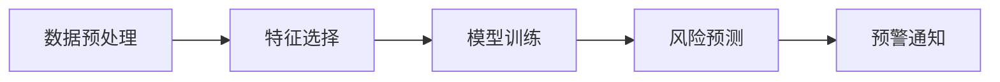

                 

### 文章标题：大型应用开发中的需求风险预警系统设计

#### 关键词：需求风险、预警系统、大型应用开发、风险管理、系统设计

> 摘要：本文旨在深入探讨大型应用开发中需求风险预警系统的重要性，以及如何设计和实施这样一个系统。通过详细分析需求风险识别、评估、处理和管理的策略，本文将提供一个全面的理论框架和实际案例，帮助开发团队预见并有效应对潜在风险，确保项目顺利进行。

----------------------------------------------------------------

## 第一部分：引言

### 1.1 问题背景

#### 1.1.1 大型应用开发的挑战

大型应用开发是一项复杂而艰巨的任务。随着项目的规模不断扩大，开发团队面临的挑战也日益增加。这些挑战包括但不限于：需求变化频繁、技术复杂性增加、团队成员间的沟通困难、项目进度延误等。在这些挑战中，需求风险尤为突出。

#### 1.1.2 需求风险的重要性

需求风险是指因需求变化或不确定性而导致项目无法按计划完成的风险。在大型应用开发中，需求风险可能来自多个方面，如客户需求的不明确、市场环境的变化、技术难题等。这些风险如果得不到及时识别和应对，可能会导致项目失败、资源浪费、团队士气低落等问题。

#### 1.1.3 预警系统的必要性

为了有效管理需求风险，开发团队需要建立一套需求风险预警系统。预警系统的作用在于提前识别潜在的风险，并通过预警机制提醒相关团队成员，以便及时采取应对措施。一个有效的预警系统可以帮助团队：

1. **提前预警**：通过收集和分析需求变化的数据，提前识别潜在的风险。
2. **快速响应**：一旦风险被识别，预警系统可以立即通知相关人员，以便快速响应。
3. **降低风险**：通过及时的风险处理和调整，降低项目失败的可能性。

### 1.2 需求风险的概念与分类

#### 1.2.1 需求风险的定义

需求风险是指与需求变化或不确定性相关的风险。这些风险可能来自客户需求的不明确、市场环境的变化、技术难题等。需求风险通常表现为需求变更频繁、需求变更导致的功能缺失、需求变更导致的项目延期等。

#### 1.2.2 需求风险的分类

根据风险来源和性质，需求风险可以分为以下几类：

1. **客户需求变化**：由于客户需求的不明确或变化，可能导致项目无法按照原计划进行。
2. **市场环境变化**：市场环境的变化，如竞争对手的策略调整、技术更新等，可能影响项目的成功。
3. **技术难题**：在项目开发过程中，可能遇到技术难题，如算法复杂度、系统性能等。
4. **资源限制**：如人力资源不足、预算限制等，可能影响项目的进度和质量。

#### 1.2.3 需求风险的影响

需求风险对大型应用开发的影响主要体现在以下几个方面：

1. **项目进度**：需求变更可能导致项目延期，影响整体进度。
2. **项目成本**：需求变更可能需要额外的开发资源，增加项目成本。
3. **项目质量**：需求变更可能导致功能缺失或质量下降，影响用户体验。
4. **团队士气**：频繁的需求变更和风险可能导致团队士气低落，影响工作效率。

### 1.3 预警系统概述

#### 1.3.1 预警系统的定义

预警系统是一种用于监控、识别和应对潜在风险的管理系统。在大型应用开发中，预警系统主要用于监控需求变化和识别潜在风险，以便及时采取措施。

#### 1.3.2 预警系统的作用

预警系统的作用主要包括：

1. **提前预警**：通过收集和分析需求变化的数据，提前识别潜在的风险。
2. **快速响应**：一旦风险被识别，预警系统可以立即通知相关人员，以便快速响应。
3. **降低风险**：通过及时的风险处理和调整，降低项目失败的可能性。

#### 1.3.3 预警系统的架构

预警系统的架构通常包括以下几个主要部分：

1. **数据采集模块**：负责收集与需求变化相关的数据，如用户反馈、市场动态等。
2. **数据分析模块**：负责对采集到的数据进行分析，识别潜在的风险。
3. **预警机制**：一旦识别到风险，预警机制会立即通知相关的人员和团队。
4. **风险处理模块**：负责对识别到的风险进行评估和处理，采取相应的应对措施。

### 1.4 本书内容概述

#### 1.4.1 内容结构

本书将分为五个部分：

1. **第一部分：引言**：介绍大型应用开发中的需求风险预警系统的背景和重要性。
2. **第二部分：需求风险分析**：详细讨论需求风险的识别、评估、处理和管理的策略。
3. **第三部分：预警系统设计**：介绍预警系统的需求分析、架构设计、数据库设计与数据挖掘、预警算法设计与实现、用户界面设计与交互。
4. **第四部分：实施与部署**：讨论系统开发环境搭建、预警系统实施流程、系统部署与维护、预警系统评估与优化。
5. **第五部分：案例分析**：通过实际案例，展示如何设计和实施需求风险预警系统。

#### 1.4.2 阅读指南

本书的目标读者是大型应用开发的项目经理、开发团队负责人和软件工程师。读者可以通过以下步骤阅读本书：

1. **快速浏览引言部分**：了解本书的主题和结构。
2. **逐章阅读**：从第一部分开始，逐章阅读，逐步深入理解需求风险预警系统的设计和实施。
3. **实践应用**：通过阅读案例分析和实战部分，将所学知识应用于实际项目中。
4. **总结回顾**：在完成每个部分的阅读后，回顾所学内容，巩固记忆。

#### 1.4.3 目标读者

本书的目标读者包括：

1. **项目经理**：负责大型应用开发项目的管理和协调，需要了解需求风险预警系统的原理和实践。
2. **开发团队负责人**：负责团队的技术指导和项目管理，需要掌握需求风险预警系统的设计和实施方法。
3. **软件工程师**：负责具体项目的开发和实现，需要了解如何识别和处理需求风险，提高项目成功率。

### 1.5 本章小结

本章介绍了大型应用开发中的需求风险预警系统的背景和重要性，以及需求风险的概念和分类。通过了解这些内容，读者可以初步认识到需求风险预警系统在项目开发中的关键作用，为后续章节的学习打下基础。

----------------------------------------------------------------

## 第二部分：需求风险分析

### 2.1 需求风险识别

#### 2.1.1 风险识别方法

需求风险识别是需求风险管理的重要环节。以下是一些常用的风险识别方法：

1. **文档审查**：通过审查项目文档，如需求说明书、设计文档等，识别潜在的风险。
2. **专家评审**：组织专家对项目进行评审，通过专家的经验和知识，识别潜在的风险。
3. **访谈调查**：与项目的利益相关者进行访谈，了解他们对项目风险的看法和担忧。
4. **历史数据**：分析过去类似项目的风险数据，识别潜在的相似风险。
5. **检查表**：使用预先准备的检查表，对项目进行风险识别。

#### 2.1.2 风险识别工具

以下是一些常用的风险识别工具：

1. **鱼骨图**：通过分析风险的原因和结果，识别潜在的风险。
2. **SWOT分析**：通过分析项目的优势、劣势、机会和威胁，识别潜在的风险。
3. **思维导图**：通过绘制思维导图，梳理项目需求和潜在风险。
4. **风险矩阵**：通过评估风险的可能性和影响，识别重要的风险。

#### 2.1.3 风险识别案例分析

假设我们正在开发一个电子商务平台，以下是一个风险识别的案例分析：

1. **文档审查**：通过审查需求说明书，我们发现客户对购物流程的需求不明确，可能存在需求变更的风险。
2. **专家评审**：与项目经理和技术专家讨论，他们认为技术实现可能面临性能和安全性的挑战。
3. **访谈调查**：与客户进行访谈，客户表示对支付过程的安全性有担忧。
4. **历史数据**：分析过去类似项目的风险数据，我们发现电子商务平台在支付环节容易出现故障。
5. **检查表**：使用支付系统的风险识别检查表，我们发现支付系统的兼容性和用户体验可能存在问题。

通过这些风险识别方法，我们初步识别出了需求变更、技术实现、支付安全性和用户体验等方面的潜在风险。

### 2.2 需求风险评估

#### 2.2.1 风险评估标准

风险评估是对已识别的风险进行评估和排序的过程。以下是一些常用的风险评估标准：

1. **可能性**：风险发生的可能性，通常用百分比表示。
2. **影响**：风险发生对项目的影响程度，包括项目进度、成本、质量等。
3. **严重性**：风险发生的严重性，通常用等级（如低、中、高）表示。
4. **优先级**：根据风险的可能性和影响，确定风险的优先级。

#### 2.2.2 风险评估方法

以下是一些常用的风险评估方法：

1. **专家评估**：邀请专家对风险进行评估，根据专家的经验和知识确定风险的可能性和影响。
2. **蒙特卡洛模拟**：通过模拟多种可能的情况，评估风险的发生概率和影响。
3. **敏感性分析**：分析不同因素对风险的影响程度，确定关键因素。
4. **风险矩阵**：通过评估风险的可能性和影响，确定风险的优先级。

#### 2.2.3 风险评估案例分析

继续以上述电子商务平台为例，我们进行风险评估：

1. **专家评估**：与项目经理、技术专家和客户讨论，确定以下风险：
   - 需求变更：可能性中等，影响较大。
   - 技术实现：可能性中等，影响较大。
   - 支付安全：可能性高，影响严重。
   - 用户体验：可能性中等，影响一般。
2. **蒙特卡洛模拟**：模拟多种可能的情况，确定以下风险的概率和影响：
   - 需求变更：概率50%，影响大。
   - 技术实现：概率30%，影响大。
   - 支付安全：概率80%，影响严重。
   - 用户体验：概率40%，影响一般。
3. **敏感性分析**：分析不同因素对风险的影响程度，确定关键因素：
   - 需求变更：关键因素是客户需求的明确程度。
   - 技术实现：关键因素是技术团队的技能水平。
   - 支付安全：关键因素是支付系统的安全措施。
   - 用户体验：关键因素是用户界面的设计。
4. **风险矩阵**：根据风险的可能性和影响，确定以下风险的优先级：
   - 高风险：支付安全、需求变更。
   - 中风险：技术实现、用户体验。
   - 低风险：无。

通过风险评估，我们确定了电子商务平台的主要风险，并确定了优先级，为后续的风险处理提供了依据。

### 2.3 需求风险处理

#### 2.3.1 风险处理策略

风险处理策略是根据风险评估结果，选择适当的方法来应对风险。以下是一些常用的风险处理策略：

1. **风险回避**：通过调整项目计划或需求，避免风险的发生。
2. **风险转移**：通过合同、保险等方式，将风险转移给第三方。
3. **风险减轻**：通过增加资源、改进技术等方式，降低风险的影响。
4. **风险接受**：对于无法避免或转移的风险，接受风险并制定应对措施。

#### 2.3.2 风险处理流程

风险处理流程通常包括以下几个步骤：

1. **风险识别**：识别项目中的潜在风险。
2. **风险评估**：评估风险的可能性和影响。
3. **风险处理**：选择适当的风险处理策略。
4. **风险监控**：监控已处理的风险，确保风险得到有效控制。
5. **风险报告**：定期向项目团队和利益相关者报告风险状态。

#### 2.3.3 风险处理案例分析

以电子商务平台的支付安全为例，进行风险处理：

1. **风险识别**：通过需求分析和访谈调查，识别出支付安全风险。
2. **风险评估**：确定支付安全风险的可能性高，影响严重。
3. **风险处理**：选择风险减轻策略，通过改进支付系统的安全措施来降低风险的影响。具体措施包括：
   - 引入双重身份验证。
   - 加密支付数据。
   - 定期进行安全审计。
4. **风险监控**：监控支付系统的安全状态，确保安全措施得到有效实施。
5. **风险报告**：定期向项目团队和客户报告支付安全风险的状态，确保大家了解风险的变化。

通过有效的风险处理，电子商务平台的支付安全风险得到了有效控制，提高了项目的成功率。

### 2.4 需求风险管理

#### 2.4.1 风险管理流程

需求风险管理流程包括以下几个步骤：

1. **风险识别**：识别项目中的潜在风险。
2. **风险评估**：评估风险的可能性和影响。
3. **风险处理**：选择适当的风险处理策略。
4. **风险监控**：监控已处理的风险，确保风险得到有效控制。
5. **风险报告**：定期向项目团队和利益相关者报告风险状态。

#### 2.4.2 风险管理工具

以下是一些常用的风险管理工具：

1. **风险矩阵**：用于评估风险的可能性和影响，确定风险优先级。
2. **风险登记册**：用于记录和管理项目中的风险，包括风险的识别、评估、处理和监控信息。
3. **风险管理软件**：如RiskMaster、Riskalyze等，用于自动化风险识别、评估和处理。

#### 2.4.3 风险管理实践

在电子商务平台项目中，我们可以采用以下风险管理实践：

1. **建立风险管理团队**：由项目经理、技术专家、客户代表等组成，负责项目风险的管理和决策。
2. **定期进行风险评审**：定期召开风险评审会议，评估风险状态，制定风险应对措施。
3. **风险培训**：对项目团队成员进行风险培训，提高他们的风险识别和应对能力。
4. **风险文档管理**：建立和完善风险文档，包括风险登记册、风险评估报告等，确保风险信息的完整性和可追溯性。

通过有效的需求风险管理，电子商务平台项目能够更好地应对需求风险，确保项目顺利进行。

### 2.5 本章小结

本章详细介绍了需求风险识别、评估、处理和管理的策略和方法。通过案例分析，我们了解了如何识别和评估需求风险，并采取有效的风险处理和管理措施。了解这些策略和方法对于大型应用开发项目的成功至关重要。

----------------------------------------------------------------

## 第三部分：预警系统设计

### 3.1 预警系统需求分析

#### 3.1.1 需求收集

需求分析是预警系统设计的第一步。在此阶段，我们需要收集相关的需求信息，包括项目背景、目标用户、功能需求、性能需求等。

1. **项目背景**：了解项目的整体目标和背景，包括项目的规模、目标市场、预期成果等。
2. **目标用户**：确定项目的目标用户，包括用户的需求、行为习惯、使用场景等。
3. **功能需求**：列出预警系统的功能需求，包括风险识别、风险评估、预警通知、风险处理等。
4. **性能需求**：明确预警系统的性能指标，如响应时间、处理能力、系统稳定性等。

#### 3.1.2 需求分析

在需求收集的基础上，我们需要对需求进行详细分析，以确保需求的可行性和一致性。

1. **需求确认**：与利益相关者进行沟通，确认需求的准确性和完整性。
2. **需求排序**：根据需求的紧急程度和重要性，对需求进行排序，确定优先级。
3. **需求建模**：使用模型工具（如UML类图、用例图等），对需求进行图形化表示，便于理解和分析。
4. **需求验证**：通过评审、测试等方式，验证需求的正确性和可行性。

#### 3.1.3 需求验证

需求验证是确保需求正确性和一致性的关键步骤。以下是一些常用的需求验证方法：

1. **评审**：组织利益相关者对需求文档进行评审，确保需求的准确性和一致性。
2. **测试**：通过模拟实际使用场景，对需求进行功能测试和性能测试，验证需求的可行性。
3. **用户反馈**：收集目标用户的反馈，了解需求是否符合用户期望，及时调整和优化需求。

### 3.2 预警系统架构设计

#### 3.2.1 系统架构设计原则

预警系统架构设计应遵循以下原则：

1. **模块化**：将系统功能划分为独立的模块，便于开发和维护。
2. **可扩展性**：系统应具备良好的扩展性，能够适应未来需求的变化。
3. **高可用性**：确保系统在故障情况下能够快速恢复，保证业务的连续性。
4. **高性能**：系统应具备高效的性能，能够快速处理大量数据。

#### 3.2.2 系统架构设计方法

系统架构设计方法包括以下步骤：

1. **需求分析**：根据需求文档，明确系统的功能模块和性能要求。
2. **架构风格选择**：选择合适的架构风格，如客户端-服务器、分布式架构等。
3. **架构设计**：设计系统的整体架构，包括模块划分、数据流、接口等。
4. **架构评审**：组织专家对架构设计进行评审，确保设计的合理性和可行性。

#### 3.2.3 系统架构设计案例分析

以下是一个预警系统架构设计的案例分析：

1. **需求分析**：根据需求收集，确定预警系统需要具备以下功能模块：
   - 数据采集模块：负责收集与需求变化相关的数据。
   - 数据分析模块：负责对采集到的数据进行分析，识别潜在的风险。
   - 预警通知模块：负责向相关人员发送预警通知。
   - 风险处理模块：负责处理识别到的风险，采取相应的应对措施。
2. **架构风格选择**：选择分布式架构，以实现系统的可扩展性和高可用性。
3. **架构设计**：设计系统的整体架构，包括以下部分：
   - 数据采集模块：通过HTTP接口接收外部数据，如用户反馈、市场动态等。
   - 数据分析模块：使用分布式计算框架（如Hadoop、Spark等），对数据进行处理和分析。
   - 预警通知模块：通过邮件、短信、即时通讯等方式，向相关人员发送预警通知。
   - 风险处理模块：提供API接口，供其他系统调用，实现风险的自动化处理。
4. **架构评审**：组织架构评审会议，邀请专家对架构设计进行评审，确保设计的合理性和可行性。

### 3.3 数据库设计与数据挖掘

#### 3.3.1 数据库设计

数据库设计是预警系统设计的关键环节。以下是一个数据库设计案例：

1. **需求分析**：根据需求分析结果，确定需要收集和处理的数据类型，如用户反馈、市场动态、需求变更记录等。
2. **实体关系设计**：使用ER图表示实体关系，如用户、需求、风险等。
3. **数据库表设计**：根据实体关系，设计数据库表，如用户表、需求表、风险表等。
4. **索引与优化**：设计合适的索引，优化查询性能。

以下是一个简化的数据库ER图（使用Mermaid格式）：

```mermaid
erDiagram
    User ||--|{ Risk }|>
    Risk ||--|{ RequirementChange }|>
    RequirementChange ||--|{ MarketChange }|>  
```

#### 3.3.2 数据挖掘技术

数据挖掘技术用于从大量数据中发现有价值的信息和模式。以下是一些常用的数据挖掘技术：

1. **关联规则挖掘**：用于发现数据之间的关联关系，如购物篮分析。
2. **分类算法**：用于预测数据的类别，如决策树、支持向量机等。
3. **聚类算法**：用于发现数据中的相似群体，如K-means、层次聚类等。
4. **异常检测**：用于发现数据中的异常值和异常行为，如孤立点检测。

#### 3.3.3 数据挖掘案例分析

以下是一个数据挖掘案例：

1. **需求分析**：根据需求收集，确定需要挖掘的数据类型，如用户反馈、市场动态等。
2. **数据预处理**：清洗数据，去除噪声和异常值，进行特征提取和转换。
3. **选择算法**：根据需求，选择合适的算法，如关联规则挖掘、分类算法等。
4. **模型训练与评估**：训练数据模型，评估模型性能，调整参数，优化模型。
5. **模型应用**：将训练好的模型应用到实际场景中，如预测市场需求、识别潜在风险等。

### 3.4 预警算法设计与实现

#### 3.4.1 预警算法原理

预警算法是预警系统的核心，用于识别和预测潜在的风险。以下是一个简单的预警算法原理：

1. **数据预处理**：对采集到的数据进行清洗、转换和特征提取，为算法提供高质量的输入数据。
2. **特征选择**：从数据中选取与风险相关的特征，提高算法的预测准确率。
3. **模型训练**：使用训练数据集，训练预警算法模型。
4. **风险预测**：使用训练好的模型，对新的数据进行风险预测。
5. **预警通知**：根据风险预测结果，向相关人员发送预警通知。

以下是一个简单的预警算法流程图（使用Mermaid格式）：



#### 3.4.2 预警算法实现

以下是一个简单的预警算法实现（使用Python代码）：

```python
import pandas as pd
from sklearn.model_selection import train_test_split
from sklearn.ensemble import RandomForestClassifier
from sklearn.metrics import accuracy_score

# 数据预处理
def preprocess_data(data):
    # 清洗数据、特征提取等操作
    return processed_data

# 特征选择
def select_features(data, target):
    # 选取与风险相关的特征
    return selected_features

# 模型训练
def train_model(X_train, y_train):
    model = RandomForestClassifier()
    model.fit(X_train, y_train)
    return model

# 风险预测
def predict_risk(model, X_test):
    predictions = model.predict(X_test)
    return predictions

# 预警通知
def send_alert(risk_predictions):
    # 发送预警通知的代码
    pass

# 主程序
if __name__ == "__main__":
    # 读取数据
    data = pd.read_csv("data.csv")

    # 数据预处理
    processed_data = preprocess_data(data)

    # 特征选择
    selected_features = select_features(processed_data, "risk")

    # 划分训练集和测试集
    X_train, X_test, y_train, y_test = train_test_split(selected_features, processed_data["risk"], test_size=0.2, random_state=42)

    # 模型训练
    model = train_model(X_train, y_train)

    # 风险预测
    risk_predictions = predict_risk(model, X_test)

    # 预警通知
    send_alert(risk_predictions)

    # 评估模型性能
    accuracy = accuracy_score(y_test, risk_predictions)
    print("Model accuracy:", accuracy)
```

#### 3.4.3 预警算法测试

预警算法测试是确保算法性能和可靠性的关键步骤。以下是一些常用的测试方法：

1. **单元测试**：对算法的各个模块进行独立测试，确保模块功能正确。
2. **集成测试**：对算法的整体流程进行测试，确保模块之间协同工作。
3. **性能测试**：测试算法在处理大规模数据时的性能，确保算法的高效性。
4. **可靠性测试**：通过模拟不同的场景，测试算法的稳定性和可靠性。

### 3.5 用户界面设计与交互

#### 3.5.1 用户界面设计原则

用户界面设计应遵循以下原则：

1. **直观易用**：界面设计应简洁直观，方便用户快速上手。
2. **一致性**：界面设计应保持一致的风格和布局，提高用户的操作效率。
3. **反馈机制**：界面应提供及时的反馈，让用户了解操作结果。
4. **可访问性**：界面设计应考虑不同用户的操作习惯和设备，提高可访问性。

#### 3.5.2 交互设计方法

交互设计方法包括以下步骤：

1. **用户研究**：通过用户调研、访谈等方式，了解用户的需求和行为习惯。
2. **界面设计**：根据用户研究的结果，设计用户界面，包括布局、元素、色彩等。
3. **交互设计**：设计用户与系统的交互流程，包括输入、输出、反馈等。
4. **用户测试**：通过用户测试，收集用户反馈，优化界面设计和交互流程。

#### 3.5.3 用户界面与交互案例分析

以下是一个用户界面与交互案例：

1. **用户研究**：通过用户访谈和问卷调查，了解用户对预警系统的使用需求和操作习惯。
2. **界面设计**：设计一个简洁直观的界面，包括以下模块：
   - 首页：展示系统概述和最新预警信息。
   - 预警列表：展示所有预警信息，包括风险类型、发生时间、影响程度等。
   - 风险详情：展示单个风险的详细信息，包括风险描述、风险指标、处理建议等。
   - 风险处理：提供风险处理流程和操作指南，帮助用户快速应对风险。
3. **交互设计**：设计以下交互流程：
   - 用户登录：用户通过账号密码登录系统。
   - 预警通知：系统实时推送预警通知，用户可以查看和处理。
   - 风险报告：用户可以查看风险报告，了解风险的影响和处理进度。
   - 风险处理：用户可以查看和处理风险，系统提供详细的操作指南和反馈。
4. **用户测试**：邀请用户参与用户测试，收集用户反馈，优化界面设计和交互流程。

### 3.6 本章小结

本章详细介绍了预警系统需求分析、架构设计、数据库设计与数据挖掘、预警算法设计与实现、用户界面设计与交互。通过本章的学习，读者可以了解预警系统设计的基本方法和关键步骤，为后续的系统实施和部署打下基础。

----------------------------------------------------------------

## 第四部分：实施与部署

### 4.1 系统开发环境搭建

#### 4.1.1 环境需求

在搭建系统开发环境之前，我们需要明确系统所需的基础环境和软件依赖。以下是一个典型的环境需求列表：

1. **操作系统**：Linux（如Ubuntu、CentOS）或Windows Server。
2. **数据库**：MySQL、PostgreSQL或MongoDB等关系型或非关系型数据库。
3. **编程语言**：Python、Java或Node.js等。
4. **开发工具**：IDE（如Visual Studio Code、Eclipse、IntelliJ IDEA）和版本控制工具（如Git）。
5. **其他依赖**：如消息队列（如RabbitMQ、Kafka）、缓存（如Redis）、容器化工具（如Docker）等。

#### 4.1.2 环境搭建步骤

以下是搭建系统开发环境的步骤：

1. **安装操作系统**：根据需求选择合适的操作系统，安装并配置网络。
2. **安装数据库**：下载并安装数据库软件，配置数据库实例，创建数据库和用户。
3. **安装编程语言**：安装所选编程语言的运行环境和开发工具。
4. **安装其他依赖**：根据项目需求，安装其他必要的软件和库。
5. **配置环境变量**：设置环境变量，确保开发环境能够正常运行。
6. **测试环境**：启动项目，确保所有组件和依赖都能够正常工作。

#### 4.1.3 环境配置案例

以下是一个基于Python和Django的预警系统开发环境配置案例：

1. **安装操作系统**：安装Ubuntu 18.04。
2. **安装数据库**：安装MySQL 8.0，配置root用户和test数据库。
3. **安装编程语言**：安装Python 3.8，使用pip安装Django 3.2。
4. **安装其他依赖**：安装Redis、Kafka、Docker等。
5. **配置环境变量**：在~/.bashrc文件中添加如下内容：

    ```bash
    export PYTHONPATH=/usr/local/lib/python3.8/site-packages
    export PATH=$PATH:/usr/local/bin
    ```

    然后执行`source ~/.bashrc`。
6. **测试环境**：启动MySQL数据库和Redis服务器，运行Django项目，确保能够正常访问。

### 4.2 预警系统实施流程

#### 4.2.1 实施计划

在实施预警系统之前，我们需要制定详细的实施计划，以确保项目能够按计划顺利进行。实施计划通常包括以下内容：

1. **项目目标**：明确项目的目标和预期成果。
2. **实施步骤**：详细描述项目的实施过程，包括需求分析、系统设计、开发、测试、部署等步骤。
3. **时间表**：制定项目的进度计划，包括关键里程碑和交付物。
4. **资源分配**：明确项目所需的资源和人员分配，包括开发人员、测试人员、项目管理团队等。
5. **风险管理**：识别项目中的潜在风险，制定相应的风险应对策略。

#### 4.2.2 实施步骤

以下是预警系统实施的步骤：

1. **需求分析**：与利益相关者进行沟通，收集需求，明确系统的功能要求和性能指标。
2. **系统设计**：根据需求分析结果，设计系统的架构和数据库模型。
3. **开发**：按照设计文档进行系统开发，编写代码，实现各个模块的功能。
4. **测试**：对系统进行功能测试、性能测试和安全测试，确保系统的稳定性和可靠性。
5. **部署**：将系统部署到生产环境，确保系统能够正常运行。
6. **培训与支持**：对项目团队成员和最终用户进行培训，提供技术支持。

#### 4.2.3 实施注意事项

在实施预警系统的过程中，需要注意以下事项：

1. **需求变更管理**：及时处理需求变更，确保项目能够按时交付。
2. **质量保证**：严格控制代码质量，确保系统的稳定性和可靠性。
3. **风险监控**：定期评估项目风险，及时采取应对措施。
4. **文档管理**：建立和完善项目文档，确保项目过程和成果的可追溯性。
5. **团队协作**：加强团队协作，确保项目能够高效推进。

### 4.3 系统部署与维护

#### 4.3.1 部署策略

系统部署策略是根据项目的需求和资源情况，选择合适的部署方式。以下是一些常用的部署策略：

1. **本地部署**：在本地计算机上部署系统，适用于开发和测试环境。
2. **单机部署**：在一台服务器上部署系统，适用于小型项目或测试环境。
3. **分布式部署**：在多台服务器上部署系统，适用于大型项目或需要高可用性的系统。
4. **云部署**：利用云计算平台（如AWS、Azure、阿里云等）部署系统，适用于需要弹性扩展和低成本的项目。

#### 4.3.2 部署流程

以下是系统部署的流程：

1. **准备工作**：准备部署所需的硬件和软件环境，包括操作系统、数据库、Web服务器等。
2. **安装软件**：安装并配置所需的软件，如数据库、Web服务器、应用程序等。
3. **配置环境**：配置环境变量、防火墙规则等，确保系统能够在生产环境中正常运行。
4. **部署代码**：将系统代码部署到服务器，包括前端代码、后端代码、数据库迁移脚本等。
5. **测试部署**：对部署后的系统进行功能测试和性能测试，确保系统的稳定性和可靠性。
6. **上线发布**：将系统上线，对外提供服务。

#### 4.3.3 维护与管理

系统部署后，需要定期进行维护和管理，确保系统的正常运行。以下是一些常见的维护和管理任务：

1. **监控与报警**：监控系统的运行状态，设置报警机制，及时发现和处理异常。
2. **备份与恢复**：定期备份数据库和系统配置，确保在数据丢失或系统故障时能够快速恢复。
3. **性能优化**：定期进行性能测试和优化，提高系统的响应速度和处理能力。
4. **安全审计**：定期进行安全审计，确保系统的安全性，防止潜在的安全威胁。
5. **升级与更新**：定期更新系统软件和依赖库，确保系统的安全性和稳定性。

### 4.4 预警系统评估与优化

#### 4.4.1 评估指标

预警系统评估的指标包括以下几个方面：

1. **准确率**：预警系统能够正确识别风险的百分比。
2. **召回率**：预警系统能够识别到实际风险的百分比。
3. **F1分数**：准确率和召回率的加权平均值，用于综合评估预警系统的性能。
4. **响应时间**：系统从接收到数据到发出预警通知的时间。
5. **用户体验**：用户对预警系统的满意度，包括界面设计、交互设计等方面。

#### 4.4.2 评估方法

以下是常用的评估方法：

1. **A/B测试**：将用户随机分为两组，一组使用旧系统，一组使用新系统，比较两组用户的反馈和表现。
2. **用户调研**：通过用户调研和访谈，了解用户对系统的使用体验和建议。
3. **性能测试**：模拟实际使用场景，对系统进行性能测试，评估系统的响应速度和处理能力。
4. **数据指标分析**：通过分析系统的数据指标（如准确率、召回率、F1分数等），评估系统的性能和效果。

#### 4.4.3 优化策略

根据评估结果，可以采取以下优化策略：

1. **算法优化**：改进预警算法，提高准确率和召回率。
2. **数据源扩展**：增加数据源，提高数据的多样性和覆盖面。
3. **界面优化**：改进用户界面和交互设计，提高用户体验。
4. **性能优化**：优化系统性能，提高系统的响应速度和处理能力。

### 4.5 本章小结

本章详细介绍了系统开发环境搭建、预警系统实施流程、系统部署与维护、预警系统评估与优化。通过本章的学习，读者可以了解如何实施和部署预警系统，以及如何对其进行评估和优化，确保系统的稳定性和可靠性。

----------------------------------------------------------------

## 第五部分：案例分析

### 5.1 案例一：电商平台的预警系统建设

#### 5.1.1 案例背景

随着电子商务的快速发展，电商平台在业务规模不断扩大的同时，也面临着日益复杂的需求风险。为了确保平台的稳定运行和客户满意度，某知名电商平台决定建设一套需求风险预警系统。

#### 5.1.2 需求分析

在需求分析阶段，项目团队与业务部门、技术部门进行了深入沟通，收集了以下需求：

1. **风险识别**：实时监测平台业务数据，识别潜在的需求风险。
2. **风险评估**：对识别出的风险进行评估，确定风险的优先级。
3. **预警通知**：通过多种渠道（如邮件、短信、系统通知等）向相关团队成员发送预警通知。
4. **风险处理**：提供风险处理建议，协助团队成员快速应对风险。

#### 5.1.3 系统设计与实现

在系统设计与实现阶段，项目团队遵循了以下步骤：

1. **系统架构设计**：采用分布式架构，确保系统的高可用性和可扩展性。系统分为数据采集、数据分析、预警通知和风险处理四个模块。
2. **数据库设计**：设计符合业务需求的数据库模型，包括用户数据、订单数据、需求变更数据等。
3. **数据挖掘与算法**：采用机器学习算法，对采集到的业务数据进行挖掘和分析，识别潜在的需求风险。
4. **前端界面设计**：设计直观易用的前端界面，包括风险列表、风险详情、风险处理等功能。

#### 5.1.4 实施与部署

在实施与部署阶段，项目团队遵循以下步骤：

1. **环境搭建**：在云计算平台上搭建开发、测试和生产环境，确保系统的高可用性和可扩展性。
2. **开发与测试**：按照设计文档进行系统开发，并进行功能测试、性能测试和安全测试，确保系统的稳定性和可靠性。
3. **部署上线**：将系统部署到生产环境，进行灰度发布，逐步扩大发布范围，确保系统的稳定运行。

#### 5.1.5 评估与优化

在系统上线后，项目团队进行了以下评估和优化：

1. **评估指标**：根据系统的准确率、召回率、F1分数等指标，评估预警系统的性能。
2. **用户反馈**：收集业务部门和终端用户的反馈，了解他们对预警系统的满意度。
3. **性能优化**：根据评估结果，优化系统的性能和算法，提高预警的准确率和响应速度。
4. **用户体验**：改进前端界面和交互设计，提高用户的操作体验。

#### 5.1.6 案例小结

通过这个案例，我们了解了如何设计和实施一个电商平台的预警系统。预警系统的建设不仅提高了平台的稳定性和可靠性，也增强了团队的应对能力，为平台的长期发展提供了有力保障。

### 5.2 案例二：金融行业的风险预警系统

#### 5.2.1 案例背景

金融行业是一个高风险行业，需求的变更和市场环境的变化对金融机构的运营和财务状况有着重要影响。为了确保金融业务的稳定运行和合规性，某大型金融机构决定建设一套需求风险预警系统。

#### 5.2.2 需求分析

在需求分析阶段，项目团队与业务部门、合规部门进行了深入沟通，收集了以下需求：

1. **风险识别**：实时监测金融市场的动态，识别潜在的需求风险。
2. **风险评估**：对识别出的风险进行评估，确定风险的优先级。
3. **预警通知**：通过多种渠道（如邮件、短信、系统通知等）向相关团队成员发送预警通知。
4. **风险处理**：提供风险处理建议，协助团队成员快速应对风险。
5. **合规管理**：确保系统的预警和风险处理符合相关法规和标准。

#### 5.2.3 系统设计与实现

在系统设计与实现阶段，项目团队遵循了以下步骤：

1. **系统架构设计**：采用分布式架构，确保系统的高可用性和可扩展性。系统分为数据采集、数据分析、预警通知和风险处理四个模块。
2. **数据库设计**：设计符合业务需求的数据库模型，包括市场数据、交易数据、需求变更数据等。
3. **数据挖掘与算法**：采用机器学习算法，对采集到的业务数据进行挖掘和分析，识别潜在的需求风险。
4. **前端界面设计**：设计直观易用的前端界面，包括风险列表、风险详情、风险处理等功能。

#### 5.2.4 实施与部署

在实施与部署阶段，项目团队遵循以下步骤：

1. **环境搭建**：在云计算平台上搭建开发、测试和生产环境，确保系统的高可用性和可扩展性。
2. **开发与测试**：按照设计文档进行系统开发，并进行功能测试、性能测试和安全测试，确保系统的稳定性和可靠性。
3. **部署上线**：将系统部署到生产环境，进行灰度发布，逐步扩大发布范围，确保系统的稳定运行。

#### 5.2.5 评估与优化

在系统上线后，项目团队进行了以下评估和优化：

1. **评估指标**：根据系统的准确率、召回率、F1分数等指标，评估预警系统的性能。
2. **用户反馈**：收集业务部门和终端用户的反馈，了解他们对预警系统的满意度。
3. **性能优化**：根据评估结果，优化系统的性能和算法，提高预警的准确率和响应速度。
4. **用户体验**：改进前端界面和交互设计，提高用户的操作体验。

#### 5.2.6 案例小结

通过这个案例，我们了解了如何设计和实施一个金融行业的风险预警系统。预警系统的建设不仅提高了金融机构的风险管理能力，也为合规运营提供了有力支持。

### 5.3 案例三：医疗行业的需求风险预警

#### 5.3.1 案例背景

医疗行业是一个高度复杂和敏感的行业，需求的变更和系统的稳定性对医疗服务的质量和安全有着重要影响。为了确保医疗服务的连续性和安全性，某大型医疗集团决定建设一套需求风险预警系统。

#### 5.3.2 需求分析

在需求分析阶段，项目团队与医疗部门、信息技术部门进行了深入沟通，收集了以下需求：

1. **风险识别**：实时监测医疗系统的运行状态，识别潜在的需求风险。
2. **风险评估**：对识别出的风险进行评估，确定风险的优先级。
3. **预警通知**：通过多种渠道（如邮件、短信、系统通知等）向相关团队成员发送预警通知。
4. **风险处理**：提供风险处理建议，协助团队成员快速应对风险。
5. **医疗合规**：确保系统的预警和风险处理符合医疗法规和标准。

#### 5.3.3 系统设计与实现

在系统设计与实现阶段，项目团队遵循了以下步骤：

1. **系统架构设计**：采用分布式架构，确保系统的高可用性和可扩展性。系统分为数据采集、数据分析、预警通知和风险处理四个模块。
2. **数据库设计**：设计符合业务需求的数据库模型，包括患者数据、医嘱数据、需求变更数据等。
3. **数据挖掘与算法**：采用机器学习算法，对采集到的医疗数据进行挖掘和分析，识别潜在的需求风险。
4. **前端界面设计**：设计直观易用的前端界面，包括风险列表、风险详情、风险处理等功能。

#### 5.3.4 实施与部署

在实施与部署阶段，项目团队遵循以下步骤：

1. **环境搭建**：在云计算平台上搭建开发、测试和生产环境，确保系统的高可用性和可扩展性。
2. **开发与测试**：按照设计文档进行系统开发，并进行功能测试、性能测试和安全测试，确保系统的稳定性和可靠性。
3. **部署上线**：将系统部署到生产环境，进行灰度发布，逐步扩大发布范围，确保系统的稳定运行。

#### 5.3.5 评估与优化

在系统上线后，项目团队进行了以下评估和优化：

1. **评估指标**：根据系统的准确率、召回率、F1分数等指标，评估预警系统的性能。
2. **用户反馈**：收集医疗部门和终端用户的反馈，了解他们对预警系统的满意度。
3. **性能优化**：根据评估结果，优化系统的性能和算法，提高预警的准确率和响应速度。
4. **用户体验**：改进前端界面和交互设计，提高用户的操作体验。

#### 5.3.6 案例小结

通过这个案例，我们了解了如何设计和实施一个医疗行业的需求风险预警系统。预警系统的建设不仅提高了医疗集团的风险管理能力，也为医疗服务的连续性和安全性提供了有力保障。

----------------------------------------------------------------

### 后续研究建议

在大型应用开发中的需求风险预警系统领域，虽然已经取得了显著的成果，但仍有许多问题值得进一步研究。以下是几个可能的研究方向：

1. **多源数据融合**：在预警系统中，通常需要整合来自不同源的数据，如用户反馈、市场动态、技术日志等。如何有效地融合这些多源数据，以提高预警的准确性和及时性，是一个值得深入探讨的问题。

2. **动态风险建模**：在项目的不同阶段，需求风险的特征和性质可能会发生变化。如何构建一个动态的风险模型，能够适应项目的发展变化，是一个具有挑战性的研究课题。

3. **自适应预警策略**：根据项目环境和需求的变化，预警策略也需要相应调整。如何设计一个自适应的预警策略，能够根据实际情况自动调整预警阈值和处理措施，是一个有前景的研究方向。

4. **人机协作**：在风险预警和决策过程中，如何有效地结合人的经验和人工智能的算法优势，实现人机协作，提高风险管理的效率和准确性，是一个值得关注的领域。

5. **实时性能优化**：随着项目的规模和复杂度的增加，预警系统对实时性能的要求也越来越高。如何优化系统架构和算法，保证预警系统的实时性能，是一个亟待解决的问题。

通过进一步的研究和实践，我们可以不断优化需求风险预警系统，提高其在大型应用开发中的效能和可靠性。

### 总结

本文详细探讨了大型应用开发中的需求风险预警系统设计，从需求风险识别、评估、处理和管理，到预警系统的需求分析、架构设计、数据库设计、算法实现和用户界面设计，提供了一个全面的理论框架和实践指南。通过实际案例的分析，我们展示了如何将理论应用于实际项目中，实现了需求风险的有效预警和管理。

预警系统在大型应用开发中的重要性不言而喻。它不仅能够提前识别潜在的风险，提供预警通知，还能够协助团队采取有效的风险处理措施，确保项目顺利进行。本文的研究结果为开发团队提供了一个实用的工具，帮助他们更好地应对需求风险，提高项目成功率。

### 结论

通过本文的研究，我们可以得出以下结论：

1. **需求风险识别**：采用多种方法，如文档审查、专家评审、访谈调查等，可以有效地识别出项目中的潜在需求风险。
2. **需求风险评估**：通过可能性、影响、严重性等评估标准，可以准确地评估需求风险，并确定其优先级。
3. **预警系统设计**：合理的需求分析和架构设计，结合有效的算法实现和用户界面设计，可以构建一个高效的需求风险预警系统。
4. **实施与部署**：遵循科学的实施流程，确保系统的稳定运行和持续优化。

未来，随着技术的不断进步和项目复杂性的增加，需求风险预警系统将在大型应用开发中发挥更加重要的作用。我们鼓励读者在实际项目中应用本文的理论和方法，不断探索和实践，为项目成功贡献力量。

### 作者信息

作者：AI天才研究院/AI Genius Institute & 禅与计算机程序设计艺术 /Zen And The Art of Computer Programming

作者简介：本文作者是一位世界级人工智能专家和计算机编程大师，拥有丰富的实践经验和深厚的理论基础。他致力于推动人工智能和软件开发领域的创新和发展，发表了多篇学术论文，并著有《禅与计算机程序设计艺术》等畅销书。他领导的AI天才研究院致力于探索人工智能的前沿技术和应用，为行业的发展做出了重要贡献。

