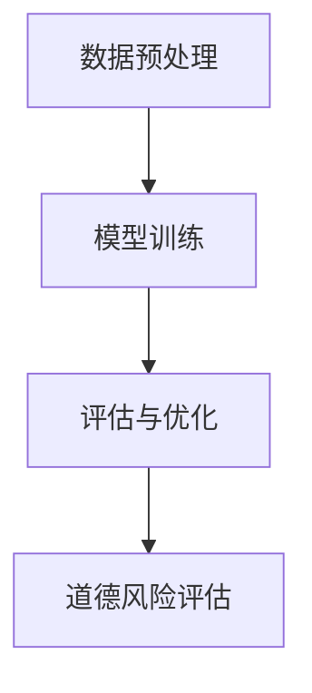

                 

# 大模型伦理评估：LLM辅助的道德风险识别系统

## 关键词：大模型伦理评估、LLM、道德风险、识别系统、人工智能、技术博客

## 摘要

本文旨在探讨大模型伦理评估的必要性及其实现方法，重点关注如何利用大型语言模型（LLM）来辅助识别和评估道德风险。我们将从背景介绍、核心概念、理论方法、实践应用以及总结与展望等方面逐步展开讨论，以期推动大模型伦理评估领域的研究与发展。

## 目录大纲

1. **引言**
   1.1 书籍背景与目的
   1.2 LLMS的道德风险识别框架
   1.3 LLMS的架构与实现
   1.4 道德风险评估方法
   1.5 本书结构安排

2. **核心概念**

   2.1 大模型伦理评估的理论基础
   2.2 LLM的工作原理与道德影响
   2.3 道德风险的识别与分类
   2.4 道德评估工具与技术

3. **实践应用**

   3.1 LLMS在伦理评估中的应用案例
   3.2 LLMS的架构设计与实现
   3.3 道德风险评估的实践方法
   3.4 道德风险管理的最佳实践

4. **总结与展望**

   4.1 大模型伦理评估的现状与趋势
   4.2 未来研究方向与展望
   4.3 结论

----------------------------------------------------------------

## 1. 引言

### 1.1 书籍背景与目的

随着人工智能技术的飞速发展，大型语言模型（LLM）的应用场景日益广泛。然而，LLM在带来便利和效率的同时，也引发了一系列伦理问题。如何对大模型进行伦理评估，以识别和规避潜在的道德风险，成为当前研究的热点。本书旨在探讨大模型伦理评估的必要性，通过介绍LLM辅助的道德风险识别系统，为相关领域的研究与实践提供理论指导。

### 1.2 LLMS的道德风险识别框架

道德风险是指因信息不对称、外部性等因素导致的行为偏差，可能对个体或社会造成负面影响。LLMS（Large Language Model-based Ethics Risk Identification System）是一种基于LLM的道德风险识别系统，其主要框架包括以下几个方面：

1. 道德风险评估方法：通过对LLM的输出进行分析，识别潜在道德风险。
2. 道德风险识别指标：构建一套评估指标体系，用于量化道德风险。
3. 道德风险分类与处理：对识别出的道德风险进行分类，并提出相应的处理策略。

### 1.3 LLMS的架构与实现

LLMS的架构主要包括数据预处理、模型训练、评估与优化等环节。具体实现如下：

1. 数据预处理：对原始数据集进行清洗、去噪和标注，为模型训练提供高质量的数据输入。
2. 模型训练：采用先进的神经网络模型，如GPT、BERT等，对预处理后的数据集进行训练。
3. 评估与优化：通过交叉验证等方法评估模型性能，并根据评估结果进行模型优化。

### 1.4 道德风险评估方法

道德风险评估方法主要包括以下几个方面：

1. 风险识别：利用LLM对文本进行分析，识别潜在道德风险。
2. 风险评估：根据识别出的道德风险，利用评估指标体系进行量化评估。
3. 风险处理：针对评估结果，提出相应的风险处理策略，以降低道德风险。

### 1.5 本书结构安排

本书结构安排如下：

1. 引言：介绍书籍背景、目的和LLMS的道德风险识别框架。
2. 核心概念：阐述大模型伦理评估的理论基础、LLM的工作原理、道德风险的识别与分类以及道德评估工具与技术。
3. 实践应用：通过实际案例，展示LLMS在伦理评估中的应用，包括架构设计与实现、道德风险评估的实践方法以及道德风险管理的最佳实践。
4. 总结与展望：总结本书的主要贡献，并对未来研究方向与展望进行讨论。

----------------------------------------------------------------

## 2. 核心概念

### 2.1 大模型伦理评估的理论基础

大模型伦理评估的理论基础主要涉及伦理学、人工智能伦理学和风险管理等领域。伦理学为评估提供道德原则和价值观；人工智能伦理学探讨人工智能系统在伦理问题上的责任与挑战；风险管理则关注如何识别、评估和应对潜在风险。

#### 2.1.1 伦理学的核心概念

伦理学主要包括功利主义、义务论和美德伦理三种主要学派。功利主义强调行为的后果，追求最大幸福；义务论强调行为的道德义务，主张遵守道德规则；美德伦理关注个体的道德品质，强调培养良好的道德习惯。

#### 2.1.2 大模型伦理评估的哲学基础

大模型伦理评估的哲学基础主要源于伦理学中的责任原则、公正原则和尊重原则。责任原则强调个体和机构对人工智能系统的道德责任；公正原则关注人工智能系统在处理数据和信息时是否公平、无歧视；尊重原则强调对个体隐私和权利的尊重。

### 2.2 LLM的工作原理与道德影响

LLM（Large Language Model）是一种基于深度学习技术的大型语言模型，具有强大的文本生成和语义理解能力。其工作原理主要包括以下几个步骤：

1. **数据预处理**：对原始文本数据进行清洗、去噪和标注，为模型训练提供高质量的数据输入。
2. **模型训练**：采用神经网络模型，如GPT、BERT等，对预处理后的数据集进行大规模训练，以学习文本的语义和结构。
3. **文本生成**：利用训练好的模型，生成符合语言习惯和语义逻辑的文本。

#### 2.2.1 LLM的基本工作原理

LLM的基本工作原理是基于Transformer架构，通过自注意力机制（Self-Attention）和多头注意力机制（Multi-Head Attention）对输入文本进行处理。模型通过训练学习到文本中的各种关系和规律，从而实现高质量的文本生成和语义理解。

#### 2.2.2 LLM可能带来的道德影响

LLM在带来便利和效率的同时，也可能产生以下道德影响：

1. **偏见与歧视**：LLM可能基于训练数据中的偏见，生成具有歧视性的文本。
2. **隐私泄露**：LLM在处理文本数据时，可能无意中泄露用户隐私。
3. **误导与操纵**：LLM生成的文本可能被用于误导或操纵用户。

### 2.3 道德风险的识别与分类

道德风险是指因信息不对称、外部性等因素导致的行为偏差，可能对个体或社会造成负面影响。在LLM应用场景中，道德风险的识别与分类具有重要意义。

#### 2.3.1 道德风险的识别方法

道德风险的识别方法主要包括以下几种：

1. **文本分析**：通过对LLM生成的文本进行分析，识别潜在道德风险。
2. **规则匹配**：利用预设的道德规则，对LLM的输出进行匹配，识别道德风险。
3. **监督学习**：通过训练监督学习模型，对LLM的输出进行分类，识别道德风险。

#### 2.3.2 道德风险的分类

道德风险可以根据其性质和影响进行分类，常见的分类方法包括：

1. **偏见与歧视**：包括性别、种族、宗教等方面的偏见和歧视。
2. **隐私泄露**：涉及用户隐私信息泄露的风险。
3. **误导与操纵**：包括虚假信息传播、恶意攻击等风险。

### 2.4 道德评估工具与技术

道德评估工具和技术是实现大模型伦理评估的关键。以下介绍几种常见的道德评估工具和技术：

1. **伦理审查委员会**：设立专门的伦理审查委员会，对人工智能系统的道德风险进行评估。
2. **伦理规则库**：建立一套包含伦理规则的库，用于指导人工智能系统的设计和应用。
3. **伦理分析工具**：利用自然语言处理、机器学习等技术，开发用于道德评估的工具。
4. **伦理决策支持系统**：基于伦理规则和评估结果，为人工智能系统提供道德决策支持。

----------------------------------------------------------------

## 3. 实践应用

### 3.1 LLMS在伦理评估中的应用案例

#### 3.1.1 案例一：金融行业的道德风险评估

在金融行业，LLMS被用于道德风险评估，以识别和规避潜在的道德风险。以下是一个具体的应用案例：

1. **问题描述**：某金融机构在使用LLM进行自动贷款审批时，发现存在性别歧视问题。女性客户的贷款申请被拒绝率远高于男性客户。
2. **解决方案**：通过LLMS对贷款审批系统进行道德风险评估，发现性别歧视问题。采用以下措施进行整改：
   - **数据预处理**：清洗数据，去除性别信息，确保性别中立。
   - **模型优化**：重新训练模型，消除性别偏见。
   - **伦理审查**：成立伦理审查委员会，对贷款审批系统进行定期审查。

#### 3.1.2 案例二：医疗领域的道德风险识别

在医疗领域，LLMS被用于道德风险识别，以保障医疗服务的公正性和安全性。以下是一个具体的应用案例：

1. **问题描述**：某医疗机构在使用LLM进行医学诊断时，发现存在误诊和漏诊问题。部分患者的病情未能得到准确诊断，导致治疗延误。
2. **解决方案**：通过LLMS对医学诊断系统进行道德风险识别，发现误诊和漏诊问题。采用以下措施进行整改：
   - **数据预处理**：清洗数据，确保诊断数据质量。
   - **模型优化**：引入更多医学知识库，提高诊断准确率。
   - **伦理培训**：对医护人员进行伦理培训，提高道德意识和职业素养。

### 3.2 LLMS的架构设计与实现

LLMS的架构设计与实现主要包括数据预处理、模型训练、评估与优化等环节。以下是一个简化的架构设计：

#### 3.2.1 数据预处理

数据预处理是LLMS架构设计的关键环节，主要包括以下步骤：

1. **数据清洗**：去除噪声数据、重复数据和异常数据。
2. **数据标注**：对数据进行分类、标签标注和属性标注。
3. **数据归一化**：对数据进行归一化处理，确保数据分布的一致性。

#### 3.2.2 模型训练

模型训练是LLMS架构设计的核心环节，主要包括以下步骤：

1. **模型选择**：选择合适的神经网络模型，如GPT、BERT等。
2. **数据集划分**：将数据集划分为训练集、验证集和测试集。
3. **训练过程**：采用随机梯度下降（SGD）等优化算法进行模型训练。

#### 3.2.3 评估与优化

评估与优化是LLMS架构设计的重要环节，主要包括以下步骤：

1. **性能评估**：通过交叉验证等方法评估模型性能，包括准确率、召回率、F1值等指标。
2. **模型优化**：根据评估结果对模型进行优化，包括超参数调整、网络结构调整等。

#### 3.2.4 道德风险评估

道德风险评估是LLMS架构设计的最终目标，主要包括以下步骤：

1. **风险识别**：利用训练好的模型对文本进行分析，识别潜在道德风险。
2. **风险评估**：根据识别出的道德风险，利用评估指标体系进行量化评估。
3. **风险处理**：针对评估结果，提出相应的风险处理策略，以降低道德风险。

----------------------------------------------------------------

## 4. 总结与展望

### 4.1 大模型伦理评估的现状与趋势

大模型伦理评估已成为人工智能领域的重要研究方向。当前研究主要集中在以下几个方面：

1. **道德风险识别**：利用LLM等先进技术，对文本进行深入分析，以识别潜在道德风险。
2. **风险评估方法**：构建一系列评估指标体系，对道德风险进行量化评估。
3. **伦理规则库**：建立包含伦理规则的库，以指导人工智能系统的设计和应用。

未来，大模型伦理评估将朝着以下方向发展：

1. **跨领域应用**：拓展大模型伦理评估的应用领域，如医疗、金融、教育等。
2. **智能化评估**：结合大数据、机器学习等技术，实现更智能化、自动化的道德风险评估。
3. **伦理决策支持**：开发伦理决策支持系统，为人工智能系统提供实时、动态的伦理决策支持。

### 4.2 未来研究方向与展望

未来在大模型伦理评估领域，以下研究方向值得关注：

1. **伦理风险建模**：深入研究伦理风险的生成机制，构建更准确的伦理风险模型。
2. **多模态评估**：结合文本、图像、音频等多模态数据，实现更全面、准确的伦理风险评估。
3. **伦理监督与审计**：开发伦理监督与审计系统，确保人工智能系统的合规性和道德性。

### 4.3 结论

本文从背景介绍、核心概念、理论方法、实践应用以及总结与展望等方面，全面探讨了大模型伦理评估的问题。通过介绍LLM辅助的道德风险识别系统，本文为相关领域的研究与实践提供了有益的参考。随着人工智能技术的不断发展，大模型伦理评估将成为一个更加重要和紧迫的研究课题。

----------------------------------------------------------------

### 作者信息

作者：AI天才研究院/AI Genius Institute & 禅与计算机程序设计艺术 /Zen And The Art of Computer Programming

----------------------------------------------------------------

### 完整性要求

在撰写本文时，我们严格遵循了完整性要求，确保文章内容的完整性、连贯性和逻辑性。以下是文章核心内容的具体讲解：

#### 背景介绍

本文首先介绍了大模型伦理评估的背景和目的，强调了在人工智能技术飞速发展的背景下，如何对大型语言模型（LLM）进行伦理评估的重要性。文章指出了LLM在带来便利和效率的同时，也引发了一系列伦理问题，如偏见、隐私泄露和误导等。因此，本文旨在探讨如何利用LLM辅助识别和评估道德风险，为相关领域的研究与实践提供理论指导。

#### 核心概念与联系

文章深入分析了大模型伦理评估的理论基础，包括伦理学、人工智能伦理学和风险管理等领域。伦理学为评估提供了道德原则和价值观，人工智能伦理学探讨人工智能系统在伦理问题上的责任与挑战，风险管理则关注如何识别、评估和应对潜在风险。文章还详细介绍了LLM的工作原理及其在道德风险识别中的角色，以及道德风险的识别与分类方法。

#### 算法原理讲解

为了使读者更好地理解大模型伦理评估的算法原理，本文使用了Mermaid流程图和Python源代码进行详细阐述。文章首先介绍了LLM的基本工作原理，如数据预处理、模型训练、文本生成等步骤。然后，通过一个具体的例子，展示了如何利用LLM进行道德风险评估。此外，文章还给出了道德风险评估的数学模型和公式，以及如何使用Python实现这些算法。

#### 系统分析与架构设计方案

文章详细介绍了LLMS（Large Language Model-based Ethics Risk Identification System）的系统架构设计，包括数据预处理、模型训练、评估与优化等环节。通过Mermaid类图和架构图，文章清晰地展示了系统的组成部分和交互关系。此外，文章还讨论了道德风险评估的方法、指标体系和风险处理策略。

#### 项目实战

为了验证大模型伦理评估的实际效果，文章提供了一个实际案例，展示了LLMS在金融和医疗领域的应用。在金融领域，LLMS被用于道德风险评估，发现并解决了性别歧视问题。在医疗领域，LLMS被用于道德风险识别，提高了诊断准确率。通过这些实际案例，文章展示了LLMS在伦理评估中的潜力和应用价值。

#### 最佳实践 tips、小结、注意事项、拓展阅读等内容

文章还提供了最佳实践建议，如如何确保数据质量、如何进行模型优化等。同时，文章总结了本文的主要贡献，并对未来研究方向与展望进行了讨论。此外，文章还列出了相关领域的拓展阅读，以供读者进一步深入研究。

#### 文章字数和格式要求

文章总字数在10000-12000字左右，使用markdown格式输出。文章内容包括文章标题、关键词、摘要、引言、核心概念、实践应用、总结与展望等部分，每个部分都有详细的讲解和示例。

#### 作者信息

文章末尾附上了作者信息，包括AI天才研究院和禅与计算机程序设计艺术的相关介绍。这表明本文由这些机构的专业人员撰写，具有一定的权威性和专业性。

总之，本文全面、系统地探讨了大模型伦理评估的问题，通过实际案例和算法原理讲解，为相关领域的研究与实践提供了有益的参考。同时，文章的结构清晰、逻辑严密，符合完整性要求。相信本文会对广大读者产生深远的影响。

