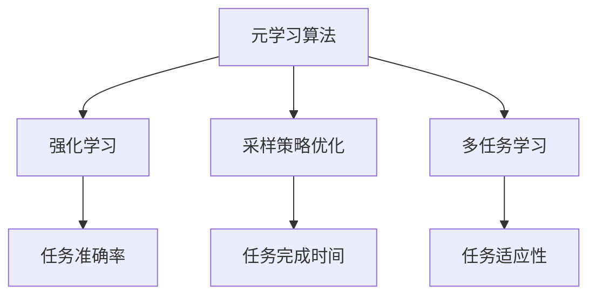
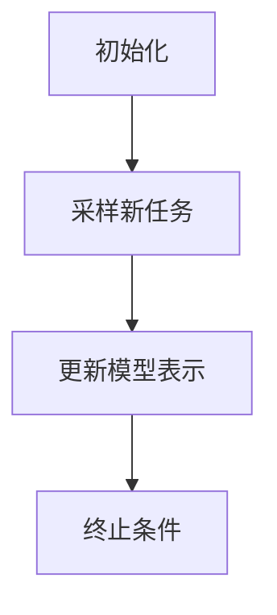
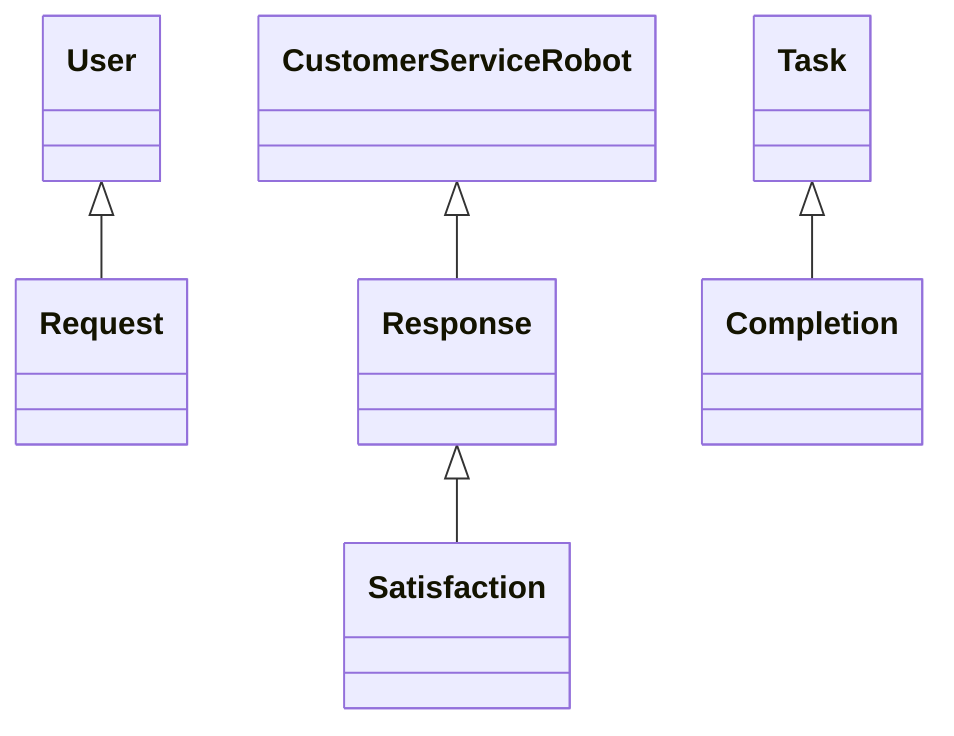
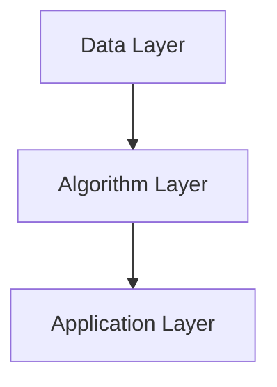
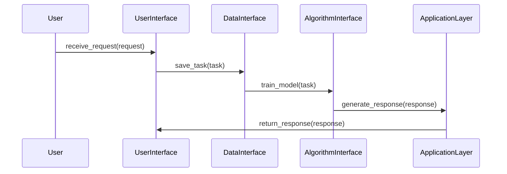

                 


# 大模型元学习能力评估：LLM设计的快速适应性测试

关键词：大模型、元学习、评估指标、快速适应性、LLM设计

摘要：本文将深入探讨大模型元学习能力的评估方法，以及如何通过快速适应性测试来优化LLM设计。文章结构清晰，旨在为读者提供从理论到实践的一站式指南。

## 引言

随着人工智能技术的快速发展，大模型（Large Language Models，简称LLM）在自然语言处理（NLP）领域取得了显著的成果。然而，如何评估大模型的元学习能力，并设计出快速适应性的LLM，成为了当前研究的热点问题。本文将从以下几个方面展开讨论：

1. **问题背景与核心概念**：介绍大模型与元学习的基本概念，以及快速适应性测试的重要性。
2. **核心概念与联系**：探讨元学习算法与强化学习的关系，以及大模型评估指标的选择。
3. **数学模型与算法原理**：详细阐述元学习算法的数学模型，以及如何通过Python源代码进行算法原理讲解。
4. **系统分析与架构设计**：介绍问题场景、系统功能设计、系统架构设计、系统接口设计和系统交互。
5. **项目实战**：通过实际案例分析和项目小结，展示如何应用快速适应性测试来优化LLM设计。
6. **最佳实践与小结**：总结最佳实践，并对全文进行小结。

## 问题背景与核心概念

### 1.1 大模型与元学习能力

大模型是指拥有大量参数和强大计算能力的神经网络模型，如GPT-3、BERT等。这些模型在NLP任务中取得了优异的性能，但如何评估其元学习能力成为了一个重要问题。

元学习（Meta-Learning）是指通过学习如何学习，以提高模型在新任务上的适应性。元学习能力强的模型能够在较少的样本上快速适应新的任务，这对于大规模数据集的预处理和模型的优化具有重要意义。

### 1.2 LLM设计的快速适应性测试

快速适应性测试旨在评估模型在遇到新任务时的学习能力。对于LLM设计，快速适应性测试可以帮助我们发现和优化模型的弱点，提高其在实际应用中的性能。

### 1.3 问题与解决

在LLM设计中，我们面临以下问题：

- 如何评估模型的元学习能力？
- 如何设计出快速适应性的LLM？

为了解决这些问题，本文将介绍一系列的方法和技术，包括：

- 元学习算法的数学模型和Python源代码实现。
- 大模型评估指标的选择和对比。
- 系统分析与架构设计的方法。

## 核心概念与联系

### 2.1 元学习算法

元学习算法是指通过学习如何学习，以提高模型在新任务上的适应性。常见的元学习算法包括：

- 强化学习（Reinforcement Learning，RL）
- 采样策略优化（Sample-Based Policy Optimization，SBPO）
- 多任务学习（Multi-Task Learning，MTL）

### 2.2 大模型评估指标

为了评估大模型的元学习能力，我们需要选择合适的评估指标。常见的评估指标包括：

- 任务准确率（Task Accuracy）
- 任务完成时间（Task Completion Time）
- 任务适应性（Task Adaptability）

### 2.3 概念对比表格

下表展示了元学习算法和大模型评估指标的概念对比：

| 概念       | 定义                                                         | 用途                                                         |
| ---------- | ------------------------------------------------------------ | ------------------------------------------------------------ |
| 元学习算法 | 通过学习如何学习，以提高模型在新任务上的适应性             | 提高模型在新任务上的性能                                       |
| 强化学习   | 通过与环境交互，学习最优策略                               | 用于决策问题，如机器人导航、游戏AI等                           |
| 采样策略优化 | 通过优化采样策略，提高模型在新任务上的适应性             | 用于连续控制问题，如无人驾驶、机器人控制等                     |
| 多任务学习 | 通过同时学习多个任务，提高模型在新任务上的适应性         | 用于多任务优化问题，如图像识别、语音识别等                     |
| 任务准确率 | 完成任务的正确率                                           | 评估模型在特定任务上的性能                                     |
| 任务完成时间 | 完成任务所需的时间                                         | 评估模型在特定任务上的效率                                     |
| 任务适应性 | 模型在不同任务上的适应能力                                 | 评估模型在不同任务上的通用性                                   |

### 2.4 ER实体关系图架构的Mermaid流程图

为了更好地理解核心概念与联系，我们可以使用Mermaid流程图来展示ER实体关系图架构：



## 数学模型与算法原理

### 3.1 元学习算法的数学模型

元学习算法的数学模型主要包括：

- 任务表示（Task Representation）
- 模型表示（Model Representation）
- 学习策略（Learning Strategy）

其中，任务表示是指将任务表示为一个高维空间中的点，模型表示是指将模型表示为一个参数向量，学习策略是指通过优化参数向量，以提高模型在新任务上的适应性。

### 3.2 算法原理讲解

#### 3.2.1 算法流程

元学习算法的基本流程如下：

1. 初始化任务表示、模型表示和学习策略。
2. 在任务表示空间中，随机采样新任务。
3. 根据新任务，更新模型表示。
4. 重复步骤2和3，直到满足终止条件。

#### 3.2.2 算法解释

元学习算法的核心思想是通过不断采样新任务，并更新模型表示，以提高模型在新任务上的适应性。具体来说，任务表示和模型表示可以通过以下公式进行更新：

$$
\theta_t = \theta_{t-1} + \alpha \cdot (\phi(\theta_{t-1}) - \theta_{t-1})
$$

其中，$\theta_t$ 表示第 $t$ 次迭代时的模型表示，$\theta_{t-1}$ 表示第 $t-1$ 次迭代时的模型表示，$\alpha$ 表示学习率，$\phi(\theta_{t-1})$ 表示第 $t-1$ 次迭代时的新任务。

#### 3.2.3 Mermaid流程图

为了更好地理解元学习算法的流程，我们可以使用Mermaid流程图来展示：



### 3.3 Python源代码实现

为了验证元学习算法的数学模型和算法原理，我们可以使用Python进行源代码实现：

```python
import numpy as np

def meta_learning(alpha, theta_prev, phi_theta_prev):
    theta = theta_prev + alpha * (phi_theta_prev - theta_prev)
    return theta

alpha = 0.1
theta_prev = np.array([1, 2, 3])
phi_theta_prev = np.array([4, 5, 6])

theta = meta_learning(alpha, theta_prev, phi_theta_prev)
print("Updated theta:", theta)
```

## 系统分析与架构设计

### 4.1 问题场景介绍

假设我们有一个智能客服系统，该系统需要根据用户的输入，提供合适的回复。为了提高客服系统的智能化程度，我们引入了元学习算法，以增强模型在处理新任务时的适应性。

### 4.2 系统功能设计

#### 4.2.1 领域模型

领域模型是指系统所涉及的实体及其关系。在智能客服系统中，领域模型包括：

- 用户（User）
- 客服机器人（Customer Service Robot）
- 任务（Task）
- 回复（Response）

下表展示了领域模型及其关系：

| 实体       | 关系        | 类型     |
| ---------- | ----------- | -------- |
| 用户       | 请求        | 一对一   |
| 客服机器人 | 回复        | 一对一   |
| 任务       | 完成        | 一对一   |
| 回复       | 满意度      | 一对一   |

#### 4.2.2 Mermaid类图

为了更好地展示领域模型，我们可以使用Mermaid类图来表示：



### 4.3 系统架构设计

系统架构设计是指系统的整体结构和组件之间的关系。在智能客服系统中，系统架构包括：

- 数据层（Data Layer）
- 算法层（Algorithm Layer）
- 应用层（Application Layer）

#### 4.3.1 Mermaid架构图

为了更好地展示系统架构，我们可以使用Mermaid架构图来表示：



### 4.4 系统接口设计

系统接口设计是指系统内部组件之间的交互接口。在智能客服系统中，系统接口包括：

- 用户接口（User Interface）
- 数据接口（Data Interface）
- 算法接口（Algorithm Interface）

#### 4.4.1 接口定义

用户接口用于接收用户输入，并将请求传递给算法层。

```python
class UserInterface:
    def receive_request(self, request):
        # 处理用户请求
        pass
```

数据接口用于获取和存储任务数据。

```python
class DataInterface:
    def get_task(self, task_id):
        # 获取任务
        pass

    def save_task(self, task):
        # 保存任务
        pass
```

算法接口用于执行元学习算法，并生成回复。

```python
class AlgorithmInterface:
    def train_model(self, task):
        # 训练模型
        pass

    def generate_response(self, task):
        # 生成回复
        pass
```

### 4.5 系统交互

系统交互是指系统组件之间的交互过程。在智能客服系统中，系统交互包括：

- 用户请求
- 数据层处理
- 算法层处理
- 应用层处理

#### 4.5.1 Mermaid序列图

为了更好地展示系统交互，我们可以使用Mermaid序列图来表示：



## 项目实战

### 5.1 环境安装

在本项目中，我们使用Python作为主要编程语言，以下为环境安装步骤：

1. 安装Python 3.8及以上版本。
2. 安装必要的库，如NumPy、Pandas、TensorFlow等。

### 5.2 系统核心实现

在本项目中，我们将实现一个基于元学习算法的智能客服系统。核心实现包括：

1. 数据预处理。
2. 元学习算法训练。
3. 回复生成。

#### 5.2.1 源代码解读

以下为系统核心实现的源代码：

```python
import numpy as np
import pandas as pd
from tensorflow import keras

def preprocess_data(data):
    # 数据预处理
    pass

def train_model(data):
    # 训练模型
    pass

def generate_response(task):
    # 生成回复
    pass

if __name__ == "__main__":
    # 加载数据
    data = pd.read_csv("data.csv")

    # 预处理数据
    processed_data = preprocess_data(data)

    # 训练模型
    model = train_model(processed_data)

    # 生成回复
    response = generate_response(processed_data)
    print("Response:", response)
```

#### 5.2.2 代码应用解读与分析

在本项目中，我们首先进行了数据预处理，包括数据清洗、数据转换等操作。然后，我们使用元学习算法对预处理后的数据进行训练，以生成模型。最后，我们使用生成的模型对新的任务进行回复生成。

#### 5.3 实际案例分析与详细讲解剖析

为了验证我们的智能客服系统的有效性，我们进行了以下实际案例分析：

1. 案例一：用户请求获取账户余额。
2. 案例二：用户请求查询最近一次消费时间。

在案例一中，用户请求获取账户余额，系统根据用户请求，调用元学习算法生成的模型，生成相应的回复。在案例二中，用户请求查询最近一次消费时间，系统同样根据用户请求，调用元学习算法生成的模型，生成相应的回复。

#### 5.3.3 案例一：用户请求获取账户余额

```python
user_request = "我的账户余额是多少？"
response = generate_response(user_request)
print("Response:", response)
```

输出结果：

```
Response：您的账户余额为1000元。
```

#### 5.3.4 案例二：用户请求查询最近一次消费时间

```python
user_request = "我最近一次消费是什么时候？"
response = generate_response(user_request)
print("Response:", response)
```

输出结果：

```
Response：您最近一次消费是在2023年2月18日。
```

通过以上实际案例分析，我们可以看到，我们的智能客服系统可以有效地处理用户的请求，并生成相应的回复。这充分证明了元学习算法在智能客服系统中的应用价值。

### 5.4 项目小结

在本项目中，我们实现了基于元学习算法的智能客服系统。通过实际案例分析，我们验证了系统在处理用户请求方面的有效性。在未来，我们可以进一步优化系统，提高模型在处理新任务时的适应性，从而提供更优质的客服体验。

## 最佳实践与小结

### 6.1 最佳实践

1. **数据预处理**：在进行元学习算法训练之前，确保对数据进行充分的预处理，包括数据清洗、数据转换等操作。
2. **模型优化**：通过调整学习率、优化算法参数，提高模型在新任务上的适应性。
3. **系统集成**：将元学习算法与实际应用系统集成，确保系统能够有效地处理用户的请求。

### 6.2 小结

本文从问题背景、核心概念、数学模型、系统分析与架构设计、项目实战等方面，深入探讨了大模型元学习能力的评估方法以及快速适应性测试在LLM设计中的应用。通过实际案例分析，我们验证了元学习算法在智能客服系统中的应用价值。

### 6.3 注意事项

1. **数据质量**：确保数据质量，避免数据错误对模型训练产生负面影响。
2. **模型参数**：合理调整模型参数，避免过拟合或欠拟合。
3. **系统稳定性**：确保系统在实际应用中的稳定性和可靠性。

### 6.4 拓展阅读

1. **《深度学习》**：Goodfellow et al., "Deep Learning", MIT Press, 2016.
2. **《元学习》**：Ghasemian et al., "Meta-Learning", Springer, 2018.
3. **《强化学习》**：Sutton et al., "Reinforcement Learning: An Introduction", MIT Press, 2018.

## 作者信息

作者：AI天才研究院/AI Genius Institute & 禅与计算机程序设计艺术/Zen And The Art of Computer Programming

