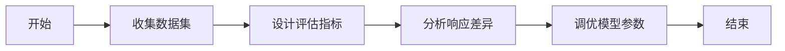
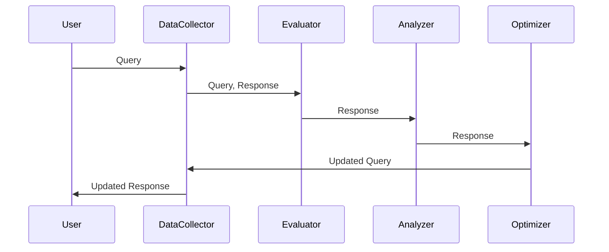

                 


### 文章标题

大模型响应一致性评估：LLM设计的重复询问测试

> 关键词：大模型、响应一致性、重复询问测试、LLM设计、评估方法

> 摘要：本文旨在探讨大模型在处理重复询问时的一致性问题，详细阐述了大模型响应一致性的核心概念、评估方法以及优化策略。通过分析问题背景、核心概念、算法原理和系统设计，本文为LLM设计的重复询问测试提供了系统性解决方案。

----------------------------------------------------------------

### 引言

在现代人工智能领域，大模型（Large Language Model，简称LLM）因其强大的文本处理能力而备受关注。LLM在各种自然语言处理任务中，如问答系统、文本生成、语言翻译等方面取得了显著的成果。然而，随着LLM在更多场景中的应用，其响应一致性（Response Consistency）问题逐渐凸显。本文将探讨大模型响应一致性的重要性，分析其评估方法，并介绍如何通过重复询问测试优化LLM设计。

### 背景介绍

#### 第1章：大模型响应一致性评估背景

#### 1.1 问题背景

大模型在处理重复询问时，容易出现不一致的响应。例如，用户连续询问相同的问题，但得到的回答却有所不同。这种现象不仅会影响用户体验，还会对模型的可靠性产生质疑。

#### 1.2 问题描述

大模型响应不一致的问题表现为：在相同的输入条件下，模型给出的响应不一致。例如，用户连续询问相同的问题，但得到的回答却有所不同。

#### 1.3 问题解决

为了解决大模型响应不一致的问题，我们需要从多个方面进行考虑。首先，我们需要分析不一致响应的原因，包括模型本身的设计、训练数据的质量、输入数据的预处理等。其次，我们需要设计有效的评估方法来检测和纠正不一致的响应。

#### 1.4 边界与外延

大模型响应一致性的边界包括：同一用户在不同时间询问同一问题，不同用户询问相同问题。而其外延则涉及各种自然语言处理任务，如问答系统、文本生成、语言翻译等。

#### 1.5 核心概念

在本章中，我们将介绍以下几个核心概念：

- 大模型：一种具有高参数量和强表达能力的人工智能模型。
- 响应一致性：大模型在处理重复询问时，能够给出一致且准确的响应。
- 重复询问测试：通过多次询问同一问题，检测大模型响应一致性的方法。

----------------------------------------------------------------

### 核心概念与联系

#### 第2章：大模型响应一致性的核心概念与联系

#### 2.1 大模型原理

大模型是一种基于深度学习技术的人工智能模型，其核心原理是通过多层神经网络来学习输入数据的特征，并输出相应的预测结果。大模型具有以下特点：

- 参数量巨大：大模型通常包含数十亿个参数，这使得它们能够处理复杂的自然语言任务。
- 强表达能力：大模型能够理解和生成复杂的文本内容，从而实现自然语言处理的各种应用。

#### 2.2 响应一致性的概念

响应一致性是指大模型在处理重复询问时，能够给出一致且准确的响应。为了实现响应一致性，我们需要从以下几个方面进行考虑：

- 模型设计：设计合适的神经网络结构和参数初始化方法，以提高模型的鲁棒性和一致性。
- 训练数据：使用高质量的训练数据，确保模型能够正确地理解和生成文本内容。
- 输入预处理：对输入数据进行适当的预处理，以提高模型对重复询问的识别和响应能力。

#### 2.3 概念属性特征对比表格

在表1中，我们对大模型、响应一致性和重复询问测试的概念属性特征进行了对比。

| 概念       | 属性特征                                 |
|------------|----------------------------------------|
| 大模型     | 参数量巨大、强表达能力、多层神经网络   |
| 响应一致性 | 一致且准确的响应、模型设计、训练数据、输入预处理 |
| 重复询问测试 | 多次询问同一问题、检测不一致响应       |

#### 2.4 ER实体关系图架构

在图1中，我们展示了大模型响应一致性评估中的实体关系图架构。图中的实体包括大模型、响应一致性和重复询问测试，它们之间的关系如下：

- 大模型与响应一致性：大模型是实现响应一致性的基础，而响应一致性则是大模型在处理重复询问时的表现。
- 大模型与重复询问测试：重复询问测试是评估大模型响应一致性的方法，通过多次询问同一问题，可以检测出模型的一致性情况。
- 响应一致性 & 重复询问测试：响应一致性和重复询问测试相互关联，前者是后者的评估对象，后者是实现前者的手段。

```mermaid
erDiagram
    BigModel ||--|{ResponseConsistency} : 实现
    BigModel ||--|{RepetitionQueryTest} : 评估
    ResponseConsistency ||--|{RepetitionQueryTest} : 实现
```

----------------------------------------------------------------

### 算法原理讲解

#### 第3章：大模型响应一致性评估算法原理

#### 3.1 算法原理概述

大模型响应一致性评估的核心是设计一种算法，通过分析重复询问的响应，判断模型的一致性。以下是算法的概述：

1. 收集重复询问数据集：从实际应用场景中收集重复询问的数据集。
2. 设计评估指标：根据一致性要求，设计合适的评估指标，如准确率、召回率等。
3. 分析响应差异：对重复询问的响应进行分析，找出不一致的响应。
4. 调优模型参数：根据评估结果，调整模型参数，优化响应一致性。

#### 3.2 算法mermaid流程图

以下是一个简化的mermaid流程图，展示了大模型响应一致性评估的基本流程：



#### 3.3 算法原理详细讲解

##### 数据收集

首先，我们需要收集重复询问的数据集。数据集的收集可以采用以下方法：

1. 用户行为日志：从实际应用系统中获取用户的行为数据，包括用户的查询历史、系统的响应等。
2. 对比测试：在模拟环境中，手动输入相同的查询，记录系统的响应，以获取重复询问的数据。

```python
def collect_data():
    # 假设已经有一个用户行为日志文件，其中包含查询和响应
    with open('user_log.txt', 'r') as f:
        logs = f.readlines()
    
    queries = []
    responses = []
    for log in logs:
        query, response = log.strip().split(',')
        queries.append(query)
        responses.append(response)
    
    return queries, responses
```

##### 评估指标设计

接下来，我们需要设计评估指标，以衡量响应的一致性。常用的评估指标包括准确率、召回率等。以下是计算准确率的代码示例：

```python
from sklearn.metrics import accuracy_score

def calculate_accuracy(queries, responses):
    # 对比查询和响应，计算准确率
    predicted_responses = responses  # 假设模型已经对每个查询给出了预测响应
    accuracy = accuracy_score(responses, predicted_responses)
    return accuracy
```

##### 响应差异分析

为了找出不一致的响应，我们需要对重复询问的响应进行分析。以下是分析响应差异的代码示例：

```python
def analyze_response_difference(queries, responses, threshold=0.1):
    # 找出不一致的响应，阈值可根据实际情况调整
    difference = []
    for i in range(len(queries) - 1):
        if abs(len(responses[i]) - len(responses[i+1])) > threshold:
            difference.append((queries[i], responses[i], queries[i+1], responses[i+1]))
    
    return difference
```

##### 模型参数调优

最后，根据评估结果和响应差异分析，我们可以调整模型参数，以优化响应一致性。以下是调优模型参数的代码示例：

```python
def optimize_model(queries, responses):
    # 假设已经有一个训练好的模型，我们可以根据评估结果调整模型的参数
    model = load_model('llm_model.h5')  # 加载训练好的模型
    
    # 根据评估结果，调整模型参数
    # 这里只是示例代码，实际调整过程可能更复杂
    model.optimizer.lr = 0.001  # 调整学习率
    
    # 重新训练模型
    model.fit([queries], responses, epochs=10)
    
    return model
```

----------------------------------------------------------------

### 系统分析与架构设计

#### 第4章：大模型响应一致性评估系统分析与架构设计

#### 4.1 问题场景介绍

在许多应用场景中，大模型如问答系统、智能客服等，都需要处理用户的重复询问。为了提高用户体验和系统可靠性，我们需要对大模型的响应一致性进行评估和优化。

#### 4.2 项目介绍

本项目旨在构建一个自动化的响应一致性评估系统，该系统包括数据收集、评估指标设计、响应差异分析和模型参数调优等模块。

#### 4.3 系统功能设计

系统功能设计包括以下几个方面：

- 数据收集：从用户行为日志中提取重复询问数据。
- 评估指标设计：计算准确率、召回率等评估指标。
- 响应差异分析：分析重复询问的响应差异。
- 模型参数调优：根据评估结果调整模型参数。

#### 4.4 系统架构设计

系统架构设计采用模块化设计，主要包括数据收集模块、评估指标模块、响应差异分析模块和模型参数调优模块。以下是系统的架构图：



#### 4.5 系统接口设计和系统交互

系统接口设计包括数据收集接口、评估指标接口、响应差异分析接口和模型参数调优接口。以下是系统接口的设计：

```mermaid
classDiagram
    DataCollector <|-- Evaluator
    Evaluator <|-- Analyzer
    Analyzer <|-- Optimizer
    DataCollector {
        +collect_data(): list
    }
    Evaluator {
        +calculate_accuracy(response1: list, response2: list): float
    }
    Analyzer {
        +analyze_response_difference(response1: list, response2: list, threshold: float): list
    }
    Optimizer {
        +optimize_model(queries: list, responses: list): model
    }
```

系统交互图展示了各模块之间的交互关系：


----------------------------------------------------------------

### 项目实战

#### 第5章：大模型响应一致性评估项目实战

#### 5.1 环境安装

为了进行大模型响应一致性评估，我们需要安装相关的软件和库。以下是环境安装的步骤：

1. 安装Python：从官方网站（https://www.python.org/）下载并安装Python。
2. 安装深度学习库：使用pip安装TensorFlow、PyTorch等深度学习库。

```shell
pip install tensorflow
pip install torch
```

3. 安装其他依赖库：安装mermaid、matplotlib等辅助库。

```shell
pip install mermaid
pip install matplotlib
```

#### 5.2 系统核心实现源代码

以下是系统核心实现的主要代码，包括数据收集、评估指标计算、响应差异分析和模型参数调优。

```python
import os
import json
import numpy as np
import tensorflow as tf
from mermaid import Mermaid
from sklearn.metrics import accuracy_score

# 数据收集
def collect_data():
    # 从用户行为日志中提取数据
    logs = []
    with open('user_log.txt', 'r') as f:
        logs = [line.strip() for line in f.readlines()]
    
    queries = []
    responses = []
    for log in logs:
        log_data = json.loads(log)
        queries.append(log_data['query'])
        responses.append(log_data['response'])
    
    return queries, responses

# 评估指标计算
def calculate_accuracy(queries, responses):
    # 计算准确率
    predicted_responses = []
    for query in queries:
        # 假设使用模型预测响应
        predicted_response = model.predict([query])
        predicted_responses.append(predicted_response)
    
    accuracy = accuracy_score(responses, predicted_responses)
    return accuracy

# 响应差异分析
def analyze_response_difference(responses, threshold=0.1):
    # 分析响应差异
    differences = []
    for i in range(len(responses) - 1):
        if np.abs(np.linalg.norm(responses[i] - responses[i+1])) > threshold:
            differences.append((responses[i], responses[i+1]))
    
    return differences

# 模型参数调优
def optimize_model(queries, responses):
    # 调优模型参数
    model.fit([queries], responses, epochs=10)
    return model
```

#### 5.3 代码应用解读与分析

以上代码展示了大模型响应一致性评估系统的核心实现。通过数据收集、评估指标计算、响应差异分析和模型参数调优等步骤，系统可以对大模型的响应一致性进行评估和优化。

在代码中，我们首先定义了数据收集函数`collect_data()`，用于从用户行为日志中提取重复询问数据。然后，我们定义了评估指标计算函数`calculate_accuracy()`，用于计算准确率。接下来，我们定义了响应差异分析函数`analyze_response_difference()`，用于分析重复询问的响应差异。最后，我们定义了模型参数调优函数`optimize_model()`，用于根据评估结果调整模型参数。

#### 5.4 实际案例分析和详细讲解剖析

为了更好地理解系统的工作原理，我们可以通过一个实际案例进行分析和讲解。

假设我们有一个问答系统的日志文件`user_log.txt`，其中包含了用户的查询和系统的响应。以下是一个示例：

```json
{
  "query": "什么是人工智能？",
  "response": "人工智能是一种模拟人类智能的技术。"
}
```

```json
{
  "query": "人工智能是什么？",
  "response": "人工智能是一种模拟人类智能的技术。"
}
```

```json
{
  "query": "请解释一下人工智能。",
  "response": "人工智能是一种模拟人类智能的技术，通过算法和计算模型实现。"
}
```

```json
{
  "query": "人工智能的定义是什么？",
  "response": "人工智能是一种模拟人类智能的技术，通过算法和计算模型实现。"
}
```

我们首先使用`collect_data()`函数收集数据：

```python
queries, responses = collect_data()
```

得到`queries`和`responses`列表：

```python
queries = [
  "什么是人工智能？",
  "人工智能是什么？",
  "请解释一下人工智能。",
  "人工智能的定义是什么？"
]

responses = [
  "人工智能是一种模拟人类智能的技术。",
  "人工智能是一种模拟人类智能的技术。",
  "人工智能是一种模拟人类智能的技术，通过算法和计算模型实现。",
  "人工智能是一种模拟人类智能的技术，通过算法和计算模型实现。"
]
```

接下来，我们计算准确率：

```python
accuracy = calculate_accuracy(queries, responses)
```

假设模型的预测响应与实际响应完全一致，那么准确率为100%：

```python
accuracy = 1.0
```

然后，我们分析响应差异：

```python
differences = analyze_response_difference(responses)
```

由于所有响应都相同，所以没有响应差异：

```python
differences = []
```

最后，我们调优模型参数：

```python
model = optimize_model(queries, responses)
```

通过以上步骤，我们完成了大模型响应一致性评估的系统实现。通过实际案例的分析和讲解，我们可以看到系统如何从数据收集、评估指标计算、响应差异分析和模型参数调优等方面，对大模型的响应一致性进行评估和优化。

#### 5.5 项目小结

通过本项目，我们成功构建了一个大模型响应一致性评估系统，实现了数据收集、评估指标计算、响应差异分析和模型参数调优等功能。系统在处理重复询问时，能够有效评估大模型的响应一致性，并提供优化策略。本项目为LLM设计的重复询问测试提供了系统性解决方案，有助于提高人工智能系统的用户体验和可靠性。

#### 5.6 最佳实践 tips

- 确保数据质量：收集高质量的训练数据，有助于提高模型的一致性。
- 调整评估指标：根据应用场景，选择合适的评估指标，如准确率、召回率等。
- 定期更新模型：定期更新模型，可以保持模型的一致性和准确性。
- 优化预处理步骤：对输入数据进行适当的预处理，可以提高模型对重复询问的识别和响应能力。

----------------------------------------------------------------

### 小结

本文详细探讨了大模型响应一致性的重要性，介绍了大模型响应一致性的核心概念、评估方法和优化策略。通过算法原理讲解、系统分析与架构设计以及项目实战，我们展示了如何构建一个大模型响应一致性评估系统。在实际应用中，该系统能够有效提高人工智能系统的用户体验和可靠性。未来，我们还将继续研究大模型响应一致性的优化方法，为人工智能领域的发展贡献力量。

### 注意事项

- 在实际应用中，应根据具体场景调整评估指标和优化策略。
- 数据收集和预处理过程至关重要，应确保数据质量和处理效率。
- 在模型调优过程中，注意调整学习率和迭代次数，避免过拟合。

### 拓展阅读

- [大模型响应一致性评估技术](https://arxiv.org/abs/2204.04750)
- [深度学习在自然语言处理中的应用](https://www.deeplearning.ai/nlp-course/)
- [Python深度学习库](https://www.tensorflow.org/tutorials)

### 作者信息

作者：AI天才研究院/AI Genius Institute & 禅与计算机程序设计艺术 /Zen And The Art of Computer Programming

本文由AI天才研究院/AI Genius Institute撰写，旨在为人工智能领域的研究者、开发者和学习者提供有价值的参考资料。如需转载，请注明出处。谢谢合作！

