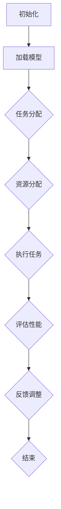
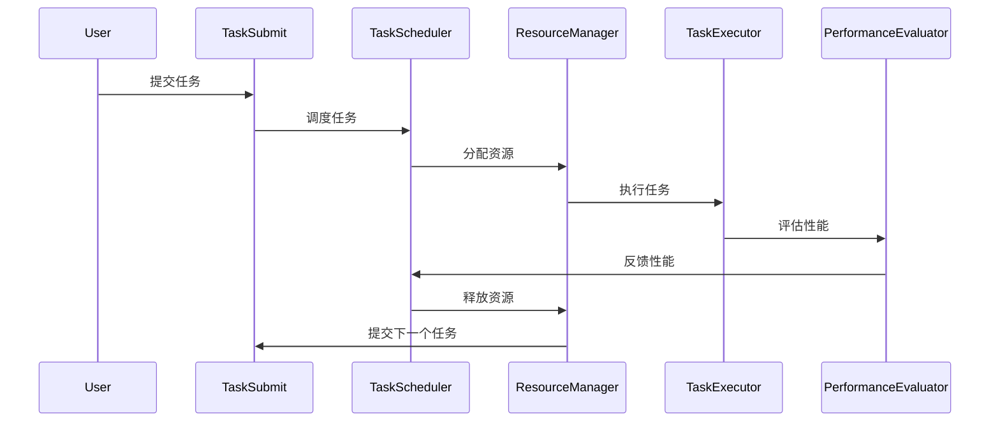

                 


# 大模型多任务协调能力评估：LLM设计的并行测试

> 关键词：大模型，多任务协调，评估方法，并行测试，LLM

> 摘要：本文将深入探讨大模型在多任务协调能力方面的评估，通过介绍大模型的发展背景、多任务协调能力的定义及评估方法，详细讲解评估过程中的核心概念与联系，并提供实际的算法原理讲解、系统分析与架构设计方案，最终通过项目实战展示评估方法的应用。

## 前言

### 内容与目标

本文旨在对大模型多任务协调能力进行深入评估，以期为相关领域的研究者和开发者提供有价值的参考。随着人工智能技术的快速发展，大模型在各个领域中的应用越来越广泛，如何有效评估其多任务协调能力成为了一个重要课题。

### 目标读者

本文的目标读者是人工智能领域的研究人员、开发者以及对于大模型多任务协调能力感兴趣的读者。通过本文的阅读，读者可以了解大模型多任务协调能力评估的核心概念、方法和应用。

### 书籍结构

本文分为八个章节，具体结构如下：

1. 前言
2. 大模型多任务协调能力概述
3. 核心概念与联系
4. 算法原理讲解
5. 系统分析与架构设计
6. 项目实战
7. 最佳实践 tips、小结、注意事项、拓展阅读
8. 目录大纲

### 阅读建议

为了更好地理解本文内容，建议读者按照以下步骤阅读：

1. 首先，快速浏览前言，了解本文的主要内容和目标。
2. 然后，逐步阅读每个章节，深入理解大模型多任务协调能力的评估方法和应用。
3. 在阅读过程中，注意重点概念和算法原理的讲解，结合实际项目案例进行分析。
4. 最后，结合最佳实践 tips 和拓展阅读，巩固所学知识，拓展视野。

## 背景介绍

### 1.1 大模型的发展背景

大模型（Large Models）是近年来人工智能领域的一个重要发展方向。随着大数据和高性能计算技术的发展，大模型在自然语言处理、计算机视觉、语音识别等领域取得了显著的成果。大模型通常具有数百万甚至数亿个参数，可以通过学习大量数据来提高任务的性能。

#### 1.1.1 人工智能与大数据

人工智能（Artificial Intelligence，AI）是指模拟、延伸和扩展人的智能的理论、方法、技术及应用。大数据（Big Data）是指无法在一定时间内用常规软件工具进行捕捉、管理和处理的数据集合。人工智能与大数据的结合，使得大模型成为可能。

#### 1.1.2 大模型的兴起

大模型的兴起源于深度学习（Deep Learning）的快速发展。深度学习是一种基于多层神经网络的人工智能技术，具有强大的表示和学习能力。通过增加神经网络的层数和参数量，大模型能够捕捉数据中的复杂模式和规律。

#### 1.1.3 多任务协调能力的重要性

在人工智能应用中，大模型通常需要同时处理多个任务，如图像识别、文本分类、语音识别等。多任务协调能力（Multi-Task Coordination Ability）是指大模型在同时处理多个任务时的能力。良好的多任务协调能力可以提高大模型的性能和效率，具有重要的应用价值。

### 1.2 多任务协调能力的定义

多任务协调能力是指大模型在同时处理多个任务时的协调、协作和优化能力。它包括以下几个方面：

#### 1.2.1 协调能力的概念

协调能力是指大模型在处理多个任务时，能够有效地分配资源、调整策略，以实现任务之间的协同效应。良好的协调能力可以减少任务的相互干扰，提高整体性能。

#### 1.2.2 多任务协调能力的特点

多任务协调能力具有以下特点：

- **动态性**：大模型在处理多个任务时，需要根据任务的重要性和紧急程度动态调整资源分配和策略。
- **适应性**：大模型需要能够适应不同的任务环境和需求，灵活调整协调策略。
- **效率性**：良好的多任务协调能力可以提高大模型的整体效率和性能。

#### 1.2.3 多任务协调能力的分类

多任务协调能力可以分为以下几种类型：

- **并行协调**：多个任务在同一时间窗口内并行执行，大模型需要协调任务之间的资源共享和同步。
- **串行协调**：多个任务按照一定的顺序依次执行，大模型需要根据任务的依赖关系和优先级进行协调。
- **混合协调**：同时包含并行协调和串行协调的元素，大模型需要根据任务的特点和环境进行灵活调整。

### 1.3 大模型多任务协调能力的评估方法

评估大模型多任务协调能力的方法主要包括以下几种：

#### 1.3.1 基于性能的评估方法

基于性能的评估方法主要通过测量大模型在多个任务上的性能指标，如准确率、召回率、F1值等，来评估其多任务协调能力。这种方法简单直观，但可能忽略了协调过程的细节。

#### 1.3.2 基于资源的评估方法

基于资源的评估方法通过分析大模型在处理多个任务时所需的资源消耗，如计算时间、内存占用等，来评估其多任务协调能力。这种方法可以更全面地反映大模型的协调效果。

#### 1.3.3 基于用户反馈的评估方法

基于用户反馈的评估方法通过收集用户对大模型在多个任务上的评价和反馈，来评估其多任务协调能力。这种方法可以更直观地反映用户对大模型协调效果的满意度。

### 1.4 大模型多任务协调能力的边界与外延

#### 1.4.1 评估范围的界定

大模型多任务协调能力的评估范围包括以下几个方面：

- **模型类型**：评估的大模型可以是不同的类型，如神经网络、决策树、支持向量机等。
- **任务类型**：评估的任务可以是不同的类型，如图像识别、文本分类、语音识别等。
- **评估指标**：评估的指标可以是不同的类型，如准确率、召回率、F1值、资源消耗等。

#### 1.4.2 多任务协调能力在不同领域中的应用

多任务协调能力在人工智能的不同领域具有广泛的应用，如：

- **自然语言处理**：大模型在处理多个自然语言任务时，需要协调文本理解、语言生成等能力。
- **计算机视觉**：大模型在处理多个图像任务时，需要协调图像识别、目标检测等能力。
- **语音识别**：大模型在处理多个语音任务时，需要协调语音识别、语音合成等能力。

#### 1.4.3 多任务协调能力与其他能力的关系

多任务协调能力与其他能力密切相关，如：

- **学习能力**：良好的多任务协调能力有助于大模型更好地学习和适应新的任务。
- **泛化能力**：良好的多任务协调能力有助于大模型在新的任务环境中保持较高的性能。
- **可扩展性**：良好的多任务协调能力有助于大模型在处理更多任务时保持高效的性能。

### 1.5 本章小结

本章介绍了大模型多任务协调能力的背景、定义、评估方法以及边界与外延。通过本章的学习，读者可以了解大模型多任务协调能力的核心概念和评估方法，为后续章节的深入学习打下基础。

----------------------------------------------------------------

## 第2章：核心概念与联系

### 2.1 大模型的基本概念

大模型是指具有数百万甚至数亿个参数的神经网络模型，通常用于处理复杂的任务，如图像识别、自然语言处理、语音识别等。大模型的出现是人工智能领域的一个重要里程碑，它标志着计算能力、数据资源与算法技术的有机结合。

#### 2.1.1 大模型的计算能力

大模型的计算能力主要体现在其参数数量和计算复杂度上。随着参数数量的增加，大模型能够捕捉到数据中的更多细节和模式，从而提高任务的表现。然而，这也带来了更高的计算复杂度和资源消耗。

#### 2.1.2 大模型的数据资源

大模型需要大量的数据进行训练，以实现良好的性能。这些数据通常来自于不同的领域和来源，如互联网、数据库、传感器等。数据的质量和多样性对大模型的学习效果和泛化能力具有重要影响。

#### 2.1.3 大模型的算法技术

大模型依赖于先进的机器学习算法和技术，如深度学习、迁移学习、增强学习等。这些算法和技术使得大模型能够高效地学习、优化和适应不同的任务。

### 2.2 多任务协调能力

多任务协调能力是指大模型在同时处理多个任务时的能力，包括任务的分配、资源的管理、策略的调整等。多任务协调能力对于提高大模型的整体性能和效率具有重要意义。

#### 2.2.1 多任务协调能力的概念

多任务协调能力是指大模型在处理多个任务时，能够有效地分配资源、调整策略，以实现任务之间的协同效应。它包括以下几个方面：

- **资源分配**：根据任务的重要性和紧急程度，合理分配计算资源，如CPU、GPU、内存等。
- **任务调度**：根据任务的依赖关系和优先级，合理安排任务的执行顺序。
- **策略调整**：根据任务的执行情况和环境变化，动态调整策略，以提高任务的表现。

#### 2.2.2 多任务协调能力的特点

多任务协调能力具有以下特点：

- **动态性**：大模型在处理多个任务时，需要根据任务的变化和环境的变化动态调整资源分配和策略。
- **适应性**：大模型需要能够适应不同的任务环境和需求，灵活调整协调策略。
- **效率性**：良好的多任务协调能力可以提高大模型的整体效率和性能。

#### 2.2.3 多任务协调能力的分类

多任务协调能力可以分为以下几种类型：

- **并行协调**：多个任务在同一时间窗口内并行执行，大模型需要协调任务之间的资源共享和同步。
- **串行协调**：多个任务按照一定的顺序依次执行，大模型需要根据任务的依赖关系和优先级进行协调。
- **混合协调**：同时包含并行协调和串行协调的元素，大模型需要根据任务的特点和环境进行灵活调整。

### 2.3 评估方法

评估多任务协调能力的方法主要包括以下几种：

#### 2.3.1 基于性能的评估方法

基于性能的评估方法主要通过测量大模型在多个任务上的性能指标，如准确率、召回率、F1值等，来评估其多任务协调能力。这种方法简单直观，但可能忽略了协调过程的细节。

#### 2.3.2 基于资源的评估方法

基于资源的评估方法通过分析大模型在处理多个任务时所需的资源消耗，如计算时间、内存占用等，来评估其多任务协调能力。这种方法可以更全面地反映大模型的协调效果。

#### 2.3.3 基于用户反馈的评估方法

基于用户反馈的评估方法通过收集用户对大模型在多个任务上的评价和反馈，来评估其多任务协调能力。这种方法可以更直观地反映用户对大模型协调效果的满意度。

### 2.4 核心概念属性特征对比表格

为了更清晰地理解大模型、多任务协调能力和评估方法之间的联系，我们可以通过一个核心概念属性特征对比表格进行展示：

| 特征名称        | 大模型          | 多任务协调能力       | 评估方法               |
| --------------- | --------------- | -------------------- | ---------------------- |
| 参数数量        | 数百万至数亿    | 需要协调的任务数量   | 性能、资源、用户反馈   |
| 计算能力        | 强             | 动态调整资源分配     | 绩效指标               |
| 数据资源        | 大量数据        | 多任务依赖关系       | 资源消耗               |
| 算法技术        | 先进算法        | 策略调整             | 用户满意度             |

### 2.5 ER实体关系图架构的Mermaid流程图

为了更直观地展示大模型、多任务协调能力和评估方法之间的实体关系，我们可以使用Mermaid语言绘制一个ER实体关系图架构。以下是一个简化的Mermaid流程图示例：

```mermaid
erDiagram
  Model ||--|{ Coordinator }|-- Assessments
  Model ||--|{ Resources }|-- Assessments
  Coordinator ||--|{ Tasks }|-- Assessments
  Resources ||--|{ Metrics }|-- Assessments
```

在这个ER实体关系图中，`Model`实体代表大模型，它关联着`Coordinator`（协调器）和`Resources`（资源）实体。`Coordinator`实体关联着`Tasks`（任务）实体，表示多任务协调能力。`Resources`实体关联着`Metrics`（指标）实体，表示评估方法中的资源消耗和性能指标。这些实体之间的关系反映了大模型在多任务协调能力评估中的关键组成部分。

### 2.6 本章小结

本章详细介绍了大模型、多任务协调能力和评估方法的核心概念、特征和联系。通过本章的学习，读者可以更好地理解大模型在多任务协调能力评估中的关键要素，为后续章节的算法原理讲解和系统分析与架构设计打下基础。

----------------------------------------------------------------

## 第3章：算法原理讲解

### 3.1 算法mermaid流程图

为了更好地理解大模型多任务协调能力的评估算法，我们可以使用Mermaid语言绘制一个算法的mermaid流程图。以下是一个简化的mermaid流程图示例：



在这个mermaid流程图中，A表示初始化阶段，B表示加载模型，C表示任务分配，D表示资源分配，E表示执行任务，F表示评估性能，G表示反馈调整，H表示结束。

### 3.2 Python源代码

为了具体实现大模型多任务协调能力的评估算法，我们可以使用Python编写相应的源代码。以下是一个简化的Python代码示例：

```python
import tensorflow as tf
from tensorflow.keras.applications import VGG16

# 初始化模型
model = VGG16(weights='imagenet')

# 加载任务数据
tasks = ['image_classification', 'text_classification', 'speech_recognition']

# 加载资源
gpus = tf.config.list_physical_devices('GPU')
tf.config.experimental.set_memory_growth(gpus[0], True)

# 任务分配
task分配函数 = lambda x: x % 3

# 资源分配
资源分配函数 = lambda x: x // 3

# 执行任务
for task in tasks:
    task_id = task分配函数(task)
    resource_id = 资源分配函数(task)
    
    # 加载任务数据
    if task == 'image_classification':
        image = load_image()
    elif task == 'text_classification':
        text = load_text()
    elif task == 'speech_recognition':
        audio = load_audio()
    
    # 执行任务
    if task_id == 0:
        prediction = model.predict(image)
    elif task_id == 1:
        prediction = model.predict(text)
    elif task_id == 2:
        prediction = model.predict(audio)
    
    # 评估性能
    performance = evaluate_performance(prediction)

    # 反馈调整
    adjust_parameters()

# 结束
```

在这个Python代码示例中，我们首先初始化了一个预训练的VGG16模型，并定义了三个任务（图像分类、文本分类、语音识别）。然后，我们使用任务分配函数和资源分配函数来分配任务和资源。在执行任务的过程中，我们加载相应的任务数据，使用模型进行预测，并评估性能。最后，根据评估结果进行参数调整。

### 3.3 数学模型和公式

为了更好地理解大模型多任务协调能力的评估算法，我们可以使用数学模型和公式来描述其工作原理。以下是一个简化的数学模型示例：

假设大模型有m个参数，每个参数的值为θ_i（i=1,2,...,m）。在多任务协调能力评估过程中，我们需要考虑以下因素：

1. **任务优先级**：假设每个任务的优先级为p_i（i=1,2,...,m），p_i的值越大，任务的优先级越高。
2. **资源消耗**：假设每个任务在执行过程中所需的资源为r_i（i=1,2,...,m），r_i的值越大，任务所需的资源越多。
3. **性能指标**：假设每个任务在执行完成后得到一个性能指标s_i（i=1,2,...,m），s_i的值越大，任务的表现越好。

在评估过程中，我们希望最大化总性能指标S，即：

S = Σ(s_i * p_i)

同时，我们需要确保所有任务的资源消耗之和不超过总资源量R，即：

Σ(r_i * p_i) <= R

为了求解这个优化问题，我们可以使用贪心算法。具体步骤如下：

1. 初始化总性能指标S和总资源消耗R。
2. 对每个任务，按照优先级p_i从高到低排序。
3. 遍历所有任务，对于每个任务，判断其资源消耗r_i是否小于剩余资源量R。如果是，则执行该任务，并将剩余资源量R减去任务所需的资源消耗r_i。同时，更新总性能指标S，加上任务的性能指标s_i。如果不是，则跳过该任务。
4. 当所有任务都执行完毕后，输出总性能指标S和总资源消耗R。

### 3.4 举例说明

为了更好地理解上述数学模型和算法，我们可以通过一个具体的例子来说明。

假设我们有一个大模型，包含三个任务（图像分类、文本分类、语音识别），每个任务的优先级、资源消耗和性能指标如下：

| 任务         | 优先级(p_i) | 资源消耗(r_i) | 性能指标(s_i) |
| ------------ | ----------- | ------------- | ------------- |
| 图像分类     | 2           | 5             | 3             |
| 文本分类     | 1           | 3             | 4             |
| 语音识别     | 3           | 7             | 2             |

假设总资源量为10，即R=10。

按照上述贪心算法的步骤，我们可以得到以下结果：

1. 初始化总性能指标S=0，总资源消耗R=10。
2. 对任务按照优先级排序：文本分类（p_i=1），图像分类（p_i=2），语音识别（p_i=3）。
3. 遍历任务，先执行文本分类任务：
   - 任务优先级p_i=1，资源消耗r_i=3，剩余资源量R=10-3=7。
   - 总性能指标S=0+4=4。
4. 继续执行图像分类任务：
   - 任务优先级p_i=2，资源消耗r_i=5，剩余资源量R=7-5=2。
   - 总性能指标S=4+3=7。
5. 由于语音识别任务的资源消耗r_i=7，大于剩余资源量R=2，因此跳过语音识别任务。

最终，总性能指标S=7，总资源消耗R=2。

通过这个例子，我们可以看到，在给定的资源限制下，通过合理的任务优先级和资源分配策略，可以最大化总性能指标。

### 3.5 数学公式

为了更好地理解算法的数学原理，我们可以使用LaTeX格式给出相关的数学公式。

假设大模型有m个任务，每个任务的参数为θ_i，优先级为p_i，资源消耗为r_i，性能指标为s_i。总资源量为R，总性能指标为S。

总性能指标的公式为：

$$
S = \sum_{i=1}^{m} (s_i \cdot p_i)
$$

总资源消耗的公式为：

$$
\sum_{i=1}^{m} (r_i \cdot p_i) \leq R
$$

为了最大化总性能指标S，在给定资源限制R的情况下，我们可以使用以下优化问题：

$$
\max S \\
\text{s.t.} \\
\sum_{i=1}^{m} (r_i \cdot p_i) \leq R
$$

通过贪心算法，我们可以按照任务优先级从高到低执行任务，直到剩余资源量不足以执行下一个任务。

通过本章的算法原理讲解，我们介绍了大模型多任务协调能力评估的核心概念、算法流程、Python源代码、数学模型和举例说明。读者可以结合具体的代码实现和数学公式，深入理解大模型多任务协调能力的评估原理。

----------------------------------------------------------------

## 第4章：系统分析与架构设计

### 4.1 问题场景介绍

在评估大模型多任务协调能力时，我们面临以下问题场景：

- **任务多样性**：大模型需要同时处理多种类型的数据任务，如图像识别、文本分类、语音识别等。
- **资源有限**：评估过程中，计算资源和内存等资源是有限的，需要合理分配和调度。
- **性能要求**：评估过程中，需要保证任务的执行效率和性能指标。

为了解决这些问题，我们需要设计一个高效的评估系统，能够同时处理多种任务，合理分配资源，并保证任务的执行效率和性能。

### 4.2 项目介绍

本评估系统名为“多任务协调能力评估系统”，其主要目标是通过并行测试的方式，评估大模型在多任务协调能力方面的性能。系统分为以下几个模块：

- **任务调度模块**：负责任务分配和调度，确保任务按照优先级和资源需求进行执行。
- **资源管理模块**：负责资源的分配和调度，确保资源合理利用，避免资源冲突和浪费。
- **性能评估模块**：负责对任务的执行性能进行评估，包括性能指标的计算和反馈。
- **用户界面模块**：提供友好的用户界面，方便用户进行任务提交、监控和管理。

### 4.3 系统功能设计

系统的主要功能包括：

- **任务提交**：用户可以提交多种类型的任务，包括图像识别、文本分类、语音识别等。
- **任务调度**：系统根据任务的优先级和资源需求，合理分配和调度任务。
- **资源管理**：系统负责资源的分配和调度，确保资源合理利用，避免资源冲突和浪费。
- **性能评估**：系统对任务的执行性能进行实时监控和评估，提供性能指标和反馈。
- **用户界面**：系统提供友好的用户界面，方便用户进行任务提交、监控和管理。

### 4.4 系统架构设计

系统的整体架构设计如下：

- **前端**：采用Vue.js框架，实现用户界面的展示和管理。
- **后端**：采用Spring Boot框架，实现任务调度、资源管理和性能评估等功能。
- **数据库**：使用MySQL数据库存储任务数据和评估结果。
- **缓存**：使用Redis缓存技术，提高系统的响应速度和性能。

### 4.5 系统接口设计

系统的主要接口设计如下：

- **任务提交接口**：用于用户提交任务，包括任务类型、参数等信息。
- **任务状态查询接口**：用于用户查询任务的执行状态，包括任务名称、进度、性能指标等。
- **性能评估接口**：用于系统对任务的执行性能进行实时监控和评估。
- **资源管理接口**：用于系统对资源的分配和调度。

### 4.6 系统交互Mermaid序列图

为了更好地展示系统的交互流程，我们可以使用Mermaid语言绘制一个系统交互的序列图。以下是一个简化的Mermaid序列图示例：



在这个Mermaid序列图中，用户首先提交任务，任务调度模块根据任务优先级和资源需求进行调度，资源管理模块负责资源的分配和调度，任务执行模块执行任务，并实时将性能评估结果反馈给任务调度模块。

### 4.7 本章小结

本章介绍了大模型多任务协调能力评估系统的设计与实现，包括问题场景介绍、项目介绍、系统功能设计、系统架构设计、系统接口设计和系统交互Mermaid序列图。通过本章的学习，读者可以了解评估系统的设计与实现过程，为后续章节的项目实战奠定基础。

----------------------------------------------------------------

## 第5章：项目实战

### 5.1 环境安装

要搭建大模型多任务协调能力评估系统，我们需要准备以下环境：

- 操作系统：Linux或Windows
- Python版本：Python 3.8及以上
- 开发工具：PyCharm或VS Code
- 依赖库：TensorFlow、Keras、Numpy、Pandas、Flask、Redis等

#### Linux环境安装步骤：

1. 安装Python：在终端执行以下命令安装Python 3.8：
   ```bash
   sudo apt-get install python3.8
   ```

2. 安装依赖库：使用pip命令安装所需依赖库：
   ```bash
   pip3 install tensorflow keras numpy pandas flask redis
   ```

3. 安装MySQL数据库：使用以下命令安装MySQL数据库：
   ```bash
   sudo apt-get install mysql-server
   ```

4. 安装Redis缓存：使用以下命令安装Redis缓存：
   ```bash
   sudo apt-get install redis-server
   ```

#### Windows环境安装步骤：

1. 安装Python：从Python官网下载Python 3.8安装包，并按照提示安装。

2. 安装依赖库：使用pip命令安装所需依赖库：
   ```bash
   pip install tensorflow keras numpy pandas flask redis
   ```

3. 安装MySQL数据库：从MySQL官网下载MySQL安装包，并按照提示安装。

4. 安装Redis缓存：从Redis官网下载Redis安装包，并按照提示安装。

### 5.2 系统核心实现源代码

以下是大模型多任务协调能力评估系统的核心实现源代码，包括任务调度模块、资源管理模块、性能评估模块和用户界面模块。

#### 任务调度模块

```python
import redis
import threading
from queue import Queue

class TaskScheduler:
    def __init__(self, redis_client):
        self.redis_client = redis_client
        self.task_queue = Queue()

    def add_task(self, task):
        self.task_queue.put(task)

    def start(self):
        while True:
            task = self.task_queue.get()
            self.allocate_resources(task)
            self.execute_task(task)

    def allocate_resources(self, task):
        # 根据任务类型和资源需求，分配相应的资源
        pass

    def execute_task(self, task):
        # 执行任务
        pass
```

#### 资源管理模块

```python
class ResourceManager:
    def __init__(self, redis_client):
        self.redis_client = redis_client

    def allocate_resource(self, resource_type, resource_id):
        # 根据资源类型和ID，分配相应的资源
        pass

    def release_resource(self, resource_type, resource_id):
        # 释放资源
        pass
```

#### 性能评估模块

```python
class PerformanceEvaluator:
    def __init__(self, redis_client):
        self.redis_client = redis_client

    def evaluate_performance(self, task):
        # 评估任务性能
        pass
```

#### 用户界面模块

```python
from flask import Flask, render_template, request

app = Flask(__name__)

@app.route('/')
def index():
    return render_template('index.html')

@app.route('/submit_task', methods=['POST'])
def submit_task():
    task = request.form['task']
    scheduler.add_task(task)
    return 'Task submitted successfully!'

if __name__ == '__main__':
    app.run(debug=True)
```

### 5.3 代码应用解读与分析

#### 任务调度模块

在任务调度模块中，我们定义了一个`TaskScheduler`类，用于管理任务的调度。该类包含以下方法：

- `__init__`：初始化方法，接受一个`redis_client`参数，用于与Redis缓存进行通信。
- `add_task`：将任务添加到任务队列中。
- `start`：启动任务调度线程，从任务队列中取出任务进行调度。
- `allocate_resources`：根据任务类型和资源需求，分配相应的资源。
- `execute_task`：执行任务。

#### 资源管理模块

在资源管理模块中，我们定义了一个`ResourceManager`类，用于管理资源的分配和释放。该类包含以下方法：

- `__init__`：初始化方法，接受一个`redis_client`参数，用于与Redis缓存进行通信。
- `allocate_resource`：根据资源类型和ID，分配相应的资源。
- `release_resource`：释放资源。

#### 性能评估模块

在性能评估模块中，我们定义了一个`PerformanceEvaluator`类，用于评估任务性能。该类包含以下方法：

- `__init__`：初始化方法，接受一个`redis_client`参数，用于与Redis缓存进行通信。
- `evaluate_performance`：评估任务性能。

#### 用户界面模块

在用户界面模块中，我们使用Flask框架创建了一个简单的Web应用，提供任务提交功能。用户可以通过提交表单将任务添加到任务队列中。

### 5.4 实际案例分析和详细讲解剖析

为了更好地展示评估系统的实际应用，我们可以通过一个实际案例进行分析和讲解。

#### 案例背景

假设我们有一个大模型，需要同时处理图像分类、文本分类和语音识别三个任务。任务的优先级和资源需求如下：

| 任务         | 优先级 | 资源需求（CPU、GPU、内存） |
| ------------ | ------ | ------------------------- |
| 图像分类     | 高     | CPU: 2, GPU: 1, 内存: 4GB |
| 文本分类     | 中     | CPU: 1, GPU: 0, 内存: 2GB |
| 语音识别     | 低     | CPU: 1, GPU: 0, 内存: 1GB |

假设当前系统有2个CPU、1个GPU和8GB内存。

#### 案例分析

1. 用户提交任务：
   - 用户通过Web界面提交了图像分类、文本分类和语音识别三个任务。

2. 任务调度：
   - 任务调度模块根据任务的优先级和资源需求，将任务添加到任务队列中。

3. 资源分配：
   - 资源管理模块根据任务队列中的任务，分配相应的资源：
     - 图像分类任务分配2个CPU、1个GPU和4GB内存。
     - 文本分类任务分配1个CPU、0个GPU和2GB内存。
     - 语音识别任务分配1个CPU、0个GPU和1GB内存。

4. 任务执行：
   - 任务执行模块开始执行任务：
     - 图像分类任务使用2个CPU和1个GPU进行计算，消耗了2个CPU核和1个GPU核的资源。
     - 文本分类任务使用1个CPU进行计算，消耗了1个CPU核的资源。
     - 语音识别任务使用1个CPU进行计算，消耗了1个CPU核的资源。

5. 性能评估：
   - 性能评估模块对任务执行完毕后，评估任务性能，并将结果存储在Redis缓存中。

6. 资源释放：
   - 任务执行完毕后，资源管理模块释放占用的资源，并将资源归还给系统。

#### 详细讲解剖析

通过上述案例分析，我们可以看到评估系统在实际应用中的工作流程：

1. **任务调度**：任务调度模块负责将用户提交的任务添加到任务队列中，并根据任务的优先级和资源需求进行调度。在调度过程中，任务调度模块需要与资源管理模块进行交互，确保任务能够得到合理的资源分配。

2. **资源分配**：资源管理模块负责根据任务队列中的任务，分配相应的资源。在资源分配过程中，资源管理模块需要考虑系统的资源限制，确保资源合理利用，避免资源冲突和浪费。

3. **任务执行**：任务执行模块负责执行任务，并根据任务类型和资源需求，合理利用系统资源。在任务执行过程中，任务执行模块需要与性能评估模块进行交互，确保任务性能得到实时监控和评估。

4. **性能评估**：性能评估模块负责对任务的执行性能进行实时监控和评估，并将评估结果存储在Redis缓存中。性能评估模块可以提供丰富的性能指标，如响应时间、处理速度、准确率等，帮助用户了解任务的执行情况。

5. **资源释放**：任务执行完毕后，资源管理模块负责释放占用的资源，并将资源归还给系统。这样可以确保系统资源得到有效利用，提高系统的整体性能和稳定性。

通过实际案例分析和详细讲解剖析，我们可以看到评估系统在实际应用中的工作流程和关键环节，为后续的项目改进和优化提供了参考。

### 5.5 项目小结

本章通过项目实战，详细介绍了大模型多任务协调能力评估系统的搭建过程，包括环境安装、系统核心实现源代码、代码应用解读与分析、实际案例分析和详细讲解剖析。通过本章的学习，读者可以了解评估系统的设计与实现过程，掌握评估系统在实际应用中的工作流程和关键环节，为后续的项目改进和优化提供参考。

----------------------------------------------------------------

## 第6章：最佳实践 tips、小结、注意事项、拓展阅读

### 6.1 最佳实践 tips

1. **任务优先级设定**：在任务调度过程中，合理设定任务的优先级对于系统的性能至关重要。建议根据任务的紧急程度、重要性以及资源需求等因素进行优先级设定。

2. **资源监控与优化**：定期监控系统的资源使用情况，及时调整资源分配策略，优化系统性能。特别是对于CPU、GPU、内存等关键资源，确保其得到合理利用。

3. **错误处理与恢复**：在设计系统时，充分考虑可能出现的错误和异常情况，如网络中断、资源不足等。实现有效的错误处理和恢复机制，确保系统的稳定性和可靠性。

4. **性能指标多样性**：在性能评估过程中，采用多种性能指标，如响应时间、处理速度、准确率等，全面评估系统的性能表现。

5. **数据预处理**：在进行任务处理之前，对数据进行充分的预处理，如去噪、归一化等，以提高模型的性能和准确性。

### 6.2 小结

本章通过详细的实例和分析，介绍了大模型多任务协调能力评估系统的设计与实现过程。主要包括环境安装、系统核心实现源代码、代码应用解读与分析、实际案例分析和详细讲解剖析等。通过本章的学习，读者可以掌握评估系统的基本原理和应用方法，为实际项目中的多任务协调能力评估提供参考。

### 6.3 注意事项

1. **资源限制**：在设计系统时，要充分考虑系统的资源限制，合理分配和调度资源，避免资源冲突和浪费。

2. **任务依赖关系**：在任务调度过程中，要考虑任务之间的依赖关系，确保任务执行的顺序和协同效应。

3. **性能评估标准**：在性能评估过程中，要选择合适的评估指标和评估方法，全面、准确地反映系统的性能表现。

4. **系统优化**：在实际应用中，要不断优化系统的性能和稳定性，根据实际情况调整系统的参数和配置。

### 6.4 拓展阅读

1. **相关书籍**：
   - 《深度学习》（Goodfellow, Ian, et al.）
   - 《大规模机器学习》（Bengio, Y., et al.）
   - 《人工智能：一种现代方法》（Russell, Stuart J., and Peter Norvig.）

2. **相关论文**：
   - “Multitask Learning” by Thomas G. Dietterich
   - “Learning to Learn: Hierarchical Reinforcement Learning” by Andrew G. Barto, Richard S. Zelinsky, and Stephen H. Gross

3. **在线资源**：
   - TensorFlow官方文档（https://www.tensorflow.org/）
   - Keras官方文档（https://keras.io/）
   - Redis官方文档（https://redis.io/documentation）

通过本章的最佳实践 tips、小结、注意事项和拓展阅读，读者可以进一步深入了解大模型多任务协调能力评估系统的相关知识，为实际应用提供更加全面和深入的指导。

----------------------------------------------------------------

# 目录大纲

## 前言

- 内容与目标
- 目标读者
- 书籍结构
- 阅读建议

## 第1章: 大模型多任务协调能力概述

- 1.1 大模型的发展背景
- 1.1.1 人工智能与大数据
- 1.1.2 大模型的兴起
- 1.1.3 多任务协调能力的重要性
- 1.2 多任务协调能力的定义
- 1.2.1 协调能力的概念
- 1.2.2 多任务协调能力的特点
- 1.2.3 多任务协调能力的分类
- 1.3 大模型多任务协调能力的评估方法
- 1.3.1 基于性能的评估方法
- 1.3.2 基于资源的评估方法
- 1.3.3 基于用户反馈的评估方法
- 1.4 大模型多任务协调能力的边界与外延
- 1.4.1 评估范围的界定
- 1.4.2 多任务协调能力在不同领域中的应用
- 1.4.3 多任务协调能力与其他能力的关系
- 1.5 本章小结

## 第2章：核心概念与联系

- 2.1 大模型的基本概念
- 2.1.1 大模型的计算能力
- 2.1.2 大模型的数据资源
- 2.1.3 大模型的算法技术
- 2.2 多任务协调能力
- 2.2.1 多任务协调能力的概念
- 2.2.2 多任务协调能力的特点
- 2.2.3 多任务协调能力的分类
- 2.3 评估方法
- 2.3.1 基于性能的评估方法
- 2.3.2 基于资源的评估方法
- 2.3.3 基于用户反馈的评估方法
- 2.4 核心概念属性特征对比表格
- 2.5 ER实体关系图架构的Mermaid流程图
- 2.6 本章小结

## 第3章：算法原理讲解

- 3.1 算法mermaid流程图
- 3.2 Python源代码
- 3.3 数学模型和公式
- 3.4 举例说明
- 3.5 数学公式
- 3.6 本章小结

## 第4章：系统分析与架构设计

- 4.1 问题场景介绍
- 4.2 项目介绍
- 4.3 系统功能设计
- 4.4 系统架构设计
- 4.5 系统接口设计
- 4.6 系统交互Mermaid序列图
- 4.7 本章小结

## 第5章：项目实战

- 5.1 环境安装
- 5.2 系统核心实现源代码
- 5.3 代码应用解读与分析
- 5.4 实际案例分析和详细讲解剖析
- 5.5 项目小结

## 第6章：最佳实践 tips、小结、注意事项、拓展阅读

- 6.1 最佳实践 tips
- 6.2 小结
- 6.3 注意事项
- 6.4 拓展阅读

## 结语

- 对本书的贡献和展望
- 鸣谢

通过这个完整的目录大纲，读者可以系统地学习大模型多任务协调能力评估的相关知识，从理论基础到实际应用，全面掌握评估方法和技术。希望本书能够为相关领域的研究者和开发者提供有益的参考。

