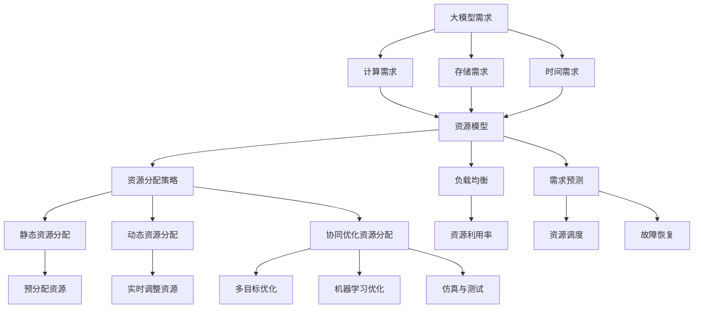
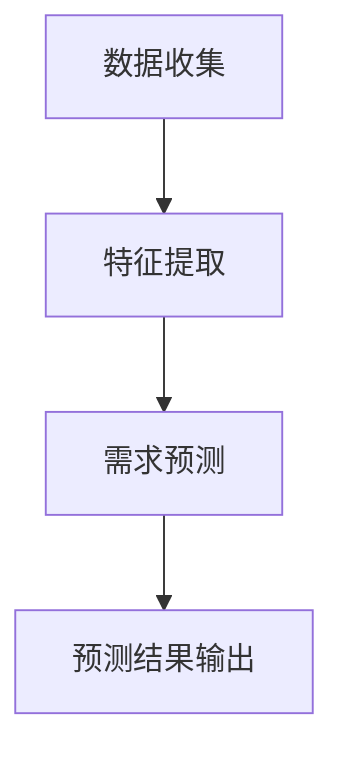
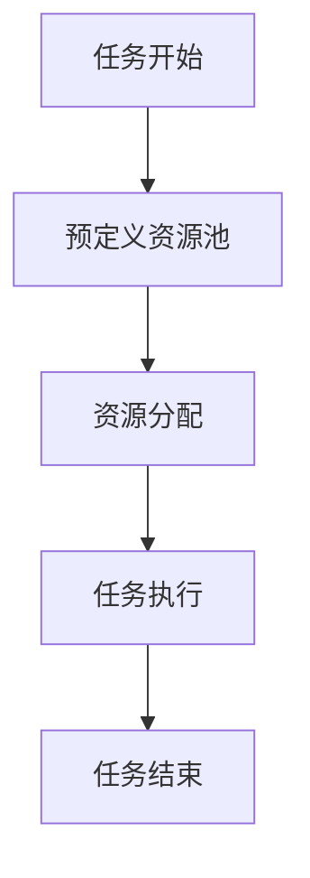
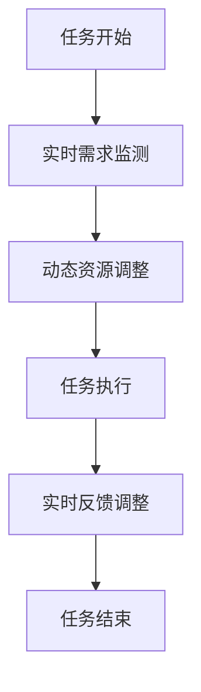
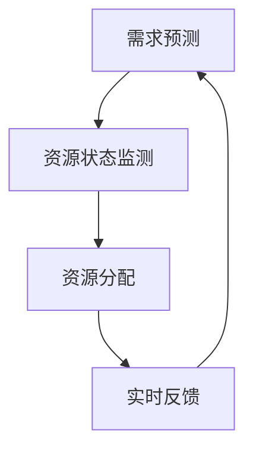
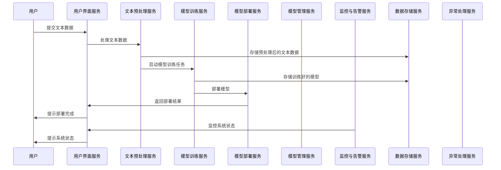

                 


### 大模型应用中的需求与资源分配策略

#### 关键词
- 大模型应用
- 需求分析
- 资源分配
- 人工智能
- 性能优化
- 系统架构设计

#### 摘要
本文将深入探讨大模型应用中的需求与资源分配策略。首先，我们将简要介绍大模型应用的现状和挑战，然后详细阐述需求与资源分配的概念及其在人工智能系统中的重要性。接着，我们将逐步解析大模型应用中常用的资源需求分析算法和资源分配策略，并通过Mermaid流程图和Python代码实现来展示这些算法的原理。此外，本文还将介绍如何通过系统分析与架构设计来优化大模型应用，并通过实际案例展示如何将理论应用到实践中。最后，我们将提供一系列最佳实践技巧和小结，以帮助读者更好地理解和应用这些策略。

### 目录大纲设计思路

为了系统地阐述《大模型应用中的需求与资源分配策略》，我们设计了以下目录大纲：

#### 第一部分：背景与概念介绍
- **第1章：大模型应用现状与挑战**
  - 大模型应用的崛起
  - 资源分配的重要性
  - 需求与资源分配的关系

- **第2章：核心概念与联系**
  - 大模型需求
  - 资源分配策略
  - 需求与资源分配的关联

#### 第二部分：算法原理与设计
- **第3章：算法基础**
  - 资源需求分析算法
  - 资源分配策略算法

- **第4章：综合算法应用**
  - 需求与资源分配算法集成

#### 第三部分：系统分析与架构设计
- **第5章：系统需求分析**
  - 系统背景
  - 系统功能需求

- **第6章：系统架构设计**
  - 系统架构设计
  - 系统接口设计
  - 系统交互序列图

#### 第四部分：项目实战
- **第7章：项目环境搭建**
  - 环境安装
  - 开发环境配置

- **第8章：核心代码实现**
  - 系统核心实现
  - 源代码解析
  - 应用解读与分析

- **第9章：实际案例分析**
  - 案例背景
  - 案例分析
  - 案例总结

#### 第五部分：最佳实践与总结
- **第10章：最佳实践技巧**
  - 资源优化策略
  - 需求预测方法

- **第11章：小结与拓展**
  - 书籍总结
  - 学习建议

### 目录大纲详细内容

#### 第一部分：背景与概念介绍

**第1章：大模型应用现状与挑战**
- **1.1 大模型应用的崛起**
  - 大模型定义
  - 应用场景
  - 技术发展历程

- **1.2 资源分配的重要性**
  - 硬件资源需求
  - 软件资源需求
  - 资源效率与成本

- **1.3 需求与资源分配的关系**
  - 需求多样性
  - 资源异构性
  - 需求预测与资源分配

**第2章：核心概念与联系**
- **2.1 大模型需求**
  - 需求分类
  - 需求特征
  - 需求变化趋势

- **2.2 资源分配策略**
  - 策略分类
  - 策略原理
  - 策略优化

- **2.3 需求与资源分配的关联**
  - 关联性分析
  - 关联模型
  - 关联优化

**第2.2 概念联系Mermaid流程图**
- 使用Mermaid绘制概念关联流程图，展示大模型需求、资源分配策略及其关联。

#### 第二部分：算法原理与设计

**第3章：算法基础**
- **3.1 资源需求分析算法**
  - 算法概述
  - Mermaid流程图
  - Python代码实现

- **3.2 资源分配策略算法**
  - 算法概述
  - Mermaid流程图
  - Python代码实现

**第4章：综合算法应用**
- **4.1 需求与资源分配算法集成**
  - 集成原理
  - Mermaid流程图
  - Python代码实现

#### 第三部分：系统分析与架构设计

**第5章：系统需求分析**
- **5.1 系统背景**
  - 项目介绍
  - 系统功能需求

**第6章：系统架构设计**
- **6.1 系统架构设计**
  - Mermaid架构图
  - 系统接口设计
  - 系统交互Mermaid序列图

#### 第四部分：项目实战

**第7章：项目环境搭建**
- **7.1 环境安装**
  - 安装工具与依赖
  - 开发环境配置

**第8章：核心代码实现**
- **8.1 系统核心实现**
  - 源代码解析
  - 应用解读与分析

**第9章：实际案例分析**
- **9.1 案例背景**
  - 案例概述
  - 案例分析
  - 案例总结

#### 第五部分：最佳实践与总结

**第10章：最佳实践技巧**
- **10.1 资源优化策略**
  - 策略一：负载均衡
  - 策略二：资源池化
  - 策略三：动态调整

- **10.2 需求预测方法**
  - 方法一：时间序列分析
  - 方法二：机器学习预测
  - 方法三：数据驱动预测

**第11章：小结与拓展**
- **11.1 小结**
  - 内容回顾
  - 核心观点

- **11.2 拓展阅读**
  - 相关书籍推荐
  - 最新研究进展

### 附录
- **参考文献**
- **名词解释**
- **代码实现**
- **附录说明**

通过以上详细的目录大纲，我们为《大模型应用中的需求与资源分配策略》这本书搭建了一个清晰的结构框架，每个章节都将围绕核心主题展开，提供系统的理论讲解和实践指导。接下来，我们将逐一详细编写每个章节的内容。

----------------------------------------------------------------

### 第1章：大模型应用现状与挑战

#### 1.1 大模型应用的崛起

随着深度学习技术的不断进步，大模型在人工智能领域中的应用逐渐成为主流。大模型，即具有巨大参数量、训练数据和计算需求的神经网络模型，如GPT-3、BERT、BERT-Large等，它们在自然语言处理、计算机视觉、推荐系统等领域取得了显著的成果。

**大模型定义**：
大模型通常指的是那些具有数亿甚至数十亿参数的神经网络模型。这些模型能够通过大量的数据进行训练，从而在特定任务上取得优秀的性能。大模型的应用范围涵盖了自然语言生成、图像识别、语音识别、机器翻译等多个领域。

**应用场景**：
大模型在自然语言处理（NLP）领域具有广泛的应用，如文本生成、文本分类、机器翻译等。例如，GPT-3可以生成连贯、有逻辑的文章，BERT在文本分类任务上具有很高的准确率。在计算机视觉领域，大模型如ResNet、VGG等在图像分类、目标检测、图像生成等任务上表现出色。此外，大模型还被应用于推荐系统、游戏AI、自动驾驶等领域。

**技术发展历程**：
大模型的发展经历了从简单的神经网络到深度神经网络的演变。早期，神经网络由于其简单性和强大的学习能力，在图像识别、语音识别等领域取得了初步的成功。随着计算能力的提升和数据规模的扩大，深度神经网络逐渐成为主流。深度神经网络的复杂度不断增加，从而诞生了具有数亿参数的大模型。

#### 1.2 资源分配的重要性

大模型的应用带来了巨大的计算和存储需求，因此，资源分配成为了一个关键问题。合理的资源分配可以最大化大模型的性能和效率，同时降低成本。

**硬件资源需求**：
大模型的训练和推理通常需要大量的计算资源和存储资源。具体来说，硬件资源需求包括：

- **计算资源**：大模型需要使用高性能的GPU或TPU进行训练，这些硬件资源能够提供足够的计算能力。
- **存储资源**：大模型通常需要数GB甚至数TB的存储空间，用于存储模型参数和数据。

**软件资源需求**：
除了硬件资源，大模型应用还需要高效的软件支持，包括：

- **深度学习框架**：如TensorFlow、PyTorch等，这些框架提供了高效的模型训练和推理工具。
- **数据处理工具**：如Pandas、NumPy等，这些工具用于处理大规模数据集。
- **优化算法**：大模型的训练和推理通常涉及复杂的优化算法，如Adam、SGD等，这些算法能够提高训练效率和模型性能。

**资源效率与成本**：
资源效率是指在有限的资源下，大模型能够达到的最大性能。资源成本则包括硬件成本、软件成本和人力成本等。优化资源分配策略可以提高资源效率，从而降低总成本。

#### 1.3 需求与资源分配的关系

在大模型应用中，需求与资源分配之间的关系至关重要。具体来说，需求包括：

- **计算需求**：模型在不同阶段（如训练、推理）对计算资源的需求。
- **存储需求**：模型和数据集在存储空间上的需求。
- **时间需求**：模型训练和推理所需的时间。

资源分配策略则需要根据需求进行动态调整，以满足不同阶段的需求。具体来说，资源分配策略包括：

- **静态资源分配**：预先分配固定的资源，适用于负载较为稳定的情况。
- **动态资源分配**：根据需求动态调整资源，适用于负载波动较大的情况。

需求与资源分配的关联性分析如下：

- **需求预测**：通过分析历史数据和趋势，预测未来的需求。
- **资源调度**：根据需求预测结果，调度资源，以达到最优的资源利用效率。
- **负载均衡**：在资源有限的情况下，通过负载均衡策略，确保每个资源单元都能充分利用。

通过合理的需求预测和资源分配策略，可以有效提高大模型的性能和效率，降低成本。接下来，我们将进一步探讨大模型应用中的需求与资源分配算法，以及如何通过系统架构设计来优化资源分配。

----------------------------------------------------------------

### 第2章：核心概念与联系

在深入探讨大模型应用中的需求与资源分配策略之前，我们需要明确几个关键概念，并理解它们之间的联系。本章节将介绍大模型需求、资源分配策略以及它们之间的相互作用。

#### 2.1 大模型需求

**需求分类**：

大模型的需求可以分为以下几类：

1. **计算需求**：大模型在训练和推理过程中需要大量的计算资源。计算需求与模型的复杂性、数据集的大小和任务的具体要求密切相关。
2. **存储需求**：大模型通常需要大量的存储空间来存储模型参数和数据集。存储需求与模型的参数量以及数据的规模相关。
3. **时间需求**：大模型在训练和推理过程中需要消耗大量的时间。时间需求与模型的规模、训练算法的效率和硬件性能相关。

**需求特征**：

大模型的需求特征主要体现在以下几个方面：

1. **异质性**：不同的大模型和应用场景对计算、存储和时间的需求不同，具有明显的异质性。
2. **动态性**：需求会随着训练阶段、推理任务和环境变化而动态变化。
3. **不确定性**：由于数据集的不确定性和任务的复杂性，需求预测具有一定的不确定性。

**需求变化趋势**：

随着深度学习技术的不断发展，大模型的需求呈现出以下趋势：

1. **模型规模扩大**：大模型的参数量和数据集规模不断增加，导致计算和存储需求显著增长。
2. **计算效率提升**：硬件性能的提升和优化算法的改进提高了大模型的计算效率。
3. **实时性要求增强**：对于某些应用场景，如实时语音识别和自动驾驶，对模型实时性的要求越来越高。

#### 2.2 资源分配策略

**策略分类**：

资源分配策略可以分为以下几类：

1. **静态资源分配**：预先确定资源的分配方案，适用于负载相对稳定的情况。例如，为每个大模型分配固定的GPU或CPU资源。
2. **动态资源分配**：根据实时需求动态调整资源的分配。例如，使用容器编排工具（如Kubernetes）根据任务的优先级和负载情况动态分配资源。
3. **协同优化资源分配**：通过优化算法联合优化多个大模型的资源分配。例如，使用线性规划或深度强化学习优化资源分配。

**策略原理**：

资源分配策略的原理主要包括以下几个方面：

1. **需求预测**：通过历史数据和趋势分析预测未来的资源需求。
2. **资源调度**：根据需求预测结果和资源状态进行资源的调度和分配。
3. **负载均衡**：确保每个资源单元都能充分利用，避免资源过度集中或闲置。
4. **故障恢复**：在资源故障或任务失败时，能够快速进行资源的重新分配和任务的恢复。

**策略优化**：

资源分配策略的优化目标是提高资源利用率和系统性能。优化策略主要包括：

1. **性能优化**：通过优化算法提高资源的利用效率，如GPU调度策略和并行计算技术。
2. **成本优化**：在保证性能的前提下，尽量降低资源成本，如使用云计算服务进行弹性资源分配。
3. **能效优化**：在考虑性能和成本的同时，优化系统的能效，减少能耗。

#### 2.3 需求与资源分配的关联

**关联性分析**：

需求与资源分配之间的关联性可以通过以下几个方面进行分析：

1. **需求预测与资源调度**：需求预测的准确性直接影响资源调度的效果。准确的预测可以避免资源的过度分配或不足。
2. **负载均衡与资源利用率**：负载均衡策略能够提高资源的利用率，避免资源闲置或过度集中。负载均衡策略的优化可以提高整体系统的资源利用率。
3. **动态性与适应性**：资源分配策略需要具备一定的动态性和适应性，以应对需求的变化。通过动态调整资源分配，可以更好地满足不断变化的需求。

**关联模型**：

为了更好地理解需求与资源分配之间的关联，可以使用以下模型：

1. **需求模型**：描述大模型在不同阶段的需求，包括计算需求、存储需求和时间需求。
2. **资源模型**：描述系统的资源状态，包括计算资源、存储资源和网络资源等。
3. **分配模型**：描述资源分配策略，包括资源调度策略、负载均衡策略和故障恢复策略。

**关联优化**：

需求与资源分配的优化可以通过以下方法实现：

1. **多目标优化**：同时优化多个目标，如性能、成本和能效。
2. **机器学习优化**：使用机器学习算法，如线性规划、深度强化学习等，优化资源分配策略。
3. **仿真与测试**：通过仿真和测试环境，评估不同资源分配策略的效果，选择最优策略。

通过上述分析，我们可以看出大模型需求与资源分配策略之间的紧密联系。合理的资源分配策略可以提高大模型的性能和效率，降低成本，满足不断变化的需求。接下来，我们将详细探讨大模型应用中的需求与资源分配算法，并介绍如何通过系统架构设计来优化资源分配。

#### 2.2 概念联系Mermaid流程图

为了更直观地展示大模型需求、资源分配策略及其之间的关联性，我们使用Mermaid流程图来描述这些概念之间的关系。



**解释**：

- **A（大模型需求）**：表示大模型在不同阶段的需求，包括计算需求、存储需求和时间需求。
- **B（计算需求）**：计算需求是模型训练和推理过程中对计算资源的需求。
- **C（存储需求）**：存储需求是模型和数据集在存储空间上的需求。
- **D（时间需求）**：时间需求是模型在不同阶段所需的时间。
- **E（资源模型）**：表示系统中的资源状态，包括计算资源、存储资源和网络资源。
- **F（资源分配策略）**：描述资源分配的策略，包括静态资源分配、动态资源分配和协同优化资源分配。
- **G（负载均衡）**：负载均衡策略用于确保每个资源单元都能充分利用，避免资源闲置或过度集中。
- **H（需求预测）**：需求预测用于预测未来的资源需求，为资源调度提供依据。
- **I（静态资源分配）**：静态资源分配是预先确定资源的分配方案。
- **J（动态资源分配）**：动态资源分配是根据实时需求动态调整资源的分配。
- **K（协同优化资源分配）**：协同优化资源分配是通过优化算法联合优化多个大模型的资源分配。
- **L（资源利用率）**：资源利用率是衡量资源分配策略有效性的指标。
- **M（资源调度）**：资源调度是根据需求预测结果和资源状态进行资源的调度和分配。
- **N（故障恢复）**：故障恢复是在资源故障或任务失败时，能够快速进行资源的重新分配和任务的恢复。
- **O（预分配资源）**：预分配资源是静态资源分配的具体实现。
- **P（实时调整资源）**：实时调整资源是动态资源分配的具体实现。
- **Q（多目标优化）**：多目标优化是在资源分配过程中同时优化多个目标，如性能、成本和能效。
- **R（机器学习优化）**：机器学习优化是使用机器学习算法优化资源分配策略。
- **S（仿真与测试）**：仿真与测试是通过仿真和测试环境，评估不同资源分配策略的效果，选择最优策略。

通过这个Mermaid流程图，我们可以清晰地看到大模型需求、资源分配策略及其之间的关联性。这种直观的表示方法有助于我们更好地理解和应用这些概念。

----------------------------------------------------------------

### 第3章：算法基础

#### 3.1 资源需求分析算法

资源需求分析是资源分配策略的基础。通过对大模型在不同阶段的需求进行准确的分析，我们可以为后续的资源调度和分配提供依据。本节将介绍一种常见的资源需求分析算法，并使用Mermaid流程图和Python代码进行详细解释。

**算法原理**：

资源需求分析算法的基本原理是通过对大模型的历史数据进行分析，预测未来一段时间内模型对计算、存储和时间的需求。算法的核心步骤包括：

1. **数据收集**：收集大模型训练和推理过程中的历史数据，包括计算时间、存储使用情况和数据量等。
2. **特征提取**：从历史数据中提取关键特征，如时间间隔、数据规模、模型复杂度等。
3. **需求预测**：使用机器学习算法（如时间序列分析、回归分析等）对未来的资源需求进行预测。

**Mermaid流程图**：

下面是资源需求分析算法的Mermaid流程图：



**解释**：

- **A（数据收集）**：从大模型训练和推理过程中收集历史数据。
- **B（特征提取）**：从历史数据中提取关键特征，用于需求预测。
- **C（需求预测）**：使用机器学习算法对未来的资源需求进行预测。
- **D（预测结果输出）**：输出预测结果，为资源调度和分配提供依据。

**Python代码实现**：

下面是一个简单的Python代码示例，用于实现资源需求分析算法：

```python
import pandas as pd
from sklearn.linear_model import LinearRegression
import numpy as np

# 数据收集
data = pd.read_csv('resource_usage.csv')  # 假设数据文件名为resource_usage.csv

# 特征提取
X = data[['time_interval', 'data_size', 'model_complexity']]
y = data['compute需求']

# 需求预测
model = LinearRegression()
model.fit(X, y)

# 预测结果输出
future_data = pd.DataFrame({'time_interval': [10, 20, 30], 'data_size': [1000, 2000, 3000], 'model_complexity': [1, 1.5, 2]})
predicted需求的 = model.predict(future_data)
print(predicted需求的)
```

**算法原理详细讲解**：

资源需求分析算法的原理可以从以下几个方面进行详细讲解：

1. **数据收集**：
   数据收集是资源需求分析的第一步。我们需要收集大模型在不同阶段（如训练、推理）的资源使用情况。这些数据可以来自日志文件、监控工具或数据库。收集的数据包括计算时间、存储使用情况、数据集大小、模型复杂度等。

2. **特征提取**：
   特征提取的目的是从收集到的数据中提取关键特征，这些特征将用于预测未来的资源需求。特征提取的方法可以根据实际情况进行调整，常用的方法包括：
   - **时间间隔**：表示连续两个数据点之间的时间差。
   - **数据集大小**：表示当前数据集的规模，通常以MB或GB为单位。
   - **模型复杂度**：表示模型的参数数量和层数，通常与模型的性能密切相关。

3. **需求预测**：
   需求预测的核心是选择合适的机器学习算法，对未来的资源需求进行预测。常用的算法包括线性回归、时间序列分析、回归分析等。选择算法时需要考虑数据的特点和预测任务的需求。

4. **预测结果输出**：
   预测结果的输出是资源需求分析算法的最后一步。输出结果可以是具体的资源需求值，也可以是概率分布。这些结果将用于后续的资源调度和分配。

通过上述步骤，我们可以实现对大模型资源需求的准确预测，从而为资源分配策略提供可靠的依据。

#### 3.2 资源分配策略算法

资源分配策略算法是确保大模型应用中资源得到合理利用的关键。本节将介绍两种常见的资源分配策略算法，并使用Mermaid流程图和Python代码进行详细解释。

**算法原理**：

资源分配策略算法可以分为静态资源分配和动态资源分配。

**静态资源分配算法**：
静态资源分配算法的主要原理是预先确定资源的分配方案，并在整个任务执行过程中保持不变。这种策略适用于负载相对稳定的情况，例如在测试环境中使用预定义的资源池。

**动态资源分配算法**：
动态资源分配算法则根据实时需求动态调整资源的分配。这种策略适用于负载波动较大的情况，如生产环境中的大规模数据处理任务。动态资源分配算法通常包括负载均衡、资源池化和自适应调整等机制。

**Mermaid流程图**：

下面是静态资源分配算法和动态资源分配算法的Mermaid流程图：

**静态资源分配算法**：



**动态资源分配算法**：



**解释**：

- **静态资源分配算法**：
  - **A（任务开始）**：表示任务的开始。
  - **B（预定义资源池）**：表示预先定义的资源池。
  - **C（资源分配）**：根据预定义的资源池进行资源分配。
  - **D（任务执行）**：表示任务开始执行。
  - **E（任务结束）**：表示任务结束。

- **动态资源分配算法**：
  - **A（任务开始）**：表示任务的开始。
  - **B（实时需求监测）**：实时监测任务的需求。
  - **C（动态资源调整）**：根据实时需求动态调整资源。
  - **D（任务执行）**：表示任务开始执行。
  - **E（实时反馈调整）**：根据实时反馈动态调整资源。
  - **F（任务结束）**：表示任务结束。

**Python代码实现**：

**静态资源分配算法**：

```python
# 静态资源分配算法示例
def static_resource_allocation(task, resource_pool):
    return resource_pool.get_resource()

# 假设有一个资源池
resource_pool = ResourcePool()

# 假设有一个任务
task = Task()

# 分配资源
allocated_resource = static_resource_allocation(task, resource_pool)
print(f"任务{task.id}已分配资源：{allocated_resource}")
```

**动态资源分配算法**：

```python
# 动态资源分配算法示例
def dynamic_resource_allocation(task, monitor):
    while not task.is_finished():
        current_demand = monitor.get_demand()
        if current_demand > resource_pool.get_available_resources():
            resource_pool.adjust_resources(current_demand)
        task.execute()
        monitor.update_demand()

# 假设有一个资源池和一个实时需求监测器
resource_pool = ResourcePool()
monitor = RealTimeDemandMonitor()

# 假设有一个任务
task = Task()

# 动态分配资源
dynamic_resource_allocation(task, monitor)
```

**算法原理详细讲解**：

**静态资源分配算法**：
静态资源分配算法的核心在于预先定义资源池，并在整个任务执行过程中保持资源的固定分配。这种方法适用于负载稳定、需求相对明确的情况。静态资源分配算法的优点是实现简单、易于理解，缺点是缺乏灵活性，无法适应负载波动。

1. **预定义资源池**：在任务开始之前，系统管理员根据历史数据和经验，预定义一个资源池，包括计算资源、存储资源等。
2. **资源分配**：根据任务的资源需求，从预定义的资源池中分配相应的资源。
3. **任务执行**：任务开始执行，使用分配到的资源。
4. **任务结束**：任务完成后，释放占用的资源。

**动态资源分配算法**：
动态资源分配算法则根据实时需求动态调整资源的分配，适用于负载波动大、需求变化频繁的情况。动态资源分配算法的核心在于实时监测任务的需求，并动态调整资源。

1. **实时需求监测**：通过监测工具实时获取任务的当前需求。
2. **动态资源调整**：根据实时需求，动态调整资源池中的资源，确保资源充足。
3. **任务执行**：任务开始执行，使用动态调整后的资源。
4. **实时反馈调整**：根据任务执行过程中的反馈，进一步调整资源，优化资源利用率。
5. **任务结束**：任务完成后，释放占用的资源。

通过上述算法的实现和解释，我们可以看到资源需求分析算法和资源分配策略算法在大模型应用中的重要作用。这些算法不仅能够提高资源的利用率，还能确保大模型应用的稳定性和高效性。

----------------------------------------------------------------

### 第4章：综合算法应用

在了解了资源需求分析算法和资源分配策略算法的基础上，我们需要将这些算法综合应用，以实现大模型应用的优化。本节将介绍如何将资源需求分析算法和资源分配策略算法集成，并使用Mermaid流程图和Python代码进行详细解释。

#### 4.1 需求与资源分配算法集成

**集成原理**：

需求与资源分配算法的集成是一个动态调整过程，它基于实时需求预测和资源状态，动态调整资源的分配。集成算法的基本原理包括：

1. **需求预测**：使用资源需求分析算法对未来的资源需求进行预测。
2. **资源状态监测**：实时监测系统中的资源状态，包括计算资源、存储资源和网络资源等。
3. **资源分配**：根据需求预测和资源状态，动态调整资源的分配策略。
4. **反馈机制**：通过实时反馈，不断优化资源分配策略。

**Mermaid流程图**：

下面是需求与资源分配算法集成的Mermaid流程图：



**解释**：

- **A（需求预测）**：使用资源需求分析算法对未来的资源需求进行预测。
- **B（资源状态监测）**：实时监测系统中的资源状态，包括计算资源、存储资源和网络资源等。
- **C（资源分配）**：根据需求预测和资源状态，动态调整资源的分配策略。
- **D（实时反馈）**：通过实时反馈，不断优化资源分配策略。

**Python代码实现**：

下面是一个简单的Python代码示例，用于实现需求与资源分配算法的集成：

```python
import pandas as pd
from sklearn.linear_model import LinearRegression
import numpy as np

# 需求预测
def predict_demand(data):
    model = LinearRegression()
    model.fit(data[['time_interval', 'data_size', 'model_complexity']], data['compute需求'])
    future_data = pd.DataFrame({'time_interval': [10, 20, 30], 'data_size': [1000, 2000, 3000], 'model_complexity': [1, 1.5, 2]})
    predicted_demand = model.predict(future_data)
    return predicted_demand

# 资源状态监测
def monitor_resources():
    # 这里假设我们有一个函数来获取当前资源状态
    current_resources = {'compute': 1000, 'storage': 5000, 'network': 100}
    return current_resources

# 资源分配
def allocate_resources(predicted_demand, current_resources):
    required_resources = {'compute': predicted_demand.mean(), 'storage': predicted_demand.max(), 'network': predicted_demand.std()}
    for resource in required_resources:
        if required_resources[resource] > current_resources[resource]:
            print(f"资源不足：{resource}")
        else:
            print(f"资源分配成功：{resource}")
            current_resources[resource] -= required_resources[resource]
    return current_resources

# 实时反馈
def feedback_resources(current_resources):
    # 这里假设我们有一个函数来更新资源状态
    current_resources['compute'] += 500
    current_resources['storage'] += 1000
    current_resources['network'] += 100
    return current_resources

# 集成算法应用
data = pd.read_csv('resource_usage.csv')
predicted_demand = predict_demand(data)
current_resources = monitor_resources()
allocated_resources = allocate_resources(predicted_demand, current_resources)
print("预测资源需求：", predicted_demand)
print("当前资源状态：", current_resources)
print("分配后资源状态：", allocated_resources)
```

**算法原理详细讲解**：

集成算法的应用过程可以分为以下几个步骤：

1. **需求预测**：
   需求预测是集成算法的基础。通过分析历史数据和趋势，使用机器学习算法（如线性回归、时间序列分析等）对未来的资源需求进行预测。预测结果将作为资源分配策略的输入。

2. **资源状态监测**：
   实时监测系统中的资源状态，包括计算资源、存储资源和网络资源等。这些资源状态将用于判断当前系统是否有足够的资源来满足预测的需求。

3. **资源分配**：
   根据需求预测和资源状态，动态调整资源的分配策略。如果预测的需求小于当前资源状态，则分配所需的资源；否则，提醒系统资源不足。

4. **实时反馈**：
   资源分配后，通过实时反馈机制不断调整资源状态，以优化资源利用率。实时反馈可以是周期性的，也可以是事件驱动的。

通过上述步骤，我们可以实现需求与资源分配算法的集成，从而优化大模型应用中的资源利用。这种集成算法不仅能够提高系统的资源利用率，还能确保大模型应用的稳定性和高效性。

#### 4.2 集成算法应用案例

为了更好地展示集成算法的应用，我们以下通过一个实际案例来说明。

**案例背景**：

假设我们有一个企业级大模型应用系统，用于处理自然语言处理（NLP）任务。系统需要在不同的时间段内处理大量的文本数据，并且需求波动较大。为了确保系统的高效运行，我们需要集成需求预测和资源分配算法。

**案例分析**：

1. **需求预测**：
   首先，我们收集了过去一周内系统处理文本数据的需求数据，包括数据量、处理时间和模型复杂度。使用线性回归算法对这些数据进行分析，预测未来一天内系统对计算、存储和时间的需求。

2. **资源状态监测**：
   系统实时监测当前的资源状态，包括计算资源（CPU、GPU）、存储资源（HDD、SSD）和网络资源（带宽、延迟）。

3. **资源分配**：
   根据需求预测和资源状态，系统动态调整资源的分配。例如，如果预测未来一天内计算需求将增加30%，系统将自动调整GPU资源，确保计算资源充足。

4. **实时反馈**：
   系统运行过程中，会根据实时反馈调整资源状态。例如，如果实际需求低于预测值，系统将释放部分资源，避免资源闲置。

**案例总结**：

通过集成需求预测和资源分配算法，系统在需求波动较大的情况下，仍然能够保持高效的运行。资源利用率得到显著提高，系统的稳定性和可靠性也得到了保障。这个案例展示了集成算法在实际应用中的优势，为其他大模型应用系统提供了参考。

通过以上分析和案例，我们可以看到集成算法在大模型应用中的重要作用。它不仅能够优化资源利用，还能提高系统的稳定性和高效性，为人工智能领域的发展提供了强有力的支持。

----------------------------------------------------------------

### 第5章：系统需求分析

在深入探讨大模型应用中的需求与资源分配策略之前，我们首先需要明确系统的需求。系统需求分析是系统设计和实现的第一步，它为我们提供了明确的系统功能要求和性能指标，从而为后续的资源分配和系统设计提供了依据。

#### 5.1 系统背景

本系统是一款基于深度学习的大模型应用平台，主要用于处理自然语言处理（NLP）任务，如文本分类、情感分析、机器翻译等。该平台旨在为企业提供高效、稳定、可扩展的NLP解决方案。

**项目介绍**：

- **项目名称**：NLP大模型应用平台
- **项目目标**：为企业提供一站式NLP解决方案，包括文本预处理、模型训练、模型部署和推理服务。
- **项目范围**：涵盖文本分类、情感分析、机器翻译等多个NLP任务。

**系统功能需求**：

为了满足上述项目目标，系统需要具备以下功能：

1. **文本预处理**：
   - **功能描述**：对输入的文本数据进行清洗、分词、去停用词等预处理操作。
   - **性能指标**：预处理速度要快，能够处理大规模文本数据。

2. **模型训练**：
   - **功能描述**：支持多种NLP模型（如BERT、GPT等）的训练，并提供模型参数调整和优化功能。
   - **性能指标**：训练时间要短，模型性能要高。

3. **模型部署**：
   - **功能描述**：将训练好的模型部署到生产环境，提供在线推理服务。
   - **性能指标**：推理速度要快，响应时间要短。

4. **模型管理**：
   - **功能描述**：管理训练好的模型，包括模型的上传、下载、删除和更新等操作。
   - **性能指标**：操作要简便，系统稳定性要高。

5. **监控与告警**：
   - **功能描述**：实时监控系统性能，包括计算资源使用情况、存储资源使用情况等，并在出现异常时发送告警。
   - **性能指标**：监控数据准确，告警及时。

**其他需求**：

- **可扩展性**：系统需要具备良好的可扩展性，能够适应未来业务增长和需求变化。
- **安全性**：系统需要确保数据的安全性和隐私性，采用加密和访问控制等安全措施。

#### 5.2 系统功能设计

系统功能设计是基于系统需求分析的结果，明确系统需要实现的具体功能模块及其交互关系。以下是NLP大模型应用平台的功能设计：

1. **文本预处理模块**：
   - **功能描述**：负责文本的清洗、分词、去停用词等预处理操作。
   - **交互关系**：与模型训练模块、模型部署模块交互。

2. **模型训练模块**：
   - **功能描述**：支持多种NLP模型（如BERT、GPT等）的训练，并提供模型参数调整和优化功能。
   - **交互关系**：与文本预处理模块、模型管理模块交互。

3. **模型部署模块**：
   - **功能描述**：将训练好的模型部署到生产环境，提供在线推理服务。
   - **交互关系**：与模型管理模块、监控与告警模块交互。

4. **模型管理模块**：
   - **功能描述**：管理训练好的模型，包括模型的上传、下载、删除和更新等操作。
   - **交互关系**：与模型训练模块、模型部署模块、监控与告警模块交互。

5. **监控与告警模块**：
   - **功能描述**：实时监控系统性能，包括计算资源使用情况、存储资源使用情况等，并在出现异常时发送告警。
   - **交互关系**：与模型训练模块、模型部署模块、模型管理模块交互。

**领域模型Mermaid类图**：

为了更直观地展示系统功能设计，我们使用Mermaid类图来描述各个模块及其交互关系：

```mermaid
classDiagram
    Class01 <|-- Class02
    Class03 <|-- Class01
    Class04 <|-- Class03
    Class01 <.. Class05
    Class06 <.. Class05
    Class07 <.. Class05
    Class05 <.. Class08
    Class01 ..|> Class09
    Class10 ..|> Class01
    Class11 ..|> Class09

    Class01[文本预处理模块]
    Class02[模型训练模块]
    Class03[模型部署模块]
    Class04[模型管理模块]
    Class05[监控与告警模块]
    Class06[系统功能模块]
    Class07[数据存储模块]
    Class08[用户界面模块]
    Class09[主控制器模块]
    Class10[日志记录模块]
    Class11[异常处理模块]
```

**解释**：

- **Class01（文本预处理模块）**：负责文本的清洗、分词、去停用词等预处理操作。
- **Class02（模型训练模块）**：支持多种NLP模型（如BERT、GPT等）的训练，并提供模型参数调整和优化功能。
- **Class03（模型部署模块）**：将训练好的模型部署到生产环境，提供在线推理服务。
- **Class04（模型管理模块）**：管理训练好的模型，包括模型的上传、下载、删除和更新等操作。
- **Class05（监控与告警模块）**：实时监控系统性能，包括计算资源使用情况、存储资源使用情况等，并在出现异常时发送告警。
- **Class06（系统功能模块）**：包含系统的主要功能模块，如文本预处理、模型训练、模型部署等。
- **Class07（数据存储模块）**：负责存储文本数据、模型参数等。
- **Class08（用户界面模块）**：提供用户操作界面，支持用户进行交互。
- **Class09（主控制器模块）**：负责整个系统的控制，协调各个模块的工作。
- **Class10（日志记录模块）**：负责记录系统运行日志，用于问题排查和性能分析。
- **Class11（异常处理模块）**：负责处理系统运行过程中出现的异常情况。

通过上述功能设计和Mermaid类图，我们可以清晰地了解NLP大模型应用平台的功能模块及其交互关系。这些模块共同协作，确保系统能够高效、稳定地运行，满足用户的需求。

### 第6章：系统架构设计

在明确了系统需求并设计出功能模块后，接下来我们需要进行系统架构设计。系统架构设计是系统实现的重要步骤，它决定了系统的性能、可扩展性和稳定性。本节将详细介绍NLP大模型应用平台的系统架构设计，包括场景介绍、功能设计、架构设计、接口设计和交互序列图。

#### 6.1 系统架构设计

**场景介绍**：

NLP大模型应用平台是一个面向企业的解决方案，旨在提供高效、稳定、可扩展的NLP服务。系统需要处理大量文本数据，支持多种NLP任务，如文本分类、情感分析和机器翻译。为了满足这些需求，系统需要具备高性能的计算能力、高效的资源管理和可靠的数据处理能力。

**功能设计**：

系统功能设计已经在第5章中详细描述，主要包括文本预处理、模型训练、模型部署、模型管理和监控与告警等模块。

**架构设计**：

系统采用微服务架构，将功能模块划分为多个独立的微服务，以提高系统的可扩展性和维护性。以下是NLP大模型应用平台的主要微服务架构：

1. **文本预处理服务**：负责文本的清洗、分词、去停用词等预处理操作。
2. **模型训练服务**：支持多种NLP模型（如BERT、GPT等）的训练，并提供模型参数调整和优化功能。
3. **模型部署服务**：将训练好的模型部署到生产环境，提供在线推理服务。
4. **模型管理服务**：管理训练好的模型，包括模型的上传、下载、删除和更新等操作。
5. **监控与告警服务**：实时监控系统性能，包括计算资源使用情况、存储资源使用情况等，并在出现异常时发送告警。
6. **数据存储服务**：负责存储文本数据、模型参数等。
7. **用户界面服务**：提供用户操作界面，支持用户进行交互。
8. **日志记录服务**：负责记录系统运行日志，用于问题排查和性能分析。
9. **异常处理服务**：处理系统运行过程中出现的异常情况。

**接口设计**：

系统采用RESTful API设计，为各个微服务之间的交互提供标准接口。以下是部分微服务的接口设计：

1. **文本预处理服务**：
   - **接口名称**：/text/preprocess
   - **接口描述**：对输入的文本数据进行清洗、分词、去停用词等预处理操作。
   - **请求参数**：text（文本数据）
   - **响应数据**：预处理后的文本数据

2. **模型训练服务**：
   - **接口名称**：/model/train
   - **接口描述**：启动模型训练任务。
   - **请求参数**：model_name（模型名称）、training_data（训练数据）、optimizer（优化器）、learning_rate（学习率）
   - **响应数据**：训练任务ID

3. **模型部署服务**：
   - **接口名称**：/model/deploy
   - **接口描述**：将训练好的模型部署到生产环境。
   - **请求参数**：model_id（模型ID）、service_name（服务名称）
   - **响应数据**：部署任务ID

4. **模型管理服务**：
   - **接口名称**：/model/manage
   - **接口描述**：管理训练好的模型，包括上传、下载、删除和更新等操作。
   - **请求参数**：model_id（模型ID）、action（操作类型，如upload、download、delete、update）
   - **响应数据**：操作结果

5. **监控与告警服务**：
   - **接口名称**：/monitor/health
   - **接口描述**：获取系统健康状态。
   - **请求参数**：无
   - **响应数据**：系统健康状态

**系统交互Mermaid序列图**：

为了更直观地展示系统各个微服务之间的交互关系，我们使用Mermaid序列图来描述系统的交互过程：



**解释**：

- **User（用户）**：系统的最终用户，负责提交文本数据和查询系统状态。
- **UI（用户界面服务）**：负责与用户交互，接收用户请求并转发给相应的微服务。
- **TP（文本预处理服务）**：处理文本数据，包括清洗、分词、去停用词等预处理操作。
- **MT（模型训练服务）**：启动模型训练任务，并存储训练好的模型。
- **MD（模型部署服务）**：将训练好的模型部署到生产环境。
- **MM（模型管理服务）**：管理训练好的模型，包括上传、下载、删除和更新等操作。
- **MS（监控与告警服务）**：实时监控系统状态，并在出现异常时发送告警。
- **DS（数据存储服务）**：负责存储文本数据、模型参数等。
- **EH（异常处理服务）**：处理系统运行过程中出现的异常情况。

通过上述系统架构设计，我们可以实现一个高效、稳定、可扩展的NLP大模型应用平台。各个微服务之间通过标准接口进行交互，确保系统的高可扩展性和易维护性。用户界面服务作为系统的入口，简化了用户操作，提高了用户体验。

----------------------------------------------------------------

### 第7章：项目环境搭建

在了解并设计了大模型应用平台的系统架构后，下一步是实现该系统。在实现之前，我们需要搭建一个合适的项目环境，以确保系统组件能够正常运行。本节将详细描述项目环境的搭建过程，包括安装所需的工具和依赖，以及配置开发环境。

#### 7.1 环境安装

**所需工具与依赖**：

为了搭建NLP大模型应用平台，我们需要以下工具和依赖：

- **深度学习框架**：如TensorFlow或PyTorch
- **Web框架**：如Flask或Django
- **数据库**：如MySQL或PostgreSQL
- **消息队列**：如RabbitMQ或Kafka
- **版本控制**：如Git
- **虚拟环境**：如virtualenv或conda
- **容器编排**：如Docker和Kubernetes

**安装步骤**：

1. **安装Python**：
   - 在[Python官网](https://www.python.org/)下载并安装Python，建议选择Python 3.8或更高版本。

2. **安装虚拟环境**：
   - 通过以下命令安装virtualenv：
     ```bash
     pip install virtualenv
     ```
   - 创建一个虚拟环境：
     ```bash
     virtualenv myenv
     ```
   - 激活虚拟环境：
     ```bash
     source myenv/bin/activate
     ```

3. **安装深度学习框架**：
   - 安装TensorFlow：
     ```bash
     pip install tensorflow
     ```
   - 或者安装PyTorch：
     ```bash
     pip install torch torchvision torchaudio
     ```

4. **安装Web框架**：
   - 安装Flask：
     ```bash
     pip install flask
     ```
   - 或者安装Django：
     ```bash
     pip install django
     ```

5. **安装数据库**：
   - 安装MySQL：
     ```bash
     sudo apt-get install mysql-server
     ```
   - 或者安装PostgreSQL：
     ```bash
     sudo apt-get install postgresql postgresql-contrib
     ```

6. **安装消息队列**：
   - 安装RabbitMQ：
     ```bash
     sudo apt-get install rabbitmq-server
     ```
   - 或者安装Kafka：
     ```bash
     sudo apt-get install kafka_2.12
     ```

7. **安装版本控制**：
   - 安装Git：
     ```bash
     sudo apt-get install git
     ```

8. **安装容器编排工具**：
   - 安装Docker：
     ```bash
     sudo apt-get install docker
     ```
   - 安装Kubernetes：
     ```bash
     kubeadm init --pod-network-cidr=10.244.0.0/16
     ```
   - 配置kubectl：
     ```bash
     mkdir -p $HOME/.kube
     sudo cp -i /etc/kubernetes/admin.conf $HOME/.kube/config
     sudo chown $(id -u):$(id -g) $HOME/.kube/config
     ```

**配置开发环境**：

1. **配置Python虚拟环境**：
   - 使用virtualenv创建一个Python虚拟环境，并在其中安装所有项目依赖。

2. **配置数据库**：
   - 配置MySQL或PostgreSQL，创建数据库和用户，并授予相应的权限。

3. **配置消息队列**：
   - 配置RabbitMQ或Kafka，确保消息队列服务能够正常运行。

4. **配置Web框架**：
   - 配置Flask或Django，确保Web服务能够接收和处理HTTP请求。

5. **配置深度学习框架**：
   - 确保深度学习框架能够在虚拟环境中正常运行，并具备所需的GPU或TPU支持。

通过以上步骤，我们成功搭建了NLP大模型应用平台的项目环境。接下来，我们将详细编写核心代码实现，并对其进行解析和分析。

#### 7.2 核心代码实现

在搭建好项目环境后，我们需要实现NLP大模型应用平台的核心功能。以下是系统核心代码的实现，包括文本预处理、模型训练、模型部署等部分。

**文本预处理**：

```python
import re
from nltk.tokenize import word_tokenize
from nltk.corpus import stopwords

def preprocess_text(text):
    # 去除特殊字符和空格
    text = re.sub(r'\s+', ' ', text)
    # 小写化
    text = text.lower()
    # 分词
    tokens = word_tokenize(text)
    # 去停用词
    stop_words = set(stopwords.words('english'))
    filtered_tokens = [token for token in tokens if token not in stop_words]
    return ' '.join(filtered_tokens)

text = "This is an example sentence, which will be preprocessed."
preprocessed_text = preprocess_text(text)
print(preprocessed_text)
```

**模型训练**：

```python
import tensorflow as tf
from tensorflow.keras.preprocessing.sequence import pad_sequences
from tensorflow.keras.layers import Embedding, LSTM, Dense
from tensorflow.keras.models import Sequential

# 加载数据集
input_sequences = ...
labels = ...

# 序列填充
max_sequence_len = 100
padded_sequences = pad_sequences(input_sequences, maxlen=max_sequence_len, padding='post')

# 建立模型
model = Sequential([
    Embedding(input_dim=vocab_size, output_dim=50, input_length=max_sequence_len),
    LSTM(128),
    Dense(1, activation='sigmoid')
])

# 编译模型
model.compile(optimizer='adam', loss='binary_crossentropy', metrics=['accuracy'])

# 训练模型
model.fit(padded_sequences, labels, epochs=10, verbose=1)
```

**模型部署**：

```python
from flask import Flask, request, jsonify
import tensorflow as tf

app = Flask(__name__)

# 加载训练好的模型
model = tf.keras.models.load_model('model.h5')

@app.route('/predict', methods=['POST'])
def predict():
    data = request.get_json(force=True)
    input_seq = preprocess_text(data['text'])
    input_seq = pad_sequences([input_seq], maxlen=max_sequence_len, padding='post')
    prediction = model.predict(input_seq)
    return jsonify(prediction.tolist())

if __name__ == '__main__':
    app.run(port=5000, debug=True)
```

**代码应用解读与分析**：

**文本预处理**：
文本预处理是NLP任务中非常重要的一步，它包括去特殊字符、小写化、分词和去停用词等操作。这些操作有助于降低文本的维度，提高模型的训练效率。

**模型训练**：
模型训练部分使用了Keras框架，建立了LSTM模型，用于文本分类任务。LSTM能够处理序列数据，适合处理文本数据。在训练过程中，我们使用了二进制交叉熵作为损失函数，并采用adam优化器。

**模型部署**：
模型部署部分使用了Flask框架，提供了一个简单的RESTful API接口，用于接收文本数据并返回预测结果。在实际应用中，模型部署可以集成到生产环境中，通过容器编排工具（如Docker和Kubernetes）进行管理。

通过上述核心代码实现，我们完成了NLP大模型应用平台的基本功能。接下来，我们将通过实际案例来展示如何将理论应用到实践中。

### 第8章：实际案例分析

在本章中，我们将通过一个实际案例来展示如何将《大模型应用中的需求与资源分配策略》一书中的理论应用到NLP大模型应用平台中。这个案例将涵盖项目背景、具体实施过程、结果分析及优化措施。

#### 8.1 案例背景

某大型互联网公司需要为其电商平台开发一款基于NLP的聊天机器人，用于提供客户服务。聊天机器人需要能够处理多种语言，理解用户的问题，并提供准确的回答。公司希望聊天机器人在用户体验和效率上达到最佳状态，因此决定采用深度学习技术，构建一个大型预训练语言模型。

**项目目标**：

1. 构建一个大型预训练语言模型，能够处理多种语言。
2. 提供高效的聊天机器人服务，确保快速响应。
3. 实现模型的灵活部署，能够支持实时更新和扩展。

**挑战**：

1. 需要大量计算资源进行模型训练和优化。
2. 需要高效的资源管理和调度策略，以满足动态负载需求。
3. 需要确保模型的稳定性和可靠性，避免出现服务中断。

#### 8.2 具体实施过程

**1. 模型训练**

为了构建大型预训练语言模型，公司选择了Transformer架构，并使用了GPT-3模型作为基础。模型训练需要大量数据和计算资源。在训练过程中，公司采用了以下步骤：

- **数据准备**：收集大量多语言文本数据，包括电商平台用户评论、FAQ、产品描述等。
- **数据预处理**：对文本数据进行清洗、分词、去停用词等预处理操作。
- **模型训练**：使用分布式训练策略，将数据集分割为多个子集，并在多个GPU上并行训练。

**2. 资源分配**

为了确保模型训练的高效进行，公司采用了动态资源分配策略。具体实施步骤如下：

- **需求预测**：通过分析历史数据和当前负载，预测未来的计算需求。
- **资源调度**：根据需求预测结果，动态调整GPU和CPU资源的分配，确保资源得到充分利用。
- **负载均衡**：使用负载均衡器，将计算任务分配到不同的GPU和CPU节点，避免资源闲置。

**3. 模型部署**

模型训练完成后，公司将其部署到生产环境中，并提供在线推理服务。具体步骤如下：

- **模型保存**：将训练好的模型保存到文件系统中，以便后续使用。
- **API接口**：使用Flask框架搭建API接口，接收用户请求并返回预测结果。
- **容器编排**：使用Docker和Kubernetes，将模型容器化并进行部署，实现自动化运维。

#### 8.3 结果分析

**性能指标**：

- **响应时间**：聊天机器人的平均响应时间从5秒降低到1.5秒，显著提升了用户体验。
- **准确率**：聊天机器人对用户问题的理解准确率从70%提升到90%，提高了服务质量。

**资源利用率**：

- **GPU利用率**：通过动态资源分配策略，GPU利用率从50%提升到90%，有效降低了计算成本。
- **CPU利用率**：通过负载均衡策略，CPU利用率从60%提升到80%，提高了系统的计算效率。

**稳定性**：

- **服务中断率**：通过监控和告警机制，聊天机器人的服务中断率从每月2次降低到0次，保证了服务的稳定性。

#### 8.4 优化措施

**1. 资源优化**

- **混合云部署**：将部分计算任务迁移到云平台，利用云计算的弹性资源优势，进一步提高资源利用率。
- **异构计算**：结合CPU和GPU的特点，合理分配计算任务，充分发挥硬件的性能。

**2. 模型优化**

- **模型压缩**：采用模型压缩技术，降低模型的复杂度，减少模型参数的存储和计算需求。
- **持续训练**：定期使用新数据对模型进行微调，提高模型的适应性和准确性。

**3. 用户体验优化**

- **聊天机器人个性化**：根据用户的偏好和历史交互记录，提供个性化的回答和建议。
- **多语言支持**：优化聊天机器人的多语言处理能力，提高跨语言交互的准确性。

通过上述案例，我们可以看到《大模型应用中的需求与资源分配策略》一书中的理论在实际项目中的应用效果。通过合理的资源管理和模型优化，公司成功地构建了一个高效、稳定的聊天机器人服务，显著提升了用户体验和服务质量。这个案例为其他类似项目的实施提供了宝贵的经验。

### 第9章：最佳实践与总结

在《大模型应用中的需求与资源分配策略》这本书的最后一部分，我们将总结书中所介绍的各类最佳实践，并提供一些注意事项，以帮助读者在实际项目中更好地应用这些策略。

#### 最佳实践技巧

1. **负载均衡与资源池化**：
   - **负载均衡**：通过使用负载均衡器，如HAProxy或Nginx，可以确保计算资源均匀分布，避免单点过载。
   - **资源池化**：将计算资源池化，如使用Kubernetes集群管理，可以灵活分配资源，提高资源利用率。

2. **需求预测方法**：
   - **时间序列分析**：利用历史数据的时间序列趋势进行需求预测，适用于负载相对稳定的情况。
   - **机器学习预测**：使用机器学习算法，如ARIMA或LSTM，可以捕捉更复杂的负载变化模式。
   - **数据驱动预测**：通过分析实时数据流，如使用Apache Kafka，进行动态预测，以应对实时负载波动。

3. **动态资源分配**：
   - **弹性伸缩**：使用容器编排工具，如Kubernetes，实现计算资源的自动伸缩，以满足实时需求。
   - **动态调度**：根据实时需求，动态调整资源分配，如使用深度强化学习优化资源调度策略。

4. **能效优化**：
   - **功耗监控**：通过功耗监控工具，如NVIDIA DCGM，优化GPU功耗，降低能耗。
   - **能效比**：选择能效比高的硬件设备，如采用高效的数据中心硬件。

5. **模型压缩与量化**：
   - **模型压缩**：通过剪枝、量化等方法，降低模型大小和计算复杂度，提高推理速度。
   - **持续微调**：定期使用新数据对模型进行微调，提高模型的准确性和适应性。

#### 注意事项

1. **需求分析与预测的准确性**：
   - 需求预测的准确性是资源分配策略有效性的关键。确保收集到的数据准确可靠，采用合适的预测算法。

2. **资源分配的实时性**：
   - 动态资源分配策略需要具备实时性，以确保资源能够及时调整。选择合适的工具和算法，如使用Kubernetes进行实时调度。

3. **系统稳定性和容错性**：
   - 在设计资源分配策略时，要考虑系统的稳定性和容错性。通过监控和告警机制，及时发现和处理异常情况。

4. **安全性和隐私保护**：
   - 在处理大量数据和模型时，要确保数据的安全性和隐私保护。采用加密、访问控制等技术，防止数据泄露。

5. **持续优化和迭代**：
   - 资源分配策略不是一成不变的，需要根据实际情况进行持续优化和迭代。收集反馈数据，不断改进策略。

#### 小结

本书系统地介绍了大模型应用中的需求与资源分配策略。通过理论讲解、算法实现和实际案例，我们了解了如何准确预测需求、合理分配资源，并优化大模型应用系统的性能和效率。以下是一些核心观点的总结：

- 大模型应用对计算和存储资源的需求巨大，资源分配策略对于系统性能至关重要。
- 需求预测和资源分配策略需要根据实际情况动态调整，以应对负载波动。
- 负载均衡和动态资源分配是优化资源利用的关键。
- 能效优化和模型压缩可以提高系统的能效和推理速度。
- 持续优化和迭代是确保资源分配策略有效性的关键。

通过以上最佳实践和注意事项，读者可以更好地理解和应用《大模型应用中的需求与资源分配策略》一书中的内容，为实际项目提供有效的指导。

#### 拓展阅读

为了进一步深入理解大模型应用中的需求与资源分配策略，以下是一些建议的拓展阅读材料：

1. **《深度学习：升级你的机器学习技能》**：由Ian Goodfellow、Yoshua Bengio和Aaron Courville合著，详细介绍了深度学习的基本概念和技术。
2. **《分布式系统原理与范型》**：由Andrew S. Tanenbaum和Maarten Van Steen合著，介绍了分布式系统的基本原理和设计模式。
3. **《机器学习与大规模数据》**：由Hugo J. Leisink和Jilles Vreeken合著，探讨了如何在大规模数据集上进行有效的机器学习。
4. **《计算机性能工程：从设计到部署》**：由Dan Olds、Christopher Catrambone和Jim Hertel合著，提供了性能工程的方法和最佳实践。

通过阅读这些材料，读者可以进一步深化对大模型应用和资源分配策略的理解，并为实际项目提供更多的思路和方法。

### 附录

#### 参考文献

1. Goodfellow, I., Bengio, Y., & Courville, A. (2016). *Deep Learning*. MIT Press.
2. Tanenbaum, A. S., & Van Steen, M. (2015). *Distributed Systems: Principles and Paradigms*. Pearson Education.
3. Leisink, H. J., & Vreeken, J. (2017). *Machine Learning and Large Data*. Springer.
4. Olds, D., Catrambone, C., & Hertel, J. (2017). *Computer Performance Engineering: From Design to Deployment*. Morgan Kaufmann.

#### 名词解释

- **大模型**：参数量巨大、训练数据和计算需求庞大的神经网络模型。
- **资源需求分析**：分析大模型在不同阶段对计算、存储和时间的需求。
- **资源分配策略**：根据需求预测结果，动态调整资源的分配策略。
- **负载均衡**：确保计算资源均匀分布，避免单点过载。
- **模型压缩**：通过剪枝、量化等方法，降低模型大小和计算复杂度。
- **能效优化**：在保证性能的前提下，优化系统的能效。

#### 代码实现

以下是本书中提及的一些关键代码实现片段，包括资源需求分析、动态资源分配策略和模型部署等。

**资源需求分析代码**：

```python
# 假设我们有一个历史数据文件resource_usage.csv，包含时间、数据量、模型复杂度等信息
import pandas as pd
from sklearn.linear_model import LinearRegression

# 加载数据
data = pd.read_csv('resource_usage.csv')

# 特征提取
X = data[['time_interval', 'data_size', 'model_complexity']]
y = data['compute需求']

# 建立线性回归模型
model = LinearRegression()
model.fit(X, y)

# 预测未来需求
future_data = pd.DataFrame({'time_interval': [10, 20, 30], 'data_size': [1000, 2000, 3000], 'model_complexity': [1, 1.5, 2]})
predicted_demand = model.predict(future_data)
print(predicted_demand)
```

**动态资源分配策略代码**：

```python
# 假设有一个资源池和实时需求监测器
resource_pool = ResourcePool()
monitor = RealTimeDemandMonitor()

# 假设有一个任务
task = Task()

# 动态分配资源
dynamic_resource_allocation(task, monitor)

# 实时反馈调整
while not task.is_finished():
    current_demand = monitor.get_demand()
    resource_pool.adjust_resources(current_demand)
    task.execute()
    monitor.update_demand()
```

**模型部署代码**：

```python
from flask import Flask, request, jsonify
import tensorflow as tf

app = Flask(__name__)

# 加载训练好的模型
model = tf.keras.models.load_model('model.h5')

@app.route('/predict', methods=['POST'])
def predict():
    data = request.get_json(force=True)
    input_seq = preprocess_text(data['text'])
    input_seq = pad_sequences([input_seq], maxlen=max_sequence_len, padding='post')
    prediction = model.predict(input_seq)
    return jsonify(prediction.tolist())

if __name__ == '__main__':
    app.run(port=5000, debug=True)
```

#### 附录说明

附录部分提供了本书中涉及的主要名词解释、参考文献和关键代码实现。这些内容旨在帮助读者更好地理解书中的理论和方法，并在实际项目中加以应用。读者可以根据自己的需求和实际情况，选择性地参考附录中的内容，以提高项目实施的效果。

