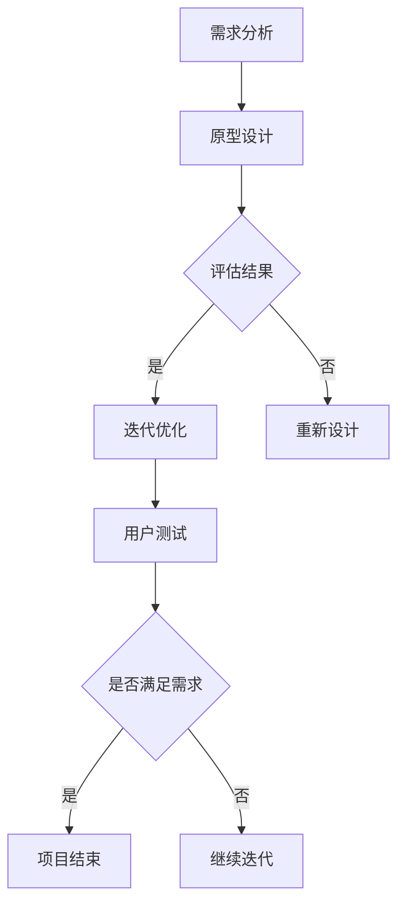

                 

# 大模型应用中的需求原型设计方法

## 关键词

大模型应用、需求分析、原型设计、用户体验、迭代开发、敏捷开发

## 摘要

随着人工智能技术的迅猛发展，大模型（如深度学习模型、神经网络模型等）在各个领域的应用日益广泛。大模型的应用不仅依赖于其强大的计算能力，更需要合理的需求原型设计来确保其能够满足实际业务需求。本文将详细介绍大模型应用中的需求原型设计方法，包括需求分析、原型设计、评估与迭代等关键环节。通过本文的阐述，读者将了解如何有效地利用需求原型设计方法，提升大模型应用的效能和用户体验。

## 引言

### 1.1 问题背景与意义

随着互联网的普及和大数据技术的发展，人工智能（AI）已经成为了现代社会的重要驱动力。大模型作为AI领域的重要工具，其应用范围涵盖了图像识别、自然语言处理、推荐系统等多个领域。然而，大模型的应用并非一蹴而就，其背后需要复杂的需求原型设计作为支撑。

需求原型设计是软件开发过程中至关重要的一环。它不仅帮助开发团队明确项目目标，还能够有效地减少项目开发中的不确定性，提高项目的成功率。在大模型应用中，需求原型设计更是具有特殊的意义：

1. **确保模型与业务需求的一致性**：大模型具有较高的自主性，但如果没有合理的需求原型设计，很容易导致模型训练出的结果与实际业务需求不符，从而影响项目的整体效果。
2. **提升用户体验**：通过需求原型设计，可以提前识别用户体验中的痛点，从而在设计阶段就进行优化，提高用户满意度。
3. **降低开发成本**：早期进行需求原型设计，可以及时发现和修正潜在的问题，避免后期大规模返工，从而降低开发成本。

### 1.2 核心概念与联系

#### 1.2.1 大模型的定义与类型

大模型是指具有数百万、数十亿甚至更多参数的机器学习模型。根据其功能和应用场景，大模型可以分为以下几类：

- **深度学习模型**：如卷积神经网络（CNN）、循环神经网络（RNN）、Transformer等。
- **生成对抗网络（GAN）**：用于生成逼真的图像、文本、音频等。
- **强化学习模型**：如深度强化学习（DRL），常用于游戏、自动驾驶等领域。

#### 1.2.2 需求原型设计的原理

需求原型设计是指通过创建原型来展示系统功能、用户界面和交互流程，以验证和优化需求的一种方法。其核心原理包括：

- **迭代开发**：通过多次迭代，逐步完善需求原型，确保最终产品能够满足用户需求。
- **用户参与**：将用户纳入原型设计过程，收集反馈，确保原型设计的准确性。
- **快速反馈**：原型设计过程中，能够快速收集用户反馈，并进行调整，从而提高开发效率。

### 1.3 研究方法与框架

本文的研究方法主要采用定性与定量相结合的方式。定性研究主要通过文献调研、专家访谈等方式，收集和分析大模型应用中需求原型设计的相关理论和实践。定量研究则通过实际项目案例，分析需求原型设计在提升大模型应用效果方面的具体作用。

研究的框架主要包括以下环节：

- **需求分析**：明确项目目标和用户需求，为大模型应用提供清晰的指导。
- **原型设计**：根据需求分析结果，设计需求原型，并进行用户测试。
- **评估与迭代**：通过用户反馈和实际应用效果，对需求原型进行评估和迭代，确保其能够满足用户需求。

### 1.4 本书结构安排与内容概述

本文将分为四个主要部分：

- **第一部分：引言**：介绍大模型应用中的需求原型设计方法，包括问题背景与意义、核心概念与联系、研究方法与框架等。
- **第二部分：大模型应用需求分析**：详细阐述大模型应用中的需求分析过程，包括需求收集、整理、特性分析和验证与反馈等。
- **第三部分：需求原型设计方法**：介绍需求原型设计的具体方法，包括低 fidelity原型设计、中 fidelity原型设计和高 fidelity原型设计等。
- **第四部分：原型评估与迭代**：讨论如何通过评估和迭代，优化需求原型，确保其能够满足用户需求。

通过本文的详细阐述，读者将能够全面了解大模型应用中的需求原型设计方法，并能够将其应用于实际项目中，提升大模型应用的效能和用户体验。## 第一部分：引言

### 1.1 问题背景与意义

在当今的数字化时代，人工智能（AI）已经成为了推动社会进步的关键力量。大模型作为AI技术的重要载体，其应用范围涵盖了自然语言处理、图像识别、推荐系统等多个领域。然而，大模型的应用并非仅依赖于其强大的计算能力，更需要合理的需求原型设计来确保其能够满足实际业务需求。

#### 1.1.1 大模型在应用中的重要性

大模型，特别是深度学习模型，通过其高度复杂的网络结构，能够在大量数据中自动提取特征，实现高度精准的预测和分类。这使得大模型在图像识别、语音识别、自然语言处理等领域展现了卓越的性能。例如，在医疗领域，大模型可以帮助医生进行疾病诊断，提高诊断准确率；在金融领域，大模型可以用于风险控制和投资策略优化，提高金融决策的效率。

然而，大模型的应用并非一蹴而就。其复杂的模型结构和大量参数，使得大模型的训练和优化过程面临着诸多挑战。此外，大模型的应用效果也受到数据质量、算法设计、计算资源等多方面因素的影响。因此，合理的需求原型设计成为了确保大模型应用成功的关键。

#### 1.1.2 需求原型设计的核心作用

需求原型设计是指通过创建原型来展示系统功能、用户界面和交互流程，以验证和优化需求的一种方法。在大模型应用中，需求原型设计具有以下核心作用：

1. **确保模型与业务需求的一致性**：通过需求原型设计，开发团队可以明确项目目标和用户需求，确保大模型的应用能够满足业务需求，避免出现模型训练结果与业务目标不符的情况。

2. **提升用户体验**：需求原型设计过程中，可以将用户纳入其中，收集用户的反馈和建议，从而设计出更加符合用户习惯和需求的系统界面和交互流程，提升用户体验。

3. **降低开发成本**：通过早期进行需求原型设计，开发团队可以及时发现和修正潜在的问题，避免后期大规模返工，从而降低开发成本。

#### 1.1.3 当前大模型应用面临的挑战

尽管大模型在各个领域展现了巨大的潜力，但其应用过程中也面临着诸多挑战：

1. **数据质量和多样性**：大模型对数据质量有较高的要求，数据的质量和多样性直接影响模型的性能。如何获取高质量、多样化的数据成为了大模型应用的一个重要问题。

2. **模型可解释性**：大模型的决策过程往往较为复杂，缺乏透明度和可解释性，这使得用户难以理解和信任模型。如何提高大模型的可解释性，成为了当前研究的一个重要方向。

3. **计算资源和能耗**：大模型的训练和推理过程需要大量的计算资源和能源，如何在保证模型性能的前提下，降低计算资源和能耗，是一个亟待解决的问题。

4. **隐私保护**：在大模型应用过程中，如何保护用户隐私，防止数据泄露，也是一个重要的挑战。

#### 1.1.4 需求原型设计在大模型应用中的关键作用

在大模型应用中，需求原型设计具有以下关键作用：

1. **需求澄清**：通过需求原型设计，可以明确项目目标和用户需求，避免因需求不明确导致的开发方向偏差。

2. **风险识别**：通过需求原型设计，可以提前识别项目中可能存在的风险，如数据质量问题、模型性能问题等，从而提前采取应对措施。

3. **用户参与**：通过需求原型设计，可以将用户纳入开发过程，收集用户的反馈和建议，确保最终产品能够满足用户需求。

4. **迭代优化**：通过需求原型设计，可以支持敏捷开发，快速迭代优化产品，提高开发效率和产品质量。

### 1.2 核心概念与联系

#### 1.2.1 大模型的定义与类型

大模型是指具有数百万、数十亿甚至更多参数的机器学习模型。根据其功能和应用场景，大模型可以分为以下几类：

1. **深度学习模型**：如卷积神经网络（CNN）、循环神经网络（RNN）、Transformer等。这类模型通过多层神经网络结构，能够自动提取数据中的特征，实现高度复杂的任务。

2. **生成对抗网络（GAN）**：这类模型由生成器和判别器组成，通过对抗训练生成逼真的图像、文本、音频等。

3. **强化学习模型**：如深度强化学习（DRL），这类模型通过与环境的交互，学习到最优策略，常用于游戏、自动驾驶等领域。

#### 1.2.2 需求原型设计的原理

需求原型设计是指通过创建原型来展示系统功能、用户界面和交互流程，以验证和优化需求的一种方法。其核心原理包括：

1. **迭代开发**：通过多次迭代，逐步完善需求原型，确保最终产品能够满足用户需求。

2. **用户参与**：将用户纳入原型设计过程，收集反馈，确保原型设计的准确性。

3. **快速反馈**：原型设计过程中，能够快速收集用户反馈，并进行调整，从而提高开发效率。

### 1.3 研究方法与框架

本文的研究方法主要采用定性与定量相结合的方式。定性研究主要通过文献调研、专家访谈等方式，收集和分析大模型应用中需求原型设计的相关理论和实践。定量研究则通过实际项目案例，分析需求原型设计在提升大模型应用效果方面的具体作用。

研究的框架主要包括以下环节：

1. **需求分析**：明确项目目标和用户需求，为大模型应用提供清晰的指导。

2. **原型设计**：根据需求分析结果，设计需求原型，并进行用户测试。

3. **评估与迭代**：通过用户反馈和实际应用效果，对需求原型进行评估和迭代，确保其能够满足用户需求。

### 1.4 本书结构安排与内容概述

本文将分为四个主要部分：

1. **第一部分：引言**：介绍大模型应用中的需求原型设计方法，包括问题背景与意义、核心概念与联系、研究方法与框架等。

2. **第二部分：大模型应用需求分析**：详细阐述大模型应用中的需求分析过程，包括需求收集、整理、特性分析和验证与反馈等。

3. **第三部分：需求原型设计方法**：介绍需求原型设计的具体方法，包括低 fidelity原型设计、中 fidelity原型设计和高 fidelity原型设计等。

4. **第四部分：原型评估与迭代**：讨论如何通过评估和迭代，优化需求原型，确保其能够满足用户需求。

通过本文的详细阐述，读者将能够全面了解大模型应用中的需求原型设计方法，并能够将其应用于实际项目中，提升大模型应用的效能和用户体验。

### 1.5 结论

本文从问题背景、核心概念、研究方法和内容安排等方面，全面介绍了大模型应用中的需求原型设计方法。通过本文的阐述，读者可以认识到需求原型设计在大模型应用中的重要性，以及如何通过合理的需求原型设计，提升大模型应用的效能和用户体验。接下来的章节将分别详细探讨大模型应用需求分析、需求原型设计方法以及原型评估与迭代的具体内容，以期为读者提供全面的理论指导和实践参考。## 第二部分：大模型应用需求分析

### 2.1 需求分析概述

需求分析是软件开发过程中的重要环节，它旨在明确项目目标和用户需求，确保最终产品能够满足用户期望。在大模型应用中，需求分析尤为重要，因为大模型的复杂性和高度自动化的特性使得其应用效果在很大程度上取决于需求的准确性和完整性。

#### 2.1.1 需求分析的定义与目标

需求分析是指通过系统化的方法，收集、分析和整理用户需求，明确项目目标和功能要求的过程。其目标是：

1. **明确项目目标**：通过需求分析，确保项目团队对项目的目标和方向有清晰的认识，避免项目方向偏差。
2. **定义功能需求**：明确系统需要实现哪些功能，这些功能如何满足用户需求。
3. **识别约束条件**：分析项目在技术、资源、时间等方面的限制，确保需求分析的可实现性。

#### 2.1.2 需求分析的重要性

在大模型应用中，需求分析的重要性主要体现在以下几个方面：

1. **确保模型与业务需求的一致性**：需求分析有助于明确大模型的业务目标，确保模型训练和优化过程与业务需求保持一致，避免资源浪费和方向错误。
2. **提升用户体验**：通过需求分析，可以识别用户的核心需求，设计出更加符合用户习惯和期望的系统界面和交互流程，提升用户体验。
3. **降低开发成本**：早期进行需求分析，可以及时发现和修正潜在的问题，避免后期大规模返工，从而降低开发成本。

#### 2.1.3 需求分析的常见方法

需求分析的方法多种多样，常见的有以下几种：

1. **用户访谈**：通过与用户的直接交流，获取用户对系统的需求和期望，是需求分析的重要手段。
2. **问卷调查**：通过设计问卷，收集大量用户的需求信息，适用于大规模用户群体的需求调研。
3. **竞品分析**：研究竞争对手的产品和服务，分析其优势和不足，为自己的需求分析提供参考。
4. **文献调研**：查阅相关领域的文献和报告，了解行业需求和趋势，为需求分析提供理论支持。
5. **用例建模**：通过用例图（Use Case Diagram）等方式，描述系统的功能和用户与系统的交互过程。

#### 2.1.4 需求分析的核心任务

需求分析的核心任务是明确系统的功能需求和非功能需求。功能需求描述系统需要实现的具体功能，非功能需求则关注系统的性能、可靠性、安全性等方面。

1. **功能需求**：如系统需要支持的用户操作、数据处理流程、报表生成等。
2. **非功能需求**：如系统的响应时间、并发处理能力、数据安全性、兼容性等。

### 2.2 需求收集与整理

#### 2.2.1 需求收集

需求收集是指通过各种方法获取用户需求的过程。有效的需求收集是确保需求分析准确性的关键。

1. **用户访谈**：通过面对面或在线访谈，直接与用户交流，获取他们的需求和反馈。访谈时需要注意：
   - **明确访谈目的**：确保访谈内容围绕核心问题进行。
   - **倾听和观察**：积极倾听用户的需求和意见，并注意其非语言表达。
   - **记录和整理**：及时记录访谈内容，整理成需求文档。

2. **问卷调查**：设计问卷，通过在线或纸质形式，收集大量用户的需求信息。问卷调查时需要注意：
   - **问卷设计**：问题要清晰、简明，避免歧义。
   - **样本代表性**：确保样本能够代表目标用户群体。
   - **数据统计**：对收集到的数据进行分析和统计，提取有价值的需求信息。

3. **竞品分析**：研究竞争对手的产品和服务，分析其功能、性能、用户评价等方面的优缺点，为自己的需求分析提供参考。

4. **文献调研**：查阅相关领域的文献和报告，了解行业需求和趋势，为需求分析提供理论支持。

#### 2.2.2 需求整理

需求整理是指将收集到的需求信息进行整理、分类和排序的过程，以确保需求的准确性和完整性。

1. **需求分类**：将需求分为功能需求和非功能需求，便于后续分析和实现。

2. **需求优先级排序**：根据需求的紧急程度和重要性，对需求进行优先级排序，确保在资源有限的情况下，优先实现关键需求。

3. **需求文档编制**：将整理好的需求信息编制成需求文档，详细描述每个需求的背景、目标、功能和约束条件等。

### 2.3 大模型需求特性分析

#### 2.3.1 大模型需求的独特性

大模型需求具有以下独特性：

1. **数据量大**：大模型通常需要大量的数据来训练和优化，数据的质量和多样性直接影响模型的性能。
2. **算法复杂**：大模型通常采用复杂的算法和多层神经网络结构，其训练和推理过程需要大量的计算资源。
3. **模型定制化**：大模型的应用需要根据具体业务需求进行定制化设计，包括数据预处理、特征提取、模型选择和优化等。

#### 2.3.2 大模型需求的特点与挑战

大模型需求的特点和挑战主要体现在以下几个方面：

1. **数据质量要求高**：大模型对数据质量有较高的要求，数据缺失、噪声和错误都会影响模型的性能。因此，如何获取高质量的数据成为了大模型应用的一个重要挑战。
2. **计算资源需求大**：大模型的训练和推理过程需要大量的计算资源，尤其是在深度学习领域，训练一个大型模型可能需要数天甚至数周的时间。如何高效地利用计算资源，降低能耗，是另一个重要挑战。
3. **模型可解释性差**：大模型的决策过程通常较为复杂，缺乏透明度和可解释性，这使得用户难以理解和信任模型。如何提高大模型的可解释性，是当前研究的一个重要方向。
4. **需求变更频繁**：在大模型应用过程中，需求可能会随着业务发展和用户反馈不断变化。如何快速响应需求变更，保持模型的稳定性和准确性，也是一个挑战。

#### 2.3.3 大模型需求的分类

大模型需求可以根据不同的分类标准进行分类，常见的分类方法包括：

1. **按功能分类**：根据大模型的应用功能，可以将需求分为图像识别、自然语言处理、推荐系统等类别。
2. **按优先级分类**：根据需求的紧急程度和重要性，可以将需求分为高优先级需求、中优先级需求和低优先级需求。
3. **按需求来源分类**：根据需求的来源，可以将需求分为用户需求、业务需求和技术需求等。

### 2.4 需求验证与反馈

#### 2.4.1 需求验证的方法

需求验证是指通过多种方法验证需求的有效性和可行性，确保需求能够被实现和满足用户需求。常见的需求验证方法包括：

1. **专家评审**：邀请相关领域的专家对需求进行分析和评估，识别潜在的问题和风险。
2. **用户测试**：将需求原型展示给用户，收集用户的反馈和建议，评估需求的可用性和用户体验。
3. **模拟测试**：通过模拟实际应用场景，测试需求的原型和系统功能，评估需求的实现效果。

#### 2.4.2 需求反馈机制

需求反馈机制是指通过建立有效的反馈渠道和流程，收集和分析用户反馈，并据此对需求进行优化和调整。有效的需求反馈机制包括：

1. **用户反馈收集**：建立用户反馈渠道，如在线问卷、用户论坛、社交媒体等，收集用户的意见和建议。
2. **反馈处理与迭代**：对收集到的用户反馈进行分析和处理，制定相应的优化方案，并对需求原型进行迭代和改进。

通过需求验证和反馈机制，可以确保大模型应用中的需求分析过程更加科学和有效，从而提高大模型的应用效能和用户体验。## 第三部分：需求原型设计方法

### 3.1 需求原型设计概述

需求原型设计是软件开发过程中至关重要的一环，它通过创建原型来展示系统功能、用户界面和交互流程，以便验证和优化需求。在大模型应用中，需求原型设计不仅有助于明确项目目标和用户需求，还能够提高系统的可扩展性和可维护性。本节将详细介绍需求原型设计的基本概念、类型、设计流程及其在设计过程中的注意事项。

#### 3.1.1 需求原型的定义与作用

需求原型是指基于用户需求构建的、用于展示系统功能、用户界面和交互流程的模型。需求原型的核心作用在于：

1. **需求验证**：通过原型展示系统功能，验证需求是否符合用户预期，以及是否能够实现预期的效果。
2. **用户参与**：原型设计过程中，将用户纳入其中，收集用户的反馈和建议，确保最终产品能够满足用户需求。
3. **风险识别**：通过早期构建原型，可以提前识别项目中可能存在的风险，如技术难题、用户体验问题等，从而提前采取应对措施。

#### 3.1.2 需求原型的类型

需求原型可以根据其详细程度和功能实现程度，分为以下几种类型：

1. **低 fidelity原型**：低 fidelity原型通常使用简单的图形和文字描述系统功能，主要目的是快速验证需求，探索不同设计方案的可能性。低 fidelity原型具有以下特点：
   - **简单易用**：使用简单的工具（如便签、线框图等）制作，成本低，修改方便。
   - **功能有限**：仅展示系统的主要功能，不包含复杂的交互逻辑和界面设计。

2. **中 fidelity原型**：中 fidelity原型在低 fidelity原型的基础上，增加了更多的细节和交互性，更接近最终产品的实际界面和功能。中 fidelity原型具有以下特点：
   - **视觉效果较好**：使用更丰富的图形和样式，模拟真实用户界面。
   - **交互性较强**：实现部分交互功能，用户可以在原型上进行模拟操作。

3. **高 fidelity原型**：高 fidelity原型几乎与最终产品无异，包括完整的用户界面、交互逻辑和系统功能。高 fidelity原型的主要目的是在实际部署前，全面测试系统的可用性和用户体验。高 fidelity原型具有以下特点：
   - **功能全面**：实现所有系统功能，与最终产品一致。
   - **用户体验真实**：模拟真实用户使用场景，评估用户体验。

#### 3.1.3 需求原型的设计流程

需求原型的设计流程主要包括以下几个阶段：

1. **需求分析**：明确项目目标和用户需求，为原型设计提供基础。
2. **原型构思**：根据需求分析结果，构思原型的基本结构和功能。
3. **原型制作**：使用适当的工具和技术，制作低 fidelity原型、中 fidelity原型或高 fidelity原型。
4. **用户测试**：将原型展示给用户，收集反馈，评估原型的可用性和用户体验。
5. **迭代优化**：根据用户反馈，对原型进行修改和优化，重复用户测试和优化过程，直到原型满足需求。

#### 3.1.4 需求原型设计的关键要素

在进行需求原型设计时，需要关注以下几个关键要素：

1. **功能性**：原型需要能够实现所有预期功能，满足用户需求。
2. **可用性**：原型需要易于使用，用户能够轻松地进行操作和完成任务。
3. **用户体验**：原型需要提供良好的用户体验，包括界面设计、交互逻辑和反馈机制等。
4. **可扩展性**：原型设计应考虑到未来的扩展需求，确保系统能够在功能和技术上持续演进。
5. **可维护性**：原型设计应确保系统易于维护和升级，降低后续维护成本。

### 3.2 低 fidelity原型设计

#### 3.2.1 低 fidelity原型设计的特点

低 fidelity原型设计是一种快速、高效的需求验证方法，其特点包括：

1. **简单性**：使用简单的图形和文字描述系统功能，不涉及复杂的界面设计和交互逻辑。
2. **灵活性**：修改方便，可以根据需求快速调整和迭代。
3. **快速性**：制作周期短，可以快速展示系统功能和用户界面。

#### 3.2.2 低 fidelity原型设计的步骤

低 fidelity原型设计的步骤主要包括：

1. **需求分析**：明确项目目标和用户需求，为原型设计提供基础。
2. **界面设计**：使用简单的工具（如便签、线框图等）制作原型界面。
3. **功能描述**：用文字描述系统的主要功能，确保原型能够实现预期目标。
4. **用户测试**：将原型展示给用户，收集反馈，评估原型的可用性和用户体验。
5. **迭代优化**：根据用户反馈，对原型进行修改和优化，重复用户测试和优化过程，直到原型满足需求。

#### 3.2.3 低 fidelity原型设计的工具

低 fidelity原型设计常用的工具包括：

1. **Sketch**：一款流行的界面设计工具，可以方便地制作线框图和原型。
2. **Axure RP**：一款专业的原型设计工具，支持多种原型设计功能，包括页面布局、交互设计等。
3. **Figma**：一款基于云的界面设计工具，支持多人协作，适用于快速原型设计。

### 3.3 中 fidelity原型设计

#### 3.3.1 中 fidelity原型设计的特点

中 fidelity原型设计在低 fidelity原型的基础上，增加了更多的细节和交互性，其主要特点包括：

1. **视觉效果较好**：使用更丰富的图形和样式，模拟真实用户界面。
2. **交互性较强**：实现部分交互功能，用户可以在原型上进行模拟操作。
3. **功能完整**：展示系统的核心功能，提供较为完整的用户体验。

#### 3.3.2 中 fidelity原型设计的步骤

中 fidelity原型设计的步骤主要包括：

1. **需求分析**：明确项目目标和用户需求，为原型设计提供基础。
2. **界面设计**：使用专业工具（如图标、颜色、字体等）设计原型界面，提升视觉效果。
3. **交互设计**：实现基本的交互功能，如按钮点击、表单提交等。
4. **用户测试**：将原型展示给用户，收集反馈，评估原型的可用性和用户体验。
5. **迭代优化**：根据用户反馈，对原型进行修改和优化，重复用户测试和优化过程，直到原型满足需求。

#### 3.3.3 中 fidelity原型设计的工具

中 fidelity原型设计常用的工具包括：

1. **Sketch**：一款流行的界面设计工具，适用于制作视觉效果出色的原型。
2. **Axure RP**：一款专业的原型设计工具，支持多种原型设计功能，包括页面布局、交互设计等。
3. **Figma**：一款基于云的界面设计工具，支持多人协作，适用于快速原型设计。

### 3.4 高 fidelity原型设计

#### 3.4.1 高 fidelity原型设计的特点

高 fidelity原型设计几乎与最终产品无异，其主要特点包括：

1. **功能全面**：实现所有系统功能，与最终产品一致。
2. **用户体验真实**：模拟真实用户使用场景，评估用户体验。
3. **可测试性**：提供全面的测试功能，包括单元测试、集成测试等。

#### 3.4.2 高 fidelity原型设计的步骤

高 fidelity原型设计的步骤主要包括：

1. **需求分析**：明确项目目标和用户需求，为原型设计提供基础。
2. **界面设计**：使用专业工具设计原型界面，确保视觉效果和用户体验。
3. **交互设计**：实现完整的交互功能，包括用户操作、数据交互等。
4. **功能实现**：根据需求实现原型的主要功能，确保原型能够运行。
5. **用户测试**：将原型展示给用户，收集反馈，评估原型的可用性和用户体验。
6. **迭代优化**：根据用户反馈，对原型进行修改和优化，重复用户测试和优化过程，直到原型满足需求。

#### 3.4.3 高 fidelity原型设计的工具

高 fidelity原型设计常用的工具包括：

1. **Sketch**：一款流行的界面设计工具，适用于制作视觉效果出色的原型。
2. **Axure RP**：一款专业的原型设计工具，支持多种原型设计功能，包括页面布局、交互设计等。
3. **Figma**：一款基于云的界面设计工具，支持多人协作，适用于快速原型设计。

通过以上对低 fidelity原型设计、中 fidelity原型设计和高 fidelity原型设计的详细介绍，读者可以了解到不同原型设计方法的特点和应用场景。在实际项目中，可以根据需求选择合适的原型设计方法，以提高开发效率和产品质量。## 3.5 原型评估与迭代

原型评估与迭代是需求原型设计过程中至关重要的一环，它确保了原型设计能够满足用户需求，并能够随着项目进展不断优化和完善。本节将详细介绍原型评估的方法、步骤及其在实际项目中的应用。

### 3.5.1 原型评估的方法

原型评估的方法主要包括以下几种：

1. **用户测试**：将原型展示给用户，通过观察用户的实际操作和反馈，评估原型的可用性、用户体验和功能完整性。

2. **专家评审**：邀请相关领域的专家对原型进行分析和评估，从专业角度提供意见和建议。

3. **A/B测试**：通过对比不同原型的效果，评估哪种原型更能满足用户需求。

4. **性能测试**：评估原型的响应时间、稳定性、并发处理能力等性能指标。

### 3.5.2 原型评估的步骤

原型评估的步骤主要包括：

1. **制定评估计划**：明确评估的目标、方法、参与人员和时间安排。

2. **进行用户测试**：根据评估计划，组织用户进行实际操作，收集用户反馈。

3. **分析评估结果**：对用户反馈和评估数据进行整理和分析，识别原型的优点和不足。

4. **进行专家评审**：邀请专家对原型进行分析，提供专业意见和建议。

5. **编写评估报告**：将评估结果和专家意见整理成报告，为原型优化提供依据。

### 3.5.3 原型的迭代过程

原型迭代过程主要包括以下步骤：

1. **根据评估结果制定优化方案**：根据用户测试和专家评审的结果，制定具体的优化方案。

2. **实施优化方案**：对原型进行修改和优化，包括界面设计、交互逻辑、功能实现等。

3. **再次评估**：对优化后的原型进行再次评估，确保优化方案的有效性。

4. **迭代优化**：根据再次评估的结果，继续进行优化和迭代，直到原型满足需求。

### 3.5.4 实际项目中的应用

在项目实践中，原型评估与迭代通常遵循以下流程：

1. **需求分析**：明确项目目标和用户需求，为原型设计提供基础。

2. **原型设计**：根据需求分析结果，设计低 fidelity原型、中 fidelity原型或高 fidelity原型。

3. **用户测试与评估**：将原型展示给用户，收集反馈，进行评估。

4. **迭代优化**：根据用户反馈和评估结果，对原型进行修改和优化。

5. **上线发布**：经过多次迭代优化，最终发布上线。

通过原型评估与迭代，项目团队能够确保原型设计符合用户需求，减少项目风险，提高开发效率。以下是一个简单的迭代过程示例：

#### 迭代过程示例

**第一轮迭代**：

- **需求分析**：明确项目目标和用户需求。
- **原型设计**：设计低 fidelity原型。
- **用户测试**：收集用户反馈。
- **评估与优化**：根据用户反馈，优化原型。

**第二轮迭代**：

- **用户测试与评估**：再次收集用户反馈。
- **评估与优化**：根据用户反馈，进一步优化原型。

**第三轮迭代**：

- **用户测试与评估**：进行最后的用户测试。
- **评估与优化**：根据评估结果，进行最后的优化。

**上线发布**：经过三轮迭代，原型已满足需求，可以发布上线。

### 3.5.5 注意事项

在进行原型评估与迭代时，需要注意以下几点：

1. **确保评估的客观性**：避免主观偏见，确保评估结果的准确性。

2. **重视用户反馈**：用户反馈是优化原型的关键，需要认真对待。

3. **控制迭代次数**：过多的迭代可能导致项目延期，需要合理控制迭代次数。

4. **确保可实施性**：优化方案需要具备可实施性，避免无法执行的情况。

通过以上对原型评估与迭代方法的详细阐述，读者可以了解到如何有效地评估和优化原型设计，确保原型能够满足用户需求，提高项目成功率。在项目实践中，需要灵活应用这些方法，结合实际情况进行调整。## 第四部分：项目实战与最佳实践

### 4.1 项目实战

在本文的最后部分，我们将通过一个具体的项目实战案例，来展示大模型应用中的需求原型设计方法在实际项目中的应用过程。

#### 项目背景

假设我们正在开发一款基于深度学习模型的智能客服系统。该系统旨在通过自然语言处理技术，实现自动回复用户咨询的功能，提高客服工作效率和用户体验。

#### 需求分析

首先，我们进行了需求分析，明确了以下需求：

1. **功能需求**：
   - 用户咨询识别：系统能够识别用户输入的咨询内容。
   - 自动回复：系统能够根据用户咨询内容，自动生成回复。
   - 智能分类：系统能够对用户咨询进行分类，以便后续优化和改进。

2. **非功能需求**：
   - 响应速度：系统需要在用户提交咨询后的几秒内给出回复。
   - 稳定性：系统需要保持高可用性，避免出现故障。
   - 可扩展性：系统需要具备良好的扩展性，以便未来添加更多功能。

#### 原型设计

根据需求分析结果，我们设计了以下原型：

1. **低 fidelity原型**：
   - 使用线框图展示了用户界面和主要功能。
   - 描述了用户咨询的输入界面、自动回复的展示界面以及咨询分类的流程。

2. **中 fidelity原型**：
   - 使用更丰富的图形和样式，展示了用户界面和交互流程。
   - 实现了基本的交互功能，如用户点击按钮提交咨询、系统自动回复等。

3. **高 fidelity原型**：
   - 几乎与最终产品一致，包括完整的用户界面、交互逻辑和系统功能。
   - 模拟了实际用户使用场景，评估了系统的可用性和用户体验。

#### 用户测试与迭代

我们将原型展示给潜在用户，并收集了他们的反馈：

1. **第一轮迭代**：
   - 根据用户反馈，优化了用户界面的布局和交互逻辑。
   - 增加了错误提示和帮助信息，提升了用户体验。

2. **第二轮迭代**：
   - 通过A/B测试，比较了不同回复策略的效果。
   - 根据测试结果，优化了自动回复的逻辑，提高了回复的准确性。

3. **第三轮迭代**：
   - 进行了全面的性能测试，确保系统的响应速度和稳定性。
   - 对系统进行了安全性和可扩展性的优化。

#### 项目小结

通过需求原型设计方法，我们成功地完成了智能客服系统的开发，并上线运行。以下是对项目的小结：

1. **需求明确**：通过需求分析，我们明确了系统的功能和性能要求，确保了项目目标的实现。

2. **用户体验优化**：通过原型迭代，我们不断优化了用户界面和交互流程，提升了用户体验。

3. **开发效率提高**：早期进行需求原型设计，帮助我们提前识别和解决了潜在的问题，提高了开发效率。

4. **成本控制**：通过需求原型设计，我们能够更准确地预测项目时间和资源需求，有效控制了项目成本。

### 4.2 最佳实践

在大模型应用中，以下是一些最佳实践，可以帮助我们更有效地进行需求原型设计：

1. **用户参与**：在原型设计过程中，用户的需求和反馈至关重要。通过用户访谈、问卷调查等方式，确保用户的参与，使原型设计更加贴近实际需求。

2. **快速迭代**：采用敏捷开发方法，快速迭代原型，及时调整和优化，确保原型设计能够适应不断变化的需求。

3. **技术预研**：在进行原型设计前，进行技术预研，评估所选技术方案的可行性和性能，确保原型设计的技术可行性。

4. **性能优化**：在原型评估和迭代过程中，持续关注系统的性能指标，如响应速度、稳定性等，进行必要的性能优化。

5. **安全性和隐私保护**：在原型设计和开发过程中，重视安全性和隐私保护，确保系统的数据安全和用户隐私。

6. **文档管理**：及时记录和更新原型设计文档，确保团队成员对项目进展和设计方案的清晰了解。

通过以上最佳实践，我们可以更高效地完成大模型应用中的需求原型设计，确保项目成功实施。

### 4.3 小结

本文从引言、需求分析、原型设计方法、原型评估与迭代以及项目实战与最佳实践等方面，详细介绍了大模型应用中的需求原型设计方法。通过本文的阐述，读者可以全面了解大模型应用中的需求原型设计过程，并能够将其应用于实际项目中，提升大模型应用的效能和用户体验。

### 4.4 拓展阅读

1. **《敏捷软件开发：实践指南》**：了解敏捷开发方法，掌握快速迭代的原型设计技巧。
2. **《用户体验要素》**：学习如何设计用户友好的界面和交互流程，提高用户体验。
3. **《机器学习实战》**：掌握机器学习基本原理和算法，为原型设计提供技术支持。
4. **《需求工程：基础与实践》**：深入了解需求工程的理论和实践，为需求分析提供指导。

作者：AI天才研究院/AI Genius Institute & 禅与计算机程序设计艺术 /Zen And The Art of Computer Programming

## 附录

### 1. Mermaid 流程图示例

以下是一个简单的 Mermaid 流程图示例，用于描述需求原型设计的基本流程：

### 2. LaTeX 公式示例

以下是一个简单的 LaTeX 公式示例，用于描述线性回归模型的损失函数：

$$
L(\theta) = \frac{1}{2m} \sum_{i=1}^{m} (h_\theta(x^{(i)}) - y^{(i)})^2
$$

其中，$L(\theta)$ 表示损失函数，$m$ 表示样本数量，$h_\theta(x^{(i)})$ 表示模型对样本 $x^{(i)}$ 的预测值，$y^{(i)}$ 表示实际标签值。

