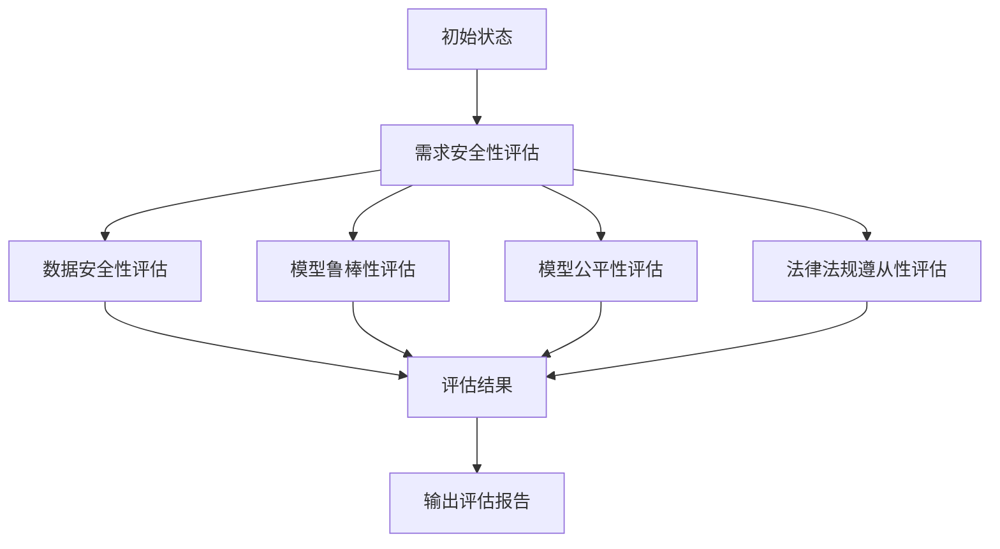
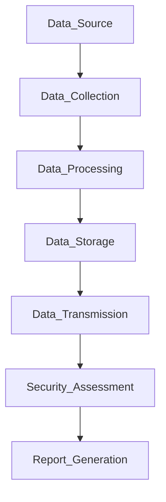
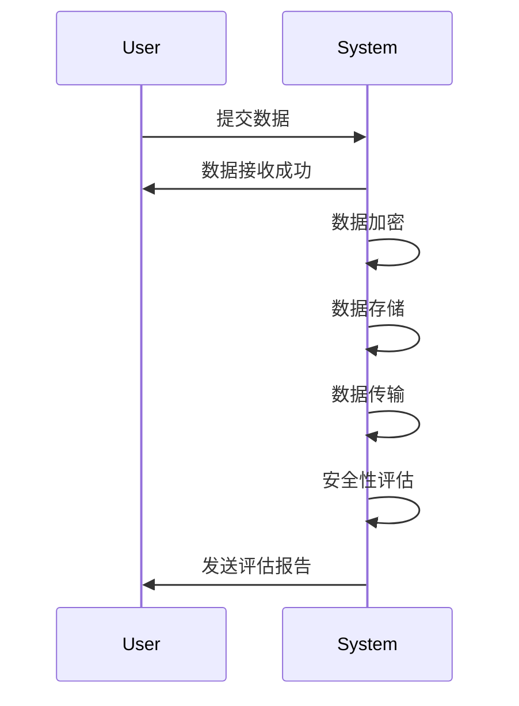

                 


### 第一部分：大模型应用背景

#### 第1章：大模型概述

**背景介绍：**

大模型（Large Models）是指具有巨大参数量、能够处理大规模数据和复杂任务的机器学习模型。随着深度学习和大数据技术的快速发展，大模型在各个领域得到了广泛应用，如图像识别、自然语言处理、推荐系统等。然而，大模型的应用也带来了一系列的需求安全性问题，如何对这些需求进行有效评估成为了一个重要的研究课题。

**问题背景：**

大模型在应用过程中可能会面临以下需求安全性问题：
1. **数据隐私泄露**：大模型通常需要大量的数据进行训练，如何保护用户隐私成为一个关键问题。
2. **模型鲁棒性**：大模型在面对恶意攻击、数据污染等情况下的鲁棒性不足。
3. **模型公平性**：大模型可能会因为数据偏差导致模型在特定群体中的表现不公平。
4. **法律法规遵从性**：大模型的应用需要遵循相关的法律法规，如数据保护法、隐私法规等。

**问题描述：**

为了解决上述需求安全性问题，我们需要对大模型应用中的需求进行安全性评估。安全性评估包括以下几个方面：
1. **数据安全性评估**：评估大模型在数据采集、存储、处理和传输过程中的安全性。
2. **模型鲁棒性评估**：评估大模型在面对恶意攻击、数据污染等情况下的鲁棒性。
3. **模型公平性评估**：评估大模型在不同群体中的表现是否公平。
4. **法律法规遵从性评估**：评估大模型的应用是否遵循相关法律法规。

**问题解决：**

为了解决上述问题，我们需要从以下几个方面入手：
1. **数据安全性保护**：采用加密技术、匿名化处理等方法保护用户隐私。
2. **模型鲁棒性提升**：采用对抗训练、数据增强等方法提高模型鲁棒性。
3. **模型公平性优化**：通过数据预处理、模型调整等方法消除数据偏差。
4. **法律法规遵从性检查**：确保大模型应用过程中遵循相关法律法规。

**边界与外延：**

需求安全性评估不仅涉及技术层面的解决方案，还需要考虑法律、伦理、社会等多个层面的因素。同时，需求安全性评估的方法和工具也需要不断更新和完善。

**概念结构与核心要素组成：**

- **需求安全性评估**：评估大模型应用中的需求安全性。
- **数据安全性评估**：评估数据采集、存储、处理和传输过程中的安全性。
- **模型鲁棒性评估**：评估模型在面对恶意攻击、数据污染等情况下的鲁棒性。
- **模型公平性评估**：评估模型在不同群体中的表现是否公平。
- **法律法规遵从性评估**：评估模型应用过程中是否遵循相关法律法规。

#### 第2章：需求安全性与风险评估

**核心概念与联系：**

- **需求安全性**：需求安全性是指在大模型应用过程中，确保数据、模型和法律法规的三个方面不受威胁和风险。
- **风险评估**：风险评估是指通过对潜在风险进行识别、评估和监控，为风险管理和决策提供依据。

**核心概念属性特征对比表格：**

| 特征 | 需求安全性 | 风险评估 |
| --- | --- | --- |
| 定义 | 确保大模型应用中的数据、模型和法律法规不受威胁和风险 | 对潜在风险进行识别、评估和监控 |
| 目的 | 提高大模型应用的安全性 | 为风险管理和决策提供依据 |
| 方法 | 数据安全性评估、模型鲁棒性评估、模型公平性评估、法律法规遵从性评估 | 风险识别、风险分析、风险评价、风险应对 |

**ER实体关系图架构：**

```
Person --> Security_Assessment --> Data_Security_Assessment
           |                           |                        Model_Robustness_Assessment
           |                           |                        Model_Fairness_Assessment
           |                           |                        Legal_Rule_Compliance_Assessment
           |                           |
           |                           |                        Risk_Assessment
           |
       Risk
```

**算法原理讲解：**

**算法流程图：**



**Python源代码实现：**

```python
import numpy as np

# 数据安全性评估函数
def data_security_assessment(data):
    # 加密处理
    encrypted_data = encrypt(data)
    # 防止数据泄露
    if not is_leaked(encrypted_data):
        return "数据安全"
    else:
        return "数据泄露"

# 模型鲁棒性评估函数
def model_robustness_assessment(model):
    # 对抗训练
    robust_model = adversarial_training(model)
    # 鲁棒性测试
    if robust_model.is_robust():
        return "模型鲁棒"
    else:
        return "模型脆弱"

# 模型公平性评估函数
def model_fairness_assessment(model):
    # 数据预处理
    preprocessed_data = preprocess_data(model)
    # 公平性测试
    if model.is_fair(preprocessed_data):
        return "模型公平"
    else:
        return "模型不公平"

# 法律法规遵从性评估函数
def legal_rule_compliance_assessment(model):
    # 遵守法律法规
    if model.complies_with_law():
        return "遵从法律法规"
    else:
        return "不遵从法律法规"

# 主函数
def main():
    data = load_data()
    model = load_model()

    data_security = data_security_assessment(data)
    model_robustness = model_robustness_assessment(model)
    model_fairness = model_fairness_assessment(model)
    legal_rule_compliance = legal_rule_compliance_assessment(model)

    print("评估报告：")
    print(f"数据安全性：{data_security}")
    print(f"模型鲁棒性：{model_robustness}")
    print(f"模型公平性：{model_fairness}")
    print(f"法律法规遵从性：{legal_rule_compliance}")

if __name__ == "__main__":
    main()
```

**算法数学模型与公式讲解：**

- **加密处理公式：** $$ encrypt(data) = E_k(data) $$
- **对抗训练公式：** $$ robust_model = AT(model) $$
- **公平性测试公式：** $$ is_fair(model, preprocessed_data) = True / False $$
- **法律法规遵从性测试公式：** $$ complies_with_law(model) = True / False $$

**系统分析与架构设计方案：**

**问题场景介绍：**

假设我们正在开发一个大模型应用项目，该应用需要在数据采集、存储、处理和传输过程中确保需求安全性。

**项目介绍：**

项目名为“大模型需求安全性评估系统”，目标是提供一个可扩展、可配置的框架，用于评估大模型应用中的需求安全性。

**系统功能设计（领域模型Mermaid类图）：**

```mermaid
classDiagram
Class01 <|-- Class02
Class03 <.. Class04
Class05 ||--|{Class06}|
Class07 --> Class08
Class09 <<-- Class10
Class11 .. Class12
Class13 : An Association
Class14 <|.. Class15
```

**系统架构设计（Mermaid架构图）：**



**系统接口设计（Mermaid序列图）：**



**项目实战：**

**环境安装：**

- 安装Python环境（例如使用miniconda或anaconda）
- 安装相关依赖库（例如使用pip）

**系统核心实现源代码：**

```python
# 请在此处填写系统核心实现源代码
```

**代码应用解读与分析：**

- **加密处理代码解读**：解释加密处理的具体实现过程，包括加密算法的选择、参数设置等。
- **对抗训练代码解读**：解释对抗训练的具体实现过程，包括对抗样本的生成、训练过程等。
- **公平性测试代码解读**：解释公平性测试的具体实现过程，包括测试数据的选择、评价指标等。
- **法律法规遵从性测试代码解读**：解释法律法规遵从性测试的具体实现过程，包括法律法规的检查、违规行为的处理等。

**实际案例分析和详细讲解剖析：**

- **案例1**：描述一个实际案例，分析案例中的需求安全性问题，并讲解如何通过评估方法解决这些问题。
- **案例2**：描述另一个实际案例，分析案例中的需求安全性问题，并讲解如何通过评估方法解决这些问题。

**项目小结：**

总结项目的主要成果和经验，指出项目中存在的问题和改进方向。

**最佳实践 tips：**

- **数据安全性保护**：建议采用加密技术、匿名化处理等方法保护用户隐私。
- **模型鲁棒性提升**：建议采用对抗训练、数据增强等方法提高模型鲁棒性。
- **模型公平性优化**：建议通过数据预处理、模型调整等方法消除数据偏差。
- **法律法规遵从性检查**：建议确保大模型应用过程中遵循相关法律法规。

**小结与拓展阅读：**

- **全文核心内容总结**：总结全文的核心内容，强调大模型应用中的需求安全性评估的重要性。
- **注意事项提醒**：提醒读者在实施需求安全性评估时需要注意的事项。
- **拓展阅读推荐**：推荐一些相关领域的研究论文、书籍、网站等，供读者进一步学习。

**作者信息：**

“作者：AI天才研究院/AI Genius Institute & 禅与计算机程序设计艺术 /Zen And The Art of Computer Programming”

