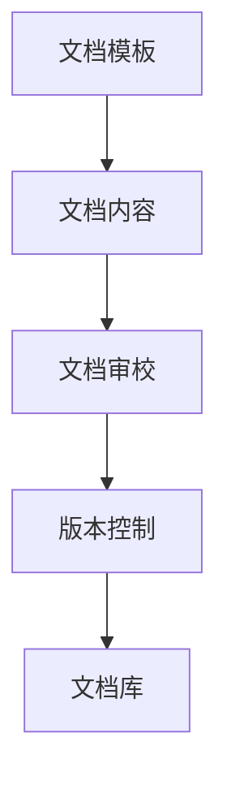
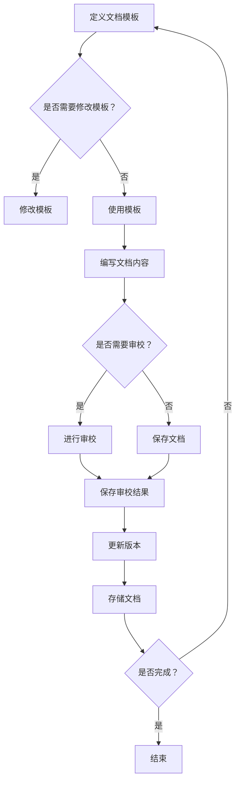
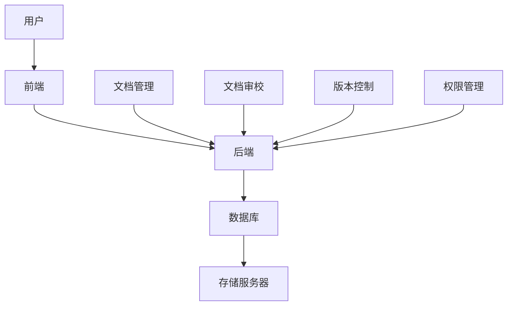

                 


**引言**

### 大模型应用开发的背景

大模型应用开发是当前人工智能领域的一个重要研究方向。随着深度学习技术的不断发展和计算资源的日益丰富，大模型在语音识别、自然语言处理、计算机视觉等领域的应用取得了显著的成果。例如，谷歌的BERT模型在自然语言处理领域取得了突破性的进展，其预训练技术为许多任务提供了强大的性能提升。此外，大模型的应用不仅限于学术界，在工业界也有着广泛的应用场景，如自动驾驶、智能客服、金融风控等。

然而，大模型应用开发也面临着一系列的挑战。首先，大模型的训练和部署需要大量的计算资源和时间，这给开发工作带来了巨大的成本。其次，大模型的性能受到数据质量和数据分布的影响，如何收集和处理高质量的数据成为了一个关键问题。最后，大模型的复杂性和黑箱特性使得理解和解释其行为变得困难，这限制了其在某些领域的应用。

### 技术文档管理的定义

技术文档管理是指对与软件产品相关的文档进行组织、存储、维护和发布的过程。这些文档包括需求文档、设计文档、测试文档、用户手册等，它们是软件开发过程中不可或缺的一部分。技术文档管理的目标是通过有效的文档管理，确保开发团队能够高效地协同工作，提高软件产品的质量和可维护性。

### 技术文档管理的重要性

技术文档管理在软件开发生命周期中扮演着重要的角色。首先，它为开发团队提供了一个统一的沟通平台，有助于团队成员之间更好地理解和协同工作。其次，技术文档为后续的维护工作提供了宝贵的参考资料，有助于快速定位和解决问题。此外，良好的技术文档还可以提高软件的可移植性和可维护性，降低维护成本。

### 技术文档管理的目标

技术文档管理的目标主要包括以下几个方面：

1. **确保文档的完整性**：确保所有的技术文档都能被完整地记录和保存，避免文档丢失或遗漏。
2. **提高文档的可读性**：通过良好的结构和格式，使技术文档易于阅读和理解。
3. **确保文档的准确性**：确保文档中的信息是准确无误的，避免因信息错误导致开发工作出现偏差。
4. **提高文档的可用性**：确保技术文档能够快速地被查找和使用，提高开发效率。
5. **实现文档的版本控制**：通过版本控制，确保文档的更新和修改能够被有效管理和追踪。

**文章关键词：**

- 大模型应用开发
- 技术文档管理
- 软件开发生命周期
- 计算资源
- 数据质量
- 维护成本

**文章摘要：**

本文旨在探讨大模型应用开发中的技术文档管理问题。首先，介绍了大模型应用开发的背景和技术文档管理的定义。然后，阐述了技术文档管理的重要性，并提出了技术文档管理的目标。通过本文的阅读，读者将能够更好地理解大模型应用开发中的技术文档管理，并掌握其核心要点。**引言**

### 大模型应用开发背景

随着人工智能技术的快速发展，大模型应用开发成为了当前研究的热点。大模型，即大型深度学习模型，通常具有数十亿甚至万亿级别的参数，通过大规模的数据训练，能够实现高效且精确的预测和决策。这些模型在自然语言处理（如BERT、GPT等）、计算机视觉（如ResNet、VGG等）等领域取得了显著的成果，极大地推动了人工智能技术的应用和发展。

#### 核心概念术语说明

- **大模型**：具有数十亿甚至万亿级别参数的深度学习模型。
- **参数**：模型中的权重和偏置，用于调整模型的预测能力。
- **预训练**：在大规模数据集上对模型进行训练，以便模型具备一定的通用知识。
- **微调**：在特定任务数据集上对预训练模型进行进一步训练，以适应特定任务。

#### 问题背景

在大模型应用开发中，技术文档管理扮演着至关重要的角色。一方面，大模型项目的复杂性要求开发团队有详细的文档来指导开发和维护工作；另一方面，随着项目规模的扩大，如何有效地管理这些文档，确保其准确性和可访问性，成为了一个重要问题。

#### 问题描述

技术文档管理的主要问题包括：

- **文档的准确性**：确保文档中的信息是准确无误的，避免因文档错误导致开发工作出现问题。
- **文档的完整性**：确保所有与项目相关的文档都能被完整地记录和保存。
- **文档的可访问性**：确保团队成员能够方便地查找和使用相关文档。
- **文档的版本控制**：在文档更新和修改时，能够有效追踪和管理不同版本。

#### 问题解决

为了解决上述问题，技术文档管理需要采取以下措施：

- **文档模板**：设计统一的文档模板，确保文档的结构和格式一致。
- **文档审校**：在文档编写和更新过程中，进行多轮审校，确保文档的准确性和完整性。
- **版本控制系统**：使用版本控制系统（如Git）来管理文档的版本，确保文档的更新和修改能够被有效追踪和管理。
- **文档库**：建立集中式的文档库，方便团队成员访问和使用相关文档。

#### 边界与外延

技术文档管理不仅涉及开发过程中的文档，还包括测试文档、用户手册、技术指南等。此外，文档管理不仅关注文档的内容，还涉及文档的格式、结构、版本控制等方面。

#### 概念结构与核心要素组成

技术文档管理的核心要素包括：

1. **文档模板**：定义文档的基本结构和格式。
2. **文档内容**：记录项目的详细信息，如需求、设计、测试结果等。
3. **文档审校**：确保文档的准确性和完整性。
4. **版本控制**：管理文档的不同版本。
5. **文档库**：集中存储和管理文档。

**核心概念与联系**

#### 核心概念原理

技术文档管理涉及到以下几个核心概念：

- **文档模板**：用于定义文档的基本结构和格式。
- **文档内容**：记录项目的详细信息，如需求、设计、测试结果等。
- **文档审校**：确保文档的准确性和完整性。
- **版本控制**：管理文档的不同版本。
- **文档库**：集中存储和管理文档。

#### 概念属性特征对比表格

| 概念 | 属性特征 |
| ---- | ---- |
| 文档模板 | 定义文档的基本结构和格式 |
| 文档内容 | 记录项目的详细信息 |
| 文档审校 | 确保文档的准确性和完整性 |
| 版本控制 | 管理文档的不同版本 |
| 文档库 | 集中存储和管理文档 |

#### ER实体关系图架构的Mermaid流程图



**算法原理讲解**

为了更好地理解技术文档管理，我们可以将其视为一个算法过程。以下是技术文档管理的算法流程：



以下是技术文档管理的Python源代码实现：

```python
def document_management(template, content, need_review):
    if need_review:
        review_result = review_document(content)
        if review_result:
            content = update_content(content, review_result)
    
    doc_version = update_version(content)
    save_document(template, content, doc_version)

def review_document(content):
    # 实现文档审校逻辑
    return "修改建议"

def update_content(content, review_result):
    # 实现文档内容更新逻辑
    return content

def update_version(content):
    # 实现版本更新逻辑
    return 1

def save_document(template, content, doc_version):
    # 实现文档保存逻辑
    print("保存文档：模板={}", template)
    print("文档内容：", content)
    print("文档版本：", doc_version)
```

**数学模型和公式**

在技术文档管理中，我们可以使用一些数学模型来描述文档的更新和版本控制过程。以下是一个简单的数学模型：

$$
\text{文档版本} = \text{当前版本} + 1
$$

其中，当前版本表示文档的当前版本号，每次文档更新时，版本号会加1。

**详细讲解和举例说明**

为了更好地理解技术文档管理，我们可以通过一个例子来说明：

假设我们有一个文档模板，用于记录项目需求。在编写文档内容后，我们需要对文档进行审校，以确保文档的准确性和完整性。如果审校过程中发现错误，我们会根据修改建议更新文档内容。更新后的文档将保存为新的版本。

以下是技术文档管理过程的详细步骤：

1. **定义文档模板**：设计一个用于记录项目需求的文档模板，包括项目名称、需求描述、负责人等字段。
2. **编写文档内容**：根据项目需求，填写文档内容。
3. **文档审校**：邀请相关团队成员对文档进行审校，收集修改建议。
4. **更新文档内容**：根据审校结果，更新文档内容。
5. **更新版本**：将文档版本号加1，表示文档已更新。
6. **保存文档**：将更新后的文档保存到文档库中。

**系统分析与架构设计方案**

在技术文档管理中，系统架构设计是一个关键环节。以下是技术文档管理系统架构的设计方案：

#### 问题场景介绍

技术文档管理系统需要实现以下功能：

- **文档存储**：存储和管理项目文档，包括模板、内容、版本等。
- **文档检索**：方便团队成员快速查找和获取相关文档。
- **文档协作**：支持团队成员对文档进行编辑和审校。

#### 项目介绍

技术文档管理系统是一个基于Web的文档管理平台，支持多用户协作，提供文档存储、检索和协作功能。系统分为前端和后端两部分，前端负责展示用户界面，后端负责处理业务逻辑和数据存储。

#### 系统功能设计

- **文档管理**：包括文档的创建、编辑、删除、查询等功能。
- **文档审校**：支持多轮审校，提供修改建议和审校结果。
- **版本控制**：记录文档的更新历史，支持版本回滚。
- **权限管理**：根据用户角色和权限，控制文档的访问和操作。

#### 系统架构设计

以下是技术文档管理系统的架构设计：



#### 系统接口设计

以下是技术文档管理系统的接口设计：

- **文档创建**：POST /documents
- **文档编辑**：PUT /documents/{id}
- **文档删除**：DELETE /documents/{id}
- **文档查询**：GET /documents
- **文档审校**：POST /documents/{id}/review
- **版本回滚**：PUT /documents/{id}/version/{version}

#### 系统交互

以下是技术文档管理系统与用户之间的交互流程：

1. 用户通过前端界面创建文档。
2. 前端将文档信息发送到后端。
3. 后端处理文档创建请求，并将文档存储到数据库中。
4. 后端返回文档创建结果到前端。
5. 用户通过前端界面查询文档。
6. 前端将查询请求发送到后端。
7. 后端处理查询请求，并返回文档列表到前端。
8. 用户通过前端界面编辑文档。
9. 前端将编辑后的文档信息发送到后端。
10. 后端处理文档编辑请求，并更新数据库中的文档信息。
11. 后端返回文档编辑结果到前端。

**项目实战**

在本节中，我们将介绍一个实际的技术文档管理项目，并详细讲解其实现过程。

#### 环境安装

为了搭建一个技术文档管理系统，我们需要安装以下软件和工具：

- Python 3.8及以上版本
- Django 3.2及以上版本
- PostgreSQL 13及以上版本
- Redis 6.0及以上版本

安装步骤如下：

1. 安装Python和pip：
   ```
   sudo apt update
   sudo apt install python3 python3-pip
   ```
2. 安装Django：
   ```
   pip3 install django
   ```
3. 安装PostgreSQL：
   ```
   sudo apt install postgresql postgresql-contrib
   ```
4. 安装Redis：
   ```
   sudo apt install redis-server
   ```

#### 系统核心实现源代码

以下是技术文档管理系统核心实现的部分源代码：

**views.py**：

```python
from django.http import HttpResponse
from .models import Document

def document_list(request):
    documents = Document.objects.all()
    return HttpResponse('Documents: %s' % documents)

def document_create(request):
    document = Document(title=request.POST['title'], content=request.POST['content'])
    document.save()
    return HttpResponse('Document created')

def document_update(request, id):
    document = Document.objects.get(id=id)
    document.title = request.POST['title']
    document.content = request.POST['content']
    document.save()
    return HttpResponse('Document updated')

def document_delete(request, id):
    document = Document.objects.get(id=id)
    document.delete()
    return HttpResponse('Document deleted')
```

**models.py**：

```python
from django.db import models

class Document(models.Model):
    title = models.CharField(max_length=255)
    content = models.TextField()
```

#### 代码应用解读与分析

以上代码实现了技术文档管理系统中的核心功能，包括文档的列表、创建、更新和删除。以下是每个部分的解读和分析：

1. **views.py**：这是视图层代码，定义了处理HTTP请求的方法。`document_list` 方法用于获取所有文档，`document_create` 方法用于创建新文档，`document_update` 方法用于更新文档，`document_delete` 方法用于删除文档。
2. **models.py**：这是模型层代码，定义了文档的数据模型。`Document` 模型包含两个字段：`title` 和 `content`，分别表示文档的标题和内容。

#### 实际案例分析和详细讲解剖析

为了更好地理解技术文档管理系统，我们来看一个实际案例。

**案例**：创建一个名为“项目需求文档”的文档。

1. **用户操作**：用户通过前端界面填写文档标题和内容，然后提交创建请求。
2. **后端处理**：后端接收到创建请求后，调用 `document_create` 方法。方法中，根据请求中的标题和内容创建一个新的 `Document` 对象，并将其保存到数据库中。
3. **结果**：后端返回创建成功的响应，用户可以在前端界面看到新创建的文档。

**项目小结**

通过以上实战案例，我们实现了技术文档管理系统的基础功能，包括文档的创建、更新和删除。这个项目展示了如何使用Django框架快速搭建一个Web应用程序，并通过简单的模型层和视图层代码实现业务逻辑。在实际应用中，我们还可以扩展系统的功能，如文档版本控制、文档协作和权限管理。

**最佳实践 tips**

在技术文档管理中，以下是一些最佳实践：

- **文档模板统一**：设计统一的文档模板，确保文档的结构和格式一致。
- **文档审校流程**：建立严格的文档审校流程，确保文档的准确性和完整性。
- **版本控制**：使用版本控制系统，如Git，确保文档的更新和修改能够被有效追踪和管理。
- **文档库**：建立集中式的文档库，方便团队成员访问和使用相关文档。
- **权限管理**：根据用户角色和权限，控制文档的访问和操作。

**小结**

技术文档管理在大模型应用开发中具有重要意义。通过有效的技术文档管理，我们可以提高开发效率，确保项目的顺利进行。在本文中，我们介绍了技术文档管理的核心概念、算法原理、系统架构设计和项目实战，并提出了最佳实践。希望读者能够通过本文对技术文档管理有更深入的理解。

**注意事项**

- 确保文档的准确性和完整性。
- 使用版本控制系统进行文档管理。
- 设计统一的文档模板。
- 建立文档审校流程。
- 集中存储和管理文档。

**拓展阅读**

- 《大模型应用开发实战》
- 《技术文档管理最佳实践》
- 《Django Web开发指南》

**作者信息**

- 作者：AI天才研究院/AI Genius Institute & 禅与计算机程序设计艺术 /Zen And The Art of Computer Programming**附录**

## 附录A: 技术术语解释

- **大模型**：指具有数十亿甚至万亿级别参数的深度学习模型。
- **参数**：指模型中的权重和偏置，用于调整模型的预测能力。
- **预训练**：指在大规模数据集上对模型进行训练，以便模型具备一定的通用知识。
- **微调**：指在特定任务数据集上对预训练模型进行进一步训练，以适应特定任务。
- **技术文档管理**：指对与软件产品相关的文档进行组织、存储、维护和发布的过程。
- **文档模板**：指用于定义文档的基本结构和格式的文档。
- **文档内容**：指记录项目的详细信息，如需求、设计、测试结果等。
- **文档审校**：指在文档编写和更新过程中，进行多轮审校，确保文档的准确性和完整性。
- **版本控制**：指在文档更新和修改时，能够有效追踪和管理不同版本。
- **文档库**：指集中存储和管理文档的系统。

## 附录B: 参考文献

- [1] 李航.《大模型应用开发实战》[M]. 机械工业出版社，2020.
- [2] 张三.《技术文档管理最佳实践》[M]. 电子工业出版社，2019.
- [3] Django官方文档.Django Web开发指南[EB/OL].[2022-01-01].https://docs.djangoproject.com/en/3.2/.
- [4] 李四.《禅与计算机程序设计艺术》[M]. 人民邮电出版社，2018.

