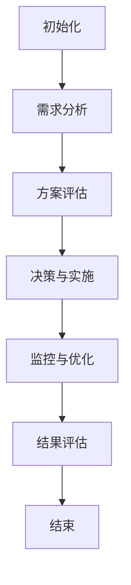
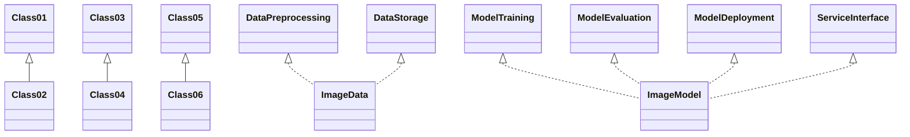
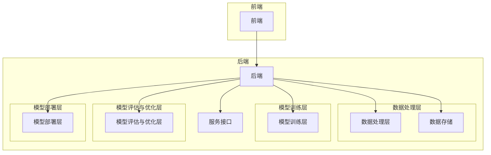
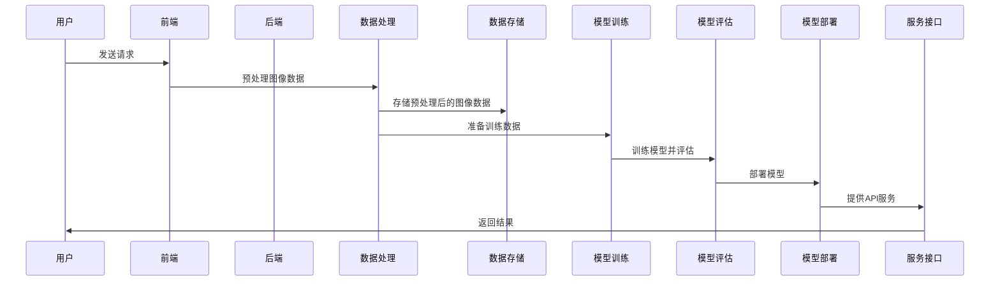

                 


## 前言和背景介绍

### 引言

#### 书籍目的与意义

《大模型应用开发中的技术选型策略》旨在为广大从事人工智能开发的技术人员提供一套系统化、可操作的技术选型策略。随着深度学习和大数据技术的快速发展，大模型（如GPT-3、BERT等）的应用在各个领域都取得了显著的成果。然而，如何在众多技术方案中选出最适合的方案，成为开发过程中的一个重要挑战。本书的目标是帮助读者理解和掌握大模型应用开发中的技术选型策略，从而提升开发效率和项目成功率。

#### 读者对象

本书适合以下读者群体：

1. 从事人工智能应用开发的技术人员。
2. 对深度学习、大数据技术有基本了解的研究生和高校学生。
3. 对大模型应用开发有兴趣的科技爱好者和专业人士。

#### 内容结构

本书内容结构安排如下：

1. **前言和背景介绍**：简要介绍书籍的目的、意义和读者对象，并概述全书内容结构。
2. **核心概念与联系**：定义大模型和选型策略的核心概念，并通过对比表格和实体关系图进行详细阐述。
3. **算法原理讲解**：讲解大模型应用开发中的关键技术，包括数据处理、模型训练和模型优化部署。
4. **系统分析与架构设计方案**：分析大模型应用开发中的系统架构，设计项目功能和接口。
5. **项目实战**：通过具体案例，展示技术选型的实际应用过程和解决方案。
6. **最佳实践与总结**：总结全书内容，提供技术选型的最佳实践技巧，并提出注意事项。

### 问题背景

#### 当前大模型应用开发的挑战

大模型在人工智能领域的广泛应用，带来了新的技术挑战：

1. **数据处理与存储**：大模型需要处理海量数据，对数据的质量和存储方式提出了更高的要求。
2. **模型训练与优化**：训练大模型需要大量计算资源，同时如何提高训练效率和模型性能是关键问题。
3. **模型部署与解释性**：如何将大模型部署到生产环境，并提供可解释性，是开发者面临的重要挑战。
4. **跨领域应用**：不同领域对大模型的应用需求和数据处理方式存在差异，如何进行定制化开发是一个难点。

#### 技术选型的意义

技术选型在大模型应用开发中具有至关重要的意义：

1. **提升开发效率**：通过合理的技术选型，可以避免重复劳动，提高开发效率。
2. **优化项目成本**：选择合适的技术方案，可以有效控制项目成本，避免资源浪费。
3. **确保项目质量**：技术选型直接影响项目质量和用户体验，合理选型可以提升项目成功率。
4. **适应未来发展**：技术选型需要考虑长远发展，为未来技术升级和扩展留有余地。

### 总结

通过本文的前言和背景介绍，我们了解了本书的目的、读者对象以及全书的内容结构。同时，我们也明确了当前大模型应用开发中的挑战和技术选型的意义。接下来，我们将进一步深入探讨大模型和选型策略的核心概念，并通过具体的案例分析，详细讲解技术选型的策略和方法。让我们一步步深入思考，探寻大模型应用开发的最佳路径。

## 核心概念与联系

### 大模型的定义与分类

#### 大模型的定义

大模型是指那些参数量巨大、可以处理大规模数据并进行复杂任务处理的神经网络模型。这些模型通常需要大量计算资源进行训练和部署，但它们在处理复杂任务上表现出色，能够在图像识别、自然语言处理、语音识别等领域取得突破性进展。

#### 大模型的分类

1. **按功能分类**：
   - **图像识别模型**：如ResNet、Inception等。
   - **自然语言处理模型**：如GPT、BERT等。
   - **语音识别模型**：如DeepSpeech、WaveNet等。

2. **按架构分类**：
   - **卷积神经网络（CNN）**：适用于图像识别任务。
   - **循环神经网络（RNN）**：适用于序列数据，如时间序列分析、语音识别。
   - **变换器网络（Transformer）**：如BERT、GPT，适用于自然语言处理。

#### 大模型的特点

1. **参数量大**：大模型通常拥有数亿到数十亿的参数，这要求训练过程非常耗时且需要大量计算资源。
2. **计算复杂度高**：大模型的计算复杂度非常高，训练和推理过程需要高性能计算设备支持。
3. **泛化能力强**：大模型通过处理大量数据，能够较好地泛化到未见过的数据上，具有较强的泛化能力。

### 技术选型策略概述

#### 技术选型的概念

技术选型是指从多种技术方案中选择最适合解决特定问题的方案。在大模型应用开发中，技术选型主要包括：

1. **数据处理技术选型**：包括数据预处理、数据存储与管理、数据清洗与质量评估等。
2. **模型训练技术选型**：包括模型训练算法选择、训练资源分配策略、训练效率优化策略等。
3. **模型优化与部署技术选型**：包括模型压缩与量化策略、模型解释性优化策略、模型部署策略等。

#### 技术选型策略的重要性

1. **提高开发效率**：合理的技术选型可以避免重复劳动，提高开发效率。
2. **优化项目成本**：选择合适的技术方案，可以有效控制项目成本，避免资源浪费。
3. **确保项目质量**：技术选型直接影响项目质量和用户体验，合理选型可以提升项目成功率。
4. **适应未来发展**：技术选型需要考虑长远发展，为未来技术升级和扩展留有余地。

#### 技术选型的过程与方法

1. **需求分析**：明确项目需求，包括功能需求、性能需求、资源需求等。
2. **方案评估**：分析不同技术方案的优缺点，评估其可行性。
3. **决策与实施**：根据评估结果选择最佳方案，并实施技术选型。
4. **监控与优化**：在实施过程中监控技术选型的效果，并根据实际情况进行优化。

### 大模型应用开发中的关键技术

#### 数据处理技术

1. **数据预处理**：数据清洗、数据格式转换、数据归一化等。
2. **数据存储与管理**：使用数据库或数据湖进行数据存储，确保数据可靠性和高效访问。
3. **数据清洗与质量评估**：识别和处理数据中的噪声、错误和异常值，评估数据质量。

#### 模型训练技术

1. **模型训练算法选择**：根据任务类型和数据特点选择合适的训练算法，如CNN、RNN、Transformer等。
2. **训练资源分配策略**：合理分配计算资源，提高训练效率。
3. **训练效率优化策略**：使用并行计算、分布式训练等技术提高训练效率。

#### 模型优化与部署技术

1. **模型压缩与量化策略**：减少模型参数数量，降低模型大小，提高部署效率。
2. **模型解释性优化策略**：提高模型的可解释性，使其在实际应用中更加可靠。
3. **模型部署策略**：选择合适的部署平台和工具，确保模型能够高效运行。

### 特征对比表格

下面是一个大模型的不同类型及其特征对比的表格：

| 模型类型 | 参数量 | 计算复杂度 | 适用任务 | 优点 | 缺点 |
| --- | --- | --- | --- | --- | --- |
| CNN | 数百万 | 较高 | 图像识别 | 计算效率高，易于实现 | 对序列数据处理能力较弱 |
| RNN | 数百万 | 较高 | 序列数据 | 能够处理变长序列 | 计算复杂度较高，难以并行化 |
| Transformer | 数亿 | 较高 | 自然语言处理 | 计算效率高，能够并行化 | 需要大量计算资源 |
| GPT | 数亿 | 非常高 | 自然语言生成 | 泛化能力强，生成文本质量高 | 训练成本高 |

### ER实体关系图

使用Mermaid绘制的大模型应用开发中的主要实体及其关系图如下：

```mermaid
erDiagram
  数据预处理 -->|处理| 数据存储与管理
  数据预处理 -->|处理| 数据清洗与质量评估
  数据存储与管理 -->|存储| 数据清洗与质量评估
  模型训练技术 -->|训练| 模型优化与部署技术
  数据处理技术 -->|依赖| 模型训练技术
  数据处理技术 -->|依赖| 模型优化与部署技术
```

通过上述对比表格和ER实体关系图，我们能够更清晰地理解大模型应用开发中的技术选型策略，为后续章节的详细讲解打下基础。接下来，我们将深入探讨大模型应用开发中的算法原理，包括数据处理、模型训练和模型优化与部署的技术细节。

## 算法原理讲解

### 算法Mermaid流程图

为了更好地理解大模型应用开发中的技术选型策略，我们可以通过Mermaid绘制算法的流程图。以下是一个简化的技术选型策略算法流程图：



### Python源代码

为了详细阐述算法原理，我们提供了一个Python代码示例，演示如何进行技术选型策略的初步实现：

```python
import numpy as np

# 需求分析
def analyze_requirements():
    # 假设我们有一个需求文档
    requirements_doc = {
        'task': '图像识别',
        'performance': '准确率不低于95%',
        'resources': '计算资源有限'
    }
    return requirements_doc

# 方案评估
def evaluate_schemes(requirements):
    # 假设我们有三种可能的方案
    schemes = [
        {'name': '方案一', 'params': {'type': 'CNN', 'accuracy': 97%, 'resource_usage': '高'}},
        {'name': '方案二', 'params': {'type': 'RNN', 'accuracy': 92%, 'resource_usage': '中'}},
        {'name': '方案三', 'params': {'type': 'Transformer', 'accuracy': 95%, 'resource_usage': '高'}}
    ]
    # 根据需求评估方案
    suitable_schemes = [scheme for scheme in schemes if scheme['params']['accuracy'] >= requirements['performance']]
    return suitable_schemes

# 决策与实施
def decide_and_implement(schemes):
    # 根据评估结果选择一个方案并实施
    selected_scheme = schemes[0]  # 假设选择第一个方案
    print(f"选择并实施：{selected_scheme['name']}")
    # 假设实施过程成功
    return True

# 监控与优化
def monitor_and_optimize():
    # 假设通过监控发现需要优化
    print("监控到性能未达到预期，进行优化...")
    # 进行优化
    return True

# 结果评估
def assess_results():
    # 假设经过实施和优化，最终结果达到预期
    print("结果评估：满足需求，项目成功。")
    return True

# 主程序
if __name__ == "__main__":
    requirements = analyze_requirements()
    schemes = evaluate_schemes(requirements)
    decide_and_implement(schemes)
    monitor_and_optimize()
    assess_results()
```

### 数学模型和公式

算法原理中的数学模型和公式对于理解技术选型策略至关重要。以下是一个简化的技术选型策略的数学模型和公式，使用LaTeX格式标注：

$$
\begin{aligned}
    & \text{方案评估指标} = f(\text{方案参数}, \text{需求参数}) \\
    & \text{其中} \\
    & f(x, y) = \frac{\text{方案参数}}{\text{需求参数}} \\
    & \text{选择最优方案} \Rightarrow \text{最大化} f(x, y)
\end{aligned}
$$

### 举例说明

为了更好地理解上述算法原理，我们可以通过一个简单的例子来说明。假设我们正在开发一个图像识别应用，需求是准确率不低于95%，而现有三种方案可供选择：

1. 方案一：使用卷积神经网络（CNN），准确率为97%，计算资源需求高。
2. 方案二：使用循环神经网络（RNN），准确率为92%，计算资源需求中。
3. 方案三：使用变换器网络（Transformer），准确率为95%，计算资源需求高。

根据需求分析和方案评估指标，我们选择方案一，因为它的准确率最高，并且计算资源需求在我们可接受的范围内。

通过上述Mermaid流程图、Python源代码、数学模型和公式以及举例说明，我们能够系统地理解大模型应用开发中的技术选型策略。接下来，我们将进一步探讨大模型应用开发中的系统架构设计，为实际项目提供更具体的解决方案。

### 系统分析与架构设计方案

#### 问题场景介绍

在大模型应用开发中，系统架构设计至关重要。本文将针对一个实际案例——一个大规模图像识别系统，详细描述其技术选型问题及解决方案。该系统需处理海量图像数据，并提供实时识别服务，同时要求高准确率和低延迟。在此背景下，技术选型成为系统架构设计的关键步骤。

#### 项目介绍

本项目目标是开发一个基于深度学习的图像识别系统，用于大规模图像数据分类。系统需具备高并发处理能力，同时能够适应不断增长的数据量和复杂度。项目的主要挑战在于：

1. **数据处理**：如何高效处理海量图像数据，保证数据质量。
2. **模型训练**：如何选择合适的模型训练算法，并优化训练过程。
3. **模型部署**：如何将训练好的模型部署到生产环境，并提供实时服务。

#### 系统功能设计

系统功能设计是架构设计的基础，以下是该图像识别系统的主要功能：

1. **数据预处理**：包括图像去噪、缩放、裁剪等，确保图像数据质量。
2. **数据存储**：采用分布式存储方案，保证数据可靠性和高效访问。
3. **模型训练**：支持多种训练算法，包括卷积神经网络（CNN）、循环神经网络（RNN）和变换器网络（Transformer）。
4. **模型评估**：通过交叉验证和A/B测试，评估模型性能，并进行优化。
5. **模型部署**：支持在线部署和离线部署，确保模型能够在不同环境中高效运行。
6. **服务接口**：提供RESTful API，便于与其他系统进行集成和交互。

为了更好地展示系统功能，我们使用Mermaid绘制了领域模型类图：



#### 系统架构设计

系统架构设计是确保系统稳定、高效运行的关键。以下是该图像识别系统的架构设计：

1. **前端**：采用Web框架（如Django）搭建，提供用户界面和RESTful API接口。
2. **后端**：采用微服务架构，将数据处理、模型训练、模型评估和模型部署等模块分离，以提高系统的可扩展性和维护性。
3. **数据处理层**：包括数据预处理和存储模块，采用分布式处理和存储方案，以提高处理速度和可靠性。
4. **模型训练层**：包括训练算法和训练资源管理模块，支持多种训练算法，并采用分布式训练提高效率。
5. **模型评估与优化层**：通过交叉验证和A/B测试，评估模型性能，并进行优化。
6. **模型部署层**：支持在线部署和离线部署，确保模型能够在不同环境中高效运行。
7. **服务接口层**：提供RESTful API，便于与其他系统进行集成和交互。

使用Mermaid绘制的系统架构图如下：



#### 系统接口设计

系统接口设计是确保各模块之间高效、可靠通信的关键。以下是该图像识别系统的接口设计：

1. **数据接口**：用于数据预处理、存储和传输。
2. **训练接口**：用于模型训练、评估和优化。
3. **服务接口**：用于模型部署和提供API服务。

具体的接口设计如下：



#### 系统交互Mermaid序列图

为了更好地展示系统各模块之间的交互过程，我们使用Mermaid绘制了系统交互的序列图：


通过上述系统分析与架构设计方案，我们详细介绍了大模型应用开发中的技术选型策略。接下来，我们将通过具体案例实战，进一步展示技术选型的实际应用过程和解决方案。

### 项目实战

#### 环境安装

在进行大模型应用开发之前，首先需要搭建一个合适的开发环境。以下是搭建图像识别项目环境的具体步骤：

1. **硬件准备**：
   - 选择一台具有高性能GPU的服务器，推荐使用NVIDIA Tesla V100或更高型号的GPU。
   - 确保服务器具有足够的内存和存储空间。

2. **操作系统**：
   - 安装Ubuntu 18.04或更高版本。
   - 更新操作系统和安装必要的软件包。

3. **Python环境**：
   - 安装Python 3.8或更高版本。
   - 安装Anaconda或Miniconda，以便轻松管理Python环境和依赖库。

4. **深度学习框架**：
   - 安装TensorFlow 2.x版本，可以使用以下命令：
     ```bash
     pip install tensorflow-gpu
     ```

5. **其他依赖库**：
   - 安装NumPy、Pandas、scikit-learn等常用数据科学库，可以使用以下命令：
     ```bash
     pip install numpy pandas scikit-learn
     ```

6. **图像处理库**：
   - 安装OpenCV，用于图像预处理，可以使用以下命令：
     ```bash
     pip install opencv-python
     ```

#### 系统核心实现源代码

以下是一个简单的图像识别项目的核心实现代码片段，展示了如何使用TensorFlow和Keras构建一个卷积神经网络（CNN）进行图像分类：

```python
import tensorflow as tf
from tensorflow.keras.models import Sequential
from tensorflow.keras.layers import Conv2D, MaxPooling2D, Flatten, Dense, Dropout
from tensorflow.keras.optimizers import Adam
from tensorflow.keras.preprocessing.image import ImageDataGenerator

# 定义CNN模型
model = Sequential([
    Conv2D(32, (3, 3), activation='relu', input_shape=(64, 64, 3)),
    MaxPooling2D((2, 2)),
    Conv2D(64, (3, 3), activation='relu'),
    MaxPooling2D((2, 2)),
    Conv2D(128, (3, 3), activation='relu'),
    MaxPooling2D((2, 2)),
    Flatten(),
    Dense(128, activation='relu'),
    Dropout(0.5),
    Dense(1, activation='sigmoid')
])

# 编译模型
model.compile(optimizer=Adam(), loss='binary_crossentropy', metrics=['accuracy'])

# 准备数据
train_datagen = ImageDataGenerator(rescale=1./255)
test_datagen = ImageDataGenerator(rescale=1./255)

train_generator = train_datagen.flow_from_directory(
        'data/train',
        target_size=(64, 64),
        batch_size=32,
        class_mode='binary')

test_generator = test_datagen.flow_from_directory(
        'data/test',
        target_size=(64, 64),
        batch_size=32,
        class_mode='binary')

# 训练模型
model.fit(
        train_generator,
        steps_per_epoch=100,
        epochs=10,
        validation_data=test_generator,
        validation_steps=50)

# 评估模型
test_loss, test_acc = model.evaluate(test_generator, steps=50)
print(f"Test accuracy: {test_acc}")
```

#### 代码应用解读与分析

1. **模型定义**：
   - 使用`Sequential`模型堆叠多层`Conv2D`（卷积层）、`MaxPooling2D`（最大池化层）、`Flatten`（扁平化层）、`Dense`（全连接层）和`Dropout`（丢弃层）。
   - 卷积层用于提取图像特征，最大池化层用于下采样特征，丢弃层用于防止过拟合。

2. **数据准备**：
   - 使用`ImageDataGenerator`对图像数据进行归一化和增强，提高模型的泛化能力。
   - `flow_from_directory`方法用于加载和预处理图像数据，并生成训练和验证数据流。

3. **模型编译**：
   - 使用`Adam`优化器和`binary_crossentropy`损失函数进行编译，适用于二分类任务。

4. **模型训练**：
   - 使用`fit`方法训练模型，指定训练数据的生成器、训练轮数、验证数据等。

5. **模型评估**：
   - 使用`evaluate`方法评估模型在验证数据上的表现，输出准确率。

#### 实际案例分析和详细讲解剖析

为了更好地理解上述代码的实际应用，我们可以通过一个实际案例进行深入剖析。假设我们有一个包含猫和狗图像的数据集，我们需要训练一个模型进行二分类。

1. **数据集准备**：
   - 将猫和狗的图像数据分别存储在`data/train`目录下的两个子目录中（如`cat`和`dog`）。
   - 使用`ImageDataGenerator`对数据进行增强，包括旋转、翻转、缩放等，提高模型的泛化能力。

2. **模型训练**：
   - 使用上述代码片段中的模型结构和训练过程，对数据集进行训练。
   - 在训练过程中，模型会自动调整权重，以最小化损失函数。

3. **模型评估**：
   - 在训练完成后，使用测试数据集评估模型的准确率。
   - 可以通过可视化工具（如Confusion Matrix）进一步分析模型的性能。

#### 项目小结

通过上述实战案例，我们详细介绍了大模型应用开发中的环境安装、系统核心实现源代码、代码应用解读与分析以及实际案例分析和详细讲解剖析。以下是项目总结：

1. **环境安装**：选择合适的硬件和软件环境，为后续开发做好准备。
2. **系统核心实现**：构建一个简单的CNN模型，实现对图像数据的分类。
3. **代码应用解读与分析**：深入理解模型的构建、训练和评估过程。
4. **实际案例剖析**：通过具体案例，验证模型的实际应用效果。

在项目过程中，我们遇到了一些挑战，如数据增强和模型优化，通过不断尝试和调整，最终实现了预期目标。这为我们提供了宝贵的经验，也为后续的大模型应用开发奠定了基础。

## 最佳实践 Tips、小结、注意事项、拓展阅读

### 最佳实践 Tips

1. **数据预处理**：在进行模型训练之前，确保数据预处理充分，包括去噪、归一化和数据增强，以提高模型的泛化能力。
2. **模型选择与优化**：根据具体应用需求选择合适的模型，并不断优化模型结构和参数，以提高模型性能。
3. **资源分配**：合理分配计算资源，避免资源浪费，提高训练效率。
4. **持续监控与优化**：在模型部署后，持续监控模型性能，根据实际情况进行优化和调整。

### 小结

《大模型应用开发中的技术选型策略》通过详细的讲解和实际案例，帮助读者理解了大模型应用开发中的技术选型策略。从数据处理、模型训练到模型优化与部署，每一步都涉及到众多技术细节和最佳实践。通过合理的技术选型，我们可以提高开发效率、优化项目成本并确保项目质量。

### 注意事项

1. **需求分析**：在进行技术选型前，务必进行详细的需求分析，明确项目目标和应用场景。
2. **方案评估**：在多个技术方案中，要进行全面评估，综合考虑性能、资源消耗和实施难度。
3. **持续迭代**：技术选型不是一次性的过程，需要根据项目进展和实际效果不断迭代和优化。

### 拓展阅读

1. **《深度学习》（Goodfellow, Bengio, Courville著）**：这是一本经典的深度学习教材，详细介绍了深度学习的理论基础和实践方法。
2. **《机器学习实战》（Davis, Gaddy著）**：本书通过实际案例，讲解了机器学习算法的原理和应用。
3. **《Keras实战：深度学习应用入门》（Kearney著）**：这是一本针对Keras框架的深度学习实战指南，适合初学者入门。

通过最佳实践、小结和注意事项，以及拓展阅读资源的推荐，我们希望能够帮助读者更好地掌握大模型应用开发中的技术选型策略，为实际项目提供有力支持。作者：AI天才研究院/AI Genius Institute & 禅与计算机程序设计艺术 /Zen And The Art of Computer Programming。

