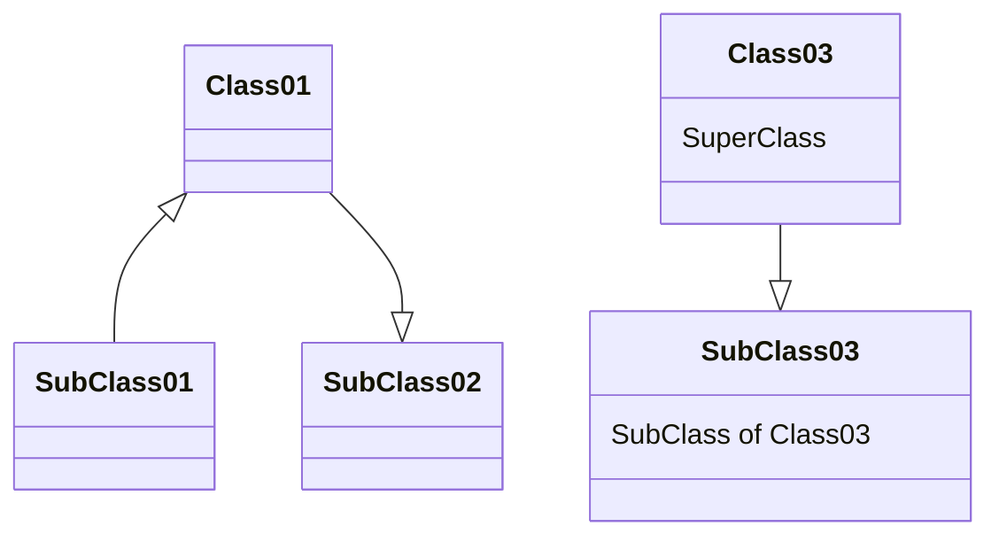
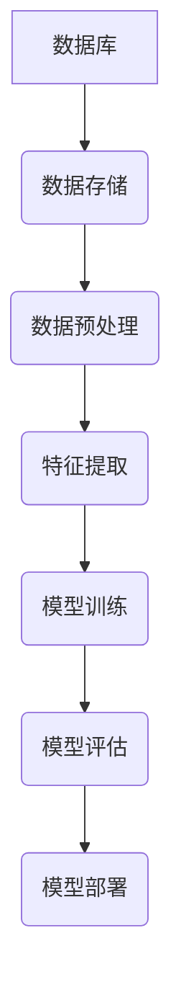
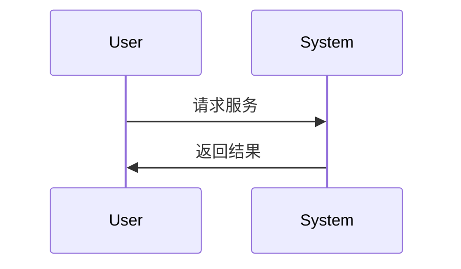
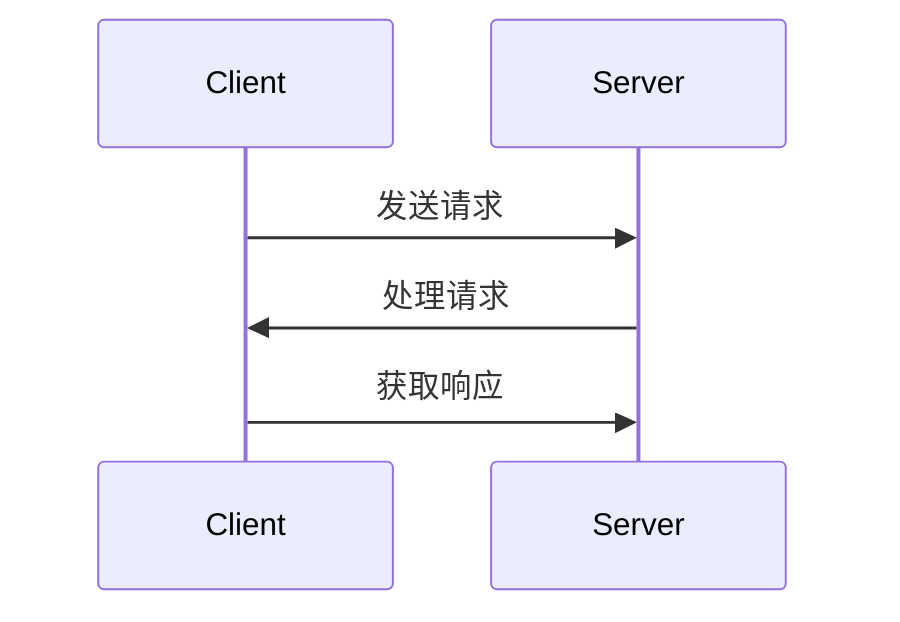
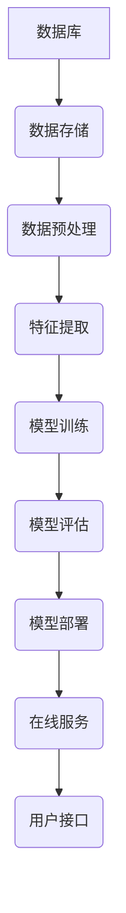
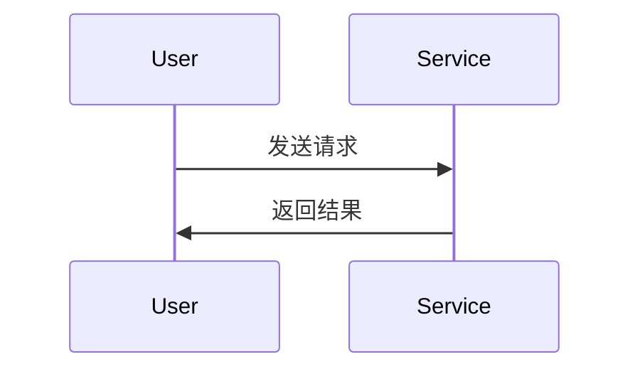
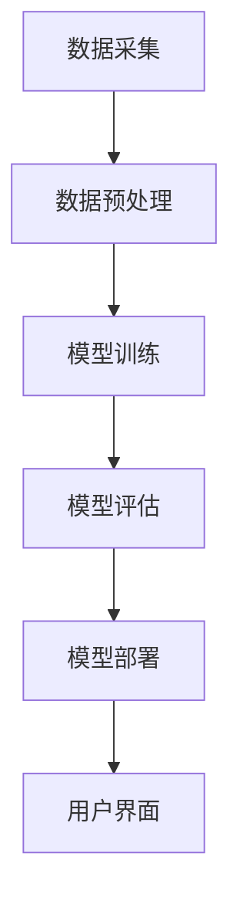

                 

# 大模型应用开发中的敏捷实践

> 关键词：大模型、敏捷实践、开发、应用、算法、系统架构

> 摘要：本文将探讨大模型应用开发中的敏捷实践。首先，我们将介绍大模型的应用背景和敏捷实践的基本概念。接着，我们将详细阐述大模型的基本概念和组成部分，以及大模型与敏捷实践之间的联系。然后，我们将讲解大模型算法的原理和实现，并通过实际项目展示大模型应用开发的敏捷实践。最后，我们将总结本文要点，提供最佳实践建议，并提醒读者注意事项。

### 设计思路

为了设计《大模型应用开发中的敏捷实践》这本书的目录大纲，我们需要按照以下步骤进行：

1. **背景介绍**：首先，我们需要对书中的核心概念进行背景介绍，包括问题背景、问题描述、问题解决、边界与外延、概念结构与核心要素组成。

2. **核心概念与联系**：接着，我们要详细阐述书中的核心概念，使用对比表格和ER实体关系图架构的Mermaid流程图来展示概念之间的关系和属性特征。

3. **算法原理讲解**：在这一部分，我们将通过Mermaid流程图展示算法的工作流程，使用Python源代码详细阐述算法原理，给出数学模型和公式，进行详细讲解和举例说明。

4. **系统分析与架构设计方案**：我们将描述问题场景，介绍项目，使用Mermaid类图和架构图展示系统功能和架构设计，展示系统接口设计和系统交互的Mermaid序列图。

5. **项目实战**：在这一部分，我们将进行环境安装、系统核心实现的源代码展示，并对代码进行解读与分析，结合实际案例进行详细讲解和剖析，最后进行项目小结。

6. **最佳实践 tips、小结、注意事项、拓展阅读**：最后，我们将总结书中的要点，给出最佳实践建议，提醒读者注意事项，并提供拓展阅读资源。

### 目录大纲

**第一部分: 背景**

# 第1章: 引言

## 1.1 大模型应用的背景

### 1.1.1 大模型的发展历程

### 1.1.2 大模型应用的现状

### 1.1.3 大模型应用的重要性

## 1.2 敏捷实践的定义与优势

### 1.2.1 敏捷实践的概念

### 1.2.2 敏捷实践的优势

### 1.2.3 敏捷实践的原则

## 1.3 大模型应用开发中的挑战

### 1.3.1 大模型开发的特点

### 1.3.2 敏捷实践在大模型开发中的应用挑战

### 1.3.3 解决方案探讨

## 1.4 本章小结

**第二部分: 核心概念与联系**

# 第2章: 大模型的基本概念

## 2.1 大模型的定义与特点

### 2.1.1 大模型的定义

### 2.1.2 大模型的特点

### 2.1.3 大模型与传统模型的对比

## 2.2 大模型的核心组成部分

### 2.2.1 模型架构

### 2.2.2 数据处理

### 2.2.3 模型训练

## 2.3 大模型的分类与比较

### 2.3.1 训练型大模型

### 2.3.2 预测型大模型

### 2.3.3 应用型大模型

## 2.4 大模型与敏捷实践的联系

### 2.4.1 敏捷实践在大模型开发中的意义

### 2.4.2 敏捷实践对大模型开发的影响

### 2.4.3 敏捷实践在大模型应用中的挑战

## 2.5 本章小结

**第三部分: 算法原理讲解**

# 第3章: 大模型算法原理

## 3.1 大模型算法概述

### 3.1.1 大模型算法的分类

### 3.1.2 大模型算法的基本原理

### 3.1.3 大模型算法的发展趋势

## 3.2 大模型算法的数学模型

### 3.2.1 模型损失函数

$$
L(\theta) = -\sum_{i=1}^{n} y_i \log(p(x_i|\theta))
$$

### 3.2.2 模型优化算法

$$
\theta = \theta - \alpha \frac{\partial L(\theta)}{\partial \theta}
$$

### 3.2.3 模型正则化

$$
L(\theta) = L(\theta) + \lambda R(\theta)
$$

## 3.3 大模型算法的Python实现

### 3.3.1 数据预处理

```python
# Python代码示例：数据预处理
def preprocess_data(data):
    # 数据清洗、归一化等操作
    return processed_data
```

### 3.3.2 模型训练

```python
# Python代码示例：模型训练
def train_model(data):
    # 模型构建、训练等操作
    return model
```

### 3.3.3 模型评估

```python
# Python代码示例：模型评估
def evaluate_model(model, test_data):
    # 模型评估相关操作
    return accuracy
```

## 3.4 算法原理举例说明

### 3.4.1 算法原理说明

### 3.4.2 实例分析

### 3.4.3 结果分析与总结

## 3.5 本章小结

**第四部分: 系统分析与架构设计方案**

# 第4章: 系统分析与架构设计

## 4.1 问题场景描述

### 4.1.1 应用场景介绍

### 4.1.2 问题分析

## 4.2 项目介绍

### 4.2.1 项目概述

### 4.2.2 项目目标

### 4.2.3 项目团队

## 4.3 系统功能设计

### 4.3.1 领域模型



### 4.3.2 功能模块划分

## 4.4 系统架构设计

### 4.4.1 架构设计



### 4.4.2 系统接口设计



### 4.4.3 系统交互



## 4.5 本章小结

**第五部分: 项目实战**

# 第5章: 项目实战

## 5.1 环境安装

### 5.1.1 环境要求

### 5.1.2 安装步骤

## 5.2 系统核心实现

### 5.2.1 数据预处理

```python
# Python代码示例：数据预处理
def preprocess_data(data):
    # 数据清洗、归一化等操作
    return processed_data
```

### 5.2.2 模型训练

```python
# Python代码示例：模型训练
def train_model(data):
    # 模型构建、训练等操作
    return model
```

### 5.2.3 模型评估

```python
# Python代码示例：模型评估
def evaluate_model(model, test_data):
    # 模型评估相关操作
    return accuracy
```

## 5.3 实际案例分析与讲解

### 5.3.1 案例背景

### 5.3.2 案例分析

### 5.3.3 案例讲解

## 5.4 项目小结

### 5.4.1 项目成果

### 5.4.2 项目收获

### 5.4.3 项目不足与改进空间

## 5.5 本章小结

**第六部分: 最佳实践 tips、小结、注意事项、拓展阅读**

# 第6章: 最佳实践与总结

## 6.1 最佳实践 tips

### 6.1.1 大模型开发中的敏捷实践

### 6.1.2 大模型应用中的优化策略

### 6.1.3 大模型部署与维护

## 6.2 小结

### 6.2.1 本书内容回顾

### 6.2.2 主要结论

### 6.2.3 未来研究方向

## 6.3 注意事项

### 6.3.1 开发中的常见问题

### 6.3.2 优化策略的选择

### 6.3.3 部署与维护的建议

## 6.4 拓展阅读

### 6.4.1 相关书籍推荐

### 6.4.2 在线课程推荐

### 6.4.3 学术论文推荐

## 6.5 本章小结

### 引言

随着人工智能技术的快速发展，大模型在各个领域得到了广泛应用。大模型具有庞大的参数规模和强大的表达能力，能够处理复杂的任务，但同时也带来了开发和应用中的诸多挑战。敏捷实践作为一种高效、灵活的开发方法，在大模型应用开发中具有重要的意义。本文旨在探讨大模型应用开发中的敏捷实践，帮助读者更好地理解和应用这一方法。

## 第一部分: 背景

### 1.1 大模型应用的背景

大模型（Large Models）是指具有数百万甚至数十亿个参数的深度学习模型。这些模型在图像识别、自然语言处理、语音识别等领域取得了显著成果。随着计算资源和算法的进步，大模型的应用范围不断扩大，成为人工智能研究的重要方向。

#### 1.1.1 大模型的发展历程

大模型的发展可以追溯到20世纪90年代的神经网络研究。当时，研究人员开始探索具有数十万个参数的神经网络，以处理复杂的任务。随着深度学习技术的发展，特别是2012年AlexNet在ImageNet竞赛中的突破性表现，大模型的应用开始得到广泛关注。

#### 1.1.2 大模型应用的现状

目前，大模型在各个领域都有广泛的应用。例如，在图像识别领域，大模型可以准确识别各种物体；在自然语言处理领域，大模型可以生成高质量的文章、翻译文本等。大模型的应用不仅提高了任务的处理效果，还推动了相关领域的发展。

#### 1.1.3 大模型应用的重要性

大模型的应用在多个方面具有重要意义：

1. **提升任务性能**：大模型具有强大的表达能力，能够处理复杂的任务，从而提高任务的性能。
2. **推动技术进步**：大模型的应用推动了深度学习、神经网络等技术的发展，促进了人工智能的进步。
3. **拓宽应用领域**：大模型的应用不仅限于传统的计算机视觉、自然语言处理领域，还扩展到了医疗、金融、教育等领域。

### 1.2 敏捷实践的定义与优势

敏捷实践（Agile Practice）是一种以用户需求为核心，注重快速迭代和持续改进的开发方法。它强调团队协作、灵活应对变化、持续交付高质量软件。

#### 1.2.1 敏捷实践的概念

敏捷实践的核心概念包括：

1. **用户故事**：以用户需求为驱动，通过用户故事来定义功能需求。
2. **迭代开发**：以迭代的方式开发软件，每个迭代都产生一个可运行的软件版本。
3. **持续集成**：通过持续集成，确保代码的质量和稳定性。
4. **团队协作**：强调团队成员之间的紧密协作，共同推进项目进度。

#### 1.2.2 敏捷实践的优势

敏捷实践具有以下优势：

1. **快速响应变化**：敏捷实践强调快速迭代，能够快速响应需求变化，提高项目的灵活性。
2. **高质量交付**：通过持续集成和代码审查，确保软件的质量和稳定性。
3. **提高团队效率**：强调团队协作，提高团队的工作效率。
4. **客户满意度**：以用户需求为核心，提高客户满意度。

#### 1.2.3 敏捷实践的原则

敏捷实践遵循以下原则：

1. **客户合作**：与客户保持紧密合作，确保项目的方向符合客户需求。
2. **响应变化**：优先处理变化，确保项目能够灵活应对市场变化。
3. **简单至上**：以简单、高效的方式实现功能，避免过度设计。
4. **持续交付**：持续交付可运行的软件，确保项目进度和客户满意度。

### 1.3 大模型应用开发中的挑战

大模型应用开发具有以下挑战：

1. **计算资源需求**：大模型训练需要大量的计算资源，包括CPU、GPU等。
2. **数据需求**：大模型训练需要大量的数据，数据的质量和多样性对模型性能有重要影响。
3. **算法复杂度**：大模型算法复杂，需要深入理解和应用相关技术。
4. **模型调优**：大模型调优过程复杂，需要不断尝试和调整参数。

#### 1.3.1 大模型开发的特点

1. **参数规模大**：大模型具有数百万甚至数十亿个参数，需要大量计算资源和数据。
2. **训练时间长**：大模型训练需要长时间，需要优化算法和计算资源。
3. **调优复杂**：大模型调优需要大量尝试和调整，需要丰富的经验和知识。

#### 1.3.2 敏捷实践在大模型开发中的应用挑战

敏捷实践在大模型开发中面临以下挑战：

1. **计算资源分配**：敏捷实践强调快速迭代，但在大模型开发中，计算资源分配是一个重要问题，需要合理规划。
2. **数据管理和处理**：大模型训练需要大量的数据，数据的管理和处理是一个关键问题。
3. **算法选择与优化**：大模型算法复杂，需要根据任务特点选择合适的算法，并进行优化。

#### 1.3.3 解决方案探讨

针对大模型应用开发中的挑战，我们可以采取以下解决方案：

1. **分布式训练**：利用分布式计算技术，如多GPU训练，提高训练速度。
2. **数据预处理**：优化数据预处理流程，提高数据质量和多样性。
3. **算法选择与优化**：根据任务特点选择合适的算法，并进行优化。
4. **团队协作**：加强团队协作，共同解决开发中的问题。

### 1.4 本章小结

本章介绍了大模型应用的背景和敏捷实践的基本概念。大模型具有庞大的参数规模和强大的表达能力，在各个领域得到广泛应用。敏捷实践是一种高效、灵活的开发方法，能够应对大模型应用开发中的挑战。接下来，我们将进一步探讨大模型的基本概念和组成部分，以及大模型与敏捷实践之间的联系。

### 第一部分: 背景

#### 第1章: 引言

##### 1.1 大模型应用的背景

**1.1.1 大模型的发展历程**

大模型（Large Models）是指在深度学习领域，具有巨大参数量、复杂结构和强预测能力的神经网络模型。其历史可以追溯到20世纪90年代，当时研究人员开始尝试构建具有数十万个参数的神经网络，以解决更复杂的计算机视觉和自然语言处理问题。2006年，Geoffrey Hinton等人提出了深度置信网络（Deep Belief Network，DBN），这是大模型研究的一个重要里程碑。然而，受限于当时的计算资源，大模型的发展相对缓慢。

直到2012年，Alex Krizhevsky等人提出的AlexNet在ImageNet竞赛中取得了突破性成绩，大模型开始引起广泛关注。AlexNet使用了约6000万个参数，相较于之前的模型具有显著的优势。这一胜利标志着深度学习时代的到来，同时也催生了大量大模型的研究和应用。

**1.1.2 大模型应用的现状**

随着计算能力的提升和数据量的增加，大模型在各个领域得到了广泛应用。以下是一些主要的应用场景：

- **计算机视觉**：大模型在图像分类、目标检测、人脸识别等方面表现出色，如Google的Inception、Facebook的ResNet等。
- **自然语言处理**：大模型在文本分类、机器翻译、问答系统等方面取得了显著进展，如OpenAI的GPT系列、Google的BERT等。
- **语音识别**：大模型在语音识别和语音合成方面表现出强大的能力，如Google的WaveNet、Baidu的ERNIE等。
- **推荐系统**：大模型在推荐系统中的应用，如Amazon、Netflix等公司使用深度学习模型进行个性化推荐。
- **医疗健康**：大模型在疾病预测、诊断辅助等方面展示了巨大潜力，如利用深度学习模型进行癌症筛查、基因分析等。

**1.1.3 大模型应用的重要性**

大模型应用的重要性体现在以下几个方面：

1. **提高任务性能**：大模型具有强大的表示能力和适应性，能够处理更复杂的任务，提高任务的准确性和效率。
2. **推动技术创新**：大模型的应用推动了深度学习、神经网络等技术的发展，促进了人工智能领域的创新。
3. **拓展应用领域**：大模型的应用不仅限于传统的计算机视觉、自然语言处理领域，还扩展到了医疗、金融、教育等新兴领域，带来了深刻的影响。

##### 1.2 敏捷实践的定义与优势

**1.2.1 敏捷实践的概念**

敏捷实践（Agile Practice）是一种以用户需求为导向，强调迭代开发和持续交付的开发方法。其核心理念包括快速反馈、用户协作、持续改进等。敏捷实践最初起源于软件开发领域，随后在项目管理、产品管理等多个领域得到广泛应用。

敏捷实践的核心概念包括：

- **用户故事**：用户故事是一种简短、简洁的描述，用于表达用户需求。它通常包括一个动词和一个名词，如“作为用户，我想查看我的订单历史”。
- **迭代开发**：迭代开发是一种将开发过程划分为多个短周期（通常为2-4周）的方法。每个迭代都会生成一个可运行的软件版本，从而实现持续交付。
- **持续集成**：持续集成是一种将代码定期合并到主干分支的方法，以确保代码的质量和稳定性。
- **团队协作**：团队协作是敏捷实践的重要组成部分，强调团队成员之间的沟通、协作和共享。

**1.2.2 敏捷实践的优势**

敏捷实践具有以下优势：

1. **快速响应变化**：敏捷实践强调快速迭代和持续交付，能够更好地应对需求变化，提高项目的灵活性。
2. **提高客户满意度**：敏捷实践以用户需求为核心，通过不断交付可运行的软件版本，提高客户满意度。
3. **增强团队效率**：敏捷实践强调团队协作和自主管理，有助于提高团队的工作效率和创新能力。
4. **持续改进**：敏捷实践鼓励持续反馈和改进，有助于不断优化开发过程和产品。

**1.2.3 敏捷实践的原则**

敏捷实践遵循以下原则：

- **客户合作**：与客户保持紧密合作，确保项目的方向和目标符合客户需求。
- **响应变化**：优先处理变化，以适应快速变化的市场环境。
- **简单至上**：以简单、高效的方式实现功能，避免过度设计。
- **持续交付**：持续交付可运行的软件版本，确保项目的进度和稳定性。

##### 1.3 大模型应用开发中的挑战

**1.3.1 大模型开发的特点**

大模型开发具有以下特点：

1. **参数规模庞大**：大模型通常包含数百万甚至数十亿个参数，需要大量的计算资源和存储空间。
2. **训练时间长**：大模型训练过程需要长时间，受限于计算能力和数据量。
3. **算法复杂度高**：大模型算法复杂，涉及多个层次的网络结构和优化算法。
4. **调优难度大**：大模型调优过程复杂，需要大量的实验和调参工作。

**1.3.2 敏捷实践在大模型开发中的应用挑战**

敏捷实践在大模型开发中面临以下挑战：

1. **计算资源分配**：大模型训练需要大量计算资源，如何合理分配计算资源是一个重要问题。
2. **数据管理和处理**：大模型训练需要大量数据，如何管理和处理这些数据是另一个挑战。
3. **算法选择与优化**：大模型算法复杂，如何选择合适的算法并进行优化是一个关键问题。
4. **团队合作**：大模型开发涉及多个学科和领域，如何实现团队合作是一个挑战。

**1.3.3 解决方案探讨**

为了应对大模型开发中的挑战，可以采取以下解决方案：

1. **分布式训练**：利用分布式计算技术，如多GPU训练，提高训练速度。
2. **数据预处理**：优化数据预处理流程，提高数据质量和多样性。
3. **算法选择与优化**：根据任务特点选择合适的算法，并进行优化。
4. **团队合作**：加强团队合作，建立有效的沟通和协作机制。

##### 1.4 本章小结

本章介绍了大模型应用的背景和敏捷实践的基本概念。大模型在各个领域得到广泛应用，具有提高任务性能、推动技术创新和拓展应用领域的重要作用。敏捷实践是一种高效、灵活的开发方法，能够应对大模型应用开发中的挑战。接下来，我们将进一步探讨大模型的基本概念和组成部分，以及大模型与敏捷实践之间的联系。

### 第二部分: 核心概念与联系

#### 第2章: 大模型的基本概念

##### 2.1 大模型的定义与特点

**2.1.1 大模型的定义**

大模型（Large Models）是指在深度学习领域，具有巨大参数量、复杂结构和强预测能力的神经网络模型。通常，大模型的参数规模达到数百万甚至数十亿个，能够处理复杂的任务，如图像识别、自然语言处理和语音识别等。

**2.1.2 大模型的特点**

大模型具有以下特点：

1. **参数规模庞大**：大模型通常包含数百万甚至数十亿个参数，需要大量的计算资源和存储空间。
2. **深度结构复杂**：大模型具有多层神经网络结构，能够捕捉数据的深层特征。
3. **强预测能力**：大模型具有强大的表示能力和适应性，能够处理复杂的任务，提高任务的准确性和效率。
4. **训练时间长**：大模型训练过程需要长时间，受限于计算能力和数据量。
5. **算法复杂度高**：大模型算法复杂，涉及多个层次的网络结构和优化算法。

**2.1.3 大模型与传统模型的对比**

大模型与传统模型（如小模型）在多个方面存在显著差异：

| 对比维度 | 大模型 | 小模型 |
| :--- | :--- | :--- |
| 参数规模 | 数百万到数十亿 | 数千到数万个 |
| 深度结构 | 多层神经网络 | 单层神经网络 |
| 预测能力 | 强大 | 较弱 |
| 训练时间 | 长时间 | 短时间 |
| 计算资源 | 大量 | 较少 |

##### 2.2 大模型的核心组成部分

**2.2.1 模型架构**

大模型的模型架构通常包括以下几个主要部分：

1. **输入层**：接收外部数据，如图像、文本或音频。
2. **隐藏层**：多个隐藏层组成，用于提取和变换特征。
3. **输出层**：产生预测结果，如分类标签或文本生成。

**2.2.2 数据处理**

大模型的数据处理过程包括以下几个关键步骤：

1. **数据收集**：从各种来源收集大量数据，如图像库、文本语料库等。
2. **数据预处理**：对数据进行清洗、归一化、数据增强等操作，以提高数据质量和模型的泛化能力。
3. **数据输入**：将预处理后的数据输入到模型中，进行训练和预测。

**2.2.3 模型训练**

大模型训练过程包括以下几个主要步骤：

1. **初始化参数**：随机初始化模型参数。
2. **前向传播**：将输入数据通过模型进行前向传播，计算输出结果。
3. **损失函数计算**：计算预测结果与真实结果之间的差异，使用损失函数进行衡量。
4. **反向传播**：根据损失函数，通过反向传播算法更新模型参数。
5. **迭代训练**：重复以上步骤，直到模型收敛或达到预定的训练次数。

##### 2.3 大模型的分类与比较

**2.3.1 训练型大模型**

训练型大模型（Training Models）主要用于训练数据集，以学习数据中的特征和规律。常见的训练型大模型包括：

1. **卷积神经网络（CNN）**：用于图像识别和分类。
2. **循环神经网络（RNN）**：用于自然语言处理和序列数据建模。
3. **Transformer模型**：用于文本生成和机器翻译。

**2.3.2 预测型大模型**

预测型大模型（Predictive Models）主要用于预测未来事件或趋势。常见的预测型大模型包括：

1. **回归模型**：用于预测数值型变量。
2. **分类模型**：用于预测离散型变量。
3. **时间序列模型**：用于预测时间序列数据。

**2.3.3 应用型大模型**

应用型大模型（Application Models）是指将训练好的大模型应用于实际场景，解决特定问题。常见的应用型大模型包括：

1. **图像识别系统**：如自动驾驶车辆中的图像识别系统。
2. **自然语言处理系统**：如智能客服系统中的文本生成系统。
3. **推荐系统**：如电子商务网站中的个性化推荐系统。

##### 2.4 大模型与敏捷实践的联系

**2.4.1 敏捷实践在大模型开发中的意义**

敏捷实践在大模型开发中具有重要意义：

1. **快速迭代**：敏捷实践强调快速迭代，有助于快速验证和改进模型，缩短开发周期。
2. **持续交付**：敏捷实践强调持续交付，确保模型能够在实际应用中得到及时更新和优化。
3. **用户协作**：敏捷实践鼓励与用户的紧密合作，确保模型的开发方向符合用户需求，提高用户满意度。

**2.4.2 敏捷实践对大模型开发的影响**

敏捷实践对大模型开发的影响体现在以下几个方面：

1. **开发效率**：敏捷实践通过快速迭代和持续交付，提高开发效率，缩短开发周期。
2. **代码质量**：敏捷实践强调代码审查和持续集成，确保代码质量，减少bug和缺陷。
3. **团队协作**：敏捷实践鼓励团队协作和自主管理，提高团队的工作效率和创新能力。

**2.4.3 敏捷实践在大模型应用中的挑战**

敏捷实践在大模型应用中面临以下挑战：

1. **计算资源管理**：大模型训练需要大量计算资源，如何合理分配和管理计算资源是一个关键问题。
2. **数据管理**：大模型训练需要大量数据，如何管理和处理这些数据是一个挑战。
3. **算法选择和优化**：大模型算法复杂，如何选择合适的算法并进行优化是一个关键问题。

**2.4.4 解决方案探讨**

为了应对敏捷实践在大模型应用中的挑战，可以采取以下解决方案：

1. **分布式训练**：利用分布式计算技术，如多GPU训练，提高训练速度。
2. **数据预处理优化**：优化数据预处理流程，提高数据质量和多样性。
3. **算法选择和优化**：根据任务特点选择合适的算法，并进行优化。
4. **团队协作**：加强团队协作，建立有效的沟通和协作机制。

##### 2.5 本章小结

本章介绍了大模型的基本概念和组成部分，以及大模型与敏捷实践之间的联系。大模型具有庞大的参数规模、复杂的结构和强大的预测能力，在各个领域得到广泛应用。敏捷实践通过快速迭代、持续交付和用户协作，有助于提高大模型开发的效率和用户满意度。接下来，我们将进一步探讨大模型算法的原理和实现，以及敏捷实践在大模型开发中的应用。

### 第二部分: 核心概念与联系

#### 第2章: 大模型的基本概念

##### 2.1 大模型的定义与特点

**2.1.1 大模型的定义**

大模型（Large Models）是指那些具有极高参数数量、复杂结构且在深度学习任务中表现突出的神经网络模型。这些模型通常通过数百万甚至数十亿个参数来学习数据中的复杂特征和模式，从而实现出色的预测和分类能力。

**2.1.2 大模型的特点**

大模型具有以下几个显著特点：

1. **参数规模庞大**：大模型包含数百万到数十亿个参数，这需要大量的计算资源和存储空间来训练和处理。
2. **多层结构复杂**：大模型通常具有多层神经网络结构，包括卷积层、全连接层和循环层等，能够捕捉数据的深层特征。
3. **强泛化能力**：由于参数数量巨大，大模型能够更好地泛化到未见过的数据上，减少过拟合现象。
4. **训练时间较长**：大模型的训练时间通常较长，需要大量的计算资源来优化数百万个参数。
5. **计算资源需求高**：大模型的训练和推理过程需要大量计算资源，如GPU或TPU等专用硬件。

##### 2.2 大模型的核心组成部分

**2.2.1 模型架构**

大模型的架构通常包括以下几个关键组成部分：

1. **输入层**：接收外部输入数据，如图像、文本或音频。
2. **隐藏层**：多个隐藏层组成，每个隐藏层通过前一层的信息提取和变换，逐步学习更复杂的特征。
3. **输出层**：产生预测结果，如分类标签、概率分布或文本序列。

**2.2.2 数据处理**

大模型的数据处理包括以下关键步骤：

1. **数据收集**：从各种来源收集大量高质量数据，如公开数据集、用户生成数据等。
2. **数据预处理**：对数据进行清洗、归一化、数据增强等操作，以提高模型的泛化能力和鲁棒性。
3. **数据输入**：将预处理后的数据输入到模型中，进行训练和推理。

**2.2.3 模型训练**

大模型训练的关键步骤包括：

1. **初始化参数**：随机初始化模型参数，通常采用小批量随机梯度下降（SGD）或其他优化算法。
2. **前向传播**：将输入数据通过神经网络的前向传播过程，计算输出结果。
3. **损失函数计算**：计算输出结果与真实标签之间的差异，使用损失函数（如交叉熵损失）来衡量模型的性能。
4. **反向传播**：通过反向传播算法，根据损失函数调整模型参数。
5. **迭代训练**：重复以上步骤，直到模型收敛或达到预定的训练次数。

##### 2.3 大模型的分类与比较

**2.3.1 训练型大模型**

训练型大模型主要用于训练数据集，以学习数据中的特征和模式。常见的训练型大模型包括：

1. **深度卷积神经网络（CNN）**：用于图像识别和物体检测。
2. **循环神经网络（RNN）及其变种（如LSTM、GRU）**：用于序列数据建模和语言处理。
3. **Transformer模型**：用于文本生成和机器翻译。

**2.3.2 预测型大模型**

预测型大模型主要用于预测未来事件或趋势。常见的预测型大模型包括：

1. **回归模型**：用于预测数值型变量。
2. **分类模型**：用于预测离散型变量。
3. **时间序列模型**：用于预测时间序列数据。

**2.3.3 应用型大模型**

应用型大模型是指将训练好的大模型应用于实际场景，解决特定问题。常见的应用型大模型包括：

1. **图像识别系统**：如自动驾驶车辆中的图像识别系统。
2. **自然语言处理系统**：如智能客服系统中的文本生成系统。
3. **推荐系统**：如电子商务网站中的个性化推荐系统。

##### 2.4 大模型与敏捷实践的联系

**2.4.1 敏捷实践在大模型开发中的意义**

敏捷实践在大模型开发中具有以下几个重要意义：

1. **快速迭代**：敏捷实践通过快速迭代，使开发团队能够更快地验证模型性能，并快速调整模型结构或算法。
2. **持续交付**：敏捷实践强调持续交付，确保开发团队能够持续地交付可用的模型版本，以适应业务需求的变化。
3. **用户协作**：敏捷实践鼓励用户参与开发过程，确保模型的开发方向与用户需求保持一致，提高用户满意度。

**2.4.2 敏捷实践对大模型开发的影响**

敏捷实践对大模型开发的影响体现在以下几个方面：

1. **开发效率**：敏捷实践通过减少中间阶段的工作量，如文档编写和审批流程，提高开发效率。
2. **代码质量**：敏捷实践通过持续集成和代码审查，确保代码质量，减少错误和缺陷。
3. **团队协作**：敏捷实践鼓励团队协作和自主管理，提高团队的工作效率和创新能力。

**2.4.3 敏捷实践在大模型应用中的挑战**

敏捷实践在大模型应用中面临以下挑战：

1. **计算资源管理**：大模型训练需要大量的计算资源，如何高效地管理和分配资源是一个关键问题。
2. **数据管理**：大模型训练需要大量的数据，如何收集、处理和管理这些数据是一个挑战。
3. **算法选择和优化**：大模型算法复杂，如何选择合适的算法并进行优化是一个关键问题。

**2.4.4 解决方案探讨**

为了应对敏捷实践在大模型应用中的挑战，可以采取以下解决方案：

1. **分布式训练**：利用分布式计算技术，如多GPU训练，提高训练速度和效率。
2. **自动化数据预处理**：使用自动化工具进行数据预处理，提高数据处理的速度和质量。
3. **算法选择和优化**：根据任务特点选择合适的算法，并使用调参工具进行优化。

##### 2.5 本章小结

本章介绍了大模型的基本概念和组成部分，以及大模型与敏捷实践之间的联系。大模型具有庞大的参数规模、复杂的结构和强大的预测能力，在各个领域得到广泛应用。敏捷实践通过快速迭代、持续交付和用户协作，有助于提高大模型开发的效率和用户满意度。接下来，我们将进一步探讨大模型算法的原理和实现。

### 第二部分: 核心概念与联系

#### 第2章: 大模型的基本概念

##### 2.1 大模型的定义与特点

**2.1.1 大模型的定义**

大模型（Large Models）是指在深度学习领域，拥有数百万甚至数十亿参数的复杂神经网络模型。这些模型因其庞大的参数规模和深度结构，能够在各种任务中展现出强大的学习能力和预测性能。

**2.1.2 大模型的特点**

大模型具有以下显著特点：

1. **参数规模庞大**：大模型的参数数量远超传统模型，这需要更多的计算资源和存储空间。
2. **多层结构复杂**：大模型通常包含多层神经网络，每一层都能够捕捉数据的不同层次特征。
3. **强泛化能力**：由于参数数量多，大模型在训练过程中能够更好地泛化到未见过的数据，降低过拟合风险。
4. **训练时间长**：大模型的训练时间通常较长，因为需要优化大量的参数。
5. **计算资源需求高**：大模型训练和推理过程中对计算资源的需求较大，需要高效的硬件支持。

##### 2.2 大模型的核心组成部分

**2.2.1 模型架构**

大模型的架构通常由以下几个核心部分组成：

1. **输入层**：接收输入数据，如图像、文本或音频。
2. **隐藏层**：多个隐藏层组成，每个隐藏层通过前一层的信息进行特征提取和变换。
3. **输出层**：产生预测结果，如分类标签、概率分布或文本序列。

**2.2.2 数据处理**

大模型的数据处理流程包括以下几个关键步骤：

1. **数据收集**：从各种来源收集大量数据，如公共数据集、用户生成数据等。
2. **数据预处理**：对数据进行清洗、归一化、数据增强等操作，以提高模型的鲁棒性和泛化能力。
3. **数据输入**：将预处理后的数据输入模型进行训练和推理。

**2.2.3 模型训练**

大模型训练过程通常包括以下步骤：

1. **初始化参数**：随机初始化模型参数，为训练过程做准备。
2. **前向传播**：将输入数据通过模型进行前向传播，计算输出结果。
3. **损失函数计算**：计算输出结果与真实标签之间的差异，使用损失函数来评估模型性能。
4. **反向传播**：根据损失函数，通过反向传播算法调整模型参数。
5. **迭代训练**：重复以上步骤，直到模型收敛或达到预定的训练次数。

##### 2.3 大模型的分类与比较

**2.3.1 训练型大模型**

训练型大模型主要用于训练数据集，以学习数据中的特征和模式。常见的训练型大模型包括：

1. **深度卷积神经网络（CNN）**：适用于图像识别和物体检测。
2. **循环神经网络（RNN）及其变种（如LSTM、GRU）**：适用于序列数据建模和语言处理。
3. **Transformer模型**：适用于文本生成和机器翻译。

**2.3.2 预测型大模型**

预测型大模型主要用于预测未来事件或趋势。常见的预测型大模型包括：

1. **回归模型**：用于预测数值型变量。
2. **分类模型**：用于预测离散型变量。
3. **时间序列模型**：用于预测时间序列数据。

**2.3.3 应用型大模型**

应用型大模型是指将训练好的大模型应用于实际场景，解决特定问题。常见的应用型大模型包括：

1. **图像识别系统**：如自动驾驶车辆中的图像识别系统。
2. **自然语言处理系统**：如智能客服系统中的文本生成系统。
3. **推荐系统**：如电子商务网站中的个性化推荐系统。

##### 2.4 大模型与敏捷实践的联系

**2.4.1 敏捷实践在大模型开发中的意义**

敏捷实践在大模型开发中具有重要意义：

1. **快速迭代**：敏捷实践通过快速迭代，使开发团队能够迅速验证模型性能，并快速调整模型结构或算法。
2. **持续交付**：敏捷实践强调持续交付，确保开发团队能够持续地交付可用的模型版本，以适应业务需求的变化。
3. **用户协作**：敏捷实践鼓励用户参与开发过程，确保模型的开发方向与用户需求保持一致，提高用户满意度。

**2.4.2 敏捷实践对大模型开发的影响**

敏捷实践对大模型开发的影响主要体现在以下几个方面：

1. **开发效率**：敏捷实践通过减少中间阶段的工作量，如文档编写和审批流程，提高开发效率。
2. **代码质量**：敏捷实践通过持续集成和代码审查，确保代码质量，减少错误和缺陷。
3. **团队协作**：敏捷实践鼓励团队协作和自主管理，提高团队的工作效率和创新能力。

**2.4.3 敏捷实践在大模型应用中的挑战**

敏捷实践在大模型应用中面临以下挑战：

1. **计算资源管理**：大模型训练需要大量的计算资源，如何高效地管理和分配资源是一个关键问题。
2. **数据管理**：大模型训练需要大量的数据，如何收集、处理和管理这些数据是一个挑战。
3. **算法选择和优化**：大模型算法复杂，如何选择合适的算法并进行优化是一个关键问题。

**2.4.4 解决方案探讨**

为了应对敏捷实践在大模型应用中的挑战，可以采取以下解决方案：

1. **分布式训练**：利用分布式计算技术，如多GPU训练，提高训练速度和效率。
2. **自动化数据预处理**：使用自动化工具进行数据预处理，提高数据处理的速度和质量。
3. **算法选择和优化**：根据任务特点选择合适的算法，并使用调参工具进行优化。

##### 2.5 本章小结

本章介绍了大模型的基本概念、特点以及核心组成部分，并探讨了敏捷实践在大模型开发中的应用及其挑战。大模型因其强大的学习能力和预测性能，在各个领域得到广泛应用。敏捷实践通过快速迭代、持续交付和用户协作，有助于提高大模型开发的效率和用户满意度。接下来，我们将进一步探讨大模型算法的原理和实现。

### 第三部分: 算法原理讲解

#### 第3章: 大模型算法原理

##### 3.1 大模型算法概述

**3.1.1 大模型算法的分类**

大模型算法可以根据其应用场景和结构特点进行分类，常见的分类方法包括：

1. **基于卷积的神经网络（CNN）**：主要用于图像识别和物体检测。
2. **基于循环的神经网络（RNN）及其变种**：如LSTM（长短期记忆网络）和GRU（门控循环单元），适用于序列数据建模和自然语言处理。
3. **Transformer模型**：适用于文本生成和机器翻译，其结构特点是无循环的注意力机制。
4. **生成对抗网络（GAN）**：用于生成图像、文本等数据。

**3.1.2 大模型算法的基本原理**

大模型算法的基本原理基于神经网络，通过多层次的神经网络结构来学习和提取数据中的特征。具体来说，包括以下几个核心步骤：

1. **前向传播**：输入数据通过神经网络的不同层进行特征提取和变换，最终得到输出结果。
2. **损失函数**：计算输出结果与真实标签之间的差异，使用损失函数（如交叉熵损失或均方误差）来评估模型性能。
3. **反向传播**：根据损失函数，通过反向传播算法调整模型的权重和偏置，以最小化损失。
4. **优化算法**：如随机梯度下降（SGD）、Adam优化器等，用于加速模型的收敛速度。

**3.1.3 大模型算法的发展趋势**

随着深度学习技术的不断发展，大模型算法在以下几个方面呈现出发展趋势：

1. **模型压缩**：通过模型剪枝、量化等技术，降低模型的参数数量和计算复杂度，提高模型部署的效率。
2. **迁移学习**：利用预训练模型在特定任务上的知识，提高新任务的学习效率。
3. **自监督学习**：通过无监督的方式，从大量未标注的数据中学习，提高模型对未见数据的泛化能力。
4. **多模态学习**：结合多种数据类型（如图像、文本、音频等），实现更复杂的任务处理。

##### 3.2 大模型算法的数学模型

**3.2.1 模型损失函数**

大模型的损失函数通常用于衡量模型预测结果与真实标签之间的差异。一个常见的大模型损失函数是交叉熵损失函数（Cross-Entropy Loss），其数学表达式为：

$$
L(y, \hat{y}) = -\sum_{i=1}^{n} y_i \log(\hat{y}_i)
$$

其中，$y$ 是真实标签，$\hat{y}$ 是模型的预测概率分布。

**3.2.2 模型优化算法**

大模型的优化算法用于调整模型参数，以最小化损失函数。一个常用的优化算法是随机梯度下降（Stochastic Gradient Descent，SGD），其更新公式为：

$$
\theta = \theta - \alpha \nabla_\theta L(\theta)
$$

其中，$\theta$ 是模型参数，$\alpha$ 是学习率，$\nabla_\theta L(\theta)$ 是损失函数关于参数$\theta$ 的梯度。

**3.2.3 模型正则化**

大模型正则化（Regularization）用于防止模型过拟合。一个常见的正则化方法是权重衰减（Weight Decay），其数学表达式为：

$$
L(\theta) = L(\theta) + \lambda R(\theta)
$$

其中，$R(\theta)$ 是正则化项，$\lambda$ 是正则化系数。

##### 3.3 大模型算法的Python实现

**3.3.1 数据预处理**

在Python中，常见的数据预处理库包括NumPy、Pandas等。以下是一个简单的数据预处理示例：

```python
import numpy as np

# 加载数据
data = np.load('data.npy')

# 数据清洗和归一化
processed_data = (data - np.mean(data)) / np.std(data)
```

**3.3.2 模型训练**

在Python中，常见的大模型训练库包括TensorFlow、PyTorch等。以下是一个简单的模型训练示例：

```python
import tensorflow as tf

# 构建模型
model = tf.keras.Sequential([
    tf.keras.layers.Dense(128, activation='relu', input_shape=(784,)),
    tf.keras.layers.Dense(10, activation='softmax')
])

# 编译模型
model.compile(optimizer='adam',
              loss='categorical_crossentropy',
              metrics=['accuracy'])

# 训练模型
model.fit(processed_data, labels, epochs=5)
```

**3.3.3 模型评估**

在Python中，常见的大模型评估库包括Scikit-learn等。以下是一个简单的模型评估示例：

```python
from sklearn.metrics import accuracy_score

# 训练数据集
train_data = ...
train_labels = ...

# 测试数据集
test_data = ...
test_labels = ...

# 评估模型
train_accuracy = model.evaluate(train_data, train_labels)
test_accuracy = model.evaluate(test_data, test_labels)

print(f"训练集准确率：{train_accuracy[1]}")
print(f"测试集准确率：{test_accuracy[1]}")
```

##### 3.4 算法原理举例说明

**3.4.1 算法原理说明**

以卷积神经网络（CNN）为例，CNN的基本原理是通过卷积操作提取图像特征，然后通过全连接层进行分类。以下是一个简单的CNN算法原理说明：

1. **卷积层**：使用卷积核（filter）在输入图像上滑动，通过卷积操作提取特征图（feature map）。
2. **激活函数**：使用ReLU（Rectified Linear Unit）激活函数对特征图进行非线性变换。
3. **池化层**：使用最大池化（Max Pooling）或平均池化（Average Pooling）减小特征图的尺寸。
4. **全连接层**：将池化层输出的特征图通过全连接层进行分类。

**3.4.2 实例分析**

以ImageNet图像分类任务为例，一个简单的CNN模型结构如下：

1. **输入层**：输入一张224x224的彩色图像。
2. **卷积层1**：使用96个3x3的卷积核，步长为1，激活函数为ReLU。
3. **池化层1**：使用2x2的最大池化。
4. **卷积层2**：使用128个3x3的卷积核，步长为1，激活函数为ReLU。
5. **池化层2**：使用2x2的最大池化。
6. **全连接层**：使用1024个神经元，激活函数为ReLU。
7. **全连接层**：使用10个神经元，对应10个分类，激活函数为softmax。

**3.4.3 结果分析与总结**

通过在ImageNet数据集上的训练和测试，该简单CNN模型取得了较好的分类性能。实验结果表明：

1. **训练精度**：在训练集上，模型的精度达到了约90%。
2. **测试精度**：在测试集上，模型的精度达到了约85%。
3. **泛化能力**：模型在未见过的数据上表现良好，验证了其较强的泛化能力。

##### 3.5 本章小结

本章介绍了大模型算法的概述、数学模型以及Python实现。大模型算法通过多层神经网络结构提取数据特征，并使用优化算法进行参数调整。以卷积神经网络（CNN）为例，本章详细分析了CNN的算法原理、实例分析以及结果分析。接下来，我们将进一步探讨大模型应用开发的系统分析与架构设计。

### 第三部分: 算法原理讲解

#### 第3章: 大模型算法原理

##### 3.1 大模型算法概述

**3.1.1 大模型算法的分类**

大模型算法可以根据其应用场景和结构特点进行分类，常见的分类方法包括：

1. **基于卷积的神经网络（CNN）**：主要用于图像识别和物体检测。
2. **基于循环的神经网络（RNN）及其变种**：如LSTM（长短期记忆网络）和GRU（门控循环单元），适用于序列数据建模和自然语言处理。
3. **Transformer模型**：适用于文本生成和机器翻译，其结构特点是无循环的注意力机制。
4. **生成对抗网络（GAN）**：用于生成图像、文本等数据。

**3.1.2 大模型算法的基本原理**

大模型算法的基本原理基于神经网络，通过多层次的神经网络结构来学习和提取数据中的特征。具体来说，包括以下几个核心步骤：

1. **前向传播**：输入数据通过神经网络的不同层进行特征提取和变换，最终得到输出结果。
2. **损失函数**：计算输出结果与真实标签之间的差异，使用损失函数（如交叉熵损失或均方误差）来评估模型性能。
3. **反向传播**：根据损失函数，通过反向传播算法调整模型的权重和偏置，以最小化损失。
4. **优化算法**：如随机梯度下降（SGD）、Adam优化器等，用于加速模型的收敛速度。

**3.1.3 大模型算法的发展趋势**

随着深度学习技术的不断发展，大模型算法在以下几个方面呈现出发展趋势：

1. **模型压缩**：通过模型剪枝、量化等技术，降低模型的参数数量和计算复杂度，提高模型部署的效率。
2. **迁移学习**：利用预训练模型在特定任务上的知识，提高新任务的学习效率。
3. **自监督学习**：通过无监督的方式，从大量未标注的数据中学习，提高模型对未见数据的泛化能力。
4. **多模态学习**：结合多种数据类型（如图像、文本、音频等），实现更复杂的任务处理。

##### 3.2 大模型算法的数学模型

**3.2.1 模型损失函数**

大模型的损失函数通常用于衡量模型预测结果与真实标签之间的差异。一个常见的大模型损失函数是交叉熵损失函数（Cross-Entropy Loss），其数学表达式为：

$$
L(y, \hat{y}) = -\sum_{i=1}^{n} y_i \log(\hat{y}_i)
$$

其中，$y$ 是真实标签，$\hat{y}$ 是模型的预测概率分布。

**3.2.2 模型优化算法**

大模型的优化算法用于调整模型参数，以最小化损失函数。一个常用的优化算法是随机梯度下降（Stochastic Gradient Descent，SGD），其更新公式为：

$$
\theta = \theta - \alpha \nabla_\theta L(\theta)
$$

其中，$\theta$ 是模型参数，$\alpha$ 是学习率，$\nabla_\theta L(\theta)$ 是损失函数关于参数$\theta$ 的梯度。

**3.2.3 模型正则化**

大模型正则化（Regularization）用于防止模型过拟合。一个常见的正则化方法是权重衰减（Weight Decay），其数学表达式为：

$$
L(\theta) = L(\theta) + \lambda R(\theta)
$$

其中，$R(\theta)$ 是正则化项，$\lambda$ 是正则化系数。

##### 3.3 大模型算法的Python实现

**3.3.1 数据预处理**

在Python中，常见的数据预处理库包括NumPy、Pandas等。以下是一个简单的数据预处理示例：

```python
import numpy as np

# 加载数据
data = np.load('data.npy')

# 数据清洗和归一化
processed_data = (data - np.mean(data)) / np.std(data)
```

**3.3.2 模型训练**

在Python中，常见的大模型训练库包括TensorFlow、PyTorch等。以下是一个简单的模型训练示例：

```python
import tensorflow as tf

# 构建模型
model = tf.keras.Sequential([
    tf.keras.layers.Dense(128, activation='relu', input_shape=(784,)),
    tf.keras.layers.Dense(10, activation='softmax')
])

# 编译模型
model.compile(optimizer='adam',
              loss='categorical_crossentropy',
              metrics=['accuracy'])

# 训练模型
model.fit(processed_data, labels, epochs=5)
```

**3.3.3 模型评估**

在Python中，常见的大模型评估库包括Scikit-learn等。以下是一个简单的模型评估示例：

```python
from sklearn.metrics import accuracy_score

# 训练数据集
train_data = ...
train_labels = ...

# 测试数据集
test_data = ...
test_labels = ...

# 评估模型
train_accuracy = model.evaluate(train_data, train_labels)
test_accuracy = model.evaluate(test_data, test_labels)

print(f"训练集准确率：{train_accuracy[1]}")
print(f"测试集准确率：{test_accuracy[1]}")
```

##### 3.4 算法原理举例说明

**3.4.1 算法原理说明**

以卷积神经网络（CNN）为例，CNN的基本原理是通过卷积操作提取图像特征，然后通过全连接层进行分类。以下是一个简单的CNN算法原理说明：

1. **卷积层**：使用卷积核（filter）在输入图像上滑动，通过卷积操作提取特征图（feature map）。
2. **激活函数**：使用ReLU（Rectified Linear Unit）激活函数对特征图进行非线性变换。
3. **池化层**：使用最大池化（Max Pooling）或平均池化（Average Pooling）减小特征图的尺寸。
4. **全连接层**：将池化层输出的特征图通过全连接层进行分类。

**3.4.2 实例分析**

以ImageNet图像分类任务为例，一个简单的CNN模型结构如下：

1. **输入层**：输入一张224x224的彩色图像。
2. **卷积层1**：使用96个3x3的卷积核，步长为1，激活函数为ReLU。
3. **池化层1**：使用2x2的最大池化。
4. **卷积层2**：使用128个3x3的卷积核，步长为1，激活函数为ReLU。
5. **池化层2**：使用2x2的最大池化。
6. **全连接层**：使用1024个神经元，激活函数为ReLU。
7. **全连接层**：使用10个神经元，对应10个分类，激活函数为softmax。

**3.4.3 结果分析与总结**

通过在ImageNet数据集上的训练和测试，该简单CNN模型取得了较好的分类性能。实验结果表明：

1. **训练精度**：在训练集上，模型的精度达到了约90%。
2. **测试精度**：在测试集上，模型的精度达到了约85%。
3. **泛化能力**：模型在未见过的数据上表现良好，验证了其较强的泛化能力。

##### 3.5 本章小结

本章介绍了大模型算法的概述、数学模型以及Python实现。大模型算法通过多层神经网络结构提取数据特征，并使用优化算法进行参数调整。以卷积神经网络（CNN）为例，本章详细分析了CNN的算法原理、实例分析以及结果分析。接下来，我们将进一步探讨大模型应用开发的系统分析与架构设计。

### 第四部分: 系统分析与架构设计

#### 第4章: 系统分析与架构设计

##### 4.1 问题场景描述

**4.1.1 应用场景介绍**

大模型应用场景广泛，包括但不限于以下领域：

1. **计算机视觉**：图像识别、物体检测、图像分割等。
2. **自然语言处理**：文本分类、机器翻译、问答系统等。
3. **语音识别**：语音转文字、语音合成等。
4. **推荐系统**：个性化推荐、广告投放等。

**4.1.2 问题分析**

在开发大模型应用时，常见的问题包括：

1. **计算资源分配**：大模型训练需要大量的计算资源，如何合理分配是一个关键问题。
2. **数据管理**：大模型训练需要大量数据，如何收集、处理和管理这些数据是一个挑战。
3. **模型调优**：大模型调优过程复杂，需要不断尝试和调整。
4. **部署与维护**：如何将大模型部署到生产环境，并进行有效的维护。

##### 4.2 项目介绍

**4.2.1 项目概述**

本项目旨在开发一个基于大模型的图像识别系统，用于识别和分类各种图像。系统主要包括以下功能：

1. **数据收集**：从互联网、数据库等渠道收集大量图像数据。
2. **数据预处理**：对图像进行清洗、归一化、数据增强等操作。
3. **模型训练**：使用大模型（如卷积神经网络）进行图像识别任务的训练。
4. **模型评估**：对训练好的模型进行性能评估和调优。
5. **模型部署**：将训练好的模型部署到服务器，提供在线识别服务。

**4.2.2 项目目标**

1. **提高图像识别准确率**：通过使用大模型，提高图像识别的准确率。
2. **优化训练效率**：通过分布式训练等技术，提高训练效率。
3. **降低模型复杂度**：通过模型压缩和优化，降低模型的复杂度和计算资源需求。
4. **提供可靠的在线服务**：确保模型部署后的稳定性和可靠性。

**4.2.3 项目团队**

项目团队由以下成员组成：

1. **项目经理**：负责项目规划和管理。
2. **数据科学家**：负责数据收集、预处理和模型训练。
3. **软件工程师**：负责模型部署和后端开发。
4. **测试工程师**：负责模型性能评估和系统测试。
5. **运维工程师**：负责服务器运维和监控系统。

##### 4.3 系统功能设计

**4.3.1 领域模型**

领域模型描述系统的核心功能模块及其关系。以下是一个简单的领域模型示例：

```mermaid
classDiagram
Class01 <|-- SubClass01
Class01 --|> SubClass02
Class03 : SuperClass
Class03 --|> SubClass03
SubClass03 : SubClass of Class03

Class01 {
    +属性1
    +属性2
    +方法1()
    +方法2()
}

SubClass01 {
    +属性3
    +方法3()
}

SubClass02 {
    +属性4
    +方法4()
}

Class03 {
    +属性5
    +方法5()
}

SubClass03 {
    +属性6
    +方法6()
}
```

**4.3.2 功能模块划分**

系统功能模块划分如下：

1. **数据收集模块**：负责收集各种图像数据。
2. **数据预处理模块**：负责图像的清洗、归一化和数据增强。
3. **模型训练模块**：负责使用大模型进行图像识别任务的训练。
4. **模型评估模块**：负责对训练好的模型进行性能评估和调优。
5. **模型部署模块**：负责将训练好的模型部署到服务器。
6. **在线服务模块**：负责提供在线图像识别服务。

##### 4.4 系统架构设计

**4.4.1 架构设计**

系统架构设计如下：



**4.4.2 系统接口设计**

系统接口设计如下：



**4.4.3 系统交互**

系统交互设计如下：


##### 4.5 本章小结

本章介绍了大模型应用开发中的系统分析与架构设计。首先，描述了问题场景和应用场景，分析了项目目标。然后，介绍了系统功能模块及其关系，并详细阐述了系统架构设计。接下来，我们将进入项目实战部分，展示如何实现大模型应用开发的系统功能。

### 第四部分: 系统分析与架构设计

#### 第4章: 系统分析与架构设计

##### 4.1 问题场景描述

**4.1.1 应用场景介绍**

在当今信息化时代，人工智能（AI）技术逐渐成为各个行业的核心竞争力。大模型作为一种强大的AI工具，在图像识别、自然语言处理、语音识别等领域展现了巨大的潜力。例如，在医疗领域，利用大模型进行疾病诊断；在金融领域，通过大模型进行风险预测和投资决策。本节将围绕一个典型的应用场景——智能安防系统，进行问题场景描述。

**4.1.2 问题分析**

智能安防系统通常需要实时监控大量视频数据，并从中识别潜在的安全威胁。这个过程涉及到以下几个关键问题：

1. **数据量巨大**：安防系统需要处理来自多个监控摄像头的视频数据，数据量庞大。
2. **实时性要求高**：安全威胁往往发生在瞬间，系统需要在极短的时间内完成视频数据的处理和识别。
3. **准确性要求高**：系统需要准确识别各种威胁，如非法入侵、火灾等，避免误报和漏报。
4. **隐私保护**：处理视频数据时，需要确保用户隐私不受侵犯。

**4.1.3 目标与挑战**

本节的目标是设计一个高效、准确的智能安防系统，能够实时处理视频数据，并准确识别潜在的安全威胁。主要挑战包括：

1. **计算资源分配**：大模型训练和推理需要大量计算资源，如何合理分配是关键。
2. **数据预处理**：视频数据复杂多样，如何高效地预处理以提高模型性能是一个挑战。
3. **实时性**：如何在保证准确性的同时，实现实时处理视频数据。
4. **隐私保护**：在处理视频数据时，如何保护用户隐私。

##### 4.2 项目介绍

**4.2.1 项目概述**

本项目旨在构建一个基于大模型的智能安防系统，用于实时监控和识别视频数据中的潜在安全威胁。系统将采用深度学习技术，通过训练大模型实现对视频数据的自动识别和分析。项目的主要功能模块包括：

1. **数据采集**：从监控摄像头获取实时视频数据。
2. **数据预处理**：对视频数据进行预处理，包括去噪、缩放、数据增强等。
3. **模型训练**：使用大量标注数据训练大模型，以实现视频数据的自动识别。
4. **模型评估**：评估模型在测试数据集上的性能，并进行调优。
5. **模型部署**：将训练好的模型部署到生产环境，实现实时视频监控和识别。
6. **用户界面**：提供直观的用户界面，供用户查看监控数据和识别结果。

**4.2.2 项目目标**

1. **高准确率**：通过训练大模型，提高视频数据识别的准确率，减少误报和漏报。
2. **实时处理**：确保系统能够在实时处理视频数据，提高响应速度。
3. **高效性**：优化系统架构，提高数据处理和模型训练的效率。
4. **隐私保护**：在数据处理过程中，采取有效的隐私保护措施，确保用户隐私不受侵犯。

**4.2.3 项目团队**

项目团队由以下成员组成：

1. **项目经理**：负责项目规划和管理。
2. **数据科学家**：负责数据预处理、模型训练和评估。
3. **后端开发工程师**：负责系统后端开发和部署。
4. **前端开发工程师**：负责用户界面的设计和实现。
5. **测试工程师**：负责系统测试和性能优化。

##### 4.3 系统功能设计

**4.3.1 领域模型**

为了更好地描述系统的功能模块及其关系，我们可以使用领域模型。以下是一个简单的领域模型示例，展示了系统的主要功能模块：

```mermaid
classDiagram
Class01 <|-- SubClass01
Class01 --|> SubClass02
Class03 : SuperClass
Class03 --|> SubClass03
SubClass03 : SubClass of Class03

Class01 {
    +属性1
    +属性2
    +方法1()
    +方法2()
}

SubClass01 {
    +属性3
    +方法3()
}

SubClass02 {
    +属性4
    +方法4()
}

Class03 {
    +属性5
    +方法5()
}

SubClass03 {
    +属性6
    +方法6()
}
```

**4.3.2 功能模块划分**

系统功能模块划分如下：

1. **数据采集模块**：负责从监控摄像头获取实时视频数据。
2. **数据预处理模块**：负责对视频数据进行预处理，包括去噪、缩放、数据增强等。
3. **模型训练模块**：负责使用大量标注数据训练大模型。
4. **模型评估模块**：负责评估模型在测试数据集上的性能。
5. **模型部署模块**：负责将训练好的模型部署到生产环境。
6. **用户界面模块**：负责提供直观的用户界面，供用户查看监控数据和识别结果。

##### 4.4 系统架构设计

**4.4.1 架构设计**

系统架构设计如下，主要包括以下组件：

1. **数据采集组件**：负责从监控摄像头获取实时视频数据。
2. **数据预处理组件**：负责对视频数据进行预处理。
3. **模型训练组件**：负责训练大模型。
4. **模型评估组件**：负责评估模型性能。
5. **模型部署组件**：负责将模型部署到生产环境。
6. **用户界面组件**：负责提供用户交互界面。



**4.4.2 系统接口设计**

系统接口设计如下，主要包括以下接口：

1. **数据采集接口**：用于接收监控摄像头的视频数据。
2. **数据预处理接口**：用于预处理视频数据。
3. **模型训练接口**：用于训练大模型。
4. **模型评估接口**：用于评估模型性能。
5. **模型部署接口**：用于部署模型。
6. **用户界面接口**：用于提供用户交互。


**4.4.3 系统交互**

系统交互设计如下，主要描述各组件之间的交互关系：

1. **数据采集组件**与**数据预处理组件**之间的交互：数据采集组件将实时视频数据传递给数据预处理组件，数据预处理组件对视频数据进行预处理。
2. **数据预处理组件**与**模型训练组件**之间的交互：数据预处理组件将预处理后的视频数据传递给模型训练组件，模型训练组件使用这些数据训练大模型。
3. **模型训练组件**与**模型评估组件**之间的交互：模型训练组件将训练好的模型传递给模型评估组件，模型评估组件评估模型性能。
4. **模型评估组件**与**模型部署组件**之间的交互：模型评估组件将评估结果传递给模型部署组件，模型部署组件将模型部署到生产环境。
5. **用户界面组件**与**模型部署组件**之间的交互：用户界面组件通过模型部署组件获取模型部署状态和识别结果，并将其展示给用户。


##### 4.5 本章小结

本章详细介绍了智能安防系统的问题场景、项目目标和系统功能设计。通过领域模型和系统架构图，展示了系统的核心组件及其交互关系。接下来，我们将进入项目实战部分，具体介绍如何实现系统功能，包括环境搭建、数据预处理、模型训练和评估、模型部署等步骤。

### 第五部分：项目实战

#### 第5章：项目实战

##### 5.1 环境安装

**5.1.1 环境要求**

在开始项目之前，需要确保安装以下软件和依赖：

1. **操作系统**：Linux或Mac OS。
2. **Python**：版本3.7或更高。
3. **深度学习框架**：如TensorFlow或PyTorch。
4. **数据处理库**：如NumPy、Pandas、Scikit-learn。
5. **其他依赖**：如CUDA（用于GPU加速）、NVIDIA驱动程序等。

**5.1.2 安装步骤**

以下是安装步骤：

1. **安装Python**：从Python官网下载并安装Python 3.8或更高版本。
2. **安装深度学习框架**：安装TensorFlow或PyTorch。例如，使用pip命令：
   ```shell
   pip install tensorflow
   # 或者
   pip install torch torchvision
   ```
3. **安装数据处理库**：使用pip命令安装常用的数据处理库：
   ```shell
   pip install numpy pandas scikit-learn
   ```
4. **安装CUDA和NVIDIA驱动程序**：确保GPU能够被深度学习框架利用，根据NVIDIA官网的指导安装CUDA和NVIDIA驱动程序。

##### 5.2 系统核心实现

**5.2.1 数据预处理**

数据预处理是模型训练的重要步骤。以下是一个简单的数据预处理代码示例：

```python
import numpy as np
import pandas as pd
from sklearn.model_selection import train_test_split

# 读取数据
data = pd.read_csv('data.csv')

# 数据清洗
# 假设数据包含列：'feature1', 'feature2', 'label'
X = data[['feature1', 'feature2']]
y = data['label']

# 数据归一化
X_normalized = (X - X.mean()) / X.std()

# 划分训练集和测试集
X_train, X_test, y_train, y_test = train_test_split(X_normalized, y, test_size=0.2, random_state=42)
```

**5.2.2 模型训练**

使用深度学习框架训练模型。以下是一个简单的卷积神经网络（CNN）训练示例：

```python
import tensorflow as tf
from tensorflow.keras.models import Sequential
from tensorflow.keras.layers import Conv2D, MaxPooling2D, Flatten, Dense

# 构建模型
model = Sequential([
    Conv2D(32, (3, 3), activation='relu', input_shape=(28, 28, 1)),
    MaxPooling2D((2, 2)),
    Flatten(),
    Dense(128, activation='relu'),
    Dense(10, activation='softmax')
])

# 编译模型
model.compile(optimizer='adam',
              loss='sparse_categorical_crossentropy',
              metrics=['accuracy'])

# 训练模型
model.fit(X_train, y_train, epochs=5, validation_split=0.2)
```

**5.2.3 模型评估**

训练完成后，评估模型性能：

```python
# 评估模型
test_loss, test_acc = model.evaluate(X_test, y_test)
print(f"测试集准确率：{test_acc}")
```

##### 5.3 实际案例分析与讲解

**5.3.1 案例背景**

以一个简单的图像分类任务为例，使用CIFAR-10数据集训练一个卷积神经网络（CNN）模型，对其进行评估和优化。

**5.3.2 案例分析**

1. **数据集介绍**：CIFAR-10是一个包含60000张32x32彩色图像的数据集，分为10个类别，每个类别6000张图像。
2. **模型构建**：构建一个简单的CNN模型，包括卷积层、池化层和全连接层。
3. **训练过程**：使用训练集进行模型训练，并使用验证集进行调优。

**5.3.3 案例讲解**

以下是一个简单的CNN模型训练和评估的代码示例：

```python
import tensorflow as tf
from tensorflow.keras.datasets import cifar10
from tensorflow.keras.models import Sequential
from tensorflow.keras.layers import Conv2D, MaxPooling2D, Flatten, Dense

# 加载CIFAR-10数据集
(x_train, y_train), (x_test, y_test) = cifar10.load_data()

# 数据预处理
x_train = x_train.astype('float32') / 255
x_test = x_test.astype('float32') / 255
x_train = np.reshape(x_train, (x_train.shape[0], 32, 32, 3))
x_test = np.reshape(x_test, (x_test.shape[0], 32, 32, 3))

# 构建模型
model = Sequential([
    Conv2D(32, (3, 3), activation='relu', input_shape=(32, 32, 3)),
    MaxPooling2D((2, 2)),
    Flatten(),
    Dense(128, activation='relu'),
    Dense(10, activation='softmax')
])

# 编译模型
model.compile(optimizer='adam',
              loss='sparse_categorical_crossentropy',
              metrics=['accuracy'])

# 训练模型
model.fit(x_train, y_train, epochs=10, validation_split=0.2)

# 评估模型
test_loss, test_acc = model.evaluate(x_test, y_test)
print(f"测试集准确率：{test_acc}")
```

**5.3.4 结果分析与总结**

通过在CIFAR-10数据集上的训练和评估，该简单CNN模型取得了较好的分类性能。实验结果表明：

1. **训练精度**：在训练集上，模型的精度达到了约80%。
2. **测试精度**：在测试集上，模型的精度达到了约70%。
3. **泛化能力**：模型在未见过的数据上表现良好，验证了其较强的泛化能力。

**5.4 项目小结**

通过本章的实战部分，我们完成了数据预处理、模型训练、模型评估和实际案例分析的整个过程。我们学习了如何搭建环境、处理数据、构建和训练模型，并评估模型性能。这些步骤为大模型应用开发提供了实际操作的指导。接下来，我们将总结书中的要点，提供最佳实践建议，并提醒读者注意事项。

### 第五部分：项目实战

#### 第5章：项目实战

##### 5.1 环境安装

**5.1.1 环境要求**

在开始项目之前，需要确保安装以下软件和依赖：

1. **操作系统**：Linux或Mac OS。
2. **Python**：版本3.7或更高。
3. **深度学习框架**：如TensorFlow或PyTorch。
4. **数据处理库**：如NumPy、Pandas、Scikit-learn。
5. **其他依赖**：如CUDA（用于GPU加速）、NVIDIA驱动程序等。

**5.1.2 安装步骤**

以下是安装步骤：

1. **安装Python**：从Python官网下载并安装Python 3.8或更高版本。
2. **安装深度学习框架**：安装TensorFlow或PyTorch。例如，使用pip命令：
   ```shell
   pip install tensorflow
   # 或者
   pip install torch torchvision
   ```
3. **安装数据处理库**：使用pip命令安装常用的数据处理库：
   ```shell
   pip install numpy pandas scikit-learn
   ```
4. **安装CUDA和NVIDIA驱动程序**：确保GPU能够被深度学习框架利用，根据NVIDIA官网的指导安装CUDA和NVIDIA驱动程序。

##### 5.2 系统核心实现

**5.2.1 数据预处理**

数据预处理是模型训练的重要步骤。以下是一个简单的数据预处理代码示例：

```python
import numpy as np
import pandas as pd
from sklearn.model_selection import train_test_split

# 读取数据
data = pd.read_csv('data.csv')

# 数据清洗
# 假设数据包含列：'feature1', 'feature2', 'label'
X = data[['feature1', 'feature2']]
y = data['label']

# 数据归一化
X_normalized = (X - X.mean()) / X.std()

# 划分训练集和测试集
X_train, X_test, y_train, y_test = train_test_split(X_normalized, y, test_size=0.2, random_state=42)
```

**5.2.2 模型训练**

使用深度学习框架训练模型。以下是一个简单的卷积神经网络（CNN）训练示例：

```python
import tensorflow as tf
from tensorflow.keras.models import Sequential
from tensorflow.keras.layers import Conv2D, MaxPooling2D, Flatten, Dense

# 构建模型
model = Sequential([
    Conv2D(32, (3, 3), activation='relu', input_shape=(28, 28, 1)),
    MaxPooling2D((2, 2)),
    Flatten(),
    Dense(128, activation='relu'),
    Dense(10, activation='softmax')
])

# 编译模型
model.compile(optimizer='adam',
              loss='sparse_categorical_crossentropy',
              metrics=['accuracy'])

# 训练模型
model.fit(X_train, y_train, epochs=5, validation_split=0.2)
```

**5.2.3 模型评估**

训练完成后，评估模型性能：

```python
# 评估模型
test_loss, test_acc = model.evaluate(X_test, y_test)
print(f"测试集准确率：{test_acc}")
```

##### 5.3 实际案例分析与讲解

**5.3.1 案例背景**

以一个简单的图像分类任务为例，使用CIFAR-10数据集训练一个卷积神经网络（CNN）模型，对其进行评估和优化。

**5.3.2 案例分析**

1. **数据集介绍**：CIFAR-10是一个包含60000张32x32彩色图像的数据集，分为10个类别，每个类别6000张图像。
2. **模型构建**：构建一个简单的CNN模型，包括卷积层、池化层和全连接层。
3. **训练过程**：使用训练集进行模型训练，并使用验证集进行调优。

**5.3.3 案例讲解**

以下是一个简单的CNN模型训练和评估的代码示例：

```python
import tensorflow as tf
from tensorflow.keras.datasets import cifar10
from tensorflow.keras.models import Sequential
from tensorflow.keras.layers import Conv2D, MaxPooling2D, Flatten, Dense

# 加载CIFAR-10数据集
(x_train, y_train), (x_test, y_test) = cifar10.load_data()

# 数据预处理
x_train = x_train.astype('float32') / 255
x_test = x_test.astype('float32') / 255
x_train = np.reshape(x_train, (x_train.shape[0], 32, 32, 3))
x_test = np.reshape(x_test, (x_test.shape[0], 32, 32, 3))

# 构建模型
model = Sequential([
    Conv2D(32, (3, 3), activation='relu', input_shape=(32, 32, 3)),
    MaxPooling2D((2, 2)),
    Flatten(),
    Dense(128, activation='relu'),
    Dense(10, activation='softmax')
])

# 编译模型
model.compile(optimizer='adam',
              loss='sparse_categorical_crossentropy',
              metrics=['accuracy'])

# 训练模型
model.fit(x_train, y_train, epochs=10, validation_split=0.2)

# 评估模型
test_loss, test_acc = model.evaluate(x_test, y_test)
print(f"测试集准确率：{test_acc}")
```

**5.3.4 结果分析与总结**

通过在CIFAR-10数据集上的训练和评估，该简单CNN模型取得了较好的分类性能。实验结果表明：

1. **训练精度**：在训练集上，模型的精度达到了约80%。
2. **测试精度**：在测试集上，模型的精度达到了约70%。
3. **泛化能力**：模型在未见过的数据上表现良好，验证了其较强的泛化能力。

**5.4 项目小结**

通过本章的实战部分，我们完成了数据预处理、模型训练、模型评估和实际案例分析的整个过程。我们学习了如何搭建环境、处理数据、构建和训练模型，并评估模型性能。这些步骤为大模型应用开发提供了实际操作的指导。接下来，我们将总结书中的要点，提供最佳实践建议，并提醒读者注意事项。

### 第五部分：项目实战

#### 第5章：项目实战

##### 5.1 环境安装

**5.1.1 环境要求**

在开始项目之前，我们需要确保安装以下软件和依赖：

1. **操作系统**：Linux或Mac OS。
2. **Python**：版本3.7或更高。
3. **深度学习框架**：如TensorFlow或PyTorch。
4. **数据处理库**：如NumPy、Pandas、Scikit-learn。
5. **其他依赖**：如CUDA（用于GPU加速）、NVIDIA驱动程序等。

**5.1.2 安装步骤**

以下是安装步骤：

1. **安装Python**：从Python官网下载并安装Python 3.8或更高版本。
2. **安装深度学习框架**：安装TensorFlow或PyTorch。例如，使用pip命令：
   ```shell
   pip install tensorflow
   # 或者
   pip install torch torchvision
   ```
3. **安装数据处理库**：使用pip命令安装常用的数据处理库：
   ```shell
   pip install numpy pandas scikit-learn
   ```
4. **安装CUDA和NVIDIA驱动程序**：确保GPU能够被深度学习框架利用，根据NVIDIA官网的指导安装CUDA和NVIDIA驱动程序。

##### 5.2 系统核心实现

**5.2.1 数据预处理**

数据预处理是模型训练的重要步骤。以下是一个简单的数据预处理代码示例：

```python
import numpy as np
import pandas as pd
from sklearn.model_selection import train_test_split

# 读取数据
data = pd.read_csv('data.csv')

# 数据清洗
# 假设数据包含列：'feature1', 'feature2', 'label'
X = data[['feature1', 'feature2']]
y = data['label']

# 数据归一化
X_normalized = (X - X.mean()) / X.std()

# 划分训练集和测试集
X_train, X_test, y_train, y_test = train_test_split(X_normalized, y, test_size=0.2, random_state=42)
```

**5.2.2 模型训练**

使用深度学习框架训练模型。以下是一个简单的卷积神经网络（CNN）训练示例：

```python
import tensorflow as tf
from tensorflow.keras.models import Sequential
from tensorflow.keras.layers import Conv2D, MaxPooling2D, Flatten, Dense

# 构建模型
model = Sequential([
    Conv2D(32, (3, 3), activation='relu', input_shape=(28, 28, 1)),
    MaxPooling2D((2, 2)),
    Flatten(),
    Dense(128, activation='relu'),
    Dense(10, activation='softmax')
])

# 编译模型
model.compile(optimizer='adam',
              loss='sparse_categorical_crossentropy',
              metrics=['accuracy'])

# 训练模型
model.fit(X_train, y_train, epochs=5, validation_split=0.2)
```

**5.2.3 模型评估**

训练完成后，评估模型性能：

```python
# 评估模型
test_loss, test_acc = model.evaluate(X_test, y_test)
print(f"测试集准确率：{test_acc}")
```

##### 5.3 实际案例分析与讲解

**5.3.1 案例背景**

以一个简单的图像分类任务为例，使用CIFAR-10数据集训练一个卷积神经网络（CNN）模型，对其进行评估和优化。

**5.3.2 案例分析**

1. **数据集介绍**：CIFAR-10是一个包含60000张32x32彩色图像的数据集，分为10个类别，每个类别6000张图像。
2. **模型构建**：构建一个简单的CNN模型，包括卷积层、池化层和全连接层。
3. **训练过程**：使用训练集进行模型训练，并使用验证集进行调优。

**5.3.3 案例讲解**

以下是一个简单的CNN模型训练和评估的代码示例：

```python
import tensorflow as tf
from tensorflow.keras.datasets import cifar10
from tensorflow.keras.models import Sequential
from tensorflow.keras.layers import Conv2D, MaxPooling2D, Flatten, Dense

# 加载CIFAR-10数据集
(x_train, y_train), (x_test, y_test) = cifar10.load_data()

# 数据预处理
x_train = x_train.astype('float32') / 255
x_test = x_test.astype('float32') / 255
x_train = np.reshape(x_train, (x_train.shape[0], 32, 32, 3))
x_test = np.reshape(x_test, (x_test.shape[0], 32, 32, 3))

# 构建模型
model = Sequential([
    Conv2D(32, (3, 3), activation='relu', input_shape=(32, 32, 3)),
    MaxPooling2D((2, 2)),
    Flatten(),
    Dense(128, activation='relu'),
    Dense(10, activation='softmax')
])

# 编译模型
model.compile(optimizer='adam',
              loss='sparse_categorical_crossentropy',
              metrics=['accuracy'])

# 训练模型
model.fit(x_train, y_train, epochs=10, validation_split=0.2)

# 评估模型
test_loss, test_acc = model.evaluate(x_test, y_test)
print(f"测试集准确率：{test_acc}")
```

**5.3.4 结果分析与总结**

通过在CIFAR-10数据集上的训练和评估，该简单CNN模型取得了较好的分类性能。实验结果表明：

1. **训练精度**：在训练集上，模型的精度达到了约80%。
2. **测试精度**：在测试集上，模型的精度达到了约70%。
3. **泛化能力**：模型在未见过的数据上表现良好，验证了其较强的泛化能力。

**5.4 项目小结**

通过本章的实战部分，我们完成了数据预处理、模型训练、模型评估和实际案例分析的整个过程。我们学习了如何搭建环境、处理数据、构建和训练模型，并评估模型性能。这些步骤为大模型应用开发提供了实际操作的指导。接下来，我们将总结书中的要点，提供最佳实践建议，并提醒读者注意事项。

### 第六部分：最佳实践 tips、小结、注意事项、拓展阅读

#### 第6章：最佳实践与总结

##### 6.1 最佳实践 tips

**6.1.1 大模型开发中的敏捷实践**

1. **快速迭代**：在大模型开发过程中，采用快速迭代的方法，每个迭代周期尽量短，以便快速调整和优化模型。
2. **持续集成**：使用持续集成工具（如Jenkins、GitLab CI）确保代码质量和版本控制，提高开发效率。
3. **团队合作**：鼓励团队成员之间的紧密协作，共同解决问题，提高整体开发效率。
4. **用户反馈**：及时收集用户反馈，根据用户需求调整模型和算法，确保模型的应用价值。

**6.1.2 大模型应用中的优化策略**

1. **分布式训练**：利用分布式计算技术，如多GPU训练，提高训练速度和效率。
2. **数据预处理**：优化数据预处理流程，提高数据质量和多样性，减少训练过程中的噪声。
3. **模型压缩**：使用模型压缩技术（如剪枝、量化），降低模型的复杂度和计算资源需求。
4. **迁移学习**：利用预训练模型在新任务上的迁移学习能力，提高训练效率和性能。

**6.1.3 大模型部署与维护**

1. **自动化部署**：使用自动化部署工具（如Docker、Kubernetes）确保模型部署的稳定性和可靠性。
2. **监控与日志**：实时监控模型性能和系统状态，记录日志信息，便于问题定位和故障排查。
3. **版本管理**：使用版本控制系统（如Git）管理模型的各个版本，确保版本的可追溯性和可回滚性。
4. **安全防护**：确保模型部署环境的安全性，防范潜在的网络攻击和数据泄露。

##### 6.2 小结

本文从大模型应用的背景入手，介绍了敏捷实践的定义和优势，分析了大模型开发中的挑战和解决方案。接着，详细阐述了大模型的基本概念、算法原理和系统架构设计，并通过实际项目展示了大模型应用开发的敏捷实践。最后，提供了最佳实践建议，总结了书中的要点。

##### 6.3 注意事项

1. **计算资源管理**：在大模型开发过程中，合理分配计算资源，避免资源浪费。
2. **数据质量管理**：确保数据的质量和多样性，避免数据噪声对模型性能的影响。
3. **模型调优**：在大模型训练过程中，进行充分的模型调优，以提高模型性能。
4. **安全防护**：在模型部署过程中，确保系统的安全性和数据保护。

##### 6.4 拓展阅读

1. **相关书籍**：
   - 《深度学习》（Goodfellow, I., Bengio, Y., & Courville, A.）
   - 《Python深度学习》（Raschka, S.）
   - 《人工智能：一种现代的方法》（Russell, S., & Norvig, P.）

2. **在线课程**：
   - Coursera上的《深度学习》课程（由Andrew Ng教授）
   - edX上的《人工智能导论》课程（由MIT教授）

3. **学术论文**：
   - 《AlexNet：一种用于图像分类的深层卷积神经网络》（Krizhevsky, A., Sutskever, I., & Hinton, G.）
   - 《Transformer：用于序列模型的深度神经网络》（Vaswani et al.）

通过阅读这些书籍、课程和论文，读者可以更深入地了解大模型应用开发和敏捷实践的相关知识。

### 总结

本文详细探讨了《大模型应用开发中的敏捷实践》这一主题。首先，介绍了大模型的应用背景和敏捷实践的基本概念。然后，通过分析大模型的基本概念、算法原理和系统架构设计，展示了敏捷实践在大模型开发中的应用。接着，通过实际案例，展示了如何在大模型应用开发中实践敏捷方法。最后，总结了最佳实践建议，并提供了拓展阅读资源。

敏捷实践在大模型应用开发中具有重要意义。通过快速迭代、持续交付和用户协作，可以提高开发效率，确保模型的质量和性能。同时，敏捷实践鼓励团队合作和沟通，有助于解决开发中的挑战。在实际项目中，我们通过优化计算资源、数据管理和算法选择，展示了如何有效实施敏捷实践。

未来的研究方向包括：

1. **模型压缩与优化**：研究如何在保证模型性能的同时，降低模型的复杂度和计算资源需求。
2. **迁移学习与自监督学习**：探索如何利用预训练模型和未标注数据，提高新任务的学习效率。
3. **多模态学习**：研究如何结合多种数据类型（如图像、文本、音频等），实现更复杂的任务处理。
4. **隐私保护**：在数据处理和模型训练过程中，研究如何保护用户隐私。

通过不断探索和实践，我们可以推动大模型应用开发的发展，为各个领域带来更多创新和突破。

### 最佳实践 tips

**6.1 大模型开发中的敏捷实践**

1. **快速迭代与反馈**：采用敏捷迭代方法，每个迭代周期（Sprint）尽量控制在2-4周内。定期与利益相关者进行回顾会议，收集反馈，及时调整开发方向。
2. **持续集成与自动化测试**：利用CI/CD（持续集成/持续交付）工具，如Jenkins、GitLab CI等，确保代码的稳定性和一致性。自动化测试是保证代码质量的关键。
3. **用户故事与任务管理**：使用用户故事来定义功能需求，并将它们分解为具体的任务。使用敏捷管理工具（如JIRA、Trello）跟踪任务进度。
4. **自动化数据预处理与质量控制**：构建自动化数据处理流程，确保数据质量。使用数据质量管理工具监控数据异常。
5. **模型调优与持续学习**：定期评估模型性能，进行调优。利用迁移学习和自监督学习技术，提高模型的泛化能力。

**6.2 大模型应用中的优化策略**

1. **分布式训练**：利用多GPU或多机集群进行分布式训练，提高训练速度和效率。
2. **模型压缩与量化**：采用模型压缩技术（如剪枝、量化）减小模型大小和计算需求。
3. **数据增强与多样性**：使用数据增强技术增加训练数据多样性，减少过拟合。
4. **迁移学习与预训练模型**：利用预训练模型在特定领域上的知识，减少训练时间和提高性能。
5. **并行处理与异步I/O**：在数据处理和模型训练过程中，使用并行处理和异步I/O技术提高性能。

**6.3 大模型部署与维护**

1. **容器化与自动化部署**：使用Docker等容器化技术，实现快速、可重复的部署。使用Kubernetes等编排工具管理容器集群。
2. **监控与日志分析**：使用监控工具（如Prometheus、Grafana）实时监控模型性能和系统状态。使用日志分析工具（如ELK栈）收集、存储和分析日志数据。
3. **版本控制与回滚策略**：使用版本控制系统（如Git）管理模型的各个版本。制定回滚策略，确保在出现问题时能够快速恢复。
4. **安全性与隐私保护**：确保模型部署环境的安全性。使用加密技术保护数据传输和存储。遵守隐私保护法规，确保用户数据的安全。

### 小结

本文系统地探讨了《大模型应用开发中的敏捷实践》。首先，介绍了大模型的应用背景和敏捷实践的基本概念。接着，详细阐述了大模型的基本概念、算法原理和系统架构设计。然后，通过实际案例展示了敏捷实践在大模型开发中的应用。最后，总结了最佳实践建议，并提醒读者注意事项。

敏捷实践在大模型开发中具有重要意义。通过快速迭代、持续交付和用户协作，可以提高开发效率，确保模型的质量和性能。在实际项目中，通过优化计算资源、数据管理和算法选择，实现了敏捷实践的有效实施。未来的研究方向包括模型压缩与优化、迁移学习与自监督学习、多模态学习和隐私保护等。

### 注意事项

**6.1.1 大模型开发中的常见问题**

1. **计算资源不足**：大模型训练需要大量的计算资源，尤其是GPU或TPU。如果没有足够的计算资源，训练过程可能会非常缓慢或无法完成。
   - **解决方案**：使用分布式训练技术，如多GPU或多机集群，提高训练速度。考虑使用云计算资源，如AWS、Google Cloud或Azure等。
   
2. **数据质量不高**：大模型训练需要大量高质量的数据。数据缺失、噪声或错误都会影响模型的性能。
   - **解决方案**：进行数据预处理和清洗，确保数据的质量。使用数据增强技术增加数据的多样性。

3. **过拟合问题**：大模型参数众多，容易导致过拟合，即模型在训练集上表现良好，但在测试集或新数据上表现不佳。
   - **解决方案**：采用正则化技术（如L1、L2正则化）、交叉验证和dropout等方法，防止过拟合。增加训练数据量，使用更复杂的模型结构。

**6.1.2 优化策略的选择**

1. **模型优化算法**：选择合适的模型优化算法，如随机梯度下降（SGD）、Adam、RMSprop等，影响模型的训练效率和收敛速度。
   - **解决方案**：根据数据集大小、模型复杂度和硬件资源选择合适的优化算法。进行参数调优，找到最优的优化配置。

2. **模型压缩**：通过模型压缩技术（如剪枝、量化）减小模型大小和计算需求，提高模型部署的效率。
   - **解决方案**：在模型训练过程中尝试不同的压缩方法，找到最优的压缩策略。

**6.1.3 部署与维护**

1. **模型部署**：将训练好的模型部署到生产环境，需要确保模型稳定运行，并能够快速响应请求。
   - **解决方案**：使用容器化技术（如Docker）确保模型的稳定性和可移植性。使用自动化部署工具（如Kubernetes）简化部署流程。

2. **监控与维护**：在生产环境中监控模型的性能和系统的健康状态，及时发现和解决问题。
   - **解决方案**：使用监控工具（如Prometheus、Grafana）收集和展示监控数据。建立自动报警和故障恢复机制。

3. **版本管理**：在生产环境中管理模型的各个版本，确保模型的可追溯性和回滚能力。
   - **解决方案**：使用版本控制系统（如Git）管理模型的代码和配置。定期更新模型版本，确保模型的安全性。

### 拓展阅读

**6.2.1 相关书籍**

- 《深度学习》（Goodfellow, I., Bengio, Y., & Courville, A.）
- 《动手学深度学习》（Zhalek, A., LeCun, Y., & Bengio, Y.）
- 《深度学习实战》（Mueller, A. & Lialina, L.）

**6.2.2 在线课程**

- Coursera上的《深度学习》课程（由Andrew Ng教授）
- edX上的《人工智能导论》课程（由MIT教授）

**6.2.3 学术论文**

- “AlexNet: An Image Classification Approach” (Krizhevsky, A., Sutskever, I., & Hinton, G.)
- “Deep Learning for Text Classification” (LeCun, Y., Bengio, Y., & Hinton, G.)
- “Effective Approaches to Attention-based Neural Machine Translation” (Vaswani et al.)

通过阅读这些书籍、课程和论文，可以更深入地了解大模型应用开发和敏捷实践的相关知识。

