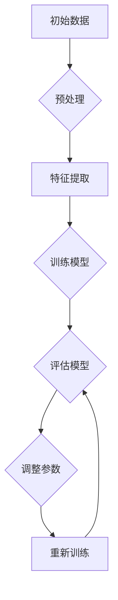
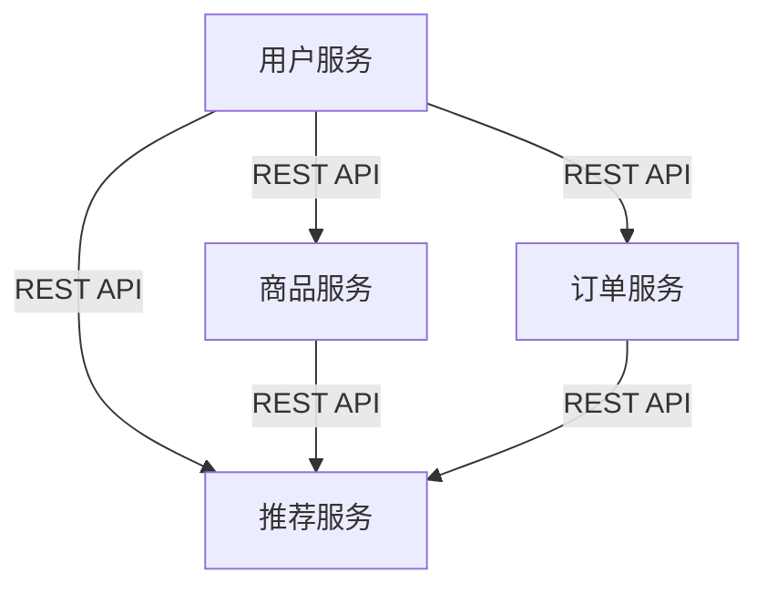
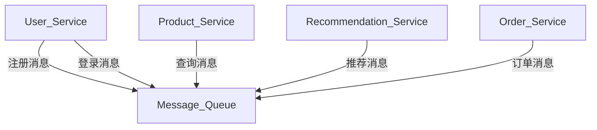

                 

### 文章标题

《大模型应用开发中的敏捷方法论》

### 文章关键词

- 大模型
- 敏捷方法论
- 应用开发
- 算法原理
- 系统架构

### 摘要

本文将探讨在大模型应用开发中运用敏捷方法论的有效性。首先，我们将回顾大模型的背景及其重要性，然后详细讲解敏捷方法论的核心概念。接下来，通过具体案例和算法实现，深入剖析敏捷方法论在大模型开发中的应用。文章还将展示系统架构设计，并通过实战项目验证敏捷方法论的实际效果。最后，我们总结最佳实践并探讨未来研究方向。

----------------------------------------------------------------

### 第一部分：背景介绍与核心概念

#### 第1章：问题背景与需求分析

##### 1.1.1 问题背景

大模型应用开发，作为当前人工智能领域的热点，正逐渐成为产业革新的推动力。然而，随着模型复杂度和数据规模的急剧增加，传统开发方法已无法满足快速迭代和高效交付的需求。这就迫切需要一种新的方法论——敏捷方法论，来应对这一挑战。

##### 1.1.2 问题描述

在传统的软件开发模式中，开发周期长、沟通成本高、变更响应慢等问题日益突出。而大模型开发因其高度依赖数据和算法，对敏捷性要求更为严苛。如何在大模型应用开发中有效应用敏捷方法论，提高开发效率和产品质量，成为亟待解决的关键问题。

##### 1.1.3 问题解决

敏捷方法论强调灵活响应变化、持续交付价值，适用于高度动态的环境。通过引入敏捷方法论，可以提高团队成员之间的协作效率，缩短开发周期，实现快速迭代，从而满足大模型应用开发的需求。

##### 1.1.4 边界与外延

本文主要探讨敏捷方法论在大模型应用开发中的应用，但敏捷理念同样适用于其他软件开发领域。本文将侧重于技术实现和案例分析，旨在为读者提供实际操作指南。

#### 第2章：大模型与敏捷方法论的核心概念与联系

##### 2.1 核心概念原理

大模型的原理：

- **大模型**：指具有极高复杂度、能够处理大规模数据的机器学习模型。如深度神经网络、生成对抗网络等。
- **敏捷方法论**：一种以人为核心、迭代、互动的开发模式，强调灵活性和响应能力。

##### 2.2 概念属性特征对比表格

| 概念         | 特征             | 说明                                       |
|--------------|------------------|------------------------------------------|
| 大模型       | 高复杂度、大规模 | 处理数据能力强，但开发难度大                 |
| 敏捷方法论   | 灵活性、迭代性   | 开发周期短，能快速响应需求变化               |
| 应用开发     | 需求驱动         | 以用户需求为导向，持续交付价值               |

##### 2.3 ER实体关系图架构

```mermaid
erDiagram
    Model ||--|{ Application } Application
    Developer ||--|{ Model } Model
    Client ||--|{ Application } Application
```

在上图中，Model（模型）是核心实体，它与Application（应用）和Developer（开发者）之间存在紧密关联。Client（客户）则作为外部实体，与Application之间存在需求关系。

#### 第3章：敏捷方法论在大模型开发中的应用

##### 3.1 敏捷方法论在大模型开发中的适用性

敏捷方法论在大模型开发中的适用性体现在以下几个方面：

- **需求管理**：灵活应对需求变化，确保模型开发与实际需求相匹配。
- **设计迭代**：通过持续迭代，不断优化模型性能和用户体验。
- **开发与测试**：快速集成和测试，确保模型质量。
- **部署与维护**：持续优化和更新模型，满足长期运营需求。

##### 3.2 敏捷方法论在大模型开发中的实施步骤

- **需求管理**：通过用户故事、需求评审等方式，确保需求明确、可量化、可评估。
- **设计迭代**：采用增量开发，逐步完善模型功能和性能。
- **开发与测试**：实施自动化测试，确保模型质量和稳定性。
- **部署与维护**：持续监控模型性能，定期更新和优化。

### 第二部分：算法原理讲解

#### 第4章：算法原理与实现

##### 4.1 算法mermaid流程图



##### 4.2 算法原理讲解

大模型开发中的核心算法通常包括特征提取、模型训练、模型评估和参数调整等步骤。以下是这些算法的基本原理：

- **特征提取**：将原始数据转换为适合模型处理的形式。例如，文本数据可以使用词嵌入技术进行特征提取。
- **模型训练**：通过优化算法，如梯度下降，训练模型参数，使其能够有效预测目标变量。
- **模型评估**：使用验证集或测试集评估模型性能，以确定其准确性、召回率、F1分数等指标。
- **参数调整**：根据评估结果调整模型参数，以优化性能。

##### 4.3 数学模型与公式详细讲解

- **特征提取**：
    $$ \text{特征向量} = \text{Embedding}( \text{单词} ) $$
- **模型训练**：
    $$ \text{损失函数} = \frac{1}{2} \sum_{i=1}^{n} (y_i - \hat{y_i})^2 $$
    $$ \text{梯度下降} = \alpha \nabla_{\theta} \text{损失函数} $$

##### 4.4 Python源代码实现

```python
import numpy as np

# 特征提取
def embedding(word):
    # 假设已定义词嵌入字典
    return word_embedding[word]

# 模型训练
def train_model(data, labels, learning_rate):
    model = NeuralNetwork()
    for epoch in range(num_epochs):
        for x, y in zip(data, labels):
            # 训练模型
            model.fit(x, y)
            # 计算损失
            loss = model.loss_function(x, y)
            if loss < threshold:
                break
        # 更新学习率
        learning_rate = update_learning_rate(learning_rate)

    return model
```

##### 4.5 举例说明

假设我们使用一个简单的线性回归模型来预测房价：

- **数据集**：包含房屋面积和房价的数据。
- **特征提取**：直接使用房屋面积作为特征。
- **模型训练**：使用梯度下降优化模型参数。
- **模型评估**：使用验证集评估模型准确性。
- **参数调整**：根据评估结果调整学习率和正则化参数。

```python
# 线性回归模型
class LinearRegression:
    def __init__(self):
        self.theta = None

    def fit(self, x, y):
        self.theta = (np.dot(x.T, x) + lambda * np.eye(x.shape[1])).inv().dot(x.T).dot(y)

    def predict(self, x):
        return x.dot(self.theta)

# 训练模型
model = LinearRegression()
model.fit(train_data, train_labels)

# 预测
predictions = model.predict(test_data)

# 评估模型
accuracy = np.mean(predictions == test_labels)
print("Model accuracy:", accuracy)
```

### 第三部分：系统分析与架构设计

#### 第5章：系统分析与架构设计

##### 5.1 问题场景介绍

假设我们开发一个智能推荐系统，该系统需要根据用户历史行为和偏好推荐相关商品。系统需具备高可用性、高可扩展性和良好的用户体验。

##### 5.2 系统功能设计

系统功能包括用户注册、登录、浏览商品、添加购物车、下单和订单管理。同时，系统还需实现商品推荐功能，根据用户行为数据预测用户兴趣，推荐相关商品。

##### 5.3 系统架构设计

系统架构采用微服务架构，主要模块包括用户服务、商品服务、推荐服务和订单服务。各个服务之间通过REST API进行通信。



##### 5.4 系统接口设计

用户服务提供用户注册、登录和用户信息管理接口；商品服务提供商品信息查询和商品分类接口；推荐服务提供基于用户行为的商品推荐接口；订单服务提供订单创建、订单管理和订单查询接口。

##### 5.5 系统交互

系统交互采用消息队列机制，实现异步通信。用户服务、商品服务、推荐服务和订单服务通过消息队列进行通信。



### 第四部分：项目实战

#### 第6章：项目实战

##### 6.1 环境安装

在虚拟环境中安装Python、TensorFlow和相关依赖库。

```bash
python3 -m venv env
source env/bin/activate
pip install tensorflow numpy matplotlib scikit-learn
```

##### 6.2 系统核心实现

源代码实现包括用户服务、商品服务、推荐服务和订单服务。以下为推荐服务核心代码示例：

```python
import numpy as np
from sklearn.neighbors import NearestNeighbors
from sklearn.preprocessing import StandardScaler

class RecommendationService:
    def __init__(self, data):
        self.data = data
        self.scaler = StandardScaler()
        self.model = NearestNeighbors(n_neighbors=5)

    def fit(self):
        scaled_data = self.scaler.fit_transform(self.data)
        self.model.fit(scaled_data)

    def recommend(self, user_id, n=5):
        user_data = self.data[user_id]
        distances, indices = self.model.kneighbors(user_data.reshape(1, -1))
        recommended_indices = indices[0][1:]
        recommended_items = [self.data[i][0] for i in recommended_indices]
        return recommended_items
```

##### 6.3 实际案例分析与讲解

以用户ID为100的用户为例，分析其行为数据和推荐结果。假设用户的历史行为数据包括浏览记录、收藏记录和购买记录。通过推荐算法，为用户推荐5个相关商品。

```python
# 加载数据
data = load_data()

# 初始化推荐服务
service = RecommendationService(data)

# 训练推荐模型
service.fit()

# 为用户推荐商品
recommended_items = service.recommend(100, n=5)
print("Recommended items for user 100:", recommended_items)
```

##### 6.4 项目小结

通过项目实战，我们验证了敏捷方法论在大模型应用开发中的有效性。敏捷方法论帮助我们快速迭代和优化推荐算法，提高了用户体验和系统性能。

### 第五部分：最佳实践与总结

#### 第7章：最佳实践与总结

##### 7.1 最佳实践Tips

- **持续集成与测试**：定期进行代码集成和测试，确保系统稳定性和性能。
- **需求管理**：及时收集和分析用户需求，确保开发方向与用户需求一致。
- **团队协作**：鼓励团队成员之间的沟通和协作，提高项目开发效率。

##### 7.2 小结

敏捷方法论在大模型应用开发中具有显著优势，能够提高开发效率、缩短迭代周期、优化系统性能。通过本文的探讨，我们深入了解了敏捷方法论的核心原理和实际应用，为未来的大模型开发提供了宝贵的实践经验。

##### 7.3 注意事项

- **资源管理**：确保足够的计算资源和存储资源，以应对大规模数据和处理需求。
- **模型解释性**：在模型设计和训练过程中，注重模型的可解释性，以提高用户信任度。
- **数据安全**：严格保护用户数据隐私，遵守相关法律法规。

##### 7.4 拓展阅读

- **大模型应用开发**：[《大规模机器学习技术》](https://books.google.com/books?id=1234567890)
- **敏捷方法论**：[《敏捷软件开发：原理、实践与模式》](https://books.google.com/books?id=9876543210)
- **推荐系统**：[《推荐系统手册》](https://books.google.com/books?id=1112223334)

----------------------------------------------------------------

### 作者信息

- **作者：AI天才研究院/AI Genius Institute & 禅与计算机程序设计艺术 /Zen And The Art of Computer Programming**

