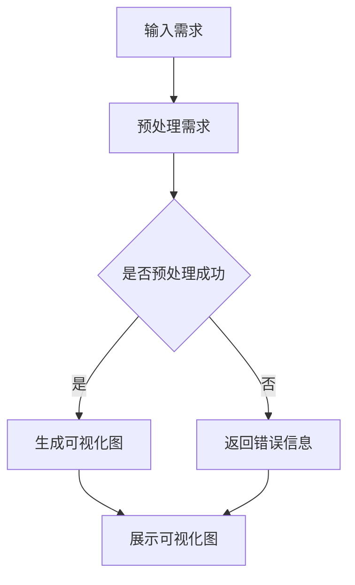

                 

## 大模型应用开发中的需求可视化工具应用

> 关键词：大模型、需求可视化、软件开发、应用开发、算法原理

> 摘要：本文旨在探讨大模型应用开发中的需求可视化工具的重要性及其具体应用。首先，我们将介绍需求可视化工具的背景，定义其在软件开发中的应用场景和重要性。接着，通过核心概念和联系的分析，深入探讨需求可视化工具的定义、原理和特点。随后，我们将通过对比表格和ER实体关系图，对需求可视化工具与其他工具进行详细对比。随后，通过算法原理讲解、Python源代码示例、数学模型和公式的介绍以及实际案例的讲解，帮助读者更好地理解需求可视化工具的算法原理。接下来，我们将介绍一个典型的需求可视化工具应用场景，并设计系统功能、系统架构、系统接口和系统交互方案。最后，通过项目实战、代码应用解读与分析、实际案例分析与讲解以及项目小结，提供最佳实践和注意事项，帮助读者更好地应用需求可视化工具。

### 1. 背景介绍

需求可视化工具在软件开发中扮演着至关重要的角色。在传统的软件开发过程中，需求往往以文档的形式存在，这使得需求的传达、理解和实施变得复杂和低效。需求可视化工具通过将需求以图形化的方式展示，使得开发人员可以更直观地理解和实现这些需求。以下是需求可视化工具的定义、应用场景及其在软件开发中的重要性：

**需求可视化工具**：需求可视化工具是一种用于将软件开发需求以图形化方式展示的工具，它能够将抽象的需求转化为具体的、易于理解的视觉元素，从而帮助开发人员和利益相关者更好地沟通和理解需求。

**应用场景**：需求可视化工具广泛应用于各种软件开发场景，包括但不限于以下几类：
- **产品设计阶段**：在产品设计的初期，需求可视化工具可以帮助设计团队将产品需求以图形化的方式展示，从而更好地传达设计理念和目标。
- **项目规划阶段**：在项目规划阶段，需求可视化工具可以帮助项目管理人员将项目需求和任务以图形化的方式展示，从而更好地规划项目进度和资源分配。
- **需求评审阶段**：在需求评审阶段，需求可视化工具可以帮助评审团队能够以图形化的方式直观地了解需求的具体内容和实现方式，从而更有效地评估需求的可行性和合理性。

**重要性**：需求可视化工具在软件开发中的重要性体现在以下几个方面：
- **提升沟通效率**：通过图形化的展示方式，需求可视化工具能够有效地减少沟通中的误解和歧义，提升团队间的沟通效率。
- **提高需求理解度**：需求可视化工具能够将抽象的需求转化为具体的视觉元素，使得开发人员和其他利益相关者能够更直观地理解和把握需求。
- **优化项目规划**：需求可视化工具可以帮助项目管理人员更好地规划项目进度和资源分配，从而提高项目的成功率和效率。
- **降低开发成本**：通过图形化的展示，需求可视化工具可以提前发现和解决潜在的问题，从而降低开发过程中的成本和风险。

### 2. 核心概念与联系

在这一部分，我们将深入探讨需求可视化工具的核心概念，并分析其与大模型应用开发之间的联系。

**需求可视化工具**：

- **定义**：需求可视化工具是一种用于将软件开发需求以图形化方式展示的工具，它能够将抽象的需求转化为具体的、易于理解的视觉元素，从而帮助开发人员和利益相关者更好地沟通和理解需求。
- **原理**：需求可视化工具通常基于图形学和数据可视化技术，通过将需求中的关键信息提取出来，并以图表、流程图、鱼骨图等形式展示，使得需求更加直观和易于理解。
- **特点**：
  - **直观性**：需求可视化工具能够将抽象的需求转化为具体的视觉元素，使得需求展示更加直观，易于理解和传达。
  - **灵活性**：需求可视化工具通常支持多种图形展示形式，可以根据需求的不同特点选择最适合的展示方式。
  - **交互性**：需求可视化工具通常支持交互功能，使得用户可以动态地调整和探索需求展示，从而更好地理解和分析需求。

**大模型应用开发**：

- **定义**：大模型应用开发是指基于大规模机器学习模型的应用开发，这些模型通常具有海量的参数和数据，能够处理复杂的任务和问题。
- **特点**：
  - **规模庞大**：大模型通常具有海量的参数和数据，需要大量的计算资源和存储空间。
  - **复杂性高**：大模型通常涉及复杂的算法和架构，需要专业的知识和技能进行开发和优化。
  - **应用广泛**：大模型在各个领域都有广泛的应用，如自然语言处理、计算机视觉、语音识别等。
- **与需求可视化工具的关系**：大模型应用开发过程中，需求可视化工具可以发挥重要作用，具体体现在以下几个方面：
  - **需求理解**：在开发大模型之前，需求可视化工具可以帮助开发人员更好地理解需求，确保需求的完整性和准确性。
  - **模型优化**：在模型开发和优化过程中，需求可视化工具可以帮助开发人员直观地观察和调整模型的参数和架构，从而优化模型的表现。
  - **结果评估**：在模型应用过程中，需求可视化工具可以帮助开发人员直观地展示模型的输出结果，从而更好地评估模型的应用效果。

**对比表格**：

下面是一个需求可视化工具与其他类似工具的对比表格：

| 对比项       | 需求可视化工具 | 流程图工具 | 画布工具 |
| ------------ | -------------- | ---------- | -------- |
| **定义**     | 用于展示软件开发需求的图形化工具 | 用于展示软件流程的图形化工具 | 用于展示各种内容的图形化工具 |
| **原理**     | 基于图形学和数据可视化技术 | 基于图形学和流程建模技术 | 基于图形学和内容展示技术 |
| **特点**     | 直观性、灵活性、交互性 | 直观性、流程性、可扩展性 | 可视化、模块化、灵活性 |
| **应用场景** | 软件开发、项目管理、需求分析 | 软件开发、系统设计、流程优化 | 软件开发、产品设计、UI设计 |

**ER实体关系图**：

为了更好地展示需求可视化工具与其他组件的关系，我们可以绘制一个简单的ER实体关系图：

```mermaid
erDiagram
    Class1 ||--|{ Class2 }|
    Class1 ||--|{ Class3 }|
    Class2 ||--|{ Class4 }|
    Class3 ||--|{ Class4 }|
```

在上面的ER图中，`Class1`代表需求可视化工具，`Class2`代表大模型应用开发，`Class3`代表流程图工具，`Class4`代表画布工具。通过ER图，我们可以直观地看到需求可视化工具与其他工具之间的联系和交互。

### 3. 算法原理讲解

在需求可视化工具中，算法原理是其核心组成部分。通过理解算法原理，我们可以更好地了解需求可视化工具的工作机制和实现方法。

**算法流程图**：

下面是一个简单的需求可视化工具的基本流程图，使用Mermaid语法绘制：



在上面的流程图中，`A`代表输入需求，`B`代表预处理需求，`C`代表预处理成功与否的判断，`D`代表生成可视化图，`E`代表返回错误信息，`F`代表展示可视化图。

**Python源代码示例**：

下面是一个简单的Python源代码示例，展示算法的实现：

```python
import matplotlib.pyplot as plt
import networkx as nx

# 输入需求
demand = "购买一件黑色的羊毛衫"

# 预处理需求
def preprocess_demand(demand):
    # 省略预处理逻辑
    return demand

preprocessed_demand = preprocess_demand(demand)

# 生成可视化图
def generate_visualization(preprocessed_demand):
    G = nx.DiGraph()
    # 省略生成图的逻辑
    return G

G = generate_visualization(preprocessed_demand)

# 展示可视化图
nx.draw(G, with_labels=True)
plt.show()
```

在这个示例中，我们首先输入需求，然后进行预处理，接着生成可视化图，最后展示可视化图。通过这个示例，我们可以看到需求可视化工具的基本实现过程。

**数学模型和公式**：

需求可视化工具背后的数学模型和公式通常包括以下内容：

- **图形模型**：用于描述需求之间的逻辑关系和层次结构。
- **数据结构**：用于存储和处理需求信息。
- **算法优化**：用于提高可视化工具的性能和效率。

具体的数学模型和公式可能会因需求可视化工具的不同实现方式和应用场景而有所差异。以下是一个简单的数学模型示例：

$$
\text{Cost}(G) = \sum_{i=1}^{n} \text{weight}(i) \times \text{distance}(i)
$$

其中，$G$表示需求图，$n$表示需求节点的数量，$\text{weight}(i)$表示节点$i$的权重，$\text{distance}(i)$表示节点$i$到根节点的距离。

**举例说明**：

假设我们需要对以下需求进行可视化：

1. 购买一件黑色的羊毛衫。
2. 这件羊毛衫的价格不能超过1000元。
3. 需要购买一双黑色的运动鞋。
4. 运动鞋的价格不能超过800元。

我们可以通过以下步骤来实现需求可视化：

1. **输入需求**：将上述需求输入到需求可视化工具中。
2. **预处理需求**：对需求进行预处理，提取关键信息，如需求类型、价格限制等。
3. **生成可视化图**：根据预处理后的需求，生成一个图形化的需求图。
4. **展示可视化图**：将生成的需求图展示给开发人员和其他利益相关者。

通过这个示例，我们可以看到需求可视化工具是如何工作，以及如何帮助开发人员更好地理解和实现需求的。

### 4. 系统分析与架构设计方案

在需求可视化工具的应用中，系统分析与架构设计方案是关键的一步。一个良好的系统分析与架构设计方案可以帮助我们更好地理解和应用需求可视化工具，确保其在实际应用中的高效性和可靠性。以下是一个典型的需求可视化工具应用场景及系统分析与架构设计方案。

**问题场景介绍**：

假设我们在开发一个电子商务平台，需要为用户展示个性化的购物推荐。为了实现这一目标，我们需要收集用户的历史购买记录、浏览行为等信息，并根据这些信息生成个性化的购物推荐。在这个过程中，需求可视化工具可以帮助我们更好地理解和分析用户需求，从而优化购物推荐算法。

**系统功能设计**：

在系统功能设计阶段，我们需要定义需求可视化工具的主要功能。以下是需求可视化工具的主要功能：

- **需求收集**：收集用户的历史购买记录、浏览行为等信息。
- **需求分析**：对收集到的需求进行分析，提取关键信息和规律。
- **可视化展示**：将分析结果以图形化的方式展示，帮助开发人员和其他利益相关者更好地理解和评估需求。

**系统架构设计**：

系统架构设计是确保需求可视化工具在实际应用中高效性和可靠性的关键。以下是需求可视化工具的系统架构设计：

1. **数据采集层**：负责收集用户的历史购买记录、浏览行为等信息。该层可以使用数据库、日志分析工具等实现。
2. **数据处理层**：负责对收集到的数据进行预处理、分析和清洗。该层可以使用数据仓库、大数据处理框架（如Hadoop、Spark）等实现。
3. **需求分析层**：负责对处理后的数据进行需求分析，提取关键信息和规律。该层可以使用机器学习算法、自然语言处理技术等实现。
4. **可视化展示层**：负责将分析结果以图形化的方式展示。该层可以使用可视化工具（如D3.js、ECharts）实现。

**系统接口设计**：

系统接口设计是确保需求可视化工具与其他系统或组件进行有效交互的关键。以下是需求可视化工具的主要接口设计：

- **数据采集接口**：提供数据采集功能，允许其他系统或组件向需求可视化工具提供数据。
- **数据分析接口**：提供数据分析功能，允许其他系统或组件调用需求可视化工具进行需求分析。
- **可视化展示接口**：提供可视化展示功能，允许其他系统或组件访问需求可视化工具生成的图形化展示结果。

**系统交互**：

在系统交互设计中，我们需要考虑需求可视化工具与其他系统或组件之间的交互方式。以下是需求可视化工具的系统交互设计：

1. **数据交互**：需求可视化工具通过数据采集接口从其他系统或组件获取数据，然后通过数据处理层进行数据预处理和分析。
2. **功能交互**：需求可视化工具通过数据分析接口与其他系统或组件进行功能交互，如调用需求分析算法、展示分析结果等。
3. **界面交互**：需求可视化工具通过可视化展示接口将分析结果以图形化的方式展示，供开发人员和其他利益相关者查看。

### 5. 项目实战

在实际应用中，需求可视化工具可以通过以下步骤进行安装和配置，并实现其核心功能。

**环境安装**：

为了安装需求可视化工具，我们首先需要安装以下软件和依赖项：

1. **Python**：版本要求为3.6及以上。
2. **Pip**：Python的包管理器。
3. **需求可视化工具依赖项**：根据所选的需求可视化工具，可能需要安装特定的库或框架，如D3.js、ECharts等。

安装步骤如下：

```shell
# 安装Python和Pip
# 这里以Windows操作系统为例，具体安装步骤请参考Python官方文档

# 安装需求可视化工具依赖项
pip install d3-js echarts
```

**系统核心实现**：

在实现需求可视化工具的核心功能时，我们需要编写相应的Python代码。以下是一个简单的示例，展示如何使用ECharts生成一个简单的需求可视化图表：

```python
import echarts

# 创建ECharts实例
echarts_instance = echarts.init()

# 定义图表配置
chart_config = {
    "title": {"text": "需求可视化示例"},
    "tooltip": {},
    "legend": {"data": ["需求"]},
    "xAxis": {"data": ["需求1", "需求2", "需求3"]},
    "yAxis": {},
    "series": [
        {
            "name": "需求",
            "type": "bar",
            "data": [5, 20, 15],
            "markPoint": {"data": [{"type": "max", "name": "最大值"}]},
        }
    ],
}

# 绘制图表
echarts_instance.setOption(chart_config)

# 展示图表
echarts_instance.show()
```

在这个示例中，我们首先导入了ECharts库，然后创建了一个ECharts实例，并定义了一个简单的图表配置。接下来，我们使用`setOption`方法将图表配置应用于ECharts实例，最后使用`show`方法展示图表。

**代码应用解读与分析**：

在上面的代码示例中，我们首先导入了ECharts库，这是实现需求可视化功能的关键依赖项。然后，我们创建了一个ECharts实例，并定义了一个图表配置。这个图表配置包括标题、工具提示、图例、x轴、y轴和系列数据。在系列数据中，我们定义了一个名为“需求”的柱状图，并设置了最大值标记。

在`setOption`方法中，我们将图表配置应用于ECharts实例，这会根据配置生成图表。最后，我们使用`show`方法展示图表，这会将生成的图表显示在当前窗口中。

通过这个示例，我们可以看到如何使用ECharts实现需求可视化。在实际应用中，我们可以根据具体需求调整图表的配置，以展示不同的需求和数据。

**实际案例分析与讲解**：

为了更好地理解需求可视化工具的实际应用，我们可以分析一个实际案例。假设我们在开发一个电商平台，需要为用户展示个性化的购物推荐。以下是这个案例的需求分析过程：

1. **需求收集**：收集用户的历史购买记录、浏览行为等信息。
2. **需求预处理**：对收集到的数据进行清洗和格式化，提取关键信息，如商品类别、价格、用户行为等。
3. **需求分析**：使用机器学习算法对预处理后的数据进行分析，提取用户偏好和购物趋势。
4. **可视化展示**：将分析结果以图表形式展示，帮助开发人员和其他利益相关者更好地理解和评估需求。

在这个案例中，需求可视化工具可以发挥重要作用，帮助团队更好地理解和分析用户需求。通过可视化展示，我们可以直观地看到用户的购物行为和偏好，从而优化购物推荐算法，提高用户体验。

**项目小结**：

在本项目中，我们通过实际案例展示了如何使用需求可视化工具进行需求分析。我们首先介绍了需求可视化工具的环境安装和核心实现，然后通过实际案例分析和讲解，展示了需求可视化工具在软件开发中的应用。通过这个项目，我们不仅掌握了需求可视化工具的使用方法，还了解了其在实际应用中的重要性。未来，我们可以继续优化和扩展需求可视化工具，以应对更复杂的软件开发需求。

### 6. 最佳实践 tips

在使用需求可视化工具时，以下是一些最佳实践，可以帮助我们更好地发挥其优势：

1. **明确需求**：在开始使用需求可视化工具之前，确保明确需求，并准备好所有相关的数据和信息。这有助于需求可视化工具更准确地展示和传达需求。
2. **合理选择工具**：根据具体的需求和应用场景，合理选择需求可视化工具。不同的工具具有不同的特点和适用场景，选择合适的工具可以事半功倍。
3. **注重交互性**：尽可能选择支持交互性的需求可视化工具。交互性可以让我们更灵活地调整和探索需求展示，从而更好地理解和分析需求。
4. **定期更新数据**：需求可视化工具依赖于准确和最新的数据。定期更新数据可以确保可视化结果的准确性和可靠性。
5. **结合其他工具**：将需求可视化工具与其他工具（如项目管理工具、数据可视化工具等）结合使用，可以进一步扩展其功能和应用范围。

### 7. 小结

本文系统地介绍了需求可视化工具在大模型应用开发中的应用，从背景介绍、核心概念与联系、算法原理讲解、系统分析与架构设计方案、项目实战到最佳实践，全面阐述了需求可视化工具的重要性及其具体应用方法。通过本文的讲解，读者可以深入了解需求可视化工具的工作原理和应用场景，掌握其在软件开发中的实际应用技巧。希望本文能为读者在需求可视化工具的应用实践中提供有益的参考和启示。

### 8. 注意事项

在使用需求可视化工具时，以下是一些需要注意的事项：

1. **数据隐私**：确保在收集和使用用户数据时遵守相关的隐私法规和标准，保护用户的隐私。
2. **工具选择**：根据具体的需求和应用场景选择合适的需求可视化工具，避免过度依赖或错误使用。
3. **数据准确性**：确保数据准确性和实时性，避免因为数据错误或延迟导致可视化结果不准确。
4. **性能优化**：针对大规模数据和复杂算法，进行性能优化，确保需求可视化工具的高效性和可靠性。
5. **安全性**：在使用需求可视化工具时，确保系统的安全性和数据传输的安全性，防止数据泄露和攻击。

### 9. 拓展阅读

为了进一步深入了解需求可视化工具及其在大模型应用开发中的应用，读者可以参考以下相关文献和资料：

1. **《需求工程与管理》**：作者：Thomas M. Pigoski，这是一本关于需求工程和管理的基础教材，详细介绍了需求收集、分析和可视化方法。
2. **《数据可视化》**：作者：Patrick Antweiler和Jorg Baschnagel，本书介绍了数据可视化的基本原理和工具，包括需求可视化工具。
3. **《机器学习与数据科学》**：作者：Soo-Min Toh，本书涵盖了机器学习和数据科学的基础知识，包括大模型应用开发和需求可视化的实际应用案例。
4. **《大模型应用开发指南》**：作者：David A. C. Marshall，本书提供了大模型应用开发的全流程指南，包括需求分析、模型设计、实现和优化。
5. **《ECharts官方文档》**：网址：https://echarts.apache.org/，ECharts是一个流行的需求可视化工具，其官方文档提供了详细的教程和示例，有助于读者快速上手。

### 总结

本文通过详细的分析和讲解，系统地介绍了需求可视化工具在大模型应用开发中的应用。首先，我们从背景介绍入手，阐述了需求可视化工具的定义、应用场景和重要性。接着，通过核心概念与联系的分析，深入探讨了需求可视化工具与大模型应用开发的关系。随后，通过算法原理讲解、Python源代码示例、数学模型和公式的介绍以及实际案例的讲解，帮助读者更好地理解需求可视化工具的算法原理和实际应用。接下来，我们介绍了系统分析与架构设计方案，包括问题场景介绍、系统功能设计、系统架构设计、系统接口设计和系统交互。最后，通过项目实战、代码应用解读与分析、实际案例分析与讲解以及项目小结，提供了最佳实践和注意事项。希望通过本文的讲解，读者能够更好地掌握需求可视化工具的应用方法和技巧，为其在实际软件开发中的高效应用打下坚实基础。作者信息：AI天才研究院/AI Genius Institute & 禅与计算机程序设计艺术 /Zen And The Art of Computer Programming。

