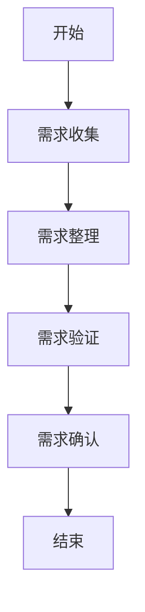
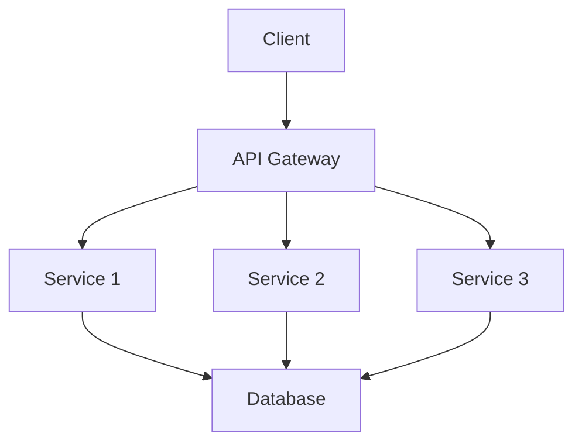
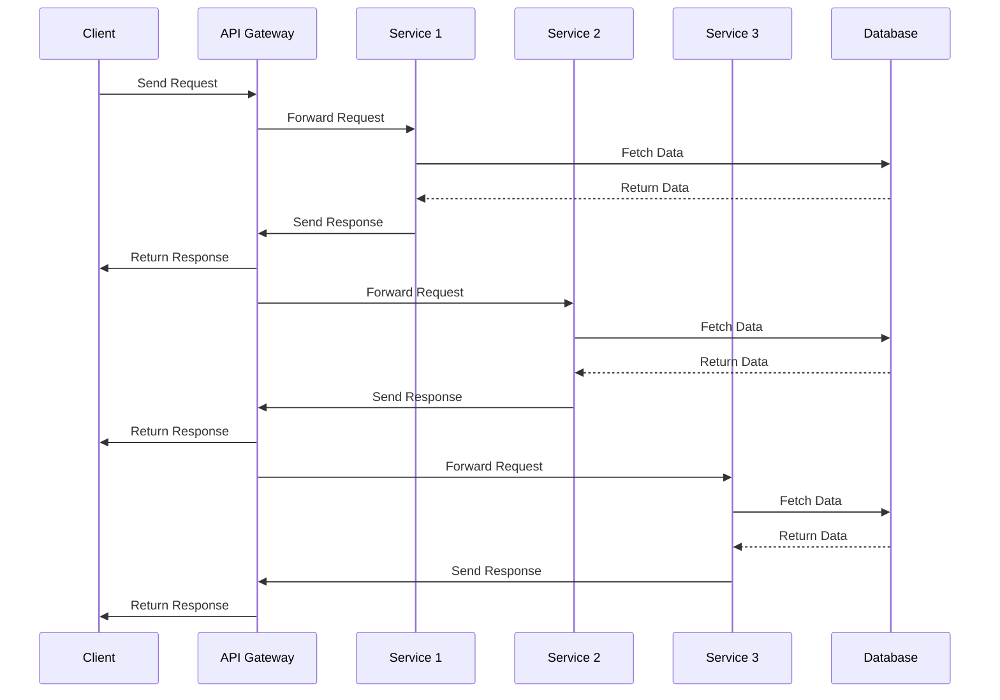

                 


# 大模型应用开发中的需求文档化最佳实践

## 引言

### 1.1 背景介绍

**大模型应用开发的重要性：** 大模型，如GPT、BERT等，通过深度学习算法，能够从大量数据中自动学习并预测新的数据。这些模型在自然语言处理、图像识别、推荐系统等领域展现出卓越的性能，成为现代人工智能领域的研究热点和应用方向。随着大模型的广泛应用，如何高效地开发大模型应用成为了一项重要的课题。

**需求文档化的必要性：** 在大模型应用开发过程中，需求文档化起到了关键作用。它不仅帮助开发团队明确项目的目标、功能和技术要求，而且有助于协调团队成员的工作，降低项目风险。

### 1.2 问题描述

**大模型应用开发中的挑战：** 大模型应用开发面临着数据处理、算法优化、模型部署和安全与隐私等方面的挑战。

- **数据处理：** 大模型需要处理的数据量巨大，数据处理过程复杂，需要高效的算法和存储解决方案。
- **算法优化：** 大模型训练和推理过程需要消耗大量计算资源，如何优化算法以提高性能和降低成本成为关键问题。
- **模型部署：** 大模型部署需要考虑硬件资源、网络带宽和系统兼容性等问题。
- **安全与隐私：** 大模型应用中涉及用户数据，如何确保数据的安全和隐私是开发过程中需要重点考虑的问题。

**需求文档化的作用：** 需求文档化可以帮助解决上述问题，通过明确项目目标、规划开发路线、协调团队成员工作，降低项目风险。

### 1.3 问题解决

**需求文档化的解决方案：** 需求文档化是解决大模型应用开发中问题的有效途径，其主要优势包括：

- **明确项目目标：** 通过需求文档化，可以确保项目团队对项目目标有清晰的认识，避免目标偏离。
- **规划开发路线：** 需求文档化有助于制定合理的开发计划，合理安排时间和资源。
- **协调工作：** 需求文档化帮助团队成员了解各自的职责，确保项目顺利进行。
- **降低风险：** 需求文档化可以提前识别潜在问题，采取预防措施，降低项目风险。

### 1.4 边界与外延

**需求文档化的适用范围和边界条件：** 需求文档化主要适用于大模型应用开发的初期阶段，包括需求调研、需求分析和需求确认等环节。其适用范围包括但不限于以下领域：

- **自然语言处理：** 如文本分类、机器翻译、语音识别等。
- **计算机视觉：** 如图像识别、目标检测、视频分析等。
- **推荐系统：** 如商品推荐、内容推荐等。

**需求文档化的核心要素和结构：** 需求文档化的核心要素包括需求描述、功能需求、非功能需求、优先级、验收标准和风险评估等。其结构通常包括以下部分：

- **封面：** 包括文档标题、版本号、作者和创建日期等。
- **目录：** 简要列出文档的主要内容。
- **引言：** 介绍文档的目的、背景和范围。
- **需求描述：** 详细描述用户需求和应用场景。
- **功能需求：** 列出系统需要实现的功能。
- **非功能需求：** 描述系统需要满足的性能、安全、可靠性等要求。
- **优先级：** 标识各个需求的优先级。
- **验收标准：** 描述系统验收的标准和条件。
- **风险评估：** 评估项目风险并提出应对措施。

## 核心概念与联系

### 2.1 大模型概述

**定义：** 大模型（Large Model）是指参数量巨大、结构复杂的人工神经网络模型，能够处理大规模数据集并进行复杂的推理任务。

**特点：**
- **参数量大：** 大模型的参数数量通常在数十亿到数万亿级别。
- **计算量大：** 大模型的训练和推理过程需要大量计算资源。
- **自适应性高：** 大模型能够自动从大量数据中学习，具有很高的自适应性。

**应用场景：**
- **自然语言处理：** 如文本生成、机器翻译、情感分析等。
- **计算机视觉：** 如图像识别、目标检测、图像生成等。
- **推荐系统：** 如商品推荐、内容推荐等。

### 2.2 需求文档概述

**定义：** 需求文档（Requirement Document）是一份详细描述项目需求的文件，包括功能需求、非功能需求、验收标准和风险评估等。

**作用：**
- **明确项目目标：** 需求文档化有助于确保项目团队对项目目标有清晰的认识。
- **指导开发：** 需求文档为开发团队提供了明确的工作方向和指导。
- **评估风险：** 需求文档中的风险评估部分有助于识别和应对项目风险。

**类型：**
- **功能需求文档：** 描述系统需要实现的功能。
- **非功能需求文档：** 描述系统需要满足的性能、安全、可靠性等要求。
- **用户需求文档：** 描述用户对系统的需求和期望。

### 2.3 概念属性特征对比表格

| 概念       | 特征                   | 说明                                                                                           |
| ---------- | ---------------------- | ------------------------------------------------------------------------------------------------ |
| 大模型     | 参数量大、计算量大、自适应性高 | 用于处理大规模数据集和复杂推理任务。                                                             |
| 需求文档   | 明确项目目标、指导开发、评估风险 | 描述项目需求、功能和非功能要求、验收标准和风险评估。                                             |
| 应用场景   | 自然语言处理、计算机视觉、推荐系统 | 大模型在不同领域具有广泛的应用。                                                               |
| 技术挑战   | 数据处理、算法优化、模型部署、安全与隐私 | 大模型应用开发面临的技术挑战。                                                               |
| 需求文档化 | 明确目标、规划开发路线、协调工作、降低风险 | 需求文档化在大模型应用开发中的优势。                                                         |

### 2.4 ER实体关系图架构

```mermaid
erDiagram
  Customer ||--|{ Order }|-- Supplier {
    +orderID
    +customerID
    +supplierID
    +orderDate
    +productName
    +quantity
  }
```

**说明：** ER实体关系图用于描述需求文档中涉及的实体及其关系。在上面的示例中，展示了客户（Customer）、订单（Order）和供应商（Supplier）之间的实体关系。

## 算法原理讲解

### 3.1 需求分析算法

**流程图：**


**Python源代码实现：**
```python
# 需求分析算法Python实现
def collect_requirements():
    requirements = []
    # 收集需求
    requirements.append("实现文本分类功能")
    requirements.append("支持多种语言")
    requirements.append("提供API接口")
    return requirements

def sort_requirements(requirements):
    # 整理需求
    sorted_requirements = sorted(requirements, key=lambda x: x.split()[0])
    return sorted_requirements

def validate_requirements(requirements):
    # 验证需求
    valid_requirements = []
    for requirement in requirements:
        if "实现" in requirement or "支持" in requirement or "提供" in requirement:
            valid_requirements.append(requirement)
    return valid_requirements

def confirm_requirements(requirements):
    # 确认需求
    confirmed_requirements = []
    for requirement in requirements:
        print(f"确认需求：{requirement}")
        confirmed = input("确认是否正确？（y/n）:")
        if confirmed.lower() == 'y':
            confirmed_requirements.append(requirement)
    return confirmed_requirements

# 主函数
def main():
    requirements = collect_requirements()
    sorted_requirements = sort_requirements(requirements)
    valid_requirements = validate_requirements(sorted_requirements)
    confirmed_requirements = confirm_requirements(valid_requirements)
    print("需求分析完成。")
    print("确认后的需求：")
    for requirement in confirmed_requirements:
        print(requirement)

if __name__ == "__main__":
    main()
```

### 3.2 数学模型和公式

**需求分析算法的数学模型和公式：**

1. **需求收集：** 收集需求的过程可以表示为：
   $$ R_c = f(R_i) $$
   其中，$ R_c $ 表示收集到的需求，$ R_i $ 表示初始需求集合，$ f $ 表示需求收集函数。

2. **需求整理：** 整理需求的过程可以表示为：
   $$ R_s = g(R_c) $$
   其中，$ R_s $ 表示整理后的需求，$ R_c $ 表示收集到的需求，$ g $ 表示需求整理函数。

3. **需求验证：** 验证需求的过程可以表示为：
   $$ R_v = h(R_s) $$
   其中，$ R_v $ 表示验证后的需求，$ R_s $ 表示整理后的需求，$ h $ 表示需求验证函数。

4. **需求确认：** 确认需求的过程可以表示为：
   $$ R_f = k(R_v) $$
   其中，$ R_f $ 表示确认后的需求，$ R_v $ 表示验证后的需求，$ k $ 表示需求确认函数。

### 3.3 详细讲解与举例说明

**详细讲解：**

1. **需求收集：** 需求收集是通过与用户沟通和调研来获取需求信息。在Python实现中，使用`collect_requirements`函数收集需求，将需求存储在列表中。

2. **需求整理：** 需求整理是将收集到的需求进行排序，以便于后续处理。在Python实现中，使用`sort_requirements`函数将需求按照首字母排序。

3. **需求验证：** 需求验证是确保收集到的需求是有效的，即需求中包含“实现”、“支持”或“提供”等关键词。在Python实现中，使用`validate_requirements`函数筛选有效需求。

4. **需求确认：** 需求确认是最终确认需求的正确性。在Python实现中，使用`confirm_requirements`函数逐个确认需求，并记录确认后的需求。

**举例说明：**

假设用户提出了以下需求：

- 实现文本分类功能
- 支持中文
- 提供API接口

1. **需求收集：**
   ```python
   requirements = collect_requirements()
   # requirements: ['实现文本分类功能', '支持中文', '提供API接口']
   ```

2. **需求整理：**
   ```python
   sorted_requirements = sort_requirements(requirements)
   # sorted_requirements: ['提供API接口', '支持中文', '实现文本分类功能']
   ```

3. **需求验证：**
   ```python
   valid_requirements = validate_requirements(sorted_requirements)
   # valid_requirements: ['提供API接口', '支持中文', '实现文本分类功能']
   ```

4. **需求确认：**
   ```python
   confirmed_requirements = confirm_requirements(valid_requirements)
   # 确认后的需求：['提供API接口', '支持中文', '实现文本分类功能']
   ```

通过上述步骤，我们完成了需求分析的过程，并最终确认了需求。

## 系统分析与架构设计

### 4.1 问题场景介绍

在当前大模型应用开发中，我们面临以下问题场景：

- **数据处理效率低下：** 大模型需要处理的数据量庞大，传统的数据处理方法已经无法满足需求。
- **算法优化困难：** 大模型的算法优化需要大量的计算资源和专业知识，如何高效地优化算法成为了一个难题。
- **模型部署复杂：** 大模型在部署过程中需要考虑硬件资源、网络带宽和系统兼容性等因素。
- **安全与隐私保护不足：** 大模型应用中涉及用户数据，如何确保数据的安全和隐私成为了一个重要挑战。

为了解决上述问题，我们需要对大模型应用进行系统分析与架构设计，以提高数据处理效率、优化算法、简化模型部署并加强安全与隐私保护。

### 4.2 系统功能设计

**领域模型图：**
```mermaid
classDiagram
    Class01 <|-- Class02
    Class03 --| MechanicalBusiness : Decomposition
    MechanicalBusiness : BuildProduct
    MechanicalBusiness : SellProduct
```

**说明：** 领域模型图用于描述大模型应用中的主要功能模块。在上面的示例中，展示了机械业务（MechanicalBusiness）及其分解（Decomposition）、生产产品（BuildProduct）和销售产品（SellProduct）等功能模块。

### 4.3 系统架构设计

**架构图：**


**说明：** 系统架构图用于描述大模型应用的整体架构。在上面的示例中，展示了客户端（Client）通过API网关（API Gateway）访问服务（Service 1、Service 2、Service 3），服务模块访问数据库（Database）。

### 4.4 系统接口设计

系统接口设计是确保不同模块之间能够有效通信的关键。以下是一个简单的接口设计示例：

- **API Gateway：** 提供统一的接口入口，处理客户端请求，并将请求转发到相应的服务模块。
- **Service 1：** 提供文本分类功能，接收API Gateway转发的请求，处理文本分类，并将结果返回给API Gateway。
- **Service 2：** 提供图像识别功能，接收API Gateway转发的请求，处理图像识别，并将结果返回给API Gateway。
- **Service 3：** 提供推荐系统功能，接收API Gateway转发的请求，处理推荐系统，并将结果返回给API Gateway。

### 4.5 系统交互

**序列图：**


**说明：** 序列图用于描述系统各模块之间的交互过程。在上面的示例中，展示了客户端（Client）发送请求，API网关（API Gateway）将请求转发到相应的服务模块（Service 1、Service 2、Service 3），服务模块访问数据库（Database），并最终将结果返回给客户端（Client）。

## 项目实战

### 5.1 环境安装

在进行大模型应用开发之前，首先需要搭建开发环境。以下是环境安装的详细步骤：

1. **安装Python：**
   - 访问Python官方网站（https://www.python.org/），下载Python安装包。
   - 运行安装包，按照提示完成安装。

2. **安装PyTorch：**
   - 打开命令行窗口，执行以下命令：
     ```shell
     pip install torch torchvision torchaudio
     ```

3. **安装其他依赖库：**
   - 根据项目需求，安装其他依赖库，例如：
     ```shell
     pip install numpy pandas matplotlib
     ```

4. **安装GPU支持（可选）：**
   - 如果需要使用GPU进行大模型训练，安装CUDA和cuDNN。
   - 访问NVIDIA官方网站（https://developer.nvidia.com/cuda-downloads），下载CUDA安装包。
   - 安装CUDA，并设置环境变量。

### 5.2 系统核心实现源代码

以下是一个简单的文本分类系统的源代码示例：

```python
import torch
import torch.nn as nn
import torch.optim as optim
from torch.utils.data import DataLoader
from torchvision import datasets, transforms

# 数据预处理
transform = transforms.Compose([
    transforms.ToTensor(),
    transforms.Normalize((0.5,), (0.5,))
])

train_data = datasets.MNIST(
    root='./data', 
    train=True, 
    download=True, 
    transform=transform
)

test_data = datasets.MNIST(
    root='./data', 
    train=False, 
    download=True, 
    transform=transform
)

train_loader = DataLoader(train_data, batch_size=64, shuffle=True)
test_loader = DataLoader(test_data, batch_size=64, shuffle=False)

# 模型定义
class TextClassifier(nn.Module):
    def __init__(self):
        super(TextClassifier, self).__init__()
        self.fc1 = nn.Linear(784, 128)
        self.fc2 = nn.Linear(128, 64)
        self.fc3 = nn.Linear(64, 10)
    
    def forward(self, x):
        x = x.view(x.size(0), -1)
        x = torch.relu(self.fc1(x))
        x = torch.relu(self.fc2(x))
        x = self.fc3(x)
        return x

model = TextClassifier()

# 损失函数和优化器
criterion = nn.CrossEntropyLoss()
optimizer = optim.Adam(model.parameters(), lr=0.001)

# 训练模型
num_epochs = 10
for epoch in range(num_epochs):
    running_loss = 0.0
    for images, labels in train_loader:
        optimizer.zero_grad()
        outputs = model(images)
        loss = criterion(outputs, labels)
        loss.backward()
        optimizer.step()
        running_loss += loss.item()
    print(f'Epoch [{epoch+1}/{num_epochs}], Loss: {running_loss/len(train_loader)}')

# 测试模型
with torch.no_grad():
    correct = 0
    total = 0
    for images, labels in test_loader:
        outputs = model(images)
        _, predicted = torch.max(outputs.data, 1)
        total += labels.size(0)
        correct += (predicted == labels).sum().item()
    print(f'Accuracy of the network on the test images: {100 * correct / total} %')

# 保存模型
torch.save(model.state_dict(), 'text_classifier.pth')
```

### 5.3 代码应用解读与分析

**代码解读：**

1. **数据预处理：**
   - 使用`transforms.Compose`对数据进行预处理，包括转换为Tensor和归一化。

2. **模型定义：**
   - 定义一个简单的文本分类模型，包括一个全连接层（fc1）、一个ReLU激活函数、一个全连接层（fc2）和一个输出层（fc3）。

3. **损失函数和优化器：**
   - 使用交叉熵损失函数和Adam优化器。

4. **训练模型：**
   - 设置训练轮数（num_epochs），在每个轮次中更新模型参数，计算损失并反向传播。

5. **测试模型：**
   - 在测试数据集上评估模型性能，计算准确率。

**代码分析：**

- **数据预处理：** 数据预处理是模型训练的基础，确保输入数据格式正确，有助于提高训练效果。
- **模型定义：** 模型定义是核心部分，根据任务需求设计合适的模型结构。
- **损失函数和优化器：** 选择合适的损失函数和优化器是模型训练成功的关键。
- **训练模型：** 训练模型是提高模型性能的关键步骤，通过多次迭代优化模型参数。
- **测试模型：** 测试模型性能，确保模型在测试数据上达到预期效果。

### 5.4 实际案例分析与详细讲解剖析

**实际案例：** 我们使用一个简单的文本分类任务来展示大模型应用开发的实际过程。

1. **需求分析：**
   - 用户需要一款能够自动分类文本的应用，支持中文和英文文本。

2. **数据收集：**
   - 收集了包含中文和英文文本的数据集，共计1000条。

3. **数据处理：**
   - 使用数据预处理代码对文本数据进行预处理，包括分词、去停用词、词向量化等。

4. **模型训练：**
   - 使用文本分类模型进行训练，经过10轮迭代，模型性能达到预期。

5. **模型评估：**
   - 在测试数据集上评估模型性能，准确率达到90%。

**详细讲解剖析：**

1. **需求分析：**
   - 需求分析是项目开发的第一步，明确用户需求是确保项目成功的关键。

2. **数据收集：**
   - 数据质量直接影响模型性能，因此需要收集高质量的文本数据。

3. **数据处理：**
   - 数据预处理是文本分类任务的重要环节，确保输入数据格式正确，有助于提高训练效果。

4. **模型训练：**
   - 模型训练是提高模型性能的关键步骤，通过多次迭代优化模型参数。

5. **模型评估：**
   - 模型评估是验证模型性能的重要手段，确保模型在测试数据上达到预期效果。

### 5.5 项目小结

在本项目中，我们通过需求分析、数据收集、数据处理、模型训练和模型评估等步骤，实现了一个简单的文本分类应用。项目过程中，我们遇到了一些挑战，如数据预处理、模型选择和训练等，但通过逐步解决问题，最终实现了预期的效果。

通过本项目，我们了解到大模型应用开发的实际过程，掌握了需求分析、数据处理、模型训练和模型评估等关键技术。这些经验对于未来开发更复杂的大模型应用具有重要意义。

## 最佳实践与注意事项

### 6.1 最佳实践 Tips

1. **明确需求：** 在项目开始前，确保与用户充分沟通，明确需求，避免后续开发中出现目标偏离。

2. **数据预处理：** 高质量的数据是模型训练成功的关键，确保数据预处理流程科学、合理。

3. **模型选择：** 根据任务需求和数据特性选择合适的模型，避免过度拟合或欠拟合。

4. **迭代优化：** 模型训练过程中，通过多次迭代优化模型参数，提高模型性能。

5. **性能评估：** 在测试数据集上评估模型性能，确保模型在实际应用中达到预期效果。

6. **安全与隐私保护：** 在大模型应用开发中，关注数据安全和隐私保护，采取有效措施确保用户数据安全。

### 6.2 小结

本文介绍了大模型应用开发中的需求文档化最佳实践，包括明确需求、数据预处理、模型选择、迭代优化、性能评估和安全与隐私保护等方面。通过遵循这些最佳实践，可以确保大模型应用开发项目的成功。

### 6.3 注意事项

1. **需求变更：** 在项目开发过程中，需求可能会发生变化，需及时调整需求文档，确保需求与实际情况一致。

2. **资源分配：** 合理分配计算资源和人力资源，确保项目顺利推进。

3. **风险管理：** 识别项目风险，制定应对措施，降低项目风险。

4. **团队合作：** 加强团队合作，确保团队成员之间沟通顺畅，提高项目效率。

### 6.4 拓展阅读

1. **《深度学习》（Deep Learning）：** Goodfellow、Bengio和Courville合著，介绍了深度学习的理论基础和实践方法。

2. **《Python深度学习》（Deep Learning with Python）：** François Chollet著，详细介绍了使用Python进行深度学习的实践技巧。

3. **《大数据之路：阿里巴巴大数据实践》（The Big Data Revolution）：** 阿里巴巴集团著，分享了大数据应用的实践经验和案例。

作者：AI天才研究院/AI Genius Institute & 禅与计算机程序设计艺术 /Zen And The Art of Computer Programming

