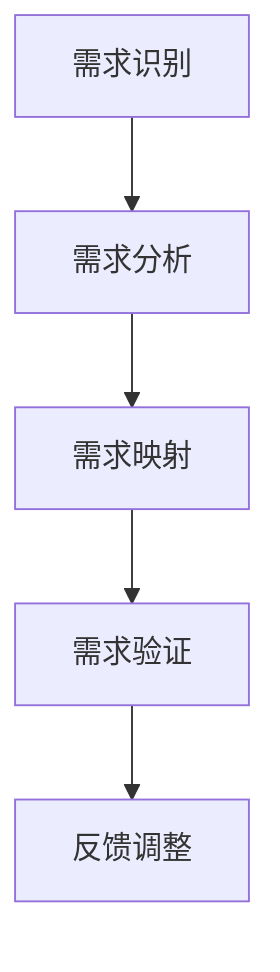
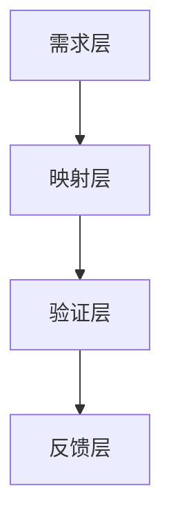

                 

### 《大模型应用开发中的需求追踪技术》

#### 关键词：大模型、需求追踪技术、算法原理、系统架构、项目实战

> 摘要：本文深入探讨了《大模型应用开发中的需求追踪技术》一书的核心内容。从问题背景、核心概念、算法原理到系统分析与项目实战，本文旨在为读者提供一个全面、系统的理解，帮助其在实际应用中有效追踪需求，提升大模型开发的效率和质量。

---

**一、背景介绍**

**1.1 问题背景**

随着人工智能和大数据技术的发展，大模型在各个领域中的应用越来越广泛。然而，大模型应用开发中面临的一个重大挑战是需求追踪。如何在复杂的应用场景中准确地理解和追踪需求，确保模型开发与实际需求的一致性，成为了一个关键问题。

**1.2 需求追踪技术的挑战**

需求追踪技术在面对大模型应用开发时，面临着以下几个挑战：
- **复杂性**：大模型通常涉及多个复杂的子系统，需求追踪需要处理大量的数据和关联关系。
- **动态性**：需求可能会随着时间和项目进展不断变化，需求追踪技术需要具备快速适应变化的能力。
- **准确性**：准确理解并追踪需求对于确保模型开发的正确性和效率至关重要。

**1.3 本书的目的和结构**

本书旨在探讨大模型应用开发中的需求追踪技术，帮助读者理解需求追踪的核心概念、算法原理，并掌握实际应用的方法和技巧。本书的结构如下：

- **背景介绍**：介绍大模型应用开发的背景和需求追踪技术的挑战。
- **核心概念与联系**：阐述大模型和需求追踪技术的基本概念，并分析它们之间的联系。
- **算法原理讲解**：详细讲解需求追踪算法的原理、流程和数学模型。
- **系统分析与架构设计方案**：介绍需求追踪系统的功能设计、架构设计、接口设计和交互流程。
- **项目实战**：通过实际案例展示需求追踪技术在项目中的应用和效果。
- **最佳实践 tips、小结、注意事项、拓展阅读**：总结全书要点，提供最佳实践建议，并推荐进一步阅读的材料。

**二、核心概念与联系**

**2.1 大模型的定义与特点**

大模型通常指的是具有巨大参数量和计算量的神经网络模型，如大型深度学习模型、语言模型等。其特点包括：
- **参数量巨大**：大模型的参数数量往往达到数百万甚至数十亿级别。
- **计算复杂度高**：大模型需要大量的计算资源进行训练和推理。
- **数据依赖性强**：大模型的效果高度依赖于大量的训练数据。

**2.2 需求追踪技术的概念**

需求追踪技术是一种用于确保软件系统开发过程中需求得到准确理解和满足的方法。其主要目的是：
- **需求理解**：确保开发团队能够准确理解业务需求。
- **需求跟踪**：跟踪需求从提出到实现的全过程，确保每个需求都得到有效处理。

**2.3 大模型与需求追踪技术的联系**

大模型应用开发中的需求追踪技术需要解决以下关键问题：
- **需求分解**：如何将复杂的大模型需求分解为可管理的子需求。
- **需求关联**：如何建立需求之间的关联关系，确保各部分需求的一致性。
- **需求验证**：如何验证大模型实现后是否满足原始需求。

**三、算法原理讲解**

**3.1 需求追踪算法原理**

需求追踪算法的基本原理是：
- **需求识别**：通过分析需求文档和代码，识别出系统中的需求。
- **需求映射**：将识别出的需求映射到系统的各个组成部分，建立需求与代码、模块、功能等的关联。
- **需求验证**：通过自动化工具或人工审查，验证需求是否得到满足。

**3.2 需求追踪算法的mermaid流程图**



**3.3 需求追踪算法的Python源代码**

```python
class DemandTrackingAlgorithm:
    def __init__(self):
        self的需求文档 = None
        self.代码库 = None
    
    def 需求识别(self):
        # 需求识别逻辑
        pass
    
    def 需求映射(self):
        # 需求映射逻辑
        pass
    
    def 需求验证(self):
        # 需求验证逻辑
        pass
    
    def 反馈调整(self):
        # 反馈调整逻辑
        pass
```

**3.4 需求追踪算法的数学模型和公式**

需求追踪算法的数学模型可以表示为：

$$
D_t = f(D_{t-1}, I_t, A_t)
$$

其中，$D_t$表示在第$t$步的需求状态，$D_{t-1}$表示前一步的需求状态，$I_t$表示在第$t$步的需求输入，$A_t$表示在第$t$步的调整操作。$f$表示需求追踪函数。

**四、系统分析与架构设计方案**

**4.1 系统功能设计**

系统功能设计包括需求识别、需求映射、需求验证和反馈调整。每个功能的具体实现如下：

- **需求识别**：通过自然语言处理技术，从需求文档中提取出关键需求。
- **需求映射**：将提取出的需求映射到代码库中的具体模块和函数。
- **需求验证**：通过自动化测试工具，验证需求是否在系统中得到实现。
- **反馈调整**：根据验证结果，对系统进行调整，确保需求得到满足。

**4.2 系统架构设计**

系统架构设计采用分层架构，包括需求层、映射层、验证层和反馈层。各层之间的关系如下：



**4.3 系统接口设计**

系统接口设计包括需求接口、映射接口、验证接口和反馈接口。每个接口的具体实现如下：

- **需求接口**：用于接收和管理需求信息。
- **映射接口**：用于管理需求与代码库中模块和函数的关联关系。
- **验证接口**：用于执行需求验证，并返回验证结果。
- **反馈接口**：用于接收验证结果，并执行相应的调整操作。

**4.4 系统交互流程**

系统交互流程包括以下步骤：

1. 收集需求信息，通过需求接口提交。
2. 需求识别模块分析需求文档，识别出关键需求。
3. 需求映射模块将识别出的需求映射到代码库中的模块和函数。
4. 验证模块通过自动化测试工具验证需求是否实现。
5. 根据验证结果，通过反馈接口调整系统，确保需求得到满足。

**五、项目实战**

**5.1 环境安装**

在开始项目实战之前，需要安装以下环境和工具：

- Python 3.8及以上版本
- PyCharm或类似IDE
- Mermaid渲染工具

**5.2 系统核心实现源代码**

以下是系统核心实现源代码的解读：

```python
class DemandTrackingSystem:
    def __init__(self):
        self需求文档 = []
        self.代码库 = []
        self.验证工具 = VerificationTool()

    def 识别需求(self, 文档):
        # 需求识别逻辑
        self.需求文档.append(文档)

    def 映射需求(self):
        # 需求映射逻辑
        for 需求 in self.需求文档:
            self.代码库.append(self.映射需求到代码(需求))

    def 验证需求(self):
        # 需求验证逻辑
        for 需求 in self.代码库:
            self.验证工具验证需求()

    def 映射需求到代码(self, 需求):
        # 具体的需求映射逻辑
        pass

class VerificationTool:
    def 验证需求(self, 需求):
        # 验证需求实现的逻辑
        pass
```

**5.3 实际案例分析**

以下是一个实际案例的分析：

**案例背景**：一家电商平台需要开发一个智能推荐系统，以根据用户的浏览和购买历史推荐相关商品。

**案例分析**：
1. **需求识别**：分析电商平台的需求文档，识别出推荐系统的主要功能需求。
2. **需求映射**：将识别出的需求映射到代码库中的具体模块，如用户行为分析模块、商品推荐算法模块等。
3. **需求验证**：通过自动化测试工具验证推荐系统的功能是否实现，如测试推荐结果的准确性、多样性等。
4. **反馈调整**：根据验证结果，对系统进行调整，如优化推荐算法，提高推荐准确性。

**5.4 项目小结**

在本项目中，我们通过需求追踪技术实现了对电商平台智能推荐系统的需求管理和验证。通过这一实践，我们不仅掌握了需求追踪的基本原理和实现方法，还积累了宝贵的项目经验。

**六、最佳实践 tips、小结、注意事项、拓展阅读**

**6.1 最佳实践 tips**

1. 在项目初期，确保明确需求，并进行详细的需求文档编写。
2. 定期进行需求评审，确保需求的一致性和准确性。
3. 使用自动化测试工具，提高需求验证的效率和准确性。
4. 针对复杂的需求，可以考虑采用分层次的需求追踪方法，降低复杂性。

**6.2 小结**

本文详细介绍了《大模型应用开发中的需求追踪技术》一书的核心内容。通过分析背景、核心概念、算法原理和系统设计，读者可以全面理解需求追踪在大模型应用开发中的重要性。通过实际案例的讲解，读者还可以了解需求追踪技术在项目中的应用和实践。

**6.3 注意事项**

1. 需求追踪需要贯穿整个项目周期，确保需求的实时更新和追踪。
2. 需求追踪过程中，要注重与开发团队的沟通和协作，确保需求的准确理解。
3. 在使用需求追踪工具时，要选择适合项目需求的技术和工具，避免过度复杂化。

**6.4 拓展阅读**

1. 《软件需求工程》 - 詹姆斯·R·马丁
2. 《大模型：深度学习与人工智能的融合》 - 伊恩·古德费洛
3. 《需求管理与软件工程》 - 理查德·海恩斯

---

**作者：AI天才研究院/AI Genius Institute & 禅与计算机程序设计艺术 /Zen And The Art of Computer Programming**

