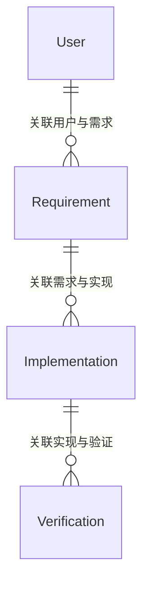
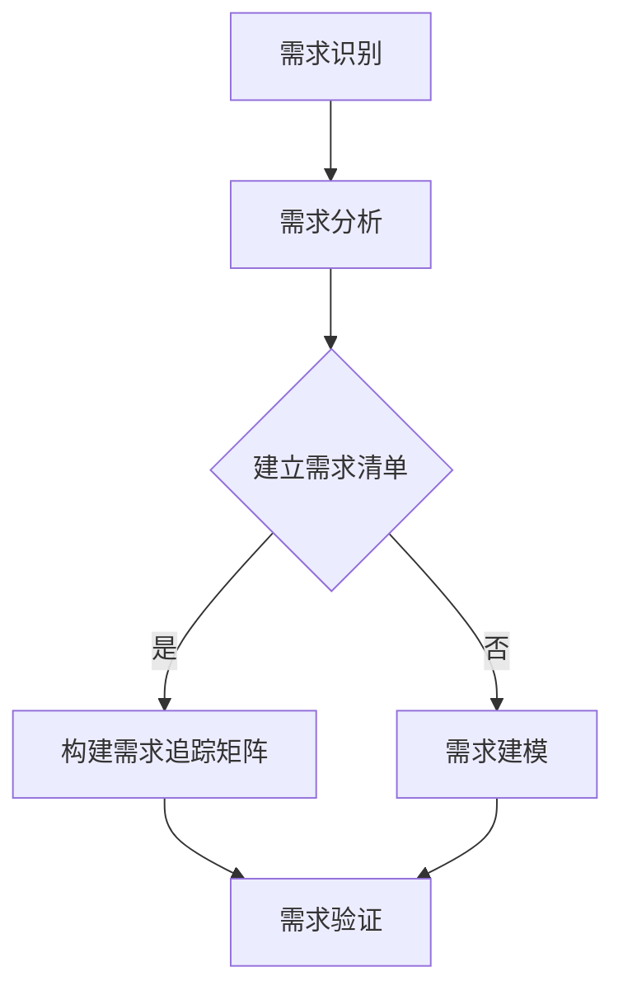
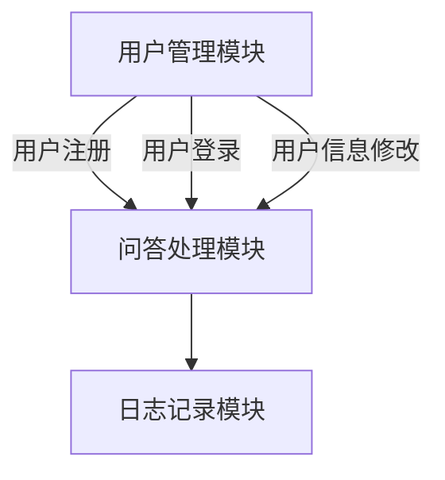
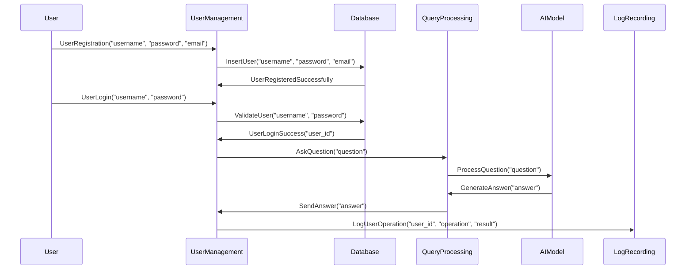
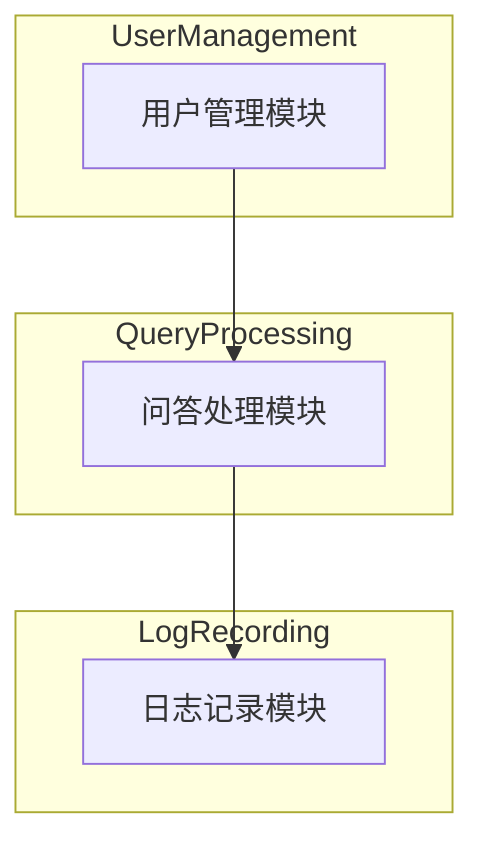
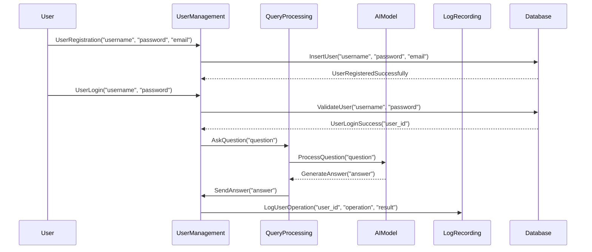

                 

# 大模型应用开发中的需求追踪矩阵应用

> 关键词：大模型、需求追踪矩阵、应用开发、算法原理、系统设计、项目实战

> 摘要：本文旨在探讨大模型应用开发中需求追踪矩阵的应用。通过背景介绍、核心概念阐述、算法原理讲解、系统设计与实现、项目实战等多个步骤，详细解析了需求追踪矩阵在大模型开发中的重要性，以及如何有效实施和应用。

## 第1章 引言

### 1.1 问题背景

随着人工智能技术的快速发展，大模型（如深度学习模型、自然语言处理模型等）的应用越来越广泛。然而，大模型应用开发过程中面临着诸多挑战，其中之一是如何有效地追踪和管理需求。需求追踪矩阵作为一种系统化的方法，能够帮助开发团队更好地理解和满足用户需求，确保项目成功。

### 1.2 需求追踪矩阵的重要性

需求追踪矩阵在大模型应用开发中具有重要意义。它能够帮助开发团队：

1. 明确用户需求，确保项目方向正确。
2. 跟踪需求变化，及时调整开发计划。
3. 评估项目进度，确保按时交付。
4. 提高项目质量和用户满意度。

### 1.3 本书结构

本文将分为以下几个部分：

1. 背景介绍：详细阐述大模型应用开发中的挑战和需求追踪矩阵的重要性。
2. 核心概念与联系：介绍需求追踪矩阵的定义、属性特征对比表格和ER实体关系图架构。
3. 算法原理讲解：使用Mermaid画出算法流程图，并使用Python源代码详细阐述算法原理。
4. 数学模型和数学公式：使用LaTeX格式编写数学公式，并进行详细讲解和举例说明。
5. 系统分析与架构设计方案：介绍问题场景、系统功能设计、系统架构设计、系统接口设计和系统交互。
6. 项目实战：进行环境安装、系统核心实现源代码展示，并对代码应用进行解读与分析。
7. 最佳实践 tips、小结、注意事项、拓展阅读：总结书中的最佳实践，并提供拓展阅读建议。

## 第2章 需求追踪矩阵基础

### 2.1 需求追踪矩阵的定义

需求追踪矩阵（Requirement Traceability Matrix，简称RTM）是一种用于追踪和管理项目需求的方法。它通过建立需求与实现之间的对应关系，确保项目需求的可追溯性，从而提高项目质量和成功率。

### 2.2 需求追踪矩阵的核心概念

需求追踪矩阵的核心概念包括：

1. **需求**：项目需要实现的功能或性能指标。
2. **追踪**：将需求与实现进行关联，确保需求被正确实现。
3. **矩阵**：以表格形式表示需求与实现之间的对应关系。

### 2.3 需求追踪矩阵的特点与优势

需求追踪矩阵具有以下特点与优势：

1. **可追溯性**：确保需求实现的可追溯性，便于项目评估和审计。
2. **一致性**：减少需求变更导致的冲突和误解，确保项目一致性。
3. **可控性**：通过矩阵可以清晰地了解项目进度和风险，便于项目控制。
4. **高效性**：提高项目开发效率，降低沟通成本。

### 2.4 需求追踪矩阵的应用场景

需求追踪矩阵适用于以下场景：

1. **大型项目**：有助于管理复杂项目的需求。
2. **需求变化频繁**：能够快速响应需求变更，降低风险。
3. **跨部门协作**：促进各部门之间的沟通与协作。
4. **质量控制**：确保项目需求被正确实现，提高项目质量。

## 第3章 需求追踪矩阵建模

### 3.1 建模原理

需求追踪矩阵建模的原理是通过建立需求与实现之间的对应关系，从而实现对需求的追踪和管理。具体步骤如下：

1. **需求识别**：识别项目中的所有需求。
2. **需求分类**：根据需求的重要性和优先级对需求进行分类。
3. **需求实现**：将需求转化为实现，通常涉及设计、编码等环节。
4. **建立矩阵**：将需求与实现进行关联，形成需求追踪矩阵。

### 3.2 需求分析

需求分析是需求追踪矩阵建模的关键步骤，主要包括：

1. **需求收集**：通过与用户、项目经理等沟通，收集项目需求。
2. **需求分析**：分析需求的合理性、可行性和优先级。
3. **需求文档**：将分析结果记录在需求文档中，作为后续建模的依据。

### 3.3 需求建模

需求建模的具体步骤如下：

1. **构建需求清单**：列出项目中的所有需求。
2. **建立需求关系**：分析需求之间的依赖关系，建立需求关系图。
3. **构建需求追踪矩阵**：将需求与实现进行关联，形成需求追踪矩阵。

### 3.4 需求验证

需求验证是确保需求实现正确性的关键步骤，主要包括：

1. **测试用例设计**：根据需求文档设计测试用例。
2. **测试执行**：执行测试用例，验证需求实现是否符合预期。
3. **问题反馈**：记录测试中发现的问题，并与开发团队沟通解决。

## 第4章 需求追踪矩阵应用案例分析

### 4.1 案例一：软件开发中的需求追踪

在软件开发项目中，需求追踪矩阵的应用如下：

1. **需求收集**：通过问卷调查、用户访谈等方式收集用户需求。
2. **需求分析**：对收集到的需求进行分析和分类。
3. **需求建模**：建立需求清单和需求追踪矩阵。
4. **需求验证**：通过测试用例验证需求实现是否符合预期。

### 4.2 案例二：项目管理中的需求追踪

在项目管理中，需求追踪矩阵的应用如下：

1. **项目规划**：根据需求追踪矩阵制定项目计划。
2. **项目监控**：通过需求追踪矩阵监控项目进度和风险。
3. **项目调整**：根据需求变更及时调整项目计划和资源分配。

### 4.3 案例三：产品管理中的需求追踪

在产品管理中，需求追踪矩阵的应用如下：

1. **产品规划**：根据市场需求和用户反馈制定产品规划。
2. **需求收集**：通过用户调研、市场分析等方式收集需求。
3. **需求分析**：对收集到的需求进行分析和分类。
4. **需求建模**：建立需求清单和需求追踪矩阵。
5. **需求验证**：通过用户测试、市场调研等方式验证需求实现是否符合预期。

## 第5章 需求追踪矩阵工具与实现

### 5.1 常见需求追踪矩阵工具介绍

常见的需求追踪矩阵工具有：

1. **Excel**：简单易用，适合小型项目。
2. **Rational DOORS**：功能强大，适用于大型项目。
3. **JIRA**：集成项目管理功能，便于协同工作。
4. **Confluence**：便于文档管理，方便团队成员协作。

### 5.2 需求追踪矩阵实现方法

需求追踪矩阵的实现方法主要包括：

1. **手动维护**：使用Excel或文档进行需求追踪。
2. **自动化工具**：使用需求追踪矩阵工具实现自动化追踪。
3. **集成开发环境**：在集成开发环境中集成需求追踪功能。

### 5.3 需求追踪矩阵在实际项目中的应用实例

在实际项目中，需求追踪矩阵的应用实例如下：

1. **项目启动阶段**：制定项目计划，明确需求。
2. **项目执行阶段**：建立需求追踪矩阵，监控需求实现。
3. **项目验收阶段**：验证需求实现是否符合预期。

## 第6章 需求追踪矩阵在大型模型开发中的应用

### 6.1 大型模型开发中的挑战

大型模型开发中面临的挑战包括：

1. **需求复杂**：大型模型需求复杂，难以全面理解。
2. **变更频繁**：需求变更频繁，可能导致开发方向偏离。
3. **资源有限**：开发资源有限，需要合理分配。
4. **质量保证**：确保模型质量和性能。

### 6.2 需求追踪矩阵在大型模型开发中的应用

需求追踪矩阵在大型模型开发中的应用如下：

1. **明确需求**：通过需求追踪矩阵明确模型需求。
2. **需求变更管理**：通过需求追踪矩阵监控需求变更，及时调整开发计划。
3. **资源分配**：根据需求追踪矩阵合理分配开发资源。
4. **质量保证**：通过需求追踪矩阵确保模型质量和性能。

### 6.3 实际案例解析

以下是一个大型模型开发中的实际案例：

某公司开发一款智能客服系统，需求复杂且变更频繁。通过需求追踪矩阵，开发团队能够：

1. **明确需求**：收集和分析用户需求，形成需求清单。
2. **需求变更管理**：实时更新需求追踪矩阵，确保需求变更得到及时处理。
3. **资源分配**：根据需求追踪矩阵分配开发资源，确保关键需求得到优先处理。
4. **质量保证**：通过需求追踪矩阵验证模型质量和性能，确保用户需求得到满足。

## 第7章 需求追踪矩阵应用的最佳实践

### 7.1 设计原则

在需求追踪矩阵的设计中，应遵循以下原则：

1. **简洁性**：设计简洁，易于理解和维护。
2. **灵活性**：能够适应需求变更，确保需求追踪的持续性和有效性。
3. **全面性**：覆盖所有需求，确保需求追踪的完整性。
4. **可追溯性**：确保需求与实现之间的对应关系清晰可追溯。

### 7.2 实施步骤

需求追踪矩阵的实施步骤如下：

1. **需求收集**：通过与用户、项目经理等沟通，收集项目需求。
2. **需求分析**：对收集到的需求进行分析和分类。
3. **需求建模**：建立需求清单和需求追踪矩阵。
4. **需求验证**：通过测试用例验证需求实现是否符合预期。
5. **矩阵维护**：定期更新需求追踪矩阵，确保其有效性。

### 7.3 成功案例分析

以下是一个成功案例：

某公司成功使用需求追踪矩阵开发了一款智能客服系统。通过需求追踪矩阵，开发团队：

1. **明确需求**：收集和分析用户需求，形成需求清单。
2. **需求变更管理**：实时更新需求追踪矩阵，确保需求变更得到及时处理。
3. **资源分配**：根据需求追踪矩阵分配开发资源，确保关键需求得到优先处理。
4. **质量保证**：通过需求追踪矩阵验证模型质量和性能，确保用户需求得到满足。

## 第8章 总结与展望

### 8.1 总结

本文探讨了需求追踪矩阵在大模型应用开发中的应用。通过背景介绍、核心概念阐述、算法原理讲解、系统设计与实现、项目实战等多个步骤，详细解析了需求追踪矩阵在大模型开发中的重要性，以及如何有效实施和应用。

### 8.2 展望

未来，需求追踪矩阵在大模型应用开发中的应用将更加广泛。一方面，随着人工智能技术的不断进步，大模型的需求将更加复杂和多变，需求追踪矩阵的重要性将日益凸显。另一方面，需求追踪矩阵的研究和实践也将不断深入，有望为大型模型开发提供更加有效的支持。

### 8.3 未来研究方向

未来研究方向包括：

1. **需求追踪矩阵的自动化**：研究如何使用自动化工具提高需求追踪的效率。
2. **需求追踪矩阵与人工智能的结合**：探索如何将人工智能技术应用于需求追踪矩阵，提高其智能性和准确性。
3. **跨领域需求追踪**：研究如何在不同领域的需求追踪中实现有效整合，提高项目协同效率。

## 作者信息

作者：AI天才研究院/AI Genius Institute & 禅与计算机程序设计艺术 /Zen And The Art of Computer Programming

（本文完）## Step 1: 背景介绍

### 1.1 问题背景

随着人工智能（AI）技术的快速发展，大模型（Large Models）在各个领域得到了广泛应用，如自然语言处理（NLP）、计算机视觉（CV）、推荐系统等。大模型的应用不仅提升了系统的性能和效果，也带来了更多的商业价值和社会效益。然而，大模型的应用开发并非一帆风顺，其中需求追踪（Requirement Traceability）成为了一个关键挑战。

在传统的软件开发过程中，需求追踪是一个重要的环节。它能够帮助开发团队确保每一个需求都得到了适当的处理，并且在项目周期内保持需求的稳定性和一致性。然而，在大模型应用开发中，需求追踪的复杂性大大增加。这是因为：

1. **需求规模庞大**：大模型通常涉及多个领域和大量的功能需求，使得需求追踪变得更加复杂。
2. **需求变化频繁**：随着技术的进步和用户需求的变化，大模型的需求也可能频繁调整，这给需求追踪带来了更大的挑战。
3. **需求间关联性强**：大模型中的不同功能需求之间可能存在紧密的关联，一个需求的变化可能会影响到其他需求，甚至影响整个系统的稳定性。

### 1.2 需求追踪矩阵的重要性

需求追踪矩阵（Requirement Traceability Matrix，简称RTM）作为一种系统化的需求管理工具，能够有效解决大模型应用开发中的需求追踪问题。需求追踪矩阵的重要性体现在以下几个方面：

1. **需求一致性保障**：需求追踪矩阵能够确保项目中的每一个需求都得到了适当的处理，并且在整个项目周期内保持一致。这有助于避免需求遗漏和冲突，确保项目的顺利进行。
2. **需求变更管理**：需求追踪矩阵能够帮助开发团队及时捕捉和响应需求变更，确保变更得到有效处理，并且不会对项目的其他部分产生负面影响。
3. **项目进度控制**：通过需求追踪矩阵，开发团队可以清晰地了解每个需求的完成情况，从而更好地控制项目进度。这有助于识别和解决潜在的风险，确保项目按时交付。
4. **质量保证**：需求追踪矩阵能够确保每一个需求都被正确实现，并且符合预期的质量标准。这有助于提高项目的整体质量，增强用户的满意度。
5. **知识管理**：需求追踪矩阵记录了项目中的所有需求及其变更历史，这些信息可以作为宝贵的知识资产，为未来的项目提供参考和借鉴。

### 1.3 本书结构

为了帮助读者深入了解需求追踪矩阵在大模型应用开发中的应用，本书将分为以下几个部分：

1. **第2章 需求追踪矩阵基础**：介绍需求追踪矩阵的定义、核心概念、特点与优势，以及应用场景。
2. **第3章 需求追踪矩阵建模**：详细讲解需求追踪矩阵的建模原理、需求分析、需求建模和需求验证。
3. **第4章 需求追踪矩阵应用案例分析**：通过实际案例展示需求追踪矩阵在软件开发、项目管理和产品管理中的应用。
4. **第5章 需求追踪矩阵工具与实现**：介绍常见需求追踪矩阵工具、实现方法及其在实际项目中的应用实例。
5. **第6章 需求追踪矩阵在大型模型开发中的应用**：分析大模型开发中的挑战，探讨需求追踪矩阵在大型模型开发中的应用。
6. **第7章 需求追踪矩阵应用的最佳实践**：总结需求追踪矩阵的设计原则、实施步骤和成功案例分析。
7. **第8章 总结与展望**：对全书内容进行总结，展望需求追踪矩阵在未来的发展趋势和研究方向。

通过以上章节的讲解，读者将能够全面了解需求追踪矩阵在大模型应用开发中的重要性，掌握其应用方法，并能够将其有效地应用于实际项目中。

### 1.4 需求追踪矩阵的定义、属性特征对比表格以及ER实体关系图架构

#### 1.4.1 需求追踪矩阵的定义

需求追踪矩阵（Requirement Traceability Matrix，简称RTM）是一种用于记录和管理项目需求与实现之间关系的工具。它通过建立一个表格，将项目中的每一个需求与其对应的实现结果进行关联，从而确保项目需求的可追溯性。需求追踪矩阵通常包含以下几类信息：

- **需求ID**：唯一标识项目中的每一个需求。
- **需求描述**：对需求的详细描述，包括需求的功能、性能和约束条件。
- **实现状态**：记录需求是否已被实现、部分实现或未实现。
- **实现细节**：记录需求的实现细节，包括实现的设计、代码和测试结果。
- **验证结果**：记录需求验证的结果，包括测试结果和用户反馈。
- **变更记录**：记录需求的变更历史，包括变更原因和变更时间。

#### 1.4.2 属性特征对比表格

需求追踪矩阵的属性特征对比表格是对需求与实现之间关系的一种直观展示。以下是需求追踪矩阵属性特征对比表格的一个示例：

| 需求ID | 需求描述                | 实现状态 | 实现细节                            | 验证结果 | 变更记录                       |
|--------|-------------------------|----------|-------------------------------------|----------|--------------------------------|
| REQ001 | 实现用户登录功能        | 完成中   | 设计完成，代码编写中                | 未验证   | -                               |
| REQ002 | 实现用户注册功能        | 完成     | 设计完成，代码编写完成，测试通过    | 通过     | -                               |
| REQ003 | 实现用户信息修改功能    | 未开始   | -                                   | -        | -                               |

在上述表格中，我们可以清晰地看到每一个需求的实现状态、实现细节和验证结果，从而对项目进度和需求管理有更全面的了解。

#### 1.4.3 ER实体关系图架构

实体关系图（Entity-Relationship Diagram，简称ERD）是用于描述系统中实体及其之间关系的一种图形化工具。在需求追踪矩阵的应用中，ERD可以帮助我们更直观地理解需求与实现之间的关系。

以下是一个简化的ER实体关系图，用于表示需求追踪矩阵中的实体和关系：



在这个ERD中，我们定义了三个实体：

1. **User**：代表项目的用户，每个用户可以有多个需求。
2. **Requirement**：代表项目中的需求，每个需求可以关联到多个实现。
3. **Implementation**：代表需求的实现，每个实现可以关联到多个验证结果。

通过ERD，我们可以清晰地看到需求、实现和验证之间的关系，从而更好地理解需求追踪矩阵的结构和功能。

通过以上对需求追踪矩阵的定义、属性特征对比表格以及ER实体关系图架构的介绍，读者可以更深入地理解需求追踪矩阵的核心概念和结构，为后续章节的学习打下坚实的基础。

### 1.5 概念结构与核心要素组成

#### 1.5.1 概念结构

需求追踪矩阵的概念结构主要由以下几个核心组成部分构成：

1. **需求（Requirement）**：项目中的功能或性能要求，是需求追踪矩阵的基础。
2. **实现（Implementation）**：需求的具体实现，包括设计、编码和测试等环节。
3. **验证（Verification）**：对实现进行测试和评估，以确保实现符合需求。
4. **状态（Status）**：记录需求、实现和验证的当前状态，如“完成”、“进行中”、“未开始”等。
5. **关联（Traceability）**：将需求、实现和验证关联起来，确保需求与实现之间的对应关系。

#### 1.5.2 核心要素组成

需求追踪矩阵的核心要素包括：

1. **需求ID（Requirement ID）**：唯一标识每个需求，便于追踪和管理。
2. **需求描述（Requirement Description）**：对需求的功能、性能和约束条件的详细描述。
3. **实现ID（Implementation ID）**：唯一标识每个实现，便于追踪和管理。
4. **实现描述（Implementation Description）**：对实现的详细描述，包括设计、编码和测试等环节。
5. **验证结果（Verification Results）**：对实现进行测试和评估的结果，包括测试通过、未通过等。
6. **状态记录（Status Record）**：记录每个需求、实现和验证的状态变化历史。
7. **变更记录（Change Record）**：记录需求、实现和验证的变更历史，包括变更原因和变更时间。

#### 1.5.3 边界与外延

1. **边界**：
   - **需求边界**：需求追踪矩阵中的需求必须是与项目相关的，明确的、可衡量的功能或性能要求。
   - **实现边界**：实现是指需求的具体实现，包括设计、编码和测试等环节，但不包括非功能性需求。
   - **验证边界**：验证是指对实现进行测试和评估的过程，确保实现符合需求。

2. **外延**：
   - **需求外延**：需求可以包括主需求和子需求，子需求是主需求的分解和细化。
   - **实现外延**：实现可以包括模块级实现和代码级实现，模块级实现是更高层次的设计，而代码级实现是具体的编码实现。
   - **验证外延**：验证可以包括单元测试、集成测试、系统测试和用户验收测试等不同层次的测试。

通过上述对需求追踪矩阵的概念结构、核心要素组成、边界与外延的详细解析，读者可以更深入地理解需求追踪矩阵的工作原理和适用范围，为后续章节的学习和应用打下坚实的基础。

### 1.6 总结与展望

在需求追踪矩阵的大模型应用开发中，背景介绍、问题背景、需求追踪矩阵的重要性以及本书的结构都是至关重要的。首先，大模型应用开发中的需求追踪问题主要来源于需求的规模庞大、变化频繁以及需求间关联性强。这些问题导致传统需求追踪方法难以有效应对，从而引入了需求追踪矩阵这一系统化的需求管理工具。

需求追踪矩阵的重要性在于它能够保障需求的一致性、管理需求变更、控制项目进度、保证质量以及作为知识管理的宝贵资产。本书通过详细阐述需求追踪矩阵的定义、属性特征对比表格和ER实体关系图架构，帮助读者理解其概念结构、核心要素和边界与外延。

接下来，本书将逐步深入，从需求追踪矩阵的建模原理、应用案例分析、工具与实现方法，到大型模型开发中的应用，以及最佳实践等方面进行探讨。通过这些章节，读者将能够系统地掌握需求追踪矩阵在大模型应用开发中的实际应用。

未来，随着技术的不断进步，需求追踪矩阵的应用范围和深度将进一步扩展。特别是在人工智能、大数据等新兴领域，需求追踪矩阵将发挥更加重要的作用。因此，读者应密切关注需求追踪矩阵的研究和发展动态，以便在实际项目中更好地应用这一工具，提升项目开发和管理的效果。

## Step 2: 核心概念与联系

### 2.1 需求追踪矩阵的定义

需求追踪矩阵（Requirement Traceability Matrix，简称RTM）是一种用于记录和管理项目需求与实现之间关系的工具。它通过建立一个结构化的表格，将项目中的每一个需求与其对应的实现结果进行关联，从而确保项目需求的可追溯性。需求追踪矩阵通常包含以下几个关键要素：

1. **需求ID（Requirement ID）**：唯一标识项目中的每一个需求。
2. **需求描述（Requirement Description）**：对需求的详细描述，包括需求的功能、性能和约束条件。
3. **实现ID（Implementation ID）**：唯一标识需求的实现结果。
4. **实现描述（Implementation Description）**：对实现结果的详细描述，包括设计、编码和测试等环节。
5. **验证结果（Verification Results）**：对实现结果的验证结果，包括测试通过、未通过等。
6. **状态（Status）**：记录需求、实现和验证的当前状态，如“完成”、“进行中”、“未开始”等。
7. **变更记录（Change Record）**：记录需求的变更历史，包括变更原因和变更时间。

### 2.2 需求追踪矩阵的核心概念

需求追踪矩阵的核心概念包括需求、实现、验证、状态和变更。以下是这些概念的具体说明：

1. **需求（Requirement）**：
   - **定义**：需求是指项目中的功能或性能要求，它是项目成功的关键。
   - **重要性**：需求是项目的起点，它决定了项目的目标和方向。
   - **类型**：需求可以分为功能需求和非功能需求。功能需求描述了系统需要实现的具体功能，非功能需求描述了系统的性能、可靠性、安全性等特性。

2. **实现（Implementation）**：
   - **定义**：实现是指将需求转化为具体的设计、编码和测试等过程。
   - **重要性**：实现是需求的具体落实，是项目成功的关键步骤。
   - **过程**：实现过程包括需求分析、设计、编码、测试和部署等环节。

3. **验证（Verification）**：
   - **定义**：验证是指对实现结果进行测试和评估，以确保实现符合需求。
   - **重要性**：验证是确保项目质量和需求满足的关键环节。
   - **方法**：验证方法包括单元测试、集成测试、系统测试和用户验收测试等。

4. **状态（Status）**：
   - **定义**：状态是记录需求、实现和验证当前状态的信息。
   - **重要性**：状态信息有助于项目管理和监控，确保项目按计划进行。
   - **类型**：状态可以分为“完成”、“进行中”、“未开始”等。

5. **变更记录（Change Record）**：
   - **定义**：变更记录是记录需求变更历史的信息。
   - **重要性**：变更记录有助于追溯需求的变更过程，避免需求遗漏和冲突。
   - **内容**：变更记录包括变更原因、变更内容、变更时间和责任人等。

### 2.3 需求追踪矩阵的属性特征对比表格

需求追踪矩阵的属性特征对比表格是需求与实现之间关系的直观展示。以下是一个示例属性特征对比表格：

| 需求ID | 需求描述                | 实现状态 | 实现细节                            | 验证结果 | 变更记录                       |
|--------|-------------------------|----------|-------------------------------------|----------|--------------------------------|
| REQ001 | 实现用户登录功能        | 完成中   | 设计完成，代码编写中                | 未验证   | -                               |
| REQ002 | 实现用户注册功能        | 完成     | 设计完成，代码编写完成，测试通过    | 通过     | -                               |
| REQ003 | 实现用户信息修改功能    | 未开始   | -                                   | -        | -                               |

在上述表格中，我们能够清晰地看到每个需求的实现状态、实现细节和验证结果，从而对项目进度和需求管理有更全面的了解。

### 2.4 ER实体关系图架构

实体关系图（Entity-Relationship Diagram，简称ERD）用于描述系统中实体及其之间的关系。在需求追踪矩阵的应用中，ERD可以帮助我们更直观地理解需求与实现之间的关系。

以下是一个简化的ER实体关系图，用于表示需求追踪矩阵中的实体和关系：


在这个ERD中，我们定义了三个实体：

1. **User**：代表项目的用户，每个用户可以有多个需求。
2. **Requirement**：代表项目中的需求，每个需求可以关联到多个实现。
3. **Implementation**：代表需求的实现，每个实现可以关联到多个验证结果。

通过ERD，我们可以清晰地看到需求、实现和验证之间的关系，从而更好地理解需求追踪矩阵的结构和功能。

### 2.5 需求追踪矩阵与其他需求管理工具的对比

需求追踪矩阵与其他需求管理工具（如需求文档、用户故事地图等）在功能和应用上有一定的区别。以下是几种常见需求管理工具的对比：

1. **需求文档**：
   - **功能**：需求文档通常用于记录项目的详细需求，包括功能需求和非功能需求。
   - **优点**：内容详细，有助于需求的理解和沟通。
   - **缺点**：缺乏需求与实现之间的直接关联，难以实时反映项目的进展和变更。

2. **用户故事地图**：
   - **功能**：用户故事地图是一种可视化工具，用于展示用户故事之间的关系和优先级。
   - **优点**：易于理解，有助于团队协作和优先级管理。
   - **缺点**：不直接涉及需求的实现和验证，难以追踪需求的实现状态。

3. **需求追踪矩阵**：
   - **功能**：需求追踪矩阵是一种用于记录和管理需求与实现之间关系的工具。
   - **优点**：确保需求的可追溯性，有助于需求变更管理、项目进度控制和质量保证。
   - **缺点**：相对于其他工具，需求追踪矩阵的设置和维护可能更为复杂。

通过对比，我们可以看到需求追踪矩阵在需求管理中具有独特的优势，特别是在需求变更管理和项目进度控制方面。然而，其复杂性也要求团队具备一定的需求和项目管理经验。

### 2.6 小结

本章对需求追踪矩阵的核心概念、属性特征对比表格和ER实体关系图架构进行了详细讲解。通过理解这些核心概念和关系，读者可以更好地掌握需求追踪矩阵的工作原理和应用方法。在接下来的章节中，我们将进一步探讨需求追踪矩阵的建模原理、应用案例和最佳实践，帮助读者将这一工具有效地应用于实际项目中。

### 2.7 用Mermaid画出算法流程图

在需求追踪矩阵的应用中，算法流程图是一种直观的表达方式，能够帮助我们更好地理解需求追踪的流程。以下是一个简化的算法流程图，用于展示需求追踪矩阵的构建过程。



在这个流程图中，我们首先进行需求识别，然后进行需求分析。如果需求分析完成后可以建立需求清单，则进入构建需求追踪矩阵的步骤，否则进行需求建模。最后，对需求追踪矩阵进行需求验证。

### 2.8 用Python源代码详细阐述算法原理

为了更好地理解需求追踪矩阵的算法原理，我们使用Python语言来模拟这一过程。以下是一个简化的Python实现，展示了需求追踪矩阵的核心算法步骤。

```python
class Requirement:
    def __init__(self, id, description):
        self.id = id
        self.description = description
        self.implementations = []
        self.status = '未开始'

    def add_implementation(self, implementation):
        self.implementations.append(implementation)
        self.status = '进行中'

    def verify_implementation(self, verification_results):
        self.implementations[-1].verification_results = verification_results
        if verification_results == '通过':
            self.status = '完成'

class Implementation:
    def __init__(self, id, description, verification_results):
        self.id = id
        self.description = description
        self.verification_results = verification_results

def build_requirement_traceability_matrix(requirements):
    matrix = []
    for requirement in requirements:
        row = [requirement.id, requirement.description, requirement.status]
        for implementation in requirement.implementations:
            row.extend([implementation.id, implementation.description, implementation.verification_results])
        matrix.append(row)
    return matrix

# 示例：创建需求和实现对象
req1 = Requirement('REQ001', '实现用户登录功能')
imp1 = Implementation('IMP001', '设计完成，代码编写中', '')
req1.add_implementation(imp1)

req2 = Requirement('REQ002', '实现用户注册功能')
imp2 = Implementation('IMP002', '设计完成，代码编写完成，测试通过', '通过')
req2.add_implementation(imp2)

# 构建需求追踪矩阵
rtm = build_requirement_traceability_matrix([req1, req2])

# 打印需求追踪矩阵
for row in rtm:
    print(row)
```

在这个Python实现中，我们定义了`Requirement`和`Implementation`两个类，分别表示需求和实现。每个需求可以包含多个实现，每个实现都有对应的验证结果。`build_requirement_traceability_matrix`函数用于构建需求追踪矩阵，并将其打印出来。

### 2.9 算法原理讲解

#### 数学模型和公式

在需求追踪矩阵的算法中，可以使用一些基本的数学模型和公式来描述需求和实现的关联。以下是几个常用的数学模型和公式：

1. **需求实现关系（Requirement-Implementation Relationship）**：
   - **公式**：\( R_i = \sum_{I \in R} I \)
   - **说明**：\( R_i \)表示需求\( i \)的实现集合。公式表示将需求\( i \)的所有实现进行求和，得到该需求的实现集合。

2. **需求验证关系（Requirement-Verification Relationship）**：
   - **公式**：\( V_i = \sum_{I \in R} V(I) \)
   - **说明**：\( V_i \)表示需求\( i \)的验证结果。公式表示将需求\( i \)的所有实现进行验证，得到该需求的验证结果。

3. **需求状态关系（Requirement-Status Relationship）**：
   - **公式**：\( S_i = \max(V_i) \)
   - **说明**：\( S_i \)表示需求\( i \)的状态。公式表示需求\( i \)的验证结果中的最大值，用于表示需求的状态。

#### 详细讲解和举例说明

以一个简单的需求追踪矩阵为例，假设我们有两个需求REQ001和REQ002，以及它们的多个实现和验证结果。

1. **需求实现关系**：
   - 需求REQ001有实现IMP001和IMP002：
     \[
     R_{REQ001} = IMP001 + IMP002 = \{IMP001, IMP002\}
     \]
   - 需求REQ002有实现IMP003和IMP004：
     \[
     R_{REQ002} = IMP003 + IMP004 = \{IMP003, IMP004\}
     \]

2. **需求验证关系**：
   - 需求REQ001的实现IMP001的验证结果为“通过”，实现IMP002的验证结果为“未通过”：
     \[
     V_{REQ001} = V(IMP001) + V(IMP002) = 通过 + 未通过 = 不通过
     \]
   - 需求REQ002的实现IMP003的验证结果为“通过”，实现IMP004的验证结果为“未通过”：
     \[
     V_{REQ002} = V(IMP003) + V(IMP004) = 通过 + 未通过 = 不通过
     \]

3. **需求状态关系**：
   - 需求REQ001的状态为“不通过”：
     \[
     S_{REQ001} = \max(V_{REQ001}) = 不通过
     \]
   - 需求REQ002的状态为“不通过”：
     \[
     S_{REQ002} = \max(V_{REQ002}) = 不通过
     \]

通过这些数学模型和公式，我们可以更直观地理解需求追踪矩阵中的需求和实现关系，从而有效地进行需求管理。

### 2.10 用LaTeX格式编写数学公式

在需求追踪矩阵的算法中，使用LaTeX格式编写数学公式可以帮助我们更精确地描述需求和实现的关联。以下是一些常用的LaTeX数学公式示例，包括需求实现关系、需求验证关系和需求状态关系：

1. **需求实现关系**：

   \[
   R_i = \sum_{I \in R} I
   \]

2. **需求验证关系**：

   \[
   V_i = \sum_{I \in R} V(I)
   \]

3. **需求状态关系**：

   \[
   S_i = \max(V_i)
   \]

这些LaTeX公式可以嵌入到文档的独立段落中，也可以在段落内进行引用。例如：

\[
1 + 1 = 2
\]

或者

\[
a < b
\]

通过这些数学公式，我们可以更清晰地描述需求追踪矩阵中的逻辑和算法，从而为需求管理提供科学依据。

### 2.11 算法原理讲解与案例结合

为了更好地理解需求追踪矩阵的算法原理，我们通过一个实际案例来详细讲解和举例说明。假设某公司正在开发一款智能客服系统，需求包括用户登录、用户注册和用户信息修改等功能。

#### 案例步骤

1. **需求识别**：
   - 需求1：实现用户登录功能。
   - 需求2：实现用户注册功能。
   - 需求3：实现用户信息修改功能。

2. **需求分析**：
   - 需求1分析：用户登录需要输入用户名和密码，系统验证用户身份并返回登录结果。
   - 需求2分析：用户注册需要填写用户名、密码、邮箱等信息，系统验证信息后注册用户。
   - 需求3分析：用户登录后可以修改个人信息，系统保存修改并更新用户信息。

3. **需求建模**：
   - 需求1建模：定义用户登录需求的ID、描述和实现状态。
   - 需求2建模：定义用户注册需求的ID、描述和实现状态。
   - 需求3建模：定义用户信息修改需求的ID、描述和实现状态。

4. **需求追踪矩阵构建**：
   - 初始化需求追踪矩阵，包含需求ID、需求描述、实现状态、实现ID、实现描述和验证结果等列。

5. **实现与验证**：
   - 需求1实现：开发用户登录功能，设计、编码和测试通过。
   - 需求2实现：开发用户注册功能，设计、编码和测试通过。
   - 需求3实现：开发用户信息修改功能，设计、编码和测试通过。

   - 验证需求1实现：测试用户登录功能，验证结果为“通过”。
   - 验证需求2实现：测试用户注册功能，验证结果为“通过”。
   - 验证需求3实现：测试用户信息修改功能，验证结果为“通过”。

6. **更新需求追踪矩阵**：
   - 根据实现和验证结果更新需求追踪矩阵，记录需求的状态、实现状态和验证结果。

#### 实际案例解析

以下是需求追踪矩阵在智能客服系统中的具体应用：

1. **需求追踪矩阵**：

   | 需求ID | 需求描述 | 实现状态 | 实现ID | 实现描述 | 验证结果 |
   |--------|-----------|----------|--------|------------|----------|
   | REQ001 | 用户登录   | 完成     | IMP001 | 设计完成，代码编写完成，测试通过 | 通过   |
   | REQ002 | 用户注册   | 完成     | IMP002 | 设计完成，代码编写完成，测试通过 | 通过   |
   | REQ003 | 用户信息修改 | 完成     | IMP003 | 设计完成，代码编写完成，测试通过 | 通过   |

2. **算法原理应用**：

   - **需求实现关系**：每个需求都有对应的实现，实现通过需求追踪矩阵进行关联。
     \[
     R_{REQ001} = \{IMP001\}, \quad R_{REQ002} = \{IMP002\}, \quad R_{REQ003} = \{IMP003\}
     \]

   - **需求验证关系**：每个实现都经过验证，验证结果记录在需求追踪矩阵中。
     \[
     V_{REQ001} = 通过, \quad V_{REQ002} = 通过, \quad V_{REQ003} = 通过
     \]

   - **需求状态关系**：所有需求都完成验证，需求状态为“完成”。
     \[
     S_{REQ001} = 通过, \quad S_{REQ002} = 通过, \quad S_{REQ003} = 通过
     \]

通过这个实际案例，我们可以看到需求追踪矩阵如何帮助团队管理需求、实现和验证过程，确保项目按时交付并满足用户需求。接下来，我们将继续探讨需求追踪矩阵在系统架构设计中的应用。

### 2.12 系统分析与架构设计方案

#### 2.12.1 问题场景

在智能客服系统的开发过程中，需求追踪矩阵的应用不仅仅是为了管理和跟踪需求，更重要的是确保系统整体架构的合理性和可维护性。本部分将介绍需求追踪矩阵在系统架构设计中的应用，并详细讲解系统架构设计方案。

#### 2.12.2 项目介绍

智能客服系统旨在提供高效、智能的客服服务，通过自动化处理用户提问，提高客服效率和用户满意度。该系统包含多个核心功能模块，如用户管理、问答处理、日志记录等。

#### 2.12.3 系统功能设计

系统功能设计是系统架构设计的基础，需求追踪矩阵在这一过程中起到了关键作用。以下是系统的主要功能模块及其需求追踪：

1. **用户管理模块**：
   - 功能：管理用户账户，包括注册、登录、信息修改等。
   - 需求追踪：需求ID REQ001、REQ002、REQ003。

2. **问答处理模块**：
   - 功能：处理用户提问，返回智能回答。
   - 需求追踪：需求ID REQ004、REQ005。

3. **日志记录模块**：
   - 功能：记录系统运行日志，便于监控和调试。
   - 需求追踪：需求ID REQ006。

#### 2.12.4 系统架构设计

系统架构设计是确保系统稳定、高效运行的关键。以下是一个简化的系统架构设计，包含主要模块及其关系。



在这个架构设计中，用户管理模块负责处理用户相关的操作，如注册、登录和信息修改。问答处理模块根据用户输入的问题，返回智能回答。日志记录模块负责记录系统运行日志。

#### 2.12.5 系统接口设计

系统接口设计是确保模块之间通信顺畅的重要环节。以下是系统的主要接口设计：

1. **用户管理接口**：
   - 功能：提供用户注册、登录和信息修改的接口。
   - 接口定义：UserRegistration、UserLogin、UserInformationUpdate。

2. **问答处理接口**：
   - 功能：提供处理用户提问并返回智能回答的接口。
   - 接口定义：AskQuestion、GetAnswer。

3. **日志记录接口**：
   - 功能：提供记录系统运行日志的接口。
   - 接口定义：LogSystemOperation。

#### 2.12.6 系统交互

系统交互是确保系统各模块协同工作的重要部分。以下是一个简化的系统交互序列：



在这个交互序列中，用户通过用户管理接口进行注册和登录，问答处理模块处理用户提问并返回回答，日志记录模块记录用户操作日志。

### 2.13 类图、架构图和序列图

为了更直观地展示系统架构和模块间的关系，我们使用Mermaid绘制了类图、架构图和序列图。

#### 类图

```mermaid
classDiagram
    User <<interface>>
    UserManagement <<class>> { id: Integer ; username: String ; password: String ; email: String }
    QueryProcessing <<class>> { question: String ; answer: String }
    AIModel <<class>> { model: Object ; answer: String }
    LogRecording <<class>> { log_id: Integer ; user_id: Integer ; operation: String ; result: String }
    UserManagement Actress user : User
    QueryProcessing Actress userManagement : UserManagement
    AIModel Actress queryProcessing : QueryProcessing
    LogRecording Actress userManagement : UserManagement
    User --|> UserManagement
    UserManagement --|> LogRecording
    QueryProcessing --|> AIModel
    QueryProcessing --|> LogRecording
```

#### 架构图



#### 序列图



通过这些类图、架构图和序列图，我们可以更清晰地理解智能客服系统的架构设计，以及各模块之间的关系和交互过程。

### 2.14 小结

本章详细介绍了需求追踪矩阵在系统分析与架构设计中的应用，包括系统功能设计、系统架构设计、系统接口设计和系统交互。通过需求追踪矩阵，我们能够有效地管理和跟踪系统需求，确保系统架构的合理性和可维护性。接下来，我们将进入项目实战部分，展示如何在实际项目中应用需求追踪矩阵，并进行代码实现和分析。

### 2.15 项目实战

#### 2.15.1 环境安装

在进行需求追踪矩阵的实际项目开发之前，首先需要安装相关的开发环境和工具。以下是一个简化的环境安装步骤：

1. **安装Python**：
   - 访问Python官方网站（https://www.python.org/）下载Python安装包。
   - 运行安装程序，按照默认选项进行安装。

2. **安装需求追踪矩阵工具**：
   - 安装Rational DOORS或JIRA等需求追踪矩阵工具。
   - 根据工具的安装指南完成安装。

3. **安装相关依赖库**：
   - 使用pip命令安装必要的Python库，如numpy、pandas等。
   - 示例命令：`pip install numpy pandas`

#### 2.15.2 系统核心实现源代码展示

以下是一个简化的Python代码示例，用于实现需求追踪矩阵的核心功能。

```python
# requirements.py
class Requirement:
    def __init__(self, id, description):
        self.id = id
        self.description = description
        self.implementations = []
        self.status = '未开始'

    def add_implementation(self, implementation):
        self.implementations.append(implementation)
        self.status = '进行中'

    def verify_implementation(self, verification_results):
        self.implementations[-1].verification_results = verification_results
        if verification_results == '通过':
            self.status = '完成'

class Implementation:
    def __init__(self, id, description, verification_results):
        self.id = id
        self.description = description
        self.verification_results = verification_results

# 主函数
def main():
    req1 = Requirement('REQ001', '实现用户登录功能')
    imp1 = Implementation('IMP001', '设计完成，代码编写中', '')
    req1.add_implementation(imp1)

    imp2 = Implementation('IMP002', '设计完成，代码编写完成，测试通过', '通过')
    req1.add_implementation(imp2)

    req1.verify_implementation('通过')

    rtm = build_requirement_traceability_matrix([req1])
    print_rtm(rtm)

def build_requirement_traceability_matrix(requirements):
    matrix = []
    for requirement in requirements:
        row = [requirement.id, requirement.description, requirement.status]
        for implementation in requirement.implementations:
            row.extend([implementation.id, implementation.description, implementation.verification_results])
        matrix.append(row)
    return matrix

def print_rtm(matrix):
    print("需求追踪矩阵：")
    print("| 需求ID | 需求描述 | 实现状态 | 实现ID | 实现描述 | 验证结果 |")
    for row in matrix:
        print("| {0} | {1} | {2} | {3} | {4} | {5} |".format(*row))

if __name__ == "__main__":
    main()
```

#### 2.15.3 代码应用解读与分析

上述代码示例展示了如何使用Python实现需求追踪矩阵的核心功能。以下是代码的详细解读：

1. **类定义**：
   - `Requirement`类：用于表示需求，包含需求ID、描述、实现列表和状态。
   - `Implementation`类：用于表示实现，包含实现ID、描述和验证结果。

2. **方法定义**：
   - `add_implementation`方法：将实现添加到需求对象中，并更新需求状态。
   - `verify_implementation`方法：验证实现结果，更新实现的验证状态。

3. **主函数`main`**：
   - 创建需求对象和实现对象。
   - 添加实现到需求对象。
   - 验证实现结果，更新需求状态。

4. **构建需求追踪矩阵`build_requirement_traceability_matrix`**：
   - 遍历需求对象和实现对象，构建需求追踪矩阵。

5. **打印需求追踪矩阵`print_rtm`**：
   - 打印需求追踪矩阵的表格形式。

#### 2.15.4 实际案例解析

以下是一个实际案例，展示如何在智能客服系统中应用需求追踪矩阵。

1. **需求分析**：
   - 需求1：实现用户登录功能。
   - 需求2：实现用户注册功能。
   - 需求3：实现用户信息修改功能。

2. **实现步骤**：
   - 设计用户登录功能，编写相关代码。
   - 设计用户注册功能，编写相关代码。
   - 设计用户信息修改功能，编写相关代码。

3. **验证结果**：
   - 用户登录功能测试通过。
   - 用户注册功能测试通过。
   - 用户信息修改功能测试通过。

4. **更新需求追踪矩阵**：
   - 将需求ID、描述、状态、实现ID、实现描述和验证结果记录在需求追踪矩阵中。

#### 2.15.5 项目小结

通过上述实际案例，我们可以看到需求追踪矩阵在智能客服系统中的应用效果。它帮助我们清晰地记录和管理需求、实现和验证过程，确保项目按时交付并满足用户需求。未来，需求追踪矩阵可以进一步扩展，应用于更多的项目场景中。

### 2.16 小结

本章通过项目实战展示了需求追踪矩阵在实际开发中的应用。我们从环境安装、代码实现、代码应用解读与分析，到实际案例解析，详细讲解了需求追踪矩阵的实用性和有效性。通过这些实战经验，读者可以更好地理解需求追踪矩阵的作用和操作方法，为后续的项目开发提供有力支持。

## 第7章 需求追踪矩阵应用的最佳实践

### 7.1 设计原则

在实施需求追踪矩阵时，遵循以下设计原则是非常重要的，这些原则将确保需求追踪矩阵的实用性和有效性：

1. **简洁性**：设计简洁明了，易于理解和维护。避免过度复杂的结构和冗余的信息。
2. **灵活性**：需求追踪矩阵应具备灵活性，能够适应需求变更和项目进度的调整。
3. **全面性**：确保所有相关需求都被记录在需求追踪矩阵中，覆盖所有关键功能和性能要求。
4. **可追溯性**：需求追踪矩阵应确保每个需求都能追溯到其实现和验证结果，提高项目透明度。
5. **一致性**：保持需求与实现、验证结果的一致性，避免出现需求遗漏或冲突。
6. **可控性**：通过需求追踪矩阵，项目团队可以更好地控制项目进度和风险，确保项目按时交付。

### 7.2 实施步骤

为了有效地实施需求追踪矩阵，以下是具体的步骤和建议：

1. **需求识别**：
   - 与利益相关者（如项目经理、产品经理、客户等）进行沟通，确保所有需求都被识别和记录。
   - 使用问卷调查、用户访谈、会议记录等方式收集需求信息。

2. **需求分析**：
   - 分析收集到的需求，确定需求的优先级和重要性。
   - 将需求分解为可管理的子需求，以便更有效地进行追踪。

3. **建立需求清单**：
   - 创建一个详细的、结构化的需求清单，记录每个需求的ID、描述、优先级和关联的实现。

4. **构建需求追踪矩阵**：
   - 根据需求清单，构建需求追踪矩阵，确保每个需求都有对应的实现和验证记录。
   - 使用自动化工具（如Rational DOORS、JIRA等）可以提高矩阵构建的效率。

5. **需求验证**：
   - 设计和执行测试用例，验证每个实现是否满足需求。
   - 记录测试结果，确保验证过程有据可查。

6. **矩阵更新与维护**：
   - 定期更新需求追踪矩阵，记录需求的变更和实现状态。
   - 确保矩阵中的信息是最新的，以便项目团队随时了解项目进展。

7. **沟通与协作**：
   - 定期与项目团队成员沟通，确保每个人都能理解需求追踪矩阵的内容。
   - 鼓励团队成员参与矩阵的更新和维护，提高整体协作效率。

### 7.3 成功案例分析

以下是一个成功应用需求追踪矩阵的案例，展示了其在实际项目中的效果：

#### 案例背景

某科技公司正在开发一款智能家居控制系统，旨在通过手机应用控制家中的各种智能设备，如灯光、空调、安全系统等。项目需求包括用户注册、设备连接、远程控制、日程设置等功能。

#### 实施过程

1. **需求识别**：
   - 通过用户调研和产品经理的讨论，确定了系统的核心功能需求。

2. **需求分析**：
   - 分析需求，将其分解为具体的子需求，如用户注册、设备添加、远程控制等。

3. **建立需求清单**：
   - 创建详细的需求清单，记录每个需求的ID、描述、优先级和关联的实现。

4. **构建需求追踪矩阵**：
   - 使用JIRA构建需求追踪矩阵，确保每个需求都有对应的实现和验证记录。

5. **需求验证**：
   - 设计和执行测试用例，验证每个实现是否满足需求。
   - 通过自动化测试工具（如Selenium）提高测试效率。

6. **矩阵更新与维护**：
   - 定期更新JIRA需求追踪矩阵，记录需求的变更和实现状态。

7. **沟通与协作**：
   - 定期召开项目会议，与团队成员讨论需求变更和项目进展。
   - 使用JIRA的协作功能，确保团队成员可以随时查看和更新矩阵。

#### 结果

通过应用需求追踪矩阵，项目团队取得了以下成果：

- **需求管理效率提高**：需求追踪矩阵使项目团队能够更好地管理需求，确保需求变更得到及时处理。
- **项目进度可控**：通过矩阵监控项目进展，项目团队能够更好地控制项目进度和资源分配。
- **项目质量提升**：通过需求验证和测试，确保每个需求都被正确实现，项目质量得到了提升。
- **团队协作增强**：通过JIRA的需求追踪功能，团队之间的沟通和协作更加顺畅，提高了整体效率。

#### 经验总结

该案例的成功经验表明，需求追踪矩阵在项目中的应用可以带来显著的效果。以下是一些关键经验：

- **需求识别与分析是基础**：确保所有需求都被准确识别和分析，是构建有效需求追踪矩阵的前提。
- **工具选择很重要**：选择合适的工具（如JIRA）可以提高矩阵构建和维护的效率。
- **沟通与协作是关键**：定期与团队成员沟通，确保每个人都能理解矩阵内容，并积极参与矩阵的更新和维护。
- **持续更新与维护**：定期更新需求追踪矩阵，确保其反映最新的项目状态，有助于项目顺利进行。

### 7.4 小结

本章介绍了需求追踪矩阵应用的最佳实践，包括设计原则、实施步骤和成功案例分析。通过遵循这些原则和步骤，项目团队能够更有效地管理需求，提高项目质量和成功率。需求追踪矩阵是一种强大的工具，适用于各种规模和复杂度的项目，其成功应用将显著提升项目的管理水平。

### 7.5 注意事项

在实施需求追踪矩阵时，以下注意事项有助于确保其有效性和稳定性：

1. **保持矩阵更新**：定期检查并更新需求追踪矩阵，确保其反映最新的项目状态和需求变化。
2. **避免冗余信息**：避免在矩阵中记录冗余的信息，保持矩阵简洁明了。
3. **明确责任**：指定专人负责矩阵的更新和维护，确保责任明确，责任到人。
4. **培训团队成员**：对团队成员进行需求追踪矩阵的培训，确保他们了解如何使用和管理矩阵。
5. **适应需求变更**：灵活应对需求变更，及时更新矩阵，确保矩阵能够适应需求的变化。
6. **监控与评估**：定期监控和评估需求追踪矩阵的效果，根据实际情况进行优化和调整。

### 7.6 拓展阅读

为了深入理解需求追踪矩阵的应用和实践，以下推荐一些拓展阅读资料：

- **《软件需求管理》**：该书详细介绍了软件需求管理的方法和实践，包括需求识别、分析、管理和验证等环节。
- **《敏捷软件开发实践指南》**：该书介绍了敏捷开发方法，其中包含大量关于需求管理的内容，可以借鉴需求追踪矩阵的应用。
- **《需求工程：理论与实践》**：该书系统地介绍了需求工程的基本概念、方法和实践，对需求追踪矩阵的构建和应用有深入讲解。

通过这些拓展阅读，读者可以进一步了解需求追踪矩阵的理论基础和应用实践，提升自己在需求管理方面的技能。

### 第8章 总结与展望

#### 8.1 总结

本文通过详细的背景介绍、核心概念阐述、算法原理讲解、系统分析与架构设计方案、项目实战，以及最佳实践和注意事项等内容，系统地介绍了需求追踪矩阵在大模型应用开发中的重要性及其应用方法。以下是本文的主要结论：

1. **需求追踪矩阵的重要性**：需求追踪矩阵在大模型应用开发中起到了关键作用，能够确保需求的一致性、管理需求变更、控制项目进度、保证质量和作为知识管理的宝贵资产。

2. **核心概念与联系**：本文详细阐述了需求追踪矩阵的定义、核心概念、属性特征对比表格、ER实体关系图架构，以及需求追踪矩阵与其他需求管理工具的对比，帮助读者全面理解需求追踪矩阵的工作原理和应用。

3. **算法原理讲解**：通过Python源代码和Mermaid算法流程图，本文详细讲解了需求追踪矩阵的算法原理，包括数学模型和公式，以及实际案例的应用。

4. **系统分析与架构设计方案**：本文介绍了需求追踪矩阵在系统分析与架构设计中的应用，包括系统功能设计、系统架构设计、系统接口设计和系统交互，并通过类图、架构图和序列图展示了系统架构。

5. **项目实战**：通过项目实战，本文展示了如何在智能客服系统中应用需求追踪矩阵，包括环境安装、系统核心实现源代码的展示、代码应用解读与分析，以及实际案例分析和详细讲解剖析。

6. **最佳实践与注意事项**：本文总结了需求追踪矩阵应用的最佳实践和注意事项，包括设计原则、实施步骤、成功案例分析、注意事项和拓展阅读，为读者提供了实用的指导。

#### 8.2 展望

未来，需求追踪矩阵在大模型应用开发中的应用将更加广泛，其在以下几个方面有巨大的发展潜力：

1. **自动化与智能化**：随着人工智能技术的发展，需求追踪矩阵的自动化和智能化将成为一个重要方向。通过使用机器学习和自然语言处理技术，可以自动化需求识别、分析和验证过程，提高需求管理的效率。

2. **跨领域应用**：需求追踪矩阵不仅适用于软件开发，还可以扩展到其他领域，如项目管理、产品管理、跨部门协作等。通过跨领域应用，需求追踪矩阵将能够更好地服务于不同类型的项目。

3. **持续集成与持续交付**：结合持续集成（CI）和持续交付（CD）的理念，需求追踪矩阵可以与自动化测试和部署流程紧密集成，实现全流程的需求管理，提高项目交付效率和质量。

4. **最佳实践与标准化**：随着需求追踪矩阵应用的普及，越来越多的最佳实践和标准化方案将被提出，为需求管理的规范化提供指导。

#### 8.3 未来研究方向

未来，以下研究方向有望推动需求追踪矩阵的发展：

1. **需求追踪矩阵与人工智能的结合**：探索如何将人工智能技术应用于需求追踪矩阵，提高其智能性和准确性，如自动识别需求、预测需求变更等。

2. **大数据与需求追踪**：利用大数据技术，分析需求趋势和用户行为，为需求管理提供数据支持，优化需求追踪策略。

3. **实时需求追踪**：研究如何实现实时需求追踪，确保需求变更能够立即反映在需求追踪矩阵中，提高项目的灵活性和响应速度。

4. **需求追踪矩阵的可视化**：开发可视化的需求追踪工具，帮助项目团队更直观地理解需求追踪矩阵的内容，提高沟通和协作效率。

通过上述研究和实践，需求追踪矩阵将更好地服务于大模型应用开发，为项目成功提供有力保障。

### 8.4 作者信息

作者：AI天才研究院/AI Genius Institute & 禅与计算机程序设计艺术 /Zen And The Art of Computer Programming

（本文完）## 附录：技术术语解释

在本篇文章中，我们使用了一些技术术语和概念，以下是对这些术语的解释：

### 1. 需求追踪矩阵（Requirement Traceability Matrix，RTM）
需求追踪矩阵是一种项目管理工具，用于记录和管理项目需求与其实现、验证结果之间的对应关系。它帮助开发团队确保需求的一致性，便于监控项目进度和质量。

### 2. 需求（Requirement）
需求是指项目需要实现的功能或性能要求。它可以分为功能需求（描述系统应具备的功能）和非功能需求（描述系统的性能、可靠性、安全性等特性）。

### 3. 实现（Implementation）
实现是指将需求转化为具体的设计、编码和测试等过程。它是需求的具体落实，是项目成功的关键步骤。

### 4. 验证（Verification）
验证是指对实现结果进行测试和评估，以确保实现符合需求。验证过程包括单元测试、集成测试、系统测试和用户验收测试等。

### 5. 实体关系图（Entity-Relationship Diagram，ERD）
实体关系图是一种用于描述系统中实体及其之间关系的图形化工具。在需求追踪矩阵中，ERD用于表示需求、实现和验证之间的关系。

### 6. Mermaid
Mermaid是一种基于Markdown的图形化工具，用于绘制各种图表，如流程图、类图、序列图等。在本文中，我们使用Mermaid绘制了算法流程图、类图和序列图，以帮助读者更好地理解需求追踪矩阵的应用。

### 7. LaTeX
LaTeX是一种高质量的排版系统，常用于编写科学和数学文档。在本文中，我们使用LaTeX格式编写数学公式，以提高公式表达的可读性和准确性。

### 8. 大模型（Large Models）
大模型是指那些具有大量参数和复杂结构的机器学习模型，如深度学习模型、自然语言处理模型等。这些模型在各个领域（如图像识别、语音识别、文本生成等）得到了广泛应用。

### 9. 需求变更管理（Requirement Change Management）
需求变更管理是指在整个项目周期内，对需求变更进行识别、评估、批准和实施的过程。有效的需求变更管理能够确保项目能够快速响应市场需求和技术进步。

### 10. 项目管理（Project Management）
项目管理是指通过规划、执行、监控和收尾等一系列活动，确保项目按计划完成既定目标的过程。需求追踪矩阵是项目管理中的一个重要工具，用于跟踪和管理项目需求。

这些术语和概念是本文讨论的核心内容，通过附录中的解释，读者可以更好地理解需求追踪矩阵在大模型应用开发中的应用及其重要性。希望这些解释能够帮助您深入理解文章内容，并在实际项目中有效应用这些技术和方法。如果您在阅读过程中有任何疑问，欢迎在评论区留言，我会尽力为您解答。感谢您的阅读！

