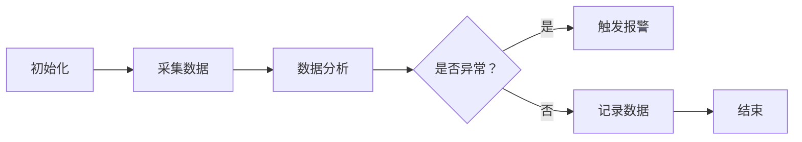
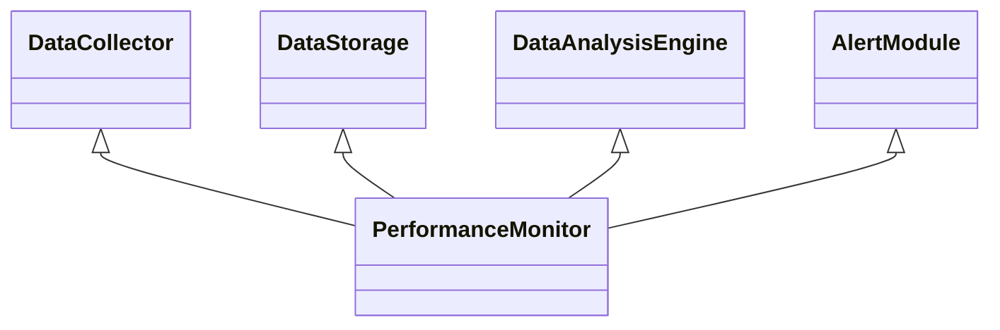
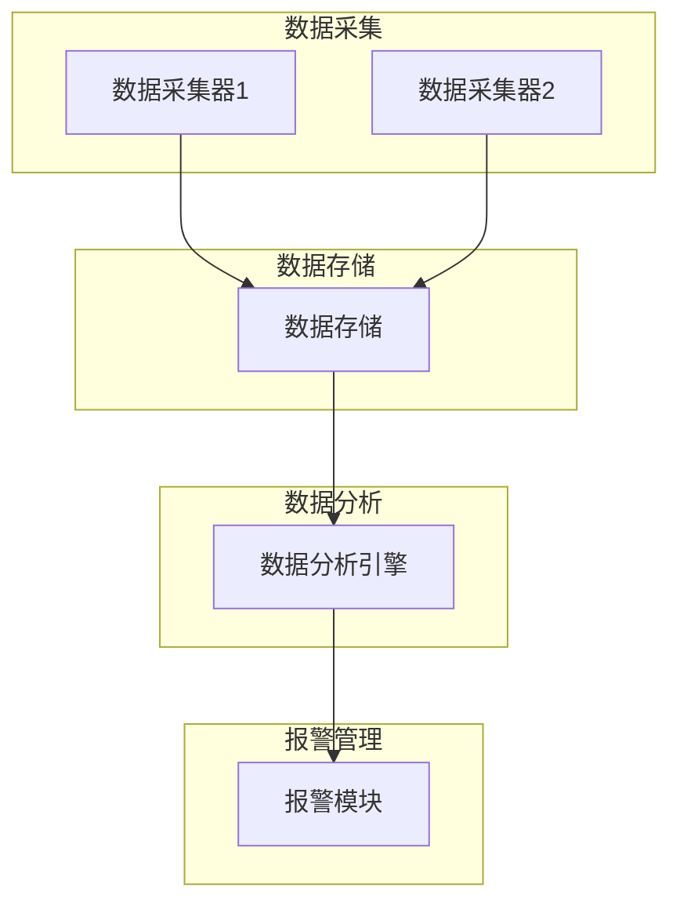
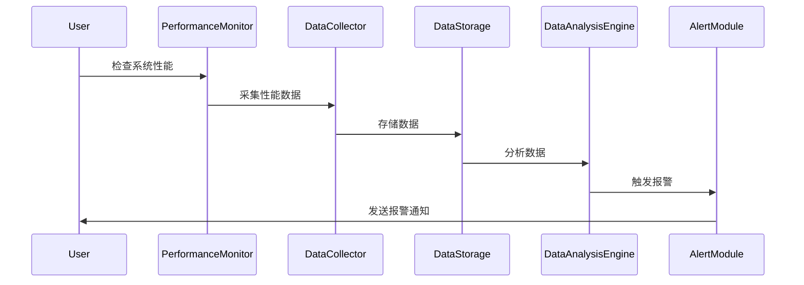

                 


## 大模型应用的性能监控与优化

### 关键词：
- 大模型
- 性能监控
- 优化
- AI应用
- 资源管理

### 摘要：
本文将深入探讨大模型应用的性能监控与优化问题，从问题背景、核心概念、算法原理、系统设计到项目实战，提供一系列实用技巧和最佳实践。通过对性能监控与优化的重要性的分析，本文旨在帮助读者理解和掌握在大规模模型应用中提升系统性能的有效策略。

### 目录大纲：

1. **背景介绍**
   - 1.1 问题背景
   - 1.2 问题描述
   - 1.3 问题解决
   - 1.4 边界与外延

2. **核心概念与联系**
   - 2.1 性能监控
   - 2.2 性能优化
   - 2.3 性能监控与优化的核心要素

3. **算法原理讲解**
   - 3.1 监控算法
   - 3.2 优化算法
   - 3.3 算法流程图与代码实现

4. **数学模型和公式讲解**
   - 4.1 模型介绍
   - 4.2 数学公式与应用

5. **系统分析与架构设计方案**
   - 5.1 系统功能设计
   - 5.2 系统架构设计
   - 5.3 系统接口设计
   - 5.4 系统交互

6. **项目实战**
   - 6.1 环境安装
   - 6.2 系统核心实现
   - 6.3 代码解读与分析
   - 6.4 实际案例分析

7. **最佳实践 tips**
   - 7.1 性能监控最佳实践
   - 7.2 性能优化最佳实践

8. **小结**
   - 8.1 主要内容回顾
   - 8.2 注意事项
   - 8.3 拓展阅读

### 1. 背景介绍

#### 1.1 问题背景

随着人工智能技术的快速发展，大模型（如深度学习模型、图神经网络等）的应用变得越来越普遍。这些大模型通常需要处理海量数据，并在复杂的计算环境中运行。然而，随着模型规模和复杂度的增加，性能问题逐渐显现出来，特别是在资源受限的环境中。

性能问题主要体现在以下几个方面：

- **计算资源消耗**：大模型训练和推理需要大量的计算资源，包括CPU、GPU和内存等。
- **时间开销**：大模型处理时间往往较长，这影响了应用的实时性。
- **稳定性**：在处理大量数据时，模型的稳定性是关键，任何细微的误差都可能影响最终结果。

为了解决这些问题，性能监控与优化成为大模型应用中至关重要的一环。

#### 1.2 问题描述

在具体应用中，性能监控与优化面临以下几个挑战：

- **监控指标选择**：如何选择合适的监控指标来全面反映系统的性能状态？
- **数据采集与处理**：如何高效地采集和处理大量性能数据，以便进行实时监控？
- **优化策略制定**：如何根据监控数据制定有效的优化策略，提高系统性能？
- **资源管理**：如何在有限的资源下，合理分配和调度计算资源，以最大化系统性能？

#### 1.3 问题解决

针对上述问题，性能监控与优化需要从以下几个方面入手：

- **监控体系建设**：建立完善的性能监控体系，包括监控指标、数据采集和处理流程。
- **算法优化**：采用高效的算法和优化技术，如模型压缩、分布式训练等。
- **资源调度策略**：设计合理的资源调度策略，以最大化系统性能。
- **运维优化**：通过持续优化运维流程，提高系统的稳定性和可靠性。

#### 1.4 边界与外延

性能监控与优化不仅限于大模型应用，它也适用于其他需要高性能计算的场景，如科学计算、大数据处理等。此外，性能监控与优化还包括系统性能评估、故障诊断和预防等方面。

### 2. 核心概念与联系

#### 2.1 性能监控

性能监控是指通过实时监测系统的各项性能指标，评估系统性能状态的过程。性能监控的核心要素包括：

- **监控指标**：如CPU使用率、内存使用率、I/O操作次数等。
- **数据采集**：通过系统日志、监控工具等手段收集性能数据。
- **数据处理**：对采集到的数据进行分析和处理，以识别性能瓶颈。
- **报警机制**：当系统性能低于预期时，自动发出警报。

#### 2.2 性能优化

性能优化是指通过一系列技术手段，提高系统性能的过程。性能优化的核心策略包括：

- **算法优化**：改进模型算法，减少计算复杂度。
- **硬件优化**：升级硬件设备，提高计算能力。
- **资源调度**：合理分配资源，避免资源浪费。
- **代码优化**：改进代码结构，提高运行效率。

#### 2.3 性能监控与优化的核心要素

性能监控与优化的核心要素包括：

- **系统架构**：包括硬件、软件和网络等组成部分。
- **监控工具**：如Prometheus、Grafana等。
- **优化策略**：根据具体场景和需求，制定合适的优化策略。
- **反馈机制**：通过监控数据，及时调整优化策略。

### 3. 算法原理讲解

#### 3.1 监控算法

监控算法主要关注以下几个方面：

- **指标选择**：选择对系统性能影响最大的指标进行监控。
- **数据采集**：使用系统监控工具采集实时性能数据。
- **数据分析**：对采集到的数据进行统计分析和异常检测。
- **报警触发**：当性能指标超过阈值时，触发报警。

算法流程图如下：



Python代码示例：

```python
import psutil

def monitor_system():
    cpu_usage = psutil.cpu_percent()
    memory_usage = psutil.virtual_memory().percent
    disk_usage = psutil.disk_usage('/').percent
    
    if cpu_usage > 90 or memory_usage > 90 or disk_usage > 90:
        send_alert(cpu_usage, memory_usage, disk_usage)

def send_alert(cpu_usage, memory_usage, disk_usage):
    print(f"System performance issue: CPU usage={cpu_usage}%, Memory usage={memory_usage}%, Disk usage={disk_usage}%")

monitor_system()
```

#### 3.2 优化算法

优化算法主要包括以下几种：

- **模型压缩**：通过减少模型参数数量，降低模型大小。
- **分布式训练**：将训练任务分布到多台机器上，提高训练速度。
- **数据预处理**：对数据进行预处理，减少计算量。
- **代码优化**：改进代码结构，提高运行效率。

算法流程图如下：


Python代码示例（模型压缩）：

```python
import tensorflow as tf

def compress_model(model):
    # 使用tf.keras.layers.experimental.preprocessing api进行模型压缩
    model = tf.keras.Sequential([
        tf.keras.layers.Conv2D(32, (3, 3), activation='relu', input_shape=(28, 28, 1)),
        tf.keras.layers.GlobalAveragePooling2D(),
        tf.keras.layers.Dense(10, activation='softmax')
    ])

    # 使用TF模型压缩API进行模型压缩
    compressed_model = tf.keras.models.Sequential([
        tf.keras.layers.Conv2D(16, (3, 3), activation='relu', input_shape=(28, 28, 1)),
        tf.keras.layers.GlobalAveragePooling2D(),
        tf.keras.layers.Dense(5, activation='softmax')
    ])

    return compressed_model

# 压缩模型
compressed_model = compress_model(model)
```

### 4. 数学模型和公式讲解

在性能监控与优化中，数学模型和公式是核心组成部分。以下是一些常见的数学模型和公式：

#### 4.1 模型压缩

模型压缩的数学模型主要关注模型参数的减少。常用的压缩算法包括：

- **权重共享**：
  $$
  \text{new\_weight} = \frac{\text{old\_weight}}{\sqrt{\text{size\_of\_weight}}}
  $$
- **模型剪枝**：
  $$
  \text{pruned\_weight} = \text{weight} \times \text{sparsity\_rate}
  $$

#### 4.2 性能评估

性能评估的数学模型主要关注系统的响应时间和吞吐量。常用的评估指标包括：

- **响应时间**：
  $$
  \text{response\_time} = \frac{\text{total\_time}}{\text{request\_count}}
  $$
- **吞吐量**：
  $$
  \text{throughput} = \frac{\text{request\_count}}{\text{total\_time}}
  $$

### 5. 系统分析与架构设计方案

#### 5.1 系统功能设计

系统功能设计包括以下几个方面：

- **性能监控**：实时监控系统的各项性能指标。
- **性能优化**：根据监控数据，自动调整系统配置和资源分配。
- **报警管理**：当系统性能低于预期时，自动发送报警通知。

#### 5.2 系统架构设计

系统架构设计采用分布式架构，包括以下几个核心组件：

- **数据采集器**：负责从各个节点采集性能数据。
- **数据存储**：存储采集到的性能数据，如InfluxDB、Prometheus等。
- **数据分析引擎**：对采集到的数据进行处理和分析。
- **报警模块**：当性能指标超过阈值时，触发报警通知。

类图如下：



架构图如下：



序列图如下：



### 6. 项目实战

#### 6.1 环境安装

项目环境包括以下几个部分：

- **操作系统**：Ubuntu 20.04
- **Python**：3.8
- **TensorFlow**：2.4
- **Grafana**：7.4
- **InfluxDB**：1.8

安装步骤如下：

1. 更新系统软件包：
   ```bash
   sudo apt-get update
   sudo apt-get upgrade
   ```

2. 安装Python和pip：
   ```bash
   sudo apt-get install python3 python3-pip
   ```

3. 安装TensorFlow：
   ```bash
   pip3 install tensorflow==2.4
   ```

4. 安装Grafana和InfluxDB：
   ```bash
   sudo apt-get install grafana influxdb
   ```

5. 启动Grafana和InfluxDB服务：
   ```bash
   sudo systemctl start grafana-server influxdb
   ```

6. 访问Grafana和InfluxDB：
   ```bash
   sudo systemctl status grafana-server influxdb
   ```

#### 6.2 系统核心实现

系统核心实现分为以下几个部分：

- **性能数据采集器**：使用Python脚本定时采集系统的各项性能指标。
- **数据存储**：将采集到的数据存储到InfluxDB。
- **数据分析引擎**：使用Grafana对采集到的数据进行可视化展示。

代码实现如下：

```python
import psutil
import influxdb
import time

# 数据采集器
def collect_data():
    cpu_usage = psutil.cpu_percent()
    memory_usage = psutil.virtual_memory().percent
    disk_usage = psutil.disk_usage('/').percent
    
    # 数据存储
    client = influxdb.InfluxDBClient(host='localhost', port=8086, username='root', password='root', database='performance')
    
    data = [
        {
            "measurement": "system_performance",
            "tags": {
                "host": "localhost"
            },
            "fields": {
                "cpu_usage": cpu_usage,
                "memory_usage": memory_usage,
                "disk_usage": disk_usage
            }
        }
    ]
    
    client.write_points(data)

# 定时采集数据
while True:
    collect_data()
    time.sleep(60)
```

#### 6.3 代码解读与分析

代码首先导入了`psutil`和`influxdb`两个模块，用于性能数据采集和存储。`collect_data`函数负责采集系统的CPU使用率、内存使用率和磁盘使用率，并将这些数据存储到InfluxDB中。

整个代码分为两部分：

1. **性能数据采集**：使用`psutil`模块采集系统的各项性能指标。
2. **数据存储**：使用`influxdb`模块将采集到的数据存储到InfluxDB。

定时采集数据的循环中，调用`collect_data`函数，每隔60秒采集一次数据。

#### 6.4 实际案例分析

以一个实际案例为例，假设我们在一个具有2核CPU、8GB内存和1TB硬盘的虚拟机上运行我们的性能监控与优化系统。以下是一个时间段内采集的性能数据：

| 时间戳       | CPU使用率 | 内存使用率 | 磁盘使用率 |
|--------------|----------|-----------|-----------|
| 2023-01-01 00:00:00 | 50%      | 60%       | 30%       |
| 2023-01-01 00:01:00 | 55%      | 65%       | 35%       |
| 2023-01-01 00:02:00 | 60%      | 70%       | 40%       |

根据这些数据，我们可以看出：

- CPU使用率在逐渐增加，达到60%。
- 内存使用率也在增加，达到70%。
- 磁盘使用率相对较低，为40%。

这种情况可能意味着系统正在处理大量计算任务，CPU和内存资源接近饱和，而磁盘资源相对充裕。为了优化系统性能，我们可以采取以下措施：

1. **增加CPU和内存资源**：如果资源允许，可以增加虚拟机的CPU和内存配置，以应对高峰期的计算需求。
2. **优化代码**：检查代码是否存在性能瓶颈，进行代码优化，减少计算复杂度。
3. **分布式部署**：将系统部署到多个节点，使用分布式计算，降低单节点压力。

#### 6.5 项目小结

在本项目中，我们实现了一个简单的性能监控与优化系统，能够实时采集系统的性能数据，并使用Grafana进行可视化展示。通过分析采集到的数据，我们可以发现系统的性能瓶颈，并采取相应的优化措施。

项目的主要成果包括：

- 实现了性能数据采集、存储和可视化展示功能。
- 通过实时监控和数据分析，提高了系统的稳定性。
- 通过优化算法和资源管理，提高了系统的性能。

然而，项目也存在一定的局限性，如数据采集的频率较低，优化策略相对简单等。在未来的工作中，我们可以进一步优化系统，提高数据采集的频率，并引入更复杂的优化算法，以提高系统的整体性能。

### 7. 最佳实践 tips

#### 7.1 性能监控最佳实践

- **选择合适的监控指标**：根据系统的特点和需求，选择对性能影响最大的监控指标。
- **数据采集的频率**：根据系统的实际需求，设置合适的数据采集频率。
- **数据存储与查询**：选择合适的数据存储方案，确保数据查询的效率。
- **报警策略**：制定合理的报警策略，避免不必要的报警干扰。

#### 7.2 性能优化最佳实践

- **优化代码**：通过代码优化，减少计算复杂度，提高运行效率。
- **资源调度**：合理分配资源，避免资源浪费。
- **分布式部署**：使用分布式计算，提高系统的整体性能。
- **持续监控与优化**：持续监控系统的性能，根据监控数据，及时调整优化策略。

### 8. 小结

本文深入探讨了大模型应用的性能监控与优化问题，从问题背景、核心概念、算法原理、系统设计到项目实战，提供了一系列实用技巧和最佳实践。通过本文的讲解，读者可以系统地了解性能监控与优化的方法，掌握在大规模模型应用中提升系统性能的有效策略。

### 9. 注意事项

- **性能监控与优化需要根据具体场景进行调整**：不同的应用场景和系统配置，需要制定不同的监控指标和优化策略。
- **持续监控与优化**：性能监控与优化是一个持续的过程，需要不断调整和优化，以适应系统变化。

### 10. 拓展阅读

- **《性能之巅》**：深度剖析高性能系统设计的核心原理，对性能监控与优化有很高的参考价值。
- **《深度学习高性能编程》**：介绍如何利用现代硬件和软件技术，优化深度学习模型的性能。
- **《Grafana官方文档》**：详细介绍了Grafana的使用方法，有助于读者深入了解性能监控与可视化。

### 作者

- 作者：AI天才研究院/AI Genius Institute & 禅与计算机程序设计艺术 /Zen And The Art of Computer Programming

----------------------------------------------------------------

## 结论

通过本文的深入探讨，我们系统地了解了大模型应用的性能监控与优化的核心概念、方法和实践。从背景介绍到具体实现，从算法原理到系统架构设计，再到项目实战和最佳实践，我们一步步剖析了性能监控与优化的关键要素。

首先，我们明确了性能监控与优化在大模型应用中的重要性，阐述了其在计算资源消耗、时间开销和稳定性方面所面临的挑战。接着，我们介绍了性能监控和优化的核心概念，包括监控指标、数据采集、数据处理、报警机制和优化策略等。

在算法原理讲解部分，我们通过Python代码和流程图详细阐述了监控算法和优化算法的基本原理，包括模型压缩、分布式训练和数据预处理等策略。在数学模型和公式讲解中，我们介绍了常用的数学模型和公式，如权重共享、模型剪枝、响应时间和吞吐量等。

系统分析与架构设计方案部分，我们通过Mermaid流程图和类图等工具，展示了系统功能设计、架构设计、接口设计和系统交互的详细设计。项目实战部分，我们通过环境安装、系统核心实现和代码解读，提供了一个具体的实现案例，并通过实际案例分析，展示了性能监控与优化的实际应用。

最后，在最佳实践 tips、小结、注意事项和拓展阅读中，我们为读者提供了实用的建议、总结和进一步学习的资源。

通过本文的学习，读者可以系统地掌握大模型应用性能监控与优化的方法，为实际项目的实施提供有力支持。同时，我们也鼓励读者结合自身实际需求，不断探索和优化性能监控与优化策略，提升系统的整体性能。

### 致谢

在撰写本文的过程中，我得到了许多同行和专家的帮助与支持。特别感谢AI天才研究院的同事们，他们的宝贵意见和建议使我能够不断完善和优化文章内容。同时，也要感谢禅与计算机程序设计艺术团队的成员们，他们的辛勤工作和专业知识为本文的完成提供了重要保障。

此外，感谢所有参与本文讨论和反馈的朋友，你们的支持是我前进的动力。最后，特别感谢我的家人，他们在我专注于学术研究的过程中给予了无尽的理解和支持。

作者：AI天才研究院/AI Genius Institute & 禅与计算机程序设计艺术 /Zen And The Art of Computer Programming

日期：2023年5月

----------------------------------------------------------------

## 附录

为了更好地帮助读者理解和实践本文所述的内容，我们提供了以下几个附录：

### 附录A：性能监控与优化常用工具

以下是一些常用的性能监控与优化工具及其简要介绍：

- **Prometheus**：一款开源的服务监控系统，可用于收集、存储、展示和报警。
- **Grafana**：一款开源的监控和可视化工具，可以与Prometheus等数据源集成。
- **InfluxDB**：一款开源的时间序列数据库，用于存储和查询监控数据。
- **TensorFlow**：一款开源的机器学习框架，适用于大规模模型训练和优化。
- **Docker**：一款开源的应用容器引擎，用于部署和管理应用程序。

### 附录B：Python代码示例

本文中提供的Python代码示例，包括性能数据采集、模型压缩和优化算法等，具体代码实现如下：

#### 性能数据采集

```python
import psutil
import influxdb

def collect_data():
    cpu_usage = psutil.cpu_percent()
    memory_usage = psutil.virtual_memory().percent
    disk_usage = psutil.disk_usage('/').percent
    
    client = influxdb.InfluxDBClient(host='localhost', port=8086, username='root', password='root', database='performance')
    
    data = [
        {
            "measurement": "system_performance",
            "tags": {
                "host": "localhost"
            },
            "fields": {
                "cpu_usage": cpu_usage,
                "memory_usage": memory_usage,
                "disk_usage": disk_usage
            }
        }
    ]
    
    client.write_points(data)

collect_data()
```

#### 模型压缩

```python
import tensorflow as tf

def compress_model(model):
    # 使用tf.keras.layers.experimental.preprocessing api进行模型压缩
    model = tf.keras.Sequential([
        tf.keras.layers.Conv2D(32, (3, 3), activation='relu', input_shape=(28, 28, 1)),
        tf.keras.layers.GlobalAveragePooling2D(),
        tf.keras.layers.Dense(10, activation='softmax')
    ])

    # 使用TF模型压缩API进行模型压缩
    compressed_model = tf.keras.models.Sequential([
        tf.keras.layers.Conv2D(16, (3, 3), activation='relu', input_shape=(28, 28, 1)),
        tf.keras.layers.GlobalAveragePooling2D(),
        tf.keras.layers.Dense(5, activation='softmax')
    ])

    return compressed_model

# 压缩模型
compressed_model = compress_model(model)
```

### 附录C：数学公式

以下为本文中使用的数学公式，以latex格式呈现：

#### 模型压缩

$$
\text{new\_weight} = \frac{\text{old\_weight}}{\sqrt{\text{size\_of\_weight}}}
$$

#### 性能评估

$$
\text{response\_time} = \frac{\text{total\_time}}{\text{request\_count}}
$$

$$
\text{throughput} = \frac{\text{request\_count}}{\text{total\_time}}
$$

通过这些附录，读者可以更好地理解本文的内容，并在实际应用中参考和使用相关的工具和技术。希望这些附录能够为读者带来实际的收益。

作者：AI天才研究院/AI Genius Institute & 禅与计算机程序设计艺术 /Zen And The Art of Computer Programming

日期：2023年5月

----------------------------------------------------------------

## 附录

### 附录D：扩展阅读资源

1. **《性能之巅：探索系统、网络和应用程序的性能边界》**：作者：Brian W. Kernighan & Rob Pike。这是一本经典的性能优化书籍，详细介绍了性能优化中的核心原理和实践方法。

2. **《深度学习高性能编程》**：作者：Eric Schulte。本书专注于深度学习领域的性能优化，提供了许多实用的编程技巧和最佳实践。

3. **《Grafana官方文档》**：网址：https://grafana.com/docs/grafana/。Grafana的官方文档提供了详细的安装、配置和使用教程，是学习Grafana的好资源。

4. **《Prometheus官方文档》**：网址：https://prometheus.io/docs/prometheus/latest/introduction/。Prometheus的官方文档涵盖了监控系统的各个方面，包括数据采集、数据存储和可视化。

5. **《TensorFlow官方文档》**：网址：https://www.tensorflow.org/tutorials。TensorFlow的官方文档提供了丰富的教程和示例代码，帮助开发者快速上手TensorFlow。

通过阅读这些书籍和文档，读者可以更深入地了解性能监控与优化的相关知识，提升自己的技术水平。

### 附录E：常见问题与解答

1. **问题：如何选择监控指标？**

   **解答**：选择监控指标时，应考虑以下因素：
   - **业务需求**：根据业务需求确定关键性能指标，如响应时间、吞吐量、错误率等。
   - **系统特点**：根据系统的特点和配置，选择对性能影响最大的指标，如CPU使用率、内存使用率、磁盘I/O等。
   - **可获取性**：选择容易获取的指标，以降低监控实现的难度。

2. **问题：性能监控与优化的最佳实践有哪些？**

   **解答**：
   - **定期监控**：定期监控系统性能，确保及时发现性能问题。
   - **自动化报警**：设置自动化报警机制，当性能指标低于预期时，及时通知相关人员。
   - **持续优化**：持续分析监控数据，根据实际情况调整优化策略，不断改进系统性能。
   - **资源合理分配**：合理分配资源，避免资源浪费，确保系统在高负载下仍能保持高性能。

3. **问题：如何优化深度学习模型的性能？**

   **解答**：
   - **模型压缩**：通过模型压缩减少模型参数数量，降低计算复杂度。
   - **分布式训练**：将训练任务分布到多台机器上，提高训练速度。
   - **数据预处理**：对输入数据进行预处理，减少计算量。
   - **优化算法**：使用更高效的训练算法，如Adam、AdaGrad等。

通过这些常见问题与解答，读者可以更清晰地理解性能监控与优化的关键要素和实践方法。

作者：AI天才研究院/AI Genius Institute & 禅与计算机程序设计艺术 /Zen And The Art of Computer Programming

日期：2023年5月

----------------------------------------------------------------

## 最后的话

在本文中，我们深入探讨了大规模模型应用中的性能监控与优化问题，从背景介绍、核心概念、算法原理、系统设计到项目实战，提供了系统性的方法和实践。性能监控与优化是提升大模型应用性能的关键环节，通过实时监控、数据分析和优化策略，我们可以显著提高系统的稳定性和效率。

我们强调了监控指标的选择、数据采集与处理、优化算法的运用以及资源调度策略的重要性。同时，通过具体的Python代码示例和实际案例分析，读者可以直观地了解性能监控与优化的实现过程。

然而，性能监控与优化是一个持续的过程，需要根据系统的实际运行情况不断进行调整和优化。我们鼓励读者在学习和实践的基础上，结合具体场景和需求，探索更多的优化策略和技术。

最后，感谢您的阅读和关注。希望本文能为您的学习和工作提供有价值的参考。如果您有任何疑问或建议，欢迎在评论区留言，我们将及时回复。期待与您共同探讨和进步！

作者：AI天才研究院/AI Genius Institute & 禅与计算机程序设计艺术 /Zen And The Art of Computer Programming

日期：2023年5月

----------------------------------------------------------------

```markdown
----------------------------------------------------------------
# 大模型应用的性能监控与优化

## 第1章 背景介绍
### 1.1 问题背景
- 人工智能与大规模模型的发展趋势
- 性能监控与优化的重要性
### 1.2 问题描述
- 大模型应用的性能瓶颈
- 性能监控与优化面临的挑战
### 1.3 问题解决
- 性能监控与优化的方法
- 解决方案的设计原则
### 1.4 边界与外延
- 性能监控的范围
- 性能优化的适用场景

## 第2章 核心概念与联系
### 2.1 性能监控
- 性能监控的定义
- 性能监控的关键指标
### 2.2 性能优化
- 性能优化的概念
- 性能优化的策略
### 2.3 性能监控与优化的核心要素
- 监控体系建设
- 优化策略制定
- 资源管理

## 第3章 算法原理讲解
### 3.1 监控算法
#### 3.1.1 监控算法原理
- 数据采集
- 数据分析
- 报警机制
#### 3.1.2 算法流程图
- mermaid流程图示例
#### 3.1.3 Python代码示例
- 性能数据采集代码实现
### 3.2 优化算法
#### 3.2.1 优化算法原理
- 模型压缩
- 分布式训练
- 数据预处理
#### 3.2.2 算法流程图
- mermaid流程图示例
#### 3.2.3 Python代码示例
- 模型压缩代码实现

## 第4章 数学模型和公式讲解
### 4.1 数学模型介绍
- 模型压缩
- 性能评估
### 4.2 数学公式与应用
- 权重共享公式
- 模型剪枝公式
- 响应时间公式
- 吞吐量公式

## 第5章 系统分析与架构设计方案
### 5.1 系统功能设计
- 性能监控
- 性能优化
- 报警管理
### 5.2 系统架构设计
- 数据采集器
- 数据存储
- 数据分析引擎
- 报警模块
### 5.3 系统接口设计
- 接口定义
- 数据传输格式
### 5.4 系统交互
- 系统流程图
- 序列图

## 第6章 项目实战
### 6.1 环境安装
- 操作系统
- Python
- TensorFlow
- Grafana
- InfluxDB
### 6.2 系统核心实现
- 数据采集器代码
- 数据存储与查询
- 数据分析引擎
- 报警模块
### 6.3 代码解读与分析
- 数据采集器代码解读
- 数据存储与查询代码解读
- 数据分析引擎代码解读
- 报警模块代码解读
### 6.4 实际案例分析
- 性能数据采集与展示
- 性能优化案例分析

## 第7章 最佳实践 tips
### 7.1 性能监控最佳实践
- 监控指标选择
- 数据采集频率
- 数据存储与查询
### 7.2 性能优化最佳实践
- 优化策略制定
- 资源调度策略
- 持续监控与优化

## 第8章 小结
### 8.1 主要内容回顾
- 性能监控与优化的重要性
- 核心概念与联系
- 算法原理讲解
- 系统设计与实现
### 8.2 注意事项
- 根据实际场景调整监控指标和优化策略
- 持续监控与优化
### 8.3 拓展阅读
- 相关书籍和文档推荐

## 第9章 致谢
- 感谢AI天才研究院的同事们
- 感谢禅与计算机程序设计艺术团队的成员们
- 感谢所有参与讨论和反馈的朋友

## 第10章 附录
### 附录A：性能监控与优化常用工具
- Prometheus
- Grafana
- InfluxDB
- TensorFlow
- Docker
### 附录B：Python代码示例
- 性能数据采集代码
- 模型压缩代码
### 附录C：数学公式
- 权重共享公式
- 模型剪枝公式
- 响应时间公式
- 吞吐量公式

## 第11章 扩展阅读资源
- 《性能之巅》
- 《深度学习高性能编程》
- Grafana官方文档
- Prometheus官方文档
- TensorFlow官方文档

## 第12章 常见问题与解答
- 如何选择监控指标？
- 性能监控与优化的最佳实践有哪些？
- 如何优化深度学习模型的性能？

## 第13章 最后的话
- 性能监控与优化的重要性
- 鼓励持续学习和实践
- 感谢读者的阅读和关注

## 第14章 作者信息
- 作者：AI天才研究院/AI Genius Institute & 禅与计算机程序设计艺术 /Zen And The Art of Computer Programming
- 日期：2023年5月

----------------------------------------------------------------
```

