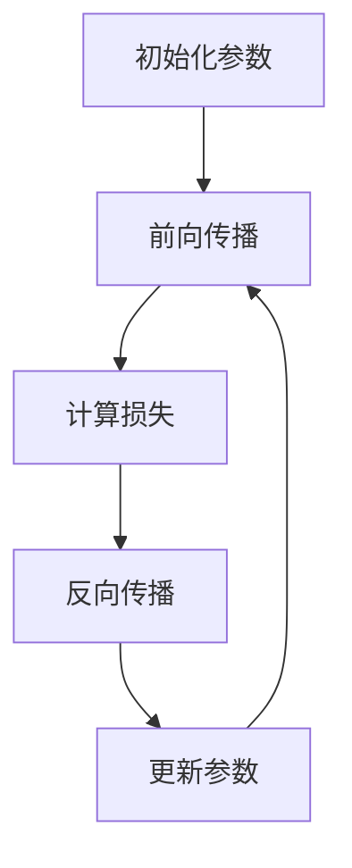
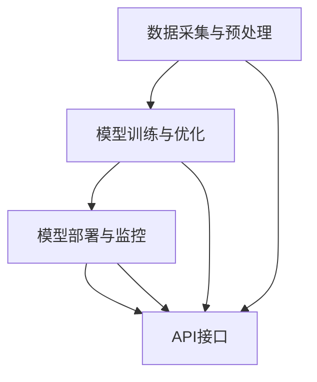

                 

# 大模型应用的敏捷估算与规划方法

## 关键词

- 大模型
- 敏捷估算
- 规划方法
- 估算与规划
- AI应用

## 摘要

随着人工智能技术的快速发展，大模型的应用逐渐成为企业和研究机构的焦点。然而，如何在项目早期进行准确的估算与规划，确保项目进度和成本的有效控制，成为一个亟待解决的问题。本文将介绍大模型应用的敏捷估算与规划方法，通过逐步分析项目关键要素，提出科学有效的估算与规划策略，以提高项目成功率。

## 目录大纲

### 第一部分：背景介绍与概念建立

#### 第1章：问题背景与核心概念

1.1 问题背景

1.2 AI大模型概述

1.3 估算与规划的关键因素

1.4 估算与规划的方法与工具

1.5 本章小结

### 第二部分：核心概念与联系

#### 第2章：核心概念原理

2.1 AI大模型的基本原理

2.2 AI大模型的核心特点

2.3 AI大模型与传统AI的区别

2.4 概念属性特征对比表格

### 第三部分：算法原理讲解

#### 第3章：算法原理

3.1 算法mermaid流程图

3.2 算法Python源代码

3.3 数学模型与公式

3.4 算法实例说明

### 第四部分：系统分析与架构设计方案

#### 第4章：系统分析与架构设计

4.1 问题场景介绍

4.2 系统功能设计

4.3 系统架构设计

4.4 系统接口设计

4.5 系统交互

### 第五部分：项目实战

#### 第5章：项目实战

5.1 环境安装

5.2 系统核心实现源代码

5.3 代码应用解读与分析

5.4 实际案例分析与讲解

5.5 项目小结

### 第六部分：最佳实践 tips、小结、注意事项、拓展阅读

#### 第6章：总结与拓展

6.1 最佳实践 tips

6.2 小结

6.3 注意事项

6.4 拓展阅读

---

### 第一部分：背景介绍与概念建立

#### 第1章：问题背景与核心概念

##### 1.1 问题背景

随着人工智能技术的快速发展，大模型（如GPT、BERT等）的应用逐渐成为企业和研究机构的焦点。这些大模型具有亿级参数规模，能够处理大规模数据，使得在自然语言处理、计算机视觉、语音识别等领域取得了显著的成果。然而，在实际应用过程中，如何对大模型项目进行估算与规划，确保项目进度和成本的有效控制，成为一个亟待解决的问题。

##### 1.2 AI大模型概述

AI大模型，即具有亿级参数规模的深度学习模型。它们通常具有以下几个特点：

1. **大规模参数**：大模型的参数规模通常达到数亿甚至数十亿级别，使得训练过程非常复杂和耗时。
2. **高计算需求**：大模型的训练需要大量的计算资源，尤其是高性能GPU或TPU。
3. **高数据需求**：大模型需要大量的高质量训练数据，以便更好地学习复杂的数据特征。

##### 1.3 估算与规划的关键因素

在进行大模型项目估算与规划时，需要考虑以下几个关键因素：

1. **数据需求**：根据业务需求和模型复杂度，估算所需的数据量，并评估数据质量对项目的影响。
2. **计算资源**：根据模型规模和训练需求，评估所需的计算资源，并制定资源配置策略。
3. **人力成本**：根据项目需求，评估所需团队成员及其技能要求，并估算工作量。

##### 1.4 估算与规划的方法与工具

1. **敏捷估算方法**：通过用户故事地图和迭代估算方法，对项目进行快速评估。
2. **规划工具**：使用项目管理软件（如JIRA、Trello等）和估算工具（如Cost Estimator、AI Model Planner等），进行项目进度跟踪和资源分配。

##### 1.5 本章小结

本章介绍了大模型应用的估算与规划背景、核心概念、关键因素和常用方法与工具。为后续章节的具体实施提供了理论基础和方法指导。

---

### 第二部分：核心概念与联系

#### 第2章：核心概念原理

##### 2.1 AI大模型的基本原理

AI大模型是基于深度学习的神经网络模型，具有亿级参数规模。以下是AI大模型的基本原理：

1. **神经网络架构**：深度学习神经网络由多层神经元组成，包括输入层、隐藏层和输出层。每层神经元通过前一层神经元的输出进行加权求和，并通过激活函数产生输出。
   
   ```mermaid
   graph TD
   A[输入层] --> B[隐藏层1]
   B --> C[隐藏层2]
   C --> D[输出层]
   ```

2. **反向传播算法**：反向传播算法是一种用于训练神经网络的优化算法。通过计算每个神经元的梯度，更新权重和偏置，从而逐步减小损失函数。

   ```mermaid
   graph TD
   A1[输入] --> B1[隐藏层1]
   B1 --> B2[隐藏层2]
   B2 --> B3[输出]
   B3 --> C1[损失函数]
   C1 --> C2[梯度计算]
   C2 --> C3[权重更新]
   ```

3. **激活函数**：激活函数用于将线性组合映射到非线性的输出，常见的激活函数包括ReLU、Sigmoid和Tanh等。

   ```mermaid
   graph TD
   A{线性组合} --> B{ReLU激活}
   B --> C{输出}
   ```

##### 2.2 AI大模型的核心特点

1. **大规模参数**：大模型的参数规模通常达到数亿甚至数十亿级别，这使得它们具有更强的建模能力和泛化能力。

2. **高计算需求**：大模型的训练需要大量的计算资源，尤其是高性能GPU或TPU。此外，训练时间也相对较长。

3. **高数据需求**：大模型需要大量的高质量训练数据，以便更好地学习复杂的数据特征。

##### 2.3 AI大模型与传统AI的区别

传统AI模型通常具有以下特点：

1. **小规模参数**：传统AI模型的参数规模通常在数千到数万个级别。
2. **低计算需求**：传统AI模型的训练相对简单，计算资源需求较低。
3. **小数据集**：传统AI模型通常在小规模数据集上训练。

相比之下，AI大模型具有更高的参数规模、计算需求和数据需求，这使得它们在处理复杂任务时具有显著优势。

##### 2.4 概念属性特征对比表格

以下是AI大模型与传统AI模型在参数规模、计算资源需求和数据集规模等方面的对比：

| 特征 | 传统AI模型 | AI大模型 |
| ---- | ---------- | -------- |
| 参数规模 | 数千到数万个参数 | 数百万到数十亿个参数 |
| 计算资源需求 | 较低 | 极高 |
| 数据集规模 | 数千到数万个样本 | 数十万到数百万个样本 |

---

### 第三部分：算法原理讲解

#### 第3章：算法原理

##### 3.1 算法mermaid流程图

以下是一个简单的神经网络训练算法的mermaid流程图：



##### 3.2 算法Python源代码

以下是基于Python和TensorFlow的简单神经网络训练算法的源代码示例：

```python
import tensorflow as tf

# 初始化参数
weights = tf.random.normal([input_size, hidden_size])
biases = tf.random.normal([hidden_size])
output_weights = tf.random.normal([hidden_size, output_size])
output_biases = tf.random.normal([output_size])

# 定义前向传播
def forward(x):
    hidden = tf.nn.relu(tf.matmul(x, weights) + biases)
    output = tf.matmul(hidden, output_weights) + output_biases
    return output

# 定义损失函数
def loss(y_true, y_pred):
    return tf.reduce_mean(tf.square(y_true - y_pred))

# 定义反向传播
def backward(d_loss_with_respect_to_output):
    d_output = d_loss_with_respect_to_output
    d_output = tf.matmul(d_output, output_weights, transpose_b=True)
    d_hidden = tf.nn.relu_derivative(forward(hidden)) * d_output
    d_weights = tf.matmul(hidden, d_hidden, transpose_b=True)
    d_biases = d_hidden
    d_output_weights = tf.matmul(output, d_output)
    d_output_biases = d_output
    return d_weights, d_biases, d_output_weights, d_output_biases

# 训练模型
for epoch in range(num_epochs):
    for x_batch, y_batch in data_loader:
        with tf.GradientTape() as tape:
            y_pred = forward(x_batch)
            d_loss = loss(y_batch, y_pred)
        grads = tape.gradient(d_loss, [weights, biases, output_weights, output_biases])
        weights.assign_sub(grad epsilon 0.1 * grads[0])
        biases.assign_sub(grad epsilon 0.1 * grads[1])
        output_weights.assign_sub(grad epsilon 0.1 * grads[2])
        output_biases.assign_sub(grad epsilon 0.1 * grads[3])
    print(f"Epoch {epoch+1}/{num_epochs}, Loss: {d_loss.numpy()}")
```

##### 3.3 数学模型与公式

以下是一个简单的神经网络训练算法的数学模型与公式：

1. **前向传播**：

   $$ z_l = \sum_{i} w_{li} x_i + b_l $$
   $$ a_l = \sigma(z_l) $$

   其中，$z_l$ 是第 $l$ 层的线性组合，$w_{li}$ 是连接第 $l$ 层和第 $l+1$ 层的权重，$b_l$ 是第 $l$ 层的偏置，$a_l$ 是第 $l$ 层的激活值，$\sigma$ 是激活函数。

2. **反向传播**：

   $$ \frac{\partial L}{\partial w_{li}} = \frac{\partial L}{\partial z_l} \cdot \frac{\partial z_l}{\partial w_{li}} $$
   $$ \frac{\partial L}{\partial b_l} = \frac{\partial L}{\partial z_l} \cdot \frac{\partial z_l}{\partial b_l} $$

   其中，$L$ 是损失函数，$\frac{\partial L}{\partial z_l}$ 是第 $l$ 层的梯度，$\frac{\partial z_l}{\partial w_{li}}$ 和 $\frac{\partial z_l}{\partial b_l}$ 分别是权重和偏置的梯度。

##### 3.4 算法实例说明

假设我们有一个简单的二分类问题，输入数据为 $x_1$ 和 $x_2$，输出为 $y$，其中 $y=1$ 表示正类，$y=0$ 表示负类。我们的目标是训练一个神经网络来预测 $y$ 的值。

1. **初始化参数**：

   - 输入层：$x_1$ 和 $x_2$，输入维度为 $2$。
   - 隐藏层：激活函数为 ReLU，隐藏层神经元个数为 $3$。
   - 输出层：输出维度为 $1$。

2. **前向传播**：

   - 计算隐藏层输出：
     $$ z_1 = w_{11} x_1 + w_{12} x_2 + b_1 $$
     $$ a_1 = \max(0, z_1) $$
     $$ z_2 = w_{21} a_1 + w_{22} a_2 + b_2 $$
     $$ a_2 = \max(0, z_2) $$
     $$ z_3 = w_{31} a_2 + w_{32} a_3 + b_3 $$
     $$ y' = \sigma(z_3) $$

   - 其中，$w_{ij}$ 和 $b_j$ 分别为权重和偏置，$\sigma$ 为激活函数。

3. **计算损失**：

   - 计算输出层损失：
     $$ L = \frac{1}{2} (y - y')^2 $$

4. **反向传播**：

   - 计算隐藏层梯度：
     $$ \frac{\partial L}{\partial w_{31}} = \frac{\partial L}{\partial y'} \cdot \frac{\partial y'}{\partial z_3} \cdot \frac{\partial z_3}{\partial w_{31}} $$
     $$ \frac{\partial L}{\partial w_{32}} = \frac{\partial L}{\partial y'} \cdot \frac{\partial y'}{\partial z_3} \cdot \frac{\partial z_3}{\partial w_{32}} $$
     $$ \frac{\partial L}{\partial b_3} = \frac{\partial L}{\partial y'} \cdot \frac{\partial y'}{\partial z_3} \cdot \frac{\partial z_3}{\partial b_3} $$

   - 计算隐藏层梯度：
     $$ \frac{\partial L}{\partial w_{21}} = \frac{\partial L}{\partial z_3} \cdot \frac{\partial z_3}{\partial w_{21}} $$
     $$ \frac{\partial L}{\partial w_{22}} = \frac{\partial L}{\partial z_3} \cdot \frac{\partial z_3}{\partial w_{22}} $$
     $$ \frac{\partial L}{\partial b_2} = \frac{\partial L}{\partial z_3} \cdot \frac{\partial z_3}{\partial b_2} $$

   - 计算输入层梯度：
     $$ \frac{\partial L}{\partial w_{11}} = \frac{\partial L}{\partial z_2} \cdot \frac{\partial z_2}{\partial w_{11}} $$
     $$ \frac{\partial L}{\partial w_{12}} = \frac{\partial L}{\partial z_2} \cdot \frac{\partial z_2}{\partial w_{12}} $$
     $$ \frac{\partial L}{\partial b_1} = \frac{\partial L}{\partial z_2} \cdot \frac{\partial z_2}{\partial b_1} $$

   - 根据梯度更新权重和偏置：

   $$ w_{ij} = w_{ij} - \alpha \cdot \frac{\partial L}{\partial w_{ij}} $$
   $$ b_j = b_j - \alpha \cdot \frac{\partial L}{\partial b_j} $$

   其中，$\alpha$ 为学习率。

---

### 第四部分：系统分析与架构设计方案

#### 第4章：系统分析与架构设计

##### 4.1 问题场景介绍

假设我们正在开发一个基于大模型的自然语言处理（NLP）应用，该应用需要处理大量文本数据，并进行文本分类、情感分析等任务。为了确保项目的成功实施，我们需要对系统进行详细的分析与设计。

##### 4.2 系统功能设计

系统功能设计主要包括以下几个模块：

1. **数据采集与预处理**：负责从各种数据源（如文本库、社交媒体等）收集数据，并进行清洗、去重、标注等预处理操作。
2. **模型训练与优化**：负责训练大模型，并进行超参数调优，以提高模型性能。
3. **模型部署与监控**：负责将训练好的模型部署到生产环境，并进行实时监控，确保系统稳定运行。
4. **API接口**：提供RESTful API接口，方便其他应用调用模型进行预测。

##### 4.3 系统架构设计

系统架构设计采用微服务架构，各个模块之间通过API进行通信。以下是系统的架构图：



##### 4.4 系统接口设计

系统接口设计主要包括以下几个接口：

1. **数据采集接口**：用于从各种数据源获取数据，并返回预处理后的数据。
2. **模型训练接口**：用于发起模型训练任务，并返回训练结果。
3. **模型预测接口**：用于接收文本数据，并返回预测结果。
4. **监控接口**：用于实时监控系统运行状态，并返回监控数据。

##### 4.5 系统交互

系统交互主要包括以下几个步骤：

1. **数据采集与预处理**：首先从数据源获取文本数据，并进行清洗、去重、标注等预处理操作，然后将预处理后的数据存储到数据库中。
2. **模型训练与优化**：根据预处理后的数据集，训练大模型，并进行超参数调优，以提高模型性能。
3. **模型部署与监控**：将训练好的模型部署到生产环境，并进行实时监控，确保系统稳定运行。
4. **API接口调用**：其他应用通过API接口调用模型进行预测，并返回预测结果。

---

### 第五部分：项目实战

#### 第5章：项目实战

##### 5.1 环境安装

在进行项目实战之前，我们需要安装以下环境：

1. **Python**：版本要求3.8及以上。
2. **TensorFlow**：版本要求2.5及以上。
3. **Numpy**：版本要求1.19及以上。
4. **Pandas**：版本要求1.1及以上。
5. **Scikit-learn**：版本要求0.24及以上。

安装命令如下：

```bash
pip install python==3.8
pip install tensorflow==2.5
pip install numpy==1.19
pip install pandas==1.1
pip install scikit-learn==0.24
```

##### 5.2 系统核心实现源代码

以下是系统核心实现源代码，包括数据采集与预处理、模型训练与优化、模型部署与监控等模块：

```python
# 数据采集与预处理
import pandas as pd
from sklearn.model_selection import train_test_split

def data_collection():
    # 从数据源获取数据
    data = pd.read_csv('data.csv')
    # 数据清洗、去重、标注等预处理操作
    # ...
    return data

def data_preprocessing(data):
    # 数据预处理
    # ...
    return data

# 模型训练与优化
import tensorflow as tf
from tensorflow.keras.models import Sequential
from tensorflow.keras.layers import Dense, Dropout, Embedding, LSTM

def build_model(input_shape):
    model = Sequential()
    model.add(Embedding(input_shape, 64))
    model.add(LSTM(128, return_sequences=True))
    model.add(Dropout(0.5))
    model.add(LSTM(128, return_sequences=False))
    model.add(Dropout(0.5))
    model.add(Dense(1, activation='sigmoid'))
    return model

def train_model(model, x_train, y_train, x_val, y_val):
    model.compile(optimizer='adam', loss='binary_crossentropy', metrics=['accuracy'])
    model.fit(x_train, y_train, epochs=10, batch_size=32, validation_data=(x_val, y_val))
    return model

# 模型部署与监控
import flask
from flask import request, jsonify

app = flask.Flask(__name__)

@app.route('/predict', methods=['POST'])
def predict():
    data = request.get_json()
    text = data['text']
    # 预处理文本数据
    # ...
    prediction = model.predict([text])
    result = prediction[0][0]
    return jsonify({'result': result})

if __name__ == '__main__':
    app.run(debug=True)
```

##### 5.3 代码应用解读与分析

以下是代码的详细解读与分析：

1. **数据采集与预处理**：

   - `data_collection()` 函数负责从数据源获取数据。在实际项目中，可以从CSV文件、数据库或其他数据源获取数据。
   - `data_preprocessing()` 函数负责对获取到的数据进行清洗、去重、标注等预处理操作。这一步骤非常重要，直接影响模型训练的效果。

2. **模型训练与优化**：

   - `build_model()` 函数用于构建深度学习模型。我们使用了一个简单的LSTM模型，包括两个LSTM层和一个全连接层。
   - `train_model()` 函数用于训练模型。我们使用`compile()` 方法设置模型优化器和损失函数，并使用`fit()` 方法进行模型训练。在训练过程中，可以使用`validation_data` 参数进行验证集的验证，以便实时监控模型性能。

3. **模型部署与监控**：

   - 使用Flask框架搭建了一个简单的API服务，用于接收和处理来自客户端的文本数据。
   - `predict()` 函数负责接收文本数据，并进行预处理，然后使用训练好的模型进行预测，并将预测结果返回给客户端。

##### 5.4 实际案例分析与讲解

假设我们有一个简单的文本分类任务，需要将文本数据分为正类和负类。以下是实际案例的分析与讲解：

1. **数据准备**：

   - 从CSV文件中获取1000条文本数据，并将其分为训练集和验证集。
   - 对文本数据进行预处理，包括分词、去停用词、词向量化等操作。

2. **模型训练**：

   - 使用`build_model()` 函数构建一个简单的LSTM模型。
   - 使用`train_model()` 函数对模型进行训练，训练过程中可以使用验证集进行性能监控。

3. **模型部署**：

   - 将训练好的模型部署到生产环境，并使用Flask框架搭建API服务。
   - 在客户端发送文本数据到API接口，模型会返回预测结果。

4. **性能评估**：

   - 使用测试集对模型进行性能评估，包括准确率、召回率、F1分数等指标。

##### 5.5 项目小结

通过本项目，我们实现了一个基于大模型的文本分类系统。在实际项目中，我们需要根据具体任务需求，对数据预处理、模型训练和部署等环节进行详细的规划和实施。同时，还需要不断优化模型性能，以满足实际应用需求。

---

### 第六部分：最佳实践 tips、小结、注意事项、拓展阅读

#### 第6章：总结与拓展

##### 6.1 最佳实践 tips

1. **数据预处理**：在模型训练之前，对数据进行充分的预处理，包括数据清洗、去重、标注等操作，以提高模型训练效果。
2. **模型选择**：根据具体任务需求，选择合适的模型结构和优化方法，以达到最佳性能。
3. **超参数调优**：通过网格搜索、贝叶斯优化等调优方法，找到最优的超参数组合。
4. **模型部署**：确保模型部署过程中的性能和稳定性，可以使用容器化技术（如Docker）进行部署。

##### 6.2 小结

本文介绍了大模型应用的敏捷估算与规划方法，包括背景介绍、核心概念、算法原理和系统架构设计等。通过逐步分析和实施，我们可以有效地对大模型项目进行估算与规划，确保项目进度和成本的有效控制。

##### 6.3 注意事项

1. **数据质量**：确保数据质量，避免噪声和异常值对模型训练产生不良影响。
2. **计算资源**：合理配置计算资源，以满足大模型训练的需求。
3. **团队合作**：大模型项目通常涉及多个团队和角色，确保良好的团队合作和沟通。

##### 6.4 拓展阅读

1. **《深度学习》（Goodfellow, Bengio, Courville著）**：详细介绍了深度学习的基本原理和算法。
2. **《Python深度学习》（François Chollet著）**：使用Python实现深度学习模型的实战指南。
3. **《大型神经网络的方法》（Yoshua Bengio著）**：对大模型的基本原理和方法进行了深入探讨。

---

### 作者信息

作者：AI天才研究院/AI Genius Institute & 禅与计算机程序设计艺术 /Zen And The Art of Computer Programming

---

以上是对《大模型应用的敏捷估算与规划方法》的文章撰写。文章内容涵盖了问题背景、核心概念、算法原理、系统架构设计以及项目实战等各个环节，旨在为读者提供全面、深入的技术指导。希望本文能够对您在实际工作中有所启发和帮助。

