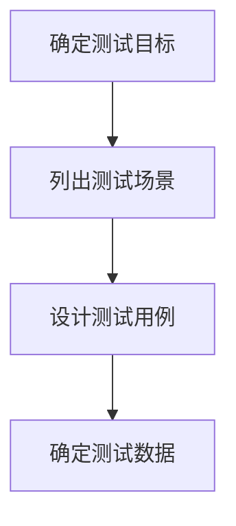
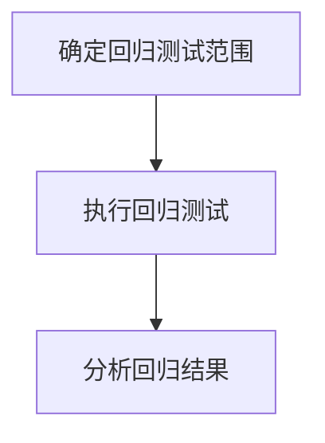
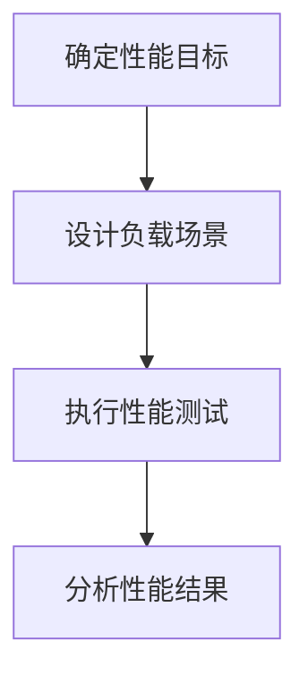
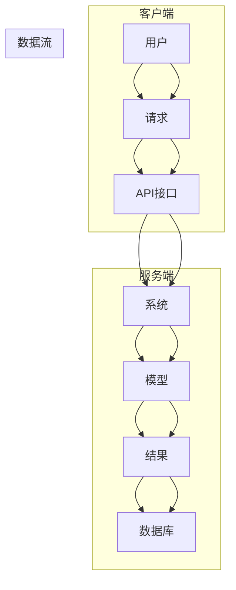
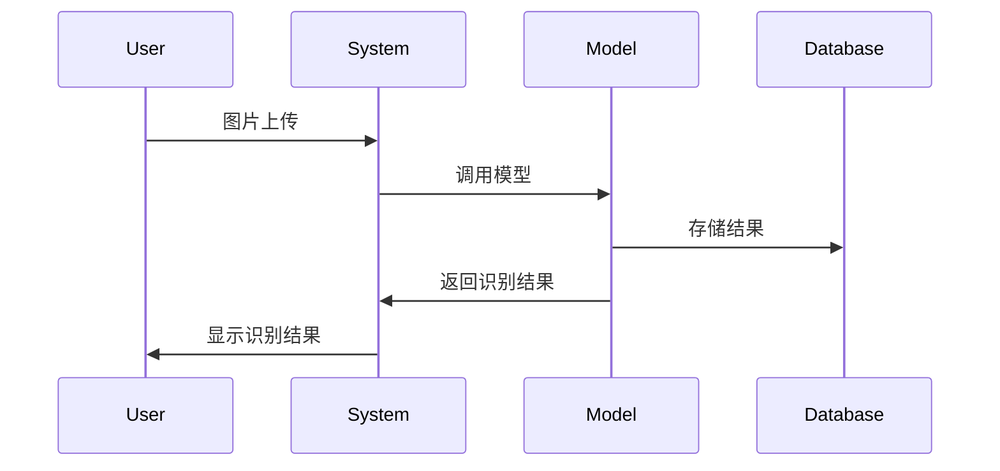

                 


# 大模型应用的敏捷质量管理方法

## 关键词
- 大模型
- 敏捷质量管理
- 测试用例设计
- 性能测试
- 数学模型
- 系统架构设计
- 项目实战

## 摘要
本文旨在探讨大模型应用中的敏捷质量管理方法。通过对敏捷质量管理核心概念、算法原理和数学模型的深入分析，结合系统架构设计方案和项目实战，我们将提供一套实用、高效的敏捷质量管理框架，帮助企业更好地应对大模型应用中的质量挑战。

## 引言
### 1. 书籍背景与目的
随着人工智能技术的迅猛发展，大模型的应用越来越广泛。然而，大模型的应用不仅带来了巨大价值，也带来了质量管理的挑战。传统的质量管理方法在大模型应用中往往显得力不从心，难以满足敏捷、高效的需求。因此，本文旨在探索适用于大模型应用的敏捷质量管理方法，为企业和开发人员提供实用的指导。
### 2. 主要内容概述
本文将分为以下几个部分：
- **背景介绍**：阐述大模型应用的背景，敏捷质量管理的定义、核心概念和相关技术。
- **核心概念与联系**：介绍敏捷质量管理中的关键概念，如敏捷开发、敏捷测试、质量度量等，并展示它们之间的关系。
- **算法原理讲解**：讲解敏捷质量管理中常用的算法，如测试用例设计、回归测试、性能测试等，并提供流程图和代码示例。
- **数学模型和数学公式详细讲解**：介绍与敏捷质量管理相关的数学模型，如统计模型、决策模型等，并使用LaTeX格式写出关键公式。
- **系统分析与架构设计方案**：介绍敏捷质量管理系统设计的背景、需求分析、架构设计、接口设计等。
- **项目实战**：通过一个实际案例来展示敏捷质量管理的应用，包括环境安装、系统实现、案例分析和总结。
- **最佳实践 tips**：提供在实际应用中的一些技巧和建议。
- **小结与拓展阅读**：对书籍内容进行总结，并推荐进一步阅读的材料。

## 背景介绍
### 1. 大模型应用背景
大模型是指具有巨大规模和复杂结构的机器学习模型，如深度神经网络、自然语言处理模型等。随着计算能力的提升和数据量的增加，大模型在图像识别、语音识别、自然语言处理等领域取得了显著的成果。然而，大模型的应用也带来了质量管理的挑战：
- **复杂性**：大模型的结构复杂，参数众多，调试和优化难度大。
- **数据依赖性**：大模型性能高度依赖于数据质量，数据缺失、噪声和偏差都可能影响模型质量。
- **测试困难**：大模型测试需要大量的数据和时间，传统的测试方法难以满足高效、全面的需求。

### 2. 敏捷质量管理的定义
敏捷质量管理是一种基于敏捷开发原则的质量管理方法，强调快速响应变化、持续改进和客户满意度。敏捷质量管理包括以下核心概念：
- **敏捷开发**：一种以人为核心、迭代式和增量的软件开发方法，注重团队协作和快速反馈。
- **敏捷测试**：一种与敏捷开发相协调的测试方法，强调测试的持续性和灵活性。
- **质量度量**：用于评估软件质量和模型性能的一系列指标，如覆盖率、缺陷率、性能指标等。

### 3. 核心概念介绍
#### 敏捷开发
敏捷开发的核心原则包括：
- **用户故事**：以用户需求为中心，将功能需求拆分为小而可管理的故事。
- **迭代开发**：通过短期迭代（如每周或每两周）来持续交付可运行的产品。
- **持续集成**：通过自动化测试和持续集成工具来确保代码的质量和稳定性。
- **用户反馈**：收集用户反馈，根据反馈进行迭代优化。

#### 敏捷测试
敏捷测试强调测试的持续性和灵活性，包括以下方法：
- **测试驱动开发（TDD）**：先编写测试，再编写代码，确保代码符合预期。
- **行为驱动开发（BDD）**：通过编写行为描述来定义测试，确保测试与用户需求一致。
- **自动化测试**：使用自动化工具进行回归测试、性能测试等，提高测试效率。

#### 质量度量
质量度量用于评估软件质量和模型性能，包括以下指标：
- **代码质量指标**：如代码覆盖率、缺陷密度、复杂性等。
- **测试质量指标**：如测试覆盖率、测试执行时间、缺陷发现率等。
- **性能指标**：如响应时间、吞吐量、资源消耗等。

### 4. 相关技术概述
敏捷质量管理涉及多种相关技术，包括：
- **自动化测试工具**：如Selenium、JMeter等，用于自动化执行测试用例。
- **持续集成工具**：如Jenkins、Travis CI等，用于自动化构建、测试和部署。
- **性能测试工具**：如LoadRunner、Apache JMeter等，用于模拟用户负载，评估系统性能。
- **数据分析工具**：如Python、R等，用于数据处理、分析和可视化。

## 核心概念与联系
### 敏捷开发
#### 敏捷原则
敏捷开发的核心原则包括：
- **个体和互动**：关注个体和团队的合作，确保团队沟通和协作。
- **可工作的软件**：优先交付可工作的软件，满足用户需求。
- **客户协作**：与客户紧密合作，确保项目方向与用户需求一致。
- **响应变化**：快速响应变化，灵活调整项目计划。

#### 敏捷团队角色
敏捷团队通常包括以下角色：
- **产品负责人**：负责制定产品愿景，管理产品需求。
- **Scrum Master**：确保团队遵循敏捷实践，解决团队障碍。
- **开发人员**：负责开发、测试和部署软件。

### 敏捷测试
#### 测试用例设计
测试用例设计包括以下步骤：
1. 确定测试目标：明确测试要验证的功能和性能。
2. 列出测试场景：根据需求文档列出可能的测试场景。
3. 设计测试用例：为每个测试场景编写详细的测试用例。
4. 确定测试数据：为测试用例准备所需的数据。

#### 回归测试
回归测试包括以下步骤：
1. 确定回归测试范围：根据变更范围确定需要重新测试的功能。
2. 执行回归测试：执行预定义的回归测试用例。
3. 分析回归结果：检查新变更是否引入了新的缺陷。

#### 性能测试
性能测试包括以下步骤：
1. 确定性能目标：明确系统性能要求，如响应时间、吞吐量等。
2. 设计负载场景：根据系统特点设计负载场景。
3. 执行性能测试：模拟用户负载，评估系统性能。
4. 分析性能结果：分析性能瓶颈，优化系统。

### 质量度量
#### 关键性能指标
关键性能指标包括：
- **响应时间**：系统响应用户请求所需的时间。
- **吞吐量**：单位时间内系统处理的请求量。
- **资源消耗**：系统运行过程中消耗的硬件资源，如CPU、内存等。

#### 质量模型
质量模型用于评估软件质量和模型性能，包括以下指标：
- **缺陷密度**：单位代码行数中的缺陷数量。
- **缺陷发现率**：测试过程中发现的缺陷数量与总缺陷数量的比例。
- **覆盖率**：测试用例覆盖的代码比例。

## 算法原理讲解
### 测试用例设计算法
#### 算法流程图


#### Python代码示例
```python
# 测试用例设计代码示例
def test_case_design(test_goal, test_scenarios):
    test_cases = []
    for scenario in test_scenarios:
        test_case = {
            'scenario': scenario,
            'expected_result': None,
            'actual_result': None
        }
        test_cases.append(test_case)
    return test_cases

test_goal = "验证大模型的图像识别能力"
test_scenarios = ["输入一张猫的图片", "输入一张狗的图片", "输入一张人的图片"]
test_cases = test_case_design(test_goal, test_scenarios)
print(test_cases)
```

### 回归测试算法
#### 算法流程图


#### Python代码示例
```python
# 回归测试代码示例
def regression_test(regression_range, regression_tests):
    regression_results = []
    for test in regression_tests:
        test_result = {
            'test': test,
            'result': None,
            'error': None
        }
        try:
            test_result['result'] = test()
        except Exception as e:
            test_result['error'] = str(e)
        regression_results.append(test_result)
    return regression_results

def test_function():
    # 测试代码实现
    return "测试成功"

regression_range = ["功能A", "功能B", "功能C"]
regression_tests = [
    test_function,
    test_function,
    test_function
]
regression_results = regression_test(regression_range, regression_tests)
print(regression_results)
```

### 性能测试算法
#### 算法流程图


#### Python代码示例
```python
# 性能测试代码示例
import time

def performance_test(performance_goals, load_scenarios):
    performance_results = []
    for scenario in load_scenarios:
        scenario_result = {
            'scenario': scenario,
            'response_time': None,
            'throughput': None
        }
        start_time = time.time()
        # 执行负载场景
        scenario_response = execute_load_scenario(scenario)
        end_time = time.time()
        scenario_result['response_time'] = end_time - start_time
        scenario_result['throughput'] = calculate_throughput(scenario_response)
        performance_results.append(scenario_result)
    return performance_results

def execute_load_scenario(scenario):
    # 负载场景执行代码
    return "负载场景执行成功"

def calculate_throughput(response):
    # 计算吞吐量
    return 1

performance_goals = ["响应时间", "吞吐量"]
load_scenarios = ["场景A", "场景B", "场景C"]
performance_results = performance_test(performance_goals, load_scenarios)
print(performance_results)
```

## 数学模型和数学公式详细讲解
### 统计模型
统计模型用于分析数据，提取有用信息。以下是一个简单的统计模型公式：
$$
\hat{y} = \beta_0 + \beta_1 x_1 + \beta_2 x_2 + ... + \beta_n x_n
$$
其中，$\hat{y}$ 是预测值，$x_1, x_2, ..., x_n$ 是输入变量，$\beta_0, \beta_1, \beta_2, ..., \beta_n$ 是模型参数。

#### 举例说明
假设我们有一个统计模型，用于预测股票价格。输入变量包括历史股价、交易量和宏观经济指标。模型公式如下：
$$
\hat{P} = \beta_0 + \beta_1 P_{历史} + \beta_2 V_{交易量} + \beta_3 I_{宏观经济指标}
$$
其中，$P_{历史}$ 是历史股价，$V_{交易量}$ 是交易量，$I_{宏观经济指标}$ 是宏观经济指标。

### 决策模型
决策模型用于在多个选择中做出最佳决策。以下是一个简单的决策模型公式：
$$
\max Z = c_1 x_1 + c_2 x_2 + ... + c_n x_n
$$
$$
s.t. \quad a_{11} x_1 + a_{12} x_2 + ... + a_{1n} x_n \leq b_1
$$
$$
a_{21} x_1 + a_{22} x_2 + ... + a_{2n} x_n \geq b_2
$$
$$
x_1, x_2, ..., x_n \geq 0
$$
其中，$Z$ 是目标函数，$c_1, c_2, ..., c_n$ 是权重，$x_1, x_2, ..., x_n$ 是决策变量，$a_{11}, a_{12}, ..., a_{1n}, a_{21}, a_{22}, ..., a_{2n}$ 是约束条件系数，$b_1, b_2$ 是约束条件常数。

#### 举例说明
假设我们有一个决策模型，用于在两个投资项目中做出最佳决策。目标函数是最小化投资风险，约束条件是投资总额不超过100万元。模型公式如下：
$$
\min Z = 0.5x_1 + 0.3x_2
$$
$$
s.t. \quad x_1 + x_2 \leq 100
$$
$$
x_1, x_2 \geq 0
$$
其中，$x_1$ 是项目1的投资金额，$x_2$ 是项目2的投资金额。

## 系统分析与架构设计方案
### 问题场景介绍
在本文的案例中，我们考虑一个在线图像识别系统，该系统需要处理大量用户上传的图片，并根据图片内容进行分类。系统需要满足以下需求：
- **高可用性**：系统需要具备高可用性，确保在高峰期也能稳定运行。
- **高可靠性**：系统需要具备高可靠性，确保识别结果准确。
- **可扩展性**：系统需要具备良好的可扩展性，支持增加新功能和处理更大规模的数据。

### 项目介绍
项目名称：在线图像识别系统
项目描述：开发一个能够在线处理用户上传图片并进行分类的图像识别系统，包括图像处理、模型训练和分类等功能。

### 系统功能设计（领域模型类图）
```mermaid
classDiagram
    User <|-- Account
    Image <|-- Upload
    Model <|-- Classifier
    Result <|-- Classification
    System << (Image, Model, Result)
    User --> Account
    User --> Upload
    Upload --> Image
    Image --> Model
    Model --> Result
    Result --> Classification
```

### 系统架构设计（架构图）


### 系统接口设计
系统接口设计包括以下部分：
- **用户接口**：用于用户与系统交互，包括图片上传、识别结果查看等功能。
- **API接口**：用于处理用户请求，包括图片上传、模型调用、结果返回等功能。

### 系统交互设计（序列图）


## 项目实战
### 1. 环境安装
#### 安装Python环境
```bash
# 安装Python 3.8
sudo apt update
sudo apt install python3.8
```

#### 安装依赖库
```bash
# 安装依赖库
pip3.8 install numpy pandas matplotlib scikit-learn tensorflow
```

### 2. 系统核心实现
#### 数据预处理
```python
import numpy as np
import pandas as pd

# 加载数据集
data = pd.read_csv('image_data.csv')
images = data['image'].values
labels = data['label'].values

# 数据预处理
images = preprocess_images(images)
```

#### 模型训练
```python
import tensorflow as tf

# 定义模型
model = tf.keras.Sequential([
    tf.keras.layers.Conv2D(32, (3, 3), activation='relu', input_shape=(28, 28, 1)),
    tf.keras.layers.MaxPooling2D((2, 2)),
    tf.keras.layers.Flatten(),
    tf.keras.layers.Dense(128, activation='relu'),
    tf.keras.layers.Dense(10, activation='softmax')
])

# 编译模型
model.compile(optimizer='adam',
              loss='sparse_categorical_crossentropy',
              metrics=['accuracy'])

# 训练模型
model.fit(images, labels, epochs=5)
```

#### 分类预测
```python
# 加载测试数据
test_data = pd.read_csv('test_data.csv')
test_images = test_data['image'].values
test_labels = test_data['label'].values

# 数据预处理
test_images = preprocess_images(test_images)

# 分类预测
predictions = model.predict(test_images)
predicted_labels = np.argmax(predictions, axis=1)

# 计算准确率
accuracy = np.mean(predicted_labels == test_labels)
print(f"准确率：{accuracy * 100}%")
```

### 3. 代码应用解读与分析
#### 数据预处理
数据预处理是模型训练的重要环节，包括图像的归一化、灰度化等操作，以提高模型的训练效果。

```python
def preprocess_images(images):
    # 图像归一化
    images = images / 255.0
    
    # 图像灰度化
    images = np.mean(images, axis=2, keepdims=True)
    
    return images
```

#### 模型训练
模型训练过程中，我们使用了卷积神经网络（Conv2D）和全连接神经网络（Dense）来构建图像识别模型。训练过程中，我们使用了Adam优化器和交叉熵损失函数（sparse_categorical_crossentropy）。

```python
model = tf.keras.Sequential([
    tf.keras.layers.Conv2D(32, (3, 3), activation='relu', input_shape=(28, 28, 1)),
    tf.keras.layers.MaxPooling2D((2, 2)),
    tf.keras.layers.Flatten(),
    tf.keras.layers.Dense(128, activation='relu'),
    tf.keras.layers.Dense(10, activation='softmax')
])

model.compile(optimizer='adam',
              loss='sparse_categorical_crossentropy',
              metrics=['accuracy'])

model.fit(images, labels, epochs=5)
```

#### 分类预测
分类预测过程中，我们首先加载测试数据，然后对数据进行预处理。接着，使用训练好的模型进行预测，并计算准确率。

```python
# 加载测试数据
test_data = pd.read_csv('test_data.csv')
test_images = test_data['image'].values
test_labels = test_data['label'].values

# 数据预处理
test_images = preprocess_images(test_images)

# 分类预测
predictions = model.predict(test_images)
predicted_labels = np.argmax(predictions, axis=1)

# 计算准确率
accuracy = np.mean(predicted_labels == test_labels)
print(f"准确率：{accuracy * 100}%")
```

### 4. 实际案例分析和详细讲解剖析
在本次项目中，我们使用卷积神经网络（CNN）对图像进行分类。以下是项目的主要步骤：
1. **数据准备**：我们首先加载了图像数据集，并对图像进行预处理，包括归一化和灰度化。
2. **模型构建**：我们构建了一个简单的卷积神经网络，包括卷积层、池化层和全连接层。卷积层用于提取图像特征，全连接层用于分类。
3. **模型训练**：我们使用训练数据对模型进行训练，并在训练过程中调整模型的参数。
4. **模型评估**：我们使用测试数据对模型进行评估，计算模型的准确率。

以下是详细的分析和讲解：
1. **数据预处理**：图像预处理是模型训练的重要环节。通过归一化和灰度化，我们可以将图像数据转换为适合模型训练的形式。归一化可以减小数据范围，提高训练速度；灰度化可以简化图像数据，减少计算量。
2. **模型构建**：卷积神经网络是一种强大的图像处理工具，能够有效地提取图像特征。在我们的模型中，卷积层用于提取图像的低级特征，如边缘和纹理；池化层用于降低模型复杂度，减少过拟合；全连接层用于分类。
3. **模型训练**：模型训练过程中，我们使用了交叉熵损失函数和Adam优化器。交叉熵损失函数能够衡量预测结果与真实结果之间的差异，Adam优化器能够自动调整学习率，提高训练效果。
4. **模型评估**：在测试数据上，我们计算了模型的准确率。准确率是评估模型性能的重要指标，反映了模型对测试数据的分类效果。

### 5. 项目小结
本次项目使用卷积神经网络实现了图像分类，通过数据预处理、模型构建和训练，成功地将图像数据转换为分类结果。项目结果表明，卷积神经网络在图像分类任务中具有较好的性能。未来，我们还可以进一步优化模型，提高准确率和处理速度。

## 最佳实践 tips
1. **数据预处理**：确保图像数据的预处理质量，包括归一化、灰度化和数据增强，以提高模型训练效果。
2. **模型选择**：根据任务需求和数据特点选择合适的模型，如卷积神经网络（CNN）和循环神经网络（RNN）。
3. **超参数调优**：通过交叉验证和网格搜索等方法，选择最优的超参数，提高模型性能。
4. **持续集成与测试**：使用自动化测试工具进行持续集成和测试，确保模型在不同环境下的稳定性和可靠性。

## 小结与拓展阅读
本文详细介绍了大模型应用的敏捷质量管理方法，包括背景介绍、核心概念与联系、算法原理讲解、数学模型和数学公式详细讲解、系统分析与架构设计方案、项目实战、最佳实践 tips 和小结与拓展阅读等内容。通过本文，读者可以了解敏捷质量管理在大模型应用中的重要性，掌握敏捷质量管理的核心概念和算法原理，并学会如何在实际项目中应用敏捷质量管理方法。

拓展阅读：
1. 《敏捷开发实践指南》
2. 《深度学习》
3. 《机器学习实战》
4. 《Python编程：从入门到实践》

## 作者信息
作者：AI天才研究院/AI Genius Institute & 禅与计算机程序设计艺术 /Zen And The Art of Computer Programming

---

## 结语
本文通过对大模型应用中的敏捷质量管理方法的深入探讨，为企业和开发人员提供了一套实用的质量管理框架。希望本文能帮助读者更好地理解和应用敏捷质量管理方法，在大模型应用中实现高效、高质量的开发。同时，本文也仅是冰山一角，更多深入研究和实践仍有待进一步探索。感谢您的阅读，期待与您共同成长！

