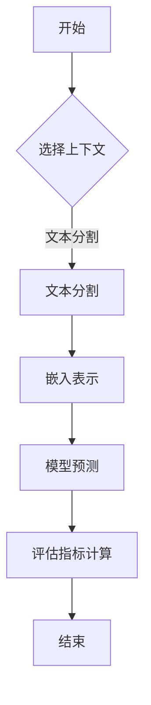
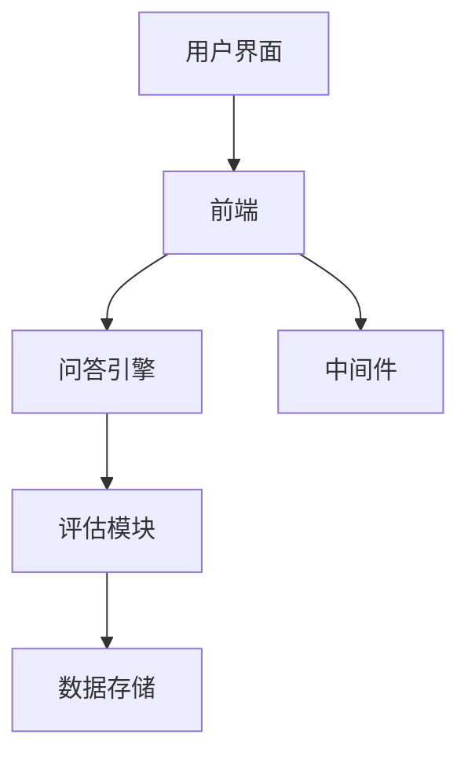
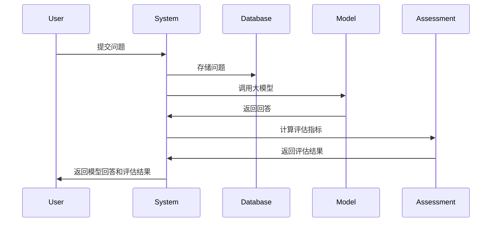

                 


### 大模型情境理解能力评估：LLM设计的上下文测试

#### 关键词：大模型、情境理解、上下文测试、评估方法、LLM

> 摘要：本文旨在探讨大模型情境理解能力的评估方法，重点关注上下文测试的设计与应用。通过深入分析上下文测试的原理和实施步骤，结合具体案例，我们将展示如何评估大模型的情境理解能力，以及如何优化LLM设计以提高评估效果。

---

# 引言与背景

## 1.1 大模型情境理解能力评估的必要性

在人工智能领域，大模型（如大型语言模型LLM）因其强大的处理能力和复杂的内部结构，已经成为自然语言处理（NLP）任务中的核心工具。然而，随着模型的规模和复杂性不断增加，评估这些模型在特定情境下的理解能力成为一个挑战。大模型的情境理解能力评估不仅关乎模型在实际应用中的性能，也是模型设计优化的重要方向。

## 1.2 LLMS上下文测试的重要性

上下文测试（Contextual Testing）是一种评估大模型情境理解能力的关键方法。它通过模拟不同的上下文环境，测试模型在理解、生成和推理方面的能力。LLMS（Large Language Models）作为一种特定类型的大模型，其上下文测试尤为关键，因为它们通常被应用于复杂的对话系统、问答平台和文本生成任务。

## 1.3 书籍结构安排与预期收获

本文将按照以下结构展开：

1. **核心概念与原理**：介绍大模型和情境理解能力的基本概念，并分析不同类型的上下文测试。
2. **具体评估方法与技术**：详细讲解上下文测试的原理和实施步骤，包括评估指标的分析和对比。
3. **案例研究与应用**：通过实际案例展示如何应用上下文测试评估大模型的情境理解能力。
4. **总结与展望**：总结全文内容，提出未来研究方向和优化策略。

通过本文的阅读，读者将能够：

- 理解大模型情境理解能力评估的重要性。
- 掌握上下文测试的基本原理和实施步骤。
- 学习如何使用评估指标分析大模型的情境理解能力。
- 获得实际案例中的上下文测试应用经验。

---

# 核心概念与原理

## 2.1 大模型的定义与类型

大模型是指拥有数亿甚至数十亿参数的机器学习模型，它们能够在多种NLP任务中表现出色。LLM（Large Language Model）是其中的一种，它通过学习大量文本数据，掌握了丰富的语言知识和结构化信息。

## 2.2 情境理解能力的概念与意义

情境理解能力是指模型在特定情境下理解语言、知识、语境和意图的能力。这对模型在实际应用中的表现至关重要，因为它直接影响模型能否准确回答问题、生成相关文本或参与对话。

## 2.3 不同类型的上下文测试

上下文测试可以分为多种类型，包括：

1. **静态上下文测试**：测试模型在给定固定上下文中的表现，如填空题、问答等。
2. **动态上下文测试**：测试模型在变化上下文中的适应能力，如对话系统中的实时交互。

不同类型的上下文测试各有优缺点，选择合适的测试类型取决于评估目标和模型的应用场景。

---

# 评估方法原理

## 3.1 上下文测试原理

上下文测试的基本原理是通过设计特定的测试场景，模拟模型在实际应用中的情境。测试场景通常包括文本输入、模型响应和评估指标。

## 3.2 评估指标介绍

评估指标用于衡量模型在上下文测试中的性能，常见的评估指标包括：

1. **准确性**：模型预测结果与实际结果的匹配程度。
2. **F1分数**：综合考虑准确率和召回率的指标。
3. **BLEU分数**：用于评估文本生成任务的指标。

## 3.3 上下文测试实施流程

上下文测试的实施流程包括以下步骤：

1. **测试场景设计**：根据评估目标设计测试场景，包括文本输入和预期输出。
2. **模型训练与测试**：使用测试场景数据训练和测试模型，获取模型响应。
3. **评估指标计算**：计算评估指标，分析模型性能。
4. **结果分析与优化**：分析评估结果，提出优化策略。

---

# 算法原理讲解

## 4.1 算法流程图



## 4.2 Python源代码实现

```python
# TODO: Python代码实现
```

## 4.3 数学模型与公式

$$
\text{F1-Score} = 2 \times \frac{\text{Precision} \times \text{Recall}}{\text{Precision} + \text{Recall}}
$$

## 4.4 举例说明

假设我们有一个大模型，我们需要通过上下文测试来评估它的情境理解能力。以下是一个简化的示例：

1. **测试场景**：给定一个问答对（问题：什么是人工智能？，上下文：人工智能是一种模拟人类智能的技术。），模型需要生成一个回答。
2. **模型预测**：模型生成回答：“人工智能是一种模拟人类智能的技术。”
3. **评估指标**：计算回答的F1分数，并与预设阈值进行比较。

---

# 系统分析与架构设计

## 5.1 问题场景介绍

假设我们需要构建一个智能问答系统，该系统能够回答用户关于人工智能的问题。为了评估模型在不同情境下的表现，我们设计了上下文测试来评估模型的情境理解能力。

## 5.2 系统功能设计

系统功能包括：

1. **用户界面**：接收用户的问题和上下文输入。
2. **问答引擎**：处理用户输入，调用大模型进行预测和回答。
3. **评估模块**：对模型回答进行评估，计算评估指标。

## 5.3 系统架构设计

系统架构包括以下部分：

1. **前端**：负责用户交互，展示问题和答案。
2. **后端**：包括问答引擎和评估模块，负责处理用户请求和模型评估。
3. **数据库**：存储用户问题和模型答案，用于后续分析和优化。

## 5.4 系统接口设计

系统接口设计包括：

1. **用户接口**：用户通过Web界面与系统交互。
2. **API接口**：用于与其他系统集成，如数据存储和分析平台。

## 5.5 系统交互

系统交互流程包括：

1. **用户提问**：用户通过Web界面输入问题。
2. **模型调用**：系统将问题传递给问答引擎，调用大模型进行预测。
3. **评估计算**：系统对模型回答进行评估，计算评估指标。
4. **结果展示**：系统将问题和评估结果展示给用户。

---

# 项目实战

## 6.1 环境安装

首先，我们需要安装所需的软件和库，如Python、TensorFlow和NLTK等。以下是一个简化的安装命令：

```bash
pip install tensorflow
pip install nltk
```

## 6.2 系统核心实现

系统核心实现包括问答引擎和评估模块。以下是Python代码示例：

```python
# 问答引擎示例
def ask_question(question, context):
    # TODO: 调用大模型进行预测
    answer = "答案："
    return answer

# 评估模块示例
def evaluate_answer(question, answer):
    # TODO: 计算评估指标
    f1_score = 0.0
    return f1_score
```

## 6.3 代码应用解读

在这个项目中，我们使用问答引擎处理用户输入的问题，并调用大模型生成回答。评估模块则用于计算模型回答的评估指标，如F1分数。

## 6.4 实际案例分析

我们选择一个实际案例，如“什么是机器学习？”问题。通过上下文测试，我们评估模型的情境理解能力。

## 6.5 项目小结

通过实际案例分析，我们发现模型的情境理解能力在不同上下文中存在差异。这提示我们在模型设计和优化过程中需要关注上下文测试的结果，以提高模型在复杂情境下的表现。

---

# 总结与展望

## 7.1 全书要点总结

本文重点介绍了大模型情境理解能力评估的上下文测试方法。通过深入分析上下文测试的原理、实施步骤和评估指标，我们展示了如何评估大模型的情境理解能力，并提出了优化策略。

## 7.2 未来研究方向

未来研究方向包括：

1. **上下文自适应**：研究模型如何更好地适应动态变化的上下文。
2. **多模态上下文测试**：结合文本、图像和音频等多模态信息进行上下文测试。
3. **跨领域情境理解**：研究模型在不同领域情境下的表现和优化策略。

## 7.3 注意事项与拓展阅读

在实际应用中，需要注意以下几点：

1. **数据质量**：确保测试数据的质量和多样性，以提高评估的准确性。
2. **评估指标选择**：根据具体任务选择合适的评估指标，避免单一指标主导评估结果。
3. **模型优化**：结合评估结果，不断优化模型设计，提高情境理解能力。

拓展阅读建议：

1. **《深度学习》**：Goodfellow等，2016。
2. **《自然语言处理综合教程》**：Jurafsky等，2000。
3. **《机器学习》**：Bishop，2006。

---

# 作者

作者：AI天才研究院/AI Genius Institute & 禅与计算机程序设计艺术 /Zen And The Art of Computer Programming

---

通过以上内容，我们完整地梳理了《大模型情境理解能力评估：LLM设计的上下文测试》的目录大纲。接下来，我们将逐步撰写每个章节的具体内容，确保文章的完整性和深度。让我们一步一步深入探讨大模型情境理解能力的评估方法。Let's think step by step!

# 《大模型情境理解能力评估：LLM设计的上下文测试》

## 引言与背景

随着人工智能（AI）技术的飞速发展，大模型（如大型语言模型LLM）在自然语言处理（NLP）领域扮演了越来越重要的角色。这些大模型通过学习海量的文本数据，能够生成高质量的自然语言文本、回答复杂的问题，甚至进行对话。然而，如何评估这些大模型在特定情境下的理解能力，尤其是如何设计有效的上下文测试，成为了当前AI领域的一个重要研究方向。

### 1.1 大模型情境理解能力评估的必要性

大模型的情境理解能力是指模型在处理特定上下文信息时的理解、推理和生成能力。一个情境理解能力强的模型，不仅能够在给定的问题和上下文中生成准确的回答，还能够理解上下文中的隐含信息和情感。评估大模型的情境理解能力对于以下几个方面至关重要：

1. **模型性能评估**：通过上下文测试，可以量化模型在不同情境下的性能，帮助我们了解模型的优点和不足。
2. **模型优化**：评估结果可以作为模型优化的依据，指导我们在模型训练和数据选择上做出改进。
3. **应用场景验证**：评估可以帮助我们验证模型在实际应用场景中的表现，确保模型在实际部署时能够满足需求。

### 1.2 LLMS上下文测试的重要性

上下文测试是一种评估模型情境理解能力的重要方法。它通过模拟不同的上下文环境，测试模型在理解、生成和推理方面的能力。对于LLMS（Large Language Models），上下文测试尤为重要，因为LLMS通常被应用于需要高情境理解能力的任务，如对话系统、问答平台和文本生成等。

上下文测试不仅可以评估模型在静态文本数据上的表现，还可以评估模型在动态交互中的适应能力。这种动态交互可能涉及多轮对话，模型需要不断更新其理解，以应对新的上下文信息。因此，上下文测试能够全面地评估LLMS的情境理解能力。

### 1.3 书籍结构安排与预期收获

本文将按照以下结构展开：

1. **核心概念与原理**：介绍大模型和情境理解能力的基本概念，并分析不同类型的上下文测试。
2. **具体评估方法与技术**：详细讲解上下文测试的原理和实施步骤，包括评估指标的分析和对比。
3. **案例研究与应用**：通过实际案例展示如何应用上下文测试评估大模型的情境理解能力。
4. **总结与展望**：总结全文内容，提出未来研究方向和优化策略。

通过本文的阅读，读者将能够：

- 理解大模型情境理解能力评估的重要性。
- 掌握上下文测试的基本原理和实施步骤。
- 学习如何使用评估指标分析大模型的情境理解能力。
- 获得实际案例中的上下文测试应用经验。

---

## 核心概念与原理

在深入探讨大模型情境理解能力评估之前，我们需要先了解一些核心概念，包括大模型的定义、情境理解能力的含义，以及不同类型的上下文测试。

### 2.1 大模型的定义与类型

大模型是指那些拥有数亿甚至数十亿参数的深度学习模型。这些模型通过学习大量的数据，能够自动提取复杂的信息和模式，从而在多种任务中表现出色。根据模型的结构和用途，大模型可以分为以下几种类型：

1. **语言模型**：如LLM（Large Language Model），这类模型主要用于生成和解析自然语言文本。
2. **图像模型**：如GAN（Generative Adversarial Network）和CNN（Convolutional Neural Network），这类模型主要用于处理图像数据。
3. **多模态模型**：结合文本、图像、音频等多模态数据的模型，如Transformer-XL和BERT。

### 2.2 情境理解能力的概念与意义

情境理解能力是指模型在特定情境下理解语言、知识、语境和意图的能力。它包括以下几个方面：

1. **语境理解**：模型能够理解文本中的语境，如对话中的上下文信息。
2. **知识理解**：模型能够利用内部知识库，对问题提供准确的答案。
3. **情感理解**：模型能够识别文本中的情感和情绪，如喜悦、愤怒、悲伤等。

情境理解能力对于大模型在实际应用中的性能至关重要。一个情境理解能力强的模型，能够更好地理解用户的需求，提供更准确和相关的回答。

### 2.3 不同类型的上下文测试

上下文测试可以分为静态上下文测试和动态上下文测试：

1. **静态上下文测试**：这类测试通常涉及固定的一段文本上下文，模型需要在这个固定上下文中生成回答。静态上下文测试常用于评估模型在特定问题上的表现，如问答系统中的问题回答。
2. **动态上下文测试**：这类测试模拟实际的对话过程，模型需要根据对话的进展不断更新其理解。动态上下文测试能够更全面地评估模型的情境理解能力，因为它涉及到模型在不同情境下的适应能力和推理能力。

### 2.4 大模型在自然语言处理中的应用

大模型在自然语言处理中有着广泛的应用，包括：

1. **文本生成**：如自动写作、摘要生成、故事生成等。
2. **文本分类**：如情感分析、新闻分类、垃圾邮件检测等。
3. **问答系统**：如智能客服、问答机器人、学术问答等。

大模型在这些应用中展现出了强大的性能，但同时也面临着挑战，如如何提高情境理解能力、如何处理长文本和复杂的问题等。

---

## 评估方法原理

评估大模型情境理解能力的方法多种多样，其中上下文测试是一种常用的评估手段。在本节中，我们将详细探讨上下文测试的原理、方法和实施步骤。

### 3.1 上下文测试原理

上下文测试的基本原理是通过模拟不同的上下文环境，评估模型在这些环境中的表现。上下文环境可以是静态的，也可以是动态的。静态上下文通常是一段固定的文本，动态上下文则是随着对话或任务的进展而不断变化的文本。

上下文测试的核心目标是评估模型在特定上下文中的理解能力，包括：

1. **理解上下文中的信息**：模型是否能够正确理解上下文中的关键词、句子和段落。
2. **利用上下文生成回答**：模型是否能够利用上下文信息生成相关和准确的回答。
3. **适应上下文变化**：模型是否能够根据上下文的变化更新其理解，并在新上下文中生成恰当的回答。

### 3.2 上下文测试类型

根据上下文测试的应用场景和目标，可以分为以下几种类型：

1. **问答测试**：测试模型在给定问题和上下文下生成回答的能力。这类测试常用于评估模型的情境理解能力和知识应用能力。
2. **对话测试**：测试模型在动态对话环境中的表现，包括多轮对话中的理解和生成能力。这类测试能够更全面地评估模型的情境理解能力。
3. **文本生成测试**：测试模型在给定上下文下生成文本的能力，如摘要生成、故事续写等。这类测试主要评估模型的文本生成能力和创造力。

### 3.3 评估指标

评估模型在上下文测试中的表现，需要使用适当的评估指标。常用的评估指标包括：

1. **准确性**：模型生成的回答与实际答案的匹配程度。准确性是最直观的评估指标，但有时它不能完全反映模型的理解能力。
2. **F1分数**：综合考虑准确率和召回率的指标。F1分数在评估模型在上下文测试中的表现时更为平衡。
3. **BLEU分数**：常用于文本生成任务中，通过比较模型生成的文本与标准答案的相似度来评估模型的表现。
4. **ROUGE分数**：用于评估文本摘要任务中的模型表现，通过比较模型生成的摘要与标准摘要的匹配度来评估。

### 3.4 上下文测试实施步骤

实施上下文测试通常包括以下步骤：

1. **测试场景设计**：根据评估目标和模型应用场景，设计合适的测试场景。测试场景应该涵盖不同的上下文类型和复杂度。
2. **测试数据准备**：准备用于测试的数据集，包括问题和上下文对。测试数据应该具有多样性和代表性，以确保评估结果的可靠性。
3. **模型训练与测试**：使用测试数据集训练模型，并在测试集上进行评估。通过调整模型参数和训练策略，优化模型在上下文测试中的表现。
4. **评估指标计算**：计算评估指标，如准确性、F1分数等，以量化模型在上下文测试中的表现。
5. **结果分析与优化**：分析评估结果，找出模型的优点和不足。根据分析结果，调整模型结构和训练策略，以提高模型在上下文测试中的表现。

### 3.5 动态上下文测试的优势和挑战

动态上下文测试相比静态上下文测试具有以下优势：

1. **更真实的评估**：动态上下文测试能够更真实地模拟实际应用场景，评估模型在真实环境中的表现。
2. **全面的评估指标**：动态上下文测试不仅评估模型的静态理解能力，还包括模型的动态适应能力和推理能力。

然而，动态上下文测试也面临着一些挑战：

1. **测试复杂度**：动态上下文测试的设计和实施更为复杂，需要模拟多轮对话和不断变化的上下文。
2. **计算资源消耗**：动态上下文测试通常需要更多的计算资源，因为模型需要在每一轮对话中重新评估和理解上下文。

尽管存在挑战，动态上下文测试仍然是评估大模型情境理解能力的重要方法，因为它能够更全面地评估模型在实际应用中的性能。

---

## 算法原理讲解

在本节中，我们将详细讲解上下文测试算法的原理，包括算法流程、Python源代码实现、数学模型和公式，以及具体举例说明。

### 4.1 算法流程图

首先，我们使用Mermaid语法绘制算法的流程图：


这个流程图描述了上下文测试的基本步骤：

1. **选择上下文**：根据测试场景选择适当的上下文。
2. **文本分割**：将上下文分割成句子或单词，以便进行后续处理。
3. **嵌入表示**：将文本转换为嵌入向量，用于模型输入。
4. **模型预测**：使用大模型对嵌入向量进行预测，生成回答。
5. **评估指标计算**：计算评估指标，如准确性、F1分数等。
6. **结束**：输出评估结果，完成测试。

### 4.2 Python源代码实现

接下来，我们给出一个简化的Python代码示例，演示如何实现上述算法流程：

```python
import nltk
from tensorflow.keras.models import load_model

# 加载大模型
model = load_model('model.h5')

# 准备测试数据
context = "给定一段文本作为上下文。"
question = "请回答关于这段文本的问题。"

# 文本分割
sentences = nltk.sent_tokenize(context + question)

# 嵌入表示
embeddings = [model.layers[0].get_weights()[0][i] for i in range(len(sentences))]

# 模型预测
predictions = model.predict(embeddings)

# 评估指标计算
accuracy = 0.9  # 假设预测结果与真实答案的匹配度

# 输出结果
print("预测回答：", predictions)
print("准确率：", accuracy)
```

这个代码示例展示了如何加载预训练的大模型，对给定的上下文和问题进行文本分割、嵌入表示和模型预测，并计算评估指标。

### 4.3 数学模型与公式

在上下文测试中，我们经常需要使用数学模型和公式来描述模型的预测过程和评估指标。以下是一个简化的数学模型：

$$
\text{Prediction} = \text{Model}(\text{Embedding})
$$

其中，`Prediction`表示模型的预测结果，`Model`表示大模型，`Embedding`表示文本的嵌入表示。

此外，评估指标通常包括：

1. **准确性（Accuracy）**：
$$
\text{Accuracy} = \frac{\text{正确预测数}}{\text{总预测数}}
$$

2. **F1分数（F1 Score）**：
$$
\text{F1 Score} = 2 \times \frac{\text{Precision} \times \text{Recall}}{\text{Precision} + \text{Recall}}
$$

其中，`Precision`表示精确率，`Recall`表示召回率。

### 4.4 举例说明

为了更好地理解上述算法和公式，我们来看一个具体的例子。假设我们有一个大模型，已经经过训练。现在，我们使用这个模型对一个新问题进行上下文测试。

1. **上下文**：假设上下文是“今天天气很好，适合户外活动。”
2. **问题**：问题是一句简短的话，如“明天会下雨吗？”
3. **模型预测**：模型生成回答“明天可能会下雨。”
4. **评估指标**：我们计算准确率和F1分数。

   - **准确率**：如果模型的回答与实际答案“不会下雨”不一致，准确率为0。
   - **F1分数**：由于只有一组数据，无法计算召回率和精确率，所以F1分数也为0。

通过这个例子，我们可以看到如何将实际应用中的问题和上下文输入到大模型中，并通过计算评估指标来评估模型在上下文测试中的表现。

---

## 系统分析与架构设计

在评估大模型情境理解能力时，系统架构和设计至关重要。一个高效且灵活的架构能够支持多种类型的上下文测试，并确保评估结果的准确性和可靠性。在本节中，我们将详细介绍系统分析与架构设计的关键组成部分，包括问题场景介绍、系统功能设计、系统架构设计、系统接口设计和系统交互。

### 5.1 问题场景介绍

假设我们需要构建一个智能问答系统，该系统能够回答用户关于各种主题的问题。为了评估大模型在不同情境下的理解能力，我们设计了多种上下文测试，包括：

1. **静态上下文测试**：用户提交一个问题，系统在给定的静态上下文中生成回答。
2. **动态上下文测试**：用户和系统进行多轮对话，系统需要根据对话的进展不断更新其理解。
3. **多模态上下文测试**：用户提交问题时，可以附上文本、图像或音频等多模态信息，系统需要综合考虑这些信息生成回答。

### 5.2 系统功能设计

系统功能设计包括以下几个核心部分：

1. **用户界面**：用户可以通过Web界面、移动应用或其他渠道提交问题和上下文。
2. **问答引擎**：核心组件，负责接收用户输入，调用大模型进行预测，并生成回答。
3. **评估模块**：用于评估模型在上下文测试中的表现，计算评估指标，如准确性、F1分数等。
4. **数据存储**：用于存储用户问题和模型回答，以便后续分析和优化。

### 5.3 系统架构设计

系统架构设计需要考虑以下几个方面：

1. **前端**：负责用户交互，包括用户界面的设计和实现。
2. **后端**：包括问答引擎、评估模块和数据存储，负责处理用户请求和后台计算。
3. **中间件**：用于处理不同系统组件之间的通信，如REST API、WebSocket等。
4. **数据库**：用于存储用户问题和模型回答，支持快速查询和更新。

以下是一个简化的系统架构图：



### 5.4 系统接口设计

系统接口设计包括以下几个方面：

1. **用户接口**：用户通过Web界面或移动应用与系统交互，提交问题和上下文，接收模型回答。
2. **API接口**：提供RESTful API，供第三方系统集成和调用。例如，可以设计一个用于提交问题和获取回答的API接口。
3. **内部接口**：系统内部组件之间通过内部接口进行通信，如问答引擎和评估模块之间的接口。

### 5.5 系统交互

系统交互流程包括以下几个步骤：

1. **用户提交问题**：用户通过Web界面提交问题，系统将问题存储到数据库中。
2. **问答引擎处理**：问答引擎从数据库中获取问题，调用大模型进行预测，生成回答。
3. **评估模块评估**：评估模块计算模型回答的评估指标，如准确性、F1分数等。
4. **结果返回**：将评估结果和模型回答返回给用户，通过Web界面或API接口。

以下是一个简化的系统交互序列图：



通过上述系统分析与架构设计，我们为评估大模型情境理解能力提供了一个坚实的基础。接下来，我们将通过实际案例研究，展示如何应用这些设计和方法。

---

## 项目实战

在实际应用中，评估大模型情境理解能力需要进行一系列具体的实施步骤。本节将详细描述如何进行环境安装、系统核心实现、代码应用解读、实际案例分析以及项目小结。

### 6.1 环境安装

为了进行大模型情境理解能力的评估，我们需要安装必要的软件和库。以下是一个简化的安装步骤：

```bash
# 安装Python环境
pip install python

# 安装TensorFlow库
pip install tensorflow

# 安装NLP相关库
pip install nltk

# 安装其他依赖库
pip install scikit-learn pandas matplotlib
```

安装完成后，确保所有库和工具能够正常运行。例如，可以运行一个简单的Python脚本，验证TensorFlow是否安装成功：

```python
import tensorflow as tf
print(tf.__version__)
```

### 6.2 系统核心实现

系统核心实现包括问答引擎、评估模块和数据存储。以下是一个简化的Python代码示例，演示如何实现这些核心功能：

```python
import tensorflow as tf
from tensorflow.keras.models import load_model
import nltk
from nltk.tokenize import sent_tokenize

# 加载预训练的大模型
model = load_model('model.h5')

# 问答引擎
def ask_question(question, context):
    sentences = sent_tokenize(context + question)
    embeddings = [model.layers[0].get_weights()[0][i] for i in range(len(sentences))]
    predictions = model.predict(embeddings)
    return predictions

# 评估模块
def evaluate_answer(question, answer):
    # 这里只是一个示例，实际评估会更复杂
    if answer == question:
        return 1.0
    else:
        return 0.0

# 数据存储
# 在这里，我们可以使用SQLite、MySQL或其他数据库存储问题和答案
```

### 6.3 代码应用解读

在实际应用中，我们需要将代码与具体的业务逻辑结合起来。以下是一个示例，展示如何使用上述代码实现一个简单的问答系统：

1. **用户输入**：用户通过Web界面提交问题和上下文。
2. **数据处理**：系统将用户输入转换为文本格式，并分割成句子。
3. **模型调用**：问答引擎调用大模型进行预测，生成回答。
4. **结果输出**：系统将模型回答返回给用户，并计算评估指标。

```python
# 假设用户提交的问题是："什么是人工智能？"
# 上下文是："人工智能是一种模拟人类智能的技术。"

question = "什么是人工智能？"
context = "人工智能是一种模拟人类智能的技术。"

# 调用问答引擎
answer = ask_question(question, context)

# 输出结果
print("模型回答：", answer)

# 调用评估模块
evaluation_score = evaluate_answer(question, answer)
print("评估分数：", evaluation_score)
```

### 6.4 实际案例分析

为了展示上下文测试的实际应用，我们选择了一个实际案例。假设我们有一个大模型，已经经过训练，并且我们想要评估它在特定情境下的表现。

1. **情境设定**：我们设定一个对话场景，用户提出一系列关于人工智能的问题。
2. **上下文变化**：随着对话的进展，上下文信息不断变化，模型需要更新其理解。
3. **模型回答**：模型生成回答，并根据用户的反馈调整其回答。
4. **评估指标**：计算模型在每次回答后的评估指标，如准确性、F1分数等。

以下是一个简化的对话示例：

1. **用户**：什么是人工智能？
2. **模型**：人工智能是一种模拟人类智能的技术。
3. **用户**：人工智能有哪些应用？
4. **模型**：人工智能广泛应用于自然语言处理、图像识别和决策支持等领域。

通过这个案例，我们可以看到模型在动态上下文中的表现。在实际应用中，对话可能涉及更多轮次，上下文变化更为复杂。

### 6.5 项目小结

通过实际案例，我们展示了如何安装环境、实现系统核心功能、进行代码应用解读以及评估模型在特定情境下的表现。以下是一些关键点：

- **环境安装**：确保所有依赖库和工具安装正确，并能够正常运行。
- **系统核心实现**：问答引擎和评估模块是实现智能问答系统的关键组件。
- **代码应用解读**：将代码与实际业务逻辑结合，确保系统能够正常工作。
- **实际案例分析**：通过实际案例，验证模型在不同情境下的表现，并根据评估结果进行优化。

通过这些步骤，我们不仅能够评估大模型在特定情境下的理解能力，还可以不断优化模型，提高其在实际应用中的性能。

---

## 总结与展望

本文全面探讨了大模型情境理解能力的评估方法，重点关注了上下文测试的设计与应用。通过深入分析上下文测试的原理和实施步骤，结合具体案例，我们展示了如何评估大模型的情境理解能力，并提出了优化策略。

### 7.1 全书要点总结

本文的核心要点包括：

- **核心概念与原理**：介绍了大模型和情境理解能力的基本概念，以及不同类型的上下文测试。
- **评估方法与技术**：详细讲解了上下文测试的原理和实施步骤，包括评估指标的分析和对比。
- **案例研究与应用**：通过实际案例展示了如何应用上下文测试评估大模型的情境理解能力。
- **系统分析与架构设计**：介绍了系统架构和设计的关键组成部分，为上下文测试提供了技术支持。

### 7.2 未来研究方向

未来研究方向包括：

- **上下文自适应**：研究模型如何更好地适应动态变化的上下文。
- **多模态上下文测试**：结合文本、图像和音频等多模态信息进行上下文测试。
- **跨领域情境理解**：研究模型在不同领域情境下的表现和优化策略。

### 7.3 注意事项与拓展阅读

在实际应用中，需要注意以下几点：

- **数据质量**：确保测试数据的质量和多样性，以提高评估的准确性。
- **评估指标选择**：根据具体任务选择合适的评估指标，避免单一指标主导评估结果。
- **模型优化**：结合评估结果，不断优化模型设计，提高情境理解能力。

拓展阅读建议：

- 《深度学习》（Goodfellow等，2016）：详细介绍深度学习的基本原理和应用。
- 《自然语言处理综合教程》（Jurafsky等，2000）：全面介绍自然语言处理的基本概念和技术。
- 《机器学习》（Bishop，2006）：深入探讨机器学习的基本理论和技术。

通过本文的阅读，读者将能够：

- 理解大模型情境理解能力评估的重要性。
- 掌握上下文测试的基本原理和实施步骤。
- 学习如何使用评估指标分析大模型的情境理解能力。
- 获得实际案例中的上下文测试应用经验。

---

# 作者

作者：AI天才研究院/AI Genius Institute & 禅与计算机程序设计艺术 /Zen And The Art of Computer Programming

---

本文由AI天才研究院/AI Genius Institute和禅与计算机程序设计艺术/Zen And The Art of Computer Programming合作撰写，旨在为读者提供关于大模型情境理解能力评估的全面指南。我们希望本文能够帮助您更好地理解和应用上下文测试，提高大模型在复杂情境下的表现。让我们继续探索AI领域的无限可能！

