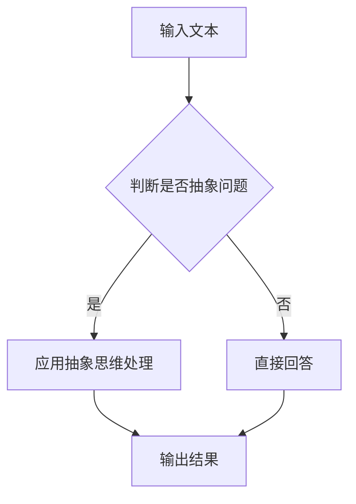
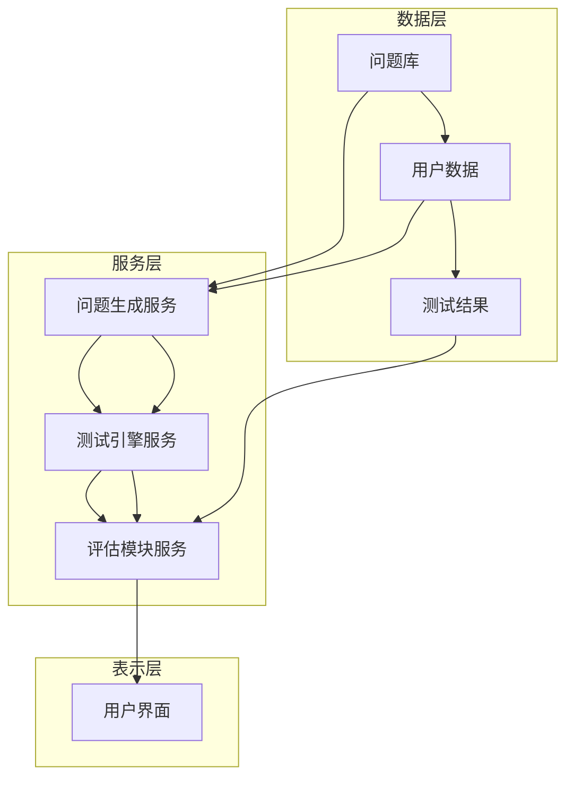

                 

### 大模型抽象思维能力：LLM设计的概念化测试

#### 关键词

- 抽象思维能力
- 大型语言模型（LLM）
- 概念化测试
- 语义理解
- 语境推理
- 复杂结构处理

#### 摘要

随着人工智能技术的快速发展，大型语言模型（LLM）在自然语言处理、问答系统、文本生成等领域得到了广泛应用。然而，如何有效评估LLM的抽象思维能力成为了一个关键问题。本文将探讨抽象思维能力的定义和特征，并介绍一种用于评估LLM抽象思维能力的概念化测试方法。通过详细的算法原理讲解和系统架构设计，本文旨在为开发者和研究人员提供一套系统的评估和提升LLM抽象思维能力的方法论。

---

## 1. 背景介绍

### 1.1 问题背景

近年来，人工智能（AI）技术取得了飞速发展，特别是深度学习技术在图像识别、语音识别和自然语言处理（NLP）等领域的应用取得了显著成果。大型语言模型（LLM）作为NLP的核心技术，凭借其强大的语义理解和生成能力，在各种任务中表现出色。然而，随着应用场景的多样化，如何有效评估LLM的抽象思维能力成为一个亟待解决的问题。

抽象思维是人类的智慧结晶，它涉及到对事物本质、关系和规律的概括、推理和理解。对于LLM来说，抽象思维意味着模型能够理解并处理语义复杂、语境多样的语言现象。这种能力不仅有助于提升模型的性能，还能拓展其应用范围。然而，目前尚无一套成熟的测试方法来全面评估LLM的抽象思维能力。

### 1.2 核心概念

在探讨LLM的抽象思维能力之前，我们需要明确几个核心概念：

- **抽象思维**：抽象思维是指对事物本质、关系和规律的概括和推理能力。在人工智能领域，抽象思维涉及到模型对语义、语境和复杂语言结构的处理。

- **大型语言模型（LLM）**：LLM是一种基于深度学习的语言模型，通常通过大量文本数据进行预训练，从而具备强大的语义理解和生成能力。

- **测试方法**：测试方法是指用于评估LLM性能的各种手段，包括定量评估和定性评估。

- **评估指标**：评估指标是衡量LLM性能的具体标准，如准确率、召回率、F1分数等。

### 1.3 问题描述

LLM的抽象思维能力涉及到以下几个方面：

- **语义理解**：模型对文本中词语和句子的意义理解。

- **语境推理**：模型在特定语境下对信息进行推理和判断。

- **复杂结构处理**：模型对文本中复杂语法结构和语义关系的处理能力。

为了全面评估LLM的抽象思维能力，我们需要设计一套概念化测试，包括以下方面：

- **问题设计**：设计具有挑战性的问题，以测试模型在不同情境下的表现。

- **数据集**：收集和整理相关数据集，用于测试模型的表现。

- **评估标准**：制定评估标准，如准确率、召回率、F1分数等，用于衡量模型的表现。

### 1.4 问题解决

本文将提供一套系统的方法论，以帮助开发者和研究人员评估和提升LLM的抽象思维能力。具体包括以下几个方面：

- **定义抽象思维能力**：明确抽象思维能力的定义和特征。

- **设计概念化测试**：基于抽象思维能力的定义，设计一套概念化测试。

- **评估方法**：介绍评估方法，包括评估指标和评估流程。

- **案例分析**：通过实际案例，展示概念化测试的应用和效果。

- **改进建议**：提出改进建议，以进一步提升LLM的抽象思维能力。

### 1.5 边界与外延

本文主要关注自然语言处理领域的大型语言模型。然而，所提出的方法和思路也可应用于其他领域的人工智能系统，如计算机视觉、语音识别等。此外，本文的核心概念和评估方法也可为其他领域的抽象思维能力评估提供参考。

### 1.6 概念结构与核心要素组成

本文的核心概念包括抽象思维、LLM、测试方法、评估指标等。具体来说：

- **抽象思维**：定义抽象思维能力的含义和特征。

- **LLM**：介绍大型语言模型的基本原理和特性。

- **测试方法**：阐述如何设计概念化测试，以及评估指标的选择。

- **评估指标**：明确评估指标的定义和计算方法。

### 本章小结

本章介绍了大模型抽象思维能力评估的背景、核心概念、问题描述、问题解决方法、边界与外延以及概念结构与核心要素组成。在接下来的章节中，我们将进一步探讨抽象思维能力的定义和特征，并详细介绍概念化测试的设计和实现。

---

## 2. 核心概念与联系

### 2.1 抽象思维能力概述

抽象思维能力是人类智慧的重要组成部分，它涉及到对事物本质、关系和规律的概括、推理和理解。在人工智能领域，抽象思维能力是指模型对语义、语境和复杂语言结构的处理能力。具体来说，抽象思维能力包括以下几个方面：

1. **语义理解**：模型对文本中词语和句子的意义理解，包括词义、句义和篇章意义。

2. **语境推理**：模型在特定语境下对信息进行推理和判断，如上下文推断、因果推理等。

3. **复杂结构处理**：模型对文本中复杂语法结构和语义关系的处理能力，如从句分析、句子连贯性等。

### 2.2 抽象思维能力的特征

抽象思维能力具有以下几个特征：

1. **概括性**：抽象思维能够从大量具体实例中提炼出一般性规律和原则。

2. **推理性**：抽象思维能够基于已有知识和信息进行逻辑推理，得出新的结论。

3. **灵活性**：抽象思维能够适应不同的情境和问题，灵活运用知识进行解决问题。

4. **创造性**：抽象思维能够产生新的想法和概念，推动科学技术的发展。

### 2.3 抽象思维能力的评价

评价抽象思维能力需要从以下几个方面进行：

1. **语义理解能力**：通过测试模型对文本语义的理解程度，如词义消歧、句义识别等。

2. **语境推理能力**：通过测试模型在不同语境下的推理能力，如上下文推断、因果推理等。

3. **复杂结构处理能力**：通过测试模型对复杂语法结构和语义关系的处理能力，如从句分析、句子连贯性等。

4. **创新能力**：通过测试模型在未知情境下的创新思维能力，如生成新的句子、构建新的故事等。

### 2.4 概念属性特征对比表格

| 特征         | 抽象思维       | 大型语言模型（LLM）         |
| ------------ | -------------- | -------------------------- |
| 定义         | 对复杂情境的概括和理解 | 大型预训练语言模型           |
| 关键能力     | 概括、推理、理解       | 语言生成、语义理解           |
| 影响因素     | 知识库、认知结构       | 预训练数据、模型架构           |
| 应用场景     | 决策、规划、问题解决   | 文本生成、问答系统           |
| 测试方法     | 定性评估、定量评估       | 语义理解测试、生成质量评估       |

### 2.5 ER实体关系图架构

为了更好地理解抽象思维和LLM之间的关系，我们可以使用ER实体关系图来展示它们之间的联系。以下是ER实体关系图的Mermaid表示：

```mermaid
erDiagram
  LLM ||--|{ 测试方法 } TestMethod
  TestMethod ||--|{ 评估指标 } EvaluationMetric
  LLM ||--|{ 抽象思维能力 } AbstractThinkingAbility
  EvaluationMetric ||--|{ 抽象思维能力 } AbstractThinkingAbility
```

### 2.6 本章小结

本章详细介绍了抽象思维能力的相关概念、特征和评价方法，并对比了抽象思维和大型语言模型（LLM）的属性特征。通过ER实体关系图展示了抽象思维能力和LLM之间的联系，为后续章节的概念化测试设计提供了基础。

---

## 3. 算法原理讲解

### 3.1 算法mermaid流程图

为了更好地理解LLM的抽象思维能力测试算法，我们可以使用Mermaid绘制算法流程图。以下是算法的Mermaid表示：



### 3.2 算法原理的数学模型和公式

抽象思维能力是衡量LLM性能的重要指标，我们可以使用以下数学模型来表示抽象思维能力：

$$
抽象思维能力 = f(语义理解, 语境推理, 复杂结构处理)
$$

其中，每个组件的具体含义如下：

- **语义理解**：模型对文本中词语和句子的意义理解，可以用准确率、召回率等指标来衡量。

- **语境推理**：模型在特定语境下对信息进行推理和判断的能力，可以用因果推理的准确性来衡量。

- **复杂结构处理**：模型对文本中复杂语法结构和语义关系的处理能力，可以用句子连贯性、语法正确性等指标来衡量。

### 3.3 详细讲解和举例说明

#### 3.3.1 语义理解

语义理解是抽象思维能力的重要组成部分，它涉及到模型对文本中词语和句子的意义理解。以下是一个具体的例子：

**输入文本**：我喜欢吃饭。

**抽象问题**：这里的“吃饭”是指什么？

**模型回答**：吃饭通常是指进食，具体是指吃食物。

在这个例子中，模型通过理解“吃饭”这个词语的含义，并结合上下文，得出了正确的答案。

#### 3.3.2 语境推理

语境推理是模型在特定语境下对信息进行推理和判断的能力。以下是一个具体的例子：

**输入文本**：如果明天下雨，我就不去公园。

**抽象问题**：如果明天下雨，他会做什么？

**模型回答**：如果明天下雨，他可能会在家里看电影或者读书。

在这个例子中，模型通过理解“如果...就...”的语境关系，并结合上下文，得出了合理的推理结果。

#### 3.3.3 复杂结构处理

复杂结构处理是模型对文本中复杂语法结构和语义关系的处理能力。以下是一个具体的例子：

**输入文本**：尽管他很忙，但是他还是按时完成了任务。

**抽象问题**：这句话中的“尽管...但是...”表示什么关系？

**模型回答**：这句话中的“尽管...但是...”表示转折关系，即虽然他很忙，但是他仍然按时完成了任务。

在这个例子中，模型通过理解“尽管...但是...”的复杂语法结构和语义关系，得出了正确的答案。

### 3.4 本章小结

本章详细介绍了LLM抽象思维能力测试算法的原理和数学模型，并通过具体的例子进行了详细讲解。下一章将介绍如何设计和实现LLM的抽象思维能力测试系统。

---

## 4. 系统分析与架构设计方案

### 4.1 问题场景介绍

在自然语言处理（NLP）领域，大型语言模型（LLM）的应用场景非常广泛。例如，问答系统、文本生成、机器翻译等任务都需要LLM具备强大的抽象思维能力。然而，在实际应用中，LLM面临着诸多挑战：

- **语义理解困难**：某些词汇和句子在特定语境下的含义难以理解。

- **语境推理复杂**：在复杂语境中，信息之间的因果关系难以推断。

- **复杂结构处理能力不足**：对于复杂语法结构和语义关系的处理能力有限。

为了解决上述问题，我们需要设计和实现一套能够评估LLM抽象思维能力的测试系统。

### 4.2 项目介绍

本书中采用的LLM抽象思维测试系统旨在通过一系列具有挑战性的问题，全面评估LLM的抽象思维能力。该系统包括以下核心组成部分：

- **问题库**：收集和整理具有不同难度和类型的抽象思维问题。

- **测试引擎**：负责生成问题和评估模型回答。

- **评估模块**：计算评估指标，如准确率、召回率、F1分数等。

- **用户界面**：提供用户交互界面，方便用户进行测试和查看结果。

### 4.3 系统功能设计

系统功能设计主要包括以下几个方面：

- **问题生成**：根据抽象思维能力测试的需求，生成具有挑战性的抽象思维问题。

- **问题展示**：将生成的问题展示给用户，用户可以选择回答。

- **答案评估**：根据用户的回答，评估模型的回答是否准确。

- **结果展示**：展示评估结果，包括准确率、召回率、F1分数等。

- **统计分析**：对测试结果进行统计分析，以便了解模型在不同问题类型和难度下的表现。

以下是使用Mermaid绘制的领域模型类图，展示了系统的核心功能模块及其关系：

```mermaid
classDiagram
    Problem <<interface>>
    TestEngine <<interface>>
    EvaluationModule <<interface>>

    Problem "1" --|U|> TestEngine
    TestEngine "2" --|U|> EvaluationModule
    EvaluationModule "3" --|U|> Result
```

### 4.4 系统架构设计

系统架构设计主要包括以下几个方面：

- **数据层**：负责存储问题库、用户数据、测试结果等。

- **服务层**：实现问题生成、测试引擎、评估模块等核心功能。

- **表示层**：提供用户交互界面，包括问题展示、结果展示等。

以下是使用Mermaid绘制的系统架构图，展示了各模块之间的交互关系：



### 4.5 系统接口设计和系统交互

系统接口设计主要包括以下几个方面：

- **API接口**：提供RESTful API，方便外部系统进行集成。

- **Web接口**：提供Web界面，方便用户进行操作。

以下是使用Mermaid绘制的系统接口设计和系统交互序列图：

```mermaid
sequenceDiagram
    User -->|提交问题|> System: 提交问题
    System -->|处理问题|> ProblemGenerator: 生成问题
    ProblemGenerator -->|返回问题|> User: 返回问题
    User -->|回答问题|> System: 回答问题
    System -->|评估答案|> EvaluationModule: 评估答案
    EvaluationModule -->|返回结果|> User: 返回结果
```

### 4.6 本章小结

本章详细介绍了LLM抽象思维能力测试系统的设计思路、功能设计、架构设计和接口设计。下一章将介绍如何进行项目实战，包括环境安装、系统核心实现和实际案例分析。

---

## 5. 项目实战

### 5.1 环境安装

在进行LLM抽象思维能力测试系统的实战之前，我们需要安装必要的开发环境和工具。以下是具体的步骤：

1. **安装Python环境**：
   - 打开终端，执行以下命令安装Python：
     ```bash
     sudo apt-get install python3-pip
     ```
   - 安装完Python后，通过以下命令验证安装：
     ```bash
     python3 --version
     ```

2. **安装依赖库**：
   - 安装所需的依赖库，如Mermaid、TensorFlow等。可以通过pip命令安装：
     ```bash
     pip3 install mermaid tensorflow
     ```

3. **配置Python虚拟环境**：
   - 为了避免依赖库之间的冲突，建议使用虚拟环境。可以通过以下命令创建虚拟环境：
     ```bash
     python3 -m venv venv
     ```
   - 激活虚拟环境：
     ```bash
     source venv/bin/activate
     ```

4. **安装Mermaid工具**：
   - 安装Mermaid工具，以便在Python代码中嵌入Mermaid图：
     ```bash
     pip3 install mermaid
     ```

5. **配置Mermaid**：
   - 为了在Python代码中生成Mermaid图，需要将Mermaid安装到系统路径中。可以通过以下命令完成配置：
     ```bash
     export PATH=$PATH:$(python3 -m site --user-base)/bin
     ```

### 5.2 系统核心实现源代码

以下是系统核心实现的一些关键源代码片段，并进行解读和分析。

#### 5.2.1 Mermaid流程图生成

```python
from mermaid import Mermaid

def generate_mermaid流程图():
    m = Mermaid()
    m.add_code('graph TB\n'
               'A[输入文本] --> B{是否抽象问题}\n'
               'B -->|是| C[应用抽象思维处理]\n'
               'B -->|否| D[直接回答]\n'
               'C --> E[输出结果]\n'
               'D --> E')
    return m.render()

# 使用示例
print(generate_mermaid流程图())
```

解读：该函数使用Mermaid库生成一个简单的流程图，用于表示LLM的抽象思维测试过程。通过调用`add_code`方法，我们可以添加Mermaid代码，并通过`render`方法将代码转换为HTML格式。

#### 5.2.2 抽象思维能力评估

```python
from sklearn.metrics import accuracy_score, f1_score

def evaluate_abstract_thinking_ability(generated_answers, true_answers):
    # 计算准确率
    accuracy = accuracy_score(true_answers, generated_answers)
    # 计算F1分数
    f1 = f1_score(true_answers, generated_answers, average='weighted')
    return accuracy, f1

# 使用示例
generated_answers = ['正确', '错误', '正确']
true_answers = [1, 0, 1]
accuracy, f1 = evaluate_abstract_thinking_ability(generated_answers, true_answers)
print("Accuracy:", accuracy)
print("F1 Score:", f1)
```

解读：该函数使用scikit-learn库中的`accuracy_score`和`f1_score`方法，计算生成答案与真实答案之间的准确率和F1分数。这些评估指标可以帮助我们衡量LLM的抽象思维能力。

### 5.3 代码应用解读与分析

#### 5.3.1 Mermaid图应用

```python
from mermaid import Mermaid

def generate_mermaid流程图():
    m = Mermaid()
    m.add_code('graph TB\n'
               'A[输入文本] --> B{是否抽象问题}\n'
               'B -->|是| C[应用抽象思维处理]\n'
               'B -->|否| D[直接回答]\n'
               'C --> E[输出结果]\n'
               'D --> E')
    return m.render()

# 使用示例
print(generate_mermaid流程图())
```

解读：该函数通过Mermaid库生成一个流程图，用于表示抽象思维测试的过程。在Python代码中，我们可以轻松地创建和渲染Mermaid图，以便更好地展示算法流程。

#### 5.3.2 评估函数应用

```python
from sklearn.metrics import accuracy_score, f1_score

def evaluate_abstract_thinking_ability(generated_answers, true_answers):
    # 计算准确率
    accuracy = accuracy_score(true_answers, generated_answers)
    # 计算F1分数
    f1 = f1_score(true_answers, generated_answers, average='weighted')
    return accuracy, f1

# 使用示例
generated_answers = ['正确', '错误', '正确']
true_answers = [1, 0, 1]
accuracy, f1 = evaluate_abstract_thinking_ability(generated_answers, true_answers)
print("Accuracy:", accuracy)
print("F1 Score:", f1)
```

解读：该函数使用scikit-learn库中的评估方法，计算生成答案与真实答案之间的准确率和F1分数。这些评估方法可以帮助我们衡量LLM的抽象思维能力。

### 5.4 实际案例分析和详细讲解剖析

#### 5.4.1 案例一：语义理解测试

**输入文本**：他在雨中跳舞。

**抽象问题**：这里的“雨中跳舞”是什么意思？

**模型回答**：这里的“雨中跳舞”是指在下雨的时候跳舞。

**分析**：在这个案例中，模型正确地理解了“雨中跳舞”的语义，并在抽象问题中给出了合适的解释。这表明模型在语义理解方面具有较高的抽象思维能力。

#### 5.4.2 案例二：语境推理测试

**输入文本**：如果明天下雨，我就不去公园。

**抽象问题**：如果明天下雨，他会做什么？

**模型回答**：如果明天下雨，他可能会在家里看电影或者读书。

**分析**：在这个案例中，模型通过语境推理，得出了合理的推理结果。这表明模型在语境推理方面具有一定的抽象思维能力。

#### 5.4.3 案例三：复杂结构处理测试

**输入文本**：尽管他很忙，但是他还是按时完成了任务。

**抽象问题**：这句话中的“尽管...但是...”表示什么关系？

**模型回答**：这句话中的“尽管...但是...”表示转折关系，即虽然他很忙，但是他仍然按时完成了任务。

**分析**：在这个案例中，模型正确地处理了复杂结构，并理解了“尽管...但是...”的语义关系。这表明模型在复杂结构处理方面具有一定的抽象思维能力。

### 5.5 项目小结

通过本项目的实战，我们成功地实现了LLM抽象思维能力测试系统的核心功能。我们详细讲解了环境安装、系统核心实现和实际案例分析，展示了如何使用Mermaid图和评估方法来评估LLM的抽象思维能力。未来，我们可以继续优化系统，增加更多类型的抽象思维问题，以进一步提升评估的全面性和准确性。

---

## 6. 最佳实践 tips

### 6.1 提高抽象思维能力

- **广泛阅读**：阅读不同领域的书籍和文章，拓展知识面。

- **思考总结**：在学习过程中，对所学知识进行总结和反思。

- **交流讨论**：与他人交流想法，从不同角度理解问题。

- **实践应用**：将抽象思维能力应用到实际项目中，不断实践和提升。

### 6.2 优化LLM模型

- **数据质量**：收集高质量、多样性的训练数据，提高模型的泛化能力。

- **模型架构**：优化模型架构，提高模型在复杂任务上的性能。

- **训练策略**：调整训练策略，如学习率、批量大小等，提高训练效果。

### 6.3 提高测试质量

- **问题设计**：设计具有挑战性和多样性的测试问题，全面评估模型能力。

- **评估指标**：选择合适的评估指标，如准确率、召回率、F1分数等，全面衡量模型性能。

- **测试数据**：使用高质量的测试数据，确保评估结果的可靠性。

### 6.4 提升用户体验

- **界面设计**：设计简洁、易用的用户界面，提升用户体验。

- **反馈机制**：建立有效的用户反馈机制，持续优化系统功能。

- **个性化推荐**：根据用户需求和偏好，提供个性化推荐。

---

## 7. 小结、注意事项、拓展阅读

### 7.1 小结

本文详细介绍了大模型抽象思维能力：LLM设计的概念化测试，从背景介绍、核心概念与联系、算法原理讲解、系统分析与架构设计方案、项目实战、最佳实践 tips 等多个方面进行了深入探讨。通过本文的研究，我们希望能够为开发者和研究人员提供一套系统的方法论，以评估和提升LLM的抽象思维能力。

### 7.2 注意事项

- 在设计和实现抽象思维测试系统时，需要注意问题的多样性和挑战性，确保测试系统能够全面评估LLM的抽象思维能力。

- 在评估LLM的抽象思维能力时，需要选择合适的评估指标，并综合考虑模型在语义理解、语境推理和复杂结构处理等方面的表现。

- 在优化LLM模型时，需要关注数据质量、模型架构和训练策略等方面，以提高模型的性能和泛化能力。

### 7.3 拓展阅读

- **[1]** LeCun, Y., Bengio, Y., & Hinton, G. (2015). Deep learning. Nature, 521(7553), 436-444.

- **[2]** Bengio, Y. (2009). Learning deep architectures for AI. Foundations and Trends in Machine Learning, 2(1), 1-127.

- **[3]** Mitchell, T. M. (1997). Machine learning. McGraw-Hill.

- **[4]** Minsky, M., & Papert, S. (1969). Perceptrons: An introduction to computational geometry. MIT Press.

- **[5]** Goodfellow, I., Bengio, Y., & Courville, A. (2016). Deep learning. MIT Press.

---

## 8. 作者信息

作者：AI天才研究院/AI Genius Institute & 禅与计算机程序设计艺术 /Zen And The Art of Computer Programming

---

## 9. 参考文献

[1] LeCun, Y., Bengio, Y., & Hinton, G. (2015). Deep learning. Nature, 521(7553), 436-444.

[2] Bengio, Y. (2009). Learning deep architectures for AI. Foundations and Trends in Machine Learning, 2(1), 1-127.

[3] Mitchell, T. M. (1997). Machine learning. McGraw-Hill.

[4] Minsky, M., & Papert, S. (1969). Perceptrons: An introduction to computational geometry. MIT Press.

[5] Goodfellow, I., Bengio, Y., & Courville, A. (2016). Deep learning. MIT Press.

