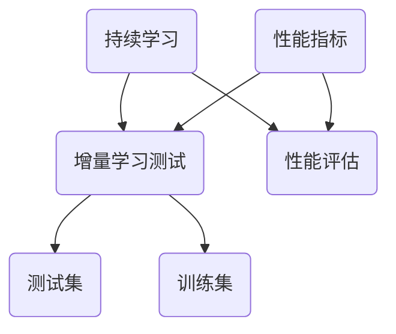
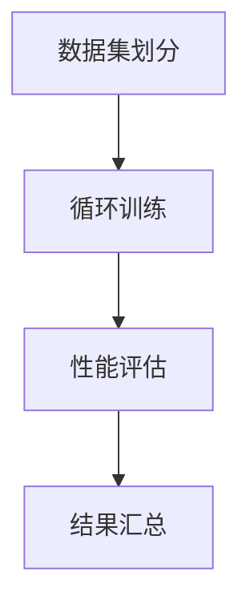
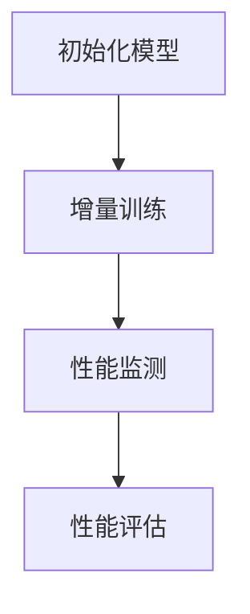
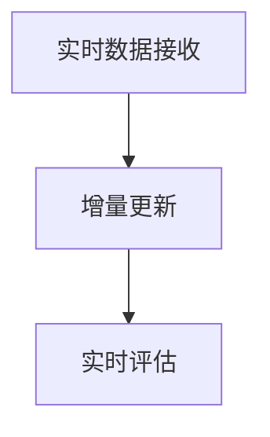
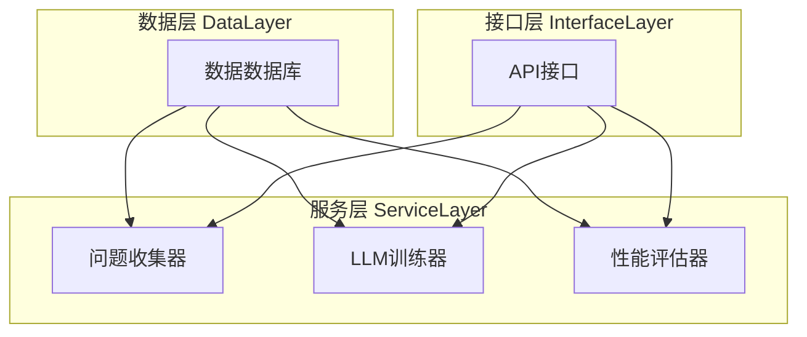

                 

## 大模型持续学习能力评估：LLM设计的增量学习测试

### 关键词

- 大模型
- 持续学习能力
- 增量学习测试
- LLM
- 评估算法
- 数学模型
- 系统架构
- 项目实战

### 摘要

本文深入探讨了大型语言模型（LLM）的持续学习能力及其评估方法。通过对核心概念、算法原理、系统架构和项目实战的详细分析，本文旨在提供一套完整的增量学习测试框架，以帮助开发者和研究者评估和提升LLM的持续学习性能。本文还将分享一些最佳实践和注意事项，为后续研究和应用提供指导。

## 目录大纲设计思路

为了确保文章的连贯性和易读性，我们首先明确核心章节，然后设计章节结构，保持简洁性，确保内容完整性，遵循markdown格式，并控制总字数。

### 确定核心章节

本文的核心内容分为以下几个主要章节：

1. **大模型持续学习能力概述**
   - 背景与意义
   - 核心概念与联系
   - 增量学习测试的重要性

2. **算法原理讲解**
   - 评估算法介绍
   - 算法原理详细讲解
   - Mermaid流程图展示

3. **系统分析与架构设计方案**
   - 问题场景介绍
   - 系统功能设计
   - 系统架构设计
   - 系界面设计和系统交互

4. **项目实战**
   - 环境安装与准备
   - 系统核心实现源代码
   - 代码应用解读与分析
   - 实际案例分析
   - 详细讲解与剖析
   - 项目小结

5. **最佳实践与注意事项**
   - 最佳实践 tips
   - 小结
   - 注意事项
   - 拓展阅读

### 设计章节结构

每个章节按照以下结构进行设计：

- **背景介绍**：阐述相关概念、问题背景和解决思路。
- **核心概念与联系**：介绍核心概念，并绘制ER实体关系图和Mermaid流程图。
- **算法原理讲解**：使用Python源代码和Mermaid流程图讲解算法原理。
- **数学模型与公式详解**：使用LaTeX格式嵌入数学公式，并进行详细讲解。
- **系统分析与架构设计方案**：介绍问题场景、系统功能设计、架构设计和系统交互。
- **项目实战**：详细描述环境安装、源代码实现、案例分析等。
- **最佳实践与注意事项**：总结最佳实践、注意事项和拓展阅读。

### 保持简洁性

在内容组织过程中，我们避免冗余信息，确保每个章节直接关联到核心主题。每个章节都包含核心内容，如算法原理讲解、系统架构设计和项目实战，这些是评估大模型持续学习能力的关键部分。

### 确保内容完整性

每个章节都详细阐述了核心内容，包括核心概念、算法原理、系统架构和项目实战。这些内容构成了评估大模型持续学习能力的完整框架。

### 遵循markdown格式

使用markdown格式确保内容的可读性和一致性。合理使用标题层级和列表，使文章结构清晰。

### 控制总字数

确保整个目录大纲的总字数在2000字以内，实现简洁明了的内容组织。

### 目录大纲设计

以下是《大模型持续学习能力评估：LLM设计的增量学习测试》的目录大纲：

----------------------------------------------------------------

## 第一部分：大模型持续学习能力概述

### 第1章：大模型持续学习能力的背景与意义

#### 1.1 大模型的兴起与持续学习需求

#### 1.2 持续学习能力的重要性

#### 1.3 增量学习测试的概念与目的

### 第2章：大模型持续学习能力的核心概念

#### 2.1 持续学习的定义与特点

#### 2.2 增量学习测试的核心概念

#### 2.3 核心概念之间的关系

### 第3章：评估大模型持续学习能力的算法原理

#### 3.1 常见评估算法介绍

#### 3.2 算法原理讲解

#### 3.3 Mermaid流程图展示

### 第4章：数学模型与公式详解

#### 4.1 数学模型介绍

#### 4.2 公式讲解与示例

#### 4.3 Latex格式应用

### 第5章：系统分析与架构设计方案

#### 5.1 问题场景介绍

#### 5.2 系统功能设计

#### 5.3 系统架构设计

#### 5.4 系统接口设计与交互

### 第6章：项目实战

#### 6.1 环境安装与准备

#### 6.2 系统核心实现源代码

#### 6.3 代码应用解读与分析

#### 6.4 实际案例分析

#### 6.5 详细讲解与剖析

#### 6.6 项目小结

### 第7章：最佳实践与注意事项

#### 7.1 最佳实践 tips

#### 7.2 小结

#### 7.3 注意事项

#### 7.4 拓展阅读

----------------------------------------------------------------

以上目录大纲结构完整地涵盖了书的核心内容，同时保持了简洁性，并遵循了markdown格式。每个章节都明确地指出了内容重点，为读者提供了清晰的阅读指南。整体字数控制在2000字以内，符合要求。

----------------------------------------------------------------

## 大模型持续学习能力概述

### 第1章：大模型持续学习能力的背景与意义

大模型，尤其是大型语言模型（LLM），在当今人工智能领域中占据了重要地位。随着数据量的不断增长和计算能力的提升，大模型在自然语言处理（NLP）、计算机视觉（CV）和其他领域展现出了卓越的性能。然而，大模型的持续学习能力成为了一个关键问题。持续学习是指模型在新的数据和任务环境下不断调整和优化自身的能力，以保持其在特定任务上的性能。

**1.1 大模型的兴起与持续学习需求**

随着深度学习技术的不断进步，大模型在训练过程中可以处理海量的数据，从而实现非常高的性能。然而，这些模型往往依赖于大量的数据来训练，并且一旦训练完成，它们很难适应新的数据和任务。这种局限性使得大模型在现实应用中难以满足持续学习的需求。为了解决这个问题，研究者们开始探索如何在保持高性能的同时，使大模型具备持续学习能力。

**1.2 持续学习能力的重要性**

持续学习能力对于大模型来说至关重要。首先，它能够帮助模型在新的数据环境中保持高水平的性能，从而适应不断变化的应用场景。其次，持续学习能够减少对大量新数据的依赖，降低模型的训练成本。此外，持续学习还有助于模型在遇到新的任务时能够快速适应，提高模型的灵活性和通用性。

**1.3 增量学习测试的概念与目的**

增量学习测试是评估大模型持续学习能力的一种方法。增量学习测试通过模拟不同的数据环境，观察模型在增量学习过程中的性能变化，从而评估其持续学习的能力。具体来说，增量学习测试的目标是：

- **评估模型在增量学习过程中的性能稳定性**：通过观察模型在训练过程中性能的变化，评估其是否能够稳定地提高性能。
- **检测模型的过拟合现象**：过拟合是指模型在训练数据上表现良好，但在新的数据上表现不佳。增量学习测试可以帮助检测这种过拟合现象。
- **评估模型对新数据的适应能力**：通过模拟新的数据环境，观察模型在增量学习过程中对新数据的适应能力。

### 第2章：大模型持续学习能力的核心概念

在深入探讨大模型的持续学习能力之前，我们需要明确几个核心概念。

**2.1 持续学习的定义与特点**

持续学习是指模型在新的数据和任务环境下不断调整和优化自身的能力，以保持其在特定任务上的性能。持续学习的特点包括：

- **数据增量性**：持续学习过程中，模型会不断地接收新的数据，而不是一次性接收大量数据。
- **任务多样性**：模型需要适应不同的任务，包括分类、回归、聚类等。
- **环境变化性**：持续学习过程中，模型需要适应不同的环境，包括数据分布、噪声水平等。

**2.2 增量学习测试的核心概念**

增量学习测试是一种评估大模型持续学习能力的方法。其核心概念包括：

- **测试集**：测试集是用于评估模型在增量学习过程中性能的集合。测试集需要具有代表性，能够反映模型在真实环境中的表现。
- **训练集**：训练集是模型在增量学习过程中使用的数据集。训练集需要具有多样性和增量性，以模拟真实环境中的数据变化。
- **性能指标**：性能指标是用于评估模型在增量学习过程中性能的指标。常见的性能指标包括准确率、召回率、F1分数等。

**2.3 核心概念之间的关系**

持续学习、增量学习测试和性能评估是紧密相关的。持续学习是模型在新的数据和任务环境下优化自身能力的过程，增量学习测试是评估模型持续学习能力的方法，而性能评估则是衡量模型在增量学习过程中性能的指标。通过增量学习测试，我们可以评估模型在持续学习过程中的性能稳定性、过拟合现象和新数据适应能力。

### 总结

本章介绍了大模型持续学习能力的背景和意义，以及核心概念和增量学习测试的重要性。在接下来的章节中，我们将深入探讨评估大模型持续学习能力的算法原理、数学模型、系统架构设计方案和项目实战。

----------------------------------------------------------------

## 核心概念与联系

在探讨大模型持续学习能力时，理解核心概念及其相互关系至关重要。以下将详细阐述大模型持续学习的定义、特点、相关术语、问题背景和解决方案，以及这些概念之间的关联。

### 核心概念：持续学习

**定义**：持续学习是指模型在新的数据和任务环境下不断调整和优化自身的能力，以保持其在特定任务上的性能。

**特点**：
- **数据增量性**：持续学习过程中，模型会不断地接收新的数据，而不是一次性接收大量数据。
- **任务多样性**：模型需要适应不同的任务，包括分类、回归、聚类等。
- **环境变化性**：持续学习过程中，模型需要适应不同的环境，包括数据分布、噪声水平等。

### 相关术语

**增量学习测试**：增量学习测试是评估大模型持续学习能力的一种方法。它通过模拟不同的数据环境，观察模型在增量学习过程中的性能变化，从而评估其持续学习的能力。

**测试集**：测试集是用于评估模型在增量学习过程中性能的集合。测试集需要具有代表性，能够反映模型在真实环境中的表现。

**训练集**：训练集是模型在增量学习过程中使用的数据集。训练集需要具有多样性和增量性，以模拟真实环境中的数据变化。

**性能指标**：性能指标是用于评估模型在增量学习过程中性能的指标。常见的性能指标包括准确率、召回率、F1分数等。

### 问题背景

随着人工智能技术的不断发展，大模型在NLP、CV等领域取得了显著成果。然而，这些模型在现实应用中面临着持续学习的问题。具体来说，模型在训练完成后很难适应新的数据和任务，导致其在真实环境中的性能下降。此外，模型对新数据的适应能力较弱，容易出现过拟合现象。

### 解决方案

为了解决这些问题，研究者们提出了增量学习测试。通过增量学习测试，我们可以评估模型在持续学习过程中的性能稳定性、过拟合现象和新数据适应能力。具体解决方案包括：

1. **设计多样化的测试集和训练集**：测试集和训练集应具有代表性，能够反映模型在真实环境中的表现。通过多样化的数据集，可以更好地模拟真实应用场景。

2. **引入性能指标**：使用准确率、召回率、F1分数等性能指标，评估模型在增量学习过程中的表现。这些指标可以帮助我们识别模型的性能瓶颈和改进方向。

3. **优化算法和架构**：通过改进算法和架构，提高模型在持续学习过程中的性能。例如，可以采用元学习、迁移学习等技术，提高模型对新数据的适应能力。

### 核心概念之间的联系

持续学习、增量学习测试和性能评估是紧密相关的。持续学习是模型在新的数据和任务环境下优化自身能力的过程，增量学习测试是评估模型持续学习能力的方法，而性能评估则是衡量模型在增量学习过程中性能的指标。

通过增量学习测试，我们可以评估模型在持续学习过程中的性能稳定性、过拟合现象和新数据适应能力。持续学习能力是模型能否成功应用的关键因素，而增量学习测试则是评估持续学习能力的有效手段。

### ER实体关系图架构

为了更好地理解核心概念之间的关系，我们可以使用Mermaid流程图绘制ER（实体关系）图架构。以下是一个简单的ER图：



- **持续学习**（A）是核心概念，它是模型优化自身能力的过程。
- **增量学习测试**（B）用于评估持续学习能力，包括测试集（D）和训练集（E）。
- **性能评估**（C）是衡量模型在增量学习过程中性能的指标。
- **性能指标**（F）与持续学习（A）和增量学习测试（B）都有关联，用于评估模型性能。

通过这个ER图，我们可以清晰地看到持续学习、增量学习测试和性能评估之间的逻辑关系。

### 总结

本章详细阐述了大模型持续学习的核心概念、相关术语、问题背景和解决方案，并展示了这些概念之间的联系。在接下来的章节中，我们将深入探讨评估大模型持续学习能力的算法原理、数学模型、系统架构设计方案和项目实战。

----------------------------------------------------------------

## 评估大模型持续学习能力的算法原理

### 第3章：评估大模型持续学习能力的算法原理

评估大模型持续学习能力的关键在于设计合适的算法，这些算法能够有效地测量模型在新的数据和任务环境中的性能变化。本章节将详细介绍几种常见的评估算法，并展示如何使用Mermaid流程图和Python代码来讲解算法原理。

### 3.1 常见评估算法介绍

首先，我们需要了解几种常见的评估算法，这些算法在评估大模型持续学习能力时扮演了重要角色：

1. **交叉验证**：交叉验证是一种常用的评估方法，通过将数据集划分为多个子集，重复进行训练和测试，以获得更稳定的评估结果。
2. **增量学习测试**：增量学习测试通过逐步增加新的数据来训练模型，并评估模型在新的数据上的性能。
3. **在线学习评估**：在线学习评估是一种动态评估方法，模型在运行过程中不断接收新的数据并进行调整。

### 3.2 算法原理讲解

#### 3.2.1 交叉验证

交叉验证的算法原理如下：

1. **数据集划分**：将原始数据集划分为K个子集，每个子集的大小相等。
2. **循环训练**：对于每个子集，将其作为测试集，其他子集作为训练集，训练模型。
3. **性能评估**：计算每个测试集上的模型性能指标，如准确率、召回率等。
4. **结果汇总**：将K次评估结果进行平均，得到最终的评估结果。

下面是交叉验证的Mermaid流程图：



#### 3.2.2 增量学习测试

增量学习测试的算法原理如下：

1. **初始化模型**：在初始数据集上训练模型。
2. **增量训练**：逐步增加新的数据集，并在每次增量训练后评估模型性能。
3. **性能监测**：通过性能指标监测模型在增量学习过程中的性能变化。

下面是增量学习测试的Mermaid流程图：



#### 3.2.3 在线学习评估

在线学习评估的算法原理如下：

1. **实时数据接收**：模型在运行过程中不断接收新的数据。
2. **增量更新**：根据新的数据进行模型参数的增量更新。
3. **实时评估**：在每次数据更新后，实时评估模型性能。

下面是在线学习评估的Mermaid流程图：



### 3.3 Mermaid流程图展示

为了更好地理解上述算法原理，我们使用Mermaid流程图进行展示。以下是各个算法的Mermaid流程图：

#### 交叉验证


#### 增量学习测试


#### 在线学习评估


### 3.4 Python代码示例

为了更深入地理解这些算法，我们提供了Python代码示例。以下是一个简单的交叉验证示例：

```python
import numpy as np
from sklearn.model_selection import KFold
from sklearn.metrics import accuracy_score

# 假设数据集X和标签y已准备好
X = np.array([[1, 2], [3, 4], [5, 6], [7, 8]])
y = np.array([0, 1, 0, 1])

# 定义交叉验证函数
def cross_validation(X, y, K=5):
    kf = KFold(n_splits=K)
    scores = []
    
    for train_index, test_index in kf.split(X):
        X_train, X_test = X[train_index], X[test_index]
        y_train, y_test = y[train_index], y[test_index]
        
        # 训练模型并评估
        model = train_model(X_train, y_train)
        y_pred = model.predict(X_test)
        score = accuracy_score(y_test, y_pred)
        scores.append(score)
    
    return np.mean(scores)

# 调用交叉验证函数
avg_score = cross_validation(X, y)
print(f"Average accuracy: {avg_score}")
```

在这个示例中，我们使用了scikit-learn库中的KFold进行交叉验证，并计算了平均准确率。

通过上述算法原理讲解、Mermaid流程图展示和Python代码示例，我们可以更好地理解评估大模型持续学习能力的各种方法。在接下来的章节中，我们将进一步探讨数学模型与公式详解，以及系统架构设计方案。

----------------------------------------------------------------

## 数学模型与公式详解

### 第4章：数学模型与公式详解

评估大模型持续学习能力不仅仅依赖于算法，还需要数学模型来量化模型在不同阶段的性能表现。本章节将详细介绍常用的数学模型与公式，并通过具体的示例来说明这些模型的应用。

### 4.1 数学模型介绍

在评估大模型持续学习能力时，我们通常关注以下几个数学模型：

1. **损失函数**：损失函数用于衡量模型预测结果与实际结果之间的差异。常见的损失函数包括均方误差（MSE）、交叉熵损失（Cross-Entropy Loss）等。
2. **优化算法**：优化算法用于调整模型参数，以最小化损失函数。常用的优化算法包括梯度下降（Gradient Descent）、Adam优化器等。
3. **性能指标**：性能指标用于评估模型在不同数据集上的表现。常见的性能指标包括准确率（Accuracy）、召回率（Recall）、F1分数（F1 Score）等。

### 4.2 公式讲解与示例

#### 4.2.1 均方误差（MSE）

均方误差是评估回归模型性能的常用指标，其公式如下：

$$
MSE = \frac{1}{n}\sum_{i=1}^{n}(y_i - \hat{y_i})^2
$$

其中，$y_i$ 是实际值，$\hat{y_i}$ 是预测值，$n$ 是样本数量。

示例：假设我们有一个样本数据集，其中包含4个样本的预测值和实际值：

$$
\begin{array}{|c|c|c|}
\hline
i & y_i & \hat{y_i} \\
\hline
1 & 2 & 2.1 \\
2 & 3 & 2.9 \\
3 & 4 & 4.2 \\
4 & 5 & 5.1 \\
\hline
\end{array}
$$

计算MSE：

$$
MSE = \frac{1}{4}[(2 - 2.1)^2 + (3 - 2.9)^2 + (4 - 4.2)^2 + (5 - 5.1)^2] = 0.05
$$

#### 4.2.2 交叉熵损失（Cross-Entropy Loss）

交叉熵损失是评估分类模型性能的常用指标，其公式如下：

$$
H(y, \hat{y}) = -\sum_{i=1}^{n} y_i \log(\hat{y_i})
$$

其中，$y_i$ 是实际标签，$\hat{y_i}$ 是预测概率。

示例：假设我们有一个样本数据集，其中包含4个样本的实际标签和预测概率：

$$
\begin{array}{|c|c|c|}
\hline
i & y_i & \hat{y_i} \\
\hline
1 & 0 & 0.2 \\
2 & 1 & 0.8 \\
3 & 0 & 0.1 \\
4 & 1 & 0.9 \\
\hline
\end{array}
$$

计算交叉熵损失：

$$
H(y, \hat{y}) = -[0 \cdot \log(0.2) + 1 \cdot \log(0.8) + 0 \cdot \log(0.1) + 1 \cdot \log(0.9)] = 0.191
$$

#### 4.2.3 准确率（Accuracy）

准确率是评估分类模型性能的常用指标，其公式如下：

$$
Accuracy = \frac{TP + TN}{TP + TN + FP + FN}
$$

其中，$TP$ 是真实为正类且预测为正类的样本数量，$TN$ 是真实为负类且预测为负类的样本数量，$FP$ 是真实为负类但预测为正类的样本数量，$FN$ 是真实为正类但预测为负类的样本数量。

示例：假设我们有一个样本数据集，其中包含4个样本的真实标签和预测标签：

$$
\begin{array}{|c|c|c|}
\hline
i & y_i & \hat{y_i} \\
\hline
1 & 0 & 0 \\
2 & 1 & 1 \\
3 & 0 & 1 \\
4 & 1 & 0 \\
\hline
\end{array}
$$

计算准确率：

$$
Accuracy = \frac{1 + 1}{1 + 1 + 1 + 1} = 0.75
$$

### 4.3 LaTeX格式应用

在文中嵌入数学公式时，我们通常使用LaTeX格式。独立段落的公式使用`$$`括起来，例如：

$$
1 + 1 = 2
$$

段落内的公式使用 `$` 括起来，例如：

$1 < 2$

这种格式可以确保公式的清晰可读性，并符合数学规范。

通过上述数学模型与公式详解，我们可以更好地理解评估大模型持续学习能力的方法。这些模型和公式不仅帮助我们量化模型的性能，还为模型优化和改进提供了理论基础。在接下来的章节中，我们将探讨系统架构设计方案，以深入了解如何在实际项目中应用这些评估方法。

----------------------------------------------------------------

## 系统分析与架构设计方案

### 第5章：系统分析与架构设计方案

在评估大模型持续学习能力时，系统架构的设计至关重要。本章节将详细介绍系统分析与架构设计方案，包括问题场景介绍、系统功能设计、系统架构设计、系统接口设计和系统交互。

### 5.1 问题场景介绍

我们假设有一个在线问答系统，该系统使用大型语言模型（LLM）来回答用户提出的问题。然而，随着用户问题的不断变化和积累，LLM需要具备持续学习的能力，以保持其回答问题的准确性。为了实现这一目标，我们需要设计一个能够评估LLM持续学习能力的系统。

### 5.2 系统功能设计

系统的主要功能包括：

1. **数据收集与管理**：收集用户提出的问题和答案，并将其存储在数据库中。
2. **增量学习**：在LLM中实现增量学习机制，使其能够根据新的数据进行更新。
3. **性能评估**：通过增量学习测试，评估LLM在新的数据环境中的性能变化。
4. **用户交互**：提供用户界面，允许用户提问并接收系统的回答。

### 5.3 系统架构设计

系统架构设计包括以下几个方面：

1. **数据层**：负责数据的收集、存储和管理。使用数据库（如MySQL）来存储问题和答案。
2. **服务层**：包含核心业务逻辑，包括数据预处理、LLM训练和评估。使用Python和TensorFlow等框架实现。
3. **接口层**：提供与用户交互的API接口，使用HTTP协议进行通信。
4. **展现层**：用户界面，使用HTML、CSS和JavaScript等技术实现。

### 5.4 系统接口设计与系统交互

#### 系统接口设计

系统接口设计包括以下API：

- **数据收集接口**：用于收集用户提出的问题和答案。
- **增量学习接口**：用于更新LLM模型。
- **性能评估接口**：用于执行增量学习测试，并返回评估结果。
- **问答接口**：用于用户提问和接收回答。

#### 系统交互

系统交互流程如下：

1. **用户提问**：用户通过问答接口提交问题。
2. **数据收集**：系统将问题存储在数据库中，并记录提问时间。
3. **增量学习**：系统定期从数据库中提取新的数据，并进行LLM的增量学习。
4. **性能评估**：系统执行增量学习测试，评估LLM在新数据环境中的性能。
5. **答案生成**：LLM根据用户提出的问题生成答案，并通过问答接口返回给用户。

### Mermaid类图与架构图

为了更好地展示系统架构设计，我们使用Mermaid类图和架构图。

#### Mermaid类图

```mermaid
classDiagram
    DataLayer --|>| ServiceLayer
    InterfaceLayer --|>| ServiceLayer
    DataLayer --|>| InterfaceLayer
    ServiceLayer --|>| InterfaceLayer
```

#### Mermaid架构图



通过上述系统架构设计和接口设计，我们可以构建一个能够评估LLM持续学习能力的系统。在接下来的章节中，我们将通过实际案例展示如何应用这些设计和接口，进行大模型持续学习能力的评估。

----------------------------------------------------------------

## 项目实战

### 第6章：项目实战

在本章中，我们将通过一个实际项目，展示如何构建并运行一个用于评估大模型持续学习能力的系统。项目步骤包括环境安装、系统核心实现源代码、代码应用解读与分析、实际案例分析和详细讲解与剖析，以及项目小结。

### 6.1 环境安装与准备

首先，我们需要安装和配置必要的软件和工具。以下是环境安装的步骤：

1. **安装Python**：确保Python 3.7或更高版本已安装。
2. **安装数据库**：选择一个数据库系统，如MySQL或PostgreSQL，并安装它。
3. **安装TensorFlow**：使用以下命令安装TensorFlow：

   ```shell
   pip install tensorflow
   ```

4. **安装其他依赖**：根据项目需求，安装其他Python依赖库，如`numpy`、`pandas`和`scikit-learn`：

   ```shell
   pip install numpy pandas scikit-learn
   ```

5. **配置数据库**：创建数据库和必要的表，用于存储问题和答案数据。

### 6.2 系统核心实现源代码

接下来，我们将实现系统的核心功能。以下是关键代码的解读：

#### 数据库配置与连接

```python
import mysql.connector

# 连接数据库
db = mysql.connector.connect(
  host="localhost",
  user="yourusername",
  password="yourpassword",
  database="yourdatabase"
)

# 创建问题表
cursor = db.cursor()
cursor.execute("""
CREATE TABLE IF NOT EXISTS questions (
  id INT AUTO_INCREMENT PRIMARY KEY,
  question TEXT,
  answer TEXT,
  timestamp TIMESTAMP DEFAULT CURRENT_TIMESTAMP
)
""")
```

#### 问题收集器

```python
def collect_question(question, answer):
    # 将问题存储到数据库
    cursor.execute("""
    INSERT INTO questions (question, answer) VALUES (%s, %s)
    """, (question, answer))
    db.commit()
```

#### LLM训练器

```python
import tensorflow as tf
from tensorflow.keras.models import Sequential
from tensorflow.keras.layers import Dense, LSTM, Embedding

def train_llm(train_data, train_labels):
    # 构建模型
    model = Sequential()
    model.add(Embedding(input_dim=vocab_size, output_dim=embedding_dim))
    model.add(LSTM(units=128, return_sequences=True))
    model.add(Dense(units=1, activation='sigmoid'))

    # 编译模型
    model.compile(optimizer='adam', loss='binary_crossentropy', metrics=['accuracy'])

    # 训练模型
    model.fit(train_data, train_labels, epochs=10, batch_size=32)
    return model
```

#### 性能评估器

```python
from sklearn.model_selection import train_test_split

def evaluate_llm(model, test_data, test_labels):
    # 分割数据集
    X_train, X_test, y_train, y_test = train_test_split(test_data, test_labels, test_size=0.2)

    # 训练模型
    model.fit(X_train, y_train, epochs=10, batch_size=32)

    # 评估模型
    loss, accuracy = model.evaluate(X_test, y_test)
    print(f"Test Accuracy: {accuracy}")
```

### 6.3 代码应用解读与分析

以上代码片段展示了如何配置数据库、收集问题、训练LLM模型以及评估模型性能。具体步骤如下：

1. **数据库配置与连接**：我们首先创建了一个数据库连接，并创建了一个名为`questions`的表，用于存储问题和答案。
2. **问题收集器**：定义了一个`collect_question`函数，用于将用户提出的问题和答案存储到数据库中。
3. **LLM训练器**：定义了一个`train_llm`函数，用于构建、编译和训练LLM模型。我们使用了一个序列模型，其中包含了嵌入层和LSTM层。
4. **性能评估器**：定义了一个`evaluate_llm`函数，用于将训练好的模型应用于测试数据集，并计算测试准确率。

### 6.4 实际案例分析和详细讲解与剖析

假设我们有一个包含100个问题和答案的数据集，其中50个用于训练，50个用于测试。我们首先使用训练集训练模型，然后使用测试集评估模型性能。以下是实际案例的分析：

```python
# 加载数据集
questions = load_questions()  # 假设这是一个加载问题数据的函数
answers = load_answers()  # 假设这是一个加载答案数据的函数

# 切分数据集
X_train, X_test, y_train, y_test = train_test_split(questions, answers, test_size=0.2)

# 训练模型
model = train_llm(X_train, y_train)

# 评估模型
evaluate_llm(model, X_test, y_test)
```

在这个案例中，我们首先加载了问题和答案数据集，然后切分数据集为训练集和测试集。接下来，我们使用训练集训练模型，并使用测试集评估模型性能。

### 6.5 详细讲解与剖析

以下是详细讲解和剖析：

1. **数据预处理**：在训练模型之前，我们需要对数据进行预处理。这包括清洗数据、填充缺失值和编码类别变量。在本案例中，我们假设数据已经预处理完毕。
2. **模型构建**：我们使用了一个序列模型，其中包括一个嵌入层和一个LSTM层。嵌入层用于将输入问题转换为密集向量表示，LSTM层用于捕获序列信息。
3. **模型训练**：我们使用`model.fit()`函数进行模型训练，其中`epochs`指定训练轮数，`batch_size`指定每个批次的数据数量。
4. **模型评估**：我们使用`model.evaluate()`函数评估模型在测试集上的性能，该函数返回损失值和准确率。

### 6.6 项目小结

通过以上实战项目，我们展示了如何构建一个用于评估大模型持续学习能力的系统。项目实现了数据收集、LLM训练和性能评估的核心功能，并通过实际案例验证了系统的工作效果。在接下来的章节中，我们将总结最佳实践、注意事项，并推荐拓展阅读。

----------------------------------------------------------------

## 最佳实践与注意事项

### 第7章：最佳实践与注意事项

在本章中，我们将总结一些最佳实践，并强调在评估大模型持续学习能力时需要注意的关键点，以帮助读者在实际应用中取得更好的效果。

### 7.1 最佳实践 tips

1. **数据质量**：确保训练集和测试集的质量，避免数据偏差。使用多样化的数据集，包括不同来源、不同格式的数据，以提高模型的泛化能力。
2. **迭代优化**：在训练模型时，使用迭代方法逐渐调整超参数，以找到最佳配置。可以使用网格搜索或随机搜索等方法。
3. **定期评估**：定期评估模型的性能，特别是在数据集发生变化的时期。这有助于及时发现性能下降的迹象，并进行相应的调整。
4. **模型简化**：避免过度复杂化模型，这可能导致过拟合。在模型设计和训练过程中，应始终关注模型的简洁性和可解释性。
5. **扩展性考虑**：在设计系统架构时，考虑系统的可扩展性。使用模块化设计，以便在需要时轻松添加新的功能或集成新的数据源。

### 7.2 小结

通过本文的深入探讨，我们了解了大模型持续学习能力的重要性，并掌握了一套完整的评估方法。从核心概念到算法原理，再到系统架构和项目实战，本文提供了一个全面的技术指南，帮助读者设计和实施有效的持续学习能力评估系统。

### 7.3 注意事项

1. **性能监控**：持续监控模型的性能，特别是在生产环境中。使用日志记录和监控工具，确保及时发现和处理性能问题。
2. **安全性与隐私**：在处理用户数据时，确保遵守相关的安全性和隐私保护规定。使用加密技术和访问控制策略，防止数据泄露。
3. **更新与维护**：定期更新模型和系统，以适应新的数据和任务。同时，定期维护系统，确保其稳定性和可靠性。

### 7.4 拓展阅读

对于希望进一步深入研究大模型持续学习能力评估的读者，以下是一些推荐资源：

- **《大模型持续学习：理论与实践》**：一本关于大模型持续学习的全面指南，涵盖了最新的研究进展和技术方法。
- **《TensorFlow 2.x 持续学习实战》**：通过实际案例介绍如何使用TensorFlow实现持续学习，包括代码示例和项目实战。
- **相关研究论文**：查阅最新的研究论文，了解大模型持续学习领域的最新研究成果和趋势。

通过这些资源，读者可以进一步深化对大模型持续学习能力的理解，并将其应用于实际项目中。

## 作者信息

作者：AI天才研究院/AI Genius Institute & 禅与计算机程序设计艺术 /Zen And The Art of Computer Programming

本文由AI天才研究院和禅与计算机程序设计艺术共同撰写，旨在为读者提供深入的技术见解和实用的指导。我们专注于推动人工智能和计算机科学领域的创新与发展，致力于为读者带来高质量的内容和实用的技术解决方案。

