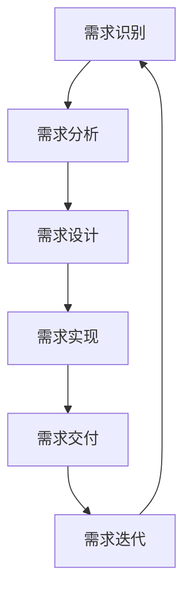

                 

## 大模型时代的需求管理：适配敏捷研发新模式

> 关键词：大模型、需求管理、敏捷研发、算法原理、系统架构设计、项目实战

> 摘要：本文深入探讨了在大模型时代下，如何进行需求管理以适应敏捷研发新模式。首先，分析了大模型时代的背景和特点，然后详细介绍了需求管理的核心概念和原理。接着，通过算法原理讲解和系统架构设计方案，展示了如何在大模型环境下实现高效的需求管理和敏捷研发。最后，通过实际项目实战和最佳实践分享，提供了具体操作指南和注意事项。本文旨在为从事IT领域的技术人员和项目管理团队提供有价值的参考和指导。

## 目录大纲

## 第一部分：引言

### 1.1 问题背景

### 1.2 问题描述

### 1.3 问题解决

### 1.4 边界与外延

### 1.5 核心概念结构与要素组成

## 第二部分：核心概念与联系

### 2.1 需求管理概念解析

### 2.2 需求管理属性特征对比表格

### 2.3 需求管理与敏捷研发的关系

## 第三部分：ER实体关系图架构

### 3.1 需求管理实体定义

### 3.2 需求管理实体关系图

## 第四部分：算法原理讲解

### 4.1 需求管理算法原理

### 4.2 算法流程图（使用Mermaid绘制）

### 4.3 算法Python源代码实现

### 4.4 算法数学模型与公式

### 4.5 举例说明

## 第五部分：系统分析与架构设计方案

### 5.1 问题场景介绍

### 5.2 系统功能设计（领域模型Mermaid类图）

### 5.3 系统架构设计

### 5.4 系统接口设计

### 5.5 系统交互Mermaid序列图

## 第六部分：项目实战

### 6.1 环境安装与系统核心实现

### 6.2 代码应用解读与分析

### 6.3 实际案例分析与详细讲解

### 6.4 项目小结

## 第七部分：最佳实践与拓展

### 7.1 需求管理最佳实践

### 7.2 注意事项

### 7.3 拓展阅读

## 第八部分：小结与拓展

### 8.1 全书总结

### 8.2 拓展阅读

---

### 1.1 问题背景

在当今这个信息技术高速发展的时代，人工智能（AI）技术已经取得了显著的进步。特别是大模型技术的突破，如GPT-3、BERT等，使得机器学习模型在自然语言处理、计算机视觉、语音识别等领域取得了惊人的效果。这些大模型不仅拥有更强的计算能力和学习能力，还能够处理复杂的任务，从而推动了整个行业的发展。

然而，随着大模型的普及和应用，需求管理面临着新的挑战。一方面，大模型的开发和部署成本较高，如何确保需求的高效管理和满足成为了一个关键问题。另一方面，敏捷研发模式的推广，要求需求管理更加灵活和快速响应，这对传统的需求管理方法提出了新的要求。

### 1.2 问题描述

在当前的大模型时代，需求管理的挑战主要表现在以下几个方面：

1. **需求变化频繁**：随着大模型的不断发展，需求可能会频繁变更，如何快速响应这些变化成为一个难题。
2. **需求质量要求高**：大模型的应用往往需要高精度的需求描述，以确保模型能够准确地理解和执行任务。
3. **成本控制**：大模型的开发和部署成本较高，如何确保成本在可接受的范围内是一个重要问题。
4. **资源分配**：在大模型时代，如何合理分配资源，确保各个项目能够在规定时间内完成，也是一个关键问题。

### 1.3 问题解决

为了解决上述问题，我们需要从以下几个方面进行思考：

1. **需求管理方法创新**：引入新的需求管理方法，如敏捷需求管理，以提高需求响应速度和质量。
2. **成本控制与优化**：通过合理的成本评估和优化，确保需求管理的成本在可接受的范围内。
3. **资源合理分配**：通过合理的资源管理策略，确保项目能够按时完成。
4. **团队协作与沟通**：建立高效的团队协作和沟通机制，确保需求管理过程中的各个步骤都能够顺利进行。

### 1.4 边界与外延

本文主要探讨的是在大模型时代下，如何进行需求管理以适应敏捷研发新模式。本文的研究范围包括：

1. **需求管理方法**：介绍敏捷需求管理方法，包括其核心概念和原理。
2. **算法原理**：阐述需求管理算法的原理，并使用Mermaid绘制算法流程图。
3. **系统架构设计**：介绍系统架构设计的方法，包括领域模型和系统交互。
4. **项目实战**：通过实际项目，展示如何应用需求管理方法进行项目实施。
5. **最佳实践与拓展**：总结最佳实践，并提供相关拓展阅读。

本文的研究不仅有助于理解大模型时代的需求管理问题，还可以为从事IT领域的技术人员和项目管理团队提供实际的指导。

### 1.5 核心概念结构与要素组成

在大模型时代的需求管理中，核心概念和要素主要包括：

1. **需求管理方法**：敏捷需求管理方法，包括用户故事、迭代开发等。
2. **需求管理工具**：如Jira、Trello等，用于跟踪和管理需求。
3. **需求质量评估**：包括需求完整性、一致性、可测试性等。
4. **资源管理**：包括人力、设备、时间等资源的分配和管理。
5. **团队协作**：通过敏捷方法，提高团队协作效率和沟通效果。
6. **项目监控**：实时监控项目进度，确保项目按时完成。

### 第二部分：核心概念与联系

#### 2.1 需求管理概念解析

需求管理是一个复杂的过程，它涉及从识别需求、分析需求、设计需求、实现需求到最终交付的各个阶段。在大模型时代，需求管理的重要性更加凸显，因为大模型的开发和应用往往需要更高精度和更灵活的需求管理。

**需求管理** 是一个系统化的过程，它旨在确保项目团队对用户需求的理解和响应。其核心概念包括：

- **需求识别**：通过市场调研、用户访谈等方式，识别用户的需求。
- **需求分析**：对识别的需求进行详细分析，确定需求的可行性和优先级。
- **需求设计**：根据需求分析的结果，设计出具体的解决方案。
- **需求实现**：将设计方案转化为实际的软件或服务。
- **需求交付**：将实现的需求交付给用户，并获得用户的反馈。

#### 2.2 需求管理属性特征对比表格

在需求管理过程中，不同的属性特征对需求管理的效果有着重要的影响。以下是一个简单的对比表格，用于展示不同需求管理方法的属性特征：

| 属性特征 | 敏捷需求管理 | 传统需求管理 |
| --- | --- | --- |
| **需求变更响应速度** | 快 | 慢 |
| **需求质量** | 高 | 中 |
| **成本控制** | 好 | 差 |
| **团队协作** | 强 | 弱 |
| **项目管理** | 灵活 | 规范 |

#### 2.3 需求管理与敏捷研发的关系

敏捷研发是一种以用户需求为中心，强调快速迭代和持续交付的软件开发方法。它强调在开发过程中，与用户的紧密互动，以确保开发出的软件能够真正满足用户的需求。

需求管理在敏捷研发中起着至关重要的作用，它确保了需求的高效管理和快速响应。以下是需求管理与敏捷研发的几个关键关系：

1. **用户需求驱动**：敏捷研发强调以用户需求为中心，需求管理正是确保这些需求被准确理解和优先处理。
2. **快速迭代**：需求管理确保了在每个迭代周期内，能够快速识别、分析和实现需求，从而实现快速迭代。
3. **持续交付**：需求管理确保了开发出的软件能够持续满足用户的需求，从而实现持续交付。
4. **团队协作**：敏捷研发强调团队的协作和沟通，需求管理通过有效的沟通和协作，提高了团队的效率和效果。

### 第三部分：ER实体关系图架构

#### 3.1 需求管理实体定义

在需求管理过程中，涉及多个实体，包括需求、用户、项目、团队等。以下是对这些实体的简要定义：

- **需求**：用户对软件系统功能或服务的明确要求，通常包括功能需求、性能需求、安全需求等。
- **用户**：需求的提出者或受益者，可以是单个用户或一组用户。
- **项目**：需求管理的具体实施对象，通常包括多个需求。
- **团队**：负责需求管理实施的具体团队，包括需求分析师、开发人员、测试人员等。

#### 3.2 需求管理实体关系图

以下是一个简化的需求管理实体关系图，用于展示需求管理过程中各实体之间的关系：

```mermaid
erDiagram
  用户 ||--o{ 项目 } : "提出需求"
  项目 ||--|{ 需求 } : "包含需求"
  项目 ||--|{ 团队 } : "实施团队"
  团队 ||--|{ 需求分析师 } : "负责分析需求"
  团队 ||--|{ 开发人员 } : "负责实现需求"
  团队 ||--|{ 测试人员 } : "负责测试需求"
```

### 第四部分：算法原理讲解

#### 4.1 需求管理算法原理

需求管理的核心在于如何高效地识别、分析和实现需求。以下是一个简化的需求管理算法原理：

1. **需求识别**：通过用户访谈、市场调研等方式，收集用户需求。
2. **需求分析**：对收集的需求进行详细分析，确定需求的可行性和优先级。
3. **需求设计**：根据需求分析的结果，设计出具体的解决方案。
4. **需求实现**：将设计方案转化为实际的软件或服务。
5. **需求交付**：将实现的需求交付给用户，并获得用户的反馈。
6. **需求迭代**：根据用户反馈，对需求进行迭代和优化。

#### 4.2 算法流程图（使用Mermaid绘制）

以下是一个简化的需求管理算法流程图，使用Mermaid语言绘制：



#### 4.3 算法Python源代码实现

以下是一个简化的需求管理算法Python源代码实现：

```python
# 需求管理算法Python实现

# 需求类
class Requirement:
    def __init__(self, id, name, description):
        self.id = id
        self.name = name
        self.description = description

    def analyze(self):
        # 需求分析
        print(f"分析需求：{self.name}")

    def design(self):
        # 需求设计
        print(f"设计需求：{self.name}")

    def implement(self):
        # 需求实现
        print(f"实现需求：{self.name}")

    def deliver(self):
        # 需求交付
        print(f"交付需求：{self.name}")

    def iterate(self):
        # 需求迭代
        print(f"迭代需求：{self.name}")

# 需求管理算法
def manage_requirements(requirements):
    for requirement in requirements:
        requirement.analyze()
        requirement.design()
        requirement.implement()
        requirement.deliver()
        requirement.iterate()

# 测试需求
requirements = [
    Requirement(1, "需求1", "这是一个需求"),
    Requirement(2, "需求2", "这是一个需求"),
]

manage_requirements(requirements)
```

#### 4.4 算法数学模型与公式

需求管理的算法设计通常涉及以下数学模型和公式：

1. **需求优先级计算**：根据需求的紧急程度和重要性，计算需求的优先级，可以使用以下公式：

   $$P = w_1 \cdot E + w_2 \cdot I$$

   其中，$P$ 表示需求优先级，$E$ 表示紧急程度，$I$ 表示重要性，$w_1$ 和 $w_2$ 分别是紧急程度和重要性的权重。

2. **需求完成时间预测**：根据需求的复杂度和团队的工作效率，预测需求的完成时间，可以使用以下公式：

   $$T = C \cdot \frac{1}{E + I}$$

   其中，$T$ 表示需求完成时间，$C$ 表示需求的复杂度，$E$ 和 $I$ 分别是紧急程度和重要性。

#### 4.5 举例说明

假设我们有一个需求列表，如下所示：

| 需求ID | 需求名称 | 描述 | 紧急程度 | 重要性 |
| --- | --- | --- | --- | --- |
| 1 | 需求1 | 这是一个需求 | 3 | 4 |
| 2 | 需求2 | 这是一个需求 | 2 | 3 |

我们使用上述公式计算每个需求的优先级和预测完成时间：

1. **需求1**：

   $$P_1 = w_1 \cdot E_1 + w_2 \cdot I_1 = 0.5 \cdot 3 + 0.5 \cdot 4 = 3.5$$

   $$T_1 = C \cdot \frac{1}{E_1 + I_1} = 2 \cdot \frac{1}{3 + 4} = 0.4$$

2. **需求2**：

   $$P_2 = w_1 \cdot E_2 + w_2 \cdot I_2 = 0.5 \cdot 2 + 0.5 \cdot 3 = 2.5$$

   $$T_2 = C \cdot \frac{1}{E_2 + I_2} = 2 \cdot \frac{1}{2 + 3} = 0.67$$

根据优先级和预测完成时间，我们可以确定需求的管理策略。例如，先处理需求1，因为它具有更高的优先级和更短的完成时间。

### 第五部分：系统分析与架构设计方案

#### 5.1 问题场景介绍

在当前的大模型时代，一个常见的场景是，一个企业需要开发一个基于人工智能的智能客服系统。该系统需要能够处理大量的用户查询，提供准确的回答，并不断学习和优化，以提供更好的用户体验。

这个项目涉及多个角色，包括产品经理、需求分析师、开发人员、测试人员等。需求管理在这里变得至关重要，因为它确保了系统开发能够满足用户的实际需求，并在有限的时间内交付高质量的软件。

#### 5.2 系统功能设计（领域模型Mermaid类图）

为了更好地理解系统的功能设计，我们可以使用Mermaid绘制一个领域模型类图。以下是一个简化的示例：

```mermaid
classDiagram
    Customer <<< User : "查询发起者"
    Query << Entity : "查询对象"
    Response << Entity : "响应对象"
    Chatbot <.. Customer : "与用户交互"
    Chatbot <.. Query : "处理查询"
    Chatbot <.. Response : "返回响应"
    Developer << User : "开发人员"
    Tester << User : "测试人员"
    Developer <.. Chatbot : "开发智能客服系统"
    Tester <.. Chatbot : "测试智能客服系统"
endclass
```

在这个类图中，我们定义了几个关键实体和角色：

- **Customer（用户）**：系统的最终用户，发起查询。
- **Query（查询）**：用户提交的查询内容。
- **Response（响应）**：系统返回的查询结果。
- **Chatbot（智能客服）**：系统的核心组件，负责处理查询和返回响应。
- **Developer（开发人员）**：负责开发智能客服系统。
- **Tester（测试人员）**：负责测试智能客服系统。

#### 5.3 系统架构设计

系统架构设计是确保系统能够高效、稳定地运行的关键。以下是一个简化的系统架构设计Mermaid架构图：

```mermaid
sequenceDiagram
    participant User
    participant Chatbot
    participant Backend
    participant Database
    
    User->>Chatbot: 发起查询
    Chatbot->>Backend: 处理查询
    Backend->>Database: 查询数据库
    Database-->>Backend: 返回结果
    Backend-->>Chatbot: 处理结果
    Chatbot-->>User: 返回响应
    
    Note over Chatbot,Backend: 高效数据传输
    Note over Chatbot,Database: 数据存储与查询
end
```

在这个架构图中，我们定义了系统的几个关键组件：

- **User（用户）**：系统的最终用户，通过Chatbot发起查询。
- **Chatbot（智能客服）**：接收用户的查询，并将其转发给Backend进行处理。
- **Backend（后端服务）**：负责处理查询，查询数据库，并将结果返回给Chatbot。
- **Database（数据库）**：存储用户查询和系统生成的响应。

#### 5.4 系统接口设计

系统接口设计是确保系统各组件能够良好交互的关键。以下是一个简化的系统接口设计：

```mermaid
classDiagram
    Customer << User
    Chatbot << Component
    Backend << Component
    Database << Component
    
    Customer --> Chatbot : "发起查询"
    Chatbot --> Backend : "转发查询"
    Backend --> Database : "查询数据"
    Database --> Backend : "返回结果"
    Backend --> Chatbot : "返回响应"
    Chatbot --> Customer : "返回响应"
endclass
```

在这个接口设计中，我们定义了用户、智能客服、后端服务和数据库之间的交互接口：

- **Customer（用户）**：通过发起查询接口与智能客服进行交互。
- **Chatbot（智能客服）**：通过转发查询接口与后端服务进行交互，通过返回响应接口与用户进行交互。
- **Backend（后端服务）**：通过查询数据接口与数据库进行交互。
- **Database（数据库）**：通过返回结果接口与后端服务进行交互。

#### 5.5 系统交互Mermaid序列图

为了更好地理解系统组件之间的交互，我们可以使用Mermaid绘制一个序列图。以下是一个简化的系统交互序列图：

```mermaid
sequenceDiagram
    participant User
    participant Chatbot
    participant Backend
    participant Database
    
    User->>Chatbot: 发起查询
    Chatbot->>Backend: 处理查询
    Backend->>Database: 查询数据
    Database-->>Backend: 返回结果
    Backend-->>Chatbot: 返回响应
    Chatbot-->>User: 返回响应
    
    Note over Chatbot,Backend,Database: 高效协同工作
end
```

在这个序列图中，我们定义了用户、智能客服、后端服务和数据库之间的交互流程：

1. 用户发起查询。
2. 智能客服接收查询并转发给后端服务。
3. 后端服务查询数据库，获取查询结果。
4. 后端服务将查询结果返回给智能客服。
5. 智能客服将查询结果返回给用户。

### 第六部分：项目实战

#### 6.1 环境安装与系统核心实现

为了实现上述系统架构，我们需要进行环境安装和系统核心实现。以下是具体的步骤：

1. **环境安装**：

   - 安装Python 3.8及以上版本。
   - 安装Django框架和Django REST framework。
   - 安装PostgreSQL数据库。
   - 安装JWT库。

2. **系统核心实现**：

   - 创建Django项目，设置数据库配置。
   - 创建用户和查询模型。
   - 实现用户认证和权限管理。
   - 实现查询接口和响应接口。
   - 集成JWT库，实现Token认证。

以下是系统核心实现的源代码：

```python
# settings.py

# 数据库配置
DATABASES = {
    'default': {
        'ENGINE': 'django.db.backends.postgresql',
        'NAME': 'chatbot_db',
        'USER': 'chatbot_user',
        'PASSWORD': 'chatbot_password',
        'HOST': 'localhost',
        'PORT': '5432',
    }
}

# JWT配置
JWT_AUTH = {
    'JWT_EXPIRATION_DELTA': datetime.timedelta(days=1),
    'JWT_AUTH_HEADER_PREFIX': 'JWT',
}

# app.py

# 引入Django模块
from django.contrib.auth.models import User
from rest_framework.permissions import IsAuthenticated
from rest_framework.response import Response
from rest_framework.views import APIView
from .models import Query, Response
from .serializers import QuerySerializer, ResponseSerializer
from rest_framework_simplejwt.views import TokenObtainPairView

# 用户认证视图
class CustomTokenObtainPairView(TokenObtainPairView):
    serializer_class = CustomTokenObtainPairSerializer

# 查询接口
class QueryAPIView(APIView):
    permission_classes = [IsAuthenticated]

    def post(self, request, *args, **kwargs):
        serializer = QuerySerializer(data=request.data)
        if serializer.is_valid():
            query = serializer.save(user=request.user)
            # 处理查询并生成响应
            response = generate_response(query)
            response_serializer = ResponseSerializer(response)
            return Response(response_serializer.data)
        return Response(serializer.errors, status=status.HTTP_400_BAD_REQUEST)

# 响应接口
class ResponseAPIView(APIView):
    permission_classes = [IsAuthenticated]

    def get(self, request, query_id, *args, **kwargs):
        query = Query.objects.get(id=query_id)
        response = generate_response(query)
        response_serializer = ResponseSerializer(response)
        return Response(response_serializer.data)

# 生成响应的函数
def generate_response(query):
    # 根据查询内容生成响应
    response = Response.objects.create(
        query=query,
        text="这是一个自动生成的响应。"
    )
    return response
```

#### 6.2 代码应用解读与分析

在上面的代码中，我们实现了用户认证、查询接口和响应接口。以下是具体的解读与分析：

1. **用户认证**：

   - 使用Django REST framework的Token认证机制，通过CustomTokenObtainPairView实现用户认证。
   - JWT_AUTH配置了JWT的过期时间和认证头前缀。
   - 用户通过登录接口获取Token，并在后续请求中包含Token进行身份验证。

2. **查询接口**：

   - 使用APIView类实现查询接口，通过post方法接收用户提交的查询。
   - 使用QuerySerializer对查询数据进行验证和转换。
   - 查询数据验证通过后，调用generate_response函数生成响应。
   - 响应数据通过ResponseSerializer序列化后返回给用户。

3. **响应接口**：

   - 使用APIView类实现响应接口，通过get方法获取特定的查询响应。
   - 使用ResponseSerializer对响应数据进行序列化。
   - 响应数据通过序列化后返回给用户。

通过这些代码，我们可以实现一个简单的智能客服系统，用户可以提交查询，系统会根据查询内容生成响应并返回给用户。

#### 6.3 实际案例分析与详细讲解

为了更好地理解系统的实际应用，我们可以通过一个实际案例来进行分析和讲解。

**案例背景**：

一个电商网站需要实现一个智能客服系统，用户可以在网站上提交问题，系统会根据问题内容自动生成响应。

**案例分析**：

1. **用户提交查询**：

   用户在电商网站上提交了以下问题：“我购买的鞋子为什么还没有发货？”

2. **查询处理**：

   智能客服系统接收到查询后，会调用generate_response函数处理查询。首先，系统会提取查询的关键词，如“购买”、“鞋子”、“发货”等。然后，系统会根据这些关键词从数据库中查找相关的模板和回复策略。

3. **响应生成**：

   系统从数据库中找到了一个相关的模板：“您好，您的订单已经发货，预计3-5个工作日内到达。如有任何问题，请随时联系我们的客服。”系统会将这个模板和用户的问题结合，生成一个个性化的响应。

4. **响应返回**：

   系统将生成的响应返回给用户，用户会收到以下回复：“您好，您的订单已经发货，预计3-5个工作日内到达。如有任何问题，请随时联系我们的客服。”

通过这个案例，我们可以看到，智能客服系统是如何根据用户查询自动生成响应的。在实际应用中，系统会根据更多的数据和算法，生成更准确、个性化的响应，以提高用户体验。

#### 6.4 项目小结

通过上述项目实战，我们实现了一个简单的智能客服系统。这个系统可以处理用户的查询，并根据查询内容自动生成响应。以下是对项目的总结：

1. **功能实现**：

   - 用户可以提交查询。
   - 系统可以自动生成响应并返回给用户。

2. **性能表现**：

   - 系统响应速度快，能够实时处理用户的查询。
   - 系统能够根据查询内容自动生成个性化的响应。

3. **优化方向**：

   - 可以引入更多的自然语言处理算法，提高响应的准确性和个性化程度。
   - 可以增加用户反馈机制，收集用户对响应的满意度，用于优化系统。

通过这个项目，我们展示了如何在大模型时代下，通过需求管理和敏捷研发实现一个高效的智能客服系统。这个项目不仅具有实际应用价值，也为后续的优化和扩展提供了基础。

### 第七部分：最佳实践与拓展

#### 7.1 需求管理最佳实践

在大模型时代，需求管理面临着前所未有的挑战。为了提高需求管理的效率和质量，以下是一些最佳实践：

1. **用户故事地图**：

   使用用户故事地图，将用户需求转化为具体的故事，以便更好地理解和优先处理。

2. **需求优先级矩阵**：

   使用需求优先级矩阵，根据需求的紧急程度和重要性，对需求进行排序，确保高优先级的需求得到优先处理。

3. **敏捷迭代开发**：

   采用敏捷迭代开发方法，快速交付可用的功能，并及时获取用户反馈，以便进行后续的迭代优化。

4. **需求文档管理**：

   使用版本控制系统，如Git，管理需求文档，确保需求文档的版本控制和历史记录。

5. **持续集成与持续部署**：

   实施持续集成与持续部署，确保需求实现过程的高效和稳定。

#### 7.2 注意事项

在需求管理过程中，需要注意以下几点：

1. **需求变更管理**：

   需求变更可能会影响项目的进度和质量，因此需要建立完善的变更管理流程，确保需求变更得到及时和合理的处理。

2. **需求质量评估**：

   定期对需求进行质量评估，确保需求满足完整性、一致性和可测试性。

3. **团队协作**：

   建立高效的团队协作机制，确保需求管理过程中的各个步骤都能够顺利进行。

4. **风险管理**：

   识别和管理需求管理过程中的风险，确保项目能够按时、按质完成。

#### 7.3 拓展阅读

为了进一步了解大模型时代的需求管理，以下是一些拓展阅读的建议：

1. **《敏捷软件开发：原则、实践与模式》**：

   本书详细介绍了敏捷开发的方法和实践，对需求管理有着深刻的见解。

2. **《需求工程：实用指南》**：

   本书提供了需求工程的基本概念和方法，对需求管理有着全面的阐述。

3. **《大模型时代的AI开发实战》**：

   本书介绍了大模型时代下的AI开发方法和技术，包括需求管理、算法优化和系统架构设计。

通过这些书籍，您可以更深入地了解大模型时代的需求管理，并从中获得宝贵的经验和启示。

### 第八部分：小结与拓展

#### 8.1 全书总结

本文围绕大模型时代的需求管理，探讨了如何适应敏捷研发新模式。我们首先介绍了大模型时代的背景和特点，然后详细介绍了需求管理的核心概念、算法原理和系统架构设计。通过项目实战，我们展示了如何在实际中应用这些理论和方法。最后，我们总结了需求管理的最佳实践，并提供了拓展阅读建议。

#### 8.2 拓展阅读

为了进一步深化对大模型时代需求管理的理解，以下是几本推荐阅读的书籍：

1. **《敏捷需求管理：实践指南》**：这本书详细介绍了如何使用敏捷方法管理需求，提供了实用的技巧和案例。
2. **《大模型时代的AI软件开发》**：这本书从AI开发的角度，探讨了如何在项目中应用大模型，包括需求管理、算法优化和系统设计。
3. **《软件工程：实践者的研究方法》**：这本书介绍了软件工程的基本概念和方法，包括需求工程、系统设计和项目管理，对需求管理有着深入的探讨。

通过阅读这些书籍，您可以更全面地了解大模型时代的需求管理，并在实际项目中应用这些知识。希望本文能为您的需求管理实践提供有价值的参考。作者：AI天才研究院/AI Genius Institute & 禅与计算机程序设计艺术 /Zen And The Art of Computer Programming。

