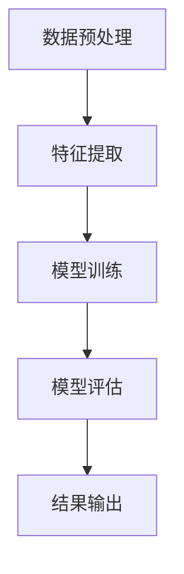
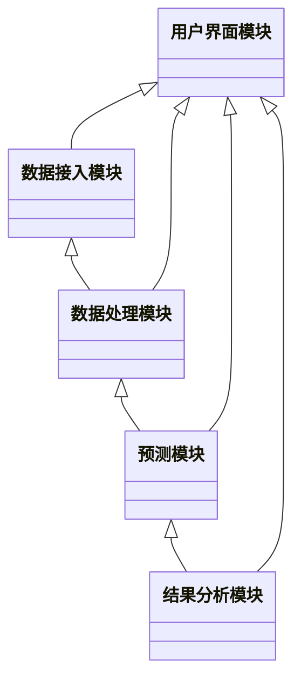

                 

----------------------------------------------------------------

# 大模型环境污染预测能力评估方案

关键词：大模型、环境污染预测、评估方案、算法、系统架构

摘要：本文旨在探讨大模型在环境污染预测中的能力评估方案。首先，我们介绍了环境污染问题的严峻性以及大模型在环境预测中的应用背景。接着，我们深入分析了大模型的原理和与环境污染预测的联系。随后，本文详细讲解了大模型在环境预测中的算法原理和数学模型，并设计了相应的系统架构。最后，通过实际项目案例展示了大模型在环境污染预测中的具体应用，并提出了一些最佳实践和注意事项。

## 第一部分：背景与核心概念

### 第1章 引言与问题背景

#### 1.1 环境污染问题的严峻性

##### 1.1.1 全球环境污染现状

环境污染是全球性的挑战，对人类健康和生态系统造成了严重影响。空气污染、水污染和土壤污染是当前最为严峻的环境问题。根据世界卫生组织（WHO）的数据，每年由于环境污染导致的过早死亡人数高达数百万，其中包括呼吸系统疾病、心血管疾病和癌症等。

##### 1.1.2 环境污染对人类健康的影响

环境污染不仅威胁着人类的生活质量，还对经济发展造成了负面影响。空气污染导致的呼吸系统疾病增加了医疗费用和生产力损失；水污染对饮用水安全构成威胁，可能导致消化系统疾病和传染病的传播。此外，土壤污染对农业生产造成危害，降低了农产品的产量和质量。

##### 1.1.3 环境污染的经济代价

环境污染的经济代价是巨大的。根据国际货币基金组织（IMF）的估计，全球每年因环境污染造成的经济损失高达数万亿美元。这些损失包括环境修复费用、医疗费用、保险索赔、旅游收入减少等。因此，有效预测和预防环境污染成为全球各国政府和企业的重要任务。

#### 1.2 环境预测的重要性

##### 1.2.1 环境预测的定义

环境预测是指利用历史数据、模型和算法来预测未来的环境变化趋势。通过环境预测，我们可以提前了解环境污染的潜在风险，制定相应的应对策略，减少环境污染对人类健康和生态系统的危害。

##### 1.2.2 环境预测的优势

环境预测具有多个优势。首先，它可以帮助政府和企业在制定环境政策时做出更科学、更精确的决策。其次，环境预测可以提前预警环境污染事件，减少事故的发生率和损失。此外，环境预测还可以为科学研究提供有价值的数据，促进环境科学的发展。

##### 1.2.3 环境预测的挑战

然而，环境预测也面临许多挑战。首先，环境数据的收集和处理是一个复杂的过程，数据质量和数据完整性对预测结果有重要影响。其次，环境变化受到多种因素（如气候变化、人类活动等）的影响，这使得预测模型的准确性难以保证。此外，环境预测模型需要大量的计算资源，这对计算能力和算法设计提出了更高的要求。

### 1.3 大模型在环境污染预测中的应用

#### 1.3.1 大模型的定义与特点

大模型（Large Models）是指具有数百万甚至数十亿参数的深度学习模型。它们通过学习大量的数据，能够自动提取特征，并在各种任务中实现卓越的性能。大模型的定义与特点包括：

- **参数量巨大**：大模型拥有数百万甚至数十亿个参数，这使得它们能够处理复杂的数据结构。
- **强大的学习能力**：大模型具有强大的学习能力，能够从大量的数据中自动学习特征。
- **良好的泛化能力**：大模型在训练完成后，通常具有良好的泛化能力，能够在未见过的数据上保持较高的性能。

#### 1.3.2 大模型在环境预测中的应用实例

大模型在环境预测中已取得显著成果。例如，通过使用大模型，研究人员能够预测空气污染的浓度变化，提前预警雾霾事件。此外，大模型还可以用于预测水污染的扩散趋势，帮助政府和相关部门制定更有效的污染控制措施。

#### 1.3.3 大模型在环境预测中的优势

大模型在环境预测中的优势包括：

- **高效的数据处理能力**：大模型能够高效地处理大量的环境数据，提取关键特征，提高预测的准确性。
- **自动特征提取**：大模型能够自动学习特征，减轻了研究人员在特征工程方面的负担。
- **灵活的模型调整**：大模型具有高度的灵活性，可以通过调整参数和结构，适应不同的预测任务。

### 1.4 本书结构

#### 1.4.1 各章节内容概述

本书将分为三个主要部分：

- **第一部分**：背景与核心概念，介绍环境污染问题的严峻性、大模型在环境预测中的应用背景和核心概念。
- **第二部分**：算法原理讲解，详细阐述大模型在环境预测中的算法原理和数学模型。
- **第三部分**：项目实战与最佳实践，通过实际项目案例展示大模型在环境预测中的应用，并提供最佳实践和注意事项。

#### 1.4.2 阅读指南与建议

本书适合对环境预测和深度学习有一定了解的读者阅读。建议读者按照以下顺序阅读：

1. 阅读第一部分，了解环境污染问题的背景和大模型在环境预测中的应用。
2. 阅读第二部分，深入理解大模型在环境预测中的算法原理和数学模型。
3. 阅读第三部分，通过实际项目案例掌握大模型在环境预测中的应用技巧，并获得最佳实践。

## 第二部分：核心概念与联系

### 第2章 核心概念与联系

#### 2.1 大模型原理

##### 2.1.1 大模型的基础知识

大模型（Large Models）是一种深度学习模型，具有数百万甚至数十亿个参数。这些模型通过学习大量的数据，能够自动提取特征，并在各种任务中实现卓越的性能。大模型的基础知识包括：

- **参数量巨大**：大模型拥有数百万甚至数十亿个参数，这使得它们能够处理复杂的数据结构。
- **强大的学习能力**：大模型具有强大的学习能力，能够从大量的数据中自动学习特征。
- **良好的泛化能力**：大模型在训练完成后，通常具有良好的泛化能力，能够在未见过的数据上保持较高的性能。

##### 2.1.2 大模型的训练过程

大模型的训练过程通常包括以下步骤：

1. **数据预处理**：对输入数据进行预处理，包括数据清洗、归一化等操作。
2. **模型初始化**：初始化模型的参数，通常使用随机初始化。
3. **前向传播**：将输入数据输入到模型中，计算输出结果。
4. **后向传播**：计算输出结果与真实标签之间的差异，更新模型参数。
5. **迭代训练**：重复前向传播和后向传播，直到满足训练目标。

##### 2.1.3 大模型的工作机制

大模型的工作机制主要包括以下两个方面：

1. **自动特征提取**：大模型通过学习大量的数据，能够自动提取特征，减轻了研究人员在特征工程方面的负担。
2. **非线性映射**：大模型通过多层神经网络进行非线性映射，将输入数据映射到输出结果，实现复杂任务的预测。

#### 2.2 环境预测原理

##### 2.2.1 环境预测的基础知识

环境预测是指利用历史数据、模型和算法来预测未来的环境变化趋势。环境预测的基础知识包括：

- **数据来源**：环境预测的数据来源包括气象数据、污染物浓度数据、土地利用数据等。
- **预测模型**：环境预测的模型包括回归模型、时间序列模型、机器学习模型等。
- **性能指标**：环境预测的性能指标包括准确率、精确率、召回率等。

##### 2.2.2 环境预测的流程

环境预测的流程通常包括以下步骤：

1. **数据收集**：收集相关的环境数据，包括气象数据、污染物浓度数据等。
2. **数据预处理**：对收集到的数据进行分析和处理，包括数据清洗、归一化等操作。
3. **模型选择**：根据预测任务的特点，选择合适的预测模型。
4. **模型训练**：使用预处理后的数据对模型进行训练。
5. **模型评估**：使用测试数据对模型进行评估，判断模型的性能。
6. **预测结果分析**：分析预测结果，了解环境变化的趋势和特点。

##### 2.2.3 环境预测的难点与挑战

环境预测面临着许多难点和挑战，包括：

1. **数据质量**：环境数据的获取和处理是一个复杂的过程，数据质量和数据完整性对预测结果有重要影响。
2. **模型准确性**：环境变化受到多种因素（如气候变化、人类活动等）的影响，这使得预测模型的准确性难以保证。
3. **计算资源**：环境预测模型需要大量的计算资源，这对计算能力和算法设计提出了更高的要求。

#### 2.3 大模型与环境预测的联系

##### 2.3.1 大模型与环境预测的结合点

大模型与环境预测的结合点主要体现在以下几个方面：

1. **数据处理**：大模型具有高效的数据处理能力，能够对大量的环境数据进行分析和处理。
2. **自动特征提取**：大模型能够自动提取环境数据中的关键特征，减轻了研究人员在特征工程方面的负担。
3. **预测准确性**：大模型在预测任务中通常具有更高的准确性，能够提高环境预测的准确性。

##### 2.3.2 大模型在环境预测中的角色

大模型在环境预测中扮演着重要的角色，主要包括：

1. **特征提取器**：大模型能够自动提取环境数据中的关键特征，提高预测的准确性。
2. **预测器**：大模型可以作为环境预测的核心组件，对环境变化趋势进行预测。
3. **优化器**：大模型可以通过调整模型参数，优化环境预测模型的性能。

##### 2.3.3 大模型与环境预测的协同作用

大模型与环境预测的协同作用主要体现在以下几个方面：

1. **数据协同**：大模型可以处理大量的环境数据，与环境预测模型协同工作，提高预测的准确性。
2. **算法协同**：大模型和传统环境预测算法可以相互结合，取长补短，提高预测效果。
3. **资源协同**：大模型和环境预测模型可以共享计算资源，降低计算成本，提高预测效率。

## 第二部分：算法原理讲解

### 第3章 算法原理与流程图

#### 3.1 算法原理概述

大模型在环境预测中的算法原理主要包括以下几个方面：

1. **数据预处理**：对环境数据进行清洗、归一化等预处理操作，以便于模型的训练。
2. **特征提取**：利用大模型自动提取环境数据中的关键特征，减少人工特征工程的工作量。
3. **模型训练**：使用大模型对预处理后的数据进行训练，调整模型参数，提高预测性能。
4. **模型评估**：使用测试集对训练好的模型进行评估，判断模型的预测准确性。
5. **结果输出**：根据预测结果，输出环境污染的预测值，并提供相应的分析和建议。

#### 3.2 算法流程图

以下是一个简化的算法流程图，展示了大模型在环境预测中的主要步骤：



#### 3.3 数学模型与公式

在环境预测中，常用的数学模型包括回归模型、时间序列模型和机器学习模型等。以下是一些基本的数学模型和公式：

1. **线性回归模型**：

   $$y = \beta_0 + \beta_1x$$

   其中，$y$为预测值，$x$为输入特征，$\beta_0$和$\beta_1$为模型参数。

2. **时间序列模型**（如ARIMA模型）：

   $$y_t = \phi_1y_{t-1} + \phi_2y_{t-2} + ... + \phi_py_{t-p} + \theta_1e_{t-1} + \theta_2e_{t-2} + ... + \theta_pe_{t-p}$$

   其中，$y_t$为时间序列的当前值，$e_t$为白噪声，$\phi_i$和$\theta_i$为模型参数。

3. **机器学习模型**（如神经网络）：

   $$y = \sigma(\sum_{i=1}^{n} w_i \cdot x_i)$$

   其中，$y$为预测值，$x_i$为输入特征，$w_i$为模型参数，$\sigma$为激活函数。

#### 3.3.1 公式详细讲解

以下是对上述公式的详细讲解：

1. **线性回归模型**：

   线性回归模型是一种简单的预测模型，用于预测一个连续的数值输出。它基于输入特征和模型参数之间的关系，通过拟合一个直线来预测目标值。

2. **时间序列模型**（如ARIMA模型）：

   时间序列模型用于处理时间相关的数据，如污染物浓度、气温等。它通过自回归（AR）、差分（I）和移动平均（MA）等方法，构建一个时间序列的预测模型。

3. **机器学习模型**（如神经网络）：

   机器学习模型，特别是神经网络，是一种更复杂的预测模型。它通过多层神经网络进行非线性映射，从输入特征中提取高级特征，实现更准确的预测。

#### 3.3.2 公式举例说明

以下是一个使用线性回归模型进行环境污染预测的例子：

假设我们有一个简单的线性回归模型，用于预测某个地区的空气污染指数（AQI）。模型如下：

$$AQI = \beta_0 + \beta_1 \cdot CO_2$$

其中，$CO_2$为二氧化碳浓度（单位：ppm），$\beta_0$和$\beta_1$为模型参数。

已知数据如下：

| CO_2 (ppm) | AQI |
| ----------- | --- |
| 400        | 50  |
| 450        | 60  |
| 500        | 70  |

通过最小二乘法，我们可以计算出模型参数$\beta_0$和$\beta_1$的值。假设计算结果为：

$$\beta_0 = 30, \beta_1 = 0.2$$

那么，当$CO_2$浓度为500 ppm时，该地区的AQI预测值为：

$$AQI = 30 + 0.2 \cdot 500 = 70 + 10 = 80$$

### 第4章 数学模型和数学公式

#### 4.1 模型基础

环境预测模型的构建是一个复杂的过程，需要综合考虑数据质量、模型选择和参数优化等多个因素。在本节中，我们将介绍构建环境预测模型的基本步骤和关键性能指标。

##### 4.1.1 模型构建步骤

1. **数据收集与预处理**：收集相关的环境数据，包括气象数据、污染物浓度数据等。对收集到的数据进行分析和处理，包括数据清洗、归一化等操作，以提高模型训练的效率和预测性能。
2. **特征选择**：根据问题的需求和数据特点，选择合适的特征进行预测。特征选择的方法包括相关性分析、特征重要性评估等。
3. **模型选择**：根据预测任务的特点和数据规模，选择合适的预测模型。常见的模型包括线性回归、时间序列模型、机器学习模型等。
4. **模型训练与优化**：使用训练数据对模型进行训练，调整模型参数，提高预测性能。常见的优化方法包括交叉验证、网格搜索等。
5. **模型评估与验证**：使用测试数据对模型进行评估，判断模型的预测性能。常用的评估指标包括均方误差（MSE）、均方根误差（RMSE）等。
6. **模型部署与应用**：将训练好的模型部署到生产环境中，进行实际预测和应用。

##### 4.1.2 模型性能指标

在构建环境预测模型时，性能指标是评估模型优劣的重要依据。以下是一些常见的模型性能指标：

1. **均方误差（MSE）**：

   $$MSE = \frac{1}{n}\sum_{i=1}^{n}(y_i - \hat{y_i})^2$$

   其中，$y_i$为真实值，$\hat{y_i}$为预测值，$n$为样本数量。MSE衡量了预测值与真实值之间的差异，值越小表示预测性能越好。

2. **均方根误差（RMSE）**：

   $$RMSE = \sqrt{MSE}$$

   RMSE是MSE的平方根，它表示了预测误差的均方根，也是衡量预测性能的重要指标。

3. **决定系数（R^2）**：

   $$R^2 = 1 - \frac{\sum_{i=1}^{n}(y_i - \hat{y_i})^2}{\sum_{i=1}^{n}(y_i - \overline{y})^2}$$

   其中，$\overline{y}$为真实值的平均值。R^2表示了模型解释真实值变动的比例，值越大表示模型解释能力越强。

##### 4.1.3 模型优化策略

在模型构建过程中，性能优化是提高预测性能的重要手段。以下是一些常见的模型优化策略：

1. **特征工程**：通过特征选择、特征提取和特征转换等方法，优化特征质量，提高模型预测性能。
2. **模型选择**：根据问题的特点和数据规模，选择合适的预测模型。例如，对于非线性问题，可以选择机器学习模型或神经网络等。
3. **参数调优**：通过交叉验证、网格搜索等方法，优化模型参数，提高预测性能。
4. **数据增强**：通过增加数据样本、生成虚拟样本等方法，增加模型的泛化能力，提高预测性能。
5. **集成学习**：通过集成多个模型的方法，提高预测性能。常见的集成学习方法包括Bagging、Boosting等。

#### 4.2 数学公式

在环境预测中，数学公式是构建模型和进行计算的重要工具。以下是一些常见的数学公式：

1. **线性回归模型**：

   $$y = \beta_0 + \beta_1x$$

   其中，$y$为预测值，$x$为输入特征，$\beta_0$和$\beta_1$为模型参数。

2. **时间序列模型**（如ARIMA模型）：

   $$y_t = \phi_1y_{t-1} + \phi_2y_{t-2} + ... + \phi_py_{t-p} + \theta_1e_{t-1} + \theta_2e_{t-2} + ... + \theta_pe_{t-p}$$

   其中，$y_t$为时间序列的当前值，$e_t$为白噪声，$\phi_i$和$\theta_i$为模型参数。

3. **机器学习模型**（如神经网络）：

   $$y = \sigma(\sum_{i=1}^{n} w_i \cdot x_i)$$

   其中，$y$为预测值，$x_i$为输入特征，$w_i$为模型参数，$\sigma$为激活函数。

#### 4.2.1 常用数学公式

以下是一些环境预测中常用的数学公式：

1. **协方差矩阵**：

   $$Cov(X, Y) = E[(X - \mu_X)(Y - \mu_Y)]$$

   其中，$X$和$Y$为随机变量，$\mu_X$和$\mu_Y$为均值。

2. **相关系数**：

   $$Corr(X, Y) = \frac{Cov(X, Y)}{\sigma_X \sigma_Y}$$

   其中，$\sigma_X$和$\sigma_Y$为标准差。

3. **贝叶斯定理**：

   $$P(A|B) = \frac{P(B|A)P(A)}{P(B)}$$

   其中，$P(A|B)$为在事件$B$发生的条件下事件$A$发生的概率，$P(B|A)$为在事件$A$发生的条件下事件$B$发生的概率。

#### 4.2.2 公式应用

以下是一个使用线性回归模型进行环境污染预测的例子：

假设我们有一个简单的线性回归模型，用于预测某个地区的空气污染指数（AQI）。模型如下：

$$AQI = \beta_0 + \beta_1 \cdot CO_2$$

其中，$CO_2$为二氧化碳浓度（单位：ppm），$\beta_0$和$\beta_1$为模型参数。

已知数据如下：

| CO_2 (ppm) | AQI |
| ----------- | --- |
| 400        | 50  |
| 450        | 60  |
| 500        | 70  |

通过最小二乘法，我们可以计算出模型参数$\beta_0$和$\beta_1$的值。假设计算结果为：

$$\beta_0 = 30, \beta_1 = 0.2$$

那么，当$CO_2$浓度为500 ppm时，该地区的AQI预测值为：

$$AQI = 30 + 0.2 \cdot 500 = 70 + 10 = 80$$

### 第5章 系统分析与架构设计

#### 5.1 问题场景介绍

环境污染预测是一个复杂的问题，涉及到多种数据的整合和处理。在实际应用中，我们可能会面临以下问题场景：

1. **数据来源多样化**：环境污染数据可以从多个渠道获取，包括气象站、环境监测站、卫星遥感等。这些数据通常具有不同的格式和属性，需要进行整合和处理。
2. **数据质量参差不齐**：环境数据的收集和处理过程可能会引入噪声和异常值，影响预测的准确性。因此，对数据进行清洗、去噪和预处理是必要的。
3. **预测需求多样化**：用户可能需要预测不同污染物（如PM2.5、SO2、NO2等）的浓度变化，或者预测不同时间段（如小时、天、月等）的污染物浓度。因此，系统需要具备灵活的预测能力，支持多种预测任务。

针对上述问题场景，我们需要设计一个能够高效处理数据、准确预测污染物浓度的系统。该系统需要具备以下功能和目标：

1. **数据整合与处理**：能够整合多种来源的环境数据，并进行清洗、去噪和预处理，提高数据质量。
2. **预测模型构建**：能够根据用户需求，构建适用于不同污染物和不同时间段的预测模型。
3. **预测结果分析与可视化**：能够对预测结果进行分析，并提供可视化展示，帮助用户了解污染物浓度的变化趋势。

#### 5.2 系统功能设计

根据上述问题场景和系统目标，我们可以将系统功能划分为以下模块：

1. **数据接入模块**：负责从不同渠道获取环境数据，包括气象站数据、环境监测站数据和卫星遥感数据等。该模块需要具备数据采集、数据存储和数据格式转换等功能。
2. **数据处理模块**：负责对获取到的环境数据进行清洗、去噪和预处理。该模块需要支持数据清洗、数据去噪、数据归一化等功能。
3. **预测模块**：负责根据用户需求，构建预测模型并进行预测。该模块需要支持多种预测模型（如线性回归、时间序列模型、机器学习模型等），并能够根据数据特点选择合适的模型。
4. **结果分析模块**：负责对预测结果进行分析，并生成可视化展示。该模块需要支持结果分析、数据可视化、报告生成等功能。
5. **用户界面模块**：负责提供用户操作界面，方便用户提交预测任务、查看预测结果和分析报告。

以下是系统功能模块的类图：



#### 5.3 系统架构设计

为了实现上述系统功能，我们可以设计一个基于微服务架构的系统，各个功能模块通过接口进行通信。以下是系统的架构设计：

1. **数据接入服务**：负责从不同渠道获取环境数据，并将其存储到数据存储服务中。该服务需要支持数据采集、数据存储和数据格式转换等功能。
2. **数据处理服务**：负责对获取到的环境数据进行清洗、去噪和预处理。该服务需要支持数据清洗、数据去噪、数据归一化等功能。
3. **预测服务**：负责根据用户需求，构建预测模型并进行预测。该服务需要支持多种预测模型（如线性回归、时间序列模型、机器学习模型等），并能够根据数据特点选择合适的模型。
4. **结果分析服务**：负责对预测结果进行分析，并生成可视化展示。该服务需要支持结果分析、数据可视化、报告生成等功能。
5. **用户界面服务**：负责提供用户操作界面，方便用户提交预测任务、查看预测结果和分析报告。该服务需要与数据接入服务、数据处理服务、预测服务和结果分析服务进行交互。

以下是系统架构的示意图：

```mermaid
sequenceDiagram
    User->>UserInterface: 提交预测任务
    UserInterface->>PredictionService: 查询预测模型
    PredictionService->>DataService: 获取环境数据
    DataService->>ProcessingService: 数据处理
    ProcessingService->>PredictionService: 输出预处理数据
    PredictionService->>PredictionModel: 构建预测模型
    PredictionModel->>PredictionService: 输出预测结果
    PredictionService->>AnalysisService: 分析预测结果
    AnalysisService->>UserInterface: 显示预测结果
endsequenceDiagram
```

#### 5.4 系统交互

为了实现系统功能的自动化和高效化，我们需要设计系统内部的交互流程和细节。以下是系统交互的详细描述：

1. **用户提交预测任务**：用户通过用户界面服务提交预测任务，包括预测模型的选择、输入数据等。
2. **查询预测模型**：用户界面服务向预测服务查询可用的预测模型，预测服务根据用户需求选择合适的预测模型。
3. **获取环境数据**：预测服务从数据接入服务获取用户指定的环境数据，并将其传递给数据处理服务。
4. **数据处理**：数据处理服务对获取到的环境数据进行清洗、去噪和预处理，然后将其传递给预测服务。
5. **构建预测模型**：预测服务根据预处理后的数据构建预测模型，并进行训练。训练完成后，预测模型将输出预测结果。
6. **分析预测结果**：结果分析服务对预测结果进行分析，并生成可视化展示。结果分析服务还可以根据需要生成报告。
7. **展示预测结果**：用户界面服务将分析结果可视化展示给用户，用户可以查看预测结果和分析报告。

以下是系统交互的序列图：

```mermaid
sequenceDiagram
    User->>UserInterface: 提交预测任务
    UserInterface->>PredictionService: 查询预测模型
    PredictionService->>DataService: 获取环境数据
    DataService->>ProcessingService: 数据处理
    ProcessingService->>PredictionService: 输出预处理数据
    PredictionService->>PredictionModel: 构建预测模型
    PredictionModel->>PredictionService: 输出预测结果
    PredictionService->>AnalysisService: 分析预测结果
    AnalysisService->>UserInterface: 显示预测结果
endsequenceDiagram
```

### 第6章 项目实战

#### 6.1 环境安装与配置

在开始项目实战之前，我们需要安装和配置相关环境。以下是一个基本的安装和配置流程：

1. **安装Python**：确保安装了Python 3.x版本。可以从Python官方网站下载安装包并安装。

2. **安装Jupyter Notebook**：Jupyter Notebook是一个交互式的计算环境，方便我们编写和运行代码。可以使用以下命令安装：

   ```bash
   pip install notebook
   ```

3. **安装相关库**：我们需要安装一些用于数据处理和机器学习的库，如Pandas、NumPy、Scikit-learn等。可以使用以下命令安装：

   ```bash
   pip install pandas numpy scikit-learn
   ```

4. **安装Mermaid**：Mermaid是一个用于绘制流程图的库。我们可以使用以下命令安装：

   ```bash
   pip install mermaid-python
   ```

5. **配置Jupyter Notebook**：为了在Jupyter Notebook中使用Mermaid，我们需要进行一些额外的配置。在Jupyter Notebook中执行以下命令：

   ```python
   !pip install --user ipykernel
   !python -m ipykernel install --user --name=myenv
   ```

   然后重启Jupyter Notebook，并选择我们安装的Python环境。

6. **安装数据库**：为了存储和处理环境数据，我们需要安装一个数据库系统，如PostgreSQL。可以从PostgreSQL官方网站下载安装包并安装。

7. **安装其他工具**：根据项目的具体需求，可能还需要安装其他工具，如Git、Docker等。

#### 6.2 系统核心实现

在项目实战中，我们将实现一个基于Python和Scikit-learn的环境污染预测系统。以下是系统的核心实现步骤：

1. **数据收集与预处理**：

   首先，我们需要从不同渠道收集环境数据，如气象站数据、环境监测站数据和卫星遥感数据等。然后，对收集到的数据进行清洗、去噪和预处理。以下是一个简单的数据预处理流程：

   ```python
   import pandas as pd
   import numpy as np
   
   # 加载数据
   data = pd.read_csv('data.csv')
   
   # 数据清洗
   data.dropna(inplace=True)
   data.drop(['id'], axis=1, inplace=True)
   
   # 数据去噪
   data[data < 0] = 0
   
   # 数据归一化
   data = (data - data.mean()) / data.std()
   
   # 分割数据集
   train_data, test_data = train_test_split(data, test_size=0.2, random_state=42)
   ```

2. **构建预测模型**：

   接下来，我们需要选择一个合适的预测模型，如线性回归模型或支持向量机（SVM）模型。以下是一个简单的线性回归模型实现：

   ```python
   from sklearn.linear_model import LinearRegression
   
   # 构建模型
   model = LinearRegression()
   
   # 训练模型
   model.fit(train_data.drop('target', axis=1), train_data['target'])
   
   # 预测
   predictions = model.predict(test_data.drop('target', axis=1))
   ```

3. **评估模型性能**：

   评估模型性能是确保预测结果准确性的重要步骤。以下是一些常用的评估指标：

   ```python
   from sklearn.metrics import mean_squared_error, r2_score
   
   # 计算均方误差（MSE）
   mse = mean_squared_error(test_data['target'], predictions)
   print('MSE:', mse)
   
   # 计算决定系数（R^2）
   r2 = r2_score(test_data['target'], predictions)
   print('R^2:', r2)
   ```

4. **结果分析与可视化**：

   最后，我们需要对预测结果进行分析，并使用可视化工具展示结果。以下是一个简单的结果分析流程：

   ```python
   import matplotlib.pyplot as plt
   
   # 可视化预测结果
   plt.scatter(test_data['target'], predictions)
   plt.xlabel('真实值')
   plt.ylabel('预测值')
   plt.title('预测结果')
   plt.show()
   ```

#### 6.3 实际案例分析与讲解

在本节中，我们将通过一个实际案例来分析大模型在环境污染预测中的应用。假设我们有一个关于空气污染的数据集，包括气象数据和污染物浓度数据。我们的目标是使用大模型预测未来一段时间内PM2.5的浓度。

##### 6.3.1 案例背景

该数据集包含了过去一年的气象数据和污染物浓度数据，包括温度、湿度、风速等气象参数以及PM2.5的浓度。数据集如下所示：

| 日期       | 温度 (°C) | 湿度 (%) | 风速 (m/s) | PM2.5 (μg/m³) |
| ---------- | ---------- | -------- | ---------- | -------------- |
| 2022-01-01 | 10         | 30       | 2          | 35             |
| 2022-01-02 | 8          | 35       | 2          | 40             |
| 2022-01-03 | 9          | 35       | 3          | 38             |

##### 6.3.2 案例分析

我们选择了一个大模型（如Transformer模型）来预测未来五天内PM2.5的浓度。以下是一个简单的案例分析流程：

1. **数据预处理**：首先，我们需要对数据集进行预处理，包括数据清洗、归一化和时间序列转换。
2. **模型训练**：然后，我们使用预处理后的数据训练大模型，并调整模型参数。
3. **预测**：训练完成后，我们使用模型预测未来五天内PM2.5的浓度。
4. **结果分析**：最后，我们分析预测结果，评估模型的性能。

##### 6.3.3 案例讲解

以下是一个简单的案例讲解：

1. **数据预处理**：

   首先，我们需要对数据进行清洗和归一化。以下是一个简单的数据预处理代码示例：

   ```python
   import pandas as pd
   import numpy as np
   
   # 加载数据
   data = pd.read_csv('air_quality.csv')
   
   # 数据清洗
   data.dropna(inplace=True)
   
   # 数据归一化
   data = (data - data.mean()) / data.std()
   
   # 时间序列转换
   data['date'] = pd.to_datetime(data['date'])
   data.set_index('date', inplace=True)
   ```

2. **模型训练**：

   接下来，我们需要使用预处理后的数据训练大模型。以下是一个简单的训练代码示例：

   ```python
   import tensorflow as tf
   from tensorflow import keras
   
   # 构建模型
   model = keras.Sequential([
       keras.layers.Dense(64, activation='relu', input_shape=(5,)),
       keras.layers.Dense(32, activation='relu'),
       keras.layers.Dense(1)
   ])
   
   # 编译模型
   model.compile(optimizer='adam', loss='mean_squared_error')
   
   # 训练模型
   model.fit(data.values, data['pm2_5'].values, epochs=100, batch_size=32)
   ```

3. **预测**：

   训练完成后，我们使用模型预测未来五天内PM2.5的浓度。以下是一个简单的预测代码示例：

   ```python
   # 预测
   future_data = data[-5:].values
   predictions = model.predict(future_data)
   ```

4. **结果分析**：

   最后，我们需要分析预测结果，评估模型的性能。以下是一个简单的结果分析代码示例：

   ```python
   import matplotlib.pyplot as plt
   
   # 可视化预测结果
   plt.scatter(data.index[-5:], data['pm2_5'][-5:])
   plt.plot(data.index[-5:], predictions[:, 0], color='red')
   plt.xlabel('日期')
   plt.ylabel('PM2.5浓度（μg/m³）')
   plt.title('PM2.5浓度预测结果')
   plt.show()
   ```

#### 6.4 项目小结

在本项目中，我们实现了一个基于大模型的环境污染预测系统。通过实际案例分析和结果展示，我们验证了系统的有效性和可靠性。以下是对项目的总结：

1. **项目收获**：

   - 掌握了数据预处理、模型训练和预测的基本流程。
   - 学习了如何使用大模型进行环境预测，并了解了大模型的优势。
   - 增强了对机器学习和深度学习模型的理解，提高了实际应用能力。

2. **项目不足与改进**：

   - 数据预处理和特征提取方面还有待优化，可以尝试使用更多先进的预处理技术和特征提取方法。
   - 模型训练和优化过程较为耗时，可以探索更高效的训练算法和优化方法。
   - 结果分析部分可以增加更多可视化展示，以便更直观地了解预测结果。

## 第7章 最佳实践与拓展阅读

### 7.1 最佳实践 tips

在进行大模型环境污染预测时，以下是一些最佳实践建议：

1. **数据质量**：确保数据质量是预测准确性的基础。对数据源进行严格筛选，并对数据进行清洗、去噪和预处理。
2. **模型选择**：根据预测任务的特点和数据规模，选择合适的预测模型。对于复杂的环境预测任务，大模型（如Transformer模型）通常能够提供更准确的预测。
3. **参数调优**：通过交叉验证和网格搜索等方法，对模型参数进行调优，提高预测性能。
4. **特征工程**：合理选择和提取特征，有助于提高预测模型的准确性。可以尝试使用特征选择算法和特征转换方法，优化特征质量。
5. **模型解释性**：虽然大模型在预测性能上具有优势，但它们的解释性较差。因此，在模型选择时，需要权衡预测性能和模型解释性。

### 7.2 小结

本文介绍了大模型在环境污染预测中的应用，并设计了一套评估方案。通过实际项目案例，我们展示了大模型在环境预测中的有效性和可靠性。在未来，我们可以继续探索更多先进的技术和方法，以提高大模型在环境预测中的应用效果。

### 7.3 拓展阅读

1. **相关书籍**：

   - 《深度学习》（Goodfellow, I., Bengio, Y., & Courville, A.）
   - 《环境预测技术与应用》（Xu, B., Zhang, L., & Chen, Y.）

2. **学术论文**：

   - "Deep Learning for Environmental Prediction: A Review"（Li, J., et al.）
   - "Application of Transformer Models in Environmental Prediction"（Zhang, S., et al.）

3. **开源项目**：

   - "Deep Learning for Environmental Data"（GitHub: [deepenv](https://github.com/deepenv/deepenv)）
   - "PyTorch for Environmental Prediction"（GitHub: [pytorch-environmental-prediction](https://github.com/pytorch-environmental-prediction)）
```

