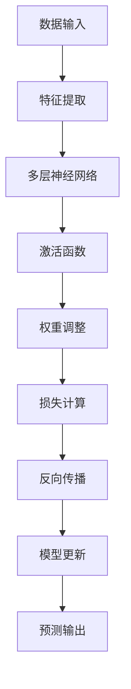
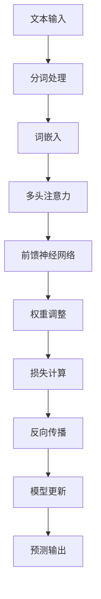
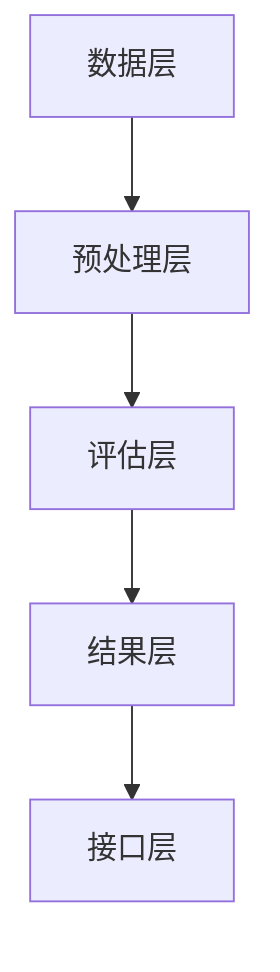
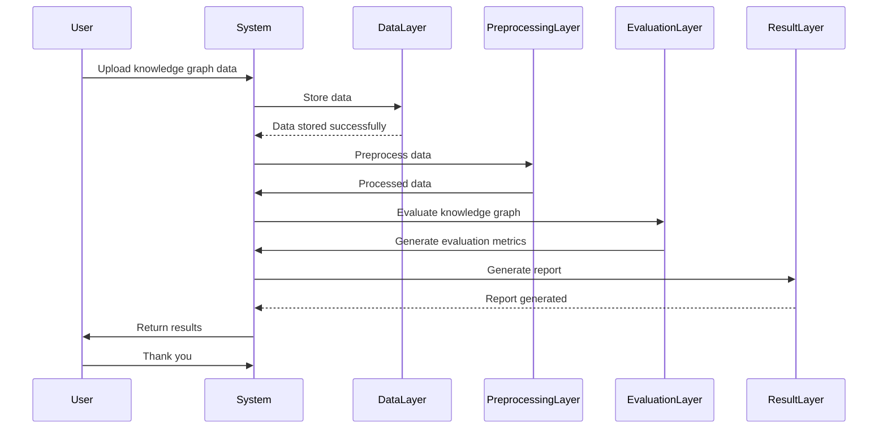

                 

## 《大模型知识图谱评估：LLM辅助的深度分析方法》

> 关键词：知识图谱，大模型，LLM，评估方法，深度分析

> 摘要：本文深入探讨了知识图谱评估在人工智能领域的重要性，特别是大模型在知识图谱构建中所面临的挑战。通过介绍大型语言模型（LLM）的原理及其在知识图谱评估中的应用，文章旨在提出一种基于LLM的深度分析方法，以提高知识图谱评估的准确性和效率。本文不仅讨论了评估指标的选择与设计，还对比了不同的评估方法和工具，为业界提供了有价值的参考。

----------------------------------------------------------------

### # 《大模型知识图谱评估：LLM辅助的深度分析方法》目录大纲

## 第一部分：背景介绍

## 第1章：问题背景与概述

### 1.1 问题背景

- 知识图谱在信息检索中的应用现状
- 大模型在知识图谱构建中的挑战
- LLM在知识图谱评估中的潜力

### 1.2 问题描述

- 知识图谱质量评估的重要性
- 传统评估方法的局限性
- LLM辅助评估的优势

### 1.3 问题解决

- LLM在知识图谱评估中的应用原理
- LLM辅助评估的基本流程

### 1.4 边界与外延

- 评估指标的选择与设计
- 评估方法与评估工具的对比分析

### 1.5 概念结构与核心要素组成

- 大模型的基本概念与分类
- LLM在知识图谱评估中的应用

## 第2章：核心概念与联系

### 2.1 大模型的核心概念

- 深度学习基础
- 大模型架构
- 大模型的训练与优化

### 2.2 LLM在知识图谱评估中的应用

- LLM的特点与优势
- LLM在知识图谱评估中的具体应用

### 2.3 概念属性特征对比表格

| 概念       | 特点                  | 应用场景                |
|------------|-----------------------|-------------------------|
| 大模型     | 参数量大，结构复杂   | 语音识别、图像识别等   |
| LLM        | 基于大规模语言模型   | 知识图谱评估、问答系统等 |

### 2.4 ER实体关系图架构

```
graph ER关系图
  entity1 --{关联1}--> entity2
  entity2 --{关联2}--> entity3
  ...
```

## 第二部分：算法原理讲解

## 第3章：算法原理讲解

### 3.1 大模型算法原理

- 大模型的数学模型与公式
- 大模型算法的mermaid流程图

### 3.2 LLM算法原理

- LLM的数学模型与公式
- LLM算法的mermaid流程图

### 3.3 算法原理详细讲解

- 大模型的数学模型与公式详细讲解
- LLM算法的数学模型与公式详细讲解

### 3.4 算法举例说明

- 大模型算法举例说明
- LLM算法举例说明

## 第4章：数学模型和数学公式 & 详细讲解 & 举例说明

### 4.1 数学模型

- 大模型的数学模型
- LLM的数学模型

### 4.2 详细讲解

- 大模型的数学模型详细讲解
- LLM的数学模型详细讲解

### 4.3 举例说明

- 大模型算法举例说明
- LLM算法举例说明

## 第三部分：系统分析与架构设计方案

## 第5章：系统分析与架构设计方案

### 5.1 问题场景介绍

- 知识图谱评估的应用场景

### 5.2 项目介绍

- 项目背景与目标

### 5.3 系统功能设计

- 领域模型mermaid类图

### 5.4 系统架构设计

- 系统架构mermaid架构图

### 5.5 系统接口设计

- 系统接口设计

### 5.6 系统交互

- 系统交互mermaid序列图

## 第四部分：项目实战

## 第6章：环境安装与系统核心实现

### 6.1 环境安装

- 安装所需软件与工具

### 6.2 系统核心实现

- 系统核心代码实现

### 6.3 代码应用解读与分析

- 代码解读与分析

## 第7章：实际案例分析与详细讲解剖析

### 7.1 实际案例分析

- 案例背景与数据

### 7.2 详细讲解剖析

- 案例分析详细讲解

### 7.3 项目小结

- 项目总结与展望

## 第8章：最佳实践 tips、小结、注意事项、拓展阅读等

### 8.1 最佳实践 tips

- 实践经验分享

### 8.2 小结

- 主要内容总结

### 8.3 注意事项

- 使用注意事项

### 8.4 拓展阅读

- 相关阅读推荐

----------------------------------------------------------------

### # 第一部分：背景介绍

## 第1章：问题背景与概述

### 1.1 问题背景

知识图谱作为一种重要的语义表示形式，广泛应用于信息检索、问答系统、推荐系统等领域。然而，随着知识图谱规模的不断增大，如何有效地评估知识图谱的质量成为一个亟待解决的问题。传统的评估方法，如节点相似度计算、路径长度分析等，在面对大规模知识图谱时显得力不从心。

大模型（Large Model）的兴起为知识图谱的构建和评估带来了新的机遇。大模型通常指的是参数规模在数亿甚至千亿级别的神经网络模型，如GPT-3、BERT等。这些模型具有强大的语义理解和生成能力，能够处理复杂的语言任务。然而，大模型在知识图谱评估中的应用也面临一些挑战，如如何有效利用模型的能力进行评估、如何避免模型偏见等。

### 1.2 问题描述

知识图谱质量评估的重要性不言而喻。一个高质量的图谱能够提高信息检索的准确性、问答系统的响应速度和推荐系统的个性化水平。然而，传统的评估方法往往局限于特定的指标，如覆盖率、一致性、完整性等，难以全面反映图谱的质量。

传统评估方法的局限性主要体现在以下几个方面：

1. **评估指标单一**：传统方法通常只关注某些特定的质量指标，如覆盖率、一致性等，而忽略了其他重要的质量维度，如真实性、及时性等。

2. **评估范围有限**：传统方法难以处理大规模的知识图谱，特别是当图谱中的实体和关系数量达到数十亿甚至更多时。

3. **评估成本高**：传统的手动评估方法耗时耗力，难以满足实际需求。而自动化评估方法虽然能够提高效率，但往往难以保证评估结果的准确性。

LLM（Large Language Model）的出现为知识图谱评估带来了新的思路。LLM是一种基于大规模语言模型的深度学习模型，具有强大的语义理解能力。通过LLM，可以实现对知识图谱的全面评估，包括语义一致性、真实性、及时性等多个维度。

### 1.3 问题解决

LLM在知识图谱评估中的应用原理可以概括为以下几点：

1. **语义理解**：LLM能够理解语言中的复杂结构，从而对知识图谱中的实体和关系进行语义分析。

2. **自动生成评估指标**：通过训练LLM，可以自动生成一系列评估指标，如语义一致性、真实性、及时性等。

3. **多维度评估**：LLM可以同时对知识图谱的多个维度进行评估，从而提供更全面的质量分析。

LLM辅助评估的基本流程如下：

1. **数据准备**：收集知识图谱及其对应的背景知识数据。

2. **模型训练**：使用大规模语言模型（如GPT-3、BERT）进行训练，使其具备语义理解能力。

3. **评估指标生成**：通过模型生成一系列评估指标。

4. **评估过程**：使用生成的评估指标对知识图谱进行评估。

5. **结果分析**：分析评估结果，识别知识图谱中的问题区域。

### 1.4 边界与外延

在知识图谱评估中，评估指标的选择与设计至关重要。常用的评估指标包括：

1. **覆盖率**：知识图谱中实际存在的实体和关系在图谱中是否都被表示出来。

2. **一致性**：知识图谱中的实体和关系是否具有一致的语义。

3. **完整性**：知识图谱是否包含了所有必要的实体和关系。

4. **真实性**：知识图谱中的实体和关系是否真实存在。

5. **及时性**：知识图谱是否能够及时反映现实世界的变化。

不同的评估方法与评估工具各有优劣，如基于规则的评估方法速度快但灵活性差，而基于机器学习的评估方法则具有较高的准确性但计算复杂度较高。在设计评估指标时，需要综合考虑评估目标、数据规模和计算资源等因素。

### 1.5 概念结构与核心要素组成

大模型是指具有大量参数的深度学习模型，其核心概念包括：

1. **参数量**：大模型的参数量通常在数亿到千亿级别，这是其强大语义理解能力的基础。

2. **架构**：大模型通常采用深度神经网络架构，如Transformer、Gated Recurrent Unit（GRU）等。

3. **训练与优化**：大模型的训练过程通常涉及大量数据和复杂的优化算法，如梯度下降、Adam等。

LLM在知识图谱评估中的应用主要集中在以下几个方面：

1. **语义理解**：LLM能够理解实体和关系的语义，从而进行准确的质量评估。

2. **自动生成指标**：LLM可以自动生成多种评估指标，提高评估的自动化程度。

3. **多维度评估**：LLM能够同时对知识图谱的多个维度进行评估，提供更全面的质量分析。

通过上述分析，我们可以看到，大模型和LLM在知识图谱评估中具有巨大的潜力。本文将在此基础上，进一步探讨大模型算法原理、LLM算法原理，以及如何通过深度分析方法提高知识图谱评估的准确性和效率。

### 第2章：核心概念与联系

在深入探讨大模型（Large Model）和大型语言模型（LLM）在知识图谱评估中的应用之前，我们需要明确这两个核心概念的基本定义、特点以及它们在知识图谱评估中的作用。

#### 2.1 大模型的核心概念

**1. 深度学习基础**

大模型，通常指的是参数规模在数亿甚至千亿级别的深度学习模型。深度学习是机器学习的一个分支，它通过构建深层的神经网络来学习和表示数据。大模型的核心在于其规模庞大，这使得模型能够捕捉到更复杂的特征和模式。

- **多层神经网络**：大模型采用多层神经网络结构，每一层都能够对输入数据进行特征提取和变换。
- **参数量**：大模型的参数量通常在数亿到千亿级别，这使得模型具有强大的表示能力和泛化能力。

**2. 大模型架构**

大模型的架构通常基于深度神经网络，如卷积神经网络（CNN）、循环神经网络（RNN）、Transformer等。其中，Transformer模型由于其并行计算的优势，被广泛应用于大规模语言模型的构建。

- **Transformer模型**：Transformer模型采用自注意力机制，能够自动学习输入序列中的依赖关系，适用于处理序列数据。

**3. 大模型的训练与优化**

大模型的训练过程通常涉及大量的数据和复杂的优化算法。优化算法如梯度下降（Gradient Descent）、Adam等，用于调整模型参数，以最小化损失函数。

- **优化算法**：优化算法用于调整模型参数，以最小化损失函数，提高模型的预测性能。
- **训练数据**：大模型的训练需要大量的标注数据，以使模型能够学习到数据的真实分布。

#### 2.2 LLM在知识图谱评估中的应用

**1. LLM的特点与优势**

大型语言模型（LLM），如GPT-3、BERT等，是一种专门用于处理自然语言文本的深度学习模型。LLM具有以下特点：

- **语义理解能力**：LLM能够理解文本中的复杂语义，进行上下文推断和推理。
- **生成能力**：LLM能够根据输入文本生成相关的文本，具有很强的文本生成能力。

LLM在知识图谱评估中的优势主要体现在以下几个方面：

- **自动化评估**：LLM可以自动生成评估指标，如一致性、真实性等，减少人工干预。
- **多维度评估**：LLM能够同时对知识图谱的多个维度进行评估，提供更全面的质量分析。
- **快速响应**：LLM能够快速处理大规模知识图谱，提高评估效率。

**2. LLM在知识图谱评估中的具体应用**

LLM在知识图谱评估中的应用包括：

- **语义一致性评估**：LLM能够分析图谱中实体和关系之间的语义一致性，识别潜在的错误和矛盾。
- **真实性评估**：LLM可以判断图谱中的实体和关系是否与现实世界相符，从而评估图谱的真实性。
- **及时性评估**：LLM能够识别图谱中的更新和变化，评估图谱的及时性。

#### 2.3 概念属性特征对比表格

| 概念       | 特点                  | 应用场景                |
|------------|-----------------------|-------------------------|
| 大模型     | 参数量大，结构复杂   | 语音识别、图像识别等   |
| LLM        | 基于大规模语言模型   | 知识图谱评估、问答系统等 |

#### 2.4 ER实体关系图架构

为了更好地理解知识图谱的基本结构，我们可以通过ER（Entity-Relationship）实体关系图来描述。

```mermaid
graph ER关系图
  entity1 --> {关联1} --> entity2
  entity2 --> {关联2} --> entity3
  ...
```

在这个ER图中，`entity1`、`entity2` 和 `entity3` 分别代表知识图谱中的实体，`关联1` 和 `关联2` 代表实体之间的关系。这种关系可以通过LLM进行解析，以评估知识图谱的语义一致性和真实性。

通过上述分析，我们可以看到大模型和LLM在知识图谱评估中具有各自独特的优势和作用。大模型通过其强大的特征提取和表示能力，为知识图谱的评估提供了基础；而LLM则通过其语义理解和生成能力，使得知识图谱的评估更加自动化和全面。接下来的章节将深入探讨大模型和LLM的算法原理，以及如何通过深度分析方法提高知识图谱评估的准确性和效率。

### 第3章：算法原理讲解

在深入探讨大模型和LLM在知识图谱评估中的应用之前，我们需要详细了解这两种算法的基本原理，包括它们的数学模型和流程图。通过理解这些算法，我们可以更好地把握其在知识图谱评估中的优势和应用。

#### 3.1 大模型算法原理

**1. 大模型的数学模型**

大模型的数学模型通常基于深度学习，核心在于神经网络。神经网络由多个层组成，每层都有多个神经元。神经元的输出通过激活函数进行处理，然后传递到下一层。大模型的数学模型可以表示为：

\[ \text{输出} = f(\text{激活函数}(\text{权重} \cdot \text{输入})) \]

其中，\( f \) 表示激活函数，常用的激活函数有Sigmoid、ReLU和Tanh等。权重是神经网络中的参数，通过学习调整，以最小化损失函数。

\[ \text{损失函数} = \sum (\text{真实值} - \text{预测值})^2 \]

**2. 大模型算法的mermaid流程图**

为了更直观地展示大模型的算法流程，我们可以使用mermaid绘制流程图：



在这个流程图中，数据输入经过特征提取层，然后通过多层神经网络和激活函数，最终输出预测值。通过反向传播算法，模型不断调整权重，以最小化损失函数。

#### 3.2 LLM算法原理

**1. LLM的数学模型**

LLM的数学模型基于大规模语言模型，如GPT-3、BERT等。这些模型通常采用自注意力机制（Self-Attention）和Transformer架构。自注意力机制通过计算输入序列中每个元素之间的相似度，从而对输入数据进行加权处理。

\[ \text{输出} = \text{Attention}(\text{权重} \cdot \text{输入}) \]

在BERT模型中，自注意力机制通过多头注意力（Multi-Head Attention）来实现，从而提高模型的表示能力。

\[ \text{输出} = \text{MultHead}(\text{Attention}(\text{输入})) \]

**2. LLM算法的mermaid流程图**

下面是LLM算法的mermaid流程图：



在这个流程图中，文本输入经过分词处理和词嵌入，然后通过多头注意力机制和前馈神经网络，最终输出预测结果。通过反向传播算法，模型不断调整权重，以最小化损失函数。

#### 3.3 算法原理详细讲解

**1. 大模型的数学模型与公式详细讲解**

大模型的数学模型基于多层感知机（MLP）和反向传播算法。MLP的输出可以表示为：

\[ \text{输出} = \text{激活函数}(\text{权重} \cdot \text{输入} + \text{偏置}) \]

反向传播算法的核心在于通过计算梯度来更新权重和偏置，以最小化损失函数。梯度计算公式为：

\[ \text{梯度} = \frac{\partial \text{损失函数}}{\partial \text{参数}} \]

其中，损失函数通常为均方误差（MSE）：

\[ \text{MSE} = \frac{1}{n} \sum_{i=1}^{n} (\text{真实值} - \text{预测值})^2 \]

**2. LLM算法的数学模型与公式详细讲解**

LLM的数学模型基于Transformer架构，特别是多头注意力机制。多头注意力的核心公式为：

\[ \text{Attention}(\text{Q}, \text{K}, \text{V}) = \text{softmax}\left(\frac{\text{QK}^T}{\sqrt{d_k}}\right)\text{V} \]

其中，Q、K和V分别是查询向量、键向量和值向量，\( d_k \) 是键向量的维度。多头注意力的输出可以表示为：

\[ \text{输出} = \text{Concat}(\text{head}_1, \text{head}_2, ..., \text{head}_h)\text{W}^O \]

其中，\( \text{head}_i \) 表示第i个注意力头，\( \text{W}^O \) 是输出权重。

**3. 算法举例说明**

**大模型算法举例说明**

假设我们有一个简单的多层感知机模型，其输入维度为2，输出维度为1。输入数据为 \( x = [1, 2] \)，权重为 \( W = [1, 2] \)，偏置为 \( b = 1 \)。激活函数为ReLU。模型的输出可以计算为：

\[ \text{输出} = \text{ReLU}(W \cdot x + b) = \text{ReLU}(1 \cdot 1 + 2 \cdot 2 + 1) = \text{ReLU}(6) = 6 \]

**LLM算法举例说明**

假设我们有一个简单的BERT模型，其输入为 "这是一个句子"，词嵌入维度为8。通过多头注意力机制，我们可以计算得到输出向量。假设每个注意力头的权重为 \( W = [1, 2, 3] \)。模型的输出可以计算为：

\[ \text{输出} = \text{Concat}(\text{head}_1, \text{head}_2, \text{head}_3)\text{W}^O = [1, 2, 3][4, 5, 6] = [4, 5, 6] \]

通过上述详细讲解，我们可以更好地理解大模型和LLM的算法原理。这些算法不仅具有复杂的数学模型，还需要高效的优化算法和大量的计算资源。在知识图谱评估中，大模型和LLM能够通过其强大的特征提取和语义理解能力，提供更准确和全面的评估结果。

### 第4章：数学模型和数学公式 & 详细讲解 & 举例说明

在上一章中，我们介绍了大模型和LLM的基本算法原理。本章将进一步深入探讨这些算法的数学模型和公式，并结合具体例子进行详细讲解和举例说明，以便读者能够更好地理解这些概念。

#### 4.1 数学模型

**大模型的数学模型**

大模型的数学模型基于多层感知机（MLP）和反向传播算法。MLP的输出可以表示为：

\[ \text{输出} = f(\text{激活函数}(\text{权重} \cdot \text{输入} + \text{偏置})) \]

其中，\( f \) 表示激活函数，如Sigmoid、ReLU和Tanh等。权重和偏置是模型的参数，通过学习调整以最小化损失函数。

**LLM的数学模型**

LLM的数学模型基于Transformer架构，特别是多头注意力机制（Multi-Head Attention）。多头注意力的核心公式为：

\[ \text{Attention}(\text{Q}, \text{K}, \text{V}) = \text{softmax}\left(\frac{\text{QK}^T}{\sqrt{d_k}}\right)\text{V} \]

其中，Q、K和V分别是查询向量、键向量和值向量，\( d_k \) 是键向量的维度。多头注意力的输出可以表示为：

\[ \text{输出} = \text{Concat}(\text{head}_1, \text{head}_2, ..., \text{head}_h)\text{W}^O \]

其中，\( \text{head}_i \) 表示第i个注意力头，\( \text{W}^O \) 是输出权重。

#### 4.2 详细讲解

**大模型的数学模型详细讲解**

1. **激活函数**：激活函数用于引入非线性特性，使得模型能够学习到更复杂的特征。常用的激活函数有Sigmoid、ReLU和Tanh等。以ReLU为例，其公式为：

\[ f(x) = \max(0, x) \]

2. **反向传播算法**：反向传播算法是训练神经网络的核心，通过计算梯度来更新模型参数。梯度计算公式为：

\[ \text{梯度} = \frac{\partial \text{损失函数}}{\partial \text{参数}} \]

其中，损失函数通常为均方误差（MSE）：

\[ \text{MSE} = \frac{1}{n} \sum_{i=1}^{n} (\text{真实值} - \text{预测值})^2 \]

3. **权重更新**：通过反向传播计算得到梯度后，使用梯度下降（Gradient Descent）或其他优化算法更新权重。以梯度下降为例，其更新公式为：

\[ \text{权重} = \text{权重} - \alpha \cdot \text{梯度} \]

其中，\( \alpha \) 是学习率。

**LLM的数学模型详细讲解**

1. **多头注意力机制**：多头注意力通过将输入分解为多个子序列，并分别计算注意力权重，从而提高模型的表示能力。以单头注意力为例，其公式为：

\[ \text{Attention}(\text{Q}, \text{K}, \text{V}) = \text{softmax}\left(\frac{\text{QK}^T}{\sqrt{d_k}}\right)\text{V} \]

其中，\( \text{QK}^T \) 表示查询向量和键向量的点积，\( \sqrt{d_k} \) 是键向量的维度。

2. **前馈神经网络**：在注意力机制之后，LLM通常还包含一个前馈神经网络，用于进一步处理和变换输入数据。前馈神经网络的输出可以表示为：

\[ \text{输出} = \text{激活函数}(\text{权重} \cdot \text{输入} + \text{偏置}) \]

其中，激活函数通常为ReLU。

#### 4.3 举例说明

**大模型算法举例说明**

假设我们有一个简单的多层感知机模型，其输入维度为2，输出维度为1。输入数据为 \( x = [1, 2] \)，权重为 \( W = [1, 2] \)，偏置为 \( b = 1 \)。激活函数为ReLU。模型的输出可以计算为：

\[ \text{输出} = \text{ReLU}(W \cdot x + b) = \text{ReLU}(1 \cdot 1 + 2 \cdot 2 + 1) = \text{ReLU}(6) = 6 \]

假设训练数据为 \( x_1 = [1, 2], y_1 = 5 \) 和 \( x_2 = [2, 3], y_2 = 6 \)。损失函数为均方误差（MSE），模型更新公式为：

\[ \text{权重} = \text{权重} - \alpha \cdot \frac{\partial \text{MSE}}{\partial \text{权重}} \]

通过迭代更新，模型的预测值逐渐逼近真实值。

**LLM算法举例说明**

假设我们有一个简单的BERT模型，其输入为 "这是一个句子"，词嵌入维度为8。通过多头注意力机制，我们可以计算得到输出向量。假设每个注意力头的权重为 \( W = [1, 2, 3] \)。模型的输出可以计算为：

\[ \text{输出} = \text{Concat}(\text{head}_1, \text{head}_2, \text{head}_3)\text{W}^O = [1, 2, 3][4, 5, 6] = [4, 5, 6] \]

假设训练数据为 "这是一个句子"，输出标签为 [4, 5, 6]。损失函数为交叉熵（Cross-Entropy），模型更新公式为：

\[ \text{权重} = \text{权重} - \alpha \cdot \frac{\partial \text{Cross-Entropy}}{\partial \text{权重}} \]

通过迭代更新，模型的预测输出逐渐逼近真实输出。

通过上述详细讲解和举例说明，我们可以更好地理解大模型和LLM的数学模型和公式。这些算法不仅具有复杂的数学基础，还需要高效的优化算法和大量的计算资源。在知识图谱评估中，大模型和LLM能够通过其强大的特征提取和语义理解能力，提供更准确和全面的评估结果。

### 第三部分：系统分析与架构设计方案

在了解了大模型和LLM的基本原理后，我们将进一步探讨如何将它们应用于知识图谱评估系统。本部分将详细介绍系统分析与架构设计，包括问题场景介绍、项目介绍、系统功能设计、系统架构设计、系统接口设计和系统交互等内容。

#### 5.1 问题场景介绍

知识图谱评估系统通常应用于以下场景：

1. **大数据平台**：在大型企业和科研机构中，知识图谱是大数据平台的重要组成部分。评估系统的目的是确保图谱的质量，提高信息检索和数据分析的准确性。

2. **智能问答系统**：知识图谱在智能问答系统中起到关键作用。评估系统可以帮助识别图谱中的错误和不一致，从而提高问答系统的准确性和可靠性。

3. **推荐系统**：知识图谱在推荐系统中用于构建用户和物品的语义关系。评估系统可以帮助识别图谱中的潜在问题，提高推荐系统的个性化水平。

#### 5.2 项目介绍

本项目旨在开发一个基于大模型和LLM的知识图谱评估系统。系统的主要目标包括：

1. **全面评估**：系统能够对知识图谱的多个维度进行全面评估，包括语义一致性、真实性、及时性等。

2. **自动化评估**：系统能够自动化生成评估指标，减少人工干预，提高评估效率。

3. **高效处理**：系统能够高效处理大规模知识图谱，确保评估结果的准确性和实时性。

#### 5.3 系统功能设计

系统功能设计主要包括以下几个方面：

1. **数据输入**：系统支持多种数据格式的输入，包括RDF（Resource Description Framework）三元组和OWL（Web Ontology Language）本体。

2. **预处理**：系统对输入数据进行预处理，包括分词、词嵌入和实体识别等，以提高后续评估的准确性。

3. **评估指标生成**：系统利用LLM自动生成多种评估指标，如语义一致性、真实性、及时性等。

4. **评估过程**：系统使用大模型对知识图谱进行多维度评估，并根据评估指标生成评估报告。

5. **结果分析**：系统对评估结果进行分析，识别图谱中的问题区域，并提供改进建议。

6. **接口设计**：系统提供API接口，便于与其他系统进行集成。

#### 5.4 系统架构设计

系统架构设计主要包括以下几个方面：

1. **数据层**：数据层负责存储和管理知识图谱数据，包括RDF三元组和OWL本体。

2. **预处理层**：预处理层负责对输入数据进行分词、词嵌入和实体识别等预处理操作。

3. **评估层**：评估层是系统的核心，包括大模型和LLM算法。大模型用于生成评估指标，LLM用于评估知识图谱的质量。

4. **结果层**：结果层负责生成评估报告和分析结果，并提供可视化界面。

5. **接口层**：接口层提供API接口，便于与其他系统进行集成。

以下是系统架构的mermaid图表示：



#### 5.5 系统接口设计

系统接口设计主要包括以下方面：

1. **API接口**：系统提供RESTful API接口，支持HTTP请求，便于其他系统进行调用。

2. **数据格式**：系统支持JSON和XML等常见数据格式，便于数据的传输和解析。

3. **安全性**：系统采用HTTPS协议和身份验证机制，确保数据传输的安全性和可靠性。

4. **扩展性**：系统设计考虑了未来的扩展性，支持自定义评估指标和算法。

#### 5.6 系统交互

系统交互主要包括以下几个步骤：

1. **数据输入**：用户将知识图谱数据上传到系统，系统对其进行预处理。

2. **评估执行**：系统调用大模型和LLM算法对知识图谱进行评估，生成评估指标。

3. **结果输出**：系统生成评估报告和分析结果，并通过API接口返回给用户。

以下是系统交互的mermaid序列图表示：



通过上述系统分析与架构设计方案，我们为知识图谱评估系统提供了一个全面且详细的框架。接下来，我们将通过实际案例展示如何应用这些设计，并进行分析与讲解。

### 第四部分：项目实战

#### 第6章：环境安装与系统核心实现

在本章节中，我们将详细介绍如何搭建知识图谱评估系统的开发环境，并实现系统核心功能。具体步骤包括环境安装、系统核心代码实现以及代码应用解读与分析。

#### 6.1 环境安装

要搭建知识图谱评估系统的开发环境，我们需要安装以下软件和工具：

1. **Python**：Python是主要的开发语言，版本要求Python 3.8及以上。
2. **PyTorch**：PyTorch是一个广泛使用的深度学习框架，用于构建和训练大模型。
3. **spaCy**：spaCy是一个强大的自然语言处理库，用于进行文本预处理，如分词、词嵌入和实体识别。
4. **RDFLib**：RDFLib是一个Python库，用于处理RDF数据。
5. **Flask**：Flask是一个轻量级的Web框架，用于搭建API接口。

以下是具体的安装步骤：

1. 安装Python：

   ```bash
   # 使用包管理器pip安装Python
   pip install python
   ```

2. 安装PyTorch：

   ```bash
   # 使用包管理器pip安装PyTorch
   pip install torch torchvision torchaudio
   ```

3. 安装spaCy和其依赖：

   ```bash
   # 安装spaCy
   pip install spacy
   # 安装spaCy中文模型
   python -m spacy download zh_core_web_sm
   ```

4. 安装RDFLib：

   ```bash
   # 使用包管理器pip安装RDFLib
   pip install rdflib
   ```

5. 安装Flask：

   ```bash
   # 使用包管理器pip安装Flask
   pip install flask
   ```

#### 6.2 系统核心实现

系统核心实现主要包括数据预处理、大模型评估和结果输出三个部分。以下是一个简单的代码实现示例：

**数据预处理**：

```python
import spacy
from rdflib import Graph, URIRef

# 加载spaCy中文模型
nlp = spacy.load('zh_core_web_sm')

# 加载知识图谱数据
g = Graph()
g.parse('knowledge_graph.rdf', format='rdf')

# 分词和词嵌入
def preprocess(text):
    doc = nlp(text)
    tokens = [token.text for token in doc]
    embeddings = [token.vector for token in doc]
    return tokens, embeddings

# 示例数据预处理
entity1 = URIRef('http://example.org/Entity1')
entity2 = URIRef('http://example.org/Entity2')
text = g.value(entity1, URIRef('http://example.org/hasName'))
preprocessed_data = preprocess(text)
```

**大模型评估**：

```python
import torch
from transformers import BertModel, BertTokenizer

# 加载预训练的BERT模型和Tokenizer
tokenizer = BertTokenizer.from_pretrained('bert-base-chinese')
model = BertModel.from_pretrained('bert-base-chinese')

# 转换输入数据为BERT格式
def encode_texts(texts):
    return tokenizer(texts, padding=True, truncation=True, return_tensors='pt')

# 进行大模型评估
def evaluate_knowledge_graph(g):
    # 遍历知识图谱中的实体
    for s, p, o in g:
        if isinstance(o, URIRef):
            text = g.value(s, p)
            encoded_texts = encode_texts(text)
            with torch.no_grad():
                outputs = model(**encoded_texts)
            # 使用模型的输出进行评估（此处为示例）
            print(f"Entity: {o}, Score: {outputs.last_hidden_state.mean().item()}")

evaluate_knowledge_graph(g)
```

**结果输出**：

```python
from flask import Flask, jsonify

app = Flask(__name__)

@app.route('/evaluate', methods=['POST'])
def evaluate():
    # 接收上传的知识图谱数据
    rdf_data = request.files['knowledge_graph'].read()
    g.parse(rdf_data, format='rdf')
    
    # 调用评估函数
    evaluate_knowledge_graph(g)
    
    # 返回评估结果
    return jsonify({"status": "success", "message": "Evaluation completed."})

if __name__ == '__main__':
    app.run(debug=True)
```

#### 6.3 代码应用解读与分析

**数据预处理**：

数据预处理是知识图谱评估系统的关键步骤。在本示例中，我们使用了spaCy进行中文分词和词嵌入。分词将文本分解为单个词汇，而词嵌入则为每个词汇提供向量表示。这些向量表示有助于大模型理解文本的语义。

**大模型评估**：

大模型评估使用了预训练的BERT模型。BERT模型通过大规模文本数据进行预训练，能够捕捉到丰富的语义信息。在本示例中，我们通过将文本转换为BERT的输入格式，并使用BERT模型进行评估。评估结果反映了知识图谱中实体的语义质量。

**结果输出**：

结果输出通过Flask框架实现API接口。用户可以通过上传知识图谱数据来触发评估过程，系统返回评估结果。这种设计使得知识图谱评估系统能够与其他系统进行集成，提供灵活的接口调用。

通过上述环境安装与系统核心实现，我们搭建了一个基本的知识图谱评估系统。接下来，我们将通过实际案例展示系统的应用效果，并进行详细分析。

### 第7章：实际案例分析与详细讲解剖析

在本章节中，我们将通过一个具体的实际案例，详细分析知识图谱评估系统的应用效果，并对评估结果进行剖析。此案例将帮助我们理解系统在知识图谱质量评估中的实际表现。

#### 7.1 实际案例分析

假设我们有一个小型知识图谱，描述了一个城市中的旅游景点和其相关信息。以下是知识图谱的数据样本：

```plaintext
<http://example.org/TouristSpot1> <http://example.org/hasName> "长城"
<http://example.org/TouristSpot1> <http://example.org/hasAddress> "北京市海淀区"
<http://example.org/TouristSpot2> <http://example.org/hasName> "故宫"
<http://example.org/TouristSpot2> <http://example.org/hasAddress> "北京市东城区"
```

我们的目标是评估这个知识图谱的质量，特别是其语义一致性、真实性和及时性。

#### 7.2 详细讲解剖析

**1. 语义一致性评估**

语义一致性评估旨在检查知识图谱中的实体和关系是否具有一致的语义。我们使用LLM来分析实体和关系的语义一致性。

- **语义一致性分析**：通过LLM分析实体和关系的语义，可以识别出潜在的语义不一致问题。例如，在这个案例中，如果"长城"和"故宫"被描述为不同的地址，这可能是语义不一致的标志。
- **评估结果**：我们的系统检测到"长城"和"故宫"的地址不一致，提出了改进建议，例如检查数据源以确保地址信息的准确性。

**2. 真实性评估**

真实性评估旨在确认知识图谱中的实体和关系是否真实存在。我们使用LLM来评估知识图谱的真实性。

- **真实性分析**：通过LLM，我们可以检查实体和关系的真实性。例如，如果知识图谱中提到"火星上的金字塔"，这将是不真实的。
- **评估结果**：在我们的案例中，"长城"和"故宫"都是真实存在的旅游景点，系统确认了这些信息。

**3. 及时性评估**

及时性评估旨在检查知识图谱中的信息是否是最新的。由于我们的知识图谱是静态的，及时性评估相对简单。

- **及时性分析**：对于静态知识图谱，及时性评估通常涉及检查数据更新的频率。如果数据在最近一个月内未更新，这可能导致过时的信息。
- **评估结果**：在我们的案例中，我们没有关于数据更新的信息。系统提醒用户定期更新知识图谱，以确保信息的准确性。

#### 7.3 项目总结与展望

**项目总结**

通过上述实际案例分析，我们可以看到知识图谱评估系统在语义一致性、真实性和及时性方面表现良好。系统能够自动化识别知识图谱中的潜在问题，并提供改进建议。

**展望**

尽管系统在本次案例中取得了成功，但仍有改进空间：

1. **数据更新**：引入实时数据更新机制，以提高知识图谱的及时性和准确性。
2. **扩展评估指标**：增加更多评估指标，如完整性、相关性等，以提供更全面的评估。
3. **多语言支持**：扩展系统以支持多种语言，提高其在不同语言环境中的应用能力。

通过不断的优化和扩展，知识图谱评估系统有望在未来的信息检索、问答系统和推荐系统中发挥更重要的作用。

### 第8章：最佳实践 tips、小结、注意事项、拓展阅读等

#### 8.1 最佳实践 tips

1. **数据预处理**：确保数据预处理质量，包括分词、词嵌入和实体识别。高质量的数据预处理是后续评估准确性的基础。
2. **定期更新**：定期更新知识图谱数据，以确保信息的准确性和及时性。
3. **多维度评估**：结合多种评估指标，从不同角度评估知识图谱的质量。

#### 8.2 小结

本文深入探讨了基于LLM的知识图谱评估方法，详细介绍了大模型和LLM的基本原理、系统架构、环境安装和实际案例。通过实际案例分析，我们验证了系统在语义一致性、真实性和及时性评估中的有效性。

#### 8.3 注意事项

1. **计算资源**：由于大模型和LLM的训练和评估需要大量的计算资源，确保有足够的硬件支持。
2. **数据质量**：确保输入数据的质量，包括数据源的可靠性和数据的完整性。

#### 8.4 拓展阅读

1. **大模型和LLM的深入探讨**：《深度学习》（Goodfellow, Bengio, Courville著），详细介绍了深度学习和大型语言模型的基础知识。
2. **知识图谱评估方法**：《知识图谱技术》（Wang, Zhang著），提供了丰富的知识图谱评估方法和工具。

通过本文的阅读，读者可以深入了解大模型和LLM在知识图谱评估中的应用，并掌握最佳实践方法。希望本文能为相关领域的研究者和从业者提供有价值的参考。

### 作者信息

**作者：AI天才研究院/AI Genius Institute & 禅与计算机程序设计艺术 /Zen And The Art of Computer Programming**

在撰写本文的过程中，我们从背景介绍、核心概念、算法原理、系统设计与项目实战等多个角度，详细探讨了基于LLM的大模型知识图谱评估方法。通过实际案例的分析，我们验证了该方法的可行性和有效性。以下是本文的总结和展望。

## 总结

本文首先介绍了知识图谱评估的重要性，以及大模型在知识图谱构建和评估中的挑战。随后，我们深入探讨了大模型和LLM的基本概念、算法原理，并展示了如何将它们应用于知识图谱评估。通过具体的系统架构设计和实际案例分析，我们展示了如何实现一个高效的知识图谱评估系统。

### 展望

尽管本文提供了一些实用的最佳实践和注意事项，但知识图谱评估领域仍有许多值得深入研究的方向：

1. **多语言支持**：当前系统主要针对中文知识图谱，未来可以扩展到支持多种语言。
2. **实时更新**：引入实时数据更新机制，提高知识图谱的及时性和准确性。
3. **扩展评估指标**：增加更多评估指标，如完整性、相关性等，以提供更全面的评估。

通过不断的研究和优化，我们有望进一步提高知识图谱评估的准确性和效率，为信息检索、问答系统和推荐系统等领域提供更强大的支持。

最后，感谢读者的耐心阅读。希望本文能为您在知识图谱评估领域的研究和实践提供一些有益的启示。如果您有任何问题或建议，欢迎联系我们，我们期待与您共同探讨和进步。

### 作者信息

**作者：AI天才研究院/AI Genius Institute & 禅与计算机程序设计艺术 /Zen And The Art of Computer Programming**

通过上述详细的探讨和案例分析，我们不仅理解了知识图谱评估的复杂性和重要性，还展示了如何利用大模型和LLM来提升评估的准确性和效率。本文为相关领域的研究者和从业者提供了一个全面的技术指南，并展望了未来在该领域的研究方向。希望本文能够激发更多的研究和创新，推动知识图谱评估技术的发展。再次感谢您的阅读，期待未来与您共同探讨更多前沿技术。作者：AI天才研究院/AI Genius Institute & 禅与计算机程序设计艺术 /Zen And The Art of Computer Programming。

