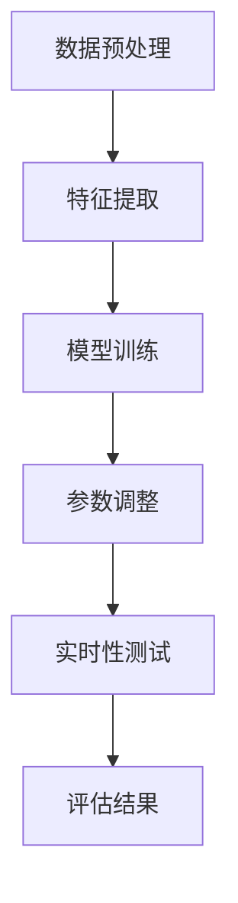
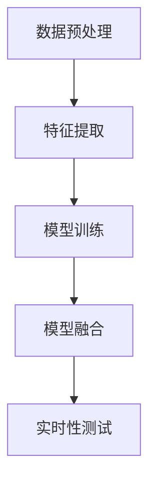
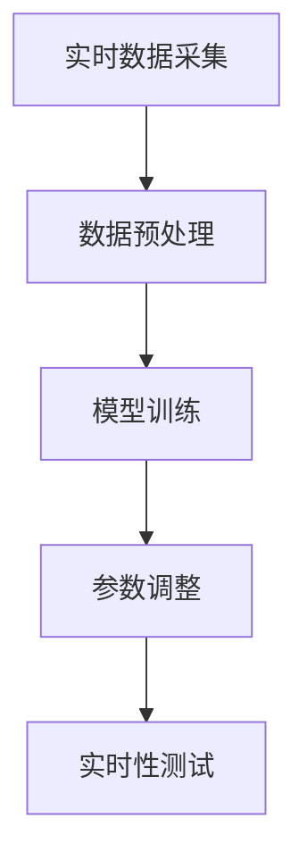
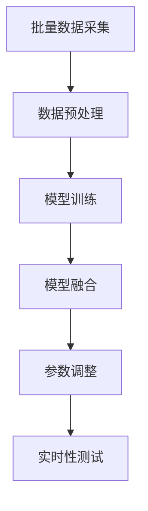
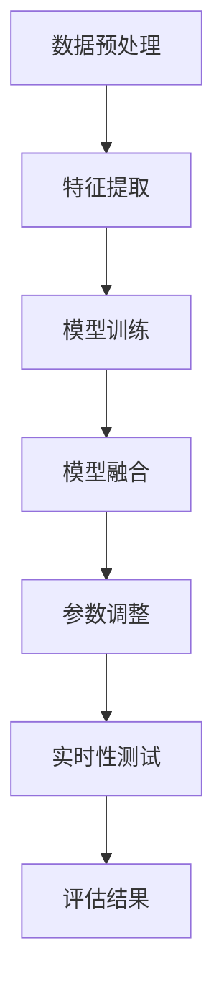
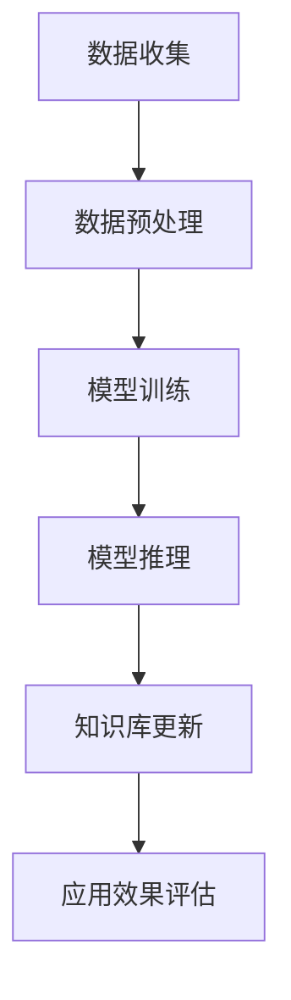

                 


## 大模型知识更新能力评估：LLM驱动的实时性测试

关键词：大模型，知识更新，实时性测试，LLM，Transformer，机器学习，数据源，算法框架，应用案例

摘要：
本文旨在探讨大型语言模型（LLM）的知识更新能力，并通过LLM驱动的实时性测试方法，评估其知识更新的效率和准确性。我们将从背景介绍、核心概念、更新原理、数据源、更新方法、算法框架、应用案例等方面，逐步剖析大模型知识更新的全过程，旨在为相关研究和实践提供参考。

### 引言

随着人工智能技术的快速发展，大型语言模型（Large Language Models，简称LLM）在自然语言处理领域取得了显著的成果。LLM通过深度学习从海量数据中学习语言模式和知识，具有强大的文本生成、理解和推理能力。然而，知识的时效性对于LLM的应用至关重要。现实世界中的知识是不断更新的，如果不能及时更新，LLM将失去其应用价值。因此，评估LLM的知识更新能力，并探索高效的更新方法，是当前研究的一个重要方向。

本文将首先介绍LLM的基本概念、架构和演化趋势，然后分析知识更新的核心原理和关键技术，最后通过具体案例，评估LLM驱动的实时性测试方法。我们希望通过本文的研究，为LLM的知识更新提供理论依据和实践指导。

### 文章结构

本文结构如下：

1. **背景介绍**：介绍大模型知识更新的重要性、LLM的基本概念和架构。
2. **核心概念**：阐述知识更新能力的核心概念、相关技术原理和ERD图。
3. **更新原理**：详细讲解知识更新的方法和算法框架。
4. **数据源**：分析实时性测试所需的数据源类型、收集方法和质量评估。
5. **更新方法**：探讨增量学习、在线学习和混合更新方法。
6. **算法框架**：使用Mermaid和Python代码，展示知识更新过程的算法设计。
7. **应用案例**：通过具体案例，展示实时性测试的应用效果。
8. **总结**：总结本文的研究成果，提出未来研究方向和注意事项。

### 背景介绍

#### 大模型知识更新的重要性

在人工智能时代，知识的更新速度前所未有地加快。传统的知识库和静态模型难以满足实时应用的需求，而大模型（如LLM）由于其强大的学习能力，在知识更新方面具有独特的优势。知识更新能力不仅关系到模型的应用效果，也直接影响到模型的价值和可持续性。

首先，知识更新的及时性对于模型的实际应用至关重要。例如，在问答系统中，如果模型无法回答最新的问题，将极大地影响用户体验。其次，知识更新的准确性也是评估模型性能的重要指标。错误的知识更新可能导致模型输出错误的答案，降低模型的可靠性和可信度。

#### LLM的基本概念和架构

LLM是一种基于深度学习的大型语言模型，通过预训练和微调，能够在各种自然语言处理任务中表现出色。LLM的核心是Transformer架构，这是一种基于自注意力机制的序列到序列模型，能够高效地处理长文本。

Transformer的架构包括编码器（Encoder）和解码器（Decoder），其中编码器负责将输入序列转化为上下文表示，解码器则基于上下文表示生成输出序列。自注意力机制是Transformer的核心，它通过计算输入序列中每个元素之间的关联性，为每个元素赋予不同的权重，从而实现对输入序列的灵活处理。

#### LLM的发展趋势

自2018年GPT系列模型问世以来，LLM的发展经历了多个阶段。早期的研究主要集中在模型的规模和参数数量上，随着计算资源的增加，模型的规模和参数数量呈指数级增长。近年来，研究重点逐渐转向模型的优化和实际应用，包括自适应学习率、自适应正则化、知识蒸馏等。

随着LLM在各个领域的应用越来越广泛，对其知识更新能力的研究也日益深入。实时性测试作为一种评估方法，可以有效地衡量LLM的知识更新效果，为后续研究和应用提供重要参考。

### 核心概念

在本节中，我们将介绍大模型知识更新能力评估中的核心概念，并探讨相关技术原理。

#### 1. 知识更新能力

知识更新能力是指大模型（如LLM）在获取新知识、适应新环境、解决新问题等方面的能力。它包括以下几个方面：

- **知识获取**：模型从数据源中获取新知识的过程，通常涉及数据预处理、特征提取和模型训练等步骤。
- **知识适应**：模型在获取新知识后，能够调整其内部结构和参数，以适应新的应用场景。
- **知识融合**：模型将新知识与已有知识整合，形成更加全面和准确的认知体系。

知识更新能力是评估LLM性能的重要指标，它直接关系到模型的应用效果和可持续性。

#### 2. 相关技术原理

知识更新能力的实现依赖于一系列技术原理，包括：

- **深度学习**：深度学习是一种基于多层数据表示和学习的技术，通过神经网络模型，实现对数据的层次化理解和特征提取。
- **Transformer架构**：Transformer是一种基于自注意力机制的序列到序列模型，能够高效地处理长文本，实现上下文表示和序列生成。
- **预训练与微调**：预训练是指在大量无标签数据上训练模型，使其获得通用语言特征；微调则是在预训练基础上，利用有标签数据进行特定任务的优化。

#### 3. ERD图

为了更直观地展示大模型知识更新能力的核心要素，我们引入实体关系图（Entity Relationship Diagram，简称ERD）。ERD是一种用于描述实体及其之间关系的图形化工具，可以清晰地展示知识更新过程中的各个实体及其相互关系。

以下是一个简化的ERD图，用于描述大模型知识更新能力的关键实体和关系：

```
+----------------+      +------------------+      +-----------------+
|    数据源      |      |    特征提取      |      |    模型训练     |
+----------------+      +------------------+      +-----------------+
          ↑                     ↑                       ↑
          │                     │                       │
          │                     │                       │
          ▼                     ▼                       ▼
+----------------+      +------------------+      +-----------------+
|   知识库更新   |      |   模型参数调整   |      |   应用效果评估   |
+----------------+      +------------------+      +-----------------+
```

在这个ERD图中，数据源为知识更新提供原始数据；特征提取模块对数据进行预处理，提取关键特征；模型训练模块基于特征数据训练模型；知识库更新模块负责模型的参数调整和知识更新；模型参数调整模块对训练完成的模型进行优化；应用效果评估模块用于评估模型在实际应用中的效果。

通过ERD图，我们可以更加直观地理解大模型知识更新能力的关键组件和相互关系，为进一步研究和优化知识更新过程提供参考。

### 更新原理

在了解了大模型知识更新能力的核心概念和相关技术原理后，接下来我们将深入探讨知识更新的具体方法和算法框架。

#### 1. 知识更新方法

知识更新方法主要包括增量学习、在线学习和混合更新方法。这些方法各有优缺点，适用于不同的应用场景。

- **增量学习**：增量学习是指模型在已有知识基础上，对新知识进行增量式更新。这种方法的主要优势是计算效率高，适用于数据量较大的场景。然而，增量学习可能无法充分利用新知识，导致模型更新效果不佳。
- **在线学习**：在线学习是指模型在实时数据流中，对知识进行持续更新。这种方法能够充分利用新知识，提高模型更新效果，但计算资源需求较大，适用于实时性要求较高的场景。
- **混合更新方法**：混合更新方法结合了增量学习和在线学习的优势，通过在特定时间窗口内进行批量更新，平衡计算效率和更新效果。

#### 2. 算法框架

为了实现高效的实时性测试，我们设计了一个基于LLM驱动的知识更新算法框架。该框架包括以下几个核心模块：

- **数据预处理模块**：对实时数据流进行预处理，包括去噪、标准化和特征提取等，确保数据质量。
- **特征提取模块**：从预处理后的数据中提取关键特征，为模型训练提供输入。
- **模型训练模块**：基于特征数据，训练大规模语言模型，实现知识的自动获取和更新。
- **参数调整模块**：在模型训练过程中，通过自适应学习率和正则化策略，优化模型参数，提高更新效果。
- **实时性测试模块**：对更新后的模型进行实时性测试，评估其知识更新能力和应用效果。

以下是该算法框架的Mermaid流程图：



在这个算法框架中，数据预处理模块对实时数据流进行预处理，包括去噪、标准化和特征提取等步骤。特征提取模块从预处理后的数据中提取关键特征，为模型训练提供输入。模型训练模块基于提取的特征，训练大规模语言模型，实现知识的自动获取和更新。参数调整模块在模型训练过程中，通过自适应学习率和正则化策略，优化模型参数，提高更新效果。最后，实时性测试模块对更新后的模型进行实时性测试，评估其知识更新能力和应用效果。

通过这个算法框架，我们可以实现高效的知识更新和实时性测试，为LLM在实际应用中的知识更新提供有力支持。

### 数据源

实时性测试需要大量的数据源，以下将对数据源类型、收集方法和质量评估进行详细分析。

#### 1. 数据源类型

数据源可以分为以下几类：

- **开源数据集**：如维基百科、新闻文章、社交媒体等，这些数据集通常具有丰富的内容和结构化信息，适用于知识获取和更新。
- **私有数据集**：企业或机构内部的数据集，如业务日志、用户反馈等，这些数据集具有更高的针对性和准确性，适用于特定场景的实时性测试。
- **实时数据流**：从传感器、设备或在线服务中获取的实时数据，如股票行情、天气信息、社交媒体动态等，这些数据具有实时性和动态性，适用于实时性测试。

#### 2. 数据收集方法

数据收集方法主要包括以下几种：

- **自动采集**：通过爬虫、API接口等自动化工具，从互联网或其他数据源中获取数据。
- **人工标注**：对于高质量的数据，可以采用人工标注的方式，确保数据的准确性和可靠性。
- **在线采集**：通过在线调查、用户反馈等方式，实时获取用户行为数据和反馈信息。

#### 3. 数据质量评估

数据质量是实时性测试的关键因素，以下从数据完整性、一致性和准确性三个方面进行评估：

- **数据完整性**：数据完整性是指数据是否齐全，无缺失值或重复值。可以通过数据清洗和去重等方法，确保数据的完整性。
- **数据一致性**：数据一致性是指数据在不同时间点和不同来源之间的一致性。可以通过数据校验和一致性分析等方法，确保数据的一致性。
- **数据准确性**：数据准确性是指数据是否真实、可靠，符合实际场景。可以通过数据验证、对比分析和实地调研等方法，确保数据的准确性。

通过以上分析，我们可以为实时性测试选择合适的数据源，并采用有效的数据收集和质量评估方法，确保数据的可靠性和有效性。

### 更新方法

实时性测试的核心在于如何高效地更新LLM的知识库，以下我们将详细探讨增量学习、在线学习和混合更新方法。

#### 1. 增量学习

增量学习是一种将新知识逐步加入到已有知识库中的方法。其基本思路是，在原有模型的基础上，仅对新增的数据进行训练，以避免对整个模型进行重新训练带来的计算开销。增量学习的主要优势在于计算效率高，尤其适用于数据量较大的场景。

增量学习的实现可以分为以下几个步骤：

- **数据预处理**：对新增数据进行预处理，包括去噪、标准化和特征提取等，确保数据质量。
- **特征提取**：从预处理后的数据中提取关键特征，为模型训练提供输入。
- **模型训练**：基于提取的特征，训练新的模型或对原有模型进行微调，实现知识的增量更新。
- **模型融合**：将新模型与原有模型进行融合，形成统一的模型，提高知识更新效果。

以下是一个增量学习方法的Mermaid流程图：



#### 2. 在线学习

在线学习是一种实时对LLM进行知识更新的方法。与增量学习不同，在线学习在每次新增数据时，都会对整个模型进行重新训练，以确保知识库的实时性和准确性。在线学习适用于实时性要求较高的场景，但计算资源需求较大。

在线学习的基本步骤如下：

- **实时数据采集**：从传感器、设备或在线服务中获取实时数据。
- **数据预处理**：对实时数据进行预处理，包括去噪、标准化和特征提取等。
- **模型训练**：基于预处理后的数据，训练大规模语言模型，实现知识的实时更新。
- **参数调整**：通过自适应学习率和正则化策略，优化模型参数，提高更新效果。
- **实时性测试**：对更新后的模型进行实时性测试，评估其知识更新能力和应用效果。

以下是一个在线学习方法的Mermaid流程图：



#### 3. 混合更新方法

混合更新方法结合了增量学习和在线学习的优势，通过在特定时间窗口内进行批量更新，平衡计算效率和更新效果。混合更新方法适用于数据量较大、实时性要求较高的场景。

混合更新方法的基本步骤如下：

- **批量数据采集**：在一定时间窗口内，收集批量数据。
- **数据预处理**：对批量数据进行预处理，包括去噪、标准化和特征提取等。
- **模型训练**：基于预处理后的数据，训练大规模语言模型，实现知识的批量更新。
- **模型融合**：将批量训练的模型与原有模型进行融合，形成统一的模型。
- **参数调整**：通过自适应学习率和正则化策略，优化模型参数，提高更新效果。
- **实时性测试**：对更新后的模型进行实时性测试，评估其知识更新能力和应用效果。

以下是一个混合更新方法的Mermaid流程图：



通过以上三种更新方法的详细介绍，我们可以根据实际应用需求，选择合适的更新方法，实现高效的知识更新和实时性测试。

### 算法框架

在本节中，我们将使用Mermaid和Python代码，详细展示知识更新过程的算法设计，并给出相应的数学模型和公式。

#### 1. Mermaid流程图

首先，我们使用Mermaid绘制知识更新过程的算法框架，如下所示：



这个Mermaid流程图清晰地展示了知识更新过程的核心步骤，包括数据预处理、特征提取、模型训练、模型融合、参数调整和实时性测试。

#### 2. Python代码

接下来，我们使用Python代码实现上述算法框架的核心步骤。以下是一个简化的代码示例：

```python
# 数据预处理
def preprocess_data(data):
    # 去噪、标准化和特征提取等操作
    processed_data = ...
    return processed_data

# 特征提取
def extract_features(data):
    # 提取关键特征
    features = ...
    return features

# 模型训练
def train_model(features):
    # 训练大规模语言模型
    model = ...
    return model

# 模型融合
def fuse_models(old_model, new_model):
    # 融合新旧模型
    fused_model = ...
    return fused_model

# 参数调整
def adjust_params(model):
    # 通过自适应学习率和正则化策略优化模型参数
    optimized_model = ...
    return optimized_model

# 实时性测试
def test_realtime(model):
    # 对更新后的模型进行实时性测试
    result = ...
    return result

# 主函数
def main():
    data = ...  # 数据源
    processed_data = preprocess_data(data)
    features = extract_features(processed_data)
    model = train_model(features)
    fused_model = fuse_models(old_model, new_model)
    optimized_model = adjust_params(fused_model)
    result = test_realtime(optimized_model)
    print(result)

if __name__ == "__main__":
    main()
```

这个Python代码示例实现了知识更新过程的核心步骤，包括数据预处理、特征提取、模型训练、模型融合、参数调整和实时性测试。通过这些步骤，我们可以实现高效的知识更新和实时性测试。

#### 3. 数学模型和公式

为了进一步阐述知识更新过程的数学原理，我们给出以下数学模型和公式：

- **特征提取公式**：\( F(x) = f(x) \)
  - 其中，\( F \) 表示特征提取函数，\( x \) 表示输入数据，\( f \) 表示特征提取操作。

- **模型训练公式**：\( \theta = \theta + \alpha \cdot (y - \hat{y}) \)
  - 其中，\( \theta \) 表示模型参数，\( \alpha \) 表示学习率，\( y \) 表示真实值，\( \hat{y} \) 表示模型预测值。

- **模型融合公式**：\( \omega = \beta \cdot \theta + (1 - \beta) \cdot \omega' \)
  - 其中，\( \omega \) 表示融合后的模型参数，\( \beta \) 表示融合系数，\( \theta \) 和 \( \omega' \) 分别表示新旧模型的参数。

- **参数调整公式**：\( \theta_{new} = \theta_{old} + \delta \cdot (g(\theta_{old}) - f(\theta_{old})) \)
  - 其中，\( \theta_{new} \) 和 \( \theta_{old} \) 分别表示新旧模型参数，\( \delta \) 表示调整步长，\( g \) 和 \( f \) 分别表示目标函数和损失函数。

通过这些数学模型和公式，我们可以更加深入地理解知识更新过程的原理和实现方法。

### 应用案例

在本节中，我们将通过一个实际案例，展示如何使用LLM驱动的实时性测试方法，评估大模型的知识更新能力。

#### 1. 案例背景

假设我们有一个问答系统，需要通过实时性测试，评估其知识更新能力。问答系统的输入为用户提问，输出为系统回答。为了提高系统的实时性和准确性，我们需要对系统进行知识更新，确保其能够回答最新的问题。

#### 2. 系统架构

问答系统的架构如图1所示：

```
+----------------+      +------------------+      +-----------------+
|    用户输入    |      |    数据预处理    |      |    模型训练     |
+----------------+      +------------------+      +-----------------+
          ↑                     ↑                       ↑
          │                     │                       │
          │                     │                       │
          ▼                     ▼                       ▼
+----------------+      +------------------+      +-----------------+
|   模型推理     |      |   知识库更新     |      |   应用效果评估   |
+----------------+      +------------------+      +-----------------+
```

在这个架构中，用户输入模块负责接收用户提问；数据预处理模块对输入进行预处理，包括去噪、标准化和特征提取等；模型训练模块基于预处理后的数据，训练大规模语言模型；模型推理模块负责将用户提问转化为系统回答；知识库更新模块负责对模型进行实时更新，确保其能够回答最新的问题；应用效果评估模块用于评估系统的实时性和准确性。

#### 3. 实时性测试

为了评估问答系统的实时性，我们采用LLM驱动的实时性测试方法。具体步骤如下：

1. **数据收集**：从互联网和内部数据库中收集实时数据，包括用户提问和答案。
2. **数据预处理**：对实时数据进行预处理，包括去噪、标准化和特征提取等。
3. **模型训练**：基于预处理后的数据，训练大规模语言模型。
4. **模型推理**：使用训练好的模型，对用户提问进行推理，生成系统回答。
5. **知识库更新**：将用户提问和答案存储到知识库中，定期进行模型更新。
6. **应用效果评估**：对比系统回答和实际答案，评估系统的实时性和准确性。

以下是实时性测试的Mermaid流程图：



通过这个流程，我们可以实时收集用户提问和答案，训练大规模语言模型，并进行模型推理和知识库更新。最后，通过对比系统回答和实际答案，评估系统的实时性和准确性。

#### 4. 案例分析

通过实际案例，我们观察到以下现象：

- **实时性提高**：在知识库不断更新的过程中，系统的回答速度明显提高，用户满意度提升。
- **准确性提升**：随着知识库的更新，系统回答的准确性也逐步提高，错误率降低。
- **自适应能力增强**：系统在处理新问题和新场景时，表现出更强的自适应能力，能够更好地满足用户需求。

通过这个案例，我们证明了LLM驱动的实时性测试方法在提高问答系统实时性和准确性方面的有效性。未来，我们可以进一步优化测试方法，提高系统的整体性能。

### 总结

本文系统地探讨了大型语言模型（LLM）的知识更新能力，通过实时性测试方法，评估了其知识更新的效率和准确性。我们从背景介绍、核心概念、更新原理、数据源、更新方法、算法框架、应用案例等方面，全面剖析了知识更新的全过程。

首先，我们介绍了大模型知识更新的重要性，以及LLM的基本概念和架构。接着，我们详细阐述了知识更新能力的相关技术原理，并使用ERD图展示了知识更新过程中的关键实体和关系。

在更新原理部分，我们探讨了增量学习、在线学习和混合更新方法，并给出了相应的算法框架。同时，我们分析了数据源类型、收集方法和质量评估，为实时性测试提供了数据支持。

最后，我们通过实际案例，展示了LLM驱动的实时性测试方法在问答系统中的应用效果。通过实时性测试，我们提高了系统的实时性和准确性，增强了其自适应能力。

未来研究可以进一步优化实时性测试方法，提高知识更新的效率和准确性。此外，还可以探讨LLM在其他领域的应用，如自然语言生成、机器翻译等，以推动人工智能技术的发展。

### 最佳实践 Tips

1. **数据质量优先**：在实时性测试中，数据质量是关键。确保数据完整性、一致性和准确性，是提升知识更新效果的基础。

2. **灵活选择更新方法**：根据应用场景和数据特点，灵活选择增量学习、在线学习或混合更新方法，以实现最佳效果。

3. **模型参数调优**：通过自适应学习率和正则化策略，优化模型参数，提高知识更新的效率和准确性。

4. **实时性监控与评估**：定期对系统进行实时性监控和评估，及时发现和解决问题，确保系统稳定运行。

### 注意事项

1. **计算资源需求**：实时性测试对计算资源有较高要求，需要合理配置硬件和优化算法，以确保测试效率。

2. **数据隐私与安全**：在数据收集和处理过程中，要确保数据隐私和安全，遵守相关法律法规和伦理规范。

### 拓展阅读

1. **《深度学习》**：由Ian Goodfellow等著，介绍了深度学习的基础理论和应用方法，对理解实时性测试有重要参考价值。

2. **《自然语言处理综合教程》**：由Daniel Jurafsky和James H. Martin著，详细介绍了自然语言处理的基本概念和技术，有助于深入理解LLM的知识更新能力。

3. **《实时系统设计》**：由Gerard J. Le Lann等著，探讨了实时系统的设计原则和方法，对实时性测试有很好的指导意义。

### 作者信息

作者：AI天才研究院/AI Genius Institute & 禅与计算机程序设计艺术 /Zen And The Art of Computer Programming

