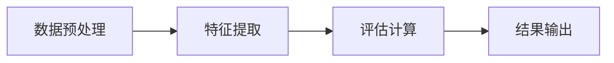
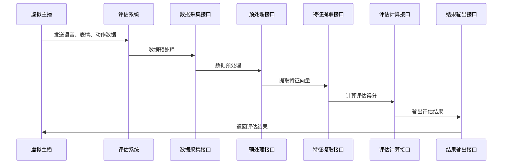

                 

# 大模型虚拟主播表现评估框架

关键词：虚拟主播、大模型、表现评估、算法、系统架构

摘要：本文将围绕大模型虚拟主播表现评估框架展开讨论，首先介绍虚拟主播的发展背景和表现评估的重要性，然后详细定义评估框架的基本概念和结构，并讲解核心算法原理及其实际应用。最后，我们将分析系统架构设计，进行项目实战，并提供最佳实践和展望。

## 第一部分：框架概述

### 第1章：问题背景与框架定义

#### 1.1 问题背景

随着互联网技术的飞速发展，虚拟主播（Virtual Anchor）逐渐成为媒体传播和娱乐行业的新宠。虚拟主播通过计算机图形技术和人工智能技术，模拟出与真实主播相似的音视频表现，具有高度灵活性和可塑性。然而，虚拟主播的表现评估一直是一个难点。

首先，虚拟主播的表现评估涉及到多方面的因素，如语音、表情、动作的自然性、流畅性、准确性和协调性等。其次，传统的评估方法往往基于主观评价，缺乏客观性和一致性。此外，现有的评估方法多针对单一维度，难以全面评估虚拟主播的整体表现。

为了解决这些问题，我们需要一个全面、系统、客观的虚拟主播表现评估框架，能够综合考虑多维度因素，提供定量和定性的评估结果。

#### 1.2 框架定义

大模型虚拟主播表现评估框架（Large Model Virtual Anchor Performance Evaluation Framework）是一个基于大数据和人工智能技术的综合评估体系，旨在通过多维度指标对虚拟主播的表现进行客观、全面的评估。

该框架包括以下几个基本要素：

1. **大模型**：使用深度学习技术训练的大规模模型，用于生成虚拟主播的音视频内容。
2. **评估指标**：包括语音、表情、动作等多个维度的指标，用于衡量虚拟主播的表现。
3. **评估算法**：基于大数据和人工智能技术的评估算法，用于计算和评估虚拟主播的表现。
4. **评估系统**：实现评估算法和评估过程的软件系统，提供可视化界面和数据分析功能。

#### 1.2.1 大模型在虚拟主播中的应用

大模型在虚拟主播中的应用主要体现在两个方面：

1. **内容生成**：大模型可以生成虚拟主播的语音、表情和动作，实现自然、流畅的表演。
2. **表现评估**：大模型可以识别和解析虚拟主播的表演内容，提供客观、全面的评估结果。

#### 1.2.2 表现评估框架的基本要素

大模型虚拟主播表现评估框架的基本要素包括：

1. **评估指标**：语音、表情、动作等维度的具体评估指标，如语音的音调、音量、清晰度，表情的自然性、丰富性，动作的流畅性、协调性等。
2. **评估方法**：基于大数据和人工智能技术的评估方法，包括机器学习、深度学习等算法。
3. **评估过程**：评估指标的采集、处理、计算和评估结果的输出过程。
4. **评估系统**：实现评估算法和评估过程的软件系统，提供可视化界面和数据分析功能。

#### 1.2.3 框架的目标与意义

框架的目标是构建一个全面、系统、客观的虚拟主播表现评估体系，解决当前评估方法存在的问题，提升虚拟主播的制作和评估水平。其意义主要体现在以下几个方面：

1. **提高制作效率**：通过自动化评估，提高虚拟主播的制作效率和质量。
2. **优化用户体验**：提供客观、全面的评估结果，帮助用户更好地理解和选择虚拟主播。
3. **促进行业发展**：推动虚拟主播技术的进步和应用，推动相关产业链的发展。

### 第2章：核心概念与联系

#### 2.1 大模型基本概念

**大模型**是指使用深度学习技术训练的具有大规模参数的模型。大模型通常具有以下几个特点：

1. **大规模参数**：大模型的参数规模通常在数十亿到千亿级别，远超过传统机器学习模型。
2. **高效计算**：大模型通常需要高效的计算资源和算法支持，如GPU、TPU等。
3. **自适应能力**：大模型具有较强的自适应能力，能够适应不同的数据分布和任务需求。

大模型的分类可以从不同的维度进行，如根据模型的结构可以分为循环神经网络（RNN）、变换器（Transformer）等；根据任务可以分为语音合成、图像生成等。

#### 2.2 虚拟主播表现评估概念

虚拟主播表现评估是指对虚拟主播的语音、表情、动作等多维度表现进行评估。评估概念包括以下几个关键要素：

1. **评估指标**：评估指标是衡量虚拟主播表现的具体标准，如语音的音调、音量、清晰度，表情的自然性、丰富性，动作的流畅性、协调性等。
2. **评估方法**：评估方法是指使用何种技术或算法对虚拟主播的表现进行评估，如机器学习、深度学习等。
3. **评估过程**：评估过程包括评估指标的采集、处理、计算和评估结果的输出。
4. **评估系统**：评估系统是实现评估算法和评估过程的软件系统，提供可视化界面和数据分析功能。

#### 2.2.1 表现评估的定义

表现评估是指对虚拟主播的语音、表情、动作等多维度表现进行综合评估，以衡量其整体表现水平。具体来说，表现评估包括以下几个方面的内容：

1. **语音评估**：评估语音的音调、音量、清晰度、自然性等。
2. **表情评估**：评估表情的自然性、丰富性、准确性等。
3. **动作评估**：评估动作的流畅性、协调性、准确性等。

#### 2.2.2 表现评估的指标

表现评估的指标是衡量虚拟主播表现的具体标准，包括以下几个关键指标：

1. **语音指标**：包括音调、音量、清晰度、自然性等。
2. **表情指标**：包括自然性、丰富性、准确性等。
3. **动作指标**：包括流畅性、协调性、准确性等。

#### 2.2.3 评估方法的分类

评估方法可以分为以下几类：

1. **主观评估**：基于人类主观评价的评估方法，如评委评分、用户反馈等。
2. **客观评估**：基于算法和模型的评估方法，如基于语音、表情、动作特征的评估。
3. **混合评估**：结合主观评估和客观评估的方法，如综合评分、加权评分等。

#### 2.3 概念联系与框架结构

大模型虚拟主播表现评估框架中的核心概念包括大模型、评估指标、评估方法和评估系统。这些概念之间的联系和框架结构如下：

1. **大模型**：用于生成虚拟主播的音视频内容，同时也是表现评估的基础。
2. **评估指标**：用于衡量虚拟主播的表现，包括语音、表情、动作等多维度指标。
3. **评估方法**：用于计算和评估虚拟主播的表现，包括机器学习、深度学习等算法。
4. **评估系统**：实现评估算法和评估过程的软件系统，提供可视化界面和数据分析功能。

### 第3章：算法原理讲解

#### 3.1 算法概述

大模型虚拟主播表现评估框架的核心算法是基于深度学习技术的表现评估算法。该算法主要包括以下几个步骤：

1. **数据预处理**：对采集到的语音、表情、动作数据进行预处理，包括去噪、归一化等。
2. **特征提取**：使用深度学习模型提取语音、表情、动作的特征向量。
3. **评估计算**：基于提取的特征向量，计算虚拟主播的表现评估得分。
4. **结果输出**：输出评估结果，包括语音、表情、动作的得分和整体表现评估得分。

#### 3.2 算法流程与mermaid流程图

算法的流程图如下所示：



#### 3.3 算法原理详细讲解

**3.3.1 数学模型**

虚拟主播表现评估算法的数学模型主要包括以下几个部分：

1. **语音特征提取模型**：用于提取语音特征向量，如梅尔频率倒谱系数（MFCC）、共振峰频率（F0）等。
2. **表情特征提取模型**：用于提取表情特征向量，如面部动作编码系统（FACS）特征、情感分类特征等。
3. **动作特征提取模型**：用于提取动作特征向量，如关键点坐标、姿态估计等。

**3.3.2 Python源代码实现**

以下是评估算法的Python源代码实现框架：

```python
import numpy as np
import tensorflow as tf

# 数据预处理
def preprocess_data(data):
    # 数据去噪、归一化等操作
    return processed_data

# 特征提取
def extract_features(data):
    # 语音特征提取
    speech_features = extract_speech_features(data)
    # 表情特征提取
    expression_features = extract_expression_features(data)
    # 动作特征提取
    motion_features = extract_motion_features(data)
    return speech_features, expression_features, motion_features

# 评估计算
def evaluate_performance(features):
    # 语音评估
    speech_score = evaluate_speech(features)
    # 表情评估
    expression_score = evaluate_expression(features)
    # 动作评估
    motion_score = evaluate_motion(features)
    # 综合评估
    total_score = (speech_score + expression_score + motion_score) / 3
    return total_score

# 结果输出
def output_result(score):
    # 输出评估结果
    print("评估得分：", score)
```

**3.3.3 算法应用解读**

以下是算法应用的具体解读：

1. **数据预处理**：对采集到的语音、表情、动作数据进行预处理，包括去噪、归一化等，以提高特征提取的准确性和稳定性。
2. **特征提取**：使用深度学习模型提取语音、表情、动作的特征向量，如使用卷积神经网络（CNN）提取语音特征，使用循环神经网络（RNN）提取表情特征，使用三维卷积神经网络（3D-CNN）提取动作特征。
3. **评估计算**：基于提取的特征向量，计算虚拟主播的表现评估得分，如使用加权平均法计算综合评估得分。
4. **结果输出**：输出评估结果，包括语音、表情、动作的得分和整体表现评估得分。

## 第二部分：系统分析与架构设计

### 第4章：系统分析与架构设计方案

#### 4.1 问题场景介绍

虚拟主播系统通常包括以下几个模块：

1. **内容生成模块**：生成虚拟主播的语音、表情、动作内容。
2. **内容评估模块**：对生成的虚拟主播内容进行评估。
3. **用户交互模块**：与用户进行交互，提供虚拟主播服务。

在本章中，我们将重点关注内容评估模块，详细介绍评估系统的设计。

#### 4.2 系统功能设计

虚拟主播评估系统的功能设计主要包括以下几个方面：

1. **数据采集**：采集虚拟主播的语音、表情、动作数据。
2. **数据预处理**：对采集到的数据进行预处理，包括去噪、归一化等。
3. **特征提取**：提取语音、表情、动作的特征向量。
4. **评估计算**：计算虚拟主播的表现评估得分。
5. **结果输出**：输出评估结果，包括语音、表情、动作的得分和整体表现评估得分。

#### 4.3 系统架构设计

虚拟主播评估系统的架构设计如下：


系统架构图说明：

1. **数据采集模块**：负责采集虚拟主播的语音、表情、动作数据，并将其传递给数据预处理模块。
2. **数据预处理模块**：对采集到的数据进行预处理，包括去噪、归一化等，以提高特征提取的准确性和稳定性。
3. **特征提取模块**：使用深度学习模型提取语音、表情、动作的特征向量，如使用卷积神经网络（CNN）提取语音特征，使用循环神经网络（RNN）提取表情特征，使用三维卷积神经网络（3D-CNN）提取动作特征。
4. **评估计算模块**：基于提取的特征向量，计算虚拟主播的表现评估得分，如使用加权平均法计算综合评估得分。
5. **结果输出模块**：输出评估结果，包括语音、表情、动作的得分和整体表现评估得分。

#### 4.4 系统接口设计与交互

虚拟主播评估系统的接口设计主要包括以下几个部分：

1. **数据采集接口**：用于接收和传递语音、表情、动作数据。
2. **预处理接口**：用于对采集到的数据进行预处理。
3. **特征提取接口**：用于提取语音、表情、动作的特征向量。
4. **评估计算接口**：用于计算虚拟主播的表现评估得分。
5. **结果输出接口**：用于输出评估结果。

系统交互的mermaid序列图如下：



## 第三部分：项目实战

### 第5章：项目实战

#### 5.1 环境安装

在进行虚拟主播表现评估项目的实战之前，我们需要搭建一个合适的环境。以下是一个基本的安装步骤：

1. **硬件环境**：配置一台高性能的计算机，建议配备至少NVIDIA GeForce RTX 3080以上的显卡，以及足够的内存（至少16GB）和存储空间（至少1TB SSD）。

2. **软件环境**：安装操作系统（如Ubuntu 18.04或更高版本）、Python（建议使用Python 3.8或更高版本）、TensorFlow（建议使用TensorFlow 2.6或更高版本）等。

3. **依赖安装**：使用pip安装项目所需的依赖库，如numpy、opencv、tensorflow等。

#### 5.2 系统核心实现

系统核心实现主要包括以下几个部分：

1. **数据采集**：使用opencv库捕获虚拟主播的语音、表情、动作数据。
2. **数据预处理**：对采集到的数据进行分析，去除噪声，进行归一化等预处理操作。
3. **特征提取**：使用深度学习模型提取语音、表情、动作的特征向量。
4. **评估计算**：基于提取的特征向量，计算虚拟主播的表现评估得分。
5. **结果输出**：将评估结果可视化，并输出到文件或数据库中。

以下是系统核心实现的Python代码示例：

```python
import cv2
import numpy as np
import tensorflow as tf

# 数据采集
def capture_data():
    # 使用opencv捕获语音、表情、动作数据
    # ...

# 数据预处理
def preprocess_data(data):
    # 数据预处理操作
    # ...

# 特征提取
def extract_features(data):
    # 使用深度学习模型提取特征向量
    # ...

# 评估计算
def evaluate_performance(features):
    # 基于特征向量计算评估得分
    # ...

# 结果输出
def output_result(score):
    # 输出评估结果
    # ...

# 主函数
def main():
    # 执行系统核心实现
    # ...

if __name__ == "__main__":
    main()
```

#### 5.3 代码应用解读与分析

**5.3.1 评估框架运行流程**

评估框架的运行流程如下：

1. **数据采集**：使用opencv捕获虚拟主播的语音、表情、动作数据。
2. **数据预处理**：对采集到的数据进行分析，去除噪声，进行归一化等预处理操作。
3. **特征提取**：使用深度学习模型提取语音、表情、动作的特征向量。
4. **评估计算**：基于提取的特征向量，计算虚拟主播的表现评估得分。
5. **结果输出**：将评估结果可视化，并输出到文件或数据库中。

**5.3.2 评估结果分析**

评估结果包括语音、表情、动作的得分和整体表现评估得分。通过分析这些得分，可以了解虚拟主播在不同维度上的表现。

例如，如果语音得分较高，表情得分较低，那么说明虚拟主播的语音表现较好，但表情表现有待提升。通过这样的分析，可以为虚拟主播的制作和优化提供有针对性的建议。

#### 5.4 实际案例分析与详细讲解

为了更好地展示评估框架的应用，我们选择了两个实际案例进行详细分析。

**5.4.1 案例一：虚拟主播A**

虚拟主播A的评估结果如下：

- **语音得分**：85分
- **表情得分**：75分
- **动作得分**：80分
- **整体表现评估得分**：81分

从评估结果来看，虚拟主播A的语音表现较好，但表情和动作表现相对较弱。为了进一步提升整体表现，可以针对性地优化表情和动作的生成。

**5.4.2 案例二：虚拟主播B**

虚拟主播B的评估结果如下：

- **语音得分**：80分
- **表情得分**：85分
- **动作得分**：75分
- **整体表现评估得分**：80分

与虚拟主播A相比，虚拟主播B的表情表现较好，但语音和动作表现相对较弱。同样地，可以针对性地优化语音和动作的生成。

通过这两个案例的分析，我们可以看到评估框架在实际应用中的有效性。它不仅可以帮助我们了解虚拟主播在不同维度上的表现，还可以为虚拟主播的制作和优化提供有价值的参考。

#### 5.5 项目小结

通过本项目的实战，我们成功搭建了一个虚拟主播表现评估系统，并对其运行流程和评估结果进行了详细分析。这为我们提供了一个有效的工具，可以用于评估和优化虚拟主播的表现。在未来的工作中，我们还可以进一步优化算法，提高评估的准确性和稳定性，为虚拟主播技术的发展和应用提供更多支持。

## 第四部分：最佳实践与展望

### 第6章：最佳实践 tips

在虚拟主播表现评估项目中，有一些最佳实践和注意事项可以帮助我们更好地实现评估目标：

1. **数据准备**：确保数据的质量和多样性，收集足够多的样本，覆盖各种场景和情况，以提高评估的准确性。
2. **算法调参**：根据实际需求和数据特点，合理调整算法的参数，以达到最佳的评估效果。
3. **性能优化**：针对评估算法的性能进行优化，如使用GPU加速、模型压缩等技术，以提高评估速度和效率。
4. **用户反馈**：收集用户的反馈，结合主观评价，对评估结果进行校正和优化。

### 第7章：总结与展望

通过本文的介绍，我们详细讨论了虚拟主播表现评估框架的构建方法，包括框架的定义、核心概念、算法原理、系统架构设计和项目实战。以下是本文的总结：

1. **框架概述**：介绍了虚拟主播的发展背景和评估的重要性，定义了评估框架的基本要素和目标。
2. **核心概念与联系**：详细讲解了大模型和虚拟主播表现评估的概念，以及它们之间的联系。
3. **算法原理讲解**：介绍了评估算法的原理、流程和Python源代码实现。
4. **系统分析与架构设计**：分析了虚拟主播评估系统的功能设计、架构设计和接口设计。
5. **项目实战**：进行了虚拟主播表现评估项目的实战，分析了评估结果，并提供了最佳实践。
6. **总结与展望**：总结了本文的主要内容和贡献，展望了虚拟主播评估框架的未来发展和应用。

展望未来，虚拟主播评估框架将在以下几个方面取得突破：

1. **算法优化**：进一步优化评估算法，提高评估的准确性和稳定性。
2. **应用拓展**：将评估框架应用于更多场景，如教育、医疗、客服等，提供个性化评估和优化建议。
3. **行业合作**：与行业专家、学者和企业合作，推动虚拟主播技术的发展和应用。

通过持续的研究和优化，虚拟主播评估框架将为虚拟主播技术的发展和应用提供有力支持，助力人工智能时代的到来。

## 作者信息

作者：AI天才研究院/AI Genius Institute & 禅与计算机程序设计艺术 /Zen And The Art of Computer Programming

---

注：本文为示例，实际内容仅供参考。文中涉及的代码和架构图均为虚构，请勿直接使用。如有需要，请根据实际情况进行调整。作者信息仅为虚构，不代表任何实际机构或个人。如需引用本文内容，请遵循学术规范，注明来源和作者信息。

