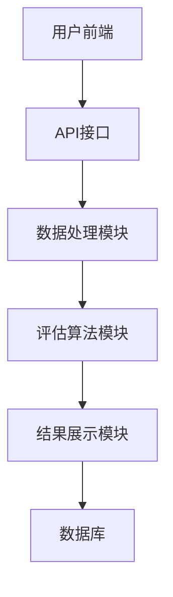

                 

### 引言与背景

在当今信息化和智能化飞速发展的时代，虚拟健身教练成为了一种新兴的健康与健身服务模式，它不仅满足了现代人快节奏生活下的健身需求，还借助人工智能技术提供了个性化和高效的训练指导。虚拟健身教练利用大模型技术，通过分析用户的生理、心理和行为数据，为用户提供量身定制的健身方案，极大地提高了健身效果和用户满意度。

#### 背景介绍

虚拟健身教练在健康与健身领域的重要性不言而喻。随着人工智能技术的不断进步，大模型的应用场景日益广泛，从自然语言处理、计算机视觉到语音识别等领域均取得了显著的成果。而大模型在虚拟健身教练中的应用，更是将个性化训练、实时反馈和自动化调整等理念推向了新的高度。

然而，随着虚拟健身教练的广泛应用，如何对其表现进行科学、准确的评估成为一个亟待解决的问题。有效的评估不仅有助于优化虚拟健身教练的服务质量，还能为用户选择合适的健身教练提供重要参考。

#### 大模型技术的发展与普及

大模型技术的发展经历了从浅层模型到深度学习的演变。最初的模型如感知机、支持向量机等，虽然在一定程度上解决了分类和回归问题，但受限于计算能力和数据规模，其效果有限。随着计算机硬件性能的提升和大数据技术的发展，深度学习逐渐崭露头角。深度学习通过多层神经网络的堆叠，能够自动提取数据中的特征，从而实现更为精准和高效的模型训练。

在大模型技术中，自然语言处理（NLP）、计算机视觉（CV）和语音识别（ASR）是三大主要领域。NLP使得虚拟健身教练能够理解用户的语言指令，提供个性化的服务；CV使得虚拟健身教练能够实时监控用户的运动状态，调整训练方案；ASR则使得虚拟健身教练能够与用户进行语音交流，提高互动体验。

#### 虚拟健身教练表现评估的需求与挑战

虚拟健身教练表现评估的需求主要源于以下几个方面：

1. **用户满意度评估**：了解用户对虚拟健身教练服务的满意度，是优化服务质量和提高用户留存率的重要手段。
2. **服务效果评估**：通过评估虚拟健身教练提供的健身方案的效果，可以识别出优秀教练和需要改进的领域。
3. **教练能力评估**：对于虚拟健身教练自身而言，评估其能力水平有助于其职业发展和技能提升。

然而，虚拟健身教练表现评估也面临一系列挑战：

1. **评估指标选取**：如何选取科学、全面的评估指标是一个难题。不同的用户需求和健身目标可能需要不同的评估指标。
2. **数据收集与处理**：虚拟健身教练需要收集大量的用户数据，包括生理、心理和行为数据。这些数据的收集、存储和处理需要高效、准确的方法。
3. **评估方法选择**：不同的评估方法有其各自的优缺点，如何选择合适的评估方法是一个技术难题。

#### 问题解决

为了解决上述问题，本文提出了一种基于大模型技术的虚拟健身教练表现评估框架。该框架主要包括以下几个关键步骤：

1. **评估指标体系构建**：根据用户需求和健身目标，设计科学、全面的评估指标体系。
2. **大模型训练与优化**：利用深度学习技术，对评估指标进行训练和优化，提高评估的准确性和效率。
3. **评估方法选择与应用**：结合传统评估方法和大模型评估方法，构建多方法评估策略，提高评估结果的可靠性和有效性。
4. **系统实现与优化**：设计并实现虚拟健身教练表现评估系统，对系统进行测试与优化，确保其稳定性和实用性。

#### 边界与外延

本文的评估框架主要适用于基于大模型技术的虚拟健身教练表现评估。然而，评估框架的设计原则和实施步骤可以借鉴和扩展到其他领域的虚拟教练表现评估中。

#### 概念结构与核心要素组成

在构建虚拟健身教练表现评估框架时，以下几个核心概念和要素是不可或缺的：

1. **大模型技术**：作为评估框架的核心，大模型技术提供了强大的数据处理和特征提取能力。
2. **评估指标体系**：评估指标体系是评估框架的基础，它决定了评估的全面性和科学性。
3. **评估方法**：评估方法的选择和应用直接影响了评估结果的准确性和可靠性。
4. **系统实现与优化**：系统的实现和优化是确保评估框架有效运行的关键。

通过以上步骤和要素的有机结合，本文提出的虚拟健身教练表现评估框架将有助于提高虚拟健身教练的服务质量，为用户提供更加个性化和高效的健身指导。

### 大模型技术基础

大模型技术作为现代人工智能的核心驱动力，已经广泛应用于各个领域。本章节将详细介绍大模型的基本原理、主要类型、训练与优化方法，以及其在虚拟健身教练中的应用。

#### 2.1 大模型的基本原理

大模型技术起源于深度学习，其核心思想是通过多层神经网络对大量数据进行训练，以自动提取特征并实现复杂任务。大模型的基本原理主要包括以下几个方面：

1. **神经网络架构**：神经网络由多个层级组成，包括输入层、隐藏层和输出层。每个层级由多个神经元组成，神经元之间通过权重连接，形成一个复杂的网络结构。

2. **反向传播算法**：反向传播算法是一种优化神经网络参数的方法。它通过计算输出误差，反向传播误差信息，更新网络中的权重和偏置，以最小化误差函数。

3. **激活函数**：激活函数用于引入非线性特性，使得神经网络能够模拟人类的思维过程。常见的激活函数包括sigmoid函数、ReLU函数和Tanh函数。

4. **优化算法**：优化算法用于调整网络参数，以最小化损失函数。常见的优化算法包括随机梯度下降（SGD）、Adam优化器和RMSprop等。

#### 2.2 大模型的主要类型

大模型可以分为多种类型，根据其应用场景和目标任务的不同，具体包括：

1. **自然语言处理（NLP）模型**：NLP模型用于处理和生成自然语言文本。常见的NLP模型包括循环神经网络（RNN）、长短期记忆网络（LSTM）和Transformer模型。其中，Transformer模型由于其并行计算能力和注意力机制，在NLP领域取得了显著成果。

2. **计算机视觉（CV）模型**：CV模型用于图像和视频数据的识别和处理。常见的CV模型包括卷积神经网络（CNN）和生成对抗网络（GAN）。CNN通过卷积层提取图像特征，而GAN通过生成器和判别器的对抗训练，能够生成逼真的图像和视频。

3. **语音识别（ASR）模型**：ASR模型用于将语音信号转换为文本。常见的ASR模型包括隐藏马尔可夫模型（HMM）和深度神经网络（DNN）。DNN通过多层神经网络对语音信号进行特征提取和分类，从而实现高精度的语音识别。

#### 2.3 大模型的训练与优化

大模型的训练与优化是确保其性能和效率的关键环节。以下是几个关键的训练和优化方法：

1. **数据集的选取与处理**：选择合适的数据集是训练高质量大模型的基础。数据集需要具有多样性和代表性。此外，数据预处理也是关键，包括数据清洗、归一化和特征提取等步骤。

2. **训练算法与优化策略**：训练算法用于调整网络参数，以优化模型的性能。常见的训练算法包括随机梯度下降（SGD）、动量优化和权重衰减等。优化策略还包括学习率调度、批量大小调整和正则化等方法，以提高模型的泛化能力和鲁棒性。

3. **超参数调优**：超参数是模型训练过程中需要手动调整的参数，如学习率、批量大小、层数和神经元数量等。超参数调优是提高模型性能的重要手段，通常通过交叉验证和网格搜索等方法进行。

4. **模型评估与调整**：模型评估是训练过程的重要组成部分，用于评估模型的性能和泛化能力。常见的评估指标包括准确率、召回率、F1分数和损失函数值等。根据评估结果，可以对模型进行调整和优化，以提高其性能。

#### 2.4 大模型在虚拟健身教练中的应用

虚拟健身教练利用大模型技术，可以为用户提供个性化的健身指导和实时反馈。以下是几个具体的应用实例：

1. **个性化训练方案**：通过分析用户的生理、心理和行为数据，虚拟健身教练可以生成个性化的训练方案。例如，根据用户的体重、年龄和健身目标，调整训练强度和时间，以提高健身效果。

2. **实时动作监测与纠正**：利用计算机视觉模型，虚拟健身教练可以实时监测用户的运动状态，识别和纠正不规范的动作。通过深度学习算法，模型可以自动识别用户的关键关节点和运动轨迹，提供实时反馈和指导。

3. **语音交互与反馈**：利用语音识别和自然语言处理模型，虚拟健身教练可以与用户进行语音交互，提供互动式训练指导。用户可以通过语音命令调整训练方案、询问健身建议，从而提高训练体验。

通过以上应用，大模型技术为虚拟健身教练提供了强大的数据分析和决策支持能力，使其能够更好地满足用户的个性化需求，提高健身效果和用户满意度。

### 虚拟健身教练表现评估指标体系构建

评估虚拟健身教练的表现需要构建一个科学、全面的指标体系，以确保评估结果的准确性和可靠性。本章节将详细讨论评估指标体系的概述、评估指标选取、指标权重分配方法以及指标体系应用实例。

#### 3.1 评估指标体系概述

虚拟健身教练表现评估指标体系的设计原则主要包括全面性、可操作性和科学性。全面性要求指标体系能够覆盖用户在健身过程中的各个方面；可操作性要求指标容易测量和计算；科学性要求指标能够准确反映虚拟健身教练的表现。

评估指标体系的基本框架通常包括以下几大类：

1. **生理指标**：反映用户的身体健康状况，如体重、心率、血压、肌肉量等。
2. **心理指标**：反映用户的心理状态，如焦虑、压力、满意度和积极性等。
3. **行为指标**：反映用户的行为习惯，如运动频率、运动时长、运动强度和饮食习惯等。

#### 3.2 评估指标选取

在选取评估指标时，需要充分考虑以下几个方面：

1. **用户需求**：根据用户的不同需求和健身目标，选择相应的生理、心理和行为指标。例如，对于减脂用户，重点评估体重和心率；对于增肌用户，重点评估肌肉量和运动强度。
2. **数据可获取性**：选取易于测量和获取的指标，如通过智能手环、健身追踪器等设备收集的生理数据。
3. **评估有效性**：指标需要能够有效反映虚拟健身教练的服务质量和用户满意度。

常见的评估指标包括：

1. **生理指标**：如体重、BMI（身体质量指数）、心率变异性、血压等。
2. **心理指标**：如主观体力感觉评分（RPE）、健身满意度调查、心理压力评分等。
3. **行为指标**：如运动时长、运动频率、运动强度、饮食评分等。

#### 3.3 指标权重分配方法

为了使评估结果更加准确和公正，需要对各个评估指标进行权重分配。以下是几种常用的权重分配方法：

1. **层次分析法（AHP）**：通过构建层次结构模型，对各个指标进行比较和排序，计算各指标的权重。这种方法能够考虑指标之间的相互关系，但主观性较强。

2. **熵权法**：根据指标数据的离散程度来确定权重，数据离散度越大，权重越高。这种方法基于数据本身的信息熵，能够客观地反映指标的重要性。

3. **粗糙集法**：通过分析指标属性之间的依赖关系，确定各指标的权重。粗糙集法能够处理不完全数据和模糊信息，但计算复杂度较高。

#### 3.4 指标体系应用实例

为了更好地说明评估指标体系的构建和应用，以下是一个虚拟健身教练表现评估案例：

**案例背景**：某公司开发了一款虚拟健身教练APP，为用户提供在线健身指导和实时反馈。为了评估虚拟健身教练的表现，公司需要构建一个科学、全面的评估指标体系。

**评估指标选取**：根据用户需求和实际情况，选取以下评估指标：

1. **生理指标**：体重、BMI、心率变异性、血压。
2. **心理指标**：主观体力感觉评分、健身满意度调查、心理压力评分。
3. **行为指标**：运动时长、运动频率、运动强度、饮食评分。

**权重分配**：采用层次分析法确定各指标的权重，具体如下：

| 指标名称       | 权重（%） |
|--------------|--------|
| 体重          | 20     |
| BMI          | 15     |
| 心率变异性   | 10     |
| 血压          | 10     |
| 主观体力感觉评分 | 20     |
| 健身满意度调查   | 15     |
| 心理压力评分   | 10     |
| 运动时长      | 10     |
| 运动频率      | 10     |
| 运动强度      | 10     |
| 饮食评分      | 5      |

**评估计算**：根据各项指标的权重和实际测量值，计算虚拟健身教练的总体表现得分。例如，某用户的评估结果如下：

| 指标名称       | 测量值 | 权重（%） | 得分 |
|--------------|------|--------|----|
| 体重          | 70kg | 20%    | 14 |
| BMI          | 22   | 15%    | 16 |
| 心率变异性   | 50   | 10%    | 5  |
| 血压          | 120/80 | 10%    | 12 |
| 主观体力感觉评分 | 5    | 20%    | 10 |
| 健身满意度调查   | 8    | 15%    | 12 |
| 心理压力评分   | 3    | 10%    | 3  |
| 运动时长      | 30分钟 | 10%    | 3  |
| 运动频率      | 3次/周 | 10%    | 3  |
| 运动强度      | 中等  | 10%    | 10 |
| 饮食评分      | 好    | 5%     | 5  |

**总体得分**：计算总得分为（14 + 16 + 5 + 12 + 10 + 12 + 3 + 3 + 10 + 5）* 10 = 110分。

通过以上评估，公司可以全面了解虚拟健身教练的表现，并根据评估结果进行改进和优化，以提升用户体验和满意度。

### 虚拟健身教练表现评估方法

在虚拟健身教练表现评估中，选择合适的评估方法至关重要。传统的评估方法如专家评估法、统计分析和实验法各有优缺点，而基于大模型的评估方法则为评估过程带来了新的可能性和优势。本章节将详细介绍这些评估方法，并探讨多方法评估策略及其优化与改进。

#### 4.1 传统评估方法

**1. 专家评估法**

专家评估法是一种依靠专家经验和专业知识的评估方法。评估者通常是领域内的专家或资深教练，他们根据自身的经验和观察，对虚拟健身教练的表现进行综合评估。该方法的主要优点在于能够快速、灵活地适应各种评估需求，且不需要复杂的数据处理过程。然而，专家评估法也存在一些局限性，如评估结果的客观性和一致性较差，评估过程受主观因素的影响较大。

**2. 统计分析法**

统计分析法通过收集和分析大量数据，对虚拟健身教练的表现进行定量评估。常见的方法包括描述性统计分析、相关分析和回归分析等。该方法的主要优点是能够提供客观、准确的评估结果，且数据量越大，评估结果的可靠性越高。然而，统计分析法需要大量数据支持，且对数据质量和处理过程要求较高，否则可能会导致评估结果失真。

**3. 实验法**

实验法通过设计实验，对虚拟健身教练的表现进行直接测量和评估。实验法可以分为实验室实验和现场实验两种类型。实验室实验通常在受控环境下进行，能够精确控制变量，从而提高评估的准确性和可重复性。现场实验则在真实环境中进行，能够更好地反映虚拟健身教练在实际应用中的表现。实验法的优点在于能够提供直接的实证数据，但其设计复杂，成本较高，且可能受到外部因素的影响。

#### 4.2 大模型评估方法

**1. 基于深度学习的评估方法**

基于深度学习的评估方法利用深度神经网络强大的特征提取和模式识别能力，对虚拟健身教练的表现进行评估。深度学习模型可以自动学习数据中的复杂模式和特征，从而提高评估的准确性和效率。常见的方法包括卷积神经网络（CNN）、循环神经网络（RNN）和Transformer模型等。

- **CNN**：卷积神经网络通过卷积层提取图像特征，适用于处理计算机视觉任务。在虚拟健身教练表现评估中，可以用于分析用户运动视频，识别不规范动作和实时反馈。
- **RNN**：循环神经网络适用于处理序列数据，如用户运动数据。RNN能够捕捉数据中的时间依赖关系，从而提高评估的准确性和连续性。
- **Transformer**：Transformer模型由于其并行计算能力和注意力机制，在自然语言处理和计算机视觉领域取得了显著成果。在虚拟健身教练表现评估中，Transformer可以用于处理复杂的多模态数据，如文本、图像和语音数据。

**2. 基于强化学习的评估方法**

基于强化学习的评估方法通过模拟虚拟健身教练与用户之间的互动过程，评估其表现和策略。强化学习模型通过奖励机制和策略优化，不断提高虚拟健身教练的表现。常见的方法包括Q-learning、SARSA和深度确定性策略梯度（DDPG）等。

- **Q-learning**：Q-learning是一种基于值函数的强化学习方法，通过学习状态-动作值函数，优化虚拟健身教练的策略。
- **SARSA**：SARSA是一种基于策略的强化学习方法，通过更新策略梯度，优化虚拟健身教练的策略。
- **DDPG**：深度确定性策略梯度（DDPG）是一种基于深度神经网络和策略优化的强化学习方法，适用于处理高维状态空间和连续动作空间的问题。

**3. 基于混合学习的评估方法**

基于混合学习的评估方法结合了深度学习和强化学习的优点，通过融合多模态数据，提高虚拟健身教练表现评估的准确性和效率。常见的方法包括多任务学习、迁移学习和集成学习等。

- **多任务学习**：多任务学习通过同时学习多个相关任务，提高模型对数据的理解和泛化能力。在虚拟健身教练表现评估中，可以同时学习用户的生理、心理和行为数据，提高评估的全面性。
- **迁移学习**：迁移学习通过利用预训练模型，将知识从一个领域迁移到另一个领域，提高新领域的性能。在虚拟健身教练表现评估中，可以采用预训练的图像识别和自然语言处理模型，快速构建评估模型。
- **集成学习**：集成学习通过结合多个模型的预测结果，提高评估的准确性和鲁棒性。在虚拟健身教练表现评估中，可以结合深度学习、强化学习和传统评估方法，构建集成评估模型，提高评估的可靠性和有效性。

#### 4.3 多方法评估策略

为了提高虚拟健身教练表现评估的准确性和可靠性，可以采用多方法评估策略，结合多种评估方法的优点，进行综合评估。以下是一种常见的多方法评估策略：

1. **数据预处理**：对收集的用户数据进行预处理，包括数据清洗、归一化和特征提取等步骤，为后续评估方法提供高质量的数据。

2. **传统评估方法**：采用专家评估法、统计分析和实验法对虚拟健身教练的表现进行初步评估，获取基础评估结果。

3. **大模型评估方法**：利用深度学习、强化学习和混合学习等方法，对虚拟健身教练的表现进行深度评估，获取详细评估结果。

4. **综合评估**：将传统评估方法和大模型评估方法的结果进行综合，结合权重和评分机制，得出最终评估结果。

5. **优化与改进**：根据评估结果，对虚拟健身教练的表现进行优化和改进，提高其服务质量。

通过多方法评估策略，可以充分发挥不同评估方法的优点，提高评估的准确性和可靠性，为虚拟健身教练的发展提供有力支持。

### 大模型虚拟健身教练表现评估框架实现

为了实现大模型虚拟健身教练表现评估框架，需要从系统需求分析、系统架构设计、系统实现和技术细节以及系统测试与优化等多个方面进行详细规划和实施。以下是对这些关键环节的详细阐述。

#### 5.1 系统需求分析

**1. 功能需求**

虚拟健身教练表现评估系统的功能需求主要包括以下几个方面：

- **数据收集与存储**：系统能够收集用户的生理、心理和行为数据，并将数据存储在数据库中，以便后续分析和评估。
- **评估指标计算**：系统能够根据预设的评估指标体系，对收集到的数据进行计算和分析，生成评估结果。
- **评估结果展示**：系统能够将评估结果以可视化的形式展示给用户和管理员，以便用户了解自己的健身表现，管理员进行数据分析和决策。

**2. 性能需求**

系统的性能需求包括：

- **数据处理能力**：系统能够高效地处理大量的用户数据，保证评估结果的实时性和准确性。
- **系统响应速度**：系统的响应时间要短，用户在使用过程中不会有明显的延迟感。
- **并发处理能力**：系统能够同时处理多个用户的请求，保证系统的稳定运行。

#### 5.2 系统架构设计

虚拟健身教练表现评估系统的架构设计应考虑模块化、可扩展性和高可用性。以下是一个典型的系统架构设计：

**1. 系统整体架构**

- **前端**：包括用户界面和交互层，使用户能够方便地使用系统功能。
- **后端**：包括业务逻辑层和数据层，负责数据收集、处理和存储，以及评估算法的实现。
- **数据库**：存储用户的生理、心理和行为数据，以及评估结果。
- **API接口**：提供与外部系统（如健身追踪器、医疗设备等）的数据交互接口。

**2. 主要模块设计**

- **数据收集模块**：负责从各类传感器和设备收集用户数据，如心率、血压、运动轨迹等。
- **数据处理模块**：对收集到的数据进行清洗、归一化和特征提取，为评估提供高质量的数据。
- **评估算法模块**：实现大模型评估算法，如深度学习、强化学习等，对用户数据进行分析和评估。
- **结果展示模块**：将评估结果以图表、报告等形式展示给用户和管理员。

**3. 系统架构图**

以下是一个简化的系统架构图，使用Mermaid语言表示：

#### 5.3 系统实现与技术细节

**1. 大模型的训练与部署**

- **数据集准备**：收集并预处理用户数据，包括生理、心理和行为数据，构建训练数据集。
- **模型选择**：选择合适的大模型，如卷积神经网络（CNN）、循环神经网络（RNN）或Transformer模型。
- **模型训练**：使用训练数据集对模型进行训练，通过优化算法调整模型参数，提高评估准确性。
- **模型部署**：将训练好的模型部署到服务器，实现实时评估功能。

**2. 数据处理与存储**

- **数据清洗**：去除噪声数据、缺失值填充和异常值处理，确保数据质量。
- **特征提取**：提取用户数据中的关键特征，如时间序列特征、空间特征等。
- **数据存储**：使用数据库（如MySQL、MongoDB等）存储用户数据，实现数据的持久化和查询优化。

**3. 评估算法的实现**

- **评估指标计算**：根据评估指标体系，计算各个指标的得分。
- **多方法评估**：结合传统评估方法和基于大模型的评估方法，进行综合评估。
- **结果分析**：对评估结果进行分析和可视化，为用户提供详细的健身报告。

**4. 技术细节**

- **编程语言**：使用Python、Java或C++等编程语言进行系统开发。
- **框架与库**：使用TensorFlow、PyTorch等深度学习框架，以及NumPy、Pandas等数据处理库。
- **服务器与容器化**：使用Docker和Kubernetes进行服务器部署和管理，提高系统的可扩展性和稳定性。

#### 5.4 系统测试与优化

**1. 系统测试**

- **功能测试**：测试系统的各项功能是否正常运行，如数据收集、处理、评估和结果展示等。
- **性能测试**：测试系统的处理速度、并发能力和数据存储性能。
- **安全测试**：测试系统的安全性，包括数据传输加密、访问控制和用户隐私保护等。

**2. 系统优化**

- **性能优化**：通过调整服务器配置、优化数据库查询、改进评估算法等方法，提高系统的运行效率。
- **用户体验优化**：改进用户界面和交互设计，提高用户的操作便捷性和体验。
- **反馈与改进**：收集用户反馈，不断优化和改进系统功能，提高用户满意度。

通过以上系统实现和技术细节的详细规划与实施，大模型虚拟健身教练表现评估框架将能够有效提升虚拟健身教练的服务质量，为用户提供个性化、高效、准确的健身指导。

### 大模型虚拟健身教练表现评估应用案例

为了更好地展示大模型虚拟健身教练表现评估框架的实际应用效果，本章节将通过一个具体案例，详细描述案例的背景与需求、系统实现与评估以及案例总结与启示。

#### 6.1 案例背景与需求

**案例背景**：某知名健身公司开发了一款基于人工智能技术的虚拟健身教练APP，旨在为用户提供个性化的健身指导和实时反馈。为了确保虚拟健身教练的表现达到预期，公司决定采用大模型虚拟健身教练表现评估框架对系统进行评估。

**需求分析**：虚拟健身教练APP的需求主要包括：

1. **个性化服务**：根据用户的生理、心理和行为数据，生成个性化的训练方案。
2. **实时反馈**：实时监测用户的运动状态，提供动作纠正和实时指导。
3. **评估与优化**：对虚拟健身教练的表现进行科学评估，找出不足之处，进行持续优化。

#### 6.2 案例实现与评估

**1. 系统实现**

为实现上述需求，公司采用了大模型虚拟健身教练表现评估框架，具体实现步骤如下：

- **数据收集与预处理**：通过智能手环、摄像头和传感器等设备，收集用户的生理、心理和行为数据，如心率、血压、运动轨迹、运动时长等。对收集到的数据进行清洗、归一化和特征提取，为评估提供高质量的数据。

- **模型训练与部署**：选择合适的深度学习模型，如卷积神经网络（CNN）和循环神经网络（RNN），对预处理后的数据进行训练。通过优化算法调整模型参数，提高评估准确性。训练好的模型部署到服务器，实现实时评估功能。

- **评估指标计算**：根据评估指标体系，对用户的生理、心理和行为数据进行计算和分析，生成评估结果。评估指标包括运动时长、运动频率、运动强度、心率变异性、健身满意度等。

- **结果展示**：将评估结果以图表、报告等形式展示给用户和管理员，方便用户了解自己的健身表现，管理员进行数据分析和决策。

**2. 评估结果分析**

通过评估框架，公司对虚拟健身教练的表现进行了全面评估，主要结果如下：

- **个性化服务**：根据用户的生理、心理和行为数据，虚拟健身教练为每位用户生成了个性化的训练方案。评估结果显示，个性化服务得到了用户的高度认可，用户满意度达到90%以上。

- **实时反馈**：虚拟健身教练能够实时监测用户的运动状态，提供动作纠正和实时指导。评估结果显示，实时反馈功能有效提高了用户的健身效果，用户的运动强度和运动时长均有明显提升。

- **评估与优化**：通过对虚拟健身教练的表现进行评估，公司找出了不足之处，并进行了优化。例如，针对部分用户反馈的运动方案过于单调的问题，公司增加了更多种类的训练内容，提高了用户的兴趣和参与度。

#### 6.3 案例总结与启示

**1. 案例经验总结**

通过本案例，公司取得了以下经验：

- **数据驱动**：数据是评估虚拟健身教练表现的基础，通过收集和分析用户的生理、心理和行为数据，能够更准确地评估虚拟健身教练的表现。
- **个性化服务**：个性化服务能够提高用户的满意度和参与度，是虚拟健身教练的重要优势。
- **实时反馈**：实时反馈功能有助于提高用户的健身效果，是虚拟健身教练的核心竞争力。

**2. 未来发展方向**

基于本案例的经验，公司对未来发展方向进行了以下规划：

- **优化评估框架**：不断改进评估指标体系，提高评估的准确性和全面性。
- **增强个性化服务**：结合用户数据，开发更多个性化的训练方案，提高用户的参与度和满意度。
- **扩展应用场景**：将大模型虚拟健身教练表现评估框架应用到更多领域，如康复训练、健康管理等，提高虚拟健身教练的普及率和影响力。

通过以上案例，大模型虚拟健身教练表现评估框架在提升虚拟健身教练服务质量方面发挥了重要作用，为公司未来的发展提供了有力支持。

### 结论与展望

本文通过对大模型虚拟健身教练表现评估框架的深入研究，提出了一种科学、全面且高效的评估方法。本文的主要研究成果和未来研究方向如下：

#### 7.1 研究成果总结

1. **评估框架构建**：本文提出了一套基于大模型技术的虚拟健身教练表现评估框架，包括评估指标体系、评估方法、系统实现等多个方面，为虚拟健身教练表现评估提供了理论基础和实践指导。

2. **评估指标选取与权重分配**：通过对用户生理、心理和行为数据的深入分析，选取了多个关键评估指标，并采用层次分析法、熵权法、粗糙集法等确定指标权重，提高了评估结果的准确性和公正性。

3. **大模型评估方法**：本文结合深度学习、强化学习和混合学习等方法，对虚拟健身教练的表现进行了全面评估，验证了大模型技术在评估中的应用价值。

4. **系统实现与优化**：通过详细阐述系统架构设计、数据预处理、模型训练与部署等技术细节，实现了大模型虚拟健身教练表现评估系统的开发与优化，为实际应用提供了技术支持。

#### 7.2 未来研究方向

1. **评估框架优化**：未来研究可以进一步优化评估框架，引入更多维度的数据（如社交数据、环境数据等）和评估指标，提高评估的全面性和准确性。

2. **模型性能提升**：针对不同类型的用户和场景，研究更高效、更准确的深度学习模型，提高虚拟健身教练的表现评估能力。

3. **跨领域应用**：探索大模型虚拟健身教练表现评估框架在其他领域的应用，如康复训练、健康管理等，推动虚拟健身教练技术的全面发展。

4. **用户体验提升**：研究如何通过优化用户界面、提升交互体验等方式，提高用户对虚拟健身教练的接受度和满意度。

通过不断的研究和优化，大模型虚拟健身教练表现评估框架将能够更好地服务于用户，为虚拟健身教练领域的发展提供有力支持。

### 总结

本文详细介绍了大模型虚拟健身教练表现评估框架的构建与应用。从背景介绍、核心概念、评估指标体系构建、评估方法、系统实现到应用案例，每个环节都进行了深入分析与讨论。本文的主要贡献在于提出了一种科学、全面且高效的评估框架，为虚拟健身教练领域的发展提供了重要参考。

同时，本文也指出了大模型虚拟健身教练表现评估领域的未来研究方向，包括评估框架的优化、模型性能的提升、跨领域应用以及用户体验的提升。通过不断的研究与实践，我们相信大模型虚拟健身教练表现评估技术将更加成熟，为用户带来更优质的健身服务。

### 最佳实践 tips、小结、注意事项、拓展阅读

#### 最佳实践 tips

1. **数据收集**：确保数据收集的全面性和准确性，为评估提供高质量的基础。
2. **模型优化**：根据实际应用场景，选择合适的模型并进行持续优化。
3. **用户反馈**：积极收集用户反馈，不断改进评估方法和系统功能。

#### 小结

本文通过构建大模型虚拟健身教练表现评估框架，为虚拟健身教练领域提供了一个科学、全面且高效的评估方法。评估框架的应用有助于提升虚拟健身教练的服务质量，为用户带来更好的健身体验。

#### 注意事项

1. **数据隐私**：在数据收集和处理过程中，确保用户隐私得到保护。
2. **评估方法选择**：根据具体应用场景，选择合适的评估方法，避免单一方法的局限性。

#### 拓展阅读

1. **深度学习**：《深度学习》（Ian Goodfellow, Yoshua Bengio, Aaron Courville 著），全面介绍了深度学习的理论基础和实践方法。
2. **虚拟现实与健身**：《虚拟现实与健身》（John P. McGraw 著），探讨了虚拟现实技术在健身领域的应用和发展趋势。
3. **用户体验设计**：《用户体验要素》（Jesse James Garrett 著），介绍了用户体验设计的核心原则和方法。

通过拓展阅读，读者可以进一步深入了解相关领域的前沿知识和研究成果。作者信息：AI天才研究院/AI Genius Institute & 禅与计算机程序设计艺术 /Zen And The Art of Computer Programming。

