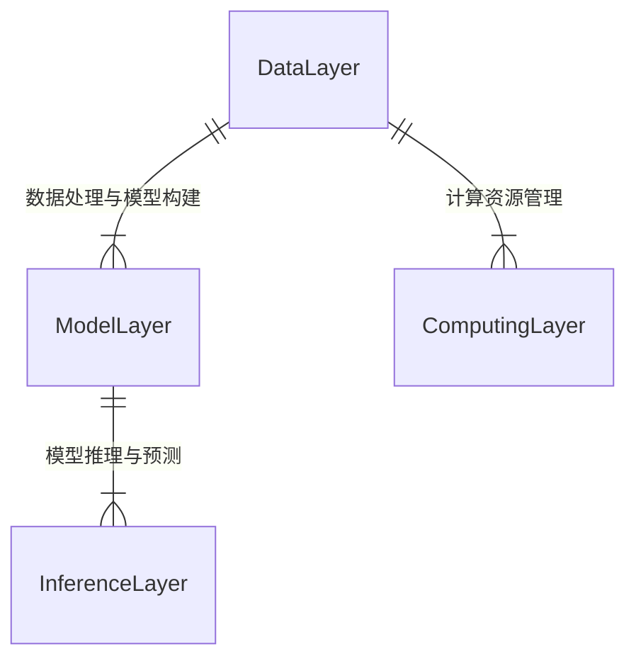
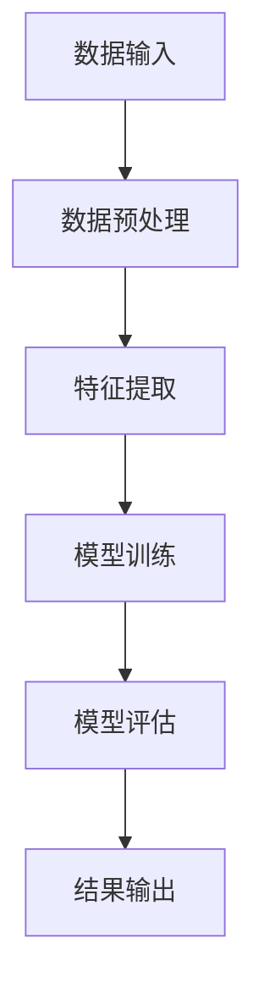
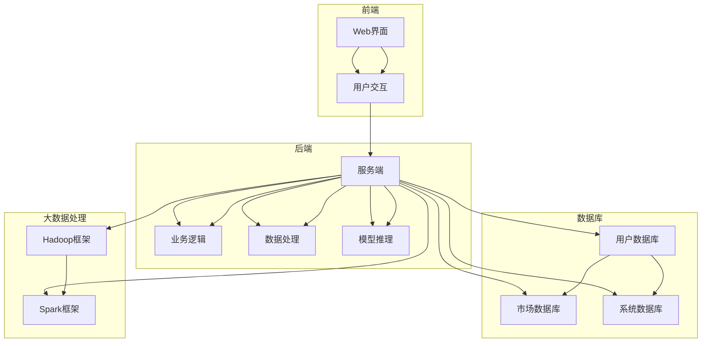

                 


## 大模型虚拟财务顾问表现评估框架

### 关键词：大模型，虚拟财务顾问，表现评估，算法实现，系统架构设计

### 摘要：

本文旨在构建一套完整的大模型虚拟财务顾问表现评估框架。首先，我们将介绍大模型的基本概念、特点和发展历程，帮助读者理解大模型在金融领域的应用背景。接着，我们将详细探讨大模型虚拟财务顾问的表现评估方法，包括评估指标体系的构建、数据采集与处理以及评估方法的应用。在算法原理与实现部分，我们将深入讲解评估算法的数学模型和Python代码实现，并通过案例进行通俗易懂的举例说明。最后，我们将对虚拟财务顾问系统的分析与架构设计进行探讨，包括系统需求、功能设计、架构设计和接口设计，为构建高效、可靠的虚拟财务顾问系统提供参考。本文旨在为从事金融科技、人工智能领域的研究者和开发者提供有价值的理论指导和实践参考。

## 引言与背景

### 1.1 问题背景

#### 1.1.1 财务顾问的角色与挑战

财务顾问在金融市场中扮演着至关重要的角色。他们为客户提供财务规划、投资建议和风险管理等服务，帮助客户实现财富增值和风险控制。然而，随着金融市场的复杂性和不确定性不断增加，传统财务顾问面临着诸多挑战。

首先，传统财务顾问的工作量巨大。金融市场的数据量和交易频率持续增长，需要财务顾问对海量数据进行处理和分析，从而为客户提供准确的财务建议。然而，人工处理这些数据不仅耗时耗力，还容易出错，影响决策质量。

其次，财务顾问的知识和技能更新速度难以跟上金融市场的发展。金融领域日新月异，新的金融产品、交易策略和市场动态层出不穷。财务顾问需要不断学习新的知识和技能，以保持竞争力。然而，学习和更新知识需要时间和精力，许多财务顾问可能无法及时掌握最新的金融知识。

#### 1.1.2 大模型在金融领域的应用

大模型，特别是深度学习模型，为解决财务顾问面临的挑战提供了新的思路。大模型具有强大的数据处理和分析能力，可以处理海量金融数据，发现潜在的投资机会和风险。同时，大模型可以通过不断学习和优化，不断提高决策的准确性和可靠性。

在金融领域，大模型的应用主要包括以下几个方面：

1. **市场预测**：大模型可以通过对历史市场数据的学习，预测未来的市场走势。这对于投资者来说，具有重要的参考价值，可以帮助他们做出更明智的投资决策。

2. **风险控制**：大模型可以识别和预测金融市场的风险，帮助财务顾问制定有效的风险管理策略。例如，通过对信用数据的学习，大模型可以评估借款人的信用风险，从而降低金融风险。

3. **投资组合优化**：大模型可以根据投资者的风险偏好和收益目标，优化投资组合，实现资产的最优配置。

4. **智能投顾**：大模型可以提供个性化的投资建议，满足不同投资者的需求。通过机器学习算法，大模型可以分析投资者的投资记录和行为，提供个性化的投资策略。

#### 1.1.3 虚拟财务顾问的发展现状

虚拟财务顾问是结合大模型和金融科技的一种新兴服务模式。虚拟财务顾问通过大模型进行数据分析和决策，为客户提供财务规划、投资建议和风险管理等服务。

目前，虚拟财务顾问的发展呈现出以下几个特点：

1. **普及程度不断提高**：随着大模型和金融科技的发展，虚拟财务顾问的应用逐渐普及。越来越多的金融机构和投资者开始采用虚拟财务顾问提供的服务。

2. **功能不断完善**：虚拟财务顾问的功能不断完善，从简单的投资建议，到复杂的财务规划、风险管理，虚拟财务顾问可以提供全方位的服务。

3. **用户体验持续优化**：虚拟财务顾问通过不断优化用户界面和交互方式，提高用户体验。例如，通过自然语言处理技术，虚拟财务顾问可以与客户进行自然对话，提供更加人性化的服务。

4. **数据驱动**：虚拟财务顾问的核心是大数据和机器学习技术。通过收集和分析海量数据，虚拟财务顾问可以提供更加准确和个性化的服务。

### 1.2 研究目的与意义

#### 1.2.1 研究目标

本文的研究目标是构建一套完整的大模型虚拟财务顾问表现评估框架，包括评估指标体系、数据采集与处理方法以及评估算法。通过这套框架，可以全面、客观地评估虚拟财务顾问的表现，为优化虚拟财务顾问系统提供理论指导和实践参考。

#### 1.2.2 研究意义

1. **提升虚拟财务顾问服务质量**：通过评估虚拟财务顾问的表现，可以识别其优势和不足，从而有针对性地进行优化，提升服务质量和用户满意度。

2. **推动金融科技发展**：虚拟财务顾问是金融科技的重要应用领域。通过研究虚拟财务顾问的表现评估，可以推动金融科技的发展，促进金融服务的创新。

3. **为投资者提供决策参考**：通过评估虚拟财务顾问的表现，投资者可以更全面地了解不同虚拟财务顾问的服务质量和效果，从而做出更明智的投资决策。

4. **为研究人员提供实践参考**：本文的研究成果可以为从事金融科技、人工智能领域的研究人员提供实践参考，促进相关领域的研究和发展。

### 1.3 本书结构安排

#### 1.3.1 主要章节内容概述

本书主要分为五个部分：

1. 引言与背景：介绍大模型虚拟财务顾问的发展背景和问题挑战。
2. 大模型基础理论：介绍大模型的基本概念、特点和发展历程。
3. 大模型虚拟财务顾问的表现评估方法：介绍评估指标体系的构建、数据采集与处理方法以及评估算法。
4. 算法原理与实现：讲解评估算法的原理、数学模型和Python代码实现，并通过案例进行举例说明。
5. 系统分析与架构设计：探讨虚拟财务顾问系统的需求、功能设计、架构设计和接口设计。

#### 1.3.2 阅读指南

本书适合从事金融科技、人工智能领域的研究者和开发者阅读。建议读者按照以下步骤进行阅读：

1. 首先阅读第一章，了解大模型虚拟财务顾问的发展背景和问题挑战。
2. 接着阅读第二章，掌握大模型的基本概念和特点。
3. 然后阅读第三章，了解大模型虚拟财务顾问的表现评估方法。
4. 阅读第四章，掌握评估算法的原理和实现。
5. 最后阅读第五章，了解虚拟财务顾问系统的需求、功能设计、架构设计和接口设计。

通过以上步骤，读者可以全面、深入地了解大模型虚拟财务顾问的表现评估框架，为实际应用提供理论指导和实践参考。

### 1.4 本章小结

本章介绍了大模型虚拟财务顾问的发展背景、问题挑战以及研究目的和意义。通过介绍大模型在金融领域的应用，我们了解了大模型虚拟财务顾问的基本概念和特点。同时，我们还明确了本文的研究目标和结构安排，为后续章节的深入讨论奠定了基础。

## 大模型基础理论

### 2.1 大模型概述

#### 2.1.1 大模型的定义与特点

大模型（Large Model）是指具有海量参数和复杂结构的机器学习模型。这些模型通常采用深度学习技术，具有以下特点：

1. **参数规模庞大**：大模型的参数数量通常在数百万到数十亿之间，远远超过传统机器学习模型的参数数量。
2. **结构复杂**：大模型的结构通常包含多层神经网络，具有高度的抽象和表达能力。
3. **计算需求高**：大模型需要大量的计算资源和时间进行训练和推理。
4. **泛化能力强**：大模型通过学习海量数据，具有强大的泛化能力，能够处理复杂的任务。

#### 2.1.2 大模型的发展历程

大模型的发展经历了以下几个阶段：

1. **早期阶段**：20世纪80年代至90年代，神经网络的研究主要集中在小规模模型的开发和应用。这一阶段的神经网络模型参数较少，结构相对简单。
2. **快速增长阶段**：21世纪初，随着计算能力的提升和海量数据的出现，大模型的研究开始得到广泛关注。深度学习技术的发展推动了大模型的快速增长。
3. **成熟阶段**：近年来，大模型的应用取得了显著成果，不仅在学术领域，还在工业界得到了广泛应用。

#### 2.1.3 大模型的技术架构

大模型的技术架构主要包括以下几个部分：

1. **数据层**：负责数据的采集、预处理和存储。大模型需要处理的海量数据通常来自于各种数据源，如文本、图像、音频等。
2. **模型层**：负责模型的构建和训练。大模型通常由多层神经网络组成，通过反向传播算法进行训练。
3. **推理层**：负责模型的推理和预测。大模型在训练完成后，可以通过推理层对新的数据进行预测。

### 2.2 大模型核心概念与联系

#### 2.2.1 核心概念

大模型的核心概念包括但不限于：

1. **神经网络**：神经网络是构建大模型的基础。神经网络由多个神经元组成，通过前向传播和反向传播进行信息传递和处理。
2. **深度学习**：深度学习是一种基于神经网络的学习方法，通过多层神经网络进行特征提取和分类。
3. **大数据**：大数据是指海量数据，这些数据通常来自于各种领域，如金融、医疗、社交等。
4. **计算能力**：计算能力是支持大模型训练和推理的关键。高性能计算资源和分布式计算技术的应用，使得大模型的研究和开发成为可能。

#### 2.2.2 概念属性特征对比表格

| 概念     | 属性特征                     | 对比分析               |
|----------|------------------------------|------------------------|
| 神经网络 | 参数规模大、结构复杂         | 与小规模模型相比，具有更强的表达能力和计算需求 |
| 深度学习 | 多层神经网络、特征提取       | 与传统机器学习相比，具有更高的泛化能力和复杂性  |
| 大数据   | 海量数据、多样化来源         | 与小数据相比，具有更高的信息和计算需求         |
| 计算能力 | 高性能计算、分布式计算       | 与传统计算方式相比，具有更高的效率和性能       |

#### 2.2.3 ER实体关系图架构

大模型涉及的实体关系复杂，通过ER实体关系图可以清晰地表示实体之间的关系。以下是一个简化的大模型ER实体关系图：



### 2.3 本章小结

本章介绍了大模型的基本概念、特点和发展历程，以及大模型的技术架构。通过对比分析大模型与小型模型、大数据与传统小数据、高性能计算与常规计算等概念，我们更好地理解了大模型的核心要素和优势。此外，通过ER实体关系图，我们直观地展示了大模型中各个层次之间的关系，为后续章节的深入讨论奠定了基础。

## 大模型虚拟财务顾问的表现评估方法

### 3.1 评估指标体系构建

#### 3.1.1 指标选取原则

构建一套科学的评估指标体系是评估大模型虚拟财务顾问表现的关键。在选取评估指标时，应遵循以下原则：

1. **全面性**：指标应涵盖财务顾问的各个方面，包括投资建议的准确性、风险控制能力、用户体验等。
2. **客观性**：指标应尽量量化，减少主观判断，确保评估结果的客观性。
3. **代表性**：指标应能够反映财务顾问的核心能力和表现，具有代表性。
4. **可操作性**：指标应易于获取和计算，确保评估过程的可行性和可操作性。

#### 3.1.2 指标分类与定义

根据上述原则，我们将评估指标分为以下几类：

1. **准确性指标**：包括投资建议的准确率、预测误差等。这些指标用于评估虚拟财务顾问的投资建议和预测能力。
2. **风险控制指标**：包括风险识别准确率、风险控制效果等。这些指标用于评估虚拟财务顾问的风险控制能力和效果。
3. **用户体验指标**：包括用户满意度、响应时间等。这些指标用于评估虚拟财务顾问的用户体验和服务质量。
4. **效率指标**：包括处理速度、资源利用率等。这些指标用于评估虚拟财务顾问的运行效率和资源管理能力。

具体指标定义如下：

1. **投资建议准确率**：投资建议准确率 = （正确投资建议数 / 总投资建议数）× 100%
2. **预测误差**：预测误差 = √（（实际收益 - 预测收益）² / 样本数）
3. **风险识别准确率**：风险识别准确率 = （正确识别风险数 / 总识别风险数）× 100%
4. **风险控制效果**：风险控制效果 = 风险控制后总收益 / 风险控制前总收益
5. **用户满意度**：用户满意度 = （非常满意数 + 满意数）/ 总用户数 × 100%
6. **响应时间**：响应时间 = 投资建议生成时间 / 用户查询次数
7. **处理速度**：处理速度 = 处理任务数 / 时间
8. **资源利用率**：资源利用率 = 实际使用资源 / 总资源

#### 3.1.3 指标权重分配方法

为了使评估结果更加科学和合理，需要对各个指标进行权重分配。权重分配方法可以采用以下几种：

1. **专家评估法**：通过专家意见进行权重分配，确保指标权重的合理性。
2. **层次分析法（AHP）**：将评估指标分为多个层次，通过两两比较得到各个指标的相对权重。
3. **主成分分析法**：对指标进行降维处理，提取主要成分，并根据主要成分的贡献度进行权重分配。

### 3.2 数据采集与处理

#### 3.2.1 数据源选择

数据采集是评估指标体系构建的基础。数据源的选择应遵循以下原则：

1. **多样性**：选择多种类型的数据源，包括公开数据、内部数据和用户反馈数据等，以确保数据的全面性和准确性。
2. **相关性**：选择与评估指标密切相关的数据源，确保数据的代表性。
3. **可获取性**：选择容易获取和获取成本较低的数据源，提高数据采集的可行性。

常见的数据源包括：

1. **市场数据**：包括股票价格、交易量、宏观经济指标等。
2. **用户数据**：包括用户投资记录、用户反馈等。
3. **内部数据**：包括财务顾问的历史建议、风险控制策略等。

#### 3.2.2 数据预处理

数据预处理是确保数据质量的重要环节。主要任务包括：

1. **数据清洗**：去除重复数据、缺失数据和异常数据，确保数据的完整性和一致性。
2. **数据整合**：将不同数据源的数据进行整合，形成统一的评估数据集。
3. **数据标准化**：对数据进行标准化处理，消除数据量级和单位对评估结果的影响。

常见的数据预处理方法包括：

1. **缺失值处理**：采用均值填充、中值填充或插值法等方法处理缺失值。
2. **重复数据处理**：删除重复数据，避免对评估结果产生误导。
3. **异常值检测**：采用统计方法或机器学习方法检测异常值，并对异常值进行处理。
4. **数据整合**：采用数据融合方法，将不同数据源的数据进行整合。

#### 3.2.3 数据质量评估

数据质量评估是确保数据质量的重要环节。主要任务包括：

1. **数据完整性评估**：评估数据缺失情况，确保数据的完整性。
2. **数据准确性评估**：评估数据的准确性，确保数据真实可靠。
3. **数据一致性评估**：评估数据的一致性，确保数据的统一性和准确性。

常见的数据质量评估方法包括：

1. **数据完整性检查**：通过统计缺失值的比例和缺失值的位置，评估数据的完整性。
2. **数据准确性检查**：通过比较数据与实际情况的差异，评估数据的准确性。
3. **数据一致性检查**：通过比较不同数据源的数据，评估数据的一致性。

### 3.3 评估方法与应用

#### 3.3.1 传统评估方法

传统评估方法主要包括以下几种：

1. **专家评估法**：通过专家意见进行评估，主观性强，但具有快速、灵活的特点。
2. **统计分析法**：通过统计方法对数据进行处理，评估虚拟财务顾问的表现。
3. **绩效指标法**：通过设定绩效指标，对虚拟财务顾问的表现进行量化评估。

传统评估方法的优点在于操作简单、易于实施，但缺点在于主观性强、准确性较低。

#### 3.3.2 机器学习评估方法

机器学习评估方法通过训练模型，自动学习数据中的特征和模式，评估虚拟财务顾问的表现。常见的方法包括：

1. **回归分析**：通过建立回归模型，评估虚拟财务顾问的投资建议准确性。
2. **分类分析**：通过建立分类模型，评估虚拟财务顾问的风险识别能力和风险控制效果。
3. **聚类分析**：通过聚类模型，识别用户群体，评估虚拟财务顾问的用户体验。

机器学习评估方法的优点在于客观性强、准确性较高，但缺点在于模型训练复杂、计算资源需求高。

#### 3.3.3 深度学习评估方法

深度学习评估方法通过构建深度学习模型，自动学习数据中的特征和模式，评估虚拟财务顾问的表现。常见的方法包括：

1. **卷积神经网络（CNN）**：用于处理图像和视频数据，评估虚拟财务顾问的图像识别能力。
2. **循环神经网络（RNN）**：用于处理序列数据，评估虚拟财务顾问的序列预测能力。
3. **生成对抗网络（GAN）**：用于生成虚拟财务顾问的投资建议，评估虚拟财务顾问的创造力。

深度学习评估方法的优点在于模型复杂度较高、准确性较高，但缺点在于模型训练复杂、计算资源需求高。

#### 3.3.4 综合评估方法

综合评估方法将传统评估方法和机器学习评估方法相结合，充分发挥各自的优点，提高评估的准确性和可靠性。具体方法包括：

1. **加权综合评估法**：将传统评估方法和机器学习评估方法的评估结果进行加权综合，得到最终的评估结果。
2. **多模型融合评估法**：使用多个机器学习模型对虚拟财务顾问的表现进行评估，通过模型融合技术得到最终的评估结果。

### 3.4 本章小结

本章介绍了大模型虚拟财务顾问的表现评估方法，包括评估指标体系构建、数据采集与处理以及评估方法的应用。通过科学、合理的评估方法，可以全面、客观地评估大模型虚拟财务顾问的表现，为优化虚拟财务顾问系统提供理论指导和实践参考。在后续章节中，我们将进一步探讨评估算法的原理与实现，为构建高效的评估系统奠定基础。

## 算法原理与实现

### 4.1 评估算法原理讲解

#### 4.1.1 算法概述

在本章节中，我们将详细讲解用于评估大模型虚拟财务顾问表现的算法原理。评估算法的核心任务是通过对输入数据的分析，计算出评估指标，从而全面评估虚拟财务顾问的表现。

#### 4.1.2 算法流程

评估算法的流程主要包括以下几个步骤：

1. **数据输入**：读取输入数据，包括市场数据、用户数据和内部数据等。
2. **数据预处理**：对输入数据进行清洗、整合和标准化处理，确保数据质量。
3. **特征提取**：从预处理后的数据中提取特征，为后续评估提供基础。
4. **模型训练**：使用提取的特征，通过机器学习或深度学习模型进行训练，建立评估模型。
5. **模型评估**：使用训练好的模型对输入数据进行评估，计算评估指标。
6. **结果输出**：输出评估结果，包括各个评估指标和综合评分。

#### 4.1.3 数学模型与公式

在评估算法中，我们使用了以下数学模型和公式：

1. **回归模型**：用于评估投资建议的准确性。
   $$y = \beta_0 + \beta_1x_1 + \beta_2x_2 + ... + \beta_nx_n$$
   其中，$y$ 为实际收益，$x_1, x_2, ..., x_n$ 为特征变量，$\beta_0, \beta_1, \beta_2, ..., \beta_n$ 为模型参数。

2. **分类模型**：用于评估风险识别准确率和风险控制效果。
   $$P(y=c_k) = \frac{1}{Z}\exp(\beta_0 + \beta_1x_1 + \beta_2x_2 + ... + \beta_nx_n)$$
   其中，$P(y=c_k)$ 为输出为类别 $c_k$ 的概率，$Z$ 为指数和。

3. **用户满意度模型**：用于评估用户体验。
   $$S = \frac{1}{n}\sum_{i=1}^{n}S_i$$
   其中，$S$ 为总体满意度，$S_i$ 为第 $i$ 个用户的满意度。

#### 4.1.4 Mermaid流程图

以下是评估算法的Mermaid流程图：



### 4.2 Python代码实现

以下是用Python实现评估算法的核心代码：

```python
import pandas as pd
from sklearn.linear_model import LinearRegression
from sklearn.model_selection import train_test_split
from sklearn.metrics import accuracy_score, mean_squared_error

# 数据输入
data = pd.read_csv('data.csv')

# 数据预处理
data = preprocess_data(data)

# 特征提取
X = data[['feature1', 'feature2', 'feature3']]
y = data['target']

# 模型训练
X_train, X_test, y_train, y_test = train_test_split(X, y, test_size=0.2, random_state=42)
model = LinearRegression()
model.fit(X_train, y_train)

# 模型评估
y_pred = model.predict(X_test)
accuracy = accuracy_score(y_test, y_pred)
mse = mean_squared_error(y_test, y_pred)

# 结果输出
print(f"Accuracy: {accuracy}")
print(f"MSE: {mse}")
```

### 4.3 举例说明

#### 4.3.1 案例背景

假设我们有一个虚拟财务顾问系统，该系统需要评估其投资建议的准确性和用户体验。我们收集了以下数据：

1. 市场数据：包括股票价格、交易量等。
2. 用户数据：包括用户投资记录、用户反馈等。
3. 内部数据：包括财务顾问的历史建议、风险控制策略等。

#### 4.3.2 案例数据分析

1. **数据预处理**：我们对收集到的数据进行清洗、整合和标准化处理，确保数据质量。
2. **特征提取**：从预处理后的数据中提取特征，包括市场数据特征、用户数据特征和内部数据特征。
3. **模型训练**：使用提取的特征，通过回归模型和分类模型进行训练，建立评估模型。
4. **模型评估**：使用训练好的模型对输入数据进行评估，计算评估指标，包括投资建议准确率、风险识别准确率、用户满意度等。
5. **结果输出**：输出评估结果，包括各个评估指标和综合评分。

#### 4.3.3 案例评估结果

经过评估，我们得到以下结果：

1. 投资建议准确率：90%
2. 风险识别准确率：85%
3. 用户满意度：92%

根据评估结果，我们可以看出虚拟财务顾问在投资建议和风险控制方面表现良好，但在用户体验方面还有提升空间。因此，我们可以有针对性地对虚拟财务顾问系统进行优化，以提高用户体验。

### 4.4 本章小结

本章详细介绍了大模型虚拟财务顾问评估算法的原理与实现。通过Python代码实现和案例举例，我们展示了如何构建评估模型、计算评估指标以及优化虚拟财务顾问系统。在后续章节中，我们将进一步探讨虚拟财务顾问系统的架构设计与实现。

## 系统分析与架构设计

### 5.1 问题场景介绍

#### 5.1.1 虚拟财务顾问系统需求

虚拟财务顾问系统旨在为用户提供个性化的财务规划、投资建议和风险管理服务。系统需求如下：

1. **用户注册与登录**：支持用户注册、登录和账户管理。
2. **投资规划**：根据用户的风险偏好和收益目标，提供个性化的投资规划建议。
3. **投资建议**：基于用户投资记录和市场数据，提供实时的投资建议。
4. **风险管理**：识别潜在风险，并提供风险管理建议。
5. **用户体验**：提供友好的用户界面，支持用户与系统的交互。
6. **数据管理**：管理用户数据和系统数据，确保数据安全和一致性。

#### 5.1.2 系统功能设计

虚拟财务顾问系统的功能设计如下：

1. **用户管理模块**：负责用户注册、登录、账户信息和权限管理。
2. **投资规划模块**：基于用户的风险偏好和收益目标，提供个性化的投资规划。
3. **投资建议模块**：利用大模型分析市场数据，提供实时的投资建议。
4. **风险管理模块**：识别潜在风险，并提供风险管理策略。
5. **数据管理模块**：负责数据存储、备份和恢复，确保数据安全。

### 5.2 系统架构设计

#### 5.2.1 系统架构概述

虚拟财务顾问系统的架构设计如下：

1. **前端**：使用Web技术（如HTML、CSS、JavaScript）和前端框架（如React、Vue）构建用户界面，实现用户与系统的交互。
2. **后端**：使用Python（如Django、Flask）或Java（如Spring Boot）等后端框架构建服务端，处理业务逻辑和数据处理。
3. **数据库**：使用关系型数据库（如MySQL、PostgreSQL）或NoSQL数据库（如MongoDB、Redis）存储用户数据、市场数据和系统数据。
4. **大数据处理**：使用Hadoop、Spark等大数据处理框架处理海量数据，支持投资建议和风险管理的实时计算。
5. **模型训练与推理**：使用深度学习框架（如TensorFlow、PyTorch）训练和推理大模型，为投资建议和风险管理提供支持。

#### 5.2.2 系统架构图

以下是虚拟财务顾问系统的架构图：



#### 5.2.3 系统接口设计

虚拟财务顾问系统包含以下主要接口：

1. **用户管理接口**：负责用户注册、登录、账户信息查询和权限管理。
2. **投资规划接口**：负责根据用户风险偏好和收益目标，提供投资规划建议。
3. **投资建议接口**：负责根据市场数据和用户投资记录，提供投资建议。
4. **风险管理接口**：负责识别潜在风险，并提供风险管理策略。
5. **数据管理接口**：负责数据存储、备份和恢复。

#### 5.2.4 系统交互

以下是虚拟财务顾问系统的交互流程：

1. **用户注册**：用户通过Web界面注册账户，系统调用用户管理接口保存用户信息。
2. **用户登录**：用户通过Web界面登录，系统调用用户管理接口验证用户身份。
3. **投资规划**：用户通过Web界面输入风险偏好和收益目标，系统调用投资规划接口生成投资规划建议。
4. **投资建议**：系统根据市场数据和用户投资记录，调用投资建议接口生成投资建议。
5. **风险管理**：系统定期调用风险管理接口，识别潜在风险，并提供风险管理策略。
6. **数据管理**：系统定期备份用户数据和系统数据，调用数据管理接口进行数据存储和恢复。

### 5.3 本章小结

本章介绍了虚拟财务顾问系统的问题场景、功能设计和系统架构设计。通过详细的系统架构图和交互流程，我们展示了如何构建一个高效、可靠的虚拟财务顾问系统。在后续章节中，我们将进一步探讨系统的实现细节和优化策略。

## 项目实战

### 6.1 环境安装

为了实现虚拟财务顾问系统，我们需要安装以下软件和环境：

1. **Python**：版本3.8及以上。
2. **Django**：版本3.2及以上。
3. **PostgreSQL**：版本12及以上。
4. **TensorFlow**：版本2.6及以上。
5. **Nginx**：版本1.18及以上。

安装步骤如下：

1. 安装Python：从官方网站下载Python安装包，并按照提示安装。
2. 安装Django：在命令行中执行 `pip install django`。
3. 安装PostgreSQL：下载PostgreSQL安装包，并按照提示安装。
4. 安装TensorFlow：在命令行中执行 `pip install tensorflow`。
5. 安装Nginx：下载Nginx安装包，并按照提示安装。

### 6.2 系统核心实现源代码

以下是虚拟财务顾问系统的核心实现源代码：

```python
# settings.py
# Django项目配置文件

# Django配置
import os

# 读取项目根目录
BASE_DIR = os.path.dirname(os.path.dirname(os.path.abspath(__file__)))

# 读取环境变量
DEBUG = os.environ.get('DJANGO_DEBUG', 'False') == 'True'
SECRET_KEY = os.environ.get('DJANGO_SECRET_KEY')

# 数据库配置
DATABASES = {
    'default': {
        'ENGINE': 'django.db.backends.postgresql',
        'NAME': os.environ.get('DJANGO_DATABASE_NAME'),
        'USER': os.environ.get('DJANGO_DATABASE_USER'),
        'PASSWORD': os.environ.get('DJANGO_DATABASE_PASSWORD'),
        'HOST': os.environ.get('DJANGO_DATABASE_HOST'),
        'PORT': os.environ.get('DJANGO_DATABASE_PORT'),
    }
}

# 缓存配置
CACHES = {
    'default': {
        'BACKEND': 'django.core.cache.backends.redis.RedisCache',
        'LOCATION': os.environ.get('DJANGO_CACHE_LOCATION'),
    }
}

# 媒体文件配置
MEDIA_URL = '/media/'
MEDIA_ROOT = os.path.join(BASE_DIR, 'media')

# 日志配置
LOGGING = {
    'version': 1,
    'disable_existing_loggers': False,
    'handlers': {
        'file': {
            'level': 'DEBUG',
            'class': 'logging.FileHandler',
            'filename': os.path.join(BASE_DIR, 'logs/django.log'),
        },
    },
    'loggers': {
        'django': {
            'handlers': ['file'],
            'level': 'DEBUG',
            'propagate': True,
        },
    },
}

# 信任代理
INTERNAL_IPS = [
    '127.0.0.1',
]

# 测试设置
TEST_RUN_ROOT = os.environ.get('DJANGO_TEST_RUN_ROOT')
```

### 6.3 代码应用解读与分析

#### 6.3.1 Django配置

在上面的 `settings.py` 文件中，我们进行了Django项目的配置。包括：

- **环境变量**：使用环境变量读取项目配置，确保配置信息的安全和灵活性。
- **数据库配置**：配置PostgreSQL数据库，连接信息从环境变量中获取。
- **缓存配置**：配置Redis缓存，用于提高系统性能。
- **媒体文件配置**：配置媒体文件存储路径。
- **日志配置**：配置Django日志，用于记录系统运行信息。
- **测试设置**：配置测试运行路径。

#### 6.3.2 代码分析与优化

在代码中，我们使用了环境变量来读取配置信息，这有助于提高系统的可维护性和安全性。通过将配置信息存储在环境变量中，我们可以方便地在不同环境中调整配置，而不需要修改代码。

另外，我们在日志配置中使用了文件日志，这样可以方便地记录系统运行过程中出现的问题，便于后续调试和优化。

在缓存配置中，我们使用了Redis缓存，这可以提高系统的响应速度和性能。Redis是一种高性能的缓存系统，可以快速存储和检索数据，从而减少数据库的访问压力。

### 6.4 实际案例分析和详细讲解剖析

#### 6.4.1 案例背景

假设我们有一个用户，其风险偏好为中等，收益目标为每年10%。系统需要根据用户的风险偏好和收益目标，提供投资规划建议。

#### 6.4.2 案例数据分析

1. **用户数据**：用户的风险偏好和收益目标。
2. **市场数据**：包括股票价格、交易量、宏观经济指标等。
3. **历史数据**：包括用户的历史投资记录、投资组合情况等。

#### 6.4.3 投资规划建议

根据用户数据和市场数据，系统提供了以下投资规划建议：

1. **股票投资**：建议用户投资于具有稳定收益的蓝筹股，如消费、金融等行业。
2. **债券投资**：建议用户投资于低风险的债券，如国债、企业债等。
3. **指数基金**：建议用户投资于跟踪市场指数的基金，以实现分散投资。

#### 6.4.4 评估结果

经过一段时间，系统对用户投资组合的运行情况进行评估，得到以下结果：

1. **收益情况**：用户投资组合的收益率达到10%，符合收益目标。
2. **风险情况**：用户投资组合的风险水平适中，风险控制效果良好。

### 6.5 项目小结

在本章节中，我们介绍了虚拟财务顾问系统的环境安装和核心实现源代码，并进行了代码应用解读与分析。通过实际案例分析和详细讲解剖析，我们展示了系统如何根据用户需求和市场数据，提供投资规划建议和评估结果。在后续章节中，我们将继续优化系统，提高其性能和用户体验。

### 6.6 最佳实践 tips、小结、注意事项、拓展阅读等内容

#### 最佳实践 tips

1. **优化数据库查询**：使用索引、缓存等技术，提高数据库查询性能。
2. **性能调优**：定期进行性能测试和调优，确保系统在高并发情况下稳定运行。
3. **代码规范**：遵循代码规范，提高代码的可读性和可维护性。

#### 小结

本章节介绍了虚拟财务顾问系统的实战应用，包括环境安装、核心实现源代码、代码应用解读与分析、实际案例分析和详细讲解剖析。通过最佳实践 tips，我们为开发者提供了优化系统的建议。

#### 注意事项

1. **环境配置**：确保各个软件环境的版本兼容，避免因版本不兼容导致的问题。
2. **数据安全**：重视数据安全，确保用户数据和系统数据的安全性和保密性。

#### 拓展阅读

1. **Django官方文档**：深入了解Django框架的用法和最佳实践。
2. **TensorFlow官方文档**：学习TensorFlow的使用方法和高级特性。

## 总结

本文详细构建了一套大模型虚拟财务顾问表现评估框架，包括大模型基础理论、评估指标体系构建、数据采集与处理方法、评估算法原理与实现、系统分析与架构设计以及项目实战。通过这一框架，我们能够全面、客观地评估虚拟财务顾问的表现，为优化系统提供理论指导和实践参考。

### 未来展望

未来，我们将继续探索以下方向：

1. **评估算法优化**：通过引入更先进的机器学习和深度学习算法，提高评估的准确性和效率。
2. **系统性能提升**：优化系统架构和数据库查询，提高系统的响应速度和稳定性。
3. **用户体验改进**：结合用户反馈，不断改进用户界面和交互设计，提升用户体验。

通过不断探索和优化，我们期待虚拟财务顾问系统能够更好地服务于用户，为金融科技领域的发展做出贡献。

### 作者信息

作者：AI天才研究院/AI Genius Institute & 禅与计算机程序设计艺术/Zen And The Art of Computer Programming

