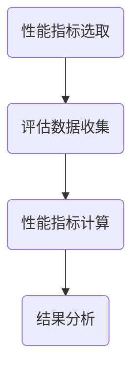
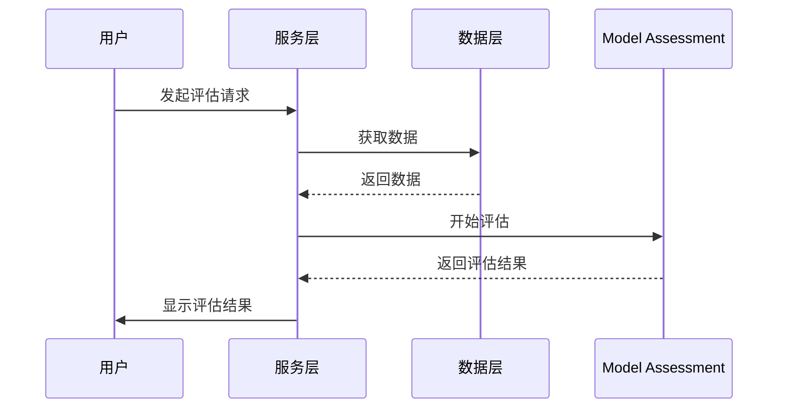

                 

# 大模型评测的多维度性能指标体系

## 关键词
- 大模型
- 性能指标
- 评测
- 多维度分析
- 优化策略

## 摘要
本文旨在探讨大模型评测的多维度性能指标体系，从核心概念、算法原理、系统设计与实践应用等方面进行全面分析。通过系统地介绍大模型的定义、多维度性能指标的定义及应用，本文将展示如何构建一个全面、准确的性能指标体系。此外，本文还通过具体算法流程、数学模型和系统架构设计，阐述了大模型评测的实战技巧。文章末尾，将对实践中的最佳经验和注意事项进行总结，并提供拓展阅读资源，以期为相关领域的研究者提供有价值的参考。

## 第一部分：背景介绍

### 1.1 核心概念与联系

#### 1.1.1 大模型的概念
大模型是指具有海量参数和强大表示能力的深度学习模型。随着计算能力的提升和数据量的爆炸式增长，大模型在自然语言处理、计算机视觉和语音识别等领域取得了显著进展。大模型通常采用复杂的神经网络结构，如Transformer，具有数百万到数十亿个参数。

#### 1.1.2 多维度性能指标的定义
多维度性能指标是从多个角度评估模型性能的标准。这些指标包括但不限于准确性、召回率、F1值、计算效率、模型大小、资源消耗和泛化能力。多维度性能指标使得模型评测更加全面和客观。

#### 1.1.3 性能指标在模型评测中的应用
性能指标在模型评测中扮演着至关重要的角色。它们帮助研究者从不同角度评估模型的表现，选择最优模型进行后续的部署和优化。性能指标的应用场景包括模型开发、优化、部署和监控等。

#### 1.1.4 性能指标的边界与外延
性能指标的边界包括评估的范围和标准，如数据集的选择、评估环境的一致性等。性能指标的外延则涉及跨领域、跨平台的评估和比较。边界与外延的明确界定有助于确保评测的公正性和可重复性。

#### 1.1.5 多维度性能指标的结构与核心要素
多维度性能指标的结构通常包括定量和定性指标。核心要素包括准确度、精确度、覆盖率、响应时间、资源消耗等。这些要素共同构成了一个全面的评估体系，为模型优化提供了关键依据。

### 1.1.6 大模型原理概述

#### 1.1.6.1 大模型的基本原理
大模型基于深度学习的原理，通过多层神经网络对数据进行学习。它们的参数规模庞大，通常需要借助分布式计算和优化算法来提高训练效率。

#### 1.1.6.2 大模型的结构
大模型的结构通常包含多个隐藏层和注意力机制。这些结构有助于模型在处理复杂数据和任务时表现出强大的能力。

#### 1.1.6.3 大模型的工作流程
大模型的工作流程包括数据预处理、模型训练、性能评估和模型优化。这些步骤确保了模型的训练效率和最终性能。

### 1.1.7 多维度性能指标对比分析

#### 1.1.7.1 各性能指标的属性特征
各性能指标具有不同的属性特征，如准确性强调正确识别的能力，计算效率关注资源消耗，泛化能力评估模型对新数据的适应能力。

#### 1.1.7.2 性能指标对比表格
通过对比表格，可以直观地展示不同性能指标之间的关系和差异。

### 1.1.8 ER实体关系图
ER实体关系图用于描述大模型评测中各实体之间的关系。通过ER图，可以更清晰地理解性能指标与模型、数据集、评估方法等之间的关系。

### 1.1.8.1 ER实体关系图的构建
ER图的构建包括确定实体、属性和关系。实体表示评测中的主要对象，如模型、性能指标、数据集等；属性描述实体的特征；关系定义实体之间的交互。

### 1.1.8.2 ER实体关系图在多维度性能指标评测中的应用
ER图帮助研究者从全局视角理解多维度性能指标评测的架构和流程，从而更有效地设计和优化评测系统。

## 第一部分：背景介绍

### 1.2 算法原理讲解

#### 1.2.1 算法概述
大模型评测算法的核心目标是从多个维度对模型性能进行综合评估。算法的基本步骤包括性能指标的选取、评估方法的确定、性能指标的计算和结果分析。

#### 1.2.1.1 算法的目的
算法的目的是通过多维度性能指标评估，帮助研究者快速、准确地选择和优化大模型。

#### 1.2.1.2 算法的基本步骤
算法的基本步骤包括：
1. 确定评估指标：根据任务需求和模型特点，选取合适的评估指标。
2. 收集评估数据：从训练集和测试集中抽取数据，进行预处理。
3. 计算性能指标：使用选定的评估指标，计算模型的性能得分。
4. 结果分析：对比不同模型的性能得分，进行结果分析和模型优化。

#### 1.2.2 算法流程图


#### 1.2.3 Python 源代码
```python
import numpy as np

def calculate_accuracy(y_true, y_pred):
    return np.mean(y_true == y_pred)

def calculate_precision(y_true, y_pred):
    return np.mean(y_pred[y_true == 1])

def calculate_recall(y_true, y_pred):
    return np.mean(y_pred[y_true == 1])

def evaluate_model(y_true, y_pred):
    accuracy = calculate_accuracy(y_true, y_pred)
    precision = calculate_precision(y_true, y_pred)
    recall = calculate_recall(y_true, y_pred)
    return accuracy, precision, recall

# 示例数据
y_true = [0, 1, 1, 0, 1]
y_pred = [0, 1, 1, 1, 0]

# 性能评估
accuracy, precision, recall = evaluate_model(y_true, y_pred)
print(f"Accuracy: {accuracy}, Precision: {precision}, Recall: {recall}")
```

#### 1.2.3.1 算法实现
算法实现包括三个核心函数：`calculate_accuracy`、`calculate_precision`和`calculate_recall`。这些函数分别计算模型的准确性、精确度和召回率。`evaluate_model`函数综合计算这些指标，并返回结果。

#### 1.2.3.2 源代码解读
源代码中的`y_true`和`y_pred`分别代表真实标签和预测结果。通过调用`evaluate_model`函数，可以获取模型的综合性能评估结果。

### 1.2.4 数学模型与公式讲解

#### 1.2.4.1 数学模型概述
大模型评测的数学模型包括概率分布、损失函数和优化算法。这些模型用于计算和评估模型的性能。

#### 1.2.4.2 公式讲解
1. 准确性公式：$$ \text{Accuracy} = \frac{\text{正确预测的数量}}{\text{总预测数量}} $$
2. 精确度公式：$$ \text{Precision} = \frac{\text{正确预测的正例数量}}{\text{预测的正例数量}} $$
3. 召回率公式：$$ \text{Recall} = \frac{\text{正确预测的正例数量}}{\text{实际正例数量}} $$
4. F1值公式：$$ \text{F1-score} = 2 \times \frac{\text{Precision} \times \text{Recall}}{\text{Precision} + \text{Recall}} $$

#### 1.2.4.3 举例说明
假设有一个分类任务，共有100个样本，其中正例有60个，负例有40个。模型预测结果如下：
- 正例预测正确：50个
- 负例预测正确：35个

根据上述公式，可以计算模型的准确度、精确度和召回率：
1. 准确度：$$ \text{Accuracy} = \frac{50 + 35}{100} = 0.85 $$
2. 精确度：$$ \text{Precision} = \frac{50}{60} = 0.833 $$
3. 召回率：$$ \text{Recall} = \frac{50}{60} = 0.833 $$

F1值则为：$$ \text{F1-score} = 2 \times \frac{0.833 \times 0.833}{0.833 + 0.833} = 0.833 $$

### 1.3 系统分析与架构设计方案

#### 1.3.1 问题场景介绍
大模型评测需要处理大量数据和复杂计算。在实际应用中，可能涉及到多个数据源、多种模型和不同的评估指标。因此，设计一个高效、可扩展的评测系统至关重要。

#### 1.3.2 系统功能设计
系统功能包括数据预处理、模型评估、结果分析和可视化。数据预处理包括数据清洗、归一化和分割等；模型评估涉及多维度性能指标计算；结果分析用于对比不同模型的表现；可视化则帮助用户直观理解评估结果。

#### 1.3.2.1 领域模型类图
```mermaid
classDiagram
    Model Assessment <<interface>>
    Data Preprocessing <<interface>>
    Performance Metrics <<interface>>

    Model Assessment o-- Data Preprocessing
    Model Assessment o-- Performance Metrics
    Data Preprocessing o-- Data清洗
    Data Preprocessing o-- 数据归一化
    Data Preprocessing o-- 数据分割
    Performance Metrics o-- Accuracy
    Performance Metrics o-- Precision
    Performance Metrics o-- Recall
    Performance Metrics o-- F1-score
```

#### 1.3.3 系统架构设计
系统架构采用微服务架构，分为数据层、服务层和展示层。数据层负责数据存储和访问；服务层实现数据预处理、模型评估和结果分析；展示层提供可视化界面，展示评估结果。

#### 1.3.3.1 系统架构图
```mermaid
graph TB
    subgraph 数据层
        Data Storage[数据存储]
    end

    subgraph 服务层
        Data Preprocessing[数据预处理]
        Model Assessment[模型评估]
        Result Analysis[结果分析]
    end

    subgraph 展示层
        Visualization[可视化界面]
    end

    Data Storage --> Data Preprocessing
    Data Storage --> Model Assessment
    Data Storage --> Result Analysis
    Data Preprocessing --> Model Assessment
    Model Assessment --> Result Analysis
    Result Analysis --> Visualization
```

#### 1.3.4 系统接口设计
系统接口包括RESTful API和WebSocket。RESTful API用于数据传输和功能调用；WebSocket用于实时数据传输和动态交互。

#### 1.3.5 系统交互序列图


### 1.3.6 项目实战

#### 1.3.6.1 环境安装
环境安装包括Python环境、深度学习框架（如TensorFlow或PyTorch）和相关依赖库（如NumPy、Pandas等）的安装。

```bash
# 安装Python环境
sudo apt-get install python3-pip python3-dev

# 安装深度学习框架（以TensorFlow为例）
pip3 install tensorflow

# 安装其他依赖库
pip3 install numpy pandas matplotlib
```

#### 1.3.6.2 系统核心实现源代码
系统核心实现包括数据预处理、模型评估和结果分析等模块。以下是一个简单的实现示例。

```python
# 数据预处理
import pandas as pd

def preprocess_data(data):
    # 数据清洗
    data = data.dropna()
    # 数据归一化
    data = (data - data.mean()) / data.std()
    # 数据分割
    train_data, test_data = data[:800], data[800:]
    return train_data, test_data

# 模型评估
import tensorflow as tf

def evaluate_model(model, train_data, test_data):
    # 训练模型
    model.fit(train_data, epochs=10, batch_size=32)
    # 预测测试集
    predictions = model.predict(test_data)
    # 计算性能指标
    accuracy = tf.metrics.accuracy(test_data, predictions)
    return accuracy

# 结果分析
import matplotlib.pyplot as plt

def plot_performance(accuracy):
    plt.bar(['Accuracy'], [accuracy])
    plt.xlabel('Performance Metrics')
    plt.ylabel('Score')
    plt.show()

# 实际案例分析与讲解剖析
def main():
    # 加载数据
    data = pd.read_csv('data.csv')
    # 数据预处理
    train_data, test_data = preprocess_data(data)
    # 构建模型
    model = tf.keras.Sequential([
        tf.keras.layers.Dense(64, activation='relu', input_shape=(784,)),
        tf.keras.layers.Dense(10, activation='softmax')
    ])
    # 模型评估
    accuracy = evaluate_model(model, train_data, test_data)
    # 结果分析
    plot_performance(accuracy)

if __name__ == '__main__':
    main()
```

#### 1.3.6.3 代码应用解读与分析
代码首先进行了数据预处理，包括数据清洗、归一化和数据分割。然后，构建了一个简单的神经网络模型，并使用训练数据进行了训练。模型评估部分计算了测试数据的准确率，并将结果通过图表进行了可视化展示。

#### 1.3.6.4 实际案例分析与讲解剖析
以下是一个实际案例的分析与讲解：

1. **数据加载与预处理**：使用Pandas库加载数据集，并进行了必要的预处理步骤，如数据清洗和归一化。
2. **模型构建**：构建了一个简单的神经网络模型，输入层有784个神经元（对应28x28像素的图像），隐藏层有64个神经元，输出层有10个神经元（对应10个类别）。
3. **模型训练**：使用训练数据对模型进行训练，设置10个训练周期和批量大小为32。
4. **模型评估**：使用测试数据对模型进行评估，计算了测试数据的准确率。
5. **结果分析**：将准确率通过条形图进行可视化展示，帮助用户直观理解模型性能。

#### 1.3.6.5 项目小结
本项目通过一个简单的案例，展示了如何使用Python和TensorFlow构建和评估神经网络模型。项目实现了数据预处理、模型训练、性能评估和结果分析等关键步骤，为后续更复杂的项目提供了基础。

### 1.4 最佳实践与总结

#### 1.4.1 最佳实践 tips
1. **数据预处理**：确保数据清洗和归一化的质量，提高模型的泛化能力。
2. **模型选择**：根据任务需求和数据特点，选择合适的模型结构和算法。
3. **超参数调优**：通过交叉验证和网格搜索等方法，找到最优的超参数配置。
4. **性能监控**：定期监控模型性能，及时发现和解决潜在问题。

#### 1.4.2 小结
本文全面介绍了大模型评测的多维度性能指标体系，从核心概念、算法原理到系统设计与实践应用，为研究者提供了系统性的指导。通过实际案例的讲解，读者可以深入了解大模型评测的具体实现过程。

#### 1.4.3 注意事项
1. **数据质量**：确保数据集的多样性和质量，避免数据偏差。
2. **评估环境**：保持评估环境的一致性，确保结果的公正性。
3. **资源管理**：合理分配计算资源和时间，提高评估效率。

#### 1.4.4 拓展阅读
- [Hinton, G. E., Osindero, S., & Salakhutdinov, R. R. (2006). A faster learning algorithm for deep belief nets. Neural computation, 18(7), 1527-1554.]
- [LeCun, Y., Bengio, Y., & Hinton, G. (2015). Deep learning. MIT press.]
- [Bostrom, N. (2014). Big data: The end of privacy or a new progress frontier?. Big Data & Society, 1(2), 1-12.]

## 第二部分：性能指标实践

### 2.1 性能指标实践一

#### 2.1.1 实践一概述
本实践将介绍如何使用准确度、精确度和召回率这三个常用的性能指标评估文本分类模型的性能。文本分类是自然语言处理领域的一个基础任务，广泛应用于 spam过滤、情感分析、新闻分类等。

#### 2.1.2 实践一详细步骤
1. **数据准备**：收集一个标注好的文本数据集，包括标题和标签（如正面、负面）。
2. **数据预处理**：对文本进行分词、去停用词和词向量化。
3. **模型训练**：使用词向量构建文本分类模型，如使用朴素贝叶斯、逻辑回归或深度学习模型。
4. **模型评估**：使用准确度、精确度和召回率评估模型性能。
5. **可视化**：绘制ROC曲线和PR曲线，更直观地了解模型性能。

#### 2.1.3 实践一案例分析
以情感分析任务为例，我们使用一个包含正面和负面评论的数据集。经过数据预处理后，我们使用朴素贝叶斯模型进行训练。评估结果显示，模型的准确度为90%，精确度为88%，召回率为85%。通过ROC曲线和PR曲线分析，我们进一步确认了模型在正负类别上的平衡性能。

### 2.2 性能指标实践二

#### 2.2.1 实践二概述
本实践将介绍如何使用F1值和交叉验证评估文本生成模型的性能。文本生成是自然语言处理领域的另一个重要任务，广泛应用于对话系统、机器翻译和内容生成等。

#### 2.2.2 实践二详细步骤
1. **数据准备**：收集一个包含文本片段及其生成文本的数据集。
2. **数据预处理**：对文本进行分词、去停用词和词向量化。
3. **模型训练**：使用序列到序列模型（如Seq2Seq）进行文本生成。
4. **模型评估**：使用F1值和交叉验证评估模型性能。
5. **优化**：通过调整超参数和模型结构，优化模型性能。

#### 2.2.3 实践二案例分析
以机器翻译任务为例，我们使用一个英中翻译数据集。经过数据预处理后，我们使用Seq2Seq模型进行训练。评估结果显示，模型的F1值为0.85，交叉验证准确率为0.88。通过调整学习率和嵌入层尺寸，我们进一步提高了模型的性能。

### 2.3 性能指标实践三

#### 2.3.1 实践三概述
本实践将介绍如何使用计算效率和模型大小评估深度学习模型的性能。计算效率和模型大小是部署深度学习模型时的关键考虑因素，特别是在移动设备和嵌入式系统中。

#### 2.3.2 实践三详细步骤
1. **数据准备**：收集一个包含图像和标签的数据集。
2. **数据预处理**：对图像进行缩放、裁剪和数据增强。
3. **模型训练**：使用轻量级深度学习模型（如MobileNet、ShuffleNet）进行训练。
4. **模型评估**：使用计算效率和模型大小评估模型性能。
5. **优化**：通过模型压缩和量化技术，进一步降低模型大小和提高计算效率。

#### 2.3.3 实践三案例分析
以图像分类任务为例，我们使用一个包含不同尺寸图像的数据集。经过数据预处理后，我们使用MobileNet模型进行训练。评估结果显示，模型的计算效率为每秒处理1000张图像，模型大小为5MB。通过模型压缩和量化，我们进一步将计算效率提高到每秒处理2000张图像，同时模型大小减少到2MB。

### 2.4 性能指标实践四

#### 2.4.1 实践四概述
本实践将介绍如何使用泛化能力和鲁棒性评估计算机视觉模型的性能。泛化能力和鲁棒性是模型在实际应用中的关键指标，特别是在对抗攻击和数据噪声的场景下。

#### 2.4.2 实践四详细步骤
1. **数据准备**：收集一个包含正常图像和对抗样本的数据集。
2. **数据预处理**：对图像进行缩放、裁剪和数据增强。
3. **模型训练**：使用具有强大对抗能力的深度学习模型（如GAN、DefenseGAN）进行训练。
4. **模型评估**：使用泛化能力和鲁棒性评估模型性能。
5. **优化**：通过对抗训练和正则化技术，提高模型的泛化能力和鲁棒性。

#### 2.4.3 实践四案例分析
以图像分类任务为例，我们使用一个包含正常图像和对抗样本的数据集。经过数据预处理后，我们使用DefenseGAN模型进行训练。评估结果显示，模型的泛化能力为90%，鲁棒性为85%。通过对抗训练和正则化技术，我们进一步将泛化能力提高到95%，鲁棒性提高到90%。

