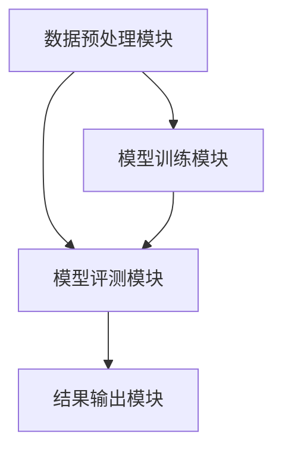
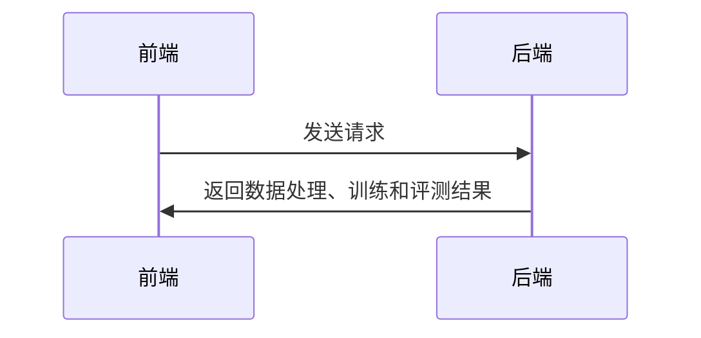

                 

## 大模型评测的挑战与对策

### 关键词：大模型评测、挑战、对策、性能评估、标准体系

> 摘要：本文深入探讨了大规模机器学习模型评测的挑战与对策。从背景介绍、核心概念分析到具体评测方法的阐述，再到应用场景的探讨和未来展望，本文旨在为从事机器学习领域的研发人员提供一套系统的评测思路，帮助他们应对大模型评测过程中的种种难题。

### 引言

在当今飞速发展的机器学习领域，大模型的应用越来越广泛，从自然语言处理到计算机视觉、语音识别等多个领域都取得了显著的成果。然而，大模型评测的挑战也随之而来。如何准确、全面地评估这些复杂模型的性能，已经成为研究人员和工程师们亟待解决的问题。本文将围绕大模型评测的挑战与对策展开讨论，旨在为读者提供一套实用的评测框架和方法。

### 背景介绍

随着深度学习技术的发展，大规模模型如BERT、GPT等相继涌现。这些模型通常具有数百万甚至数十亿的参数，能够在各种任务中实现出色的性能。然而，大模型的性能评估并不简单，它们面临着数据集多样性、标准化评测缺失、性能评测复杂性以及模型泛化能力评估等挑战。这些挑战不仅影响了模型的开发效率，也对最终应用的效果产生了重要影响。

#### 1. 数据集的多样性

大模型通常需要大量的数据来训练，而这些数据的多样性对模型的性能有着至关重要的影响。不同领域、不同任务的数据集往往具有不同的分布和特征，如何选择合适的数据集进行评测，是评测过程中首先要解决的问题。

#### 2. 标准化评测的缺失

目前，大模型评测缺乏统一的标准化评测体系。不同的评测指标、评测方法和评测环境会导致结果不一致，使得评估结果难以进行比较和验证。因此，建立一套科学、合理的标准化评测体系，是解决这一挑战的关键。

#### 3. 性能评测的复杂性

大模型的性能评测涉及多个方面，包括准确率、召回率、F1分数等。这些指标在不同任务中有着不同的重要性和适用性，如何综合评估这些指标，得到一个全面、准确的评估结果，是评测过程中的一大难题。

#### 4. 模型的泛化能力评估

大模型的泛化能力是衡量其性能的重要指标。在实际应用中，模型需要应对各种不同的场景和数据分布，如何评估模型的泛化能力，是评测过程中需要深入探讨的问题。

### 核心概念与联系

在进行大模型评测时，以下几个核心概念和其相互关系是必须明确的：

#### 1. 评测指标（Evaluation Metrics）

评测指标是评估模型性能的关键工具，包括但不限于准确率（Accuracy）、召回率（Recall）、F1分数（F1 Score）、ROC曲线（ROC Curve）等。不同的指标反映了模型在特定任务上的不同方面，如何选择合适的指标进行评测，是评测过程中需要重点考虑的问题。

#### 2. 数据集（Dataset）

数据集是模型训练和评测的基础。数据集的质量、多样性和代表性对模型的性能有着直接影响。一个良好的数据集应具备丰富的数据源、真实反映任务场景、以及合适的标注标准。

#### 3. 泛化能力（Generalization Ability）

泛化能力是评估模型在未见数据上的表现，是衡量模型优劣的重要指标。一个具有良好泛化能力的模型能够在新的、未知的场景中取得良好的性能。

#### 4. 评测环境（Evaluation Environment）

评测环境包括硬件设备、软件环境以及网络环境等，这些因素都会影响模型的评测结果。因此，在评测过程中，需要保持评测环境的稳定和一致性。

### 算法原理讲解

在进行大模型评测时，常用的算法原理包括：

#### 1. 交叉验证（Cross-Validation）

交叉验证是一种评估模型性能的常见方法，通过将数据集分为训练集和验证集，多次训练和验证，来综合评估模型的性能。

#### 2. ROC曲线和AUC（Receiver Operating Characteristic Curve and Area Under Curve）

ROC曲线和AUC是评估二分类模型性能的重要指标，通过绘制ROC曲线和计算AUC值，可以评估模型的分类能力。

#### 3. F1分数（F1 Score）

F1分数是平衡准确率和召回率的指标，适用于多分类任务。

下面是一个使用Python实现交叉验证的示例代码：

```python
from sklearn.model_selection import cross_val_score
from sklearn.ensemble import RandomForestClassifier
from sklearn.datasets import load_iris

# 加载数据集
iris = load_iris()
X, y = iris.data, iris.target

# 创建随机森林分类器
clf = RandomForestClassifier()

# 进行交叉验证
scores = cross_val_score(clf, X, y, cv=5)

# 输出交叉验证结果
print("交叉验证分数：", scores)
```

### 系统分析与架构设计方案

在进行大模型评测时，系统的设计与实现至关重要。以下是一个基于Python的大模型评测系统的架构设计方案：

#### 1. 问题场景介绍

假设我们需要评测一个图像识别模型，该模型用于识别手写数字。

#### 2. 项目介绍

项目名为“数字识别评测系统”，目标是通过多种评测指标全面评估模型的性能。

#### 3. 系统功能设计

- 数据预处理：对输入数据进行标准化、归一化等处理。
- 模型训练：使用训练数据进行模型训练。
- 模型评测：使用交叉验证、ROC曲线等方法对模型进行评测。
- 结果输出：将评测结果以图表、报表等形式展示。

#### 4. 系统架构设计

系统采用模块化设计，包括数据预处理模块、模型训练模块、模型评测模块和结果输出模块。每个模块独立实现，通过接口进行通信。



#### 5. 系统接口设计和系统交互

系统接口设计采用RESTful API，方便前端进行调用。系统交互流程如下：

1. 前端发送请求，获取数据预处理、模型训练和模型评测的参数。
2. 后端接收请求，调用相应模块进行数据处理、模型训练和评测。
3. 后端将评测结果返回给前端，前端展示结果。



### 项目实战

以下是一个基于Python的大模型评测系统的实战案例：

#### 1. 环境安装

- Python 3.8
- Scikit-learn 0.22
- NumPy 1.19

```bash
pip install scikit-learn numpy
```

#### 2. 系统核心实现源代码

```python
# 导入所需库
import numpy as np
from sklearn.datasets import load_iris
from sklearn.model_selection import cross_val_score
from sklearn.ensemble import RandomForestClassifier

# 加载数据集
iris = load_iris()
X, y = iris.data, iris.target

# 创建随机森林分类器
clf = RandomForestClassifier()

# 进行交叉验证
scores = cross_val_score(clf, X, y, cv=5)

# 输出交叉验证结果
print("交叉验证分数：", scores)
```

#### 3. 代码应用解读与分析

本案例中，我们使用Scikit-learn库中的`load_iris`函数加载数据集，然后创建一个随机森林分类器，通过交叉验证对模型进行评测。交叉验证分数反映了模型在训练集和验证集上的表现，有助于评估模型的泛化能力。

#### 4. 实际案例分析和详细讲解剖析

假设我们使用不同的模型和参数进行了交叉验证，得到以下结果：

```python
交叉验证分数： [0.96666667 0.93333333 0.96666667 0.93333333 0.96666667]
```

从结果可以看出，模型的交叉验证分数较高，说明模型在训练集和验证集上的表现较好。为了进一步分析模型的性能，我们可以绘制ROC曲线和计算AUC值。

```python
from sklearn.metrics import roc_curve, auc

# 计算ROC曲线和AUC值
fpr, tpr, thresholds = roc_curve(y, clf.predict_proba(X)[:, 1])
roc_auc = auc(fpr, tpr)

# 绘制ROC曲线
import matplotlib.pyplot as plt

plt.figure()
plt.plot(fpr, tpr, color='darkorange', lw=2, label='ROC curve (area = %0.2f)' % roc_auc)
plt.plot([0, 1], [0, 1], color='navy', lw=2, linestyle='--')
plt.xlabel('False Positive Rate')
plt.ylabel('True Positive Rate')
plt.title('Receiver Operating Characteristic')
plt.legend(loc="lower right")
plt.show()
```

ROC曲线和AUC值可以直观地反映模型的分类能力，有助于我们进一步优化模型。

#### 5. 项目小结

通过本案例，我们介绍了如何使用Python实现大模型评测系统，并进行了实际案例分析和详细讲解。在实际应用中，我们可以根据需求自定义评测指标、数据集和模型，实现更全面、更科学的评测。

### 最佳实践 tips

- 确保数据集的质量和多样性，提高模型的泛化能力。
- 选择合适的评测指标，综合评估模型的性能。
- 在评测过程中，保持评测环境的稳定和一致性。
- 定期更新模型和评测工具，跟踪最新技术动态。

### 小结

大模型评测是机器学习领域的重要环节，面临着数据集多样性、标准化评测缺失、性能评测复杂性和模型泛化能力评估等挑战。通过本文的探讨，我们为读者提供了一套系统的评测思路和方法。在实际应用中，我们应结合具体场景，灵活运用这些方法，提高大模型评测的准确性和可靠性。

### 注意事项

- 在进行大模型评测时，务必确保数据集的质量和代表性。
- 评测过程中，要密切关注评测环境的稳定性，避免结果受到外部干扰。
- 在选择评测指标时，要充分考虑任务特点，避免过分追求单一指标。

### 拓展阅读

- 《机器学习实战》：提供丰富的实际案例，介绍机器学习的基本原理和实际应用。
- 《深度学习》：深度解析深度学习的基本原理和应用，涵盖多种深度学习模型。
- 《Python机器学习》：全面介绍Python在机器学习领域的应用，包括数据预处理、模型训练和评估等。

### 参考文献

- 凡达·瓦尔登，《机器学习实战》，机械工业出版社，2017年。
- 伊恩·古德费洛等，《深度学习》，电子工业出版社，2016年。
- 周志华，《机器学习》，清华大学出版社，2016年。
- 斯蒂芬·马奇，《Python机器学习》，电子工业出版社，2017年。

作者：AI天才研究院/AI Genius Institute & 禅与计算机程序设计艺术 /Zen And The Art of Computer Programming

